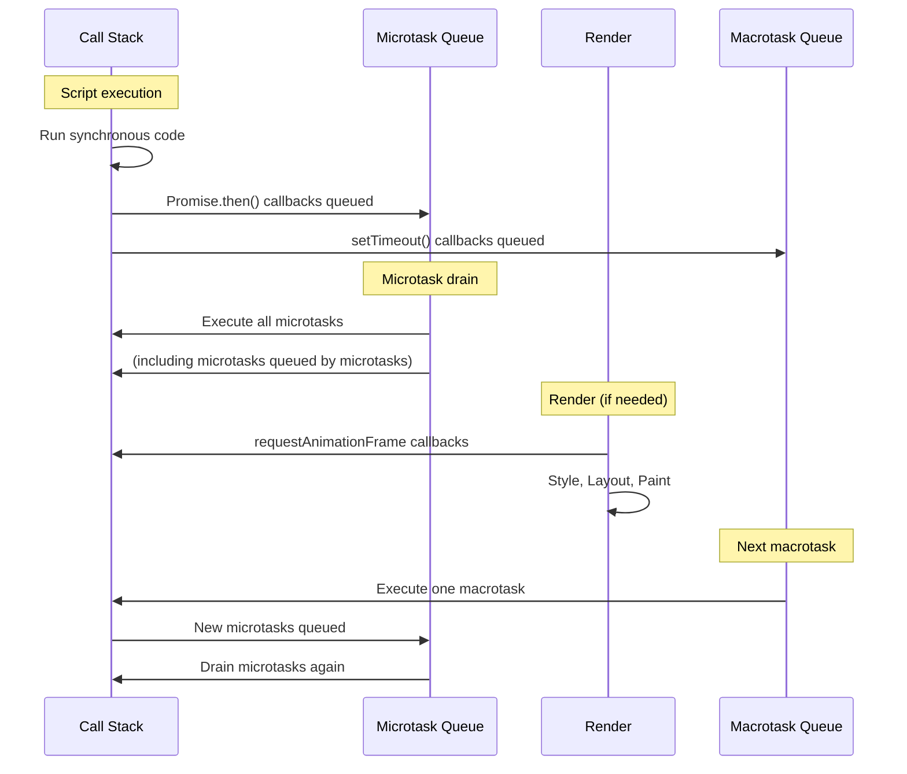

# [FEE-301] Event Loop & Async Model

:::info
JavaScript executes on a single thread. The event loop is the mechanism that coordinates execution of synchronous code, microtasks (Promises), macrotasks (setTimeout, I/O), and rendering updates.
:::

## Context

Browsers run JavaScript on a single main thread that also handles layout, paint, and user input. Understanding the event loop is critical because it determines when your code runs relative to rendering and user interaction. Misunderstanding task scheduling leads to janky UIs, race conditions, and subtle bugs that are hard to reproduce.

You are building a file upload feature where progress updates should display smoothly during the upload. The initial implementation updates a progress bar in a loop inside the upload handler, but the UI never updates. It freezes until the upload completes, then jumps to 100%. The freeze happens because all the updates run synchronously in the call stack, blocking the browser's rendering cycle. Moving updates through the event loop (using `setTimeout`, `requestAnimationFrame`, or async callbacks) gives the browser opportunities to render between updates.

## Best Practices

**Never block the main thread with long synchronous work.** The call stack must run to completion before the browser can process input or paint. Engineers MUST offload heavy computation to Web Workers or break it into incremental chunks using `scheduler.yield()` or `requestIdleCallback()` so the thread stays responsive.

**Prefer microtasks over macrotasks when ordering guarantees matter.** `Promise.resolve().then()` and `queueMicrotask()` execute before the next macrotask and before any rendering step. Engineers SHOULD use these APIs when a deferred action must complete before the browser has a chance to paint or pick up the next timer callback.

**Use requestAnimationFrame for visual updates, not setTimeout.** `requestAnimationFrame` fires after microtasks drain and before the browser's layout and paint step, making it the correct hook for DOM mutations that need to appear on the current frame. Engineers SHOULD NOT use `setTimeout(fn, 0)` for visual work. It is a macrotask and runs in a later event loop iteration, potentially after an unrelated paint has already occurred.

**Ensure microtask chains always terminate.** Because the microtask queue drains completely before the browser can render, a microtask that keeps enqueuing new microtasks will starve the rendering pipeline indefinitely. Engineers MUST design async chains so they reach a settled state rather than looping unboundedly.

## Visual



## Example

```js
console.log('1: synchronous');

setTimeout(() => {
  console.log('5: macrotask');
}, 0);

Promise.resolve().then(() => {
  console.log('3: microtask');
}).then(() => {
  console.log('4: chained microtask');
});

console.log('2: synchronous');

// Output order: 1, 2, 3, 4, 5
```

**Why this order matters:** The synchronous code (1, 2) runs first as part of the current call stack. Promise `.then()` callbacks (3, 4) are microtasks, so they drain before the event loop moves on. `setTimeout` (5) is a macrotask, so it waits for the next iteration.

## Deep Dive

### Call Stack and Queue Interactions

When the JavaScript engine starts executing a script, all synchronous statements run on the **call stack**. The call stack is a LIFO structure; functions push frames onto it and pop them when they return. The event loop only checks the queues once the call stack is completely empty.

### Microtask Queue

Sources: `Promise.then()` / `.catch()` / `.finally()`, `queueMicrotask()`, `MutationObserver` callbacks.

The microtask queue has a special property: it **drains completely** before the runtime picks the next macrotask. This is a recursive guarantee: if a microtask enqueues another microtask, that new microtask also runs before any macrotask. The algorithm is effectively:

> After each task: while the microtask queue is non-empty, dequeue and run one microtask. Repeat until the queue is empty, then proceed.

This is why chained `.then()` calls all resolve before any `setTimeout` callback fires, regardless of how long the chain is.

### Macrotask Queue

The following sources apply to browsers unless otherwise noted: `setTimeout`, `setInterval`, `setImmediate` (Node.js), `MessageChannel`, I/O callbacks, UI event callbacks.

Only **one macrotask** executes per event loop iteration. After it completes, microtasks drain again before the next macrotask is dequeued. This means a burst of `setTimeout` calls does not execute back-to-back without interruption. Microtasks can interleave between them.

### Ordering Example

```js
// Why does 'micro' always print before 'macro', even with 0 ms delay?

setTimeout(() => console.log('macro'), 0);
Promise.resolve().then(() => console.log('micro'));

// Output:
// micro
// macro
```

`setTimeout(..., 0)` does not mean "run at the same time as the current script." It means "schedule a macrotask to run in the next available event loop iteration, after a minimum delay of 0 ms." The Promise `.then()` callback, however, is a microtask that is processed during the current iteration's microtask drain, which happens before the runtime dequeues the next macrotask. The 0 ms delay is a lower bound, not a priority signal.

### requestAnimationFrame Positioning

`requestAnimationFrame` callbacks are not part of the microtask queue or the macrotask queue. They execute after macrotask execution and after the subsequent microtask drain, but **before** the browser's style recalculation, layout, and paint step. This makes `requestAnimationFrame` the correct place to batch DOM mutations intended for the current frame: changes made there are guaranteed to be visible to the layout engine before the next paint.

```
[macrotask] → [microtask drain] → [rAF callbacks] → [style/layout/paint] → [next macrotask] → …
```

## Common Mistakes

**Infinite microtask loops.** A microtask that queues another microtask will starve rendering. The microtask queue must drain completely before the browser can paint. Always ensure microtask chains terminate.

**Mixing async patterns inconsistently.** Combining callbacks, Promises, and async/await without understanding their scheduling behavior leads to unpredictable execution order. Prefer async/await for readability, but understand it desugars to Promise microtasks.

## Related FEEs

- [FEE-300](300.md) JavaScript Core & Runtime Overview
- [FEE-302](302.md) Closures & Scope Chain

## References

- [HTML Living Standard: Event loops](https://html.spec.whatwg.org/multipage/webappapis.html#event-loops)
- [MDN: Event loop](https://developer.mozilla.org/en-US/docs/Web/JavaScript/Event_loop)
- [MDN: queueMicrotask](https://developer.mozilla.org/en-US/docs/Web/API/queueMicrotask)
- [Jake Archibald: Tasks, microtasks, queues and schedules](https://jakearchibald.com/2015/tasks-microtasks-queues-and-schedules/)
