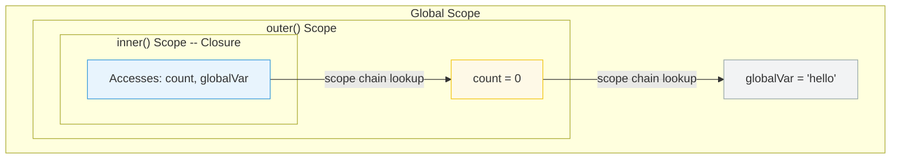

# [FEE-302] Closures & Scope Chain

:::info
A closure is a function that retains access to variables from its lexical scope, even after the outer function has returned. The scope chain is the mechanism JavaScript uses to resolve variable references.
:::

## Context

Closures are one of JavaScript's most powerful features and one of its most misunderstood. They enable data privacy, partial application, event handler binding, and memoization. They also cause memory leaks when developers do not realize that a closure keeps its entire enclosing scope alive. Understanding closures requires understanding the scope chain -- how JavaScript resolves variable names at runtime.

## Scenario

You are adding event listeners to a list of buttons generated in a loop, but every button's handler logs the same index — the last one — regardless of which button was clicked. The bug is a classic closure problem: all handlers close over the same variable, which has been incremented by the time any handler runs. Understanding how closures capture references rather than values, and how to use block scope or factory functions to create independent bindings, resolves the entire class of loop-closure bugs.

## Design Thinking

### What makes a closure

A closure is formed whenever a function retains a reference to a lexical environment that outlives
the function call that created it. The most visible case is a function returned from another
function: after the outer call returns, its local environment would normally become unreachable
and eligible for garbage collection, but because the returned inner function holds a reference to
it, the environment stays alive. The inner function is the closure; the environment it holds onto
is the "closed-over" scope.

Three conditions must be satisfied for a closure to form: a function must be defined inside another
scope; it must reference at least one variable from that enclosing scope; and it must outlive the
activation of that scope (usually by being stored and called later). If all three are present, a
closure is formed whether or not the programmer intended one. This is why closures appear in event
listeners, `setTimeout` callbacks, promise handlers, and any other pattern where a function is
created in one context and invoked in another.

### Binding versus value semantics

The most consequential property of closures is that they capture bindings, not values. A binding
is the association between a name and a storage cell. When a closure captures a binding, it holds
a reference to the storage cell itself, not a copy of whatever value was in that cell at the
moment the closure was created. Any subsequent write to that binding — whether by the outer
function, by the closure itself, or by any other function in the same scope — is immediately
visible to all closures that share the same binding.

This distinguishes JavaScript closures from language features that appear superficially similar.
A captured `const` binding is effectively read-only from the closure's perspective because `const`
prevents reassignment, but the binding mechanics are identical: the closure still holds a
reference to the environment record, not a copied value. The immutability guarantee comes from
the `const` keyword, not from the closure mechanism.

### Scope chain resolution

When a variable reference is evaluated, the engine looks up the identifier in the current
function's environment record. If the identifier is not found there, the lookup continues in the
outer environment (captured at definition time), then the outer environment's outer environment,
and so on up to the global scope. This chain of outer-environment references is the scope chain.
The chain is fixed at definition time: it follows lexical nesting in the source code, not the
dynamic call stack at invocation time.

This lexical scoping model means that a function carries its scope context with it wherever it
goes. Passing a function as an argument to another function does not change which scope chain it
uses. Calling a function from a completely different module does not change which identifiers it
can see. The scope chain is determined entirely by where the function was written, not by where or
how it is called. This predictability is what makes closures a reliable encapsulation tool: a
module can return functions that access private state, and no external caller can access that state
by any means other than the returned interface.

### The cost of closures

Closures impose a small runtime cost relative to plain function calls: the engine must allocate an
environment record object for the captured scope, and that object must be kept alive as long as any
closure references it. In practice, modern JavaScript engines perform escape analysis and other
optimizations that can allocate environments on the stack rather than the heap when the compiler
can prove that the environment does not outlive the current call frame. However, when a closure
genuinely escapes — by being stored in a variable, returned, or passed as a callback — the
environment must be heap-allocated and managed by the garbage collector.

For the vast majority of application code, the cost of closures is negligible. For
performance-sensitive code paths — tight rendering loops, high-frequency event handlers, numeric
processing of large arrays — unnecessary closure creation adds allocation pressure. The practical
guideline is to define functions at module scope when they do not need to close over any local
state, and to form closures only when the captured state is genuinely required by the function.

## Best Practices

**Use `let` or `const` in loops, never `var`.** When a closure is created inside a loop, `var` is function-scoped, so every iteration shares a single binding. By the time callbacks execute, that binding holds the final value. `let` and `const` are block-scoped: each loop iteration gets its own binding, so each closure captures an independent value. Engineers MUST prefer `let`/`const` for any loop variable that a closure may capture.

**Be explicit about which variables a closure captures.** A closure retains a reference to the entire lexical environment where it was created -- not just the variables it visibly uses. Engineers SHOULD minimize the set of variables in scope at the point where a closure is defined, and SHOULD prefer extracting only the specific values a closure needs rather than closing over large objects or entire outer scopes.

**Avoid unintentional closure memory retention.** As MDN states, "it is unwise to unnecessarily create functions within other functions if closures are not needed for a particular task, as it will negatively affect script performance both in terms of processing speed and memory consumption." Engineers MUST audit long-lived closures (event listeners, module-level caches, timers) to ensure they do not inadvertently hold large objects alive. When a captured reference is no longer needed, set it to `null` or restructure so the closure only captures the minimal data required.

**MUST understand that closures capture the variable binding, not the value at the time of closure creation, and that every variable in the enclosing scope remains reachable as long as the closure is alive.** A closure does not snapshot the values of variables it references; it holds a live reference to the lexical environment object where it was created. If a captured variable is later mutated, the closure sees the updated value, not the value from the moment the closure was created. Equally, because the closure holds a reference to the entire environment, every variable declared in the enclosing scope — including those the closure never reads — is kept alive by the garbage collector for as long as the closure itself is reachable. These two consequences — live binding semantics and full scope retention — are the root cause of the most common closure-related bugs: the loop variable sharing bug, and unintentional memory leaks from long-lived callbacks.

**SHOULD use closures intentionally for data privacy, partial application, and callback binding rather than as an incidental side effect of nesting functions.** Data privacy is achieved by returning a function or object from an outer function, leaving the outer variables accessible only through the returned interface and not directly from the outside. Partial application is achieved by returning a function that captures some arguments and accepts the remaining ones later, enabling the creation of specialized functions from general ones without repeating the fixed argument at every call site. Callback binding is achieved by forming a closure over the relevant state at the time the callback is registered, ensuring the callback has access to that state when it is eventually invoked — even if the state is no longer in scope at the call site. Using closures for these recognized patterns makes the intent explicit and the resulting code predictable.

## Visual



## Example

**Closure for data privacy:**

```js
function createCounter() {
  let count = 0; // private -- not accessible outside

  return {
    increment() { return ++count; },
    decrement() { return --count; },
    getCount() { return count; },
  };
}

const counter = createCounter();
counter.increment(); // 1
counter.increment(); // 2
counter.getCount();  // 2
// count is not accessible directly -- only through the returned methods
```

**The classic loop pitfall:**

```js
// Bug: all callbacks log 3
for (var i = 0; i < 3; i++) {
  setTimeout(() => console.log(i), 100);
}
// Output: 3, 3, 3 (var is function-scoped, closure captures the binding)

// Fix: use let (block-scoped, creates new binding per iteration)
for (let i = 0; i < 3; i++) {
  setTimeout(() => console.log(i), 100);
}
// Output: 0, 1, 2
```

**Partial application:**

```js
function multiply(a) {
  return function (b) {
    return a * b;
  };
}

const double = multiply(2);
const triple = multiply(3);

double(5);  // 10
triple(5);  // 15
```

**Memoization using closure:**

```js
function memoize(fn) {
  const cache = new Map(); // captured by the returned closure

  return function (...args) {
    const key = JSON.stringify(args);
    if (cache.has(key)) {
      return cache.get(key);
    }
    const result = fn(...args);
    cache.set(key, result);
    return result;
  };
}

const expensiveCalc = memoize((n) => {
  // simulate expensive work
  return n * n;
});

expensiveCalc(5);  // 25 (computed)
expensiveCalc(5);  // 25 (from cache)
expensiveCalc(6);  // 36 (computed)
// cache persists for the lifetime of the memoized function reference
```

**Sharing state between closures in the same scope:**

```js
function makeAdderPair() {
  let shared = 0; // single binding shared by both closures

  return {
    add(n) { shared += n; },
    getTotal() { return shared; },
  };
}

const pair = makeAdderPair();
pair.add(5);
pair.add(3);
pair.getTotal(); // 8 -- both methods see the same binding
```

## Deep Dive

### Lexical environments and the scope chain

JavaScript's scoping model is built on the concept of a lexical environment: a record that maps identifier names to their current values, plus a reference to the outer environment. When a function is defined, the JavaScript engine associates it with the lexical environment that was active at the point of definition. When the function is later invoked, a new lexical environment is created for that invocation, and its outer reference points to the environment that was captured at definition time. Variable lookups walk this chain of outer references until the identifier is found or the global scope is reached — this chain is what is meant by the "scope chain."

A closure is formed whenever a function retains a reference to a lexical environment that outlives the function call that created it. The most common case is a function returned from another function: after the outer call returns, its local environment would normally become unreachable and eligible for garbage collection, but because the returned inner function holds a reference to it, the environment is kept alive. The inner function is the closure; the environment it retains is the "closed-over" scope.

The scope chain is not copied at closure creation — it is shared. The inner function holds a live reference to the actual environment record, not a frozen snapshot. This means that mutations to the outer environment after the closure is created are visible to the closure, and conversely, mutations the closure makes to the environment (by assigning to captured variables) are visible to any other function that holds a reference to the same environment. Two closures created in the same scope share the same environment and therefore see each other's mutations.

### The `var`-in-loop closure bug

The loop pitfall is a direct consequence of how `var` scoping interacts with closures. When you write a `for` loop with `var`, the loop variable is hoisted to the enclosing function scope -- there is only one binding for the entire loop. Every closure created inside the loop body closes over that same single binding. MDN describes this precisely: "Because the loop has already run its course by that time, the `item` variable object (shared by all three closures) has been left pointing to the last entry."

`let` solves this because block scoping means each iteration of the loop body is a distinct block scope, giving each closure its own independent binding. MDN confirms: "Every closure binds the block-scoped variable, meaning that no additional closures are required." This is also why `const` works in `for...of` loops: each iteration is a fresh binding, not a mutation of a shared one.

The pattern generalizes beyond loops. Any time multiple closures are created within the same environment and share a variable that is mutated after closure creation, each closure will observe the mutation. This arises in event listener setup, factory functions with shared state, and module initialization code that registers multiple callbacks over a shared counter or flag. Recognizing when closures share an environment versus when each gets its own binding is the essential diagnostic skill for this category of bug.

### How closures retain the entire scope chain

MDN defines a closure as "the combination of a function bundled together (enclosed) with references to its surrounding state (the lexical environment)." The key word is *references* -- a closure does not copy the variables it uses; it holds a live reference to the environment object in which it was created.

Because the environment object is shared between the closure and the outer function, any variable in that environment is reachable as long as the closure is reachable. If the outer function returns and nothing else holds a reference to its local variables except the closure, those variables are kept alive solely by the closure. If that closure is itself stored in a long-lived location (a module-level variable, a DOM event listener, a `setInterval` callback), the entire captured environment persists for the lifetime of that reference.

This also cascades up the scope chain. A closure captures its immediate environment, which in turn may reference outer environments, forming a chain. A deeply nested closure therefore implicitly retains every environment in that chain. A closure defined inside a callback inside a module factory function implicitly keeps the module factory's environment alive — even if the module was created once at startup and the factory function itself is no longer referenced anywhere else.

### Memory implications

Because the garbage collector uses a mark-and-sweep algorithm -- tracing reachability from roots -- any variable reachable through a live closure reference will not be collected. This means a closure that captures a reference to a large object (e.g., a DOM node, a large array, a full API response) keeps that object in memory for as long as the closure exists, even if the closure never actually accesses that variable again after initialization.

Practical consequences:
- Event listeners attached to DOM elements that are later removed from the document can retain entire component trees if their callback closures capture references to those elements.
- Module-level caches that store closures (e.g., memoization maps) will accumulate memory over time if keys are never evicted.
- Timers created with `setInterval` that capture outer-scope references keep those references alive until the timer is cleared.

The mitigation is to structure closures so they capture only what they need: extract specific primitive values or small data structures rather than closing over entire outer objects, and explicitly release references (set to `null` or remove listeners) when a closure is no longer required.

A particularly subtle memory issue arises with closures that capture a variable referring to a large object, even when the closure never reads that variable. Some JavaScript engines optimize this case by not including unused variables in the closure's retained environment, but this optimization is not guaranteed by the specification and cannot be relied upon for correctness. The safe approach is structural: define closures only in scopes where the minimum necessary data is in scope. If a large object is needed only during initialization and not for later invocations of the closure, extract the relevant primitive values before forming the closure, and avoid defining the closure inside the initialization scope.

### Closures and module patterns

Before ES modules, closures were the primary mechanism for creating module-like encapsulation in JavaScript. The immediately invoked function expression (IIFE) pattern uses a closure to create a private scope: state that should not be globally accessible is declared inside the IIFE, and only the public interface is returned. The result is a singleton object whose internal state is inaccessible from outside except through the returned methods.

ES modules replicate this pattern at the language level: each module file is a closed scope, and only explicitly exported names are accessible to importers. The module's internal state is effectively a module-level closure. Understanding that ES modules are conceptually closures at the file level helps explain their semantics: two imports of the same module see the same state because they reference the same module-level environment — a single shared lexical environment, just like two closures sharing a `var`-scoped variable in a loop.

### Closures in functional programming patterns

Closures are the enabling mechanism for several functional programming patterns that are increasingly common in modern JavaScript. Currying transforms a multi-argument function into a chain of single-argument functions; each step in the chain returns a closure that captures the arguments received so far. Memoization wraps a function in a closure that captures a cache map; the wrapper checks the cache before calling the original and stores the result after. Composing functions with `pipe` or `compose` utilities relies on closures to capture each function in the pipeline and invoke them in sequence.

These patterns are not merely academic. `useCallback` in React returns a memoized callback that is a closure over the component's current state and props. Redux thunks are closures over the action creator's arguments. Middleware in Express and similar frameworks is a function that returns a closure over the middleware-specific configuration. The ability to reason clearly about what each closure captures, and for how long those captured references remain live, is a prerequisite for writing correct code in these patterns.

## Common Mistakes

**Unintentional memory retention.** A closure over a large object keeps that object alive as long as the closure exists. If the closure is attached to a long-lived event listener or stored in a cache, the large object cannot be garbage-collected. Solution: null out references you no longer need, or restructure to only close over the specific values required. A common variant of this mistake is adding an event listener inside a method that creates a closure over `this`, where `this` is a large component instance or service object; removing the element from the DOM does not sever the listener if the listener was added on a parent or the document itself.

**Assuming closures copy values.** Closures capture variable bindings, not snapshots. If the outer variable changes after the closure is created, the closure sees the new value. This is a feature (it enables counters and accumulators) but a bug when you expect a frozen value. The fix is to copy the value into a new `const` binding before creating the closure, so the closure captures the new binding rather than the mutable original. This pattern is especially important when forming closures inside loops or in factory functions that reuse a shared mutable variable.

**Mistaking a function's definition scope for its execution scope.** Closures are formed at definition time, not at call time. A function passed as a callback to a library does not gain access to the library's internal scope; it retains the scope where it was written. Developers sometimes expect a callback to access variables "from the framework" that were not passed as arguments. This is impossible through closure — closures are strictly one-directional: the function retains its own definition scope and can only access the caller's scope if the caller passed explicit references through arguments.

**Creating closures in hot loops unnecessarily.** Every time a function is defined inside a loop body, a new closure is created. If the function does not actually need to close over any loop-local variable — for example, it calls a fixed utility function with no per-iteration state — it is more efficient to define the function outside the loop and reference it by name. JavaScript engines can optimize static function references more aggressively than freshly created closure objects. The practical performance difference is negligible in most code, but in performance-critical rendering loops or tight data-processing routines, unnecessary closure creation adds allocation pressure that the garbage collector must eventually reclaim.

**Relying on closure to share state across async boundaries without synchronization.** Closures enable two callbacks to share a variable, but if both callbacks can fire concurrently — for example, two event listeners on the same variable, or a timer and a user interaction handler — mutations to the shared variable are not atomic. In single-threaded JavaScript, interleaving only occurs at `await` boundaries or between separate event loop turns, so the risk is lower than in multithreaded environments, but it is not zero. Developers who share a flag or accumulator across multiple async callbacks must be explicit about the order of operations and what state the shared variable might be in at each continuation point.

## Related FEEs

- [FEE-300](300.md) JavaScript Core & Runtime Overview
- [FEE-301](301.md) Event Loop & Async Model
- [FEE-303](303.md) Prototypes & Inheritance
- [FEE-309](309.md) WeakMap & WeakSet (weak references for closure-held objects)
- [FEE-312](312.md) this Binding & Context Edge Cases
- [FEE-313](313.md) structuredClone & Deep Copy (closures cannot be cloned)

## References

- [MDN: Closures](https://developer.mozilla.org/en-US/docs/Web/JavaScript/Guide/Closures)
- [MDN: `let` -- Block scoping and per-iteration bindings](https://developer.mozilla.org/en-US/docs/Web/JavaScript/Reference/Statements/let)
- [MDN: Memory Management](https://developer.mozilla.org/en-US/docs/Web/JavaScript/Guide/Memory_management)
- [ECMA-262: Lexical Environments](https://tc39.es/ecma262/#sec-lexical-environments)
- [ECMA-262: GetIdentifierReference](https://tc39.es/ecma262/#sec-getidentifierreference)
- [JavaScript.info: Closure](https://javascript.info/closure)
- [JavaScript.info: Variable scope, closure](https://javascript.info/closure#closure)
- [Kyle Simpson: You Don't Know JS -- Scope & Closures](https://github.com/getify/You-Dont-Know-JS/blob/2nd-ed/scope-closures/README.md)
- [MDN: IIFE](https://developer.mozilla.org/en-US/docs/Glossary/IIFE)
- [MDN: Function.prototype.bind -- closure alternative for this binding](https://developer.mozilla.org/en-US/docs/Web/JavaScript/Reference/Global_Objects/Function/bind)
- [MDN: WeakRef -- managing closure-retained object lifetimes](https://developer.mozilla.org/en-US/docs/Web/JavaScript/Reference/Global_Objects/WeakRef)
