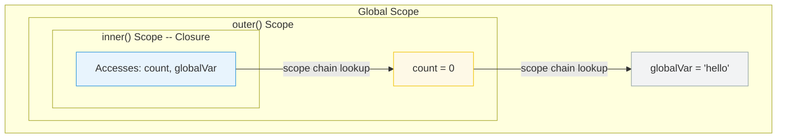

# [FEE-302] Closures & Scope Chain

:::info
A closure is a function that retains access to variables from its lexical scope, even after the outer function has returned. The scope chain is the mechanism JavaScript uses to resolve variable references.
:::

## Context

Closures are one of JavaScript's most powerful features and one of its most misunderstood. They enable data privacy, partial application, event handler binding, and memoization. They also cause memory leaks when developers do not realize that a closure keeps its entire enclosing scope alive. Understanding closures requires understanding the scope chain -- how JavaScript resolves variable names at runtime.

## Principle

Engineers MUST understand that closures capture the variable binding, not the value at the time of closure creation.

Engineers SHOULD use closures intentionally for:
- **Data privacy** -- encapsulating state that should not be directly accessible
- **Partial application** -- pre-filling arguments to create specialized functions
- **Callback binding** -- preserving context in asynchronous operations

Engineers MUST be aware that closures retain references to their entire enclosing scope. If a closure is long-lived (e.g., stored in a global, attached to a DOM event), every variable in scope is retained in memory.

## Visual



## Example

**Closure for data privacy:**

```js
function createCounter() {
  let count = 0; // private -- not accessible outside

  return {
    increment() { return ++count; },
    decrement() { return --count; },
    getCount() { return count; },
  };
}

const counter = createCounter();
counter.increment(); // 1
counter.increment(); // 2
counter.getCount();  // 2
// count is not accessible directly -- only through the returned methods
```

**The classic loop pitfall:**

```js
// Bug: all callbacks log 3
for (var i = 0; i < 3; i++) {
  setTimeout(() => console.log(i), 100);
}
// Output: 3, 3, 3 (var is function-scoped, closure captures the binding)

// Fix: use let (block-scoped, creates new binding per iteration)
for (let i = 0; i < 3; i++) {
  setTimeout(() => console.log(i), 100);
}
// Output: 0, 1, 2
```

**Partial application:**

```js
function multiply(a) {
  return function (b) {
    return a * b;
  };
}

const double = multiply(2);
const triple = multiply(3);

double(5);  // 10
triple(5);  // 15
```

## Common Mistakes

**Unintentional memory retention.** A closure over a large object keeps that object alive as long as the closure exists. If the closure is attached to a long-lived event listener or stored in a cache, the large object cannot be garbage-collected. Solution: null out references you no longer need, or restructure to only close over the specific values required.

**Closing over a loop variable with `var`.** This is the classic closure pitfall. `var` is function-scoped, so all iterations share the same binding. Use `let` (block-scoped) or an IIFE to create a new binding per iteration.

**Assuming closures copy values.** Closures capture variable bindings, not snapshots. If the outer variable changes after the closure is created, the closure sees the new value. This is a feature (it enables counters and accumulators) but a bug when you expect a frozen value.

## Related FEEs

- [FEE-300](300.md) JavaScript Core & Runtime Overview
- [FEE-301](301.md) Event Loop & Async Model

## References

- [MDN: Closures](https://developer.mozilla.org/en-US/docs/Web/JavaScript/Closures)
- [ECMA-262: Lexical Environments](https://tc39.es/ecma262/#sec-lexical-environments)
- [JavaScript.info: Closure](https://javascript.info/closure)
