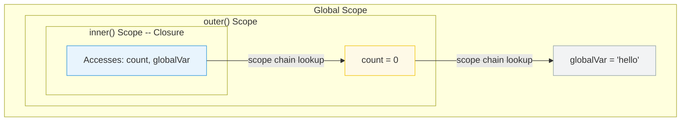

# [FEE-302] Closures & Scope Chain

:::info
A closure is a function that retains access to variables from its lexical scope, even after the outer function has returned. The scope chain is the mechanism JavaScript uses to resolve variable references.
:::

## Context

Closures are one of JavaScript's most powerful features and one of its most misunderstood. They enable data privacy, partial application, event handler binding, and memoization. They also cause memory leaks when developers do not realize that a closure keeps its entire enclosing scope alive. Understanding closures requires understanding the scope chain -- how JavaScript resolves variable names at runtime.

## Principle

Engineers MUST understand that closures capture the variable binding, not the value at the time of closure creation.

Engineers SHOULD use closures intentionally for:
- **Data privacy** -- encapsulating state that should not be directly accessible
- **Partial application** -- pre-filling arguments to create specialized functions
- **Callback binding** -- preserving context in asynchronous operations

Engineers MUST be aware that closures retain references to their entire enclosing scope. If a closure is long-lived (e.g., stored in a global, attached to a DOM event), every variable in scope is retained in memory.

## Best Practices

**Use `let` or `const` in loops, never `var`.** When a closure is created inside a loop, `var` is function-scoped, so every iteration shares a single binding. By the time callbacks execute, that binding holds the final value. `let` and `const` are block-scoped: each loop iteration gets its own binding, so each closure captures an independent value. Engineers MUST prefer `let`/`const` for any loop variable that a closure may capture.

**Be explicit about which variables a closure captures.** A closure retains a reference to the entire lexical environment where it was created -- not just the variables it visibly uses. Engineers SHOULD minimize the set of variables in scope at the point where a closure is defined, and SHOULD prefer extracting only the specific values a closure needs rather than closing over large objects or entire outer scopes.

**Avoid unintentional closure memory retention.** As MDN states, "it is unwise to unnecessarily create functions within other functions if closures are not needed for a particular task, as it will negatively affect script performance both in terms of processing speed and memory consumption." Engineers MUST audit long-lived closures (event listeners, module-level caches, timers) to ensure they do not inadvertently hold large objects alive. When a captured reference is no longer needed, set it to `null` or restructure so the closure only captures the minimal data required.

## Visual



## Example

**Closure for data privacy:**

```js
function createCounter() {
  let count = 0; // private -- not accessible outside

  return {
    increment() { return ++count; },
    decrement() { return --count; },
    getCount() { return count; },
  };
}

const counter = createCounter();
counter.increment(); // 1
counter.increment(); // 2
counter.getCount();  // 2
// count is not accessible directly -- only through the returned methods
```

**The classic loop pitfall:**

```js
// Bug: all callbacks log 3
for (var i = 0; i < 3; i++) {
  setTimeout(() => console.log(i), 100);
}
// Output: 3, 3, 3 (var is function-scoped, closure captures the binding)

// Fix: use let (block-scoped, creates new binding per iteration)
for (let i = 0; i < 3; i++) {
  setTimeout(() => console.log(i), 100);
}
// Output: 0, 1, 2
```

**Partial application:**

```js
function multiply(a) {
  return function (b) {
    return a * b;
  };
}

const double = multiply(2);
const triple = multiply(3);

double(5);  // 10
triple(5);  // 15
```

## Deep Dive

### The `var`-in-loop closure bug

The loop pitfall is a direct consequence of how `var` scoping interacts with closures. When you write a `for` loop with `var`, the loop variable is hoisted to the enclosing function scope -- there is only one binding for the entire loop. Every closure created inside the loop body closes over that same single binding. MDN describes this precisely: "Because the loop has already run its course by that time, the `item` variable object (shared by all three closures) has been left pointing to the last entry."

`let` solves this because block scoping means each iteration of the loop body is a distinct block scope, giving each closure its own independent binding. MDN confirms: "Every closure binds the block-scoped variable, meaning that no additional closures are required." This is also why `const` works in `for...of` loops: each iteration is a fresh binding, not a mutation of a shared one.

### How closures retain the entire scope chain

MDN defines a closure as "the combination of a function bundled together (enclosed) with references to its surrounding state (the lexical environment)." The key word is *references* -- a closure does not copy the variables it uses; it holds a live reference to the environment object in which it was created.

Because the environment object is shared between the closure and the outer function, any variable in that environment is reachable as long as the closure is reachable. If the outer function returns and nothing else holds a reference to its local variables except the closure, those variables are kept alive solely by the closure. If that closure is itself stored in a long-lived location (a module-level variable, a DOM event listener, a `setInterval` callback), the entire captured environment persists for the lifetime of that reference.

This also cascades up the scope chain. A closure captures its immediate environment, which in turn may reference outer environments, forming a chain. A deeply nested closure therefore implicitly retains every environment in that chain.

### Memory implications

Because the garbage collector uses a mark-and-sweep algorithm -- tracing reachability from roots -- any variable reachable through a live closure reference will not be collected. This means a closure that captures a reference to a large object (e.g., a DOM node, a large array, a full API response) keeps that object in memory for as long as the closure exists, even if the closure never actually accesses that variable again after initialization.

Practical consequences:
- Event listeners attached to DOM elements that are later removed from the document can retain entire component trees if their callback closures capture references to those elements.
- Module-level caches that store closures (e.g., memoization maps) will accumulate memory over time if keys are never evicted.
- Timers created with `setInterval` that capture outer-scope references keep those references alive until the timer is cleared.

The mitigation is to structure closures so they capture only what they need: extract specific primitive values or small data structures rather than closing over entire outer objects, and explicitly release references (set to `null` or remove listeners) when a closure is no longer required.

## Common Mistakes

**Unintentional memory retention.** A closure over a large object keeps that object alive as long as the closure exists. If the closure is attached to a long-lived event listener or stored in a cache, the large object cannot be garbage-collected. Solution: null out references you no longer need, or restructure to only close over the specific values required.

**Assuming closures copy values.** Closures capture variable bindings, not snapshots. If the outer variable changes after the closure is created, the closure sees the new value. This is a feature (it enables counters and accumulators) but a bug when you expect a frozen value.

## Related FEEs

- [FEE-300](300.md) JavaScript Core & Runtime Overview
- [FEE-301](301.md) Event Loop & Async Model

## References

- [MDN: Closures](https://developer.mozilla.org/en-US/docs/Web/JavaScript/Closures)
- [MDN: `let` -- Block scoping and per-iteration bindings](https://developer.mozilla.org/en-US/docs/Web/JavaScript/Reference/Statements/let)
- [MDN: Memory Management](https://developer.mozilla.org/en-US/docs/Web/JavaScript/Memory_management)
- [ECMA-262: Lexical Environments](https://tc39.es/ecma262/#sec-lexical-environments)
- [JavaScript.info: Closure](https://javascript.info/closure)
