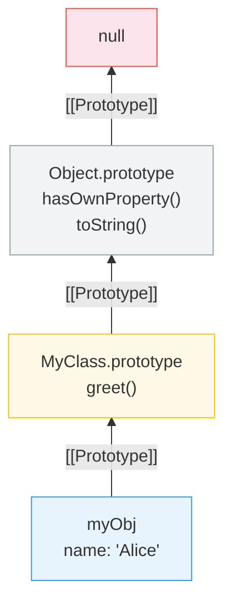

# [FEE-303] Prototypes & Inheritance

:::info
Every JavaScript object has a hidden link to another object called its prototype; property lookups walk this chain of links until a match is found or `null` is reached.
:::

## Context

JavaScript is one of the few mainstream languages built on prototypal inheritance rather than classical inheritance. Instead of defining classes as blueprints and stamping out copies, JavaScript objects delegate property access to other objects through an internal `[[Prototype]]` link. This mechanism underpins nearly everything in the language -- from how method calls work, to how the `class` syntax operates under the hood, to how built-in objects like `Array` and `Date` expose their APIs. Misunderstanding prototypes leads to accidental property shadowing, broken `instanceof` checks, and inheritance hierarchies that are difficult to maintain. A solid grasp of the prototype chain is essential for debugging, performance tuning, and making informed architectural choices in any JavaScript codebase.

## Design Thinking

**Why prototypal over classical?** When Brendan Eich designed JavaScript in 1995, he drew heavily from the Self programming language (1986), which pioneered prototype-based object systems. Self demonstrated that you do not need classes to achieve object-oriented programming -- objects can delegate behavior to other objects directly. This "delegation over copying" model is simpler in concept: create an object, link it to another object, and any property not found on the first is looked up on the second. There is no separate "class" entity; objects are the only abstraction. This made JavaScript lightweight and flexible, suitable for its original role as a scripting language for the web.

The `class` keyword, introduced in ES2015, does not change this fundamental model. It is syntactic sugar that sets up prototype chains behind the scenes. A `class Foo extends Bar` statement creates `Foo.prototype` with `[[Prototype]]` pointing to `Bar.prototype`, exactly as manual prototype wiring would. Understanding this is critical because `class` can create a false sense of classical inheritance -- but JavaScript never copies properties from parent to child. It only creates links.

**How frameworks handle component hierarchies:**

- **React** originally used class components that extend `React.Component`, relying on prototype inheritance for lifecycle methods. The shift to function components and Hooks eliminated inheritance entirely -- components are plain functions, and code reuse comes from composition (custom Hooks) rather than `extends`. This reflects the broader industry trend: prefer composition over inheritance.

- **Vue** followed a similar trajectory. The Options API used mixins for code sharing, which suffered from name collisions and implicit dependencies -- classic problems with inheritance-like patterns. The Composition API replaces mixins with composable functions, again favoring explicit composition.

- **Web Components** are the notable exception: custom elements _must_ extend `HTMLElement` (or a subclass). This is genuine prototype inheritance -- `class MyButton extends HTMLElement` creates a prototype chain linking `MyButton.prototype` to `HTMLElement.prototype` to `Element.prototype` to `Node.prototype` to `EventTarget.prototype` to `Object.prototype` to `null`. Understanding the prototype chain is not optional when working with Web Components.

## Best Practices

**Prefer `class` syntax over manual prototype manipulation.** The ES2015 `class` syntax produces the same prototype chain as hand-wiring `Constructor.prototype`, but it is substantially less error-prone. You SHOULD use `class` and `extends` for any inheritance-based design; AVOID directly assigning to `Constructor.prototype` or calling `Object.setPrototypeOf` on prototype objects after the fact, because doing so can break the `constructor` property and confuse tooling.

**Use `Object.create(null)` for pure dictionary objects.** When you need a plain key-value store with no inherited behavior, SHOULD create it with `Object.create(null)`. The resulting object has no `[[Prototype]]` link, so it does not inherit `hasOwnProperty`, `toString`, or any other `Object.prototype` method — eliminating the risk of key collisions with inherited property names that affect ordinary object literals.

**Never extend built-in prototypes in production code.** Adding properties to `Array.prototype`, `String.prototype`, or any other built-in prototype constitutes monkey patching. You MUST NOT do this in production, because a future language version may add an identically-named method with a different signature, silently breaking your code. The only acceptable exception is a polyfill that guards against the method already existing.

**Use `instanceof` and `Object.getPrototypeOf` for type checks — not ad-hoc property sniffing.** To verify that an object participates in a given prototype chain, SHOULD use `instanceof` (or `Object.getPrototypeOf(obj) === SomeClass.prototype` for single-step checks). AVOID checking for the presence of a duck-typed property when what you actually want to verify is structural identity, as that conflates interface compliance with lineage.

**Keep prototype chains shallow.** The engine traverses every link in the chain on each property access that is not found on the instance. SHOULD limit inheritance depth to three or four levels at most in performance-sensitive code; AVOID stacking many layers of `extends` when composition (mixing capabilities via plain functions or object spread) can achieve the same result with less overhead.

## Visual



**Property lookup for `myObj.toString()`:**
1. Check `myObj` own properties -- not found
2. Check `MyClass.prototype` -- not found
3. Check `Object.prototype` -- found, call it

## Example

**Prototype delegation with Object.create():**

```js
const animal = {
  speak() {
    return `${this.name} makes a sound.`;
  },
};

const dog = Object.create(animal);
dog.name = 'Rex';
dog.bark = function () {
  return `${this.name} barks.`;
};

dog.speak(); // "Rex makes a sound." -- delegated to animal
dog.bark();  // "Rex barks." -- own property

Object.getPrototypeOf(dog) === animal; // true
```

**Equivalent using class syntax:**

```js
class Animal {
  constructor(name) {
    this.name = name;
  }
  speak() {
    return `${this.name} makes a sound.`;
  }
}

class Dog extends Animal {
  bark() {
    return `${this.name} barks.`;
  }
}

const rex = new Dog('Rex');
rex.speak(); // "Rex makes a sound."
rex.bark();  // "Rex barks."

// Under the hood, the same prototype chain exists:
Object.getPrototypeOf(rex) === Dog.prototype;           // true
Object.getPrototypeOf(Dog.prototype) === Animal.prototype; // true
```

**Composition alternative (no inheritance):**

```js
function withSpeaking(obj) {
  obj.speak = function () {
    return `${this.name} makes a sound.`;
  };
  return obj;
}

function withBarking(obj) {
  obj.bark = function () {
    return `${this.name} barks.`;
  };
  return obj;
}

const rex = withBarking(withSpeaking({ name: 'Rex' }));
rex.speak(); // "Rex makes a sound."
rex.bark();  // "Rex barks."

// No prototype chain involved -- all properties are own properties
```

**instanceof and Symbol.hasInstance:**

```js
class Validator {
  static [Symbol.hasInstance](instance) {
    return typeof instance.validate === 'function';
  }
}

const form = { validate() { return true; } };
form instanceof Validator; // true -- custom check, no prototype link needed
```

## Deep Dive

**Prototype chain lookup mechanics.** When you read a property, the engine first checks whether the instance has that property as an own property. If not, it follows the `[[Prototype]]` link to the next object in the chain and repeats the check. This continues — instance → prototype → prototype's prototype → `Object.prototype` → `null` — until a match is found or the chain is exhausted and `undefined` is returned. MDN notes that "trying to access nonexistent properties will always traverse the full prototype chain," making the cost of a cache miss proportional to chain depth.

**Property shadowing.** Setting a property directly on an instance does NOT modify any object in its prototype chain. Instead, the engine creates a new own property on the instance itself, which "shadows" the prototype's version of that property. Reads on the instance then resolve to the own property without ever reaching the prototype. To inspect whether a given property is own or inherited, use `Object.hasOwn(obj, key)` (modern) or `obj.hasOwnProperty(key)` (legacy).

## Common Mistakes

**Confusing `.prototype` with `[[Prototype]]`.** The `.prototype` property exists only on functions and is the object that becomes the `[[Prototype]]` of instances created with `new`. The `[[Prototype]]` internal slot exists on every object and is what the engine follows during property lookup. `Object.getPrototypeOf(obj)` reads `[[Prototype]]`; `Constructor.prototype` is just a regular property on the function.

**Deep inheritance hierarchies become fragile.** A chain like `SpecialButton -> Button -> Component -> BaseComponent -> EventEmitter` creates tight coupling. Changes to any intermediate prototype can break descendants in unexpected ways. Prefer composition: give objects the capabilities they need through mixins or helper functions rather than stacking layers of inheritance.

**Forgetting `super()` in derived class constructors.** In a `class` that `extends` another, the constructor must call `super()` before accessing `this`. Omitting it throws a `ReferenceError`. This is because the base class is responsible for creating the `this` object; the derived constructor only receives it after `super()` completes.

**`instanceof` fails across realm boundaries.** Each iframe or realm has its own global scope, including its own `Array`, `Object`, etc. An array created in an iframe is not an `instanceof` the parent frame's `Array` because the prototype chains point to different `Array.prototype` objects. Use `Array.isArray()` instead, which checks the internal `[[Class]]` tag and works across realms.

## Related FEEs

- [FEE-300](300.md) JavaScript Core & Runtime Overview
- [FEE-301](301.md) Event Loop & Async Model
- [FEE-302](302.md) Closures & Scope Chain
- [FEE-500](../Component Architecture and Design Patterns/500.md) Component Architecture Overview

## References

- [ECMA-262: Ordinary Object Internal Methods and Internal Slots](https://tc39.es/ecma262/multipage/ordinary-and-exotic-objects-behaviours.html)
- [MDN: Inheritance and the prototype chain](https://developer.mozilla.org/en-US/docs/Web/JavaScript/Guide/Inheritance_and_the_prototype_chain)
- [MDN: Object.create()](https://developer.mozilla.org/en-US/docs/Web/JavaScript/Reference/Global_Objects/Object/create)
- [Kyle Simpson: You Don't Know JS -- this & Object Prototypes](https://github.com/getify/You-Dont-Know-JS/tree/1st-ed/this%20%26%20object%20prototypes)
- [Axel Rauschmayer: Exploring JavaScript -- Classes](https://exploringjs.com/js/book/ch_classes.html)
- [Axel Rauschmayer: Exploring JavaScript -- Objects](https://exploringjs.com/js/book/ch_objects.html)
