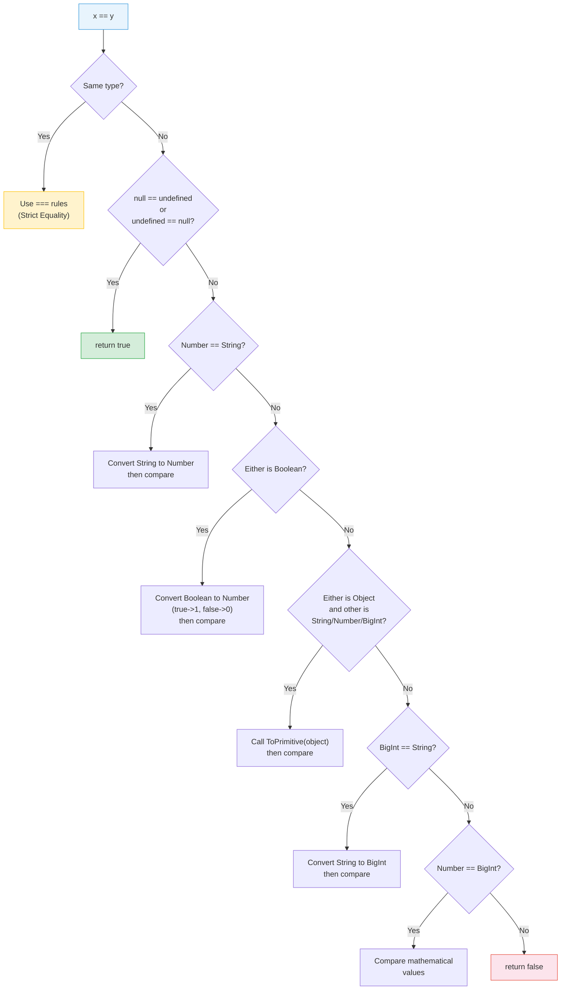

# [FEE-304] Type Coercion & Equality

:::info
JavaScript silently converts values between types in many contexts; understanding when and how coercion happens is essential for writing predictable equality checks and avoiding subtle bugs.
:::

## Context

JavaScript is a dynamically typed language with pervasive implicit type conversion -- what the spec calls "type coercion." When you write `"5" - 2`, JavaScript silently converts `"5"` to the number `5` and returns `3`. When you write `"5" + 2`, it converts `2` to `"2"` and returns `"52"`. These two behaviors follow different rules, and the inconsistency is a well-known source of bugs.

The language provides three equality operators with different coercion behavior:

- **`==` (Abstract Equality)** -- converts operands to a common type before comparing
- **`===` (Strict Equality)** -- no type conversion; different types are always unequal
- **`Object.is()`** -- like `===` but correctly distinguishes `-0` from `+0` and treats `NaN` as equal to itself

Beyond equality, coercion affects control flow (`if`, `while`, `&&`, `||`, `??`), arithmetic operators, template literals, and property access. Mastering these rules is not about memorizing a coercion table -- it is about understanding the abstract operations that the spec defines and knowing which patterns are safe to rely on.

## Principle

**SHOULD use `===` by default.** Strict equality is predictable: it returns `true` only when both type and value match. This eliminates an entire class of bugs.

**Exception: `== null` is a useful idiom.** The expression `value == null` is `true` when `value` is `null` or `undefined`, and `false` for everything else. This is a deliberate and widely accepted use of loose equality -- it is the only `==` check that most style guides permit.

```js
// Preferred: checks for both null and undefined in one expression
if (value == null) {
  return fallback;
}

// Equivalent but verbose
if (value === null || value === undefined) {
  return fallback;
}
```

**SHOULD use `Object.is()` when `-0` or `NaN` semantics matter.** In numerical algorithms, map keys, or SameValue comparisons (like `Array.prototype.includes`), `Object.is()` gives the mathematically correct answer:

```js
Object.is(NaN, NaN);   // true  (=== returns false)
Object.is(-0, +0);     // false (=== returns true)
```

## Design Thinking

### Why JS has implicit coercion

When Brendan Eich created JavaScript in 10 days in May 1995, he was influenced by two very different languages: Java (for syntax) and Scheme (for first-class functions). The language was designed to be accessible to non-programmers writing small scripts in web pages. Implicit coercion was part of a "be liberal in what you accept" philosophy -- if a user passes a string where a number is expected, try to make it work rather than throwing an error.

This design choice made sense for short scripts embedded in HTML. It becomes a liability at scale. When a codebase grows to thousands of files maintained by dozens of engineers, implicit conversions become invisible sources of bugs. A function that "works" because `"5" * 1` silently produces `5` can break silently when it receives `"five"` and produces `NaN`, which then propagates through calculations without throwing.

### The cost of implicit coercion at scale

Large JavaScript codebases universally adopt strict equality as a default:

- **ESLint `eqeqeq` rule** -- enforces `===` with an optional `"allow-null"` exception
- **TypeScript `strict` mode** -- catches many coercion bugs at compile time through type narrowing
- **Code review culture** -- teams reject `==` in pull requests unless it is the `== null` idiom

The industry consensus is clear: explicit is better than implicit for production code.

### TypeScript and compile-time type safety

TypeScript addresses coercion at the type level:

- **`strictNullChecks`** -- prevents `null` and `undefined` from being assigned to non-nullable types, eliminating the most common source of `== null` checks
- **Type narrowing** -- `typeof`, `instanceof`, and control flow analysis let TypeScript track the precise type of a variable through branches, making coercion unnecessary
- **Discriminated unions** -- tagged unions with a literal `type` field enable exhaustive `switch` statements without any coercion

```ts
type Result =
  | { status: "ok"; data: string }
  | { status: "error"; message: string };

function handle(r: Result) {
  switch (r.status) {
    case "ok":    return r.data;     // narrowed to { status: "ok", data: string }
    case "error": return r.message;  // narrowed to { status: "error", message: string }
  }
}
```

### Framework type safety

Frameworks have evolved from runtime to compile-time type validation:

- **React PropTypes** (runtime) -- validates props at runtime in development mode, logs console warnings. No protection in production builds. Largely superseded by TypeScript generics on `React.FC<Props>` and `React.ComponentProps<typeof Component>`.
- **Vue `defineProps<T>()`** (compile-time) -- uses TypeScript generics processed by the Vue compiler to generate runtime validation code automatically. The developer writes types; the framework handles coercion-safe validation.

The trend is clear: move type checking to compile time, eliminate implicit coercion at the source.

## Best Practices

### BP1 -- Always use `===` by default

MDN states: "Strict equality is almost always the correct comparison operation to use." Use `===` for every equality check unless you have a specific reason not to. Configure ESLint's `eqeqeq` rule to enforce this automatically. The only acceptable exception is the `== null` idiom, which checks for both `null` and `undefined` in a single comparison.

### BP2 -- Be explicit about type conversion

Rely on `Number()`, `String()`, and `Boolean()` for intentional conversions rather than implicit coercion. Explicit conversion makes the intent clear to readers and prevents the coercion rules from silently doing something unexpected. Avoid fragile patterns like unary `+`, empty string concatenation, or double negation that rely on coercion rules.

### BP3 -- Use `Number.isNaN()`, not `isNaN()`

The global `isNaN()` coerces its argument to a number before testing, producing misleading results with non-numeric values. `Number.isNaN()` does not coerce: it returns `true` only when the argument is of type Number and its value is `NaN`. MUST use `Number.isNaN()` for accurate NaN detection.

## Visual

The following flowchart describes the Abstract Equality Comparison algorithm (`==`) as defined in ECMA-262 (IsLooselyEqual):



**Key insight:** The algorithm is recursive. After converting a Boolean to a Number, it restarts comparison. After calling ToPrimitive on an object, it restarts. This is why `[] == false` evaluates to `true`:

1. `[] == false` -- Boolean present, convert: `[] == 0`
2. `[] == 0` -- Object vs Number, ToPrimitive: `"" == 0`
3. `"" == 0` -- String vs Number, convert: `0 == 0`
4. `0 == 0` -- same type, strict equality: `true`

## Example

### The 8 falsy values

```js
// These all evaluate to false in a boolean context
Boolean(false);     // false
Boolean(0);         // false
Boolean(-0);        // false
Boolean(0n);        // false (BigInt zero)
Boolean("");        // false (empty string)
Boolean(null);      // false
Boolean(undefined); // false
Boolean(NaN);       // false

// Everything else is truthy, including:
Boolean([]);        // true  (empty array!)
Boolean({});        // true  (empty object!)
Boolean("0");       // true  ("0" is a non-empty string)
Boolean("false");   // true  ("false" is a non-empty string)
```

### The `+` operator: string concatenation vs addition

```js
// When either operand is a string, + concatenates
"5" + 3;          // "53"
3 + "5";          // "35"
"" + 42;          // "42"  (common number-to-string trick)

// When both operands are numbers, + adds
5 + 3;            // 8

// Objects are converted via ToPrimitive
[] + [];          // ""     (both become "", then concatenated)
[] + {};          // "[object Object]"
{} + [];          // 0      (block statement + unary plus in some engines)

// Use explicit conversion to avoid surprises
Number("5") + 3;  // 8
String(42);        // "42"
```

### Nullish coalescing (`??`) vs logical OR (`||`)

```js
// || returns the first truthy value
0 || "default";        // "default"  (0 is falsy!)
"" || "default";       // "default"  ("" is falsy!)
null || "default";     // "default"

// ?? returns the first non-nullish value (not null, not undefined)
0 ?? "default";        // 0          (0 is not nullish)
"" ?? "default";       // ""         ("" is not nullish)
null ?? "default";     // "default"
undefined ?? "default" // "default"

// Use ?? when 0 or "" are valid values
function getPort(config) {
  return config.port ?? 3000;  // port: 0 is valid, don't override
}

// Use || when any falsy value should trigger the default
function getLabel(text) {
  return text || "Untitled";   // empty string should get the default
}
```

### Optional chaining (`?.`) and nullish values

```js
const user = { address: { street: "123 Main" } };

// Without optional chaining
const zip = user && user.address && user.address.zip; // undefined

// With optional chaining
const zip2 = user?.address?.zip;       // undefined (no TypeError)
const missing = null?.foo?.bar;        // undefined

// Combines well with ??
const displayZip = user?.address?.zip ?? "N/A";  // "N/A"
```

### Abstract operations in action

```js
// ToPrimitive: valueOf() and toString()
const obj = {
  valueOf()  { return 42; },
  toString() { return "hello"; }
};

obj + 1;          // 43      (ToPrimitive with "number" hint calls valueOf)
`Value: ${obj}`;  // "Value: 42" (template literal uses ToPrimitive "default" hint)
String(obj);      // "hello"  (explicit String() calls toString directly)

// Symbol.toPrimitive overrides both
const custom = {
  [Symbol.toPrimitive](hint) {
    if (hint === "number")  return 10;
    if (hint === "string")  return "ten";
    return true; // default hint
  }
};

+custom;           // 10
`${custom}`;       // "ten"
custom + 0;        // 1  (default hint returns true, then true -> 1)
```

### Strict vs loose equality edge cases

```js
// The == null idiom -- the one good use of ==
null == undefined;    // true
null == null;         // true
undefined == undefined; // true
null == 0;            // false (null only equals null and undefined)
null == "";           // false
null == false;        // false

// Surprising == results
"" == false;          // true  ("" -> 0, false -> 0)
"0" == false;         // true  ("0" -> 0, false -> 0)
"" == 0;              // true  ("" -> 0)
" " == 0;             // true  (" " -> 0, whitespace trimmed)
[] == false;          // true  (see walkthrough above)
[1] == 1;             // true  ([1] -> "1" -> 1)

// Object.is() vs ===
NaN === NaN;          // false
Object.is(NaN, NaN);  // true
-0 === +0;            // true
Object.is(-0, +0);    // false

// Where this matters: Array includes vs indexOf
[NaN].includes(NaN);  // true  (uses SameValueZero, like Object.is but -0 === +0)
[NaN].indexOf(NaN);   // -1    (uses ===)
```

## Common Mistakes

### 1. Truthy-checking when you mean non-nullish

```js
// Bug: 0 and "" are valid values but falsy
function setVolume(level) {
  if (!level) {            // fails when level is 0!
    level = 50;
  }
  audio.volume = level;
}

// Fix: check for nullish, not falsy
function setVolume(level) {
  level = level ?? 50;     // 0 stays 0
  audio.volume = level;
}
```

### 2. String concatenation with `+` when addition intended

```js
// Bug: form input values are strings
const total = price + tax;  // "100" + "7" = "1007"

// Fix: convert explicitly
const total = Number(price) + Number(tax);  // 107
```

### 3. Assuming `typeof null === "object"` is intentional

```js
// Bug: typeof null returns "object"
function isObject(value) {
  return typeof value === "object";  // true for null!
}

// Fix: add null check
function isObject(value) {
  return value !== null && typeof value === "object";
}
```

This is a well-known spec bug from 1995 -- in the original JavaScript engine, values were tagged with a type code, and the tag for `null` was `0`, the same as objects. It has never been fixed because too much existing code depends on the behavior.

### 4. Not using `Object.is()` when `-0` and `NaN` comparison matters

```js
// Bug: === cannot detect NaN or distinguish -0
const cache = new Map();
cache.set(NaN, "not a number");
cache.get(NaN);  // "not a number" -- Map uses SameValueZero internally

// But manual comparison fails
const values = [NaN, 0, -0, 1];
values.filter(v => v === NaN);   // [] -- always empty!
values.filter(v => Number.isNaN(v));  // [NaN] -- correct

// For -0 detection
function isNegativeZero(x) {
  return Object.is(x, -0);
}
```

## Related FEEs

- **[FEE-300](/en/JavaScript%20Core%20and%20Runtime/300)** -- JavaScript Core & Runtime Overview: the big picture of the language runtime
- **[FEE-303](/en/JavaScript%20Core%20and%20Runtime/303)** -- Prototypes & Inheritance: ToPrimitive calls `valueOf()` and `toString()` on the prototype chain
- **[FEE-305](/en/JavaScript%20Core%20and%20Runtime/305)** -- Error Handling Patterns: `TypeError` from failed coercion (e.g., calling a method on `null`)

## References

- [ECMA-262 -- IsLooselyEqual (Abstract Equality Comparison)](https://tc39.es/ecma262/#sec-islooselyequal) -- the normative specification for the `==` algorithm
- [ECMA-262 -- IsStrictlyEqual](https://tc39.es/ecma262/#sec-isstrictlyequal) -- the normative specification for `===`
- [ECMA-262 -- ToPrimitive](https://tc39.es/ecma262/#sec-toprimitive) -- how objects are converted to primitive values
- [MDN -- Equality comparisons and sameness](https://developer.mozilla.org/en-US/docs/Web/JavaScript/Guide/Equality_comparisons_and_sameness) -- comprehensive guide comparing `==`, `===`, `Object.is()`, and SameValueZero
- [MDN -- Type coercion](https://developer.mozilla.org/en-US/docs/Glossary/Type_coercion) -- glossary entry with clear definitions
- [Dr. Axel Rauschmayer -- Type coercion in JavaScript](https://2ality.com/2019/10/type-coercion.html) -- deep dive into coercion rules and the spec algorithms
- [javascript.info -- Type Conversions](https://javascript.info/type-conversions) -- beginner-friendly explanation of the three main conversion types
- [javascript.info -- Object to primitive conversion](https://javascript.info/object-toprimitive) -- detailed coverage of ToPrimitive, hints, and Symbol.toPrimitive
