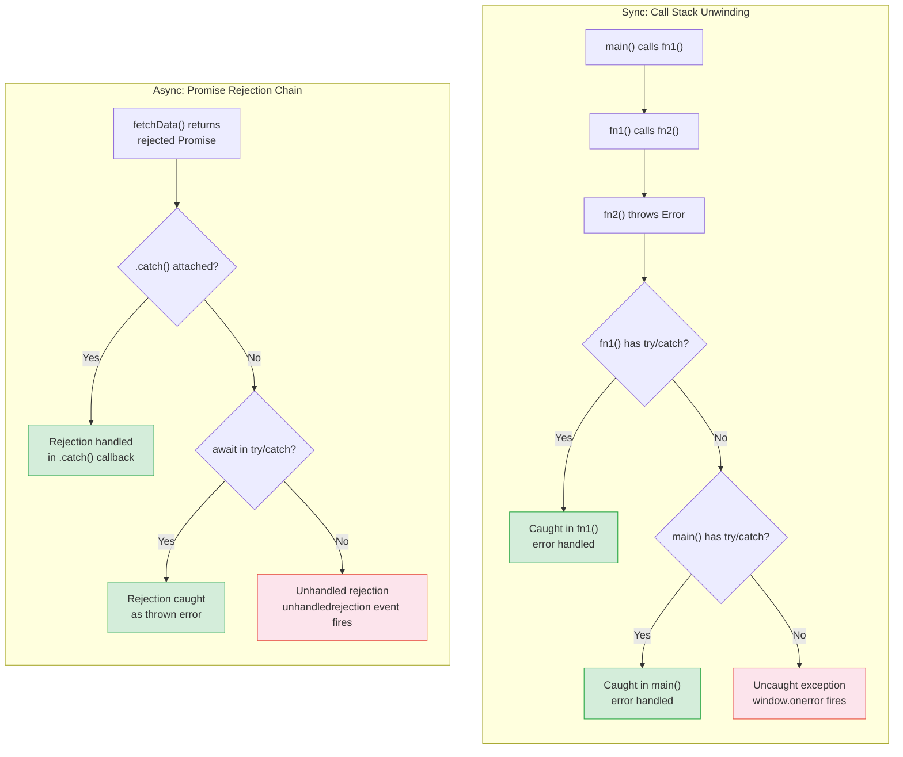

# [FEE-305] Error Handling Patterns

:::info
JavaScript errors are unchecked and untyped -- any value can be thrown at any time, and no compiler enforces handling. Mastering error handling means understanding synchronous unwinding, asynchronous rejection propagation, and the framework-level boundary patterns that keep your UI from going blank.
:::

## Context

Every JavaScript program encounters errors: network failures, invalid user input, type mismatches, out-of-range values, and logic bugs. Unlike Java (checked exceptions with `throws` clauses) or Rust (the `Result<T, E>` type that forces callers to handle errors at compile time), JavaScript has no compile-time error handling enforcement. Any function can throw any value at any time, and callers are free to ignore the possibility entirely.

This design has consequences:

- **Silent failures propagate.** An unhandled exception in a click handler crashes only that handler -- the page stays interactive but in a potentially inconsistent state.
- **Async errors are invisible by default.** A rejected promise with no `.catch()` produces an `unhandledrejection` event that many developers never listen for.
- **The user holds the crashed UI.** Unlike a server that can restart a process, a browser tab with a broken UI stays broken until the user refreshes. Framework error boundaries exist specifically to address this.

Understanding JavaScript error handling requires three levels of knowledge: the language mechanics (try/catch, Error objects, throw), the runtime behavior (event loop, promise rejection tracking, global handlers), and the framework patterns (error boundaries, error handlers) that make applications resilient.

## Design Thinking

### Why JS errors are unchecked

JavaScript was designed in 1995 for short scripts in web pages. Brendan Eich adopted Java's `try/catch/finally` syntax but deliberately omitted Java's `throws` clause -- the declaration that forces callers to handle specific exception types. The reasoning was pragmatic: web scripts needed to be forgiving, and checked exceptions would have been too cumbersome for the target audience.

This decision has a lasting effect. In Java, the compiler tells you "this method throws IOException -- handle it or declare it." In Rust, the `?` operator propagates `Result` errors up the call stack with full type safety. In JavaScript, nothing tells you a function might throw. You discover it at runtime, in production, from your error monitoring service.

TypeScript does not solve this problem. While TypeScript tracks value types, it does not track exception types. There is no `throws` annotation in the type system. Libraries like `neverthrow` and `fp-ts` bring Rust-style `Result` types to TypeScript, but they require buy-in across the entire codebase to be effective.

### Error boundary pattern across frameworks

The core idea of an error boundary is: catch errors from child components, display a fallback UI, and report the error -- without crashing the entire application.

**React** (class components only): React error boundaries are class components that implement `static getDerivedStateFromError(error)` (to render fallback UI) and `componentDidCatch(error, errorInfo)` (to log the error). Error boundaries catch errors during rendering, lifecycle methods, and constructors of the entire tree below them. They do NOT catch errors in event handlers, async code, SSR, or in the boundary itself.

```jsx
class ErrorBoundary extends React.Component {
  constructor(props) {
    super(props);
    this.state = { hasError: false };
  }

  static getDerivedStateFromError(error) {
    // Update state so next render shows fallback UI
    return { hasError: true };
  }

  componentDidCatch(error, errorInfo) {
    // Log to error reporting service
    reportError(error, errorInfo.componentStack);
  }

  render() {
    if (this.state.hasError) {
      return <h2>Something went wrong.</h2>;
    }
    return this.props.children;
  }
}

// Usage: wrap any subtree
<ErrorBoundary>
  <Dashboard />
</ErrorBoundary>
```

React has no built-in function component equivalent for error boundaries. The `react-error-boundary` library provides a `<ErrorBoundary>` wrapper with hooks-compatible API.

**Vue**: Vue provides two complementary mechanisms. The global `app.config.errorHandler` receives all uncaught errors from any component in the app. The `onErrorCaptured` composable (or `errorCaptured` lifecycle hook) lets a parent component intercept errors from its children. If `onErrorCaptured` returns `false`, the error stops propagating -- this is how you build a Vue error boundary.

```js
// Global handler (main.js)
app.config.errorHandler = (err, instance, info) => {
  reportError(err, { component: instance, info });
};

// Component-level boundary (ErrorBoundary.vue)
const error = ref(null);
onErrorCaptured((err) => {
  error.value = err;
  return false; // prevent further propagation
});
```

**SvelteKit**: SvelteKit uses a `handleError` hook in `src/hooks.server.js` (and `src/hooks.client.js`). Unexpected errors pass through this hook, which can log them and return a sanitized error object. The framework deliberately hides raw error messages from users to prevent information leakage.

### Emerging patterns

**TC39 Safe Assignment / Try Operator proposal**: Inspired by Go and Rust, this proposal introduces a `try` operator that converts throwing functions into `[error, result]` tuples. The proposal is still at Stage 0 and is far from standardization, but it reflects growing demand for Go/Rust-style explicit error handling in JavaScript.

```js
// Hypothetical syntax (not yet standardized)
const [error, data] = try await fetchData();
if (error) {
  return handleError(error);
}
```

**Result type libraries**: Libraries like `neverthrow`, `ts-results`, and `oxide.ts` provide `Result<T, E>` and `Option<T>` types for TypeScript. They force callers to handle both success and failure cases through `.match()`, `.map()`, and `.unwrapOr()` methods, bringing Rust-style safety to TypeScript code.

### Why frontend error handling is harder

1. **The user holds the crashed UI.** A server error returns a 500 response and the server moves on to the next request. A frontend error leaves the user staring at a broken page with no recourse except refreshing.
2. **Minified stack traces.** Production JavaScript is minified and bundled. Stack traces contain cryptic names like `a.b.c` at `chunk-3fa2b.js:1:42398`. Source maps are required to make them useful, and source maps must be uploaded to your error monitoring service.
3. **Error serialization is lossy.** `JSON.stringify(new Error('fail'))` returns `"{}"` because `message`, `stack`, and `cause` are non-enumerable properties. You must extract fields explicitly for logging.
4. **User environment diversity.** Errors may be caused by browser extensions, ad blockers, network proxies, or outdated browsers -- factors entirely outside your control.

## Best Practices

**Extend `Error` for custom error types.** MUST subclass `Error` using ES2015 class syntax, call `super(message, { cause })` to set the `message` and `cause` properties, and assign `this.name` to match the class name. This makes custom errors identifiable with `instanceof` and ensures they carry the full prototype chain that error-monitoring tools expect.

**MUST NOT swallow errors with empty `catch` blocks.** An empty catch block makes bugs invisible and debugging impossible. If a failure is genuinely safe to ignore, MUST leave an explicit comment explaining why; otherwise, at minimum re-throw or log with `console.error()`.

**Use `finally` for resource cleanup.** SHOULD place cleanup code (closing connections, releasing locks, hiding loading indicators) in `finally` blocks rather than duplicating it in both `try` and `catch`. The `finally` block always runs, even when a `return` or `throw` occurs inside `try` or `catch`. AVOID returning a value from `finally` because it silently overrides any `return` or `throw` in the preceding blocks.

**Handle `unhandledrejection` at the application boundary.** MUST register a `window.addEventListener('unhandledrejection', ...)` handler at application startup as a last-resort safety net. This catches promise rejections that slip past local `.catch()` handlers. In production, forward these events to an error-monitoring service rather than letting them disappear silently into the console.

## Visual

The following diagram compares how errors propagate in synchronous code (call stack unwinding) versus asynchronous code (promise rejection chain):



**Key difference:** Synchronous errors unwind the call stack immediately -- each frame gets a chance to catch. Asynchronous errors (rejected promises) propagate through the promise chain, and if no handler exists, they fire the `unhandledrejection` event on `window` (or `process` in Node.js).

## Example

### try/catch/finally mechanics

```js
function parseConfig(json) {
  try {
    const config = JSON.parse(json);
    return config;
  } catch (err) {
    // err is scoped to this catch block
    console.error("Invalid JSON:", err.message);
    return null;
  } finally {
    // Always runs -- even if try or catch returns
    console.log("Parse attempt complete");
  }
}

// finally overrides return values (avoid this!)
function dangerousFinally() {
  try {
    return 1;
  } finally {
    return 2; // This wins -- return value is 2, not 1
  }
}
```

### Built-in error types

```js
// TypeError: wrong type operation
null.toString();            // TypeError: Cannot read properties of null
(42).toUpperCase();         // TypeError: (42).toUpperCase is not a function

// RangeError: value out of valid range
new Array(-1);              // RangeError: Invalid array length
(1.5).toFixed(200);         // RangeError: toFixed() digits argument must be between 0 and 100

// ReferenceError: accessing undeclared variable
console.log(notDeclared);  // ReferenceError: notDeclared is not defined

// SyntaxError: invalid code (usually at parse time, not caught by try/catch in same scope)
// eval("if (");            // SyntaxError: Unexpected end of input

// URIError: malformed URI
decodeURIComponent("%");    // URIError: URI malformed
```

### Custom error classes

```js
class AppError extends Error {
  constructor(message, { code, statusCode, cause } = {}) {
    super(message, { cause });
    this.name = "AppError";
    this.code = code;
    this.statusCode = statusCode;
  }
}

class ValidationError extends AppError {
  constructor(field, message, options) {
    super(message, { code: "VALIDATION_ERROR", statusCode: 400, ...options });
    this.name = "ValidationError";
    this.field = field;
  }
}

// Usage with cause chaining
try {
  const data = JSON.parse(rawInput);
} catch (err) {
  throw new ValidationError("config", "Invalid config format", { cause: err });
  // err.cause contains the original SyntaxError
}
```

### Async error propagation

```js
// Promise .catch()
fetch("/api/data")
  .then((res) => res.json())
  .catch((err) => {
    console.error("Fetch failed:", err);
    return { fallback: true };
  });

// async/await with try/catch
async function loadData() {
  try {
    const res = await fetch("/api/data");
    if (!res.ok) throw new Error(`HTTP ${res.status}`);
    return await res.json();
  } catch (err) {
    // Catches both network errors and HTTP errors
    reportError(err);
    return null;
  }
}

// IMPORTANT: async functions always return promises
// Throwing inside async creates a rejected promise, NOT a sync exception
async function willReject() {
  throw new Error("this becomes a rejected promise");
}
// willReject() returns Promise<rejected> -- must be caught with .catch() or await
```

### Global error handlers

```js
// Catch uncaught synchronous errors
window.addEventListener("error", (event) => {
  console.error("Uncaught error:", event.error);
  // event.message, event.filename, event.lineno, event.colno
});

// Catch unhandled promise rejections
window.addEventListener("unhandledrejection", (event) => {
  console.error("Unhandled rejection:", event.reason);
  event.preventDefault(); // Prevents default console warning
});

// Node.js equivalents
process.on("uncaughtException", (err) => {
  console.error("Uncaught:", err);
  process.exit(1); // Process is in undefined state -- exit
});

process.on("unhandledRejection", (reason) => {
  console.error("Unhandled rejection:", reason);
});
```

### Error serialization

```js
const err = new Error("Something failed");
err.code = "ERR_SOMETHING";

// Problem: JSON.stringify ignores non-enumerable properties
JSON.stringify(err);
// "{}" -- message, stack, name are non-enumerable!

// Solution: extract fields explicitly
function serializeError(err) {
  return {
    name: err.name,
    message: err.message,
    stack: err.stack,
    code: err.code,
    cause: err.cause ? serializeError(err.cause) : undefined,
  };
}

JSON.stringify(serializeError(err));
// {"name":"Error","message":"Something failed","stack":"Error: Something failed\n    at ...","code":"ERR_SOMETHING"}
```

## Common Mistakes

### 1. Catching too broadly

```js
// Bug: catches ALL errors including programmer mistakes
try {
  const result = complexOperation(data);
  updateUI(result);
} catch (err) {
  showErrorMessage("Operation failed"); // Hides TypeError, ReferenceError, etc.
}

// Fix: catch specific errors, let unexpected ones propagate
try {
  const result = complexOperation(data);
  updateUI(result);
} catch (err) {
  if (err instanceof NetworkError) {
    showErrorMessage("Network unavailable. Please retry.");
  } else if (err instanceof ValidationError) {
    showFieldErrors(err.field, err.message);
  } else {
    throw err; // Re-throw unexpected errors -- don't hide bugs
  }
}
```

### 2. Forgetting that async functions return rejected promises

```js
// Bug: this try/catch catches NOTHING
try {
  async function fetchUser() {
    const res = await fetch("/api/user");
    if (!res.ok) throw new Error("Not found");
    return res.json();
  }
  fetchUser(); // Returns a promise -- throw becomes rejection, not sync exception
} catch (err) {
  // Never reached!
}

// Fix: await the async call inside an async context
async function handleClick() {
  try {
    const user = await fetchUser(); // Now the rejection is caught
    renderUser(user);
  } catch (err) {
    showError(err.message);
  }
}
```

### 3. Losing error context by wrapping without cause

```js
// Bug: original error is lost -- stack trace points to the wrapper, not the root cause
try {
  await connectToDatabase();
} catch (err) {
  throw new Error("Database connection failed");
  // The original err (with connection details, timeout info, etc.) is gone
}

// Fix: use the cause option (ES2022+)
try {
  await connectToDatabase();
} catch (err) {
  throw new Error("Database connection failed", { cause: err });
  // err.cause preserves the full original error chain
}
```

## Related FEEs

- **[FEE-300](/en/JavaScript%20Core%20and%20Runtime/300)** -- JavaScript Core & Runtime Overview: the execution model that determines how errors propagate
- **[FEE-301](/en/JavaScript%20Core%20and%20Runtime/301)** -- Event Loop & Task Queues: microtask errors and their propagation behavior
- **[FEE-302](/en/JavaScript%20Core%20and%20Runtime/302)** -- Closures & Scope: error context captured in closures
- **[FEE-1400](/en/Observability/1400)** -- Observability: production error monitoring, source maps, and structured logging

## References

- [ECMA-262 -- Error Objects](https://tc39.es/ecma262/#sec-error-objects) -- the normative specification for Error constructors, NativeError types, and the `cause` property
- [ECMA-262 -- The throw Statement](https://tc39.es/ecma262/#sec-throw-statement) -- how `throw` creates an abrupt completion that unwinds the call stack
- [MDN -- try...catch](https://developer.mozilla.org/en-US/docs/Web/JavaScript/Reference/Statements/try...catch) -- comprehensive guide to try/catch/finally mechanics, scope, and control flow
- [MDN -- Error](https://developer.mozilla.org/en-US/docs/Web/JavaScript/Reference/Global_Objects/Error) -- Error constructor, built-in error types, `cause` property, and custom error patterns
- [MDN -- Promise.prototype.catch()](https://developer.mozilla.org/en-US/docs/Web/JavaScript/Reference/Global_Objects/Promise/catch) -- promise rejection handling
- [MDN -- Window: unhandledrejection event](https://developer.mozilla.org/en-US/docs/Web/API/Window/unhandledrejection_event) -- global handler for unhandled promise rejections
- [React -- Error Boundaries (Legacy Docs)](https://legacy.reactjs.org/docs/error-boundaries.html) -- componentDidCatch, getDerivedStateFromError, and what error boundaries can and cannot catch
- [React -- Component Reference](https://react.dev/reference/react/Component) -- current React docs for class component error boundary methods
- [Vue -- Error Handling](https://vuejs.org/error-reference/) -- app.config.errorHandler and onErrorCaptured documentation
- [SvelteKit -- Hooks](https://svelte.dev/docs/kit/hooks) -- handleError hook for server-side and client-side error interception
- [TC39 -- Safe Assignment / Try Operator Proposal](https://github.com/arthurfiorette/proposal-safe-assignment-operator) -- Stage 0 proposal for Result-style error handling in JavaScript
