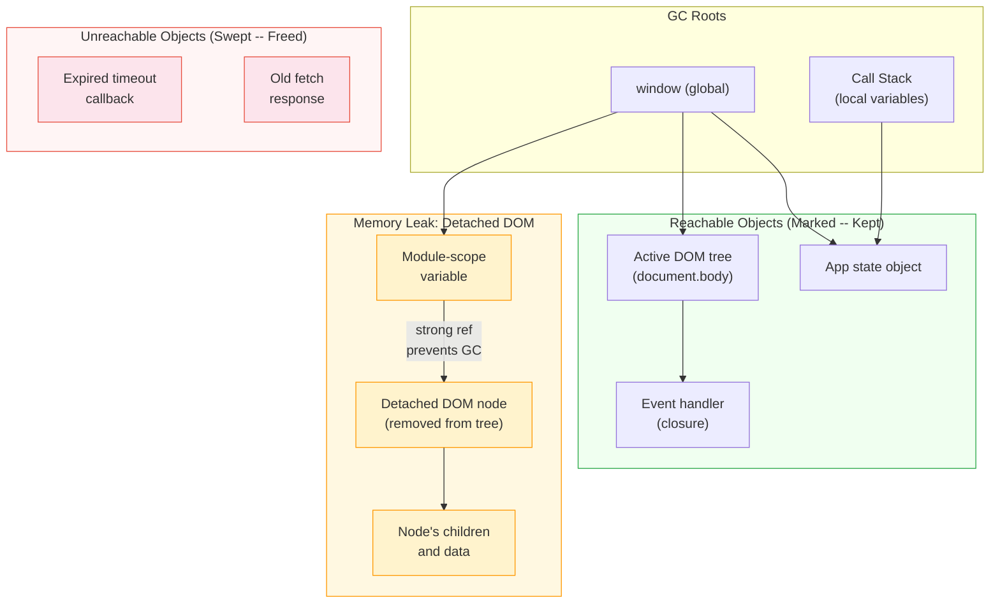

# [FEE-306] Memory Management & Garbage Collection

:::info
JavaScript automatically manages memory through garbage collection -- you never call `malloc` or `free`. But "automatic" does not mean "worry-free." Understanding how the engine allocates, traces, and reclaims memory is essential for diagnosing leaks that silently degrade your application over minutes, hours, or days.
:::

## Context

Every value in a JavaScript program occupies memory: primitives on the stack, objects and closures on the heap. The language specification defines memory management as automatic -- the engine decides when to reclaim unreachable objects. In practice, this means the developer is responsible for *reachability*, not deallocation.

The consequences for frontend applications are significant:

- **Long-lived pages accumulate leaks.** A server process might restart daily; a Single-Page Application can stay open for hours. A leak that grows at 1 MB per navigation adds up.
- **GC pauses affect frame rate.** Major garbage collection can block the main thread for milliseconds, causing dropped frames and jank in animations.
- **Frameworks add lifecycle complexity.** Component mount/unmount cycles, reactive subscriptions, and virtual DOM reconciliation all create opportunities for objects to remain reachable longer than intended.

Understanding memory management requires three levels: the language model (allocation and reachability), the engine implementation (V8's generational collector), and the application patterns (framework lifecycle cleanup and leak prevention).

## Design Thinking

### Why JS is garbage-collected

JavaScript was designed for the browser -- an environment where developer ergonomics and safety outweigh raw performance control. Automatic memory management eliminates two entire categories of bugs that plague C/C++ programs:

1. **Use-after-free.** Accessing memory that has already been deallocated. In C, this causes undefined behavior, security vulnerabilities, and crashes. In JavaScript, it simply cannot happen -- the GC will not collect an object that any live reference can reach.
2. **Double-free.** Deallocating the same memory twice. Again, impossible in a GC language because the developer never calls `free`.

The tradeoff is **GC pauses** -- the engine must periodically stop or slow down execution to trace reachable objects and reclaim dead ones. V8's Orinoco project has reduced these pauses dramatically through concurrent and parallel collection strategies, but they still exist and can cause frame drops in animation-heavy applications.

### Mark-and-sweep: how modern engines collect garbage

All modern JavaScript engines use **mark-and-sweep** (not reference counting) as their primary collection algorithm. The algorithm has two phases:

1. **Mark phase.** Starting from a set of *GC roots* -- the global object (`window`/`globalThis`), the call stack (local variables in active functions), and CPU registers -- the collector recursively follows every reference, marking each reachable object as "alive."
2. **Sweep phase.** The collector scans the entire heap. Any object that was not marked is unreachable -- no chain of references from any root leads to it. These objects are freed and their memory is returned to the allocator.

**Why not reference counting?** Early engines and some languages (Python, Swift) use reference counting: each object tracks how many references point to it, and is freed when the count reaches zero. The fatal flaw is **circular references** -- two objects that reference each other both have a count of 1, even if no root can reach either one. Mark-and-sweep solves this naturally because it traces from roots: circular islands of objects with no root path are correctly identified as garbage.

### Generational GC in V8

V8 (Chrome, Node.js, Deno) implements a generational garbage collector based on the **generational hypothesis**: most objects die young. A temporary array created during a function call, an intermediate string from template literal concatenation, a short-lived event object -- all become unreachable almost immediately after creation.

V8 divides the heap into two generations:

**Young generation (Scavenger / Minor GC).** A small memory area (typically 1-8 MB) using a semi-space design. Half the space is the "nursery" where new objects are allocated; the other half is empty. When the nursery fills up:
1. The Scavenger copies all surviving objects to the empty half ("To-Space").
2. Objects surviving their first collection move to an "intermediate" area.
3. Objects surviving a second collection are **promoted** to the old generation.
4. The two halves swap roles.

This is extremely fast because most objects in the nursery are already dead -- the collector only copies the small number of survivors. Minor GC pauses are typically under 1 ms.

**Old generation (Mark-Compact / Major GC).** Objects that survive long enough are promoted here. The old generation uses Mark-Compact, which combines marking (find reachable objects), sweeping (reclaim dead memory via free lists), and compaction (move surviving objects to eliminate fragmentation on highly fragmented pages). Major GC is more expensive but runs less frequently.

**Orinoco optimizations.** V8's Orinoco project transformed the collector from stop-the-world to mostly concurrent:
- **Parallel**: Multiple helper threads collaborate during the pause, dividing work.
- **Incremental**: Marking work is broken into small chunks interleaved with JavaScript execution.
- **Concurrent**: Helper threads mark and sweep in the background while JavaScript runs on the main thread. Write barriers track new references created during concurrent marking.

These optimizations reduced Major GC pauses by up to 50% in heavy WebGL scenarios.

### How frameworks manage lifecycle cleanup

Frontend frameworks provide lifecycle hooks specifically to prevent memory leaks during component mount/unmount cycles:

**React** -- `useEffect` cleanup function:
```js
useEffect(() => {
  const controller = new AbortController();
  window.addEventListener("resize", handleResize, { signal: controller.signal });
  const id = setInterval(pollStatus, 5000);

  return () => {
    controller.abort();   // removes all listeners with this signal
    clearInterval(id);    // stops the timer
  };
}, []);
```
The returned function runs on unmount and before every re-execution if dependencies change.

**Vue** -- `onUnmounted` and watch cleanup:
```js
onMounted(() => {
  const controller = new AbortController();
  window.addEventListener("scroll", handleScroll, { signal: controller.signal });

  onUnmounted(() => {
    controller.abort();
  });
});
```

**Angular** -- `ngOnDestroy`:
```ts
export class ChartComponent implements OnDestroy {
  private resizeObserver = new ResizeObserver(this.onResize.bind(this));

  ngOnInit() {
    this.resizeObserver.observe(this.elementRef.nativeElement);
  }

  ngOnDestroy() {
    this.resizeObserver.disconnect();
  }
}
```

**Svelte** -- `onDestroy`:
```js
onMount(() => {
  const interval = setInterval(refresh, 3000);
  return () => clearInterval(interval); // runs on destroy
});
```

### Signal disposal and reactive subscription cleanup

Reactive systems (Solid, Preact Signals, Angular Signals) track subscriptions automatically. When a reactive scope is destroyed, the runtime unsubscribes all effects created within it. This is more robust than manual cleanup because the framework owns the subscription lifecycle.

However, side effects that reach outside the reactive system -- DOM listeners, network connections, timers -- still require explicit cleanup. Signals solve the "when to unsubscribe from computed values" problem but not the "when to stop polling the server" problem.

### TC39 Explicit Resource Management

The Explicit Resource Management proposal (Stage 3, shipped in Chrome 134+) introduces the `using` keyword for deterministic cleanup:

```js
function readFile() {
  using reader = getReader(); // reader[Symbol.dispose]() called at scope exit
  return reader.read();
}

async function processStream(response) {
  await using reader = response.body.getReader();
  // reader[Symbol.asyncDispose]() called and awaited at scope exit
}
```

Objects implement `Symbol.dispose` (sync) or `Symbol.asyncDispose` (async) to define their cleanup logic. `DisposableStack` aggregates multiple resources and disposes them in reverse order. This pattern will eventually replace many `try/finally` blocks for resource cleanup.

### WeakRef, WeakMap, WeakSet

Weak references allow you to hold a reference to an object without preventing its garbage collection:

- **WeakMap / WeakSet**: Keys (WeakMap) or values (WeakSet) are held weakly. When the key object has no other strong references, the entry is automatically removed. Use WeakMap for associating metadata with objects you do not own.
- **WeakRef**: Provides a weak reference to any object via `new WeakRef(target)`. Call `.deref()` to get the object or `undefined` if it has been collected.
- **FinalizationRegistry**: Registers a callback that fires *after* an object is garbage-collected. Useful for releasing external resources (closing sockets, freeing GPU buffers) but the timing is non-deterministic -- the callback may run much later than expected, or not at all.

**Important caveat from the spec**: "Correct code must not depend on WeakRef/FinalizationRegistry behavior." Use them as optimization hints, not as correctness mechanisms.

## Best Practices

**Remove event listeners on component cleanup.** MUST pair every `addEventListener`, `subscribe`, or `observe` call with a corresponding removal when the component or scope is destroyed. Use `AbortController` and pass its `AbortSignal` to `addEventListener` so that a single `controller.abort()` call removes all associated listeners at once, eliminating the need to store individual handler references.

**Use `WeakMap` or `WeakSet` for object-keyed caches.** SHOULD use `WeakMap` when associating metadata, computed values, or cached results with objects you do not own (such as DOM nodes). Because `WeakMap` keys are held weakly, the entry is automatically eligible for garbage collection once the key object has no other strong references, preventing the cache from becoming a hidden leak source. AVOID using a plain `Map` for this purpose, as it holds strong references to all keys indefinitely.

**Avoid capturing large objects in long-lived closures.** SHOULD extract only the values a closure actually needs before returning or storing it. A closure holds strong references to every variable in its enclosing scope, so a long-lived handler that captures an entire large object prevents that object from being collected. Pay particular attention to event handlers on global targets such as `window` or `document`, which are never unmounted.

**Use `FinalizationRegistry` sparingly and only for non-critical cleanup.** SHOULD treat `FinalizationRegistry` as an optional last-resort for releasing external resources (GPU buffers, sockets) after an object is collected. The callback is non-deterministic and may run much later than expected or not at all, so MUST NOT rely on it for correctness-critical logic. For deterministic cleanup, prefer `try/finally` or the `using` keyword (Explicit Resource Management, Stage 3).

## Visual

The following diagram shows how mark-and-sweep identifies reachable objects from GC roots, and how a detached DOM node kept alive by a closure becomes a memory leak:



**How the leak happens:** A module-scope variable holds a reference to a DOM node that was removed from the document. The GC traces from `window` to the module variable to the detached node -- it is reachable, so it cannot be collected. The node's entire subtree (children, text, attributes) stays alive with it.

## Example

### 1. Memory leak from forgotten event listener -- fix with AbortController

```js
// BUG: listener is never removed -- leaks handler closure and component scope
function initWidget(container) {
  const data = new ArrayBuffer(1024 * 1024); // 1 MB payload

  function onScroll() {
    // This closure captures 'data' -- keeping 1 MB alive
    updatePosition(container, data);
  }

  window.addEventListener("scroll", onScroll);
  // No cleanup path -- 'data' is retained forever
}

// FIX: use AbortController for clean removal
function initWidget(container) {
  const data = new ArrayBuffer(1024 * 1024);
  const controller = new AbortController();

  window.addEventListener(
    "scroll",
    () => updatePosition(container, data),
    { signal: controller.signal }
  );

  // Return a cleanup function the caller can invoke
  return () => controller.abort();
}

// Usage in a framework:
useEffect(() => {
  const cleanup = initWidget(containerRef.current);
  return cleanup; // called on unmount
}, []);
```

### 2. WeakMap for metadata caching on DOM elements

```js
// WeakMap keys are held weakly -- when the DOM node is removed
// and no other reference exists, the entry is automatically collected
const tooltipCache = new WeakMap();

function getTooltipData(element) {
  if (tooltipCache.has(element)) {
    return tooltipCache.get(element);
  }

  // Expensive computation
  const data = computeTooltipPosition(element);
  tooltipCache.set(element, data);
  return data;
}

// When 'element' is removed from the DOM and dereferenced,
// the WeakMap entry becomes eligible for GC automatically.
// No manual cache invalidation needed.
```

### 3. React useEffect cleanup pattern

```jsx
function LivePrice({ symbol }) {
  const [price, setPrice] = useState(null);

  useEffect(() => {
    const controller = new AbortController();

    // WebSocket connection
    const ws = new WebSocket(`wss://api.example.com/prices/${symbol}`);

    ws.addEventListener("message", (event) => {
      setPrice(JSON.parse(event.data).price);
    }, { signal: controller.signal });

    ws.addEventListener("error", (event) => {
      console.error("WebSocket error:", event);
    }, { signal: controller.signal });

    // Polling fallback
    const intervalId = setInterval(async () => {
      try {
        const res = await fetch(`/api/price/${symbol}`, {
          signal: controller.signal,
        });
        if (res.ok) setPrice((await res.json()).price);
      } catch (err) {
        if (err.name !== "AbortError") console.error(err);
      }
    }, 30_000);

    // Cleanup: runs on unmount AND when 'symbol' changes
    return () => {
      controller.abort();      // cancels fetch, removes all event listeners
      clearInterval(intervalId); // stops polling
      ws.close();              // closes WebSocket
    };
  }, [symbol]);

  return <span>{price ?? "Loading..."}</span>;
}
```

## Common Mistakes

### 1. Storing DOM references in global or module-scope variables

```js
// BUG: detached DOM leak
let cachedHeader = null;

function renderHeader() {
  cachedHeader = document.createElement("div");
  cachedHeader.innerHTML = buildHeaderHTML(); // large subtree
  document.body.appendChild(cachedHeader);
}

function removeHeader() {
  cachedHeader.remove(); // removed from DOM tree...
  // but cachedHeader still references the node!
  // The node and its entire subtree cannot be GC'd.
}

// FIX: null out the reference after removal
function removeHeader() {
  cachedHeader.remove();
  cachedHeader = null; // now the detached node is unreachable
}
```

### 2. Closures capturing more scope than needed

```js
// BUG: the closure captures 'hugeData' even though it only needs 'id'
function createHandler(hugeData) {
  const id = hugeData.id;
  return () => {
    // 'hugeData' is in the closure scope -- the engine MAY retain it
    // even though only 'id' is used (depends on engine optimization)
    console.log("Clicked item", id);
  };
}

// FIX: extract only what you need before creating the closure
function createHandler(hugeData) {
  const id = hugeData.id;
  // Now 'hugeData' is not referenced inside the returned function
  return () => {
    console.log("Clicked item", id);
  };
}
// Note: the fix is structurally identical -- the key insight is that
// V8 CAN optimize this, but eval() or 'with' inside the closure
// defeats this optimization and retains the entire scope.
```

### 3. Assuming GC is immediate

```js
// BUG: depending on WeakRef being cleared at a specific time
const cache = new Map();

function getCached(key, factory) {
  const ref = cache.get(key);
  if (ref) {
    const obj = ref.deref();
    if (obj) return obj; // still alive
    // Fallen through: GC has collected it -- BUT you cannot predict when
  }
  const value = factory();
  cache.set(key, new WeakRef(value));
  return value;
}

// This pattern is valid for a CACHE (performance optimization),
// but NEVER use it for correctness-critical logic.
// The GC may not run for seconds, minutes, or at all before page close.
// Do not write: if (weakRef.deref() === undefined) { /* assume cleanup done */ }
```

## Related FEEs

- **[FEE-300](/en/JavaScript%20Core%20and%20Runtime/300)** -- JavaScript Core & Runtime Overview: the execution model and heap architecture
- **[FEE-302](/en/JavaScript%20Core%20and%20Runtime/302)** -- Closures & Scope: how closures retain references and contribute to memory retention
- **[FEE-301](/en/JavaScript%20Core%20and%20Runtime/301)** -- Event Loop & Task Queues: GC pauses and their effect on frame timing
- **[FEE-1400](/en/Observability/1400)** -- Observability: memory profiling with Chrome DevTools heap snapshots

## References

- [MDN -- Memory Management](https://developer.mozilla.org/en-US/docs/Web/JavaScript/Guide/Memory_management) -- JavaScript memory lifecycle, garbage collection concepts, and common leak patterns
- [MDN -- WeakRef](https://developer.mozilla.org/en-US/docs/Web/JavaScript/Reference/Global_Objects/WeakRef) -- weak reference API, `.deref()`, and usage caveats
- [MDN -- FinalizationRegistry](https://developer.mozilla.org/en-US/docs/Web/JavaScript/Reference/Global_Objects/FinalizationRegistry) -- post-mortem cleanup callbacks for garbage-collected objects
- [V8 Blog -- Trash talk: the Orinoco garbage collector](https://v8.dev/blog/trash-talk) -- generational GC architecture, semi-space scavenger, Mark-Compact, and Orinoco's parallel/concurrent strategies
- [V8 Blog -- Concurrent marking in V8](https://v8.dev/blog/concurrent-marking) -- how V8 marks objects concurrently with JavaScript execution using write barriers
- [V8 Blog -- Weak references and finalizers](https://v8.dev/features/weak-references) -- V8's implementation of WeakRef and FinalizationRegistry
- [V8 Blog -- Explicit Resource Management](https://v8.dev/features/explicit-resource-management) -- `using` keyword, `Symbol.dispose`, `DisposableStack`, shipped in Chrome 134
- [Chrome DevTools -- Record heap snapshots](https://developer.chrome.com/docs/devtools/memory-problems/heap-snapshots) -- heap snapshot profiling, summary/comparison/containment views
- [Chrome DevTools -- Fix memory problems](https://developer.chrome.com/docs/devtools/memory-problems) -- identifying detached DOM trees, allocation timelines, and memory profiling workflows
- [TC39 -- Explicit Resource Management proposal](https://github.com/tc39/proposal-explicit-resource-management) -- Stage 3 specification for `using`, `await using`, `Symbol.dispose`, and `Symbol.asyncDispose`
