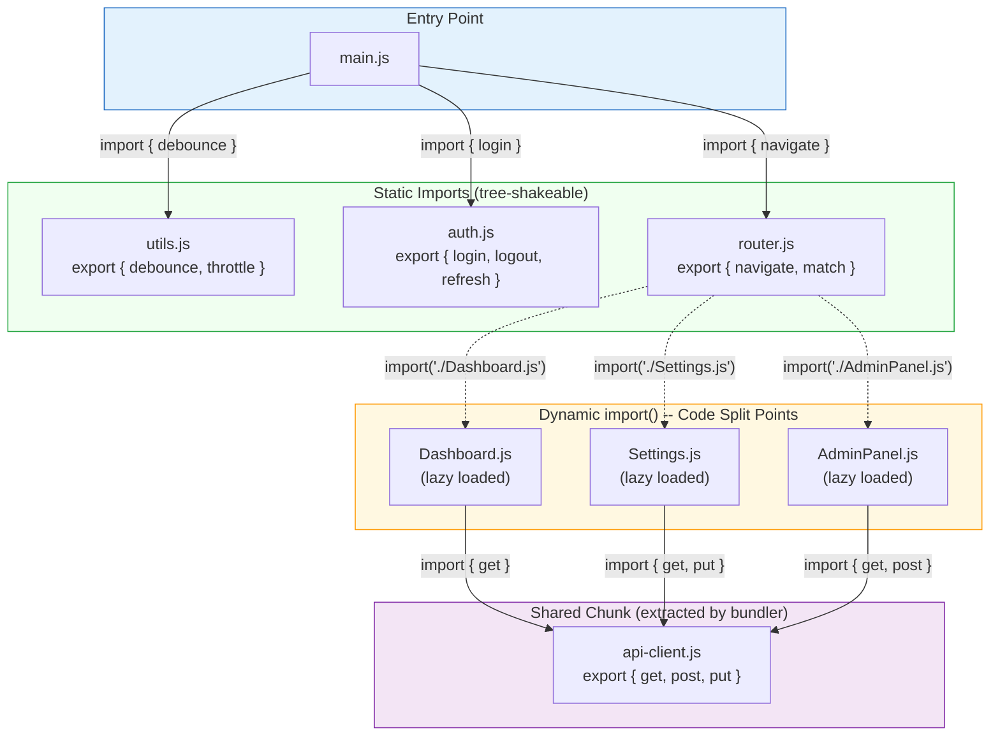

# [FEE-307] ES Modules & Module Systems

:::info
JavaScript ran without a module system for its first 20 years. Scripts shared everything through the global object, and the community invented CommonJS, AMD, and UMD to fill the gap. ES Modules (ESM), standardized in ES2015, finally gave the language a native, static, asynchronous module system. Because ESM's import/export structure is static, bundlers can drop unused exports and browsers can load modules without a bundler. Knowing where CJS and ESM diverge is what keeps a mixed codebase from shipping two copies of the same dependency.
:::

## Context

Before ES2015, JavaScript had no language-level module system. A codebase that started as a single `<script>` tag and grew organically typically ended up attaching every function to a global namespace object, with the load order of `<script>` tags determining what was available when one file needed a utility defined in another. Node.js adopted CommonJS (CJS) in 2009, giving server-side code `require()` and `module.exports`. Browsers relied on concatenation, AMD (`define`/`require`), or UMD wrappers. Each approach had tradeoffs:

- **CommonJS** is synchronous and dynamic. It works well in Node, where modules load from the local filesystem, but it is not directly usable in browsers without bundling.
- **AMD (RequireJS)** is asynchronous and browser-friendly, but its callback syntax is verbose and it grew a separate ecosystem from CJS.
- **UMD** is a wrapper pattern that detects the environment and works with both CJS and AMD. It requires complex boilerplate and permits no static analysis.

ES2015 introduced `import`/`export` as syntax: part of the language grammar, not a runtime API. Because imports and exports are declarative and appear only at the top level, tools can analyze the module graph at build time without executing the code. That is what lets a bundler eliminate an unused function, detect a circular dependency, or turn a file's implicit global dependency into an explicit, traceable one.

Today, ESM is the standard for both browsers and Node.js. But CJS still runs in millions of packages, and the migration path is nuanced. Frontend engineers must understand both systems, their semantic differences, and how build tools bridge the gap.

## Visual

The following diagram shows a module dependency graph where static imports form tree-shakeable connections and dynamic `import()` calls create code split points:



**Solid arrows** represent static imports: the bundler can tree-shake unused exports from these modules. Only `debounce` is imported from `utils.js`, so `throttle` is eliminated from the production bundle. **Dashed arrows** represent dynamic `import()` calls: each creates a separate chunk loaded on demand. The bundler detects that `api-client.js` is imported by multiple lazy chunks and extracts it into a shared chunk to avoid duplication.

## Example

### 1. ESM named and default exports with imports

```js
// math.js -- named exports (preferred for libraries)
export const PI = 3.14159265;
export function area(radius) {
  return PI * radius ** 2;
}
export function circumference(radius) {
  return 2 * PI * radius;
}

// logger.js -- default export (single-purpose module)
export default class Logger {
  constructor(prefix) {
    this.prefix = prefix;
  }
  log(msg) {
    console.log(`[${this.prefix}] ${msg}`);
  }
}

// app.js -- importing both styles
import Logger from "./logger.js";              // default import
import { area, circumference } from "./math.js"; // named imports
// import * as math from "./math.js";           // namespace import (math.area, math.PI)

const logger = new Logger("App");
logger.log(`Circle area: ${area(5)}`);
logger.log(`Circumference: ${circumference(5)}`);

// re-export pattern (barrel file: index.js)
export { area, circumference } from "./math.js";    // named re-export
export { default as Logger } from "./logger.js";     // re-export default as named
```

### 2. Dynamic import() for lazy loading

```js
// Route-based code splitting
const routes = {
  "/dashboard": () => import("./pages/Dashboard.js"),
  "/settings": () => import("./pages/Settings.js"),
  "/admin":    () => import("./pages/AdminPanel.js"),
};

async function navigate(path) {
  const loader = routes[path];
  if (!loader) {
    throw new Error(`Unknown route: ${path}`);
  }

  // import() returns a Promise resolving to the module namespace
  const module = await loader();

  // Access the default export (the page component)
  const PageComponent = module.default;

  // Or destructure named exports
  // const { PageComponent, pageTitle } = await loader();

  renderPage(PageComponent);
}

// Feature-flag-based loading
async function loadAnalytics() {
  if (window.__FEATURE_FLAGS__.analytics) {
    const { init, trackEvent } = await import("./analytics.js");
    init({ siteId: "abc123" });
    return trackEvent;
  }
  return () => {}; // no-op if disabled
}
```

### 3. Import map for bundler-free CDN resolution

```html
<!DOCTYPE html>
<html>
<head>
  <!-- Import map: resolve bare specifiers to CDN URLs -->
  <script type="importmap">
  {
    "imports": {
      "lodash-es": "https://cdn.jsdelivr.net/npm/lodash-es@4.17.21/lodash.js",
      "lodash-es/": "https://cdn.jsdelivr.net/npm/lodash-es@4.17.21/",
      "preact": "https://esm.sh/preact@10.19.3",
      "preact/": "https://esm.sh/preact@10.19.3/",
      "htm": "https://esm.sh/htm@3.1.1"
    }
  }
  </script>
</head>
<body>
  <!-- type="module" enables ESM in the browser -->
  <script type="module">
    // Bare specifiers now resolve via the import map -- no bundler needed
    import { debounce } from "lodash-es";
    import { h, render } from "preact";
    import htm from "htm";

    const html = htm.bind(h);

    function App() {
      return html`<h1>Hello from ESM + Import Maps</h1>`;
    }

    render(html`<${App} />`, document.body);
  </script>
</body>
</html>
```

### 4. Resolving module-relative paths with import.meta.url

```js
// data-loader.js -- resolve a path relative to THIS module, not to
// the current working directory or the page's URL
const dataUrl = new URL("./fixtures/countries.json", import.meta.url);

// Browser: fetch() accepts the resulting URL directly.
export async function loadCountries() {
  const response = await fetch(dataUrl);
  return response.json();
}

// Node.js: import.meta.url is a file:// URL, and Node's global fetch()
// (undici) rejects the file: scheme. Read the file instead --
// fs/promises accepts a file:// URL directly:
// import { readFile } from "node:fs/promises";
// export async function loadCountries() {
//   const text = await readFile(dataUrl, "utf8");
//   return JSON.parse(text);
// }

// import.meta.url is the absolute URL (browser) or file:// URL (Node.js)
// of the current module. Because it is resolved per-module, a library
// can locate its own bundled assets regardless of where the consuming
// project imports it from -- as long as the access method (fetch vs.
// fs) matches the runtime.
```

### 5. Import attributes for JSON modules

```js
// config.json
// { "apiVersion": 3, "features": ["search", "export"] }

// app.js -- import attributes replace the retired "assert" syntax
import config from "./config.json" with { type: "json" };
console.log(config.apiVersion); // 3

// Dynamic import() accepts the same attribute:
const { default: locale } = await import(`./locales/${lang}.json`, {
  with: { type: "json" },
});
```

Import attributes (`with { type: "json" }`) are part of ES2025 and tell the module loader how to interpret a resource that is not JavaScript. They replaced the earlier `assert { type: "json" }` syntax used while the proposal was at Stage 3; browsers and Node.js only accept the `with` form now. JSON module imports work unflagged in Node.js 22+ and in current Chrome, Edge, Firefox, and Safari. A related proposal, `import defer` (TC39 Stage 3), lets a module be fully loaded but leaves its top-level code unexecuted until one of its exports is actually read: `import defer * as ns from "./heavy-plugin.js";`. It cannot defer a module that itself uses top-level await, since property access on the deferred namespace must stay synchronous; when a deferred module's graph merely contains top-level await elsewhere in its dependencies, those asynchronous modules are evaluated eagerly while the synchronous parts of the graph still defer until first access.

## Best Practices

**Prefer named exports over default exports for tree-shaking.** SHOULD use named exports in library and shared utility code because bundlers can identify and eliminate individual unused exports. A default export exposes a single opaque binding. If that binding is an object or class with many members, bundlers cannot statically determine which members are used and will include the entire value. AVOID mixing default and named exports in the same module, as this creates inconsistent import syntax for consumers and complicates refactoring.

**Avoid circular dependencies between modules.** SHOULD structure modules so that no import cycle exists. In ES modules, imported bindings are live references to export slots. If module A imports from B and B imports from A and A is the entry point, B is evaluated first; B's top-level code reads A's export before A's own top-level code has run, producing a `ReferenceError`. Where a cycle cannot be eliminated, move the access to a function called after both modules have fully evaluated.

**Use `import.meta.url` for module-relative paths.** SHOULD use `import.meta.url` when a module needs to resolve file paths or URLs relative to itself rather than relative to the current working directory. The `import.meta` object is available only inside module scripts and provides the canonical URL of the current module, enabling reliable asset references regardless of where the module is loaded from.

**Use dynamic `import()` for code splitting.** SHOULD use `import()` at route boundaries, behind feature flags, and for heavy optional dependencies rather than loading everything at startup. `import()` returns a Promise that resolves to the module namespace object; bundlers treat each `import()` call as a split point and emit a separate chunk loaded on demand. Prefer static string specifiers inside `import()` so that bundlers can determine the split point set at build time.

## Design Thinking

### Why ESM was designed with static structure

The fundamental design choice of ESM is that the module graph can be determined statically, at parse time, without executing any code. This was the primary design goal, not an accidental side effect.

In CommonJS, `require()` is a function call. It can appear inside conditionals, loops, or functions. The argument can be a computed string. This means no tool can know the full dependency graph without running the code:

```js
// CJS: dynamic -- tooling cannot analyze statically
const mod = require(condition ? "./a" : "./b");
const name = getModuleName();
const dynamic = require(`./plugins/${name}`);
```

ESM imports MUST be top-level declarations with string literal specifiers:

```js
// ESM: static -- tooling can analyze at parse time
import { debounce } from "lodash-es";
import { render } from "./render.js";
```

This constraint unlocks three capabilities that transformed JavaScript tooling:

1. **Tree-shaking (dead code elimination).** Rollup pioneered this: if `import { debounce } from "lodash-es"` is the only import, the bundler can prove that all other lodash-es exports are unused and exclude them from the bundle. With CJS, the entire module must be included because `require()` returns the full `module.exports` object.

2. **Build-time dependency analysis.** Bundlers construct a complete module graph before generating output. This enables scope hoisting (merging modules into fewer functions), code splitting (identifying shared chunks), and parallel loading strategies.

3. **Fast refresh and HMR.** Development servers can determine exactly which modules depend on a changed file and update only those modules, without re-executing the entire dependency tree.

## Deep Dive

### How bundlers leverage static structure

**Rollup** was built specifically around ESM. Its tree-shaking analyzes which bindings are actually used across the entire bundle, removing not just unused exports but unused internal functions within a module. Rollup's output is typically the smallest because it was designed for ESM from the start.

**webpack** added tree-shaking support in v2 via its "harmony modules" analysis. webpack 4 introduced the `sideEffects` field: when a package declares `"sideEffects": false`, webpack can skip entire modules if none of their exports are imported. webpack 5 improved this with per-export usage tracking and nested tree-shaking.

**Vite** takes a different approach in development: it serves source files as native ESM over HTTP, with no bundling step. The browser's own module loader fetches each file on demand. This makes dev server startup near-instant regardless of application size. Vite still pre-bundles dependencies before serving them, for two reasons:

1. **CJS/UMD conversion.** Dependencies like React ship as CJS. Vite converts them to ESM so the browser can load them.
2. **Module count reduction.** Some ESM packages have hundreds of internal modules (lodash-es has 600+). Pre-bundling collapses them into a single file to avoid waterfall HTTP requests.

Vite pre-bundles with Rolldown, a Rust bundler that uses the Oxc parser and now handles the role esbuild previously filled. Since Vite 8 (stable as of March 2026), Rolldown is also the default production bundler, replacing Rollup and unifying the dev and production pipelines under a single engine.

### Framework code splitting with dynamic import()

Dynamic `import()` returns a Promise that resolves to the module's namespace object. Bundlers recognize `import()` as a split point and create a separate chunk for the imported module and its dependencies.

**React** uses `React.lazy()` to wrap a dynamic import for component-level splitting:

```jsx
const Dashboard = React.lazy(() => import("./Dashboard"));

function App() {
  return (
    <Suspense fallback={<Spinner />}>
      <Dashboard />
    </Suspense>
  );
}
```

**Vue**'s `defineAsyncComponent()` provides the same pattern:

```js
const Dashboard = defineAsyncComponent(() => import("./Dashboard.vue"));
```

**SvelteKit** and **Next.js** take splitting further with route-based code splitting. Each page component is automatically a split point: the framework's router loads only the code needed for the current route.

**Next.js** also provides `next/dynamic` for component-level splitting and automatically splits per page, so each route only loads its own JavaScript.

## Migration Guide

Migrating a codebase or package from CJS to ESM mostly means resolving how the two systems interoperate rather than rewriting logic.

**The dual package hazard.** If a package ships both CJS and ESM entry points, a project might load both versions simultaneously: CJS via `require()` and ESM via `import`, creating two separate instances with divergent state. The Node.js documentation specifically warns about this.

**Conditional exports** (`package.json` `"exports"` field) address the dual package hazard by letting you specify different entry points for different contexts:

```json
{
  "name": "my-lib",
  "type": "module",
  "exports": {
    ".": {
      "module-sync": "./dist/index.mjs",
      "import": "./dist/index.mjs",
      "require": "./dist/index.cjs"
    }
  }
}
```

**`"type": "module"`** in `package.json` tells Node.js to treat all `.js` files in the package as ESM. Without it, `.js` files default to CJS. You can use `.mjs` for ESM and `.cjs` for CJS to override per-file, regardless of the `type` field.

**Node.js can now `require()` synchronous ESM.** `require(esm)` is unflagged since Node.js 20.19 and 22.12, and was later marked fully stable in a subsequent release. A CommonJS file can `require()` an ES module and receive its namespace object, provided that module's graph contains no top-level `await`; a module that does throws `ERR_REQUIRE_ASYNC_MODULE`. This does not eliminate the dual package hazard on its own, but it removes the most common trigger: a CJS consumer needing an ESM-only dependency no longer needs a dynamic `import()` workaround. That is what the `"module-sync"` condition in the exports map above is for: on Node.js versions that support it, `module-sync` resolves to the synchronous ESM file for both `import` and `require()`, shadowing the `require` condition listed after it. The `"require": "./dist/index.cjs"` entry remains only as a fallback for Node.js versions predating `require(esm)` (< 20.19 / 22.12). On modern Node, `require()` no longer needs to resolve to a hand-maintained CJS variant.

### Common failure modes

#### 1. Circular dependencies and the temporal dead zone

```js
// a.js (entry point)
import { b } from "./b.js";
console.log("a.js top-level, b =", b);
export const a = "A";

// b.js
import { a } from "./a.js";
console.log("b.js top-level, a =", a);
export const b = "B";

// Loading a.js as the entry point evaluates its dependency, b.js, first.
// b.js's top-level code tries to read `a`, but a.js has not yet run
// `export const a = "A"` -- it is still waiting on b.js to finish. The
// binding exists but is in its temporal dead zone, so this throws:
//   ReferenceError: Cannot access 'a' before initialization
// Evaluation of the whole graph stops there; a.js's own console.log
// line, and b.js's `export const b = "B"`, never run.
//
// CJS handles the same cycle differently: require() returns whatever
// module.exports holds at the moment of the call, which can be a
// partial (incomplete) object instead of throwing.
//
// FIX: restructure to remove the cycle, or move the read into a
// function that only runs after both modules have finished evaluating.
export function getA() {
  return a; // safe: called after module evaluation completes, not during
}
```

#### 2. Dynamic import() with template literals defeating static analysis

```js
// BAD: bundler cannot determine possible values at build time
async function loadPlugin(name) {
  const plugin = await import(`./plugins/${name}.js`);
  return plugin.default;
}
// The bundler must either:
// - Include ALL files in ./plugins/ (over-bundling), or
// - Give up and leave it as a runtime-only import (no optimization)

// BETTER: use a static mapping so the bundler knows the exact set
const pluginLoaders = {
  chart:    () => import("./plugins/chart.js"),
  table:    () => import("./plugins/table.js"),
  calendar: () => import("./plugins/calendar.js"),
};

async function loadPlugin(name) {
  const loader = pluginLoaders[name];
  if (!loader) throw new Error(`Unknown plugin: ${name}`);
  const plugin = await loader();
  return plugin.default;
}
```

#### 3. Top-level await creating waterfall loading

```js
// slow.js -- top-level await blocks all modules that depend on this one
const config = await fetch("/api/config").then(r => r.json());
const translations = await fetch(`/api/i18n/${config.locale}`).then(r => r.json());
export { config, translations };

// These two fetches run sequentially (waterfall), and EVERY module
// that imports from slow.js must wait for BOTH fetches to complete
// before it can even begin evaluation.

// FIX: export a Promise or initializer function instead
let _config;
let _translations;

export async function init() {
  _config = await fetch("/api/config").then(r => r.json());
  _translations = await fetch(`/api/i18n/${_config.locale}`).then(r => r.json());
}

export function getConfig() { return _config; }
export function getTranslations() { return _translations; }

// app.js -- caller controls when the async work happens
import { init, getConfig } from "./slow.js";
await init(); // explicit, visible in the module that owns the timing
```

#### 4. Assuming tree-shaking removes all unused code (sideEffects field)

```js
// package.json of a library -- MISSING sideEffects declaration
{
  "name": "my-ui-lib",
  "main": "dist/index.cjs",
  "module": "dist/index.mjs"
  // No "sideEffects" field!
}

// The library's index.mjs:
import "./polyfills.js";           // side effect: modifies globals
import "./register-components.js"; // side effect: registers custom elements
export { Button } from "./Button.js";
export { Modal } from "./Modal.js";
export { Tabs } from "./Tabs.js";

// Consumer only imports Button:
import { Button } from "my-ui-lib";

// Without "sideEffects" field, the bundler MUST include polyfills.js
// and register-components.js because they MIGHT have side effects.
// Even unused exports like Modal and Tabs may be retained.

// FIX: declare sideEffects in package.json
{
  "name": "my-ui-lib",
  "sideEffects": [
    "./dist/polyfills.js",
    "./dist/register-components.js",
    "**/*.css"
  ]
}
// Now the bundler knows: only the listed files have side effects.
// Everything else can be safely tree-shaken.
```

## Related Topics

- **[FEE-300](/en/JavaScript%20Core%20and%20Runtime/300)** -- JavaScript Core & Runtime Overview: the execution model that modules operate within
- **[FEE-301](/en/JavaScript%20Core%20and%20Runtime/301)** -- Event Loop & Task Queues: dynamic `import()` is asynchronous and integrates with the microtask queue
- **[FEE-302](/en/JavaScript%20Core%20and%20Runtime/302)** -- Closures & Scope: module scope is a closure, each module has its own top-level scope
- **[FEE-800](/en/Build%20Tooling/800)** -- Build Tooling: bundlers (Rollup, webpack, Vite) rely on ESM static structure for optimization

## References

- [ECMA-262 -- Scripts and Modules](https://tc39.es/ecma262/multipage/ecmascript-language-scripts-and-modules.html) -- the specification defining Source Text Module Records, import/export syntax, and module evaluation semantics
- [MDN -- JavaScript modules guide](https://developer.mozilla.org/en-US/docs/Web/JavaScript/Guide/Modules) -- comprehensive guide to ESM syntax, dynamic import, and browser usage
- [MDN -- import statement](https://developer.mozilla.org/en-US/docs/Web/JavaScript/Reference/Statements/import) -- static import declaration syntax and semantics
- [MDN -- export statement](https://developer.mozilla.org/en-US/docs/Web/JavaScript/Reference/Statements/export) -- named exports, default exports, and re-exports
- [MDN -- Import attributes](https://developer.mozilla.org/en-US/docs/Web/JavaScript/Reference/Statements/import/with) -- ES2025 `with { type: "json" }` syntax for JSON and CSS module imports, and its migration from `assert`
- [MDN -- import map](https://developer.mozilla.org/en-US/docs/Web/HTML/Reference/Elements/script/type/importmap) -- using `<script type="importmap">` to resolve bare specifiers in browsers
- [Node.js -- ECMAScript modules](https://nodejs.org/api/esm.html) -- Node.js ESM support, interoperability with CJS (including `require(esm)` and the `module-sync` condition), conditional exports, and `"type": "module"`
- [Node.js -- CommonJS modules](https://nodejs.org/api/modules.html) -- the `require()` system, module resolution algorithm, and caching behavior
- [Lin Clark -- ES modules: A cartoon deep-dive](https://hacks.mozilla.org/2018/03/es-modules-a-cartoon-deep-dive/) -- illustrated explanation of module construction, instantiation, and evaluation phases
- [Vite -- Dependency Pre-Bundling](https://vite.dev/guide/dep-pre-bundling) -- how Vite converts CJS to ESM and collapses internal modules for dev performance
- [Vite -- Why Vite](https://vite.dev/guide/why) -- native ESM dev server architecture and the problems it solves
- [webpack -- Tree Shaking guide](https://webpack.js.org/guides/tree-shaking/) -- `sideEffects` field, per-export analysis, and dead code elimination
- [V8 -- Dynamic import()](https://v8.dev/features/dynamic-import) -- runtime semantics of dynamic module loading
- [TC39 -- `import defer` proposal](https://github.com/tc39/proposal-defer-import-eval) -- Stage 3 proposal for deferring module evaluation until a namespace property is first accessed
