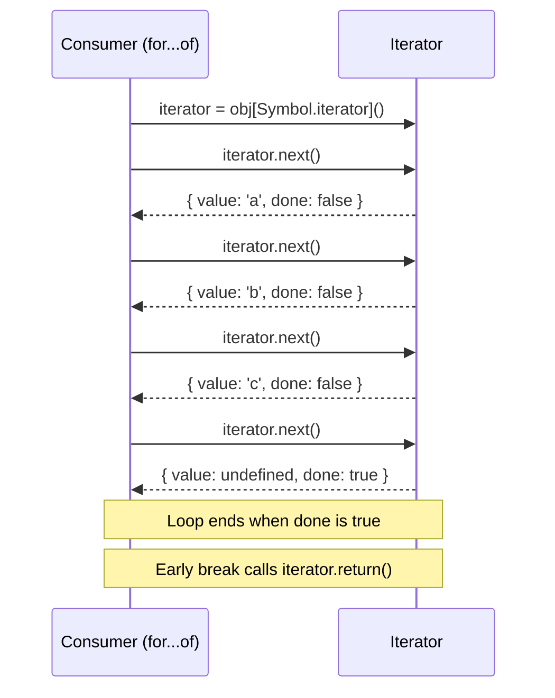

# [FEE-308] Iterators, Generators & Async Iteration

:::info
JavaScript arrays have always been iterable with `for` loops, but Maps, Sets, custom data structures, and asynchronous data sources needed a universal contract for sequential access. ES2015 introduced the iteration protocols -- `Symbol.iterator` and the `{ next() }` interface -- giving every data structure a single, composable way to produce values on demand. ES2018 extended this to asynchronous sources with `Symbol.asyncIterator` and `for await...of`. Understanding these protocols is essential because they underpin `for...of`, spread syntax, destructuring, `Array.from()`, `Promise.all()`, and the entire Web Streams API.
:::

## Context

Before ES2015, iterating over different data structures required different mechanisms. Arrays used index-based `for` loops. Objects used `for...in` (which enumerates all enumerable properties, including inherited ones). NodeList required converting to an array or using `Array.prototype.forEach.call()`. There was no uniform way to say "this thing produces a sequence of values."

The iteration protocols solved this by defining two complementary contracts:

1. **The iterable protocol** -- an object implements `[Symbol.iterator]()` to declare that it can produce a sequence.
2. **The iterator protocol** -- the returned object has a `next()` method that returns `{ value, done }`.

Built-in iterables include Array, String, Map, Set, TypedArray, arguments, NodeList, URLSearchParams, FormData, and Headers. Any custom object can become iterable by implementing `Symbol.iterator`.

ES2015 also introduced **generator functions** (`function*`) -- a syntactic shortcut for creating iterators. Generators pause execution at each `yield` and resume when `next()` is called, making them ideal for lazy sequences.

ES2018 extended the model to asynchronous data with the **async iteration protocol**: `Symbol.asyncIterator`, `for await...of`, and `async function*`. This enables pull-based consumption of data that arrives over time -- paginated APIs, streaming responses, file chunks, and WebSocket messages.

## Design Thinking

### Why JS adopted the iterator protocol

The core motivation was **uniform interface**: one protocol that works for Arrays, Maps, Sets, Strings, TypedArrays, DOM collections, and any custom structure. Before this, every library invented its own traversal API. The iterator protocol lets language constructs -- `for...of`, spread, destructuring, `Array.from()`, `Promise.all()`, `Map()` constructor -- work with any iterable without knowing its internal structure.

**Lazy evaluation** was the second motivation. An iterator produces values one at a time, on demand. A range from 1 to 1,000,000 does not need to allocate an array of 1,000,000 elements -- it produces each number only when `next()` is called. This matters for memory-constrained environments and infinite sequences (Fibonacci, sensor readings, event streams).

**Composability** was the third goal. Because every iterable conforms to the same protocol, generic utilities -- `map`, `filter`, `take`, `zip` -- can be written once and work with any source. The TC39 Iterator Helpers proposal (shipping in V8 v12.2+) adds these methods directly to `Iterator.prototype`.

### Pull vs push models

Iterators implement a **pull model**: the consumer decides when to get the next value by calling `next()`. The producer is passive -- it waits until asked. This gives the consumer full control over backpressure and timing.

The alternative is a **push model**: the producer decides when to emit values. Callbacks, EventEmitter, and Observables (RxJS) follow this pattern. The producer pushes data whether the consumer is ready or not, requiring buffering or dropping strategies.

The distinction matters for async data:

| Aspect | Pull (Iterator) | Push (Observable/EventEmitter) |
|--------|-----------------|-------------------------------|
| Control | Consumer calls `next()` | Producer emits events |
| Backpressure | Built-in (consumer controls pace) | Requires explicit handling |
| Cancellation | `return()` on iterator | `unsubscribe()` / `removeListener()` |
| Use case | Paginated API, file chunks | DOM events, WebSocket messages |

Async iterators bridge the two: the consumer pulls with `next()`, but `next()` returns a Promise, allowing the producer to resolve it when data is ready. This gives pull-based backpressure with asynchronous delivery.

### Web platform iterables

The iteration protocol is deeply integrated into the web platform:

- **ReadableStream** implements `Symbol.asyncIterator` (WHATWG Streams spec). You can consume a fetch response body with `for await (const chunk of response.body)` instead of manually managing readers.
- **URLSearchParams**, **FormData**, and **Headers** implement `Symbol.iterator`, yielding `[key, value]` pairs -- matching Map's iteration behavior.
- **NodeList** is iterable, so `for (const el of document.querySelectorAll('div'))` works without conversion.

### Framework streaming patterns

Modern frameworks leverage async iteration for streaming server-side rendering:

- **React** -- `renderToPipeableStream()` produces a Node.js readable stream for streaming SSR. React Server Components can be async (returning Promises), and the server streams HTML chunks as components resolve, enabling progressive hydration.
- **Astro Islands** -- Astro streams the HTML shell immediately, then streams each island component as it resolves. Non-critical islands can be deferred with `client:idle` or `client:visible`, and the streamed HTML includes inline scripts that hydrate each island independently.
- **Next.js** -- App Router uses React Suspense boundaries to stream content progressively. Each `<Suspense>` boundary becomes a streaming chunk. The `loading.js` convention automatically wraps route segments in Suspense.

These patterns all rely on the same fundamental concept: producing data incrementally (streaming/iteration) rather than buffering everything before sending.

## Visual

The following sequence diagram shows how a consumer interacts with an iterator through the `next()` protocol:



The consumer drives the interaction. Each call to `next()` pulls one value. When `done` is `true`, the sequence is exhausted. If the consumer breaks out of the loop early, `for...of` automatically calls `iterator.return()` (if it exists), giving the iterator a chance to release resources.

## Example

### 1. Custom iterable Range class (lazy number production)

```js
class Range {
  constructor(start, end, step = 1) {
    this.start = start;
    this.end = end;
    this.step = step;
  }

  // Implement the iterable protocol
  [Symbol.iterator]() {
    let current = this.start;
    const { end, step } = this;

    return {
      next() {
        if (current <= end) {
          const value = current;
          current += step;
          return { value, done: false };
        }
        return { value: undefined, done: true };
      },

      // Make the iterator itself iterable (best practice)
      [Symbol.iterator]() {
        return this;
      }
    };
  }
}

// Works with for...of
for (const n of new Range(1, 5)) {
  console.log(n); // 1, 2, 3, 4, 5
}

// Works with spread
const nums = [...new Range(0, 100, 10)]; // [0, 10, 20, ..., 100]

// Works with destructuring
const [first, second, third] = new Range(10, 50, 10);
// first = 10, second = 20, third = 30

// Works with Array.from
const arr = Array.from(new Range(1, 5)); // [1, 2, 3, 4, 5]
```

### 2. Generator for Fibonacci (infinite lazy sequence)

```js
function* fibonacci() {
  let a = 0;
  let b = 1;
  while (true) {
    yield a;
    [a, b] = [b, a + b];
  }
}

// Take only the first 10 values -- the generator never computes more
function take(n, iterable) {
  const result = [];
  for (const value of iterable) {
    result.push(value);
    if (result.length >= n) break; // triggers generator.return()
  }
  return result;
}

console.log(take(10, fibonacci()));
// [0, 1, 1, 2, 3, 5, 8, 13, 21, 34]

// Generator delegation with yield*
function* range(start, end) {
  for (let i = start; i <= end; i++) yield i;
}

function* concatenated() {
  yield* range(1, 3);   // yields 1, 2, 3
  yield* range(10, 12); // yields 10, 11, 12
}

console.log([...concatenated()]); // [1, 2, 3, 10, 11, 12]

// Generators support two-way communication
function* accumulator() {
  let total = 0;
  while (true) {
    const value = yield total; // yield current total, receive next value
    total += value;
  }
}

const acc = accumulator();
acc.next();       // { value: 0, done: false } -- primes the generator
acc.next(10);     // { value: 10, done: false }
acc.next(20);     // { value: 30, done: false }
acc.next(5);      // { value: 35, done: false }
```

### 3. Async generator for paginated API with for await...of

```js
// Async generator: fetches pages on demand (pull-based)
async function* fetchPages(baseUrl) {
  let page = 1;
  let hasMore = true;

  while (hasMore) {
    const response = await fetch(`${baseUrl}?page=${page}&limit=50`);
    if (!response.ok) {
      throw new Error(`HTTP ${response.status}: ${response.statusText}`);
    }

    const data = await response.json();
    yield* data.items; // yield each item individually

    hasMore = data.hasNextPage;
    page++;
  }
}

// Consumer controls the pace -- no unnecessary fetches
async function findUser(name) {
  for await (const user of fetchPages("/api/users")) {
    if (user.name === name) {
      return user; // breaks the loop, stops fetching further pages
    }
  }
  return null;
}

// Streaming response body as async iterable
async function streamResponse(url) {
  const response = await fetch(url);
  const decoder = new TextDecoder();
  let fullText = "";

  // ReadableStream implements Symbol.asyncIterator
  for await (const chunk of response.body) {
    fullText += decoder.decode(chunk, { stream: true });
    updateUI(fullText); // progressive rendering
  }

  fullText += decoder.decode(); // flush remaining bytes
  return fullText;
}

// Async generator with cleanup (try/finally)
async function* watchEvents(url) {
  const eventSource = new EventSource(url);
  const queue = [];
  let resolve;
  let pending = new Promise(r => (resolve = r));

  eventSource.onmessage = (event) => {
    queue.push(JSON.parse(event.data));
    resolve();
    pending = new Promise(r => (resolve = r));
  };

  try {
    while (true) {
      await pending;
      while (queue.length > 0) {
        yield queue.shift();
      }
    }
  } finally {
    // Cleanup runs when consumer breaks or calls return()
    eventSource.close();
  }
}

// Usage: loop automatically calls return() on break
for await (const event of watchEvents("/api/events")) {
  console.log(event);
  if (event.type === "done") break; // triggers finally block
}
```

## Common Mistakes

### 1. Forgetting generators are lazy -- they do not execute until next() is called

```js
function* processItems(items) {
  console.log("Generator started!"); // never runs if next() is never called
  for (const item of items) {
    console.log(`Processing ${item}`);
    yield transform(item);
  }
  console.log("Generator finished!");
}

// BAD: assuming the generator runs immediately
const gen = processItems(["a", "b", "c"]);
// Nothing logged! The function body has not executed yet.

// The body runs incrementally as you call next()
gen.next(); // NOW "Generator started!" and "Processing a" are logged
gen.next(); // "Processing b" is logged
// "Processing c" and "Generator finished!" only run if you continue iterating

// FIX: if you need eager execution, use a regular function
// and collect results into an array. Use generators when you
// want lazy, on-demand evaluation.
```

### 2. Not calling return() when breaking early (resource leaks)

```js
// A generator that opens a resource
function* readLines(filePath) {
  const handle = openFile(filePath);
  try {
    let line;
    while ((line = handle.readLine()) !== null) {
      yield line;
    }
  } finally {
    handle.close(); // critical cleanup
    console.log("File handle closed");
  }
}

// GOOD: for...of calls return() automatically on break
for (const line of readLines("/data/log.txt")) {
  if (line.includes("ERROR")) {
    console.log(line);
    break; // for...of calls generator.return() -> finally block runs
  }
}

// BAD: manual iteration without calling return()
const gen = readLines("/data/log.txt");
const first = gen.next(); // file opened, first line read
// If you stop here without calling gen.return(), the finally block
// never runs and the file handle leaks!

// FIX: always use for...of, or call return() manually
gen.return(); // forces the finally block to execute
```

### 3. Confusing for...in (keys, includes prototype) with for...of (values, iterator protocol)

```js
const arr = ["a", "b", "c"];
arr.customProp = "oops";

// for...in: enumerates enumerable property KEYS (including inherited)
for (const key in arr) {
  console.log(key); // "0", "1", "2", "customProp"
  // Strings, not numbers! Includes the custom property.
}

// for...of: consumes the iterable protocol -- yields VALUES
for (const value of arr) {
  console.log(value); // "a", "b", "c"
  // No "customProp" -- only the iterable sequence.
}

// Objects are NOT iterable by default
const obj = { x: 1, y: 2 };
// for (const v of obj) {} // TypeError: obj is not iterable

// FIX: use Object.entries() which returns an iterable
for (const [key, value] of Object.entries(obj)) {
  console.log(key, value); // "x" 1, "y" 2
}
```

### 4. Array.from() or spread on huge iterables defeats lazy evaluation

```js
function* hugeRange(n) {
  for (let i = 0; i < n; i++) yield i;
}

// BAD: materializes 10 million elements into memory
const allNumbers = [...hugeRange(10_000_000)]; // ~80 MB for 10M numbers
const filtered = allNumbers.filter(n => n % 1000 === 0);

// GOOD: stay lazy with generator composition
function* filter(predicate, iterable) {
  for (const value of iterable) {
    if (predicate(value)) yield value;
  }
}

function* take(n, iterable) {
  let count = 0;
  for (const value of iterable) {
    yield value;
    if (++count >= n) return;
  }
}

// Only 10 values ever exist in memory at once
const result = [
  ...take(10, filter(n => n % 1000 === 0, hugeRange(10_000_000)))
];
// [0, 1000, 2000, 3000, 4000, 5000, 6000, 7000, 8000, 9000]

// BETTER (ES2025+): use built-in Iterator Helpers
const result2 = hugeRange(10_000_000)
  .filter(n => n % 1000 === 0)
  .take(10)
  .toArray();
```

### 5. Not handling errors in async generators

```js
async function* fetchStream(url) {
  const response = await fetch(url);
  for await (const chunk of response.body) {
    yield chunk;
  }
}

// BAD: network errors crash the process
async function consume() {
  for await (const chunk of fetchStream("/api/stream")) {
    process(chunk); // if fetch fails or stream errors, unhandled rejection
  }
}

// GOOD: wrap in try/catch, handle both fetch and stream errors
async function consumeSafely() {
  try {
    for await (const chunk of fetchStream("/api/stream")) {
      process(chunk);
    }
  } catch (error) {
    if (error.name === "AbortError") {
      console.log("Stream aborted");
    } else {
      console.error("Stream error:", error);
      // retry logic, fallback, or graceful degradation
    }
  }
}

// You can also throw errors INTO a generator
async function* resilientStream(url, maxRetries = 3) {
  let retries = 0;
  while (retries < maxRetries) {
    try {
      const response = await fetch(url);
      for await (const chunk of response.body) {
        yield chunk;
      }
      return; // stream completed successfully
    } catch (error) {
      retries++;
      if (retries >= maxRetries) throw error;
      await new Promise(r => setTimeout(r, 1000 * retries)); // backoff
    }
  }
}
```

## Related FEEs

- **[FEE-300](/en/JavaScript%20Core%20and%20Runtime/300)** -- JavaScript Core & Runtime Overview: iterators are part of the core language runtime
- **[FEE-301](/en/JavaScript%20Core%20and%20Runtime/301)** -- Event Loop & Task Queues: async iteration scheduling -- `for await...of` uses microtasks to resolve each `next()` Promise
- **[FEE-303](/en/JavaScript%20Core%20and%20Runtime/303)** -- Prototypes & Inheritance: `Symbol.iterator` is defined on prototype objects (Array.prototype, Map.prototype, etc.)
- **[FEE-307](/en/JavaScript%20Core%20and%20Runtime/307)** -- ES Modules & Module Systems: dynamic `import()` returns a Promise, connecting to async patterns

## References

- [ECMA-262 -- Iteration](https://tc39.es/ecma262/multipage/control-abstraction-objects.html#sec-iteration) -- the specification defining IteratorResult, the iterator protocol, generator objects, and async iterator semantics
- [MDN -- Iteration protocols](https://developer.mozilla.org/en-US/docs/Web/JavaScript/Reference/Iteration_protocols) -- comprehensive reference for the iterable and iterator protocols with examples
- [MDN -- Iterators and generators](https://developer.mozilla.org/en-US/docs/Web/JavaScript/Guide/Iterators_and_generators) -- guide covering generator functions, yield, and custom iterables
- [MDN -- for await...of](https://developer.mozilla.org/en-US/docs/Web/JavaScript/Reference/Statements/for-await...of) -- syntax and semantics of async iteration loops
- [MDN -- async function*](https://developer.mozilla.org/en-US/docs/Web/JavaScript/Reference/Statements/async_function*) -- async generator function declaration and behavior
- [MDN -- Symbol.asyncIterator](https://developer.mozilla.org/en-US/docs/Web/JavaScript/Reference/Global_Objects/Symbol/asyncIterator) -- the well-known symbol for async iteration
- [V8 -- Faster async functions and promises](https://v8.dev/blog/fast-async) -- V8 optimizations for async/await and async iteration performance
- [V8 -- Iterator helpers](https://v8.dev/features/iterator-helpers) -- built-in methods on Iterator.prototype for composing lazy sequences
- [WHATWG Streams Standard](https://streams.spec.whatwg.org/) -- ReadableStream as async iterable, defining how streaming data integrates with the async iteration protocol
- [MDN -- ReadableStream](https://developer.mozilla.org/en-US/docs/Web/API/ReadableStream) -- web API reference for readable streams including async iteration support
- [Jake Archibald -- Async iterators and generators](https://jakearchibald.com/2017/async-iterators-and-generators/) -- practical guide to async iteration patterns with streaming fetch examples
