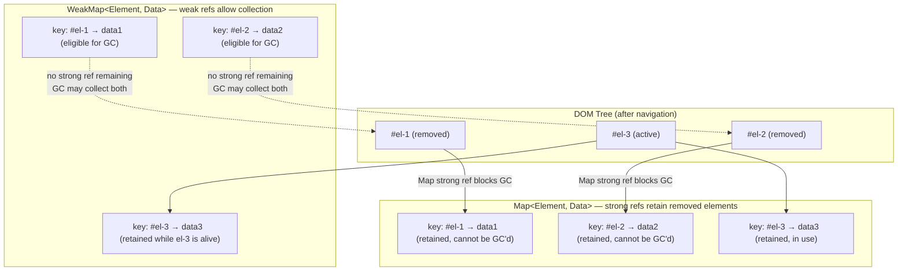

# WeakMap, WeakSet & Weak References

`WeakMap` and `WeakSet` hold weak references to their keys or values -- "weak" means the reference does not prevent garbage collection. If the only remaining reference to an object is its key in a `WeakMap`, the GC can reclaim it and the entry disappears silently. This makes them non-iterable: there is no `.forEach`, no `.size`, no `.keys()` -- exposing those would reveal GC timing, which is implementation-defined and intentionally hidden from application code. The non-iterability is not a limitation; it is a correctness guarantee baked into the design.

The practical purpose is associating metadata with an object without preventing its collection when all other references are gone. DOM nodes are the canonical example: attaching data via `WeakMap<Node, Data>` means cleanup is automatic when the node is removed from the document and collected. The equivalent `Map<Node, Data>` grows indefinitely as elements are created and destroyed in a long-running SPA, because `Map` holds strong references to every key it has ever seen -- even keys whose DOM nodes have been removed, whose component trees have been unmounted, and whose associated UI has been replaced by multiple subsequent renders.

`WeakRef` (ES2021) and `FinalizationRegistry` extend this model for explicit weak references and post-collection callbacks. These are lower-level primitives suited to caches and resource tracking -- not general application code. GC timing is implementation-defined, environment-dependent, and intentionally unspecified by the language specification. An object may be collected in milliseconds or persist for the entire process lifetime. Never write logic that depends on when, or whether, collection occurs.

All four weak primitives -- `WeakMap`, `WeakSet`, `WeakRef`, and `FinalizationRegistry` -- share a common constraint: keys and registered targets must be objects (or, in newer engine versions, certain non-registered symbols). Primitives like strings, numbers, and booleans are not valid keys for `WeakMap` or `WeakSet`. The reason is that primitives are value types: there is no identity to hold weakly, no object to track for reachability. The restriction is enforced at runtime with a `TypeError`. ES2023 extended `WeakMap` and `WeakSet` to also accept registered symbols as keys -- the result of `Symbol.for(key)`, which have a global identity and can be looked up by key -- while unregistered symbols created with `Symbol()` remain invalid keys because they lack the global identity the engine needs to track for GC purposes.

## Scenario

You are building a component library where each DOM element needs private metadata — a unique ID and internal state — that should not be accessible from outside the component. Storing this data on the element itself pollutes the DOM node's properties. Storing it in a `Map` keyed by the element prevents garbage collection of detached elements. `WeakMap` solves both problems: it associates private data with an object without preventing the object from being collected when it is no longer referenced.

## Design Thinking

### WeakMap as private fields before private fields

Before JavaScript introduced `#privateFields` syntax (Stage 3 in 2019, shipping in V8 7.2 and all modern browsers), `WeakMap` was the idiomatic way to implement per-instance private state in class-like objects. The pattern stored a `WeakMap` in the enclosing module scope -- outside the class definition -- keyed by `this`. Methods accessed private state by performing a lookup on the module-scoped `WeakMap` using the current instance as the key. Because the `WeakMap` was not exported, external code had no way to reach the private state -- unlike a naming convention such as `_private`, which is merely a social contract that any caller can ignore without a runtime error.

The pattern worked for the right reasons. Each key was the instance itself, so when the instance became unreachable and was collected by the GC, the `WeakMap` entry was automatically released. No manual cleanup, no memory leak, no teardown hook required. The `WeakMap` also provided genuine tamper resistance at the module boundary: even knowing the variable name, code outside the module could not call `map.get(someInstance)` without importing the `WeakMap` reference from the module. This was stronger isolation than the `_private` convention and weaker than C++'s compile-time enforcement -- but it was exactly the protection level JavaScript needed before the language grew native syntax for it.

`#privateFields` is the better choice for new code in every environment that supports them. The engine stores private fields directly on the object's internal representation rather than in a side table, making property access faster than a `WeakMap.get()` lookup. The syntax is more readable -- `this.#count` versus `privateData.get(this).count`. There is no module-scoped variable to manage, no risk of accidentally exporting the wrong symbol, and no boilerplate initialization at the top of every module.

`WeakMap`-based private data remains relevant in two specific situations. First, when the private state must be accessible from outside the class definition -- factory patterns, mixins, module-level helper functions that are not methods of the class. Second, when targeting environments predating `#privateFields` support without a transpiler. In all other cases, `#privateFields` is the correct default.

### Map vs WeakMap: a comparison

The following table summarizes the behavioral differences that determine which type to reach for in a given situation:

| Aspect | `Map` | `WeakMap` |
|--------|-------|-----------|
| Reference type | Strong (prevents GC) | Weak (allows GC) |
| Key types | Any value (primitives, objects) | Objects only |
| Iterable | Yes (`.forEach`, `.keys()`, `.entries()`) | No |
| `.size` property | Yes | No |
| Entry lifetime | Explicit deletion required | Follows key lifetime |
| Use case | General key-value storage | Object-associated metadata |
| Memory risk | Retains keys indefinitely | Self-cleaning when keys are collected |

The table makes the tradeoff explicit: `Map` is more powerful (any key type, iterable, size-aware), but that power comes with the responsibility of manual cleanup. `WeakMap` is deliberately restricted -- no iteration, no size -- precisely because those restrictions are what enable automatic cleanup. You cannot accidentally forget to clean up a `WeakMap` entry, because cleanup is not your responsibility.

### DOM metadata without memory leaks

The most common production memory leak in SPA code follows a predictable structure: a `Map` or plain object is used as a registry to associate data with DOM elements, components, or request objects. Elements are created during navigation, their data is stored in the registry, the elements are later destroyed and removed from the DOM -- but the registry still holds a strong reference to each one. The GC cannot collect the elements because the `Map` maintains a live path from the GC root to each retained element. The registry grows for the lifetime of the application.

This pattern appears in many forms across a typical SPA codebase. An event tracking library stores click counts or interaction timestamps per element using `Map<HTMLElement, TrackingData>`. A tooltip system stores tooltip state and positioning per anchor element using `Map<HTMLElement, TooltipState>`. A drag-and-drop system stores drag constraints per draggable element. An animation system stores keyframe state per animated element. A form validation library stores field error state per input. Every one of these accumulates entries across navigations, component re-renders, and list updates unless the application explicitly deletes entries when elements are removed.

Explicit deletion is fragile in practice. It depends on every code path that creates an element also providing a teardown path that calls the cleanup, and that teardown path being reliably invoked by every framework lifecycle hook, every conditional render, and every dynamic list mutation. Teardown paths are frequently added for the happy path and omitted for error paths, component upgrade paths, and hot-reload paths during development. The leak only becomes visible under sustained real-world usage, making it difficult to detect in code review or short test sessions.

A `WeakMap` solves this structurally. Because a `WeakMap` holds weak references to its keys, an element in a `WeakMap` can be collected the moment no strong reference to it exists elsewhere. No manual cleanup step. No `onDestroy` hook to remember. No `registry.delete(element)` call that can be forgotten in a refactor. The relationship between element and data exists exactly as long as the element does, and not one moment longer.

This distinction matters most in frameworks that render and destroy components at high frequency. React re-renders can create and discard dozens of elements per second in a large component tree. Vue's reactivity system re-creates DOM nodes on reactive updates. Angular's structural directives continuously create and destroy elements as data changes. A `Map`-based registry accumulates an entry for every element that has ever been rendered, across the entire session lifetime, unless lifecycle hooks clean up explicitly.

### WeakSet for object tagging

`WeakSet` is a collection of objects where membership does not prevent collection. The primary use case is tracking whether a given object has already been processed -- without preventing the object from being collected after processing is complete.

A recursive transform that visits every node in an object graph needs to detect cycles. A `Set` approach works but keeps every visited node alive for the duration of the traversal. If the visited set escapes the traversal scope -- stored as a module variable for cross-call reuse, passed as argument state to a subsequent processing pass, or captured by a closure for diagnostic purposes -- nodes are permanently retained. A `WeakSet` allows visited objects to be collected once the transform completes and no other code holds strong references to them.

A related use case is cycle detection in graph traversal algorithms. When implementing depth-first search on a potentially cyclic object graph, a WeakSet that tracks visited nodes prevents infinite recursion without retaining those nodes after the traversal completes. A regular Set would retain all visited nodes for the lifetime of the traversal's caller, which in a framework context may be significantly longer than the traversal itself.

Another use case is deduplication in event-driven systems. Before processing a request or message object, check whether it is already in a `WeakSet` of in-progress items. When the request finishes and is dropped by all application-level code, the `WeakSet` entry disappears automatically. No explicit cleanup is needed; the in-progress registry cannot grow stale.

`WeakSet` is also suitable for branding objects at construction time to enforce invariants at runtime. A factory function adds each produced object to a module-scoped `WeakSet` before returning it. A method that requires a branded object calls `brandedSet.has(this)` at the start of its body and throws if the check fails. Because membership uses `WeakSet`, the brand does not prevent the object from being collected when all application-level references to it are released.

### WeakRef and FinalizationRegistry

`WeakRef` wraps an object and allows you to retrieve it -- or discover that it has been collected -- without preventing collection. You call `.deref()` to get the current value; it returns the object if it is still alive, or `undefined` if it has been collected. The specification provides one important consistency guarantee: within the same synchronous execution turn (a single task or microtask checkpoint), if `.deref()` returns the object once, it will not return `undefined` during the same turn. This enables a safe usage pattern: call `.deref()` once at the start of a synchronous block, store the result in a local variable, and use the local variable throughout the block without re-checking. Do not call `.deref()` repeatedly across `await` boundaries and assume consistency.

The intended use cases for `WeakRef` are: caches where the entry can be recomputed on a miss, proxies to large objects where the large object should be independently collectable, and debug tooling that tracks live instances without affecting their lifecycle. A critical observation: introducing a `WeakRef` always adds a code path that would never be exercised in a healthy application -- the "cached value was collected" path. That path must be correct, tested, and ideally exercised in test environments via explicit GC invocation in Node.js using `--expose-gc` and `global.gc()`. An untested cache-miss path is a latent bug that will eventually surface in production under memory pressure.

`FinalizationRegistry` runs a callback after a registered object is collected. The callback receives a cleanup token -- any value provided at registration time, typically an identifier or a secondary resource handle -- not the object itself, which is gone. The intended use cases are: detecting missed explicit cleanup in development builds, cleaning up entries in secondary stores that hold data by identifier rather than by object reference, and integrating with native resources in `Napi` addon code where a JavaScript object is a thin wrapper around a native handle.

One important registration detail: the cleanup token passed to `register()` must not be the same object being registered. Passing the object itself as the token would create a strong reference to the object from the registry, preventing collection -- defeating the entire purpose. Always pass an independent value: a string key, a numeric ID, or a secondary object that holds only the cleanup information needed, not the primary resource.

The critical invariant for both APIs: every code path must be correct regardless of whether collection has occurred. A `WeakRef` target may be alive or dead at any `.deref()` call. A `FinalizationRegistry` callback may fire in a different task, in a different microtask checkpoint, or never at all within the process lifetime. Implementations are explicitly permitted to skip finalization callbacks in scenarios including process exit, aggressive GC suppression, and certain heap snapshot operations. Application code that is correct only when collection has occurred, or correct only when it has not, is incorrect code -- not merely unlucky code.

The following table summarizes which weak primitive to reach for based on the task at hand:

| Task | Recommended primitive | Reason |
|------|-----------------------|--------|
| Associate data with object, same lifetime | `WeakMap` | Automatic cleanup, no iteration needed |
| Track "has this been seen" without retaining | `WeakSet` | Membership check only, no value storage |
| Cache that should not block GC | `WeakRef` | Explicit deref, cache-miss path required |
| Detect missed cleanup in dev builds | `FinalizationRegistry` | Safety net, not primary cleanup mechanism |
| Private per-instance state | `#privateFields` (first), `WeakMap` (fallback) | Fields are faster and more readable |

### Engine behavior and observability

The reason `WeakMap` and `WeakSet` are non-iterable goes deeper than the specification rule. If you could enumerate a `WeakMap`'s entries, the set of entries you see would differ depending on when -- during program execution -- you called `.keys()`. On a machine under memory pressure, GC runs more frequently and more aggressively; on an idle machine with abundant heap, entries may persist longer. Code that iterated a `WeakMap` would behave differently across runs, across browser versions, and across hardware profiles. This is the definition of non-deterministic behavior, and the specification eliminates it by prohibiting the operation entirely.

The same reasoning explains why `WeakRef.deref()` can return `undefined` at any call site. The specification could have required implementations to keep `WeakRef` targets alive for a minimum duration, or to only collect them at specific checkpoints. It deliberately does not -- because any such guarantee would constrain GC implementations in ways that harm performance, and would still not give application code a reliable timing signal. The correct response is to write code that handles both cases every time.

V8's garbage collector collects objects in "young generation" (minor GC) and "old generation" (major GC) cycles. A newly created object held only by a `WeakMap` key may be collected in the next minor GC cycle -- potentially within milliseconds. An older object that has survived several minor GCs and been promoted to the old generation may not be collected until a major GC runs, which could be minutes later under normal heap pressure. Application code cannot observe or control which cycle applies to a given object. The correct assumption is: a `WeakRef` target may be collected at any time, and any code that depends on it must handle collection.

The design choice to make `WeakMap` and `WeakSet` non-iterable also reflects a deliberate stance on the boundary between the application layer and the runtime layer. Iteration implies a stable, queryable snapshot of a collection. Weak collections have no stable snapshot: their contents change as a side effect of GC, which the application neither initiates nor controls. Exposing iteration would leak GC timing into observable program behavior, transforming a runtime implementation detail into a semantic contract. By prohibiting enumeration entirely, the specification keeps GC timing strictly internal to the runtime -- the correct place for it -- and forces application code to model object lifetimes explicitly rather than infer them from collection membership.

## Best Practices

**SHOULD use `WeakMap` to associate metadata with DOM elements, class instances, or other objects when the metadata has no independent lifetime.** The most common misuse is `Map<Element, Data>` inside a component manager, event tracking layer, or animation system. When elements are removed and replaced during navigation or conditional rendering, the `Map` retains them because `Map` holds strong references to all of its keys, growing without bound in long-running SPAs. The symptom is steadily increasing memory usage across navigations, visible in Chrome DevTools Memory panel as retained `HTMLElement` nodes with no live path from the document root. A `WeakMap` releases entries as elements are collected, making this leak structurally impossible. No `onDestroy` hook, no `registry.delete(el)` call, no fragile lifecycle coupling -- the cleanup is automatic and cannot be accidentally omitted in a refactor or during a component library upgrade. The flip side is that `WeakMap` cannot be queried for its current size or enumerated: if you need either of those capabilities, `Map` with explicit lifecycle management is the correct choice.

**MUST NOT rely on `FinalizationRegistry` callbacks for resource cleanup that must happen promptly.** File handles, network connections, open database transactions, WebSocket connections, and timer cancellation must be cleaned up explicitly via lifecycle methods, `try/finally` blocks, `using` declarations (TC39 Explicit Resource Management, Stage 3), or framework destroy hooks. A `FinalizationRegistry` callback may run seconds, minutes, or never after the tracked object becomes eligible for collection. The specification intentionally does not guarantee timing or even delivery -- implementations are permitted to skip finalization callbacks in scenarios including process termination and GC suppression. Use `FinalizationRegistry` as a safety net for detecting missed explicit cleanup in development builds -- a diagnostic tool, not the primary cleanup mechanism. A useful mental model: if removing the `FinalizationRegistry` entirely would cause correctness problems in production, the cleanup logic is in the wrong place.

**SHOULD prefer `#privateFields` over `WeakMap`-based private data in modern JavaScript.** Private class fields (all modern browsers, Node.js 12+) provide per-instance private storage with readable syntax, without the indirection of a side-table `WeakMap` lookup. The engine stores private fields directly on the object's hidden class, making access faster than a `WeakMap.get()` call and the code simpler to read and review. `WeakMap`-based private data remains the correct choice when private state must be accessible from outside the class definition (factory functions, mixin patterns, module-level helpers that are not class methods), or when targeting pre-`#privateFields` environments without a transpiler. In all other cases, `#privateFields` is the default, and the `WeakMap` private pattern is a historical artifact worth understanding but not worth reproducing in new code.

## Visual

The following diagram contrasts how `Map` and `WeakMap` interact with garbage collection when DOM elements are removed from the document. Both registries start with three entries. After `#el-1` and `#el-2` are removed from the DOM and all other references to them are released, the `Map` retains them via strong references -- they cannot be collected. The `WeakMap` holds only weak references; with no strong references remaining, both the elements and their associated entries become eligible for collection.



## Example

```js
// =============================================================
// WeakMap: prevent initialization state from leaking when
// elements are removed from the DOM.
//
// A plain Map retains every element passed to initComponent()
// forever -- even after removal. WeakMap releases entries
// automatically when the element becomes unreachable.
// =============================================================

const initialized = new WeakMap();

function initComponent(el) {
  if (initialized.has(el)) return;
  initialized.set(el, true);
  el.addEventListener('click', handleClick);
  // When el is removed from DOM and all other references drop,
  // GC can collect el. The WeakMap entry disappears automatically.
  // No registry.delete(el), no onDestroy hook, no cleanup to forget.
}

// =============================================================
// WeakMap for private class state (historical pattern).
// Modern code should prefer #privateFields instead.
// Shown here to illustrate why WeakMap was the pre-#field idiom.
// =============================================================

const _counter = new WeakMap(); // private to this module

class Counter {
  constructor(initial = 0) {
    _counter.set(this, initial);
  }

  increment() {
    _counter.set(this, _counter.get(this) + 1);
  }

  get value() {
    return _counter.get(this);
  }
}
// When a Counter instance is GC'd, its entry in _counter is released.
// External code cannot access _counter.get(instance) -- it's not exported.

// =============================================================
// WeakSet: track visited nodes in a recursive transform.
//
// A Set keeps every visited node alive for the traversal duration.
// WeakSet allows collection once the transform completes.
// =============================================================

function deepClone(obj, seen = new WeakSet()) {
  if (obj === null || typeof obj !== 'object') return obj;
  if (seen.has(obj)) return '[Circular]';
  seen.add(obj);
  const clone = Array.isArray(obj) ? [] : {};
  for (const key of Object.keys(obj)) {
    clone[key] = deepClone(obj[key], seen);
  }
  // After deepClone returns, `seen` is unreachable. All WeakSet members
  // become eligible for GC if no other references hold them.
  return clone;
}

// =============================================================
// WeakRef: a cache that does not prevent collection of its values.
//
// BOTH paths must be handled correctly:
//   1. Cache hit: ref.deref() returns the object
//   2. Cache miss: ref.deref() returns undefined (object was collected)
// =============================================================

class WeakCache {
  #store = new Map();

  set(key, value) {
    this.#store.set(key, new WeakRef(value));
  }

  get(key) {
    const ref = this.#store.get(key);
    if (!ref) return undefined;
    // Call deref() once; store in local variable for safe reuse.
    // Do NOT call deref() again later -- GC may run between calls.
    const value = ref.deref();
    if (value === undefined) {
      // The cached value was collected. Remove the stale entry.
      // This path must be tested explicitly -- it never fires in
      // a healthy app but will eventually hit in production.
      this.#store.delete(key);
    }
    return value; // undefined signals a miss; caller must recompute
  }
}

// =============================================================
// FinalizationRegistry: detect missed cleanup in development.
//
// Use as a safety net -- NOT as the primary cleanup mechanism.
// Callbacks may run late or never; do not depend on them for
// correctness. Explicit cleanup (try/finally, lifecycle hooks,
// `using` declarations) must remain the primary mechanism.
// =============================================================

const devRegistry = new FinalizationRegistry((label) => {
  // The registered object is gone.
  // Only the cleanup token (label string) is available here.
  console.warn(
    `[dev] Resource "${label}" was GC'd without explicit cleanup. ` +
    `Check that dispose() is called in all code paths.`
  );
});

function createManagedResource(label) {
  const resource = { label, buffer: new ArrayBuffer(1024 * 1024) };
  if (process.env.NODE_ENV === 'development') {
    // Register with a token that is NOT the object itself --
    // passing the object as token would prevent its collection.
    devRegistry.register(resource, label);
  }
  return resource;
}
```

## Common Mistakes

**Using `Map` instead of `WeakMap` for DOM-associated data, causing memory leaks in SPAs.** The symptom is memory usage that grows steadily throughout a session, visible in Chrome DevTools Memory panel as retained `HTMLElement` nodes with no live path from the document. The cause is a `Map<Element, any>` keyed by elements that were removed from the DOM -- the `Map` holds strong references, so the elements cannot be collected. This compounds across navigations: every page visit adds more retained elements, and the application's memory baseline rises until the tab is closed or the page refreshes. To diagnose, take a heap snapshot in DevTools, filter by `HTMLElement`, and look for nodes with `@Detached` prefix -- those are candidates. Fix: replace `Map` with `WeakMap` wherever the key's lifetime is the natural lifetime of the associated value and no enumeration of entries is needed.

**Attempting to iterate a `WeakMap` or read its `size`.** `WeakMap` and `WeakSet` deliberately omit `.forEach`, `.size`, `.keys()`, `.values()`, and `.entries()`. This is not an oversight -- exposing iteration would let application code observe GC timing, which the specification explicitly prohibits because it would create non-deterministic behavior that varies by engine, runtime version, memory pressure, and GC scheduling. If you need to enumerate associated data, use a regular `Map` (accepting the strong-reference semantics), or a separate index mapping key identifiers to data values, combined with explicit deletion on known lifecycle events. The need to enumerate is often a signal that the association has a different lifetime model and `Map` is the correct choice.

**Writing `WeakRef`-dependent logic that assumes the target has been collected after a `setTimeout`.** A common mistake when first using `WeakRef` is writing code like: wait a fixed interval, then check if the ref has been collected, and if so run cleanup. This is wrong in both directions. The GC may collect the target before the timeout, during it, or not at all within the process lifetime. The `WeakRef` target must be treated as potentially alive or potentially dead at every `.deref()` call -- not at a "safe" time chosen by a timer. Both the `undefined` case (collected) and the live-object case must be handled correctly and independently of any timing assumptions. Code that only handles one case is incorrect, not merely unlikely to fail.

**Passing the registered object as its own cleanup token in `FinalizationRegistry`.** Calling `registry.register(obj, obj)` passes a strong reference to `obj` as the cleanup token. The registry holds that strong reference internally, which prevents `obj` from being collected -- defeating the entire purpose. Always pass an independent value as the token: a string key, a numeric identifier, a secondary data structure that describes the cleanup work without holding a reference to the primary object being tracked.

## Related FEEs

- **[FEE-300](/en/JavaScript%20Core%20and%20Runtime/300)** -- JavaScript Core & Runtime Overview: foundational concepts for the JavaScript object model and reference semantics underlying weak collection behavior
- **[FEE-306](/en/JavaScript%20Core%20and%20Runtime/306)** -- Memory Management & Garbage Collection: the mark-and-sweep algorithm, GC roots, and why reachability determines object lifetime -- the mechanism that makes weak references meaningful
- **[FEE-401](/en/DOM%20and%20Browser%20APIs/401)** -- DOM Manipulation & Traversal: the context in which `WeakMap<Node, Data>` is most commonly applied and most consequential for application memory health

## References

- [MDN: WeakMap](https://developer.mozilla.org/en-US/docs/Web/JavaScript/Reference/Global_Objects/WeakMap) -- complete API reference, including the rationale for non-iterability and notes on the interaction with GC
- [MDN: WeakSet](https://developer.mozilla.org/en-US/docs/Web/JavaScript/Reference/Global_Objects/WeakSet) -- API reference covering valid value types, membership checks, and comparison with `Set`
- [MDN: WeakRef](https://developer.mozilla.org/en-US/docs/Web/JavaScript/Reference/Global_Objects/WeakRef) -- API reference with the same-turn consistency guarantee, notes on intended use cases, and cautions about GC timing
- [MDN: FinalizationRegistry](https://developer.mozilla.org/en-US/docs/Web/JavaScript/Reference/Global_Objects/FinalizationRegistry) -- callback registration, cleanup token semantics, and the explicit note that callbacks are not guaranteed to run
- [TC39: WeakRef proposal](https://github.com/tc39/proposal-weakrefs) -- the original TC39 proposal with motivating use cases, design rationale, the discussion of GC timing invariants, and the explicit guidance on what these APIs are not for
- [ECMA-262: WeakRef Objects](https://tc39.es/ecma262/#sec-weak-ref-objects) -- the normative specification text defining `WeakRef`, the same-turn liveness guarantee, and the permitted GC timing behaviors
- [V8 Blog: Orinoco -- young generation garbage collection](https://v8.dev/blog/orinoco-parallel-scavenger) -- V8's generational GC design, explaining minor and major collection cycles and why collection timing is non-deterministic from application code
- [Chrome DevTools: Fix memory problems](https://developer.chrome.com/docs/devtools/memory-problems/) -- practical guide to diagnosing memory leaks caused by retained DOM nodes, including how to use heap snapshots to identify `Map`-based leaks
- [MDN: Private class fields](https://developer.mozilla.org/en-US/docs/Web/JavaScript/Reference/Classes/Private_class_fields) -- the modern alternative to `WeakMap`-based private data, with syntax, browser support table, and comparison with the `WeakMap` pattern
- [TC39: Symbols as WeakMap keys proposal](https://github.com/tc39/proposal-symbols-as-weakmap-keys) -- the ES2023 extension allowing registered symbols as `WeakMap` and `WeakSet` keys, with motivation and design rationale
- [MDN: JavaScript memory management](https://developer.mozilla.org/en-US/docs/Web/JavaScript/Memory_management) -- overview of reference counting and mark-and-sweep GC, the lifecycle of reachable objects, and common memory leak patterns in JavaScript applications
- [ECMA-262: WeakMap Objects](https://tc39.es/ecma262/#sec-weakmap-objects) -- normative specification for `WeakMap`, including the formal definition of weak references and the invariants that engines must satisfy regarding GC ordering
- [MDN: Using the Web Performance API](https://developer.mozilla.org/en-US/docs/Web/API/Performance_API/Using_the_Performance_API) -- tools for measuring memory and timing that can surface the effects of `WeakMap` versus `Map` under realistic workloads
- [MDN: FinalizationRegistry use cases](https://developer.mozilla.org/en-US/docs/Web/JavaScript/Reference/Global_Objects/FinalizationRegistry#notes_on_cleanup_callbacks) -- notes on when cleanup callbacks run and the constraints on using GC events as observable application signals
