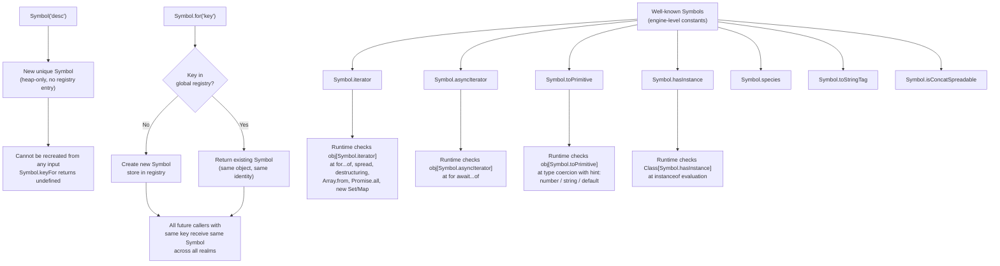

# Symbols & Well-Known Symbols

`Symbol` is a primitive type introduced in ES2015. Every Symbol value is
unique — `Symbol('tag') !== Symbol('tag')` — making Symbols suitable as
property keys guaranteed not to collide with any other key, whether from
user code, library code, or the JS engine itself. Unlike strings, integers,
or booleans, a Symbol cannot be recreated from data: there is no input you
can provide to obtain a previously created Symbol unless you hold a reference
to it or use the explicit global registry. The uniqueness guarantee is
unconditional and does not depend on naming conventions, namespacing
strategies, or discipline from callers. Symbols are also not auto-converted
to strings — attempting to use a Symbol in string concatenation throws a
`TypeError`, which catches accidental coercion early.

Well-known Symbols are built-in Symbol values that the JavaScript runtime
checks to configure built-in operation behavior. `Symbol.iterator` makes an
object iterable; `Symbol.toPrimitive` customizes type coercion;
`Symbol.hasInstance` customizes `instanceof`; `Symbol.species` customizes
derived constructors. These Symbols expose extension points into the
language's own semantics without creating reserved property names. The engine
looks for these well-known Symbol properties on objects at specific points in
algorithm execution — if present and callable, the method is invoked; if
absent, a default behavior applies. This is how user-defined classes
participate in language-level operations without any change to the language
specification itself. The full list of well-known Symbols is enumerated in
the ECMAScript specification under the heading "Well-Known Symbols and
Intrinsics."

Symbol-keyed properties are not enumerated by `for...in`, `Object.keys()`,
or `JSON.stringify()`. They are accessible via `Object.getOwnPropertySymbols()`
and `Reflect.ownKeys()`. This makes them useful for attaching metadata or
protocol methods to objects without affecting normal enumeration or
serialization. A library can tag objects with processing state, cache keys,
or protocol markers without those tags appearing in developer console output,
serialized payloads, or iteration loops. The property is still fully
accessible to any code that holds the Symbol — it is non-enumerable by
design, not hidden or secure in the cryptographic sense. `Reflect.ownKeys()`
returns the complete set of own property keys including both string and
Symbol keys, making it the authoritative way to inspect all properties on an
object regardless of key type.

## Design Thinking

### Symbol as non-colliding property key

String property keys occupy a flat shared namespace. Any two pieces of code
that happen to choose the same string key for different purposes will silently
share a property slot on any object that receives both annotations. This is
not a theoretical concern: the `__proto__`, `constructor`, `toString`, and
`valueOf` keys have all caused real-world security and correctness bugs when
used as plain object property names in user-supplied data contexts. The
convention of prefixing library-internal keys with underscores or
double-underscores is a social contract — it reduces accidental collision,
but it does not prevent deliberate collision, and it does not prevent
accidental collision between two libraries that both chose `__internalState`.
The underscore convention provides no runtime enforcement whatsoever: any
caller can read, overwrite, or delete `obj._internalState` with zero friction.

A Symbol key breaks this problem structurally. The key is not derived from a
string that any caller can replicate; it is a unique opaque value created at
module evaluation time. When a library stores its internal state under a
Symbol key, the only code that can access that slot is code that holds a
reference to the Symbol — which means code in the same module or code the
module explicitly chose to export the Symbol to. The pattern for
library-internal state is to create a Symbol at module scope with a
descriptive description string, use it as the property key throughout the
module, and never export it. External code sees none of it through
enumeration, none of it through `JSON.stringify`, and cannot accidentally
read or overwrite it.

The description string provided to `Symbol()` is purely informational.
`Symbol('myLib.processedFlag')` and `Symbol('myLib.processedFlag')` created
in two separate calls are two different Symbols — the string is displayed by
debuggers, returned by `sym.toString()`, and accessible via
`sym.description`, but it plays no role in identity or lookup. Two Symbols
with the same description are not equal, cannot be confused with each other
by the engine, and do not collide. This property makes it safe to choose
human-readable description strings without any risk of inadvertently sharing
a Symbol with code that happened to choose the same string.

The non-enumerability of Symbol keys matters beyond just privacy. Libraries
that instrument or serialize objects — loggers, ORMs, JSON serializers, state
management libraries — all rely on `Object.keys()` or `for...in` to determine
which properties to process. Symbol-keyed properties are invisible to all of
these. A Symbol-keyed internal flag on a model object will never appear in a
serialized API response, never be logged as part of the object's data, and
never be iterated as if it were a data property. This is correct behavior:
internal implementation details are not data, and they should not be treated
as data by code that processes the object's public surface. The separation is
enforced by the language, not by convention, documentation, or discipline.

Symbols created with `Symbol()` cannot be serialized by `JSON.stringify`
even when reached through `Reflect.ownKeys`. Symbol-keyed properties are
skipped entirely by the JSON serializer, which means there is no risk of
accidentally leaking internal state through a JSON API boundary. This is
distinct from using `enumerable: false` on a string-keyed property, which
would hide the property from `Object.keys()` and `for...in` but would still
be accessible via `Object.getOwnPropertyDescriptor()` and would still exist
in the same string namespace as all other properties. Symbol keys provide
both non-enumerability and namespace isolation in one step.

### Well-known Symbols as extension points

The JavaScript specification defines a set of Symbols under the `Symbol`
constructor object — `Symbol.iterator`, `Symbol.asyncIterator`,
`Symbol.toPrimitive`, `Symbol.hasInstance`, `Symbol.species`,
`Symbol.toStringTag`, `Symbol.isConcatSpreadable`, `Symbol.unscopables`,
and others. These are called well-known Symbols because they are known to
the language runtime itself. At specific points in built-in algorithm
execution, the engine checks whether an object has a property keyed by a
well-known Symbol and invokes it if present.

`Symbol.iterator` is the most widely used. The iterable protocol specifies
that an object is iterable if it has a method at `Symbol.iterator` that
returns an iterator — an object with a `next()` method returning
`{ value, done }` pairs. When `for...of` executes, when spread syntax
expands an iterable, when destructuring pulls values from a sequence, or
when `Array.from()` converts to an array, the engine invokes
`obj[Symbol.iterator]()`. This means any object — a custom collection, a
lazy range, a database cursor, a paginating API wrapper — participates in
all of those syntactic forms by implementing exactly one method at one
well-known Symbol key. Without `Symbol.iterator`, all of those use cases
require the user to manually call a class-specific method and lose
interoperability with language built-ins.

`Symbol.toPrimitive` controls how an object is coerced when JavaScript needs
a primitive value. The method receives a hint — `"number"`, `"string"`, or
`"default"` — and returns the appropriate primitive. Without
`Symbol.toPrimitive`, the engine falls back to `valueOf` and `toString` in
an order that depends on context. With `Symbol.toPrimitive`, the object's
author has full control over coercion behavior for each context, documented
explicitly in one place. `Symbol.hasInstance` lets a class customize what
`instanceof` means — a class can declare that instances of other
constructors, or objects with specific shapes, satisfy `instanceof MyClass`,
enabling duck-typing-style instance checks backed by the language keyword.
`Symbol.toStringTag` controls the string returned by
`Object.prototype.toString.call(obj)`, allowing custom objects to appear as
`[object MyClass]` in debuggers and serializers. `Symbol.asyncIterator`
extends the iterator protocol to async iteration: `for await...of` looks for
`Symbol.asyncIterator` first and falls back to `Symbol.iterator` only for
synchronous iterables consumed in an async context.

The pattern across all well-known Symbols is consistent and deliberate. The
runtime checks for the Symbol property, calls it if present, and applies a
default algorithm if absent. No class needs to extend a base class, implement
an interface declaration, or register with any registry. Presence of the
method is the interface. This is a fundamental design choice: the language
provides protocol hooks as opt-in, Symbol-keyed properties rather than as
inheritance requirements or registration mechanisms. It composes better,
requires less boilerplate, and avoids the fragile base class problem.

Consider the contrast with a hypothetical inheritance-based design. If
iterability required extending an `Iterable` base class, then any class that
already extended another class could not be iterable without multiple
inheritance. If iterability required calling a registration function, then
all iterable classes would need to run that registration at some point before
being used in an iterable context. The Symbol-based approach requires
neither: implement one method at one key, and the object participates in the
protocol from any calling context, including before any particular runtime
module has loaded. This is why well-known Symbols are the right mechanism for
language-level extension points.

### Symbol.for and the global registry

`Symbol.for(key)` creates or retrieves a Symbol from a cross-realm global
registry keyed by a string. The first call with a given string creates a new
Symbol and stores it in the registry; every subsequent call with the same
string returns the same Symbol. `Symbol.keyFor(sym)` is the inverse: it
accepts a Symbol and returns the registry key string if the Symbol was created
by `Symbol.for`, or `undefined` if it was created by `Symbol()` and is not
in the registry. This pair of operations provides a complete bidirectional
lookup between key strings and globally shared Symbols.

The purpose of `Symbol.for` is cross-realm sharing. In browser environments,
each iframe has its own realm with its own set of globals and its own module
evaluation context. A Symbol created with `Symbol()` in one iframe is not
the same object as a Symbol created with `Symbol()` in another iframe, even
if both used the same description string. `Symbol.for('myApp.serializable')`
returns the same Symbol in both realms because the global Symbol registry is
shared across realms within the same agent cluster. This matters for
libraries shipped in multiple bundles, for microfrontend architectures where
different teams own different realms, and for cases where a Symbol needs to
be used as a shared protocol key between independently loaded code.

The distinction from module-level constants is important. A module-level
`const sym = Symbol()` creates a unique Symbol once at module evaluation time
and exports it. Any code that imports the module receives the same Symbol —
because module instances are cached, the same module object is returned to
all importers within a realm. This is sufficient for single-realm
applications. The module cache is per-realm, however, so the same module
evaluated in two different realms produces two different module instances and
two different Symbols. `Symbol.for` avoids this by bypassing the module
system entirely and using the global registry. The registry string effectively
becomes a global name — which means it must be chosen carefully to avoid
collisions with other users of the registry, much like any other global
namespace.

A common pattern for cross-realm protocols is to use a reverse-domain-style
registry key such as `'com.mycompany.mylib.marker'`, similar to Java package
naming conventions, to reduce the probability of collision in the
unstructured global registry. There is no formal namespacing, but the
convention is widely understood. Libraries that expose a shared Symbol through
`Symbol.for` should document the key string explicitly, treat it as a
versioned public API, and never change the string once published, because
changing it would silently break all code in other realms that depended on
the original string to obtain the shared Symbol.

### Symbols in TypeScript

TypeScript provides the `unique symbol` type to represent a specific Symbol
value at the type level. When a Symbol is declared as
`const sym: unique symbol = Symbol()`, TypeScript treats that Symbol's type
as distinct from all other Symbols, enabling it to be used as a typed
computed property key. Two `unique symbol` declarations are distinct types
even if both hold a Symbol at runtime — the type system models the
uniqueness guarantee of `Symbol()`. The `unique symbol` type can only be
assigned to `const` declarations or `readonly static` class properties; `let`
declarations hold the broader `symbol` type, which is the union of all Symbol
values.

Computed property keys with Symbols use bracket syntax: `{ [sym]: value }`
in an object literal, or `[sym]()` as a method name in a class body.
TypeScript infers the type of these properties based on the `unique symbol`
type, so the property appears in `keyof` results and is accessible with
type-safe dot-notation equivalent access. The `typeof sym` expression at the
type level refers to the specific `unique symbol` type associated with that
`const` declaration — not just the string `"symbol"` returned at runtime by
the `typeof` operator. Interface augmentation with Symbol keys requires the
Symbol to be `const` and its type to be `unique symbol` for TypeScript to
treat the key as a distinct property slot rather than a general `symbol`
index signature.

When implementing well-known Symbols in TypeScript, the method signatures
align with those defined in the standard library type definitions in
`lib.es2015.iterable.d.ts` and related files. A class implementing
`Symbol.iterator` should conform to the `Iterable<T>` interface, and
TypeScript will verify that the method returns an object assignable to
`Iterator<T>`. Typed iterables integrate directly with `for...of`, array
destructuring, and spread in the type system: TypeScript knows the element
type from the generic parameter and applies it throughout without requiring
explicit type annotations at each use site. This is one of the cleaner
examples of TypeScript's structural type system aligning with JavaScript's
structural runtime behavior — the type and the runtime protocol are both
defined by the shape of the value, not by any declaration or registration.

## Best Practices

**SHOULD use `Symbol()` for library-internal property keys attached to
user-provided objects, not string keys.** String keys like `_internalState`
or `__processed` are visible to user code, enumerated by `Object.keys()`,
included in `JSON.stringify()` output, and susceptible to collision with any
other code that happens to choose the same name. A Symbol key is invisible to
standard enumeration and guaranteed unique, making it the correct choice for
any library that annotates user objects as part of its implementation. The
description string passed to `Symbol()` is solely for debugging and appears
in `sym.toString()` output — it has no effect on uniqueness, identity, or
accessibility, and choosing a descriptive string costs nothing in collision
probability.

**MUST implement `Symbol.iterator` on any custom collection class that should
be iterable with `for...of`, spread syntax, destructuring, or `Array.from()`.**
The iterable protocol is the JavaScript standard for custom iteration. Classes
that expose array-like data without implementing the protocol force users to
call implementation-specific methods such as `.toArray()` or `.forEach()`
instead of standard syntax, breaking interoperability with every API that
accepts iterables, including `Promise.all`, `new Set()`, `new Map()`, and
every future API that the language or platform adds. An object is iterable if
and only if it has a `Symbol.iterator` method that returns an iterator
conforming to the iterator protocol — an object with a `next()` method
returning `{ value, done }` pairs. Implementing this protocol once unlocks
participation in all present and future language features that consume
iterables.

**MUST NOT use `Symbol.for()` when the intent is to create a unique,
non-shared key.** `Symbol.for('myLib.state')` returns the same Symbol to any
code in any realm that calls `Symbol.for('myLib.state')`, including unrelated
code that happens to use the same registry string. The global registry has no
namespacing mechanism: the key string is the entire namespace, and any caller
who knows it gains access to the associated Symbol. If uniqueness and
non-collisibility are the goal, use `Symbol()` with no registry lookup, no
shared namespace, and a guarantee of uniqueness per call. Reserve
`Symbol.for()` for explicitly shared protocol Symbols where cross-realm
accessibility is the stated requirement, and treat the registry key string as
a public API with all the versioning and collision-avoidance responsibility
that implies.

## Visual



## Example

```js
class Range {
  constructor(start, end) {
    this.start = start;
    this.end = end;
  }

  [Symbol.iterator]() {
    let current = this.start;
    const end = this.end;
    return {
      next() {
        return current <= end
          ? { value: current++, done: false }
          : { value: undefined, done: true };
      }
    };
  }
}

// for...of
for (const n of new Range(1, 5)) {
  console.log(n); // 1, 2, 3, 4, 5
}

// spread
console.log([...new Range(1, 3)]); // [1, 2, 3]

// destructuring
const [a, b, c] = new Range(10, 12);
console.log(a, b, c); // 10 11 12

// Array.from
console.log(Array.from(new Range(1, 4))); // [1, 2, 3, 4]

// Works with Promise.all, new Set, new Map — any API that accepts an iterable
console.log(new Set(new Range(1, 3))); // Set(3) {1, 2, 3}
```

## Common Mistakes

Using `Symbol.for('desc')` when `Symbol()` was intended is the most frequent
error. Code that calls `Symbol.for('myLib.processedFlag')` believes it has a
private key, but any other module that calls
`Symbol.for('myLib.processedFlag')` — including code in a different bundle,
a different package, or a different origin realm — receives the identical
Symbol and gains access to the same property slot the library intended as
private. The illusion of privacy is broken by any caller who knows or guesses
the registry string. The fix is always `Symbol()` for private keys.

Attempting to call `Symbol` as a constructor with `new Symbol()` throws a
`TypeError`. `Symbol` is a factory function, not a constructor. The
prohibition is intentional: it prevents creating Symbol wrapper objects,
which would be objects rather than primitives and would compare by reference
rather than by value. The correct call is `Symbol()` or
`Symbol('description')` — no `new`. Similarly, `typeof Symbol('desc')`
returns `"symbol"`, confirming the primitive nature.

Using a string key rather than a Symbol for library-private state on user
objects creates a silent shared-namespace bug. The mistake is invisible until
a user or a second library happens to choose the same key name, at which
point two separate pieces of logic read and overwrite each other's state with
no error, no warning, and no stack trace pointing to the collision. The
failure mode is behavioral corruption — typically observed as intermittent
state inconsistencies that are difficult to reproduce or debug.

Forgetting `Symbol.asyncIterator` when porting a synchronous iterable to
async is a common omission. `for await...of` checks for `Symbol.asyncIterator`
first and falls back to `Symbol.iterator` only for sync iterables consumed in
an async context. A class that returns Promises from `next()` but registers
only `Symbol.iterator` will work in some consumption contexts and fail or
produce unexpected behavior in others — specifically in pipelines that check
for `Symbol.asyncIterator` to branch behavior. Async iterables should
explicitly define `Symbol.asyncIterator`, and should implement a
generator-based or `return`/`throw`-aware iterator when cleanup on early
termination is required.

## Related FEEs

- FEE-300 — JavaScript Core & Runtime Overview
- FEE-308 — Iterators, Generators & Async Iteration
- FEE-311 — Proxy & Reflect API

## References

- MDN: Symbol — https://developer.mozilla.org/en-US/docs/Web/JavaScript/Reference/Global_Objects/Symbol
- MDN: Well-known Symbols — https://developer.mozilla.org/en-US/docs/Web/JavaScript/Reference/Global_Objects/Symbol#well-known_symbols
- Axel Rauschmayer: Symbols in ECMAScript 6 — https://2ality.com/2014/12/es6-symbols.html
- MDN: Iteration protocols — https://developer.mozilla.org/en-US/docs/Web/JavaScript/Reference/Iteration_protocols
