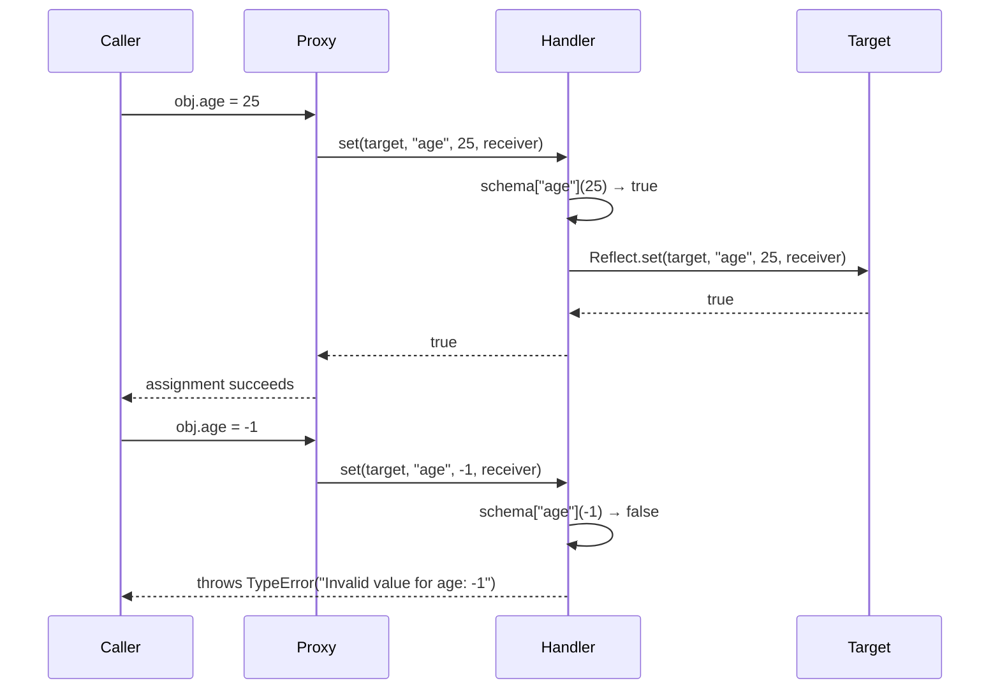

# Proxy & Reflect API

`Proxy` allows a JavaScript object to intercept fundamental operations —
property get, property set, function call, `in` operator, `delete`,
`Object.keys()`, prototype access — and substitute custom behavior. A Proxy
wraps a target object; operations on the Proxy are intercepted by trap
functions in a handler object, which can observe, modify, or block each
operation. The target remains unchanged; the Proxy is a separate object that
sits in front of it and controls how the outside world interacts with it.
This interception happens at the language level, not through method overriding
or inheritance: any code that holds only the Proxy reference cannot bypass the
traps, regardless of how it accesses the object.

This is the mechanism behind Vue 3's reactivity system, Immer's produce
function, and several validation and access-control libraries. The pattern is
metaprogramming: code that programs the behavior of other code. Used well, it
removes boilerplate by centralizing cross-cutting concerns. Used carelessly, it
creates invisible behavior that makes debugging difficult. A `set` trap that
silently transforms or rejects values, a `get` trap that lazily loads data,
or a `has` trap that reports membership based on external state — each of
these is powerful and, without clear documentation, deeply surprising to a
reader who expects plain object semantics.

`Reflect` is a companion API providing the default implementation of each
Proxy trap as a static method. `Reflect.get(target, prop)` does what a normal
property access does; `Reflect.set(target, prop, value)` does what a normal
property assignment does. Using `Reflect` inside trap implementations ensures
that the default behavior is preserved when a trap does not need to customize
a particular operation. Without `Reflect`, the common alternative is to
access `target[prop]` directly inside a trap, which is subtly incorrect for
objects with inherited accessor properties because it bypasses the receiver
that the accessor's `this` depends on. `Reflect` methods accept a `receiver`
argument that propagates the proxy as `this` to any getter or setter invoked
during the operation.

## Design Thinking

### Available traps

The Proxy handler supports thirteen traps, each corresponding to an
ECMAScript internal method. `get` intercepts property reads: `obj.prop` and
`obj[expr]`. `set` intercepts property writes: `obj.prop = value`. `has`
intercepts the `in` operator: `prop in obj`. `deleteProperty` intercepts
`delete obj.prop`. `apply` intercepts function calls: `fn()` and
`fn.call(ctx, ...args)` — this trap is only meaningful when the target is a
function. `construct` intercepts `new fn()` calls, allowing a proxy around a
constructor to customize the returned instance. `getPrototypeOf` intercepts
`Object.getPrototypeOf(obj)` and the `[[GetPrototypeOf]]` internal method used
by `instanceof`. `setPrototypeOf` intercepts `Object.setPrototypeOf(obj, proto)`.
`isExtensible` intercepts `Object.isExtensible(obj)`. `preventExtensions`
intercepts `Object.preventExtensions(obj)`. `getOwnPropertyDescriptor`
intercepts `Object.getOwnPropertyDescriptor(obj, prop)`. `defineProperty`
intercepts `Object.defineProperty(obj, prop, desc)`. `ownKeys` intercepts
`Object.keys()`, `Object.getOwnPropertyNames()`,
`Object.getOwnPropertySymbols()`, and `Reflect.ownKeys()`.

Most real-world uses involve only `get` and `set`. The thirteen traps exist
because the ECMAScript object model defines thirteen internal methods; Proxy
surfaces all of them. Understanding which operations each trap covers is
important because some operations invoke multiple internal methods. For
example, `for...in` uses `ownKeys` and `getOwnPropertyDescriptor` to filter
enumerable properties. A `set` trap alone does not intercept
`Object.defineProperty` — that requires a `defineProperty` trap. Engineers
who add Proxy-based validation only to `set` may be surprised to find that
`Object.assign` and object spread bypass the trap on some engines or under
specific conditions where properties are defined rather than set.

### Proxy for reactivity

The reactivity model enabled by Proxy represents a fundamental shift from pull-based to push-based state observation. Before `Object.defineProperty` and later Proxy, reactive libraries required either explicit subscription calls, code transforms that rewrote property accesses, or polling loops. Proxy allows the framework to intercept every property read and write transparently -- the developer writes plain object access syntax, and the framework's traps record what was accessed and notify dependents when those accesses change. The developer's code is unmodified and unaware of the observation layer, which is precisely the non-invasive integration that makes Proxy-based reactivity ergonomic.

Vue 3 and MobX both use Proxy to implement reactive state. The pattern is
consistent: a `get` trap records which reactive effect is currently running
and registers the accessed property as a dependency of that effect. When the
same property is later mutated through a `set` trap, the trap notifies all
effects that depended on it, scheduling re-evaluation. The cross-cutting
nature of Proxy is precisely what makes this tractable: the reactivity
infrastructure does not require classes with decorated properties, explicit
getter-setter pairs, or any change to the data model. A plain JavaScript
object passed to `reactive()` or `observable()` becomes fully reactive because
the Proxy intercepts every property access — including properties added after
the proxy was created, on supported platforms.

The `get` trap in a reactivity system records the receiver (the proxy) as the
context of the access, not the raw target. This is why `Reflect.get(target,
prop, receiver)` is essential: when an object has a computed property defined
as an accessor that references `this`, the accessor must receive the proxy as
`this` so that any nested property accesses it performs are also trapped. If
the `get` trap uses `target[prop]` instead, the accessor's `this` is the raw
target, bypassing the proxy for all nested accesses — and breaking dependency
tracking for any property the accessor reads internally.

### Proxy for validation

Validation proxies are most valuable in scenarios where the same data structure is mutated from multiple call sites -- form processing, configuration merging, API response normalization -- because they guarantee that invalid state can never be committed to the object regardless of which path writes to it. The invariant is enforced at the object level rather than at each individual call site, which eliminates the class of bugs where one code path correctly validates before writing but a newly added path forgets to.

A validation proxy intercepts `set` operations and checks each incoming value
against a schema before allowing the assignment to proceed. This pattern
centralizes validation at the object boundary rather than at every call site
that might write to the object. The constraint is defined once, adjacent to
the data model, and applies uniformly regardless of where the assignment
originates — from a form handler, a deserialization function, an API
response parser, or an internal method.

The contrast with schema validation at service boundaries is instructive.
Service-boundary validation (JSON Schema, Zod, Yup) validates complete
payloads at ingress and egress points. Proxy-based validation operates on
individual property assignments throughout the object's lifetime, catching
corruption that occurs after ingress — from internal mutations, partial
updates, or state transformations that produce invalid intermediate states.
Both approaches are complementary: boundary validation handles untrusted
external input; Proxy-based validation enforces invariants on the internal
model throughout its lifetime. The cost is that Proxy-based validation applies
on every write, so it must be inexpensive for hot code paths.

### Performance cost

Proxy adds overhead to every trapped operation. Microbenchmarks show 5–20x
slower property access compared to direct object access. This range is wide
because the actual cost depends on the JavaScript engine, the trap
implementation, and whether the JIT compiler has been able to optimize the
access path. Engines optimize unproxied objects aggressively using hidden
classes and inline caches; proxied objects bypass these optimizations because
the engine cannot assume that a given property access will always return the
same type or even the same slot.

In real applications, the overhead is negligible unless Proxy is used in tight
loops that execute millions of times per second. A reactive state object
accessed during a component render, a validation proxy wrapping a form model,
or a logging proxy around an API client will not produce measurable latency in
typical application workloads. Engineers should profile before avoiding Proxy
for performance reasons — the concern is often premature. When profiling does
reveal that a Proxy is on a hot path, the solution is typically to unwrap the
proxy for the hot loop and re-wrap it afterward, rather than eliminating the
proxy entirely.

### Invariants

Proxy traps are not unrestricted. The ECMAScript specification defines
invariants — correctness constraints that must hold regardless of what a trap
implementation does. Violating an invariant throws a `TypeError` from the
Proxy machinery itself, before the trap's return value reaches the caller. The
`get` trap cannot return a value that differs from the actual property value
if the property is non-writable and non-configurable on the target. The `set`
trap cannot return `true` (indicating success) if the property is
non-writable and non-configurable on the target. The `isExtensible` trap must
return the same result as `Object.isExtensible(target)`. The `ownKeys` trap
must include all non-configurable own property keys of the target. The
invariant system exists so that code relying on object property guarantees
cannot be deceived by a proxy into believing a property is writable when it is
not, or that an object is extensible when it is not. Understanding the
invariants is necessary when writing traps for frozen or sealed targets.

The invariant enforcement mechanism is also the reason why some Proxy patterns that seem reasonable at first are impossible in practice. A proxy that virtualizes a frozen object cannot pretend that a property is writable -- the spec will throw before the caller receives the trap's return value. A proxy that wraps a sealed object cannot introduce new own properties by returning them from `ownKeys` unless the target actually has them. These restrictions are not bugs or oversights; they are the guarantee that `Object.freeze`, `Object.seal`, and `Object.defineProperty` with `writable: false, configurable: false` remain trustworthy invariants even in the presence of proxies. Engineers who understand this boundary can design proxy handlers that work correctly with frozen or sealed targets, and can recognize in code review when a trap is attempting the impossible.

A practical consequence of the invariant system is that the target object must always be in a state consistent with what the traps report. When a `getOwnPropertyDescriptor` trap reports that a property is non-configurable, the property must actually exist on the target as non-configurable -- otherwise the invariant check throws. For this reason, Proxy patterns that synthesize virtual properties (reporting properties that do not exist on the underlying target) must use an extensible, non-sealed target object that the traps can keep in sync with their reported state. Any deviation between what the trap reports and what the target actually holds will surface as a `TypeError` thrown by the proxy machinery at the point of invariant violation, not at the point of the trap's logic -- which can make the error message appear at a confusing distance from the code that caused it.

## Best Practices

**MUST use `Reflect` methods inside Proxy traps to perform default operations rather than accessing the target directly.** Directly accessing `target[prop]` inside a `get` trap silently breaks for objects with inherited accessor properties: the accessor's `this` becomes the raw target rather than the proxy, causing any nested property accesses the accessor performs to bypass all traps. `Reflect.get(target, prop, receiver)` propagates the proxy as the receiver, preserving correct `this` for inherited getters and maintaining every invariant the spec requires for that trap. Apply this rule uniformly -- not just in `get` traps, but in every trap that delegates to the underlying object -- to ensure that the proxy's behavior is fully transparent to code that holds only the proxy reference.

**SHOULD use `Reflect.<trap>` as the default behavior in every Proxy trap
instead of directly operating on the target object.** `Reflect.get(target,
prop, receiver)` correctly handles inherited accessors that reference `this`
— if the proxy is the receiver, `this` inside the accessor refers to the
proxy, not the raw target, which is necessary for reactivity systems and other
patterns where the accessor's `this` must be observable. Every trap that does
not need to customize a specific operation should delegate directly to the
corresponding `Reflect` method with the same arguments including the receiver.
Deviating from this pattern produces bugs that are difficult to reproduce
because they manifest only when accessor properties are involved, which is not
the common case in unit tests but is common in framework-managed models.

**MUST NOT use `Proxy` to intercept and silently swallow operations.** A `set`
trap that returns `true` without calling `Reflect.set` — to silently reject
invalid assignments — makes the call site unaware that the assignment was
ignored. The caller receives no error and cannot distinguish success from
silent failure. Business logic that depends on the assignment will proceed with
stale data, producing corruption that is extremely difficult to trace back to
the swallowed write. Traps that reject operations MUST throw an error or
return `false`, which causes strict mode to throw a `TypeError` automatically.
In sloppy mode, returning `false` from `set` is silent; in strict mode, it
throws. Prefer throwing a descriptive error directly from the trap to ensure
the failure is visible in both modes.

**SHOULD restrict Proxy usage to framework and library infrastructure, not
application-level business logic.** Proxies make object behavior non-obvious:
a developer reading `obj.name = 'Alice'` cannot tell from the syntax alone
whether a trap intercepts that assignment. Business logic expressed through
Proxies is harder to reason about, test, and debug than explicit methods or
reducers. A validation method, a Redux reducer, or an explicit setter function
is visible in the call stack and easily discoverable by searching the
codebase. A Proxy trap is invisible at the call site; finding it requires
knowing which object is a proxy and where its handler was defined. Reserve
Proxy for infrastructure that must be transparent to its consumers — reactivity,
instrumentation, access control enforcement — and express application logic
through explicit, discoverable code. The discoverability gap also affects
automated tooling: static analysis, IDE navigation, and test coverage tools
all operate on the visible syntax; Proxy traps intercept at runtime and leave
no static footprint that these tools can follow.

## Visual



## Example

```js
function createValidated(target, schema) {
  return new Proxy(target, {
    set(obj, prop, value) {
      if (schema[prop] && !schema[prop](value)) {
        throw new TypeError(`Invalid value for ${prop}: ${value}`);
      }
      return Reflect.set(obj, prop, value);
    }
  });
}

const user = createValidated({}, {
  age: v => Number.isInteger(v) && v >= 0,
  name: v => typeof v === 'string' && v.length > 0
});

user.age = 25;       // ok
user.name = 'Alice'; // ok
user.age = -1;       // TypeError: Invalid value for age: -1
```

## Common Mistakes

Using `target[prop]` instead of `Reflect.get(target, prop, receiver)` in a
`get` trap is the most common implementation error. It appears to work for
plain data properties and is only observable to break when the target has an
inherited accessor that references `this`. In that case, `this` inside the
accessor is the raw target rather than the proxy, so any property accesses the
accessor performs are not trapped. Reactivity systems relying on access
tracking inside getters silently fail to record dependencies; access-control
proxies silently allow unrestricted reads through an accessor. The fix is
always `Reflect.get(target, prop, receiver)` with the third argument.

Returning `true` from a `set` trap without calling `Reflect.set` silently
discards the assignment. This pattern appears in validation proxies written by
engineers who want to reject invalid values without throwing. The effect is
that the property on the target is never updated, the caller receives no
indication of failure, and any code that reads the property after the
assignment gets the old value. Strict mode does not help here because the trap
returns `true` — strict mode only throws when `set` returns `false`. The
correct approach is to throw a descriptive `TypeError` from the trap so that
the failure is visible in all modes and at all call sites.

Proxying objects that are compared by identity in third-party code breaks
identity checks silently. `proxy !== target` is always true — a proxy and its
target are distinct objects. Code that caches objects by reference, stores
them in a `WeakMap` keyed by identity, or checks `if (obj === cachedValue)`
will behave incorrectly when the proxy and the target are mixed in the same
identity-based data structure. This is especially common when a proxied object
is passed to a library that internally stores it in a `Set` or `Map` and then
later receives the raw target for comparison. Engineer awareness of this
identity split is essential when adopting Proxy in any codebase that uses
identity-based caching or deduplication.

## Related FEEs

- FEE-300 — JavaScript Core & Runtime Overview
- FEE-310 — Symbols & Well-Known Symbols
- FEE-502 — Reactive State & Signals (Vue 3 reactivity uses Proxy)

## References

- MDN: Proxy — https://developer.mozilla.org/en-US/docs/Web/JavaScript/Reference/Global_Objects/Proxy
- MDN: Reflect — https://developer.mozilla.org/en-US/docs/Web/JavaScript/Reference/Global_Objects/Reflect
- Axel Rauschmayer: Meta programming with proxies — https://exploringjs.com/es6/ch_proxies.html
- MDN: Proxy handler traps — https://developer.mozilla.org/en-US/docs/Web/JavaScript/Reference/Global_Objects/Proxy/Proxy
- ECMA-262: Proxy Object Internal Methods — https://tc39.es/ecma262/#sec-proxy-object-internal-methods-and-internal-slots
