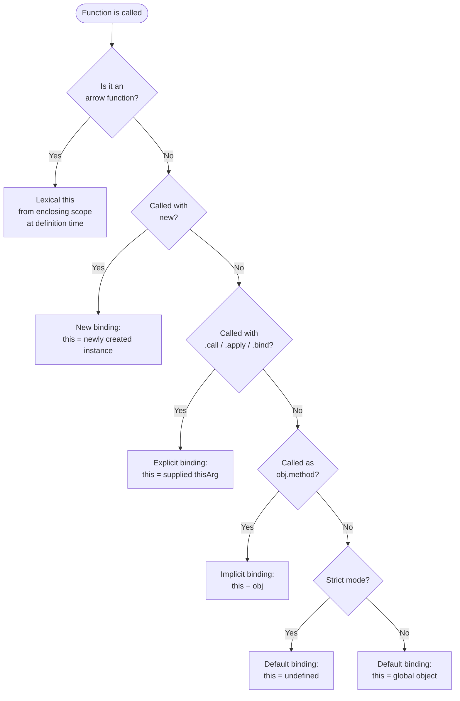

# `this` Binding & Context Edge Cases

`this` in JavaScript does not refer to the function where it appears. It refers
to the object that is the execution context at the time the function is called.
A function can be defined in one context and called in another, and `this` tracks
the call site, not the definition site — with one important exception: arrow
functions. This is one of the most frequently misunderstood aspects of the
language, not because it is complicated, but because it violates the intuition
that variables are bound where they are written. `this` is not a variable; it is
an implicit parameter resolved at the moment of invocation, and the resolution
rules are consistent once they are understood.

There are four binding rules, applied in priority order: new binding (called
with `new`), explicit binding (`call`, `apply`, `bind`), implicit binding
(called as a method on an object), and default binding (called as a plain
function). Arrow functions do not participate in any of these rules; they
lexically capture `this` from the enclosing scope at definition time and cannot
be rebound. The priority ordering is strict: `new` overrides explicit, explicit
overrides implicit, implicit overrides default. Knowing the ordering eliminates
the need to guess — at any call site, the correct `this` can be determined by
examining the invocation form alone.

The confusion around `this` arises from the mismatch between how developers
intuitively expect it to work (lexically, like a variable) and how it actually
works (dynamically, based on the call site). Class methods, event handlers, and
callbacks each present scenarios where `this` is not what a reader might expect.
A method defined on a class still loses its receiver when extracted and passed
as a callback. An arrow function defined inside a method, on the other hand,
permanently captures the enclosing `this` and cannot be made to refer to
anything else — which is exactly the behavior that makes arrow functions
idiomatic for callbacks in class-based code. Understanding the four rules
removes the mystery.

## Scenario

A method works correctly when called as `obj.method()` but throws or produces wrong output when the same function reference is passed as a callback — for example, to `setTimeout` or an event listener. The difference is `this` binding: method invocation binds `this` to the object, but a plain function call binds `this` to `undefined` (in strict mode) or the global object. Understanding how `this` is determined at call time — and when arrow functions, `bind`, and explicit binding solve the problem — eliminates a consistent source of JavaScript bugs.

## Design Thinking

### The four binding rules

The four binding rules form a priority hierarchy that determines `this` at every
call site. New binding applies when a function is called with the `new` keyword:
a fresh object is created, its prototype is set to the constructor's
`prototype` property, `this` inside the constructor refers to that new object,
and it is returned unless the constructor explicitly returns a different object.
New binding has the highest priority and overrides any explicit binding that
might appear to be attached to the same function via `bind`.

Explicit binding applies when a function is invoked with `.call(thisArg, ...args)`,
`.apply(thisArg, args)`, or `.bind(thisArg)`. All three accept the intended
receiver as their first argument. `.bind` is distinct from `.call` and `.apply`
in that it returns a new function rather than invoking immediately; the returned
function has its `this` permanently fixed and cannot be re-overridden by another
`.bind` or by being called as a method. Explicit binding takes precedence over
implicit binding.

Implicit binding applies when a function is called as a property of an object:
`obj.method()`. The object to the left of the dot becomes `this` for the
duration of that call. The binding is shallow — only the immediately enclosing
object matters, not any outer context the function might have been defined in.
If the method is stored in a variable and called without the object reference,
implicit binding no longer applies and the call falls through to default binding.

Default binding applies when none of the above three rules matches: a plain
function call with no receiver, no explicit `thisArg`, and no `new`. In strict
mode, default binding resolves `this` to `undefined`. In sloppy mode, it
resolves to the global object (`window` in browsers, `global` in Node.js). This
asymmetry between strict and sloppy mode is the source of many subtle bugs:
sloppy mode default binding silently pollutes or reads from the global object,
while strict mode produces an explicit `TypeError` when `this` properties are
accessed.

To apply the rules at a call site: find the function being called; examine the
invocation form. If `new` is present, new binding applies. If `.call`, `.apply`,
or `.bind` is present, explicit binding applies. If the function is called as a
property of an object (`obj.fn()`), implicit binding applies. If none of the
above, default binding applies. If the function is an arrow function, none of
the four rules apply — `this` is inherited from the enclosing scope at
definition time and is immutable.

The algorithm is mechanical and always produces the correct answer. The vast
majority of `this`-related bugs in production JavaScript arise from developers
not running this algorithm at all — instead, they guess based on where the
function is defined, which is the correct heuristic for lexically-scoped
variables but the wrong heuristic for `this`.

### Arrow functions and lexical this

Arrow functions also interact with testing in a predictable but often overlooked way. Because an arrow function's `this` is captured at definition time and is immune to `call`, `apply`, and `bind`, tests that attempt to inject a different receiver using those methods will silently fail -- the arrow ignores the explicit receiver and uses its captured `this` regardless. This means test doubles and mock objects cannot be substituted for the arrow's captured `this` through the standard dynamic binding mechanisms. Tests for code that uses class field arrows must set up the correct `this` at construction time, either by constructing a real instance with the desired state or by accessing the function through an instance rather than through prototype lookup.

Arrow functions are not syntactic shorthand for regular functions; they are a
different kind of function with fundamentally different `this` semantics. They
have no own `this`, no `arguments` object, and cannot be used as constructors —
calling an arrow with `new` throws a `TypeError`. When an arrow function is
evaluated, the JavaScript engine captures the current `this` value from the
surrounding lexical scope and permanently associates it with the arrow. Every
subsequent call to that arrow, regardless of how or where it is invoked, uses
that captured value.

This has an important consequence for nested functions. A regular function
defined inside a method loses the method's `this` unless explicitly bound;
an arrow function defined in the same position inherits the method's `this`
automatically. The arrow's `this` is determined at the time the outer function
runs — when the object is constructed, when the method is invoked — not at the
time the arrow is called. Writing an arrow function inside a method is a compact
declaration that the arrow's behavior depends on the method's receiver, making
the dependency explicit and unbreakable.

### Class fields and method binding

The class field arrow pattern has an important implication for inheritance. Because a class field is evaluated per-instance at construction time, not shared on the prototype, a subclass cannot override a class field arrow from a parent class by defining a method with the same name on its own prototype. The subclass's prototype method is never reached because the instance property shadows it -- `this.handleClick` is found on the instance before the prototype chain is consulted. Teams that use class field arrows for event handlers must be aware that the inherited arrow cannot be overridden through normal prototype-based subclassing; overriding requires either making the parent method a prototype method, or defining a class field arrow on the subclass with the same name, which creates a new per-instance function that shadows the parent's.

JavaScript classes offer two ways to attach a function to an instance. A
prototype method — `onClick() { ... }` declared inside the class body — lives
on the class's `prototype` object. All instances share the same function object;
`this` is resolved dynamically each time the method is called. If the method is
called as `instance.onClick()`, implicit binding gives the correct `this`. If it
is passed as a callback — `button.addEventListener('click', this.onClick)` —
the implicit binding is lost.

A class field arrow — `onClick = () => { ... }` declared at the class body level
using the class fields proposal — is evaluated once per instance at construction
time. Each instance gets its own copy of the arrow function with `this` already
captured as that instance. The trade-off is memory: one function object per
instance rather than one shared function on the prototype. For classes with
thousands of instances, this is measurable. For the common case of UI components
(tens or hundreds of instances at most), the overhead is negligible and the
binding safety is worth the cost. The class field pattern is idiomatic in React
class components and is the standard recommended approach for methods that are
passed as event handler props.

### this in event handlers

The event handler `this` problem is particularly insidious in Web Components. Custom element lifecycle callbacks -- `connectedCallback`, `disconnectedCallback`, `attributeChangedCallback` -- are called by the browser as methods on the element, so implicit binding is correct there. But any document-level event listener added inside `connectedCallback` with `document.addEventListener('keydown', this.onKey)` extracts `this.onKey` from its receiver. The correct pattern is to define `onKey` as a class field arrow in the constructor so it is stable, and to remove it with the same reference in `disconnectedCallback`. Lifecycle hooks that add listeners without storing a stable reference to the bound function are a guaranteed memory and correctness leak: the listener cannot be removed, and `this` inside the handler resolves to the wrong object.

`addEventListener('click', this.handle)` is one of the most common sources of
`this`-related bugs. When the browser invokes the handler, it calls the extracted
function without a receiver; `this` becomes `undefined` in strict mode. There are
three common remedies. `.bind(this)` creates a permanently-bound function:
`addEventListener('click', this.handle.bind(this))`. This works but has a
drawback: the bound function is a new object each time the expression is evaluated,
so `removeEventListener` cannot remove it unless the bound reference is stored.
An arrow wrapper — `addEventListener('click', (e) => this.handle(e))` — preserves
`this` via lexical closure and passes the event through; it has the same
storability concern but is readable and does not require the method itself to be
modified. A class field arrow — `handle = (e) => { ... }` — is the cleanest
solution: it is bound at construction, stored as a stable instance property, and
can be passed directly to `addEventListener` and later removed with
`removeEventListener(this.handle)` using the same stable reference. The arrow
wrapper inline in `addEventListener` is the preferred modern pattern when a class
field is not available; explicit `.bind` is acceptable but harder to remove later.

### this in strict mode

Default binding in strict mode resolves `this` to `undefined` rather than the
global object. This changes the failure mode of extracted methods from silent
global corruption to an immediate `TypeError: Cannot read properties of undefined`.
While a `TypeError` appears more disruptive, it is strictly preferable from a
debugging standpoint: the error appears at the point of misuse rather than
manifesting as unexplained mutations to global state many frames away. Strict
mode is automatically applied to ES modules, class bodies, and any function that
begins with `'use strict'`. In practice, most modern JavaScript runs in strict
mode by default, so the sloppy-mode global binding behavior is rarely encountered
in production code. Understanding it remains important for reading legacy code and
for understanding why some older APIs behave unexpectedly in strict contexts.

Strict mode's effect on default binding also makes debugging more reliable. In sloppy mode, a method called without a receiver silently reads and writes the global object -- `this.count++` quietly creates or increments `window.count`, and the error only surfaces when that global mutation causes an unexpected side effect elsewhere in the program. In strict mode, the same call immediately throws a `TypeError` at the point of misuse. The `TypeError` is often considered the worse outcome because it terminates execution, but it is strictly better from an engineering standpoint: the failure is located precisely where the binding error occurs, not at an arbitrary distance where the corrupted global state first becomes observable. This is a concrete example of the general principle that explicit failures are preferable to silent data corruption.

## Best Practices

**MUST NOT assume that a method extracted from an object retains its `this` binding.** Assigning `const fn = obj.method` and then calling `fn()` invokes the function without an implicit receiver; `this` inside `fn` resolves to `undefined` in strict mode and to the global object in non-strict mode. This applies universally: assigning methods to variables, passing them as callbacks to higher-order functions, storing them in arrays, or destructuring them from an object -- all extract the function from its original receiver and cause the binding to be lost. The only ways to preserve the binding are to call the method in-place as `obj.method()`, to use `.bind(obj)` to create a permanently-bound function, or to use an arrow wrapper that captures the object in a closure.

**MUST use arrow functions for methods that are passed as callbacks or event
handlers and require access to the enclosing class's `this`.** An arrow function
defined as a class field (`handleClick = (e) => { ... }`) binds `this` to the
instance at construction time and can be passed directly to `addEventListener` or
as a React prop without `.bind()`. The binding is created once, stored as a
stable instance property, and is guaranteed to be correct regardless of how or
where the method is later called. This is the idiomatic pattern in React class
components and class-based frameworks. It eliminates an entire category of
`this`-related bug by making the receiver explicit at the point of definition
rather than relying on correct invocation form at every call site.

**MUST NOT use `.bind(this)` inside `render()` or inside JSX attributes in
performance-critical components.** `.bind()` creates a new function object on
every call. When used in JSX (`onClick={this.handleClick.bind(this)}`), a new
function is created on every render cycle. This causes referential inequality
between renders: `React.memo` and `shouldComponentUpdate` compare props by
reference, and a new function object on each render defeats both optimizations,
causing unnecessary re-renders of child components. In function components, the
equivalent concern applies to inline arrow functions in JSX: `onClick={() =>
this.handleClick()}` creates a new closure on every render. The remedy is to
define bound methods as class fields (in class components) or to stabilize
callbacks with `useCallback` (in function components), so that the same function
reference is reused across renders when dependencies have not changed.

**SHOULD apply the four-rule algorithm when debugging a `this`-related bug
instead of guessing.** Identify how the function is being invoked at the
specific call site: with `new`, with `call`/`apply`/`bind`, as `obj.method()`,
or as a plain call. Apply the rule for that invocation form. If the function is
an arrow function, `this` is whatever `this` was in the enclosing scope when
the arrow was defined — trace back to where the arrow was created and examine
the `this` in that outer scope at that moment. The algorithm is mechanical and
always produces the correct answer. Guessing based on where a function is
defined, or assuming that a method retains its receiver when passed as a
callback, produces incorrect diagnoses and leads to patches that mask rather
than fix the underlying binding problem.

## Visual



## Example

```js
class Timer {
  constructor() {
    this.count = 0;
  }

  // Broken — 'this' is undefined in strict mode when passed as a callback
  startBroken() {
    setInterval(function() { this.count++; }, 1000);
  }

  // Arrow function — 'this' is lexically bound to the Timer instance
  start() {
    setInterval(() => { this.count++; }, 1000);
  }

  // Class field — bound at construction, safe to pass directly as a reference
  tick = () => { this.count++; };

  startWithField() {
    setInterval(this.tick, 1000);
  }
}

const timer = new Timer();
timer.start();        // works: arrow captures Timer instance as this
timer.startBroken();  // TypeError in strict mode: cannot read 'count' of undefined
```

## Common Mistakes

Passing `obj.method` as a callback without binding is the most pervasive
mistake. The method is extracted from the object; the implicit receiver is not
carried along. `this` inside the method is `undefined` in strict mode the
moment the callback fires. The fix is a class field arrow, an arrow wrapper at
the call site, or a stored `.bind(obj)` result — not all three simultaneously.

Using `.bind(this)` inside `render()` or JSX attributes creates a new function
object on every render. The child component that receives the prop will always
see a new reference, defeating shallow equality checks in `React.memo` and
`shouldComponentUpdate`. Bound method references should be stable — created
once at construction (class field) or memoized with `useCallback`.

Expecting `call`, `apply`, or `bind` to rebind an arrow function is a
common misconception. These methods have no effect on an arrow's `this`. The
arrow's `this` is captured at definition time and is immutable. Calling an
arrow with `.call(differentObj)` does not change `this`; the arrow ignores the
explicit receiver entirely and uses its captured lexical `this`.

Confusing the per-instance memory cost of class field arrows with prototype
method sharing leads to premature over-optimization. For most UI components,
the cost of one extra function object per instance is irrelevant. For rare cases
where a class is instantiated thousands of times and memory is the bottleneck,
arrow wrapper functions at the call site — rather than class fields — preserve
prototype method sharing while still providing correct binding.

## Related FEEs

- FEE-300 — JavaScript Core & Runtime Overview
- FEE-302 — Closures & Scope Chain
- FEE-303 — Prototypes & Inheritance

## References

- MDN: this — https://developer.mozilla.org/en-US/docs/Web/JavaScript/Reference/Operators/this
- Kyle Simpson: You Don't Know JS — this & Object Prototypes — https://github.com/getify/You-Dont-Know-JS/blob/2nd-ed/objects-classes/README.md
- MDN: Function.prototype.bind — https://developer.mozilla.org/en-US/docs/Web/JavaScript/Reference/Global_Objects/Function/bind
- MDN: Arrow function expressions — https://developer.mozilla.org/en-US/docs/Web/JavaScript/Reference/Functions/Arrow_functions
- MDN: Public class fields — https://developer.mozilla.org/en-US/docs/Web/JavaScript/Reference/Classes/Public_class_fields
- ECMA-262: OrdinaryCallBindThis — https://tc39.es/ecma262/#sec-ordinarycallbindthis
- javascript.info: Object methods, "this" — https://javascript.info/object-methods
