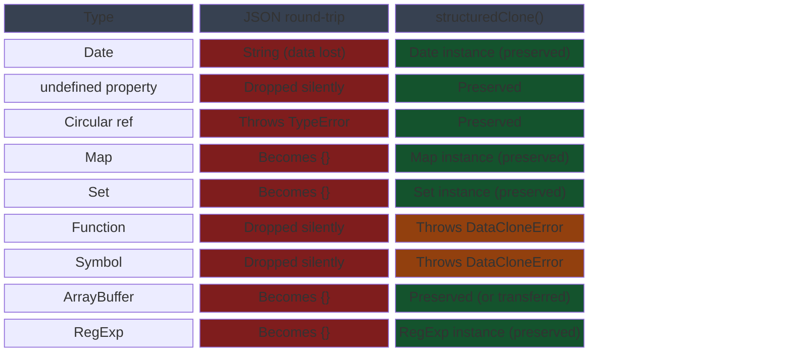

# Structured Clone & `structuredClone()`

Copying objects in JavaScript is a study in trade-offs. Shallow copies
(`Object.assign`, spread) share nested references: mutating a nested object in
the copy mutates the original. Deep copies via `JSON.parse(JSON.stringify(obj))`
appear to solve that problem but introduce a different class of failure. They
drop `undefined` values silently, convert `Date` objects to strings, lose
functions and Symbols entirely, throw on circular references, and fail silently
on `Map`, `Set`, `ArrayBuffer`, and `RegExp`. These are not edge cases — they
are common types in production codebases, and the failures are silent data
corruptions rather than thrown errors.

`structuredClone()`, available in all major browsers since 2022 and Node.js 17+,
performs a deep clone using the Structured Clone algorithm — the same algorithm
used by `postMessage`, `IndexedDB`, and the History API. It correctly clones
`Date`, `Map`, `Set`, `RegExp`, `ArrayBuffer`, `TypedArray`, `Blob`, `Error`,
and circular references. It does not clone functions, DOM nodes, or class
instances' prototype chains. For types it cannot clone, it throws a
`DataCloneError` immediately rather than silently dropping data. The failure mode
is explicit, which makes bugs diagnosable rather than hidden.

The Structured Clone algorithm predates `structuredClone()` as a global function.
It was always accessible indirectly via `MessageChannel`, `History.pushState()`,
and other platform APIs. Before the global function was standardized, developers
used a `MessageChannel` round-trip to clone objects — posting a value to one port
and reading the result from the other in a `message` event handler. That pattern
was synchronous-looking but asynchronous in reality, and required non-trivial
boilerplate. Understanding the algorithm clarifies the behavior of all these APIs,
not just the global function. When `postMessage` transfers a value, when IndexedDB
serializes a record, and when the History API stores state, the same algorithm
runs. The constraints and capabilities are identical across all of these contexts.

## Principle

Engineers SHOULD use `structuredClone()` as the default deep-clone function for
plain data objects — plain objects, arrays, Maps, Sets, Dates, and similar
value-type data. The JSON round-trip (`JSON.parse(JSON.stringify(obj))`) MUST NOT
be used as a general-purpose deep clone: it silently drops `undefined` properties,
converts `Date` objects to strings, throws on circular references, and fails on
`Map`, `Set`, and `RegExp` without indication. These silent data losses cause
subtle bugs that are difficult to diagnose because the resulting object appears
structurally valid while carrying corrupted values. `structuredClone()` is correct
by default for all types it supports, and produces a `DataCloneError` for
unsupported types rather than silently corrupting data.

Engineers MUST NOT expect `structuredClone()` to clone class instances and
preserve their methods. `structuredClone()` does not preserve prototype chains.
A class instance cloned with `structuredClone()` becomes a plain object with the
same own enumerable properties, but none of the methods defined on the class
prototype. Calling any prototype method on the clone throws a `TypeError`.
Teams that need to clone class instances must implement explicit clone methods or
use the copy constructor pattern — a static `fromData(data)` or a `clone()` method
that constructs a new instance from the source's own data. The limitation applies
equally to functions (which cannot be transferred across serialization boundaries)
and DOM nodes (which are host objects with behavior that cannot be represented as
structured data).

## Design Thinking

### The Structured Clone algorithm

The Structured Clone algorithm defines a precise set of types that are supported
for serialization and deserialization across execution contexts. Supported types
include: primitives (string, number, boolean, null, undefined, BigInt), plain
objects and arrays, `Date`, `RegExp`, `Map`, `Set`, `ArrayBuffer` and all
`TypedArray` variants, `DataView`, `Blob`, `File`, `FileList`, `ImageBitmap`,
`ImageData`, `Error` (including all built-in error subclasses), and circular
references within the object graph. The algorithm traverses the object graph
recursively, building a duplicate graph with fresh allocations for every node.
Circular references are preserved: if two properties point to the same object, the
clone's corresponding properties will point to the same cloned object, not
independent copies.

Unsupported types include functions, `Symbol` values, DOM nodes, and class
prototype chains. When the algorithm encounters an unsupported type, it throws a
`DataCloneError` rather than silently dropping the value or converting it. This
is intentional: silent corruption is harder to detect than an explicit error. The
algorithm also does not preserve property descriptors, getters, setters, or
non-enumerable properties. The clone is a snapshot of own enumerable property
values, not a structural replica of the property descriptor map. This distinction
matters for objects that use computed properties, lazy initialization via getters,
or frozen prototype chains.

### structuredClone() vs. JSON round-trip

The JSON round-trip and `structuredClone()` differ fundamentally in data fidelity.
JSON serialization converts an object to a string representation and back, and the
round-trip is lossy by design: the JSON specification does not have representations
for `undefined`, functions, Symbols, `Map`, `Set`, `Date` as a typed value,
`RegExp`, or circular references. `undefined` properties are silently dropped from
the output. `Date` objects are converted to ISO 8601 strings — the parse step
produces a string, not a `Date`. `Map` and `Set` become plain objects and arrays
with no structure preservation. Circular references cause `JSON.stringify` to throw
a `TypeError`. None of these failures are indicated in the return value — the
resulting object appears valid, just missing data.

`structuredClone()` preserves all supported types faithfully. A `Date` cloned with
`structuredClone()` is still a `Date` instance. A `Map` is still a `Map`. A `Set`
is still a `Set`. A `RegExp` retains its flags. An object with circular references
is cloned with circular references intact. The algorithm is designed for
correctness, not for string serialization, so it has no need to convert values to
an intermediate string format. The only failures are explicit: a `DataCloneError`
thrown synchronously when the algorithm encounters a type it cannot handle. This
makes `structuredClone()` suitable as the default deep-clone primitive for plain
data and `JSON.stringify` suitable for producing string output for transmission,
storage, or display — two different purposes that should not be conflated.

### Transfer lists

`structuredClone()` accepts a second argument `{ transfer: [arrayBuffer] }` that
allows `ArrayBuffer` instances to be transferred rather than copied. Transfer moves
ownership of the buffer to the clone, zeroing the original buffer in place. After
transfer, any attempt to read from or write to the original buffer produces a zero
length or a `TypeError` depending on how it is accessed. The original's
`byteLength` becomes 0. This is the same mechanism used by `postMessage` transfer
lists — when a `postMessage` call includes a transfer list, the listed buffers are
moved to the receiving context without copying their bytes.

The motivation for transfer is memory efficiency. An `ArrayBuffer` holding image
data, audio samples, or a large binary payload might occupy tens or hundreds of
megabytes. Copying it doubles the memory footprint during the clone operation.
Transfer avoids that duplication entirely: the bytes are not copied; the
ownership record is updated. Transfer is therefore the correct approach for
passing large binary data to a Web Worker, not copying. The trade-off is that the
sending context loses access to the buffer immediately after the transfer. Code
that needs to retain a reference must copy first and then transfer the copy, or
must restructure to ensure the buffer is only needed in one context at a time.

### MessageChannel as a pre-2022 approach

Before `structuredClone()` was available as a global function, the standard
workaround for synchronous deep cloning was to use a `MessageChannel`. A channel
has two ports; posting a value through one port delivers a structured clone of
it to the other. The pattern involved creating a channel, listening for a
`message` event on one port, posting the value through the other, and capturing
the clone from the event's `data` property. Despite appearing synchronous in
casual reading, the message delivery was asynchronous, which meant the pattern
had to be wrapped in a `Promise` or used in a context where the event loop could
flush the microtask queue.

The global `structuredClone()` function replaces this pattern with a synchronous,
explicit API. It takes a value, runs the algorithm, and returns the clone
immediately — no channels, no event listeners, no asynchrony. The function also
makes the intent visible in the code: a reader who encounters `structuredClone(x)`
knows immediately what is happening, whereas the `MessageChannel` pattern required
familiarity with the workaround to understand. The historical context is useful
because it explains why the algorithm exists independently of the global function,
and because legacy codebases may still contain the `MessageChannel` pattern. When
reviewing or migrating such code, the `MessageChannel` deep-clone idiom is a
direct candidate for replacement with `structuredClone()`.

## Best Practices

**SHOULD use `structuredClone()` for all deep-clone operations on plain data
objects, replacing `JSON.parse(JSON.stringify(obj))`.** The JSON round-trip
silently corrupts `Date` values (converted to strings), `undefined` properties
(dropped), `Map` and `Set` instances (converted to plain objects), and throws on
circular references. `structuredClone()` is correct by default for all types it
supports and produces a `DataCloneError` for unsupported types rather than
silently corrupting data. The only legitimate use case for the JSON round-trip
in a cloning context is when the result needs to be a JSON-safe plain object for
transmission or storage — in that case, the lossy conversion is intentional and
should be documented as such.

**MUST use the `transfer` option when passing large `ArrayBuffer` or `TypedArray`
data to a Web Worker via `postMessage`, rather than copying.** Transfer moves
ownership of the buffer to the recipient context, zeroing the sender's view. This
avoids duplicating large binary data in memory — for payloads in the tens of
megabytes range, the difference between copy and transfer is the difference between
doubling peak memory and not. The buffer is unusable in the sending context after
transfer, so any code that needs to retain a reference must restructure accordingly.
Failing to use transfer for large buffers causes unnecessary GC pressure and
potential out-of-memory conditions in memory-constrained environments.

**MUST NOT rely on `structuredClone()` to clone class instances and preserve their
methods.** Class instances lose their prototype chain in the clone; the result is a
plain object with own enumerable properties only. Calling a method on the clone
throws `TypeError: clone.method is not a function`. If a class instance must
survive a clone operation with its methods intact, implement a `clone()` method
that constructs a new instance from the source's own data, or use the copy
constructor pattern where a static factory method accepts a plain data object and
returns a fully initialized instance. This pattern also makes the class's cloning
contract explicit and testable.

## Visual



## Example

```js
const original = {
  date: new Date('2025-01-01'),
  map: new Map([['key', 'value']]),
  set: new Set([1, 2, 3]),
  nested: { arr: [1, 2, 3] },
};
original.self = original; // circular reference

const clone = structuredClone(original);

clone.nested.arr.push(4);
console.log(original.nested.arr); // [1, 2, 3] — not affected

console.log(clone.date instanceof Date); // true — Date preserved
console.log(clone.map instanceof Map);   // true — Map preserved
console.log(clone.self === clone);       // true — circular reference preserved

// JSON round-trip for comparison:
// JSON.stringify(original) — throws TypeError on circular reference
// JSON.parse(JSON.stringify({ date: new Date() })).date — string, not Date

// Transfer example: move an ArrayBuffer to a Web Worker without copying
const buffer = new ArrayBuffer(1024 * 1024 * 64); // 64 MB
const transferred = structuredClone(buffer, { transfer: [buffer] });
console.log(buffer.byteLength);      // 0 — original is zeroed
console.log(transferred.byteLength); // 67108864 — clone owns the bytes
```

## Common Mistakes

Using `JSON.parse(JSON.stringify(obj))` on objects that contain `Date` values is
the most common deep-clone mistake. The `Date` is serialized to an ISO string by
`JSON.stringify` and emerges from `JSON.parse` as a plain string. Code that
subsequently calls `.getTime()` or `.toLocaleDateString()` on the cloned property
throws a `TypeError`. The failure is invisible at the clone site — it only
surfaces when the cloned data is used, often far from where the cloning happened.
`structuredClone()` eliminates this failure mode: the cloned `Date` is a `Date`.

Expecting `structuredClone()` to clone class instances with their prototype methods
is the second common mistake. The clone is a plain object. Methods defined on the
class prototype are not own properties of the instance and are not included in the
clone. If the class has a `serialize()` method and the code calls
`clone.serialize()`, it throws. The correct approach is to implement a `clone()`
method on the class that constructs a new instance, or to separate data from
behavior using a value object pattern where cloning is always applied to plain data
rather than to class instances.

Cloning large `ArrayBuffer` data when transfer would be sufficient is a performance
mistake. In contexts where the original buffer is no longer needed after the clone
— such as when preparing data for a Web Worker — using `structuredClone(buffer)`
without the `transfer` option copies all bytes, doubling peak memory. The transfer
option exists precisely for this scenario. Developers who are unaware of the
transfer option discover the memory cost only when working with large payloads or
under memory profiling, by which point the pattern may be widespread in the
codebase.

## Related FEEs

- FEE-300 — JavaScript Core & Runtime Overview
- FEE-405 — Web Workers & Concurrency (postMessage and transfer)
- FEE-404 — Storage & State Persistence (IndexedDB uses the Structured Clone algorithm)

## References

- MDN: structuredClone() — https://developer.mozilla.org/en-US/docs/Web/API/Window/structuredClone
- MDN: Structured clone algorithm — https://developer.mozilla.org/en-US/docs/Web/API/Web_Workers_API/Structured_clone_algorithm
- HTML Living Standard: Structured serialization — https://html.spec.whatwg.org/multipage/structured-data.html
- TC39: Resizable ArrayBuffer proposal — https://github.com/tc39/proposal-resizablearraybuffer
