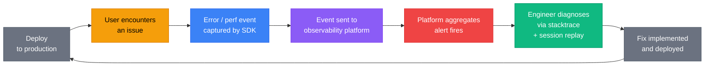
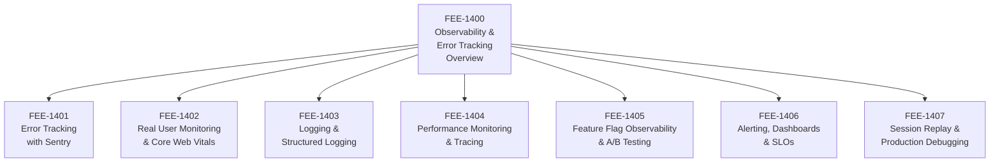

# Observability & Error Tracking Overview

:::info
This category covers the three pillars of frontend observability — error tracking, real user monitoring, and session replay — along with the source map pipeline, alerting, and feature-flag observability that complete a production visibility strategy.
:::

## Context

Shipping code is not the same as knowing whether it works. A build that passes CI, deploys successfully, and loads correctly in the developer's browser can still be broken for a meaningful fraction of real users — on older Android devices running Chrome 108, on corporate networks that block certain domains, on screens with system-level font scaling enabled, or on flaky connections where a single timed-out request turns a 200ms interaction into a spinner that never resolves.

This gap between local development and production is the central problem that frontend observability exists to close. Backend engineers have always had access to server logs, request traces, and database query metrics. Frontend engineers historically had none of that. Errors happen silently in users' browsers, stacktraces are lost the moment the tab closes, and the first signal that something is wrong is often a support ticket or an app store review rather than an automated alert.

The difference is structural. A backend service owns its execution environment: the server is under the team's control, the logs are centralized, and every request is observable. A frontend application runs in a browser that the team does not control, on a device the team has never seen, in a network environment that may differ radically from anything in the test suite. If you do not instrument for failures explicitly, the failures are invisible.

**The three pillars.** Frontend observability is organized around three complementary data sources:

- **Errors** tell you what broke. JavaScript exceptions, unhandled promise rejections, failed network requests, and React error boundaries all produce error events. Error tracking tools — Sentry being the most widely used — capture these events along with a stacktrace, device fingerprint, browser version, user identity (if available), and the sequence of breadcrumbs that led to the failure. Without error tracking, you learn about errors from users; with it, you learn about them before users report them.

- **Performance (Real User Monitoring)** tells you when the experience degrades. Synthetic tests run in a controlled environment on fast hardware with a fast connection. Real User Monitoring (RUM) captures Core Web Vitals — LCP, INP, CLS — from actual page loads across the full distribution of devices and networks your users actually have. A p50 LCP of 1.8s can coexist with a p95 LCP of 8.2s. Synthetics will show you the former; RUM shows you both.

- **User behavior (session replay)** tells you what the user did. Error logs tell you that a form submission failed. Session replay shows you that the user filled in the form three times, clicked submit twice on the third attempt, and saw a blank screen for six seconds before giving up. Behavior data bridges the gap between "an error occurred" and "this is why the user churned."

The three pillars are complementary rather than redundant. An error event tells you the exception type and line number. RUM tells you whether the page was already slow before the error fired. Session replay shows you the exact sequence of interactions that produced the state that caused the exception. Used together, they reduce mean time to diagnosis (MTTD) by orders of magnitude compared to any single source.

**Source maps: the linchpin.** Production JavaScript is minified and bundled. A stacktrace from a minified bundle looks like this:

```
TypeError: Cannot read properties of undefined (reading 'id')
    at t (main.a3f8d2.js:1:84234)
    at r (main.a3f8d2.js:1:91847)
```

That stacktrace is functionally useless without a source map. Source maps — files generated during the build that map compiled positions back to original source positions — transform that output into:

```
TypeError: Cannot read properties of undefined (reading 'id')
    at getUserDisplayName (src/utils/user.ts:47:12)
    at renderHeader (src/components/Header.tsx:23:8)
```

Source maps must be uploaded to the error tracking platform as part of the deployment pipeline (covered in FEE-1500). They should not be served publicly — they expose your original source code. The upload happens in CI after the build step and before or during the CDN deploy.

**The observability feedback loop.** Observability is not a static configuration you set once. It is a continuous feedback loop:

1. Code is deployed to production.
2. Real users encounter issues — errors, slow loads, confusing interactions.
3. Error and performance events are captured by the observability SDK and sent to the platform.
4. The platform aggregates events, detects regressions (error rate spike, LCP degradation), and fires alerts.
5. An engineer opens the platform, reads the stacktrace, correlates with the session replay, and diagnoses the root cause.
6. A fix is implemented, tested, and deployed.
7. The platform confirms the error rate returns to baseline.

This loop collapses the time between "broken in production" and "fixed in production" from days to hours or minutes. Teams that have never instrumented their applications often discover, upon first adding error tracking, that they have had undetected errors running silently for months.

**Why frontend teams historically skipped this.** Observability is invisible by nature. Errors you do not instrument for are errors you never see — they simply do not exist from the team's perspective. This creates a dangerous equilibrium: the team believes the application is working because they have received no error reports, when in reality they have no error reports because they have no mechanism to receive them.

The instrumentation cost is low — adding a Sentry SDK and uploading source maps is a few hours of work. The operational return is permanent: every future deployment ships with production visibility. The choice to skip observability is rarely made deliberately; it is almost always a result of never having stopped to ask "how would we know if this was broken in production?"

A secondary historical barrier was the assumption that backend monitoring covered the frontend. It does not. Server-side logs show that an HTTP 200 was returned; they show nothing about whether the JavaScript that executed on the client successfully rendered the data, handled the user's interaction, or avoided a runtime exception three seconds after the initial load.

### What this category covers

- **FEE-1401 — Error Tracking with Sentry:** SDK setup, source map upload, release tracking, issue triage workflows, and alert routing. The canonical entry point for teams starting with frontend observability.

- **FEE-1402 — Real User Monitoring & Core Web Vitals:** Capturing LCP, INP, and CLS from real page loads; field data vs. lab data; p75 targeting; integrating RUM data into deployment decision-making.

- **FEE-1403 — Logging & Structured Logging:** Emitting structured logs from frontend code, shipping them to a centralized log aggregator, and using log correlation IDs to connect frontend events to backend traces.

- **FEE-1404 — Performance Monitoring & Tracing:** Distributed tracing for frontend-initiated requests, waterfall analysis, slow transaction detection, and performance budgets enforced in CI.

- **FEE-1405 — Feature Flag Observability & A/B Testing:** Tracking which flag variants users receive, correlating flag state with error rates and performance metrics, and safely rolling back feature flags when an error spike follows a rollout.

- **FEE-1406 — Alerting, Dashboards & SLOs:** Defining service level objectives for frontend metrics, building dashboards that surface the right signals, and tuning alert thresholds to reduce noise without missing regressions.

- **FEE-1407 — Session Replay & Production Debugging:** Recording and replaying user sessions, privacy controls (masking PII in replays), using replays to diagnose error context, and combining replays with error event data for root cause analysis.

## Design Thinking

### Why the three pillars are complementary

Each pillar answers a different question, and none of them fully answers the others'.

Error tracking answers: "Did something break, and what exactly?" It excels at precise diagnosis — you get a stacktrace, a browser version, an OS, and the sequence of prior events. What it does not tell you is whether the page was already degraded before the error fired, or whether the user was confused before the error even occurred.

Real User Monitoring answers: "How is the experience for users at scale?" It captures the full distribution of performance across real devices and connections. A dashboard showing that p95 LCP jumped from 3.1s to 6.4s after a deploy gives you precise, actionable signal — but it does not tell you what the user experienced subjectively, and it does not show you whether a specific error is correlated with the slowdown.

Session replay answers: "What did the user actually do?" It shows rage clicks, dead clicks, scroll depth, form abandonment, and the exact DOM state at the moment of an error. What it does not give you directly is the aggregated statistical picture — whether what you see in one session is representative of a pattern or an outlier.

Together, the three form a complete picture: error tracking catches the regression, RUM quantifies its scope and duration, and session replay reveals the user experience that produced it.

### Why source maps are the linchpin

Without source maps, production error tracking degrades to a log of minified position references that require manual build artifact archaeology to decode. This is not a theoretical concern — teams that deploy without source maps routinely find that their Sentry issues are unactionable and stop triaging them, which defeats the purpose of the instrumentation.

Source maps also carry a security implication: they contain your original source code. Serving them publicly on your CDN exposes your intellectual property and potentially sensitive logic to anyone who looks. The correct pattern is to upload them to the error tracking platform during the deployment pipeline and exclude them from the public CDN — the platform decodes stacktraces server-side and serves only the human-readable result.

### Observability as a deployment prerequisite, not an afterthought

Observability tooling is most valuable when it is present from the first deployment. The common pattern of "we'll add error tracking when we have more users" reverses the priority: the early user base is precisely the group where silent failures are most damaging (user trust is fragile when a product is new) and where the team has the most capacity to investigate and fix issues quickly (the codebase is smaller, the team has full context).

Treating observability as a deployment prerequisite — like testing or linting — changes the team's operational baseline from "we assume it works" to "we know it works because we have signal."

## Visual

### The Observability Feedback Loop

The following diagram shows the continuous cycle from deployment to diagnosis to fix. Each stage is a distinct step: an issue undetected at one stage has its first chance to surface at the next. The loop repeats with every deployment, tightening as alert thresholds are tuned and source maps are kept current.



### Category Map

The following diagram shows how the seven sub-articles in this category cover the full observability stack, from raw error capture through alerting and replay-based debugging.



## Related FEEs

- [FEE-1401: Error Tracking with Sentry](./1401.md) — SDK setup, source map upload, issue triage, and alert routing
- [FEE-1402: Real User Monitoring & Core Web Vitals](./1402.md) — Capturing LCP, INP, CLS from real users; p75 targeting; field vs. lab data
- [FEE-1403: Logging & Structured Logging](./1403.md) — Structured frontend logs, centralized aggregation, and trace correlation
- [FEE-1404: Performance Monitoring & Tracing](./1404.md) — Distributed tracing, waterfall analysis, and CI performance budgets
- [FEE-1405: Feature Flag Observability & A/B Testing](./1405.md) — Correlating flag variants with error rates and safe rollback patterns
- [FEE-1406: Alerting, Dashboards & SLOs](./1406.md) — SLO definitions, dashboard design, and alert threshold tuning
- [FEE-1407: Session Replay & Production Debugging](./1407.md) — Recording user sessions, PII masking, and replay-based root cause analysis
- [FEE-1500: CI/CD & Deployment Overview](../CI%20CD%20and%20Deployment/1500.md) — Source map upload in the deployment pipeline
- [FEE-1100: Testing Strategies Overview](../Testing%20Strategies/1100.md) — The test suite that catches issues before they reach the observability layer
