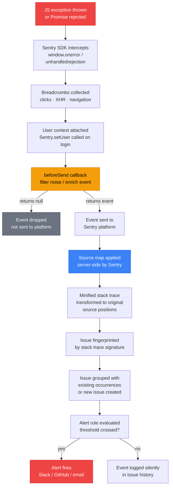

# Error Tracking with Sentry

:::info
Sentry captures unhandled exceptions, unhandled promise rejections, and manually reported errors from a JavaScript application, groups them into issues, resolves stack traces with uploaded source maps, and correlates each issue with the release and commit that introduced it. This article covers SDK setup for React, Vue, and vanilla JavaScript; the `beforeSend` and `ignoreErrors` patterns used to filter noise before it consumes the event quota; user context and breadcrumbs for triage; source map upload via build plugins and `sentry-cli`; and the alert rules that turn a grouped issue into a notification. Every code example targets the current SDK, not pseudocode.
:::

## Context

Every JavaScript application throws exceptions in production. DOM mutations race with network responses, third-party scripts interfere with global state, older browsers interpret specifications differently, and users find interaction paths no developer anticipated. Those exceptions happen regardless of whether the team is watching for them.

Without instrumentation, errors are invisible. A user encounters a blank screen, closes the tab, and moves on. The team learns about the problem only if that user files a support ticket and the ticket is routed to engineering. Most users do not file tickets, so the team operates under the impression that nothing is broken because nothing broken has been reported.

Error tracking closes this gap. An SDK embedded in the application captures every unhandled exception, unhandled promise rejection, network failure, and manually reported error. Each event is enriched with a stacktrace, browser and OS fingerprint, the sequence of breadcrumbs leading up to the failure, and optionally the authenticated user's identity. Events are sent to a platform that groups them by root cause, tracks their frequency over time, and fires an alert when a threshold is crossed.

**Sentry** is a widely used platform in this space. It began in 2008 as `django-db-log`, an open-source error logger David Cramer wrote for Django projects, and grew into the full-stack error-tracking platform used in the examples below; the company behind it, Functional Software, Inc., was incorporated in 2012. Its feature set includes:

- **Open-source origin and self-hosting option.** The core platform is open-source (sentry.io/from-source). Teams with strict data residency requirements can run the full platform on their own infrastructure. Most teams use the managed cloud product, but the open-source option removes vendor lock-in risk.
- **Source map support built into the SDK workflow.** Official Vite, webpack, and Rollup plugins upload source maps automatically during the build step, so minified stack traces resolve to original source without a manual upload step.
- **Rich SDK ecosystem.** Official SDKs exist for every major framework: `@sentry/react`, `@sentry/vue`, `@sentry/angular`, `@sentry/svelte`, `@sentry/browser` for vanilla JS, `@sentry/node` for server-side Node, and `@sentry/nextjs` for Next.js full-stack projects.
- **Issue lifecycle management.** Sentry treats each grouped error as an issue with an explicit lifecycle: new, seen, ignored, resolved. Release tracking shows whether a resolved issue regressed in a later deploy.

The full Sentry workflow spans SDK initialization, source map upload, breadcrumbs, user context, release tracking, noise filtering, and alerting. Source map upload and release tracking are also prerequisites for the RUM and session-replay workflows covered in FEE-1402 and FEE-1407.

## Design Thinking

### Choosing an error-tracking platform

Several platforms cover this space, including Datadog RUM, Rollbar, Bugsnag, LogRocket, and Highlight. This article uses Sentry for its examples, but three capabilities are worth checking in any platform a team evaluates:

**Source map upload integrated into the build tool.** A plugin that uploads source maps automatically during the build (`@sentry/vite-plugin`, `@sentry/webpack-plugin`, or an equivalent for another platform) turns a manual, error-prone upload step into a single build-configuration entry.

**A self-hosted or on-premises option.** Teams with data sovereignty requirements, GDPR obligations, or a security review process that restricts third-party data sharing need a platform that can run on infrastructure they control, not only as a SaaS product.

**Release-to-commit correlation.** A platform that associates each deploy with a commit range and reports which issues appeared or regressed in that release lets an engineer ask "which release introduced this error?" directly, instead of manually cross-referencing error spikes against deployment logs.

### Why source maps must be uploaded in CI, not committed

Source maps contain your original source code. A source map generated from a TypeScript file contains the TypeScript source, including variable names, comments, internal API paths, and business logic that has no reason to be visible to external parties. Committing source maps to the repository and serving them on the CDN is equivalent to publishing your source code alongside the compiled output.

The correct pattern is:
1. Build the application in CI, which generates `.js` and `.js.map` files.
2. Upload the `.map` files to Sentry via the plugin or `sentry-cli`.
3. Delete the `.map` files from the build output.
4. Deploy the `.js` files (without `.map` files) to the CDN.

Sentry decodes stacktraces server-side using the uploaded maps. The human-readable stacktrace is visible only to authenticated members of your Sentry organization. The public bundle contains no source map references.

### Why `beforeSend` is essential

A freshly instrumented application in production typically produces far more events than expected. The main sources of noise are:

- **Browser extensions.** Ad blockers, password managers, accessibility tools, and developer extensions all run JavaScript in the page's context. They throw exceptions that appear in your `window.onerror` handler and are reported to Sentry as if they were your errors.
- **Unhandled promise rejections from third-party scripts.** Analytics tags, A/B testing platforms, and chat widgets often attach to the page and produce unhandled rejections from their own networking code.
- **Network errors from users' connections.** A user on a flaky mobile connection who loses connectivity mid-session produces `TypeError: Failed to fetch` events that originate from the user's network and are not actionable by the team.
- **Known benign errors.** Some browsers throw `"ResizeObserver loop limit exceeded"` or `"Script error."` (cross-origin script errors with no useful detail) as part of normal operation.

Ad blockers also affect events in the other direction: many block requests to `*.ingest.sentry.io` because the domain matches common ad-tracker block-list patterns, so events from users running an ad blocker never leave the browser. The `tunnel` option in `Sentry.init()` routes events through a same-origin path that your own server or edge proxy forwards to Sentry, which avoids that block-list match entirely.

Without filtering, these events flood the issue tracker, bury real errors, and consume your event quota. `beforeSend` is the callback in `Sentry.init()` that runs before each event is sent. It can inspect the event and return `null` to drop it, or modify the event before sending. A well-configured `beforeSend` removes the bulk of extension, third-party, and benign-browser noise so real errors are not buried and the event quota is not exhausted on events nobody will act on.

### Why release tracking transforms debugging

Diagnosis is usually the slow part of incident response. "Which line is broken?" is answerable with a stacktrace. "When did this start breaking?" requires correlating error frequency over time with deployment timestamps. "Which deploy introduced this?" requires manual cross-referencing of error spikes with deployment logs.

Release tracking answers the last two questions automatically. When a release is created and commits are associated, the platform can display:
- The exact commit range deployed in the release.
- Which issues first appeared in this release.
- Which previously resolved issues regressed in this release.
- The team members responsible for the commits that introduced new issues.

The engineer sees the error, sees that it appeared in release `1.4.7`, clicks through to the commit range, and identifies the offending change in minutes.

## Best Practices

**MUST initialize the Sentry SDK as the very first statement in the application entry point, before any other imports that could throw.** Placing `Sentry.init()` after framework initialization causes early bootstrap errors to be missed entirely. Teams MUST ensure no application code executes before `Sentry.init()` completes, which means the init call must precede even framework setup imports in the entry file.

**MUST NOT commit source maps to the public bundle or serve them from the CDN.** Source maps contain original TypeScript source including variable names, internal API paths, and business logic. Teams MUST upload `.map` files to Sentry during the CI build step using the official Vite or webpack plugin, then delete the `.map` files before the CDN deploy step so they never appear in the public bundle.

**MUST configure `beforeSend` to filter noise before events reach Sentry.** Without filtering, browser extension errors, third-party script rejections, and benign browser quirks consume the event quota within days of a new production deployment. Teams MUST configure `beforeSend` before going live and SHOULD also use `ignoreErrors` for known-benign patterns such as `"Script error."` and `"ResizeObserver loop limit exceeded"`.

**SHOULD set `release` in `Sentry.init()` and associate commits with every production deploy.** Without a release identifier, the platform cannot answer "which deploy introduced this error?" The release string SHOULD be injected as an environment variable during the CI build (e.g., `VITE_RELEASE=$(git rev-parse --short HEAD)`) so it is identical in `Sentry.init()` and in the build plugin configuration.

**SHOULD call `Sentry.setUser()` immediately after a successful login and `Sentry.setUser(null)` on logout.** Attaching user context enables filtering all errors by affected user and proactively contacting impacted users. Teams SHOULD log only opaque internal user IDs, never email addresses or full names, to avoid creating GDPR data retention obligations in the Sentry platform.

**MUST set `enabled: import.meta.env.PROD` in `Sentry.init()` to prevent development sessions from consuming the event quota.** Development traffic has no diagnostic value for production incidents and consumes the same quota as real errors. Teams MUST ensure Sentry only sends events in production by gating initialization with the environment flag, since a misconfigured local environment can exhaust a monthly quota in hours.

**SHOULD configure alert rules on error rate rather than raw error count.** A raw-count threshold fires during every traffic spike regardless of whether the application is actually broken. Teams SHOULD configure both a fast-burn alert (error rate > 2% sustained for 10 minutes) and a regression alert (resolved issue recurs in a new release), each linked to a runbook URL.

## Visual

### Error Capture and Processing Flow

The following diagram shows the full path from a JavaScript exception to an actionable alert. Sentry's SDK intercepts the error at the point of throw, attaches breadcrumbs and user context collected throughout the session, ships the event to the platform, and the platform applies the uploaded source map to produce a human-readable stacktrace before grouping the event with others sharing the same fingerprint.



## Example

### SDK Setup: React

Install the SDK and initialize it before your application renders. The `dsn` (Data Source Name) is a project-specific URL found in your Sentry project settings. It is safe to commit: it identifies the project but does not grant write access to issue data.

```bash
npm install @sentry/react
```

```ts
// src/main.tsx
import * as Sentry from "@sentry/react";
import { createRoot } from "react-dom/client";
import App from "./App";

Sentry.init({
  dsn: "https://examplePublicKey@o0.ingest.sentry.io/0",
  environment: import.meta.env.MODE,          // "production" | "staging" | "development"
  release: import.meta.env.VITE_RELEASE,      // injected by CI, e.g. "1.4.7"
  // Neither integration is enabled by default. Without both listed here,
  // the sample-rate options below are set but never take effect.
  integrations: [
    Sentry.browserTracingIntegration(),
    Sentry.replayIntegration(),
  ],
  tracesSampleRate: 0.1,                       // 10% of transactions for performance monitoring
  replaysSessionSampleRate: 0.05,             // 5% of sessions for session replay
  replaysOnErrorSampleRate: 1.0,              // 100% of sessions that contain an error

  beforeSend(event) {
    // Drop events from browser extensions (scripts not loaded from your origin)
    const frames = event.exception?.values?.[0]?.stacktrace?.frames ?? [];
    const hasExtensionFrame = frames.some(
      (f) =>
        f.filename?.startsWith("chrome-extension://") ||
        f.filename?.startsWith("moz-extension://")
    );
    if (hasExtensionFrame) return null;

    // Drop generic network errors — not actionable
    const message = event.exception?.values?.[0]?.value ?? "";
    if (message === "TypeError: Failed to fetch") return null;
    if (message.includes("ResizeObserver loop")) return null;

    return event;
  },

  ignoreErrors: [
    "Script error.",                          // Cross-origin script errors with no detail
    /^Non-Error exception captured/,          // Sentry SDK internal: non-Error thrown
  ],
});

const root = createRoot(document.getElementById("root")!);
root.render(<App />);
```

### SDK Setup: Vue

```bash
npm install @sentry/vue
```

```ts
// src/main.ts
import { createApp } from "vue";
import { createRouter } from "vue-router";
import * as Sentry from "@sentry/vue";
import App from "./App.vue";
import router from "./router";

const app = createApp(App);

Sentry.init({
  app,
  dsn: "https://examplePublicKey@o0.ingest.sentry.io/0",
  environment: import.meta.env.MODE,
  release: import.meta.env.VITE_RELEASE,
  integrations: [
    Sentry.browserTracingIntegration({ router }),
  ],
  tracesSampleRate: 0.1,
  beforeSend(event) {
    const message = event.exception?.values?.[0]?.value ?? "";
    if (message === "TypeError: Failed to fetch") return null;
    return event;
  },
});

app.use(router);
app.mount("#app");
```

### SDK Setup: Vanilla JS

For projects without a framework, use `@sentry/browser` directly.

```bash
npm install @sentry/browser
```

```ts
import * as Sentry from "@sentry/browser";

Sentry.init({
  dsn: "https://examplePublicKey@o0.ingest.sentry.io/0",
  environment: process.env.NODE_ENV,
  release: process.env.RELEASE_VERSION,
  integrations: [Sentry.browserTracingIntegration()], // not enabled by default
  beforeSend(event) {
    const message = event.exception?.values?.[0]?.value ?? "";
    if (message === "TypeError: Failed to fetch") return null;
    return event;
  },
});
```

### Setting User Context

Call `Sentry.setUser()` immediately after a successful login. This associates every subsequent error event with the authenticated user, enabling you to search for "all errors affecting user X" and to reach out to affected users. Send only opaque identifiers such as an internal user ID or role; do not send email addresses or full names, which would create a GDPR data retention obligation inside Sentry.

```ts
// src/auth/authService.ts
import * as Sentry from "@sentry/react";

export function onLoginSuccess(user: { id: string; role: string }) {
  // id and role only. Email and full name are intentionally omitted
  // to avoid creating a GDPR data retention obligation in Sentry.
  Sentry.setUser({
    id: user.id,
    role: user.role,
  });
}

export function onLogout() {
  // Clear user context so subsequent events are not attributed to the previous user
  Sentry.setUser(null);
}
```

### Custom Breadcrumbs

Sentry automatically collects breadcrumbs for DOM clicks, XHR and fetch requests, `console.log` calls, and browser navigation events. Add breadcrumbs manually for application-level events that do not produce them automatically (a user advancing a multi-step form, a WebSocket message received, a feature flag evaluated).

```ts
import * as Sentry from "@sentry/react";

function handleCheckoutStep(step: string) {
  Sentry.addBreadcrumb({
    category: "checkout",
    message: `User advanced to step: ${step}`,
    level: "info",
    data: {
      step,
      timestamp: Date.now(),
    },
  });
  // ... continue with checkout logic
}
```

### Capturing Errors Manually

For caught exceptions that you want to report without rethrowing:

```ts
import * as Sentry from "@sentry/react";

async function loadUserProfile(userId: string) {
  try {
    const response = await fetch(`/api/users/${userId}`);
    if (!response.ok) {
      throw new Error(`HTTP ${response.status} loading profile for ${userId}`);
    }
    return await response.json();
  } catch (error) {
    Sentry.captureException(error, {
      tags: { feature: "user-profile" },
      extra: { userId },
    });
    return null; // graceful degradation
  }
}
```

For informational messages that are not exceptions:

```ts
Sentry.captureMessage("Payment webhook received with unexpected currency", "warning");
```

### Catching Render Errors with ErrorBoundary

An error thrown while React is rendering unmounts the component tree unless a React error boundary catches it first. `@sentry/react` exports `Sentry.ErrorBoundary`, a component that reports the error to Sentry with the React component stack attached, renders a fallback UI in place of the failed subtree, and isolates the failure so the rest of the tree does not unmount.

```tsx
import * as Sentry from "@sentry/react";

function ErrorFallback() {
  return <p>Something went wrong. The team has been notified.</p>;
}

function Dashboard() {
  return (
    <Sentry.ErrorBoundary fallback={<ErrorFallback />} showDialog>
      <WidgetGrid />
    </Sentry.ErrorBoundary>
  );
}
```

Wrap `ErrorBoundary` around independently failing regions of the page, such as a single widget or a route, rather than the whole application. A boundary placed at the root turns any render error into a full blank-page replacement instead of an isolated failure.

### Source Map Upload: Vite Plugin

The `@sentry/vite-plugin` package handles source map upload as part of the Vite build process. It uploads maps to Sentry after the build completes, then deletes them from the output directory.

```bash
npm install @sentry/vite-plugin --save-dev
```

```ts
// vite.config.ts
import { defineConfig } from "vite";
import { sentryVitePlugin } from "@sentry/vite-plugin";

export default defineConfig({
  build: {
    sourcemap: true, // must be enabled for plugin to find maps
  },
  plugins: [
    sentryVitePlugin({
      org: "your-sentry-org-slug",
      project: "your-sentry-project-slug",
      authToken: process.env.SENTRY_AUTH_TOKEN, // set in CI secrets, never hardcoded
      release: {
        name: process.env.VITE_RELEASE,  // same value injected into Sentry.init()
        deploy: {
          env: process.env.NODE_ENV ?? "production",
        },
      },
      sourcemaps: {
        // Upload all .map files from the build output
        assets: "./dist/**",
        // Delete .map files after upload so they are not deployed to CDN
        filesToDeleteAfterUpload: "./dist/**/*.map",
      },
    }),
  ],
});
```

The `SENTRY_AUTH_TOKEN` is an internal integration token created in Sentry project settings (Settings > Auth Tokens). It has write access to releases and source maps for the specified organization. Store it as a CI secret (GitHub Actions secret, GitLab CI variable, etc.). Never commit it.

### Source Map Upload: webpack

For webpack-based projects (Create React App, custom webpack configs):

```bash
npm install @sentry/webpack-plugin --save-dev
```

```js
// webpack.config.js
const { sentryWebpackPlugin } = require("@sentry/webpack-plugin");

module.exports = {
  devtool: "source-map",
  plugins: [
    sentryWebpackPlugin({
      org: "your-sentry-org-slug",
      project: "your-sentry-project-slug",
      authToken: process.env.SENTRY_AUTH_TOKEN,
      release: {
        name: process.env.RELEASE_VERSION,
      },
      sourcemaps: {
        assets: "./build/**",
        filesToDeleteAfterUpload: "./build/**/*.map",
      },
    }),
  ],
};
```

### Release Tracking via sentry-cli

For teams that prefer explicit CLI commands over build plugin integration, `sentry-cli` provides the same capabilities. This pattern is common in pipelines that already manage deployment steps as shell commands.

```bash
# Install sentry-cli
npm install -g @sentry/cli

# Create the release
sentry-cli releases new "$RELEASE_VERSION"

# Stamp a debug ID into each built .js file and its .js.map, so Sentry
# can match a stack frame to its source map without a --url-prefix
sentry-cli sourcemaps inject ./dist

# Upload the injected source maps
sentry-cli sourcemaps upload ./dist --release "$RELEASE_VERSION"

# Associate commits (requires repository integration configured in Sentry)
sentry-cli releases set-commits "$RELEASE_VERSION" --auto

# Finalize the release
sentry-cli releases finalize "$RELEASE_VERSION"

# Mark the release as deployed
sentry-cli releases deploys "$RELEASE_VERSION" new -e production
```

`sourcemaps inject` matches stack frames to source maps by debug ID, the same mechanism the Vite and webpack plugins above use, so filename or URL-prefix matching is unnecessary once maps are injected.

### CI Pipeline Integration (GitHub Actions)

```yaml
# .github/workflows/deploy.yml
name: Deploy

on:
  push:
    branches: [main]

jobs:
  build-and-deploy:
    runs-on: ubuntu-latest
    steps:
      - uses: actions/checkout@v4
        with:
          fetch-depth: 0  # full history required for sentry-cli commit association

      - uses: actions/setup-node@v4
        with:
          node-version: "20"

      - run: npm ci

      - name: Set release version
        run: echo "VITE_RELEASE=$(git rev-parse --short HEAD)" >> $GITHUB_ENV

      - name: Build (uploads source maps via Vite plugin, then deletes .map files)
        run: npm run build
        env:
          SENTRY_AUTH_TOKEN: ${{ secrets.SENTRY_AUTH_TOKEN }}
          VITE_RELEASE: ${{ env.VITE_RELEASE }}

      - name: Deploy to CDN
        run: |
          # At this point ./dist contains .js files but no .map files
          # (the Vite plugin deleted them after upload)
          aws s3 sync ./dist s3://your-bucket/static/
        env:
          AWS_ACCESS_KEY_ID: ${{ secrets.AWS_ACCESS_KEY_ID }}
          AWS_SECRET_ACCESS_KEY: ${{ secrets.AWS_SECRET_ACCESS_KEY }}
```

### Alerting Rules

In Sentry's project settings, alert rules define when and where to send notifications. A baseline alert configuration for a production frontend:

| Rule | Condition | Action |
|---|---|---|
| New issue alert | A new issue is created | Slack #frontend-alerts |
| Error spike | Error count > 100 in 5 minutes | Slack #frontend-alerts + PagerDuty |
| Regression alert | A resolved issue recurs in a new release | Slack #frontend-alerts |
| High-priority user impact | Error affects > 50 unique users | Slack #frontend-on-call |

Sentry also integrates with GitHub to auto-create issues for new errors and with Jira to link Sentry issues to sprint tickets.

## Common Mistakes

### Using `console.error` instead of `Sentry.captureException`

`console.error` writes to the browser console and is invisible to error tracking. Caught exceptions that are logged with `console.error` silently disappear in production. Any caught exception worth logging is worth reporting to Sentry. Replace `console.error(err)` in catch blocks with `Sentry.captureException(err)` followed by graceful degradation logic.

### Sampling in non-production environments

Setting `tracesSampleRate: 1.0` in development floods the platform with events from local development sessions. Always gate the DSN and sample rates by environment. A common pattern is to call `Sentry.init()` only when `import.meta.env.MODE === "production"` or to set `enabled: import.meta.env.PROD` in the init config.

```ts
Sentry.init({
  dsn: "https://examplePublicKey@o0.ingest.sentry.io/0",
  enabled: import.meta.env.PROD, // do not send events in development or test
  tracesSampleRate: 0.1,
});
```

### Not associating commits with releases

Release tracking without commit association shows which release introduced an error but not which commit or author. Enable commit association by installing the Sentry GitHub / GitLab integration in your organization and passing `--auto` to `sentry-cli releases set-commits` (or enabling auto-association in the Vite plugin config). This requires that `actions/checkout` runs with `fetch-depth: 0` in the CI workflow.

## Related FEEs

- [FEE-1400: Observability & Error Tracking Overview](./1400.md) — Category context and the three pillars of frontend observability
- [FEE-1402: Real User Monitoring & Core Web Vitals](./1402.md) — Capturing performance metrics from real users to complement error data
- [FEE-1403: Logging & Structured Logging](./1403.md) — Structured logs complement Sentry error events for business-level audit trails and correlation via traceId
- [FEE-1405: Feature Flag Observability & A/B Testing](./1405.md) — Attaching feature flag context to error events to correlate errors with flag variants
- [FEE-1406: Alerting, Dashboards & SLOs](./1406.md) — Error budget and burn rate framework that governs how Sentry alert thresholds are set and reviewed
- [FEE-1407: Session Replay & Production Debugging](./1407.md) — Correlating session replays with Sentry error events for root cause analysis
- [FEE-1205: Supply Chain Security](../Security/1205.md) — lockfiles and SRI reduce unverified code entering production, complementing error monitoring coverage
- [FEE-1500: CI/CD & Deployment Overview](../CI%20CD%20and%20Deployment/1500.md) — Source map upload as a mandatory step in the deployment pipeline

## References

- [Sentry JavaScript SDK Documentation](https://docs.sentry.io/platforms/javascript/)
- [Sentry React SDK Documentation](https://docs.sentry.io/platforms/javascript/guides/react/)
- [Sentry Vue SDK Documentation](https://docs.sentry.io/platforms/javascript/guides/vue/)
- [@sentry/vite-plugin on npm](https://www.npmjs.com/package/@sentry/vite-plugin)
- [Sentry Source Maps Documentation](https://docs.sentry.io/platforms/javascript/sourcemaps/)
- [Sentry Release Tracking](https://docs.sentry.io/product/releases/)
- [sentry-cli releases documentation](https://docs.sentry.io/product/cli/releases/)
- [Sentry beforeSend documentation](https://docs.sentry.io/platforms/javascript/configuration/filtering/)
- [Sentry Alert Rules documentation](https://docs.sentry.io/product/alerts/)
- David Cramer, "Sentry: From the Beginning," cra.mr (2019). https://cra.mr/sentry-from-the-beginning/
- MDN Web Docs, "Window: error event," Mozilla. https://developer.mozilla.org/en-US/docs/Web/API/Window/error_event
- MDN Web Docs, "Window: unhandledrejection event," Mozilla. https://developer.mozilla.org/en-US/docs/Web/API/Window/unhandledrejection_event
