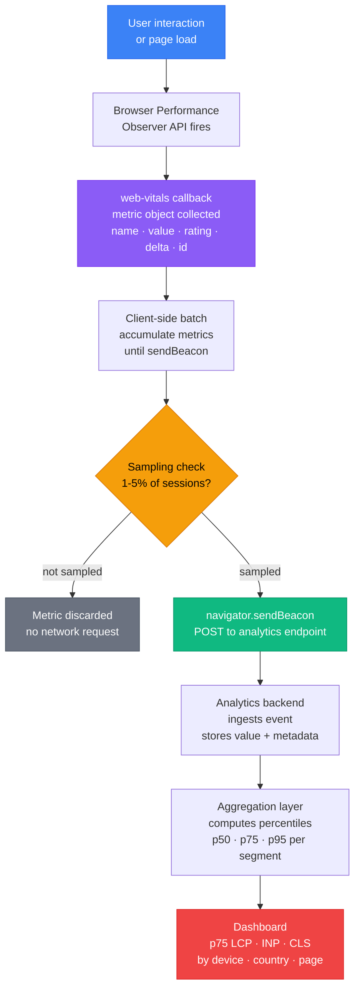

# Real User Monitoring & Core Web Vitals

## Context

Performance is not a number on a report — it is a lived experience distributed across millions of devices, networks, and usage patterns. A Lighthouse score of 95 on a developer's M2 MacBook Pro, measured on a fast office Wi-Fi connection, tells almost nothing about the performance encountered by a user on a four-year-old Android phone in a rural area with spotty LTE coverage.

This gap between lab performance and field performance is the central problem that Real User Monitoring (RUM) solves. RUM collects performance metrics from actual user sessions: the real device, the real browser, the real network, and the real page load — including all the third-party scripts, A/B testing payloads, and feature flag overrides that Lighthouse never sees.

**Core Web Vitals** are Google's set of standardized user-centric performance metrics, introduced in 2020 and integrated into Google Search ranking since 2021. They measure three dimensions of perceived quality:

- **LCP (Largest Contentful Paint):** How fast does the main content appear? LCP measures the time from page navigation to when the largest image or text block in the viewport is rendered.
- **INP (Interaction to Next Paint):** How responsive does the page feel? INP measures the latency from user input (click, tap, key press) to the next paint. INP replaced FID (First Input Delay) in March 2024 because FID only measured the delay before the browser started handling the first interaction, while INP measures the full end-to-end interaction cost across all interactions throughout the page lifetime.
- **CLS (Cumulative Layout Shift):** How stable is the layout? CLS measures unexpected visual shifts — elements moving after initial render because images without dimensions load late, dynamic content inserts above existing content, or fonts swap during rendering.

Each metric has three rating bands:

| Metric | Good | Needs Improvement | Poor |
|--------|------|-------------------|------|
| LCP | < 2.5s | 2.5s – 4s | > 4s |
| INP | < 200ms | 200ms – 500ms | > 500ms |
| CLS | < 0.1 | 0.1 – 0.25 | > 0.25 |

The `web-vitals` JavaScript library, maintained by Google, provides a stable API for collecting all three metrics (plus FCP and TTFB) directly from the browser's Performance Observer APIs. It is the standard instrumentation layer for any RUM pipeline.

Beyond Google ranking, Core Web Vitals matter because they are the closest the web platform has to a shared vocabulary for user experience quality. LCP below 2.5s means users see content quickly. INP below 200ms means interactions feel instant. CLS below 0.1 means the layout is trustworthy. When a team commits to these thresholds in production — measured at p75, across real devices — they are committing to a specific standard of user experience.

## Principle

- SHOULD instrument Core Web Vitals with the `web-vitals` library and report to an analytics endpoint.
- SHOULD monitor p75 LCP and INP in production, not just Lighthouse scores.
- SHOULD NOT average web vitals — use percentiles (p75 is the standard).
- SHOULD use a sampling strategy (1–5%) when sending RUM data at scale to avoid prohibitive analytics costs.
- SHOULD segment RUM data by device type, connection type, and page template to surface actionable patterns.
- SHOULD treat field data from CrUX and RUM as the source of truth for production performance; treat Lighthouse as a development feedback tool only.

## Design Thinking

### Why RUM beats Lighthouse for production monitoring

Lighthouse is a synthetic monitor: it runs a single, scripted page load in a controlled environment (Chrome DevTools Protocol, a specific CPU throttle level, a specific network throttle preset) on a single device, at a single point in time. It is deterministic and reproducible, which makes it excellent for CI quality gates and developer feedback during development. WebPageTest is another powerful synthetic tool that supports multi-step scripting, custom connection throttling profiles, and detailed waterfall analysis — but it shares the fundamental limitation of all synthetic monitoring: it runs in a controlled lab environment, not on your actual users' devices and networks.

But production is not a controlled environment. Real users access your application on:

- Devices ranging from a flagship phone released last month to a four-year-old low-end Android with a single slow CPU core.
- Networks ranging from gigabit fiber to edge LTE dropping in and out of coverage.
- Browser versions including the latest Chrome, but also Firefox ESR, Safari on older iPhones, and Samsung Internet on budget Android devices.
- Sessions that include third-party analytics scripts, A/B testing payloads, and cookie consent banners that your CI Lighthouse run never loads.
- Cold cache states for first-time visitors versus warm cache states for returning users.

A Lighthouse score tells you what performance looks like under one specific set of conditions. RUM tells you what performance looks like across the actual distribution of conditions your users experience. These two numbers are often far apart. A page with a Lighthouse LCP of 1.8s (good) can easily have a p75 field LCP of 4.2s (poor) if a significant portion of the user base is on slow mobile devices.

Production decisions — whether to invest in server-side rendering, image optimization, JavaScript splitting, or caching strategy — must be driven by field data, not lab data. Lighthouse is a development tool. RUM is the production instrument.

### Why INP replaced FID

FID (First Input Delay) measured only the delay between a user's first interaction and the browser's first opportunity to respond — not how long the interaction actually took to process, and not any subsequent interactions after the first one. A page could have a good FID score while being thoroughly unresponsive during heavy data processing after the first click.

INP (Interaction to Next Paint), introduced as an experimental metric in 2022 and replacing FID as a Core Web Vital in March 2024, measures the end-to-end latency of interactions across the full page lifetime. For each interaction (click, tap, keyboard input), INP measures from input event to the next frame paint. The reported INP value is the worst interaction latency observed throughout the session (with a small allowance for outliers to avoid single anomalous events dominating the score).

This means INP surfaces real responsiveness problems that FID missed: long-running event handlers, heavy re-renders triggered by user actions, synchronous storage access blocking the main thread, and third-party scripts deferring frame paints.

### Why p75 is the right percentile

When a team reports "our average LCP is 2.1s", they have hidden a critical distribution. An average of 2.1s is compatible with:

- 90% of users at 1.5s LCP and 10% of users at 8.6s LCP — a severe tail problem affecting one in ten users.
- 50% of users at 1.0s and 50% at 3.2s — a bimodal distribution where half the user base has poor performance.

Averages suppress the experience of slow-tail users, who are disproportionately the users on the worst devices and connections — often the users with the least discretionary alternatives for switching platforms.

Google's Chrome UX Report (CrUX) uses **p75** as the threshold for Search ranking: a URL's Core Web Vitals rating in Google Search is determined by whether the 75th percentile of field measurements falls in the good, needs-improvement, or poor band. p75 means that 75% of users experience performance at or better than the reported value. Optimizing to p75 means optimizing for the majority of real users, not just the best-case users.

P75 is more actionable than p95 or p99 (which are noisier and more expensive to improve) and more honest than p50 (median, which hides the worse half of the distribution).

### Why sampling is necessary at scale

Sending every metric event from every user session to an analytics endpoint is expensive at scale. A site with 1 million daily visitors collecting five metrics per page load (LCP, INP, CLS, FCP, TTFB) generates 5 million analytics events per day. At standard analytics ingestion costs, this becomes significant infrastructure spend — and the incremental value of going from 1 million data points to 1 million data points is zero.

A 1% sample of 1 million sessions provides 10,000 data points — statistically sufficient for p75 estimation with tight confidence intervals. A 5% sample provides 50,000 data points, more than enough for segmentation by device class, geography, or page template.

The right sampling rate depends on traffic volume:

- High-traffic sites (1M+ daily sessions): 1–2% sample
- Medium-traffic sites (100K–1M daily sessions): 5–10% sample
- Low-traffic sites (under 100K daily sessions): 100% (no sampling needed)

Sampling should be session-based (decide once per session, not per metric event) so that all metrics from a sampled session are reported together, preserving the ability to correlate LCP, INP, and CLS within the same visit.

## Visual

### RUM Pipeline

The following diagram shows the path from a user interaction to a p75 distribution visible in a monitoring dashboard. The `web-vitals` observer fires when the browser finalizes a metric, data is batched in the client to reduce network requests, and the batch is sent to an analytics endpoint that aggregates metrics into percentile distributions.



## Example

### Installing and Configuring the `web-vitals` Library

```bash
npm install web-vitals
```

The library exposes individual functions for each metric. Each function takes a callback that receives a metric object with a consistent shape:

```ts
import { onLCP, onINP, onCLS, onFCP, onTTFB } from 'web-vitals';

// Each callback receives: { name, value, rating, delta, id, navigationType }
onLCP(console.log);
onINP(console.log);
onCLS(console.log);
```

The `rating` field is always one of `'good'`, `'needs-improvement'`, or `'poor'` — the library applies the standard thresholds automatically.

### Sending Metrics to an Analytics Endpoint

The recommended pattern is to collect metrics as they fire and send them in a batch when the user leaves the page, using `navigator.sendBeacon` to ensure the request completes even during page unload.

```ts
// src/lib/vitals.ts
import { onLCP, onINP, onCLS, onFCP, onTTFB, type Metric } from 'web-vitals';

const queue: Metric[] = [];
let scheduled = false;

function scheduleFlush() {
  if (scheduled) return;
  scheduled = true;
  // Flush at next idle or on page hide
  if (typeof requestIdleCallback !== 'undefined') {
    requestIdleCallback(flush, { timeout: 2500 });
  } else {
    setTimeout(flush, 0);
  }
}

function flush() {
  if (queue.length === 0) return;
  const body = JSON.stringify({
    metrics: queue.map((m) => ({
      name: m.name,
      value: m.value,
      rating: m.rating,
      id: m.id,
      navigationType: m.navigationType,
    })),
    url: location.href,
    timestamp: Date.now(),
  });
  // sendBeacon works during page unload; fetch does not
  navigator.sendBeacon('/api/vitals', new Blob([body], { type: 'application/json' }));
  queue.length = 0;
  scheduled = false;
}

function collect(metric: Metric) {
  queue.push(metric);
  scheduleFlush();
}

// Register on page hide to flush before navigation
addEventListener('visibilitychange', () => {
  if (document.visibilityState === 'hidden') flush();
});
addEventListener('pagehide', flush);

export function initVitals() {
  onLCP(collect);
  onINP(collect);
  onCLS(collect);
  onFCP(collect);
  onTTFB(collect);
}
```

Call `initVitals()` once at application startup:

```ts
// src/main.ts
import { initVitals } from './lib/vitals';

initVitals();
// ... rest of application init
```

### Adding a Sampling Gate

Wrap the reporting path with a session-level sampling decision made once per session and stored in `sessionStorage`:

```ts
// src/lib/vitals.ts (with sampling)
import { onLCP, onINP, onCLS, onFCP, onTTFB, type Metric } from 'web-vitals';

const SAMPLE_RATE = 0.05; // 5% of sessions

function shouldSample(): boolean {
  const key = 'rum_sampled';
  const stored = sessionStorage.getItem(key);
  if (stored !== null) return stored === '1';
  const sampled = Math.random() < SAMPLE_RATE;
  sessionStorage.setItem(key, sampled ? '1' : '0');
  return sampled;
}

function sendMetric(metric: Metric) {
  const body = JSON.stringify({
    name: metric.name,
    value: metric.value,
    rating: metric.rating,
    id: metric.id,
    url: location.href,
  });
  navigator.sendBeacon('/api/vitals', new Blob([body], { type: 'application/json' }));
}

export function initVitals() {
  if (!shouldSample()) return; // exit early for non-sampled sessions

  onLCP(sendMetric);
  onINP(sendMetric);
  onCLS(sendMetric);
  onFCP(sendMetric);
  onTTFB(sendMetric);
}
```

### Analytics Endpoint (Node.js / Edge Function)

A minimal endpoint that receives metric events and forwards to a time-series store or analytics platform:

```ts
// api/vitals.ts (Next.js API route or Vercel Edge Function)
import type { NextRequest } from 'next/server';

export const runtime = 'edge';

export async function POST(req: NextRequest) {
  const body = await req.json();
  const { name, value, rating, id, url } = body;

  // Forward to your analytics backend (e.g., ClickHouse, BigQuery, Datadog)
  await fetch(process.env.ANALYTICS_INGEST_URL!, {
    method: 'POST',
    headers: { 'Content-Type': 'application/json', 'Authorization': `Bearer ${process.env.ANALYTICS_TOKEN}` },
    body: JSON.stringify({
      metric: name,
      value,
      rating,
      event_id: id,
      page_url: url,
      ts: Date.now(),
    }),
  });

  return new Response(null, { status: 204 });
}
```

### Vercel Speed Insights

For applications deployed on Vercel, Speed Insights provides built-in RUM for Core Web Vitals with zero configuration beyond installing the package:

```bash
npm install @vercel/speed-insights
```

In a React application:

```tsx
// src/main.tsx
import { SpeedInsights } from '@vercel/speed-insights/react';

export function App() {
  return (
    <>
      {/* your application */}
      <SpeedInsights />
    </>
  );
}
```

For a framework-agnostic approach using the `inject` function:

```ts
import { inject } from '@vercel/speed-insights';

inject();
```

Vercel Speed Insights aggregates metrics in the Vercel dashboard and surfaces p75 values per route, device type, and country. The data is sourced from real user sessions, not synthetic measurements.

### Datadog RUM

For organizations already using Datadog for infrastructure monitoring, Datadog RUM integrates Core Web Vitals into the same observability platform as APM traces and infrastructure metrics:

```bash
npm install @datadog/browser-rum
```

```ts
// src/lib/datadog.ts
import { datadogRum } from '@datadog/browser-rum';

datadogRum.init({
  applicationId: 'YOUR_APPLICATION_ID',
  clientToken: 'pub_XXXXXXXXXXXXXXXXXXXXXXXXXXXXXXXX',
  site: 'datadoghq.com',
  service: 'your-frontend-service',
  env: import.meta.env.MODE,
  version: import.meta.env.VITE_RELEASE,
  sessionSampleRate: 5,           // 5% of sessions
  sessionReplaySampleRate: 1,     // 1% of sessions get session replay
  trackUserInteractions: true,    // enables INP tracking
  trackResources: true,           // tracks resource timing
  trackLongTasks: true,           // tracks long tasks (> 50ms)
  defaultPrivacyLevel: 'mask-user-input',
});
```

Datadog RUM automatically collects LCP, INP, and CLS and surfaces them in the Core Web Vitals dashboard with p50/p75/p95 breakdowns by browser, device, country, and page.

### Cloudflare Browser Insights

Cloudflare Browser Insights is zero-configuration RUM built into Cloudflare's proxy layer. For sites already proxied by Cloudflare, it can be enabled in the Cloudflare dashboard under **Speed → Browser Insights** with no JavaScript SDK to install.

Once enabled, Cloudflare collects Core Web Vitals (LCP, INP, CLS) and page load metrics from real browser sessions. Results appear in the Cloudflare dashboard, broken down by country, browser, and connection type.

**When to use it:** Teams already on Cloudflare who need baseline RUM without adding a JavaScript dependency. It does not support custom event tracking, user context, or custom dimensions — for those needs, use Datadog RUM or Vercel Speed Insights.

### Reading CrUX Data from Google Search Console

Google Search Console's Core Web Vitals report shows field data from the Chrome UX Report (CrUX) — real Chrome user sessions aggregated by Google. This is the definitive source for how Google's ranking algorithm evaluates your Core Web Vitals.

Navigate to: Google Search Console > Experience > Core Web Vitals.

The report shows:
- How many URLs are rated good, need improvement, or are poor.
- Which specific URLs have LCP, INP, or CLS issues.
- Whether mobile and desktop differ significantly.

CrUX data is a 28-day rolling aggregate of Chrome sessions. It is not real-time and does not support granular segmentation, but it is the authoritative view of how Google perceives your performance.

For programmatic access, the CrUX API is available at `https://chromeuxreport.googleapis.com/v1/records:queryRecord`.

## Common Mistakes

### Reporting averages instead of percentiles

`average(LCP)` is not a valid performance metric. An average of 2.0s can represent a bimodal distribution where half the users have 0.5s LCP and half have 3.5s LCP. Use p75 as the primary operational metric. Most analytics platforms support percentile aggregation natively. In ClickHouse: `quantile(0.75)(value)`. In BigQuery: `APPROX_QUANTILES(value, 100)[OFFSET(75)]`.

### Trusting Lighthouse as a production signal

Lighthouse is a development and CI tool. Its scores reflect performance under controlled conditions on a single device. Production decisions about infrastructure, caching, and optimization must be driven by field data. If Lighthouse shows 92 but p75 field LCP is 4.5s, the Lighthouse score is misleading — field data is truth.

### Measuring FID instead of INP

FID was deprecated as a Core Web Vital in March 2024 and replaced by INP. New instrumentation should use `onINP` from the `web-vitals` library. FID data in old dashboards should be treated as historical only. If your team's performance dashboards still show FID as a primary metric, migrate to INP.

### Using `fetch` instead of `sendBeacon` for metric reporting

`fetch` requests can be cancelled when the user navigates away from the page. Metric events collected late in the session (particularly INP, which fires as users interact) are at risk of being lost if the reporting call uses `fetch`. Use `navigator.sendBeacon` for all RUM event submission. `sendBeacon` is a fire-and-forget POST that the browser queues and sends even during page unload.

### Sampling per-metric instead of per-session

Deciding the sampling question independently for each metric event produces incoherent datasets. An LCP event and the INP event from the same session may be reported at different rates, making it impossible to correlate them. Make the sampling decision once per session (using `sessionStorage`) and apply it uniformly to all metrics from that session.

### Not segmenting RUM data

A single p75 LCP for the entire site hides critical patterns. A page template used mostly on desktop may have excellent LCP while the same template on mobile has poor LCP. The product page may be fast while the checkout page is slow. Segment RUM data at minimum by: page URL or template, device class (mobile vs. desktop), and browser. Most performance regressions are visible in a specific segment before they appear in aggregate numbers.

### Ignoring CLS regressions from dynamic content

CLS regressions are commonly introduced by:
- Image carousels without explicit width/height attributes
- Cookie consent banners inserted above page content after initial render
- Server-rendered lists replaced by client-rendered lists of different heights
- Web fonts causing text reflow during the font swap period

A CLS regression often appears in RUM data before it is noticed visually. Monitor CLS at p75 with alerting on regressions above 0.1.

## Related FEEs

- [FEE-1400: Observability & Error Tracking Overview](./1400.md) — Category context and the three pillars of frontend observability
- [FEE-1401: Error Tracking with Sentry](./1401.md) — Sentry for capturing JavaScript exceptions and performance spans
- [FEE-1404: OpenTelemetry Browser Tracing](./1404.md) — Distributed tracing from browser to backend, complementing RUM metric data
- [FEE-1405: Feature Flag Observability & A/B Testing](./1405.md) — LCP and INP as pre-specified guardrail metrics for A/B experiments; reporting web vitals as PostHog events for per-variant analysis
- [FEE-1406: SLOs for Core Web Vitals](./1406.md) — Defining and alerting on service level objectives for LCP, INP, and CLS

## References

- [web-vitals library on GitHub](https://github.com/GoogleChrome/web-vitals)
- [Core Web Vitals — web.dev](https://web.dev/vitals/)
- [INP replaces FID announcement — Google Search Central](https://developers.google.com/search/blog/2023/05/introducing-inp)
- [CrUX API documentation](https://developer.chrome.com/docs/crux/api/)
- [Google Search Console Core Web Vitals report](https://support.google.com/webmasters/answer/9205520)
- [Vercel Speed Insights documentation](https://vercel.com/docs/speed-insights)
- [Datadog RUM documentation](https://docs.datadoghq.com/real_user_monitoring/browser/)
- [Cloudflare Browser Insights](https://developers.cloudflare.com/analytics/web-analytics/)
- [navigator.sendBeacon — MDN](https://developer.mozilla.org/en-US/docs/Web/API/Navigator/sendBeacon)
- [Chrome UX Report — web.dev](https://developer.chrome.com/docs/crux/)
