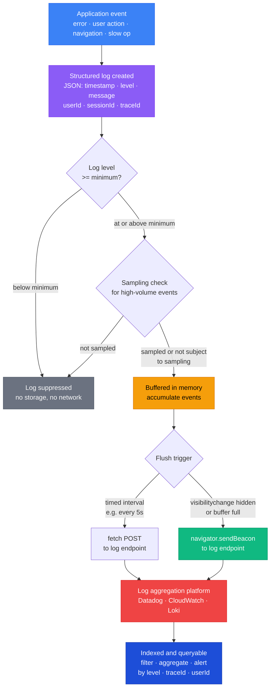

# Logging & Structured Logging

## Context

Every non-trivial frontend application eventually encounters a problem that is not reproducible in a local environment: a user reports that "the checkout broke," but only on Safari, only on Tuesdays, only after adding a specific combination of items to a cart. Without logs, you are reconstructing the past from nothing. With logs, you have a record of what happened, when it happened, and in what context.

But the kind of logs that matter in production are not the `console.log` statements sprinkled through a codebase during development. Those are human-readable and ephemeral — they appear in a developer's browser DevTools and vanish the moment the tab closes. What production observability requires is a different category of logging entirely: structured, machine-parseable, consistently formatted records that can be ingested by a log aggregation platform, queried with filters, aggregated into metrics, and wired to alerting rules.

**Structured logging** is the practice of emitting log records as JSON objects with a consistent schema rather than as free-form strings. Instead of:

```
[ERROR] Payment failed for user john@example.com at 2026-04-10T09:12:44Z
```

A structured log record looks like:

```json
{
  "timestamp": "2026-04-10T09:12:44.123Z",
  "level": "error",
  "message": "Payment failed",
  "userId": "u_8f3a2c",
  "sessionId": "s_9d1e4b",
  "traceId": "4bf92f3577b34da6a3ce929d0e0e4736",
  "errorCode": "PAYMENT_DECLINED",
  "orderId": "ord_2025_0041"
}
```

The difference is not aesthetic. A log platform ingesting the first format must apply fragile regex parsing to extract any structured information. A log platform ingesting the second format can immediately filter by `level:error`, group by `errorCode`, join on `traceId` to find the matching backend trace, and alert when the error rate for `PAYMENT_DECLINED` exceeds a threshold — all without any custom parsing configuration.

Frontend logging spans two distinct environments. In the **browser**, the application has access to the DOM, user interaction events, navigation history, and browser APIs — but no persistent storage for logs, and any outbound network request to deliver logs can be cancelled by a page unload. In **SSR and Node.js server contexts** (Next.js API routes, Nuxt server middleware, Remix loaders), the application runs on a server where long-lived processes, file system access, and synchronous I/O are available.

Each environment requires a tailored logging approach. This article covers both, along with the log pipeline that connects them to a centralized log platform.

## Principle

- SHOULD use structured JSON logging with consistent fields (`timestamp`, `level`, `message`, `userId`, `sessionId`, `traceId`) — not `console.log`.
- SHOULD NOT log personally identifiable information (PII): no email addresses, full names, passwords, payment card data, or raw user input.
- SHOULD use `navigator.sendBeacon` for flushing logs on page unload — not `fetch` or XHR, which are cancelled during navigation.
- SHOULD batch log events in memory and flush on a timed interval (e.g., every 5 seconds) or when the buffer reaches a size threshold — not one HTTP request per log event.
- SHOULD sample high-volume log events (verbose user interaction traces, navigation events) at a configurable rate (e.g., 5–10%) to avoid overwhelming the log platform.
- SHOULD use `visibilitychange` with `document.visibilityState === 'hidden'` as the page unload signal — it is more reliable than `beforeunload`, especially on mobile browsers.
- SHOULD use Pino or Winston for server-side (Node.js / SSR) logging, not `console.log`.

## Design Thinking

### Why structured logging beats `console.log`

`console.log('Payment failed for', user.email)` produces an unstructured string. This string is human-readable in the browser DevTools, but it is effectively opaque to any automated system. When logs from thousands of concurrent user sessions reach a log aggregation platform, each event is a string that must be parsed to be useful.

Log platforms like Datadog, AWS CloudWatch, and Grafana Loki can ingest raw text and apply regex-based parsing rules. But this creates a fragile dependency: the parsing rule is coupled to the exact string format, so any change to the log message — even adding a word — can silently break the parser and invalidate all derived metrics and alerts.

Structured logging avoids this entirely. A JSON object with a stable schema can be ingested directly. Fields are immediately queryable. No parsing configuration is required. Filters, aggregations, and alert rules reference field names (`level`, `errorCode`, `traceId`) not string patterns. When the `message` field changes, the filter on `errorCode: "PAYMENT_DECLINED"` is unaffected.

The practical implication: a team using `console.log` that tries to answer "how many users encountered a payment error in the last hour, broken down by error code?" must either parse logs manually or build and maintain fragile parsing rules. A team using structured logging answers this question with a single filter query in their log platform.

### Why `sendBeacon` for log flush on page unload

The browser's standard mechanisms for sending data — `fetch` and XHR — are tied to the page's lifecycle. When the user navigates away from a page, closes the tab, or the browser process terminates, any in-flight or pending `fetch` or XHR requests are cancelled. This is by design: the browser terminates network activity associated with a page when that page is unloaded.

For most application data, this is fine. For log delivery, it creates a critical gap. The most diagnostically valuable log events are often the ones that occur immediately before a navigation or page close: the error that caused the user to abandon the checkout flow, the crash that occurred on the last interaction before the tab was closed, the performance event recorded just before the user left.

`navigator.sendBeacon(url, data)` was designed specifically to solve this problem. It queues a small HTTP POST request that the browser commits to delivering even as the page is unloaded. The request is fire-and-forget from the application's perspective: there is no response callback. The browser handles the actual transmission after the page lifecycle has ended.

The key constraint is the data format: `sendBeacon` accepts a `Blob`, `FormData`, `URLSearchParams`, or string. For JSON payloads, wrap the serialized string in a `Blob` with the correct MIME type:

```ts
navigator.sendBeacon(
  '/api/logs',
  new Blob([JSON.stringify(payload)], { type: 'application/json' })
);
```

### Why batching matters

A production frontend application serving 100,000 daily active users, logging 10 events per user session, generates 1 million log events per day. If each log event triggered an individual HTTP POST to the log ingestion endpoint, that is 1 million network requests per day — generating significant server load, meaningfully increasing the user's data consumption, and adding latency to the application (every log call would queue a network request).

Batching solves this by accumulating log events in memory and sending them in bulk on a periodic flush interval (e.g., every 5 seconds) or when the buffer reaches a size threshold (e.g., 50 events). The 1 million events per day become approximately 200,000 network requests per day if flushed every 5 seconds — and practically far fewer, since many sessions are shorter than 5 seconds.

Two flush triggers should coexist:
- **Timed flush**: runs on a `setInterval`, ensuring logs are delivered periodically even during long-running sessions.
- **Visibility-change flush**: fires when `document.visibilityState === 'hidden'`, flushing the buffer before the page is unloaded. Uses `sendBeacon` to ensure delivery.

### Why PII in logs is a compliance landmine

Log records are typically stored for 30–90 days in a log aggregation platform. Access to the log platform is often broader than access to the production database — it may be shared with a DevOps team, a security team, and sometimes third-party vendors providing the platform itself.

Logging an email address, a full name, a home address, or any other personally identifiable information means that data is now replicated into the log storage system, retained for the log retention period, and accessible to everyone with log access — regardless of what data access controls exist in the primary database.

Under GDPR, this creates a data processing obligation: the logged PII is a personal data record, subject to the right to erasure, the right of access, and data breach notification requirements. A user requesting deletion of their data must have their data erased from log storage as well — which is operationally complex or practically impossible with most log platforms.

The correct approach is to log opaque identifiers instead of PII:

| Instead of | Log this |
|------------|---------|
| `user.email` | `user.id` (an opaque internal ID) |
| `user.name` | `user.id` |
| `paymentCard.number` | `paymentCard.lastFour` or `paymentCard.tokenId` |
| `user.address` | a session or anonymized segment ID |

If the business needs to correlate a log record to a specific user (e.g., for a support investigation), that mapping is done in the application database, not in the log platform.

### Why log levels matter

Log levels — `debug`, `info`, `warn`, `error` — serve two functions. In development, they let a developer filter the console to show only the events they care about. In production, they control what gets sent to the log platform at all.

A common practice is to configure the minimum log level per environment:

- **Development**: `debug` and above (everything)
- **Staging**: `info` and above
- **Production**: `warn` and above (or `info` if info-level logs are useful for tracing user journeys)

Sending `debug`-level logs to production is a common source of log volume explosions and unnecessary cost. Debug logs are meant for development-time diagnostic output — component mount/unmount cycles, API request details, internal state transitions — and produce enormous volumes in a production application. Setting the minimum production level to `warn` or `info` ensures only actionable events are stored and billed.

The ordering of levels: `debug < info < warn < error`. Events at or above the configured minimum level are logged; events below it are suppressed.

## Best Practices

**MUST NOT log personally identifiable information (PII) in any log record.** Email addresses, full names, payment card data, and raw user input stored in a log platform create GDPR data retention and erasure obligations across a system that is often shared with third-party vendors. Teams MUST log only opaque internal identifiers (e.g., `user.id`) and MUST ensure the logger implementation — not the call site — enforces this constraint by accepting only a userId field, never a user object.

**MUST use `navigator.sendBeacon` for log delivery on page unload — not `fetch` or XHR.** `fetch` requests are cancelled by the browser when the user navigates away, closing the tab, or the browser process terminates. The diagnostically most valuable log events — the error that caused a checkout abandonment, the exception that preceded a tab close — are exactly those at risk of being lost. Teams MUST listen for `visibilitychange` with `document.visibilityState === 'hidden'` as the page-unload signal, which is more reliable than `beforeunload` on mobile browsers.

**MUST batch log events in memory and flush on a timed interval rather than issuing one HTTP request per log call.** A production application with 100,000 daily active users logging 10 events per session generates 1 million log events per day; one request per event means 1 million network requests per day, adding latency and server load. Teams MUST implement at minimum a 5-second timed flush and a buffer-size flush (e.g., at 50 events), with the visibility-change flush using `sendBeacon` for guaranteed delivery.

**SHOULD use structured JSON logging with a consistent schema — not `console.log`.** A log platform ingesting free-form strings must apply fragile regex parsing to extract any structured data. A consistent schema (`timestamp`, `level`, `message`, `userId`, `sessionId`, `traceId`) allows immediate filtering by level, grouping by error code, and joining to backend traces via `traceId` without any parsing configuration. Teams SHOULD enforce the base schema in the logger implementation so every record automatically includes the context fields.

**SHOULD configure the minimum log level per environment: `debug` in development, `info` or `warn` in production.** Debug logs contain component lifecycle events and internal state transitions that produce enormous volume in production. Teams SHOULD set `minLevel: 'info'` or `minLevel: 'warn'` for production, which prevents debug-level noise from consuming log platform storage quota and obscuring actionable events.

**SHOULD use Pino (Node.js/SSR) or a structured browser logger rather than `console.log` in any environment.** `console.log` in a production browser context is invisible to any monitoring system and disappears when the user closes DevTools. For server-side contexts (Next.js API routes, Nuxt middleware, Express), Pino writes newline-delimited JSON to stdout, which log collectors (Datadog Agent, Fluent Bit, CloudWatch Agent) pick up and forward without additional configuration.

## Visual

### Log Pipeline

The following diagram shows the path from an application event to a queryable record in a log platform. Events are created with a consistent JSON schema, accumulated in a memory buffer, flushed periodically or on page hide using `sendBeacon`, and ingested by the log platform where they are indexed and made queryable.



## Example

### Browser Logger with Batching and `sendBeacon`

The following implementation provides a minimal but production-ready browser logger: structured JSON output, in-memory batching, timed flush, and a guaranteed flush on page hide using `sendBeacon`.

```ts
// src/lib/logger.ts

type LogLevel = 'debug' | 'info' | 'warn' | 'error';

interface LogRecord {
  timestamp: string;
  level: LogLevel;
  message: string;
  userId?: string;
  sessionId?: string;
  traceId?: string;
  [key: string]: unknown;
}

interface LoggerConfig {
  endpoint: string;
  minLevel: LogLevel;
  flushIntervalMs: number;
  maxBufferSize: number;
  userId?: string;
  sessionId?: string;
}

const LEVEL_RANK: Record<LogLevel, number> = {
  debug: 0,
  info: 1,
  warn: 2,
  error: 3,
};

export class BrowserLogger {
  private buffer: LogRecord[] = [];
  private timer: ReturnType<typeof setInterval> | null = null;
  private config: LoggerConfig;

  constructor(config: LoggerConfig) {
    this.config = config;
    this.startFlushTimer();
    this.registerUnloadFlush();
  }

  private isAboveMinLevel(level: LogLevel): boolean {
    return LEVEL_RANK[level] >= LEVEL_RANK[this.config.minLevel];
  }

  private createRecord(
    level: LogLevel,
    message: string,
    fields?: Record<string, unknown>
  ): LogRecord {
    return {
      timestamp: new Date().toISOString(),
      level,
      message,
      userId: this.config.userId,
      sessionId: this.config.sessionId,
      ...fields,
    };
  }

  private enqueue(record: LogRecord): void {
    this.buffer.push(record);
    if (this.buffer.length >= this.config.maxBufferSize) {
      this.flush();
    }
  }

  debug(message: string, fields?: Record<string, unknown>): void {
    if (!this.isAboveMinLevel('debug')) return;
    this.enqueue(this.createRecord('debug', message, fields));
  }

  info(message: string, fields?: Record<string, unknown>): void {
    if (!this.isAboveMinLevel('info')) return;
    this.enqueue(this.createRecord('info', message, fields));
  }

  warn(message: string, fields?: Record<string, unknown>): void {
    if (!this.isAboveMinLevel('warn')) return;
    this.enqueue(this.createRecord('warn', message, fields));
  }

  error(message: string, fields?: Record<string, unknown>): void {
    if (!this.isAboveMinLevel('error')) return;
    this.enqueue(this.createRecord('error', message, fields));
  }

  flush(useBeacon = false): void {
    if (this.buffer.length === 0) return;

    const records = [...this.buffer];
    this.buffer = [];

    const payload = JSON.stringify({ logs: records });
    const blob = new Blob([payload], { type: 'application/json' });

    if (useBeacon) {
      // Fire-and-forget; works during page unload
      navigator.sendBeacon(this.config.endpoint, blob);
    } else {
      // Best-effort during active session; can be cancelled on navigation
      fetch(this.config.endpoint, {
        method: 'POST',
        body: blob,
        keepalive: true, // allows the request to outlive the page in some browsers
      }).catch(() => {
        // Silently ignore — log delivery is best-effort
      });
    }
  }

  private startFlushTimer(): void {
    this.timer = setInterval(() => {
      this.flush();
    }, this.config.flushIntervalMs);
  }

  private registerUnloadFlush(): void {
    // visibilitychange + 'hidden' is the modern, mobile-reliable unload signal
    document.addEventListener('visibilitychange', () => {
      if (document.visibilityState === 'hidden') {
        this.flush(true); // use sendBeacon for guaranteed delivery
      }
    });
  }

  setContext(context: Partial<Pick<LoggerConfig, 'userId' | 'sessionId'>>): void {
    if (context.userId !== undefined) this.config.userId = context.userId;
    if (context.sessionId !== undefined) this.config.sessionId = context.sessionId;
  }
}
```

Initialize the logger once at application startup and export it as a singleton:

```ts
// src/lib/logger.ts (continued)

export const logger = new BrowserLogger({
  endpoint: '/api/logs',
  minLevel: import.meta.env.PROD ? 'info' : 'debug',
  flushIntervalMs: 5000,
  maxBufferSize: 50,
  userId: undefined,   // set after authentication
  sessionId: crypto.randomUUID(),
});
```

After the user authenticates, update the logger context using the `setContext` method included in `BrowserLogger`:

```ts
// src/auth.ts
import { logger } from './lib/logger';

async function onLoginSuccess(userId: string) {
  // Set opaque user ID — never the email address
  logger.setContext({ userId });
  logger.info('User authenticated', { method: 'password' });
}
```

### Log Sampling for High-Volume Events

Not all log events carry equal diagnostic value. Navigation events and generic page-view logs fire on every route change, potentially dozens of times per session. Logging all of them at full volume at scale adds cost without proportional benefit. Apply sampling to high-volume event categories:

```ts
// src/lib/sampling.ts

const samplingDecisions = new Map<string, boolean>();

export function shouldSample(category: string, rate: number): boolean {
  if (samplingDecisions.has(category)) {
    return samplingDecisions.get(category)!;
  }
  const decision = Math.random() < rate;
  samplingDecisions.set(category, decision);
  return decision;
}
```

```ts
// Usage in a router hook
import { logger } from './lib/logger';
import { shouldSample } from './lib/sampling';

router.afterEach((to) => {
  // Sample navigation logs at 10%; always log navigation errors
  if (shouldSample('navigation', 0.10)) {
    logger.info('Page navigation', { path: to.path, name: to.name });
  }
});
```

Errors should never be sampled — every error event is diagnostically relevant.

### Server-Side Logging with Pino

For SSR environments (Next.js, Nuxt, Remix, Express), use **Pino** — a high-performance JSON logger for Node.js. Pino writes structured JSON to stdout by default, which log collectors (Datadog Agent, CloudWatch Agent, Fluent Bit) pick up and forward to the aggregation platform.

```bash
npm install pino
npm install -D pino-pretty  # for human-readable output in development
```

```ts
// src/server/logger.ts
import pino from 'pino';

const logger = pino({
  level: process.env.LOG_LEVEL ?? 'info',
  // In production, write JSON; in development, use pino-pretty for readability
  transport:
    process.env.NODE_ENV !== 'production'
      ? { target: 'pino-pretty', options: { colorize: true } }
      : undefined,
});

export default logger;
```

Structured fields are passed as the first argument to any log method:

```ts
// src/server/api/payment.ts
import logger from '../logger';

export async function processPayment(orderId: string, userId: string) {
  logger.info({ orderId, userId }, 'Payment processing started');

  try {
    const result = await paymentProvider.charge(orderId);
    logger.info({ orderId, userId, chargeId: result.id }, 'Payment succeeded');
    return result;
  } catch (err) {
    logger.error(
      { orderId, userId, err },
      'Payment processing failed'
    );
    throw err;
  }
}
```

Pino serializes `err` objects (with `message`, `stack`, and `code`) automatically. The output is a single JSON line per log event — ideal for log collectors.

Note that `userId` here is an internal opaque identifier, not an email address.

### Log Ingestion Endpoint

The browser logger POSTs to a server endpoint that validates the payload and forwards to the log platform:

```ts
// api/logs.ts (Next.js App Router route handler)
import type { NextRequest } from 'next/server';
import logger from '@/server/logger';

export async function POST(req: NextRequest) {
  let body: unknown;

  try {
    body = await req.json();
  } catch {
    return new Response('Invalid JSON', { status: 400 });
  }

  if (
    typeof body !== 'object' ||
    body === null ||
    !Array.isArray((body as { logs?: unknown }).logs)
  ) {
    return new Response('Invalid payload', { status: 400 });
  }

  const { logs } = body as { logs: unknown[] };

  for (const record of logs) {
    // Validate and forward each record to the log platform
    // In production, forward to Datadog Logs, CloudWatch, or Loki
    logger.info({ browserLog: record }, 'Browser log received');
  }

  return new Response(null, { status: 204 });
}
```

### Datadog Logs Integration

Datadog Logs can receive browser logs directly via the Datadog Browser SDK without a custom log endpoint:

```bash
npm install @datadog/browser-logs
```

```ts
// src/lib/datadog-logs.ts
import { datadogLogs } from '@datadog/browser-logs';

datadogLogs.init({
  clientToken: 'pub_XXXXXXXXXXXXXXXXXXXXXXXXXXXXXXXX',
  site: 'datadoghq.com',
  service: 'your-frontend-service',
  env: import.meta.env.MODE,
  forwardErrorsToLogs: true,      // captures unhandled errors automatically
  sessionSampleRate: 100,         // 100% of sessions (adjust for high traffic)
});

// Set user context with opaque ID only
datadogLogs.setUser({ id: 'u_8f3a2c' });

// Log with structured fields
datadogLogs.logger.info('Checkout initiated', { orderId: 'ord_2025_0041' });
datadogLogs.logger.error('Payment failed', { errorCode: 'DECLINED' });
```

Datadog Logs automatically correlates with Datadog APM traces when `traceId` is present in the log record.

### AWS CloudWatch Logs (Node.js)

For applications running on AWS infrastructure, CloudWatch Logs is the standard log destination. With Pino, logs are written to stdout and collected by the CloudWatch Agent or the ECS/Lambda logging driver:

```ts
// No SDK integration needed — Pino writes to stdout,
// and the CloudWatch Agent ships the log stream automatically.
// Configure the log group in your ECS task definition or EC2 user data.

import logger from './logger';
logger.info({ requestId: 'req_abc123', userId: 'u_8f3a2c' }, 'Request processed');
```

In Lambda functions, `console.log` with JSON strings works, but Pino is preferable for consistent schema:

```ts
// Lambda handler
import logger from './logger';

export const handler = async (event: unknown) => {
  logger.info({ event }, 'Lambda invoked');
  // ...
};
```

CloudWatch Logs Insights supports structured query syntax against JSON fields:

```
fields @timestamp, level, message, userId
| filter level = "error"
| sort @timestamp desc
| limit 50
```

## Related FEEs

- [FEE-1400: Observability & Error Tracking Overview](./1400.md) — Category context and the three pillars of frontend observability
- [FEE-1401: Error Tracking with Sentry](./1401.md) — Sentry for capturing JavaScript exceptions; Sentry and structured logging are complementary — Sentry for error tracking, structured logs for audit trails and business events
- [FEE-1404: OpenTelemetry Browser Tracing](./1404.md) — Trace IDs originate in the distributed tracing layer; include `traceId` in every log record to enable log-trace correlation
- [FEE-1407: LogRocket Session Replay](./1407.md) — LogRocket combines session replay with log capture; structured logs complement replay for debugging complex state issues

## References

- [navigator.sendBeacon — MDN](https://developer.mozilla.org/en-US/docs/Web/API/Navigator/sendBeacon)
- [Pino — Node.js logger](https://github.com/pinojs/pino)
- [Winston — Node.js logger](https://github.com/winstonjs/winston)
- [Datadog Browser Logs SDK](https://docs.datadoghq.com/logs/log_collection/javascript/)
- [LogRocket — Frontend monitoring](https://logrocket.com)
- [AWS CloudWatch Logs — Structured logging](https://docs.aws.amazon.com/AmazonCloudWatch/latest/logs/CWL_QuerySyntax.html)
- [GDPR and logging — practical guidance](https://gdpr.eu/article-5-how-personal-data-should-be-processed/)
- [visibilitychange event — MDN](https://developer.mozilla.org/en-US/docs/Web/API/Document/visibilitychange_event)
- [Grafana Loki — log aggregation](https://grafana.com/oss/loki/)
