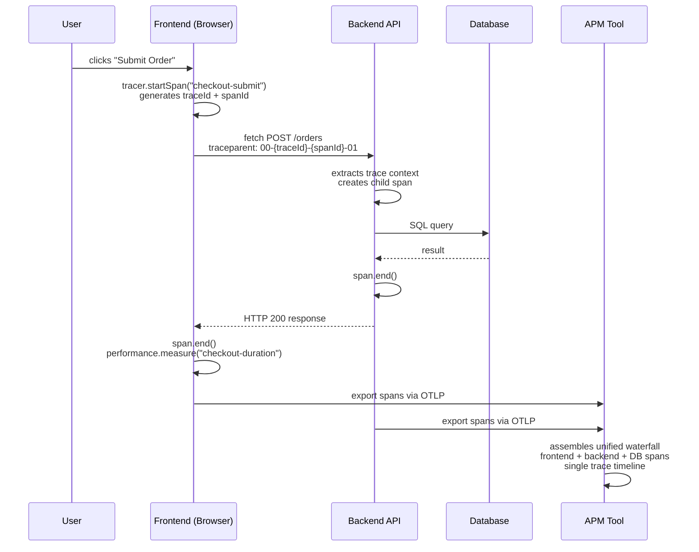

# Performance Monitoring & Tracing

## Context

A user clicks "Submit Order." Something is slow. Is the slowness in the JavaScript that processes the click? In the network round-trip? In the backend parsing the request? In the database query? In the response rendering? Without distributed tracing, the answer is "we don't know — let's add more logs and hope to reproduce it." With distributed tracing, the answer is a waterfall diagram showing every span from the user gesture to the final paint, with precise durations, across the entire system.

Frontend performance monitoring has historically operated in isolation. Real User Monitoring (RUM) tools capture browser-side metrics — Time to First Byte, Largest Contentful Paint, JavaScript execution time — but they stop at the network boundary. Backend APM tools capture server-side latency — API handler time, database query duration, downstream service calls — but they start when the request arrives at the server. The gap between "user clicked" and "request hit the server" — network queuing, DNS resolution, TLS handshake, connection establishment — was invisible to both.

**Distributed tracing** closes this gap. By propagating a trace context from the frontend into every outbound HTTP request (via the `traceparent` header), the frontend span and the backend span become part of the same logical trace. An APM tool can then display a unified waterfall: user click → frontend processing → network → backend handler → database query → response → browser rendering. Every phase is visible, measured, and attributable to a root cause.

**OpenTelemetry** is the CNCF-backed, vendor-neutral standard for distributed tracing, metrics, and logging. It provides a unified SDK (`@opentelemetry/sdk-web`, `@opentelemetry/auto-instrumentations-web`) that auto-instruments browser APIs (fetch, XHR, document load, page navigation) and exports traces to any compatible backend — Datadog APM, Honeycomb, Grafana Tempo, Jaeger — via the OpenTelemetry Protocol (OTLP). Adopting OpenTelemetry means instrumenting once and exporting anywhere.

Beyond distributed tracing, the browser exposes two underused APIs that complement tracing at the local level. The **Long Tasks API** (`PerformanceObserver` with `longtask` entry type) reports any task that blocks the main thread for more than 50 milliseconds. These tasks directly cause poor Interaction to Next Paint (INP) scores because the browser cannot respond to user input while a long task is running. The **User Timing API** (`performance.mark()` / `performance.measure()`) allows arbitrary custom timing marks to be placed in application code — marking the start and end of a checkout flow, a file upload, or any user interaction — and measured with millisecond precision. These marks are surfaced in browser DevTools and can be exported to an APM backend.

## Design Thinking

### Why OpenTelemetry is the right long-term bet

The frontend monitoring landscape is fragmented: Datadog RUM, New Relic Browser, Dynatrace, Honeycomb, Grafana Cloud, and dozens of others all provide proprietary browser SDKs. Adopting one means writing instrumentation code against that vendor's API. Switching vendors — or adding a second vendor for a subset of services — means re-instrumenting.

OpenTelemetry resolves this by providing a vendor-neutral instrumentation API. The `@opentelemetry/sdk-web` SDK creates and manages spans. The `OTLPTraceExporter` ships those spans to any OTLP-compatible backend. The exporter endpoint is the only configuration that changes when switching or adding vendors. Existing instrumentation code — every `tracer.startSpan()` call, every attribute, every `performance.mark()` integration — remains unchanged.

OpenTelemetry is backed by the Cloud Native Computing Foundation (CNCF) and has reached the "graduated" maturity level, which means it is production-stable and maintained by a broad coalition of contributors including Google, Microsoft, AWS, Datadog, and Honeycomb. Every major APM vendor either already supports OTLP ingestion natively or provides an OTLP-to-vendor pipeline. This is not a niche open-source project that might be abandoned — it is the emerging industry standard for observability instrumentation.

The practical implication: investing in OpenTelemetry instrumentation today compounds. Each span, each attribute, each custom timing mark becomes an asset that works with any future APM backend without re-instrumentation.

### Why distributed tracing across frontend and backend is transformative

A latency complaint arrives: "The checkout page is slow." Without distributed tracing, the investigation is fragmented. The frontend team looks at network waterfall in DevTools — the API call took 1.8 seconds. The backend team looks at their APM dashboard — the `POST /orders` handler took 200ms. The discrepancy is explained by... something. Network? TLS? A slow CDN? A retry? The investigation requires manual cross-referencing of timelines across two systems with no shared reference point.

With distributed tracing, a single trace ID is generated by the frontend at the moment of the user's click. That trace ID is propagated to the backend in the `traceparent` header. The backend creates a child span under the same trace. Database queries, downstream API calls, and async jobs all become child spans of the backend span. When the response returns, the frontend ends its span.

In the APM tool, a single timeline shows: frontend span (20ms processing before fetch) → network (340ms, including TLS) → backend handler (180ms) → database query (1.2s — the actual bottleneck) → response parsing (12ms) → React re-render (45ms). The bottleneck is the database query. The frontend team and backend team look at the same waterfall. The investigation takes minutes instead of days.

This cross-team, cross-system shared timeline is the defining value of distributed tracing. It is not possible with siloed monitoring tools.

### Why Long Tasks matter for INP

Interaction to Next Paint (INP) measures the time from a user interaction (click, key press, tap) to the next visual update. For INP to be fast, the browser must be able to respond to the interaction quickly. The browser cannot process user input while the main thread is occupied by a running JavaScript task.

Any JavaScript task that takes more than 50 milliseconds is classified as a **Long Task**. During a Long Task, user input is queued but not processed. A click that fires during a 200ms Long Task will not be responded to until the Long Task completes — resulting in a 200ms+ INP for that interaction, which is in the "needs improvement" or "poor" range.

Long Tasks are often invisible to developers. They do not throw errors. They do not show up in network waterfalls. They appear in Chrome DevTools Performance panel as red-marked tasks, but developers rarely profile production sessions. The `longtask` PerformanceObserver entry type is the programmatic equivalent: it fires in production, for real users, on real hardware, with the actual task duration. Monitoring Long Tasks in production provides a continuous signal for INP degradation risk — and, critically, timing information (when the long task occurred, in which frame) that can be correlated with other traces and user interaction events.

### Why `performance.mark()` is underused

`performance.mark()` places a named timestamp in the browser's performance timeline. `performance.measure()` creates a named duration between two marks. Both are native browser APIs — zero dependencies, zero overhead beyond the mark itself, available in all modern browsers.

The marks appear in Chrome DevTools Performance panel as labeled annotations on the timeline. They appear in Firefox Profiler. They can be read programmatically and included in traces or RUM payloads. They integrate with OpenTelemetry: the OpenTelemetry web SDK can read `PerformanceObserver` entries including User Timing marks and create spans from them.

The reason they are underused is that no automated tool can add them. A RUM SDK can auto-instrument `fetch` calls and page loads because those are standard browser APIs with observable events. A RUM SDK cannot know that the stretch of time between "user clicked the Submit button" and "the confirmation modal appeared" is semantically meaningful as "checkout submission latency." That semantic meaning exists only in the application code. `performance.mark('checkout-submit-start')` and `performance.mark('checkout-submit-end')` at the right places in the application code is the only way to capture that duration — and it costs nothing.

Teams that instrument key user interactions with `performance.mark()` gain timing data for their most important user journeys that no vendor-provided tooling can replicate. It is the highest-leverage, lowest-cost performance instrumentation technique available.

## Best Practices

**MUST always end spans in a `finally` block — never only in the happy path.** A span that is not ended is held in memory by the `BatchSpanProcessor` indefinitely and is never exported to the APM backend. In long-running applications, leaked spans accumulate and cause memory pressure. Teams MUST wrap every `tracer.startSpan()` call in a try/catch/finally where `span.end()` is called unconditionally in the `finally` block.

**MUST NOT expose OTLP collector credentials or API keys in the browser bundle.** Browser bundle contents are publicly readable. Teams MUST proxy OTLP trace exports through their own backend endpoint (e.g., a Next.js API route or Express handler) so the collector authentication key lives in a server-side environment variable, never in the client-side bundle.

**MUST restrict `traceparent` header propagation to your own API domains only.** Injecting the W3C trace context header into requests to third-party domains (Stripe, Google Analytics, payment processors) leaks your trace IDs to external parties and can trigger CORS preflight failures. Teams MUST configure `propagateTraceHeaderCorsUrls` with an explicit allowlist of first-party API origins.

**SHOULD initialize the OpenTelemetry `WebTracerProvider` as the very first import in the application entry point, before any framework setup.** Auto-instrumentation for `fetch` and XHR is registered at initialization time; any network requests that fire before initialization are not traced. Teams SHOULD export traces to an OTLP-compatible backend (Datadog, Honeycomb, Grafana Tempo) rather than a vendor-specific SDK to avoid lock-in.

**SHOULD instrument key user interactions with `performance.mark()` and `performance.measure()` to capture business-meaningful durations that auto-instrumentation cannot infer.** Auto-instrumentation captures fetch calls and page loads because they have observable browser events. It cannot know that the time between "user clicked Submit" and "confirmation modal appeared" is semantically a checkout submission latency. Teams SHOULD place marks at the start and end of every critical user journey and clear marks after reading to prevent memory growth in long sessions.

**SHOULD NOT rely solely on auto-instrumentation for observability coverage.** Auto-instrumentation captures `fetch` calls, page loads, and XHR requests because they have observable browser events. It cannot know that the stretch of time between "user clicked Submit" and "confirmation modal appeared" is semantically a checkout submission latency, or that a particular API call is an order creation rather than a generic POST. Teams SHOULD create manual spans for every business-critical user journey, naming them with intent (`checkout.submit`, `file.upload`, `search.query`) and annotating them with business entity IDs. Manual spans are the only mechanism by which semantic meaning that exists in application logic becomes visible in the APM waterfall.

**SHOULD attach span attributes for business context** — `user.id`, `order.id`, `session.id`, feature flag state — to every manual span. Span attributes are the structured metadata that allows engineers to filter traces by business dimension rather than by raw URL or HTTP status code. A span for `checkout.submit` with `order.id`, `cart.id`, and `user.id` attributes can be queried to find all failed checkouts for a specific cohort in seconds; the same span without attributes requires cross-referencing the raw trace with the application database. Teams MUST NOT include PII (email addresses, full names, payment card data) as span attributes.

**SHOULD observe Long Tasks with `PerformanceObserver` in production and report all tasks exceeding 50ms — not just those above 200ms.** Long Tasks directly cause poor INP: any task over 50ms is the specification-defined boundary beyond which user input is queued rather than processed. Teams SHOULD report long task duration and start time to the APM backend so they can be correlated with interaction traces; filtering out tasks below 200ms discards the common INP contributors in the 51–200ms range.

## Visual

### Distributed Trace: User Click to APM

The following diagram shows the complete path of a distributed trace from a user interaction in the browser to a unified waterfall in an APM tool. The `traceparent` header is the thread that connects frontend and backend spans into a single trace.



## Example

### 1. OpenTelemetry SDK Setup

Install the required packages:

```bash
npm install @opentelemetry/sdk-web \
  @opentelemetry/exporter-trace-otlp-http \
  @opentelemetry/sdk-trace-base \
  @opentelemetry/auto-instrumentations-web \
  @opentelemetry/instrumentation
```

Initialize the provider at application startup — before any user interactions are possible:

```ts
// src/lib/tracing.ts

import { WebTracerProvider } from '@opentelemetry/sdk-web'
import { OTLPTraceExporter } from '@opentelemetry/exporter-trace-otlp-http'
import { BatchSpanProcessor } from '@opentelemetry/sdk-trace-base'
import { getWebAutoInstrumentations } from '@opentelemetry/auto-instrumentations-web'
import { registerInstrumentations } from '@opentelemetry/instrumentation'

const exporter = new OTLPTraceExporter({
  // In production, proxy through your own backend to avoid exposing
  // the OTLP collector endpoint directly to the browser.
  url: '/api/otlp/v1/traces',
})

const provider = new WebTracerProvider()
provider.addSpanProcessor(new BatchSpanProcessor(exporter))
provider.register()

// Auto-instruments: fetch, XHR, document load, page navigation
registerInstrumentations({
  instrumentations: [
    getWebAutoInstrumentations({
      '@opentelemetry/instrumentation-fetch': {
        propagateTraceHeaderCorsUrls: [
          /https:\/\/api\.yourcompany\.com/,
        ],
      },
      '@opentelemetry/instrumentation-xml-http-request': {
        propagateTraceHeaderCorsUrls: [
          /https:\/\/api\.yourcompany\.com/,
        ],
      },
    }),
  ],
})

export const tracer = provider.getTracer('frontend-app', '1.0.0')
```

The `propagateTraceHeaderCorsUrls` option is critical: the SDK will only inject the `traceparent` header on requests to URLs matching the provided patterns. This prevents leaking trace context to third-party domains (CDNs, analytics, payment processors).

Call this module once, at the application entry point:

```ts
// src/main.ts
import './lib/tracing'   // must be first import
import { createApp } from 'vue'
import App from './App.vue'

createApp(App).mount('#app')
```

### 2. Manual Span Creation

Auto-instrumentation captures fetch calls and page loads. For business-meaningful operations — checkout flow, file upload, search interaction — create manual spans to capture semantic context:

```ts
// src/features/checkout/checkout.service.ts
import { tracer } from '@/lib/tracing'
import { SpanStatusCode } from '@opentelemetry/api'

export async function submitOrder(cartId: string, userId: string): Promise<OrderResult> {
  const span = tracer.startSpan('checkout.submit', {
    attributes: {
      'cart.id': cartId,
      'user.id': userId,           // opaque ID, not email
      'checkout.step': 'submit',
    },
  })

  try {
    const result = await fetch('/api/orders', {
      method: 'POST',
      headers: { 'Content-Type': 'application/json' },
      body: JSON.stringify({ cartId }),
      // traceparent is injected automatically by the fetch instrumentation
    })

    if (!result.ok) {
      span.setStatus({ code: SpanStatusCode.ERROR, message: `HTTP ${result.status}` })
      throw new Error(`Order submission failed: ${result.status}`)
    }

    const order = await result.json() as OrderResult
    span.setAttribute('order.id', order.id)
    span.setStatus({ code: SpanStatusCode.OK })
    return order
  } catch (err) {
    span.recordException(err as Error)
    span.setStatus({ code: SpanStatusCode.ERROR })
    throw err
  } finally {
    span.end()  // always end the span, even on error
  }
}
```

Key points:
- `span.end()` is in the `finally` block — a span that never ends will not be exported.
- Business context (`cart.id`, `order.id`) is added as span attributes — not PII.
- `span.recordException()` captures the error stack trace and associates it with the span.
- The child `fetch` span (created by auto-instrumentation) becomes a child of this manual span automatically, because OpenTelemetry propagates the active context.

### 3. `traceparent` Header and the W3C Trace Context

The `traceparent` header format is specified by the W3C Trace Context standard:

```
traceparent: 00-{traceId}-{parentSpanId}-{traceFlags}
```

Where:
- `00` — version (fixed at `00` in the current spec)
- `{traceId}` — 32 hex characters (128-bit trace ID), unique per user request
- `{parentSpanId}` — 16 hex characters (64-bit span ID), identifies the sending span
- `{traceFlags}` — 2 hex characters; `01` means "sampled" (tell the backend to record this trace)

A concrete example:

```
traceparent: 00-4bf92f3577b34da6a3ce929d0e0e4736-00f067aa0ba902b7-01
```

The `tracestate` header is the optional companion for vendor-specific extensions:

```
tracestate: dd=s:1;o:rum,honeycomb=...
```

When the OpenTelemetry fetch instrumentation injects `traceparent`, the backend SDK (OpenTelemetry Node.js, OpenTelemetry Java, etc.) automatically extracts the trace context and creates a child span. The `traceId` is the same on both sides — this is what allows the APM tool to assemble the unified waterfall.

### 4. `performance.mark()` and `performance.measure()`

Use the User Timing API to measure the duration of key user interactions. These marks are free, native, and surface in DevTools without any library:

```ts
// src/features/checkout/CheckoutForm.vue (Composition API)
import { tracer } from '@/lib/tracing'

async function handleSubmit() {
  performance.mark('checkout-submit-start')

  try {
    await submitOrder(cartId.value, userId.value)
    performance.mark('checkout-submit-end')
    performance.measure('checkout-submit-duration', 'checkout-submit-start', 'checkout-submit-end')
    const entries = performance.getEntriesByName('checkout-submit-duration', 'measure')
    const measure = entries.at(-1)
    if (measure) {
      console.log(`Checkout submit: ${measure.duration.toFixed(1)}ms`)
    }
    performance.clearMarks('checkout-submit-start')
    performance.clearMarks('checkout-submit-end')
    performance.clearMeasures('checkout-submit-duration')
  } catch (err) {
    performance.mark('checkout-submit-error')
    throw err
  }
}
```

For a reusable helper that both creates the span and the performance mark:

```ts
// src/lib/perf.ts

export function markAndMeasure(name: string, startMark: string, endMark: string): number {
  performance.measure(name, startMark, endMark)
  const entries = performance.getEntriesByName(name, 'measure')
  const duration = entries.at(-1)?.duration ?? 0
  // Clean up to avoid memory growth in long-running sessions
  performance.clearMeasures(name)
  performance.clearMarks(startMark)
  performance.clearMarks(endMark)
  return duration
}
```

### 5. Long Tasks API

Observe Long Tasks in production using `PerformanceObserver`. Report them to your APM backend alongside traces:

```ts
// src/lib/long-tasks.ts

export function observeLongTasks(onLongTask: (duration: number, startTime: number) => void): void {
  if (!('PerformanceObserver' in window)) return

  try {
    const observer = new PerformanceObserver((list) => {
      for (const entry of list.getEntries()) {
        if (entry.duration > 50) {
          onLongTask(entry.duration, entry.startTime)
        }
      }
    })

    // buffered: true captures long tasks that occurred before observer was registered
    observer.observe({ type: 'longtask', buffered: true })
  } catch {
    // longtask entry type not supported in this browser; silently skip
  }
}
```

Wire it into the application startup alongside the OpenTelemetry initialization:

```ts
// src/lib/tracing.ts (continued)

import { observeLongTasks } from './long-tasks'

observeLongTasks((duration, startTime) => {
  // Create a span for the long task so it appears in the trace waterfall
  const span = tracer.startSpan('browser.long-task', {
    startTime: performance.timeOrigin + startTime,
    attributes: {
      'long_task.duration_ms': Math.round(duration),
    },
  })
  span.end(performance.timeOrigin + startTime + duration)

  // Also report to a metrics endpoint for aggregation
  navigator.sendBeacon(
    '/api/metrics',
    new Blob(
      [JSON.stringify({ event: 'long_task', duration, startTime })],
      { type: 'application/json' }
    )
  )
})
```

Long tasks that exceed 100ms or 200ms are strong indicators of INP degradation and should trigger investigation into which JavaScript is running at that time.

### 6. Resource Timing: Detecting Slow CDN Assets

The Resource Timing API exposes load times for every resource fetched by the page. Use it to detect slow CDN assets in production:

```ts
// src/lib/resource-timing.ts

export function observeSlowResources(thresholdMs = 1000): void {
  if (!('PerformanceObserver' in window)) return

  const observer = new PerformanceObserver((list) => {
    for (const entry of list.getEntries()) {
      const resource = entry as PerformanceResourceTiming
      const duration = resource.responseEnd - resource.startTime

      if (duration > thresholdMs) {
        console.warn('[resource-timing] Slow asset:', resource.name, duration.toFixed(0) + 'ms')
        // Report to APM
        navigator.sendBeacon(
          '/api/metrics',
          new Blob(
            [JSON.stringify({
              event: 'slow_resource',
              url: resource.name,
              duration_ms: Math.round(duration),
              transferSize: resource.transferSize,
              initiatorType: resource.initiatorType,
            })],
            { type: 'application/json' }
          )
        )
      }
    }
  })

  observer.observe({ type: 'resource', buffered: true })
}
```

### 7. Navigation Timing

The Navigation Timing API provides detailed metrics for the current page load:

```ts
const [navEntry] = performance.getEntriesByType('navigation') as PerformanceNavigationTiming[]

if (navEntry) {
  const ttfb = navEntry.responseStart - navEntry.requestStart
  const domContentLoaded = navEntry.domContentLoadedEventEnd - navEntry.startTime
  const pageLoad = navEntry.loadEventEnd - navEntry.startTime

  console.log({
    ttfb: `${ttfb.toFixed(1)}ms`,           // Time to First Byte
    domContentLoaded: `${domContentLoaded.toFixed(1)}ms`,
    pageLoad: `${pageLoad.toFixed(1)}ms`,
    navigationType: navEntry.type,            // 'navigate' | 'reload' | 'back_forward' | 'prerender'
  })
}
```

Navigation Timing is automatically collected by `@opentelemetry/auto-instrumentations-web` when using the Document Load instrumentation. For manual access, `performance.getEntriesByType('navigation')` returns a single entry for the current page.

### 8. APM Backend Integration

#### Datadog APM

Datadog ingests OpenTelemetry traces natively via OTLP. Configure the exporter to point to the Datadog OTLP endpoint:

```ts
const exporter = new OTLPTraceExporter({
  url: 'https://otlp.datadoghq.com/v1/traces',  // US region OTLP endpoint
  headers: {
    'DD-API-KEY': import.meta.env.VITE_DD_API_KEY,
  },
})
```

In production, proxy OTLP through your own backend (a Next.js API route or Express endpoint) rather than exposing API keys in the browser bundle.

#### Honeycomb

```ts
const exporter = new OTLPTraceExporter({
  url: 'https://api.honeycomb.io/v1/traces',
  headers: {
    'x-honeycomb-team': import.meta.env.VITE_HONEYCOMB_API_KEY,
    'x-honeycomb-dataset': 'frontend',
  },
})
```

#### Grafana Tempo

Grafana Tempo accepts OTLP directly. Point the exporter at your Tempo OTLP endpoint and authenticate via a Grafana Cloud API key. The traces are then queryable in Grafana's Explore view and can be correlated with Loki log lines when both include the same `traceId`.

#### Jaeger

Jaeger supports OTLP ingestion starting with version 1.35. For local development:

```bash
docker run -p 4318:4318 -p 16686:16686 jaegertracing/all-in-one
```

Then set `url: 'http://localhost:4318/v1/traces'` in the exporter config. The Jaeger UI at `http://localhost:16686` shows all received traces.

## Common Mistakes

### Using `performance.mark()` without clearing old entries

```ts
// WRONG: marks accumulate across multiple calls; getEntriesByName returns all of them
performance.mark('upload-start')
await uploadFile(file)
performance.mark('upload-end')
performance.measure('upload-duration', 'upload-start', 'upload-end')
const entries = performance.getEntriesByName('upload-duration')
// entries may have 1 entry on first call, 2 on second call, etc.
const duration = entries[0].duration  // wrong — always returns the first (oldest) entry

// CORRECT: use entries.at(-1) for the most recent, or clear after reading
const duration = entries.at(-1)?.duration ?? 0
performance.clearMeasures('upload-duration')
performance.clearMarks('upload-start')
performance.clearMarks('upload-end')
```

### Not sampling traces in high-traffic applications

Exporting 100% of traces at production scale can be expensive. Configure head-based sampling on the `WebTracerProvider`:

```ts
import { TraceIdRatioBasedSampler } from '@opentelemetry/sdk-trace-base'

const provider = new WebTracerProvider({
  sampler: new TraceIdRatioBasedSampler(0.1),  // sample 10% of traces
})
```

Always sample traces that contain errors regardless of the ratio, which is achievable with a `ParentBasedSampler` or by using tail-based sampling in the collector.

## Related FEEs

- [FEE-1400: Observability & Error Tracking Overview](./1400.md) — Category context; tracing is the third pillar of frontend observability alongside error tracking and logging
- [FEE-1402: Core Web Vitals — INP and Long Tasks](./1402.md) — INP is directly caused by Long Tasks on the main thread; this article provides the instrumentation to detect Long Tasks in production
- [FEE-1403: Logging & Structured Logging](./1403.md) — Include `traceId` in every structured log record to enable log-to-trace correlation in your APM platform
- [FEE-1406: Alerting on Trace Data](./1406.md) — Defines alert thresholds on trace-derived metrics: p95 checkout latency, Long Task frequency, error rate by span name

## References

- [OpenTelemetry JavaScript — Web SDK](https://opentelemetry.io/docs/languages/js/getting-started/browser/)
- [W3C Trace Context specification](https://www.w3.org/TR/trace-context/)
- [Long Tasks API — MDN](https://developer.mozilla.org/en-US/docs/Web/API/PerformanceObserver/observe)
- [User Timing API — MDN](https://developer.mozilla.org/en-US/docs/Web/API/Performance/mark)
- [PerformanceObserver — MDN](https://developer.mozilla.org/en-US/docs/Web/API/PerformanceObserver)
- [Resource Timing API — MDN](https://developer.mozilla.org/en-US/docs/Web/API/PerformanceResourceTiming)
- [Datadog APM — OpenTelemetry ingestion](https://docs.datadoghq.com/tracing/trace_collection/opentelemetry/)
- [Honeycomb — OpenTelemetry for browsers](https://docs.honeycomb.io/send-data/javascript/browser-js/)
- [Grafana Tempo — OpenTelemetry](https://grafana.com/docs/tempo/latest/getting-started/tempo-in-grafana/)
- [Jaeger — OpenTelemetry support](https://www.jaegertracing.io/docs/latest/opentelemetry/)
- [CNCF OpenTelemetry — project page](https://www.cncf.io/projects/opentelemetry/)
- [Interaction to Next Paint (INP) — web.dev](https://web.dev/inp/)
