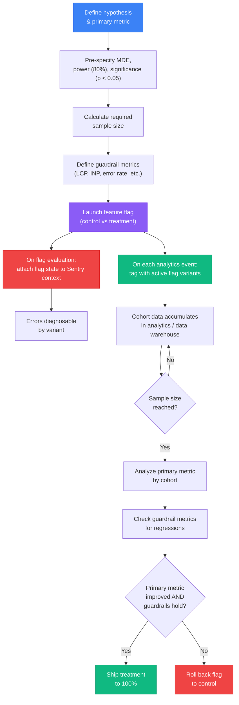

# Feature Flag Observability & A/B Testing

## Context

A production bug surfaces in Sentry. The stacktrace points to the new checkout flow. The on-call engineer spends two hours reproducing it locally — only to discover it does not happen for them. It only happens for users who were assigned to the `checkout-v2` treatment variant of a feature flag launched three days ago. The flag state was never attached to the error report. The investigation cost two hours that should have cost two minutes.

Feature flags and observability are deeply intertwined in any serious feature delivery pipeline. A flag is a branch in production code. Every branch is a potential site of failure. When an error occurs on a branched code path, the error report must carry the branch context — which variant the user was in — or the diagnosis is incomplete. Variant B might be completely stable for the 50% of users in the control group while systematically failing for the 50% of users in treatment. Without the flag state in the error event, the error's scope is invisible.

The same principle extends to product analytics. Feature flags are the mechanism by which A/B experiments are run: one variant sees the old behaviour, another sees the new. Measuring whether the new behaviour improved the metric it was designed to improve — conversion rate, session length, task completion time, Core Web Vitals — requires connecting the flag assignment to the event stream. Every tracked event must be tagged with which variant produced it, so the analysis can compare the treatment cohort against the control cohort on the same metric.

**A/B testing** — or more broadly, experimentation — provides the statistical framework for making this comparison rigorously. The intuitive approach (ship the experiment, look at the numbers after a week, decide if it worked) is unreliable. It is vulnerable to p-hacking: if you check results every day and stop the experiment the moment a metric crosses a threshold, the probability that the result is a false positive rises sharply above the nominal 5% significance threshold. A rigorous experiment pre-specifies a hypothesis, calculates the minimum sample size required to detect a meaningful effect with 80% power, runs the experiment until that sample size is reached, and only then evaluates the result.

**Guardrail metrics** complete the picture. An experiment that improves the primary metric — say, sign-up conversion rate — but regresses a guardrail metric — say, Largest Contentful Paint — is not a net win. Shipping it harms users whose experience degrades on the dimensions the primary metric does not capture. Every experiment needs a pre-defined set of guardrail metrics that must not regress beyond a tolerance threshold, regardless of what the primary metric shows.

The tooling landscape for this work has matured considerably. **PostHog** provides feature flags, product analytics, and session replay in a single open-source SDK — making it the lowest-friction starting point for teams that do not already have these systems in place. **GrowthBook** is open-source and designed to connect to existing data warehouses (BigQuery, Snowflake, Redshift), making it the right choice for teams whose analytics data already lives in a warehouse. **LaunchDarkly Experimentation** and **Statsig** are commercial platforms that provide enterprise-grade flag management, experimentation infrastructure, and statistical analysis out of the box.

## Design Thinking

### Why flag state in error context is not optional

Consider a simplified version of the production scenario from the Context section. A checkout flow is behind a flag. Variant A (control) uses the existing Stripe integration. Variant B (treatment) uses a new payment processor. An error occurs in the new payment processor's SDK — a null reference on a field the new processor returns in a different format than Stripe.

In Sentry, the error appears as a `TypeError: Cannot read properties of null` in `checkout.service.ts`. The stacktrace points to a specific line. The error is marked as high severity. The on-call engineer opens the event. Without the flag context, the event looks like a general checkout error — something that might affect any user. The engineer reproduces the checkout flow locally, using their own account, which is in the control variant. No error. The engineer marks it as "could not reproduce" and closes the ticket. The error continues affecting all treatment users.

With the flag context attached to the Sentry event — `flag.checkout-v2: treatment` as a tag, or a `feature_flags` context object listing all active flags — the engineer sees immediately that this error only occurs for users in the `treatment` variant of `checkout-v2`. The investigation narrows to the new payment processor SDK. The fix is deployed in under an hour.

This is why `Sentry.setContext('feature_flags', { flagName: variant })` or `Sentry.setTag('flag.checkout-v2', 'treatment')` must be called at flag evaluation time, not optionally added later. The performance cost is negligible. The diagnostic value is disproportionate.

### Why p-hacking destroys experiment validity

Suppose a team launches an experiment on a new onboarding flow. After three days, the conversion rate for the treatment variant is 12.3% versus 11.1% for control — a 10.8% relative improvement. The team stops the experiment and ships the treatment. Six months later, A/B test results from that product area consistently show much smaller effects than the initial experiments suggested. The team is confused.

What happened is p-hacking. The team checked results daily. On day three, the result crossed the p < 0.05 threshold and they stopped. But with daily checks, the probability that the result will cross the threshold at least once during a multi-week experiment — even if there is no real effect — is much higher than 5%. The "significant" result on day three was a false positive caused by variance in early data, not a real signal.

The correct approach is sequential: define the hypothesis and primary metric before launch, calculate the sample size required to detect the MDE with 80% power at p < 0.05, run the experiment until the pre-specified sample size is reached, and evaluate the result exactly once at that point. No early stopping. No peeking. The pre-specification of sample size is the mechanism that controls the false positive rate.

Tools like GrowthBook and Statsig implement sequential testing and always-valid p-values that allow for more frequent checks without inflating false positive rates — but these methods require configuration and understanding. The default for teams starting out is simpler: pick a sample size, wait for it, look once.

### Why PostHog is the default recommendation

A team starting from scratch faces a choice: assemble a stack from flag management (LaunchDarkly), product analytics (Mixpanel or Amplitude), and session replay (FullStory or LogRocket) separately — each with its own SDK, its own event schema, its own billing, and its own data model — or use PostHog, which provides all three in a single open-source SDK with a single event stream.

The single-SDK model has a concrete advantage for flag observability: PostHog automatically records which flags were active when each event was captured. There is no extra instrumentation step to tag events with flag variants. `posthog.capture('checkout-completed', { properties })` already knows which flags are active for the current user because the PostHog SDK manages flag state internally. The experiment cohort analysis is built-in.

PostHog is also self-hostable (AGPL license) for teams with data residency requirements, and offers a generous free tier on the managed cloud product. For teams that outgrow PostHog's statistical analysis capabilities or need to run experiments on data that already lives in a data warehouse, GrowthBook provides an open-source migration path without requiring a re-instrumentation of the event stream.

### Why guardrail metrics matter

An experiment improves the sign-up conversion rate from 8% to 9.5% — a statistically significant 18.75% relative improvement. The product team is thrilled. The experiment ships. Two weeks later, the performance monitoring dashboard shows that LCP for the sign-up page has regressed from 1.8s to 3.1s. Core Web Vitals scores fall from "Good" to "Needs Improvement." Organic search traffic drops because Google's Core Web Vitals signals have worsened. The net business impact of the "winning" experiment is negative.

This is the guardrail metric failure mode. The new sign-up flow — perhaps a richer hero section or a heavier animation — improved the conversion metric the experiment was designed to measure while silently degrading performance. Because LCP was not pre-specified as a guardrail, no one checked it during the experiment. By the time the regression was noticed, the feature had shipped to 100% of users.

Guardrail metrics operationalize the principle that an experiment is only a win if it improves the primary metric without significantly harming any guardrail. The guardrails are pre-specified before launch — LCP, INP, Cumulative Layout Shift, JavaScript error rate, API error rate — with explicit tolerance thresholds (e.g., "LCP must not increase by more than 100ms in the treatment cohort"). If any guardrail is breached, the experiment is blocked from shipping regardless of the primary metric result.

## Best Practices

**MUST attach active feature flag state to the Sentry error scope before executing any variant-specific code.** If the flag context is set after the variant renders, any error thrown during rendering will not carry the flag tag and the investigation will require manual reproduction. Teams MUST call `Sentry.setTag('flag.flagName', variant)` or `Sentry.setContext('feature_flags', flagMap)` at the point of flag evaluation, before branching on the variant value.

**MUST pre-specify the experiment hypothesis, primary metric, Minimum Detectable Effect, and required sample size before launching the feature flag.** Evaluating results before the pre-specified sample size is reached inflates the false positive rate well above the nominal 5% significance threshold (p-hacking). Teams MUST document these parameters in a shared experiment brief and MUST NOT stop an experiment early because results look favorable — only evaluate once at the pre-specified sample size.

**MUST define guardrail metrics — including p75 LCP and p75 INP — for every A/B experiment before launch, not after observing results.** An experiment that improves the primary conversion metric while regressing LCP by 1.3 seconds is not a net win; it harms users on the dimensions the primary metric does not capture. Teams MUST treat guardrail breaches as blockers: an experiment that ships despite a breached guardrail establishes a precedent that guardrails are optional, which renders them meaningless.

**SHOULD tag every analytics event with all active feature flag variants at the time the event is captured.** Without per-event flag tagging, A/B experiment analysis cannot split cohorts and compare treatment against control on the same metric. Teams using PostHog benefit from automatic flag tagging on every captured event; teams using other analytics platforms SHOULD add flag properties explicitly to each event call.

**SHOULD use a stable, unique flag key per experiment — never reuse a flag key across sequential experiments.** Users who participated in an earlier experiment under the same key have historical events with the old flag assignment attached. Reusing the key contaminates cohort membership for the new experiment. Teams SHOULD use descriptive, versioned flag keys (e.g., `checkout-redesign-2026-q2`) and retire keys when the experiment concludes.

**SHOULD persist flag assignments for returning users using a stable session or user identifier.** A user who sees the control variant on Monday and the treatment variant on Tuesday contributes polluted data to both cohorts and experiences inconsistent UI. Teams SHOULD use a flag management SDK that handles persistence automatically (PostHog via `localStorage+cookie`) or assign a stable UUID on first visit and persist it across sessions.

## Visual

### Experiment Lifecycle

The following diagram shows the full lifecycle of a feature flag experiment, from hypothesis definition to the ship-or-roll-back decision. The flag state feeds into both the error tracking pipeline (Sentry context) and the analytics pipeline (event properties), enabling both bug diagnosis and statistical analysis.



## Example

### 1. PostHog Setup and Flag Evaluation

Install the PostHog SDK:

```bash
npm install posthog-js
```

Initialize PostHog at application startup, before any flags are evaluated or events are captured:

```ts
// src/lib/posthog.ts
import posthog from 'posthog-js'

posthog.init('<your-project-api-key>', {
  api_host: 'https://us.i.posthog.com',
  // Automatically capture pageviews, clicks, and form submissions
  autocapture: true,
  // Persist flag assignments across page loads (uses localStorage)
  persistence: 'localStorage+cookie',
})

export { posthog }
```

Evaluate a flag and use its variant:

```ts
// src/features/checkout/checkout.service.ts
import { posthog } from '@/lib/posthog'

export function getCheckoutVariant(): string | boolean {
  // Returns the variant string ('control' | 'treatment') or boolean for simple flags
  return posthog.getFeatureFlag('checkout-v2') ?? 'control'
}

export function isNewCheckoutEnabled(): boolean {
  return posthog.isFeatureEnabled('checkout-v2') === true
}
```

Capture an analytics event tagged with active flag state:

```ts
// PostHog automatically includes all active flags in every captured event.
// For explicit control, pass flag values as properties:

posthog.capture('checkout-completed', {
  cartTotal: cart.total,
  itemCount: cart.items.length,
  checkoutVariant: posthog.getFeatureFlag('checkout-v2'),
  paymentMethod: cart.paymentMethod,
})
```

### 2. Attaching Flag State to Sentry Error Context

Call this function at flag evaluation time, before rendering or executing any variant-specific code. This ensures the flag state is in the Sentry scope for any subsequent error:

```ts
// src/lib/flagObservability.ts
import * as Sentry from '@sentry/browser'
import { posthog } from './posthog'

/**
 * Attaches all active PostHog feature flags to the current Sentry scope.
 * Call this once after the user is identified and flags are loaded.
 */
export function attachFlagsToSentry(): void {
  // posthog.getActiveFeatureFlags() returns an array of flag keys
  const activeFlags = posthog.getActiveFeatureFlags() ?? []

  const flagContext: Record<string, string | boolean> = {}
  for (const flagKey of activeFlags) {
    const variant = posthog.getFeatureFlag(flagKey)
    if (variant !== undefined) {
      flagContext[flagKey] = variant
    }
  }

  // Set as Sentry context — visible in the "Additional Data" section of each event
  Sentry.setContext('feature_flags', flagContext)

  // Also set individual tags for fast filtering in Sentry's issue search
  // e.g., search for: flag.checkout-v2:treatment
  for (const [key, value] of Object.entries(flagContext)) {
    Sentry.setTag(`flag.${key}`, String(value))
  }
}
```

Wire this into the application startup after the user is identified:

```ts
// src/auth/authService.ts
import * as Sentry from '@sentry/browser'
import { posthog } from '@/lib/posthog'
import { attachFlagsToSentry } from '@/lib/flagObservability'

export async function onLoginSuccess(user: User): Promise<void> {
  // 1. Identify the user in both Sentry and PostHog
  Sentry.setUser({ id: user.id, email: user.email })
  posthog.identify(user.id, { email: user.email, plan: user.plan })

  // 2. Wait for PostHog to load flag decisions for this user
  await new Promise<void>((resolve) => posthog.onFeatureFlags(() => resolve()))

  // 3. Attach flags to Sentry scope
  attachFlagsToSentry()
}
```

For a specific flag evaluated at runtime (e.g., when the user first reaches the checkout page), update the Sentry context at that point:

```ts
// src/features/checkout/CheckoutPage.vue
import { onMounted } from 'vue'
import { posthog } from '@/lib/posthog'
import * as Sentry from '@sentry/browser'

onMounted(() => {
  const checkoutVariant = posthog.getFeatureFlag('checkout-v2') ?? 'control'

  // Update Sentry tag at the point of evaluation
  Sentry.setTag('flag.checkout-v2', String(checkoutVariant))

  // Render the appropriate variant
  if (checkoutVariant === 'treatment') {
    renderNewCheckout()
  } else {
    renderLegacyCheckout()
  }
})
```

### 3. GrowthBook Integration

GrowthBook is the right choice for teams whose analytics data already lives in BigQuery, Snowflake, Redshift, or another data warehouse. GrowthBook reads experiment results from the warehouse directly, using SQL-defined metrics, rather than requiring all events to flow through a proprietary analytics platform.

```bash
npm install @growthbook/growthbook
```

```ts
// src/lib/growthbook.ts
import { GrowthBook } from '@growthbook/growthbook'
import * as Sentry from '@sentry/browser'

export const gb = new GrowthBook({
  apiHost: 'https://cdn.growthbook.io',
  clientKey: import.meta.env.VITE_GROWTHBOOK_CLIENT_KEY,
  // Called when flag assignments are determined — use to attach to Sentry
  onFeatureUsage(featureKey, result) {
    Sentry.setTag(`flag.${featureKey}`, String(result.value))
  },
  // Enable dev mode for QA overrides in non-production environments
  enableDevMode: import.meta.env.DEV,
})

// Load features from the GrowthBook CDN
await gb.init({ timeout: 2000 })

// Set user attributes for targeting and experiment assignment
gb.setAttributes({
  id: user.id,
  country: user.country,
  plan: user.plan,
  deviceType: navigator.userAgent.includes('Mobile') ? 'mobile' : 'desktop',
})
```

Evaluate flags with GrowthBook:

```ts
// Boolean flag
const isNewDashboardEnabled = gb.isOn('new-dashboard')

// Multivariate flag (returns the feature value, or the default if not assigned)
const checkoutVariant = gb.getFeatureValue('checkout-variant', 'control')
// checkoutVariant: 'control' | 'treatment-a' | 'treatment-b'
```

### 4. Sample Size Calculation Before Launch

Before launching an experiment, calculate the required sample size using the following inputs:

- **Baseline conversion rate**: the current rate of the primary metric (e.g., 8% checkout completion)
- **MDE (Minimum Detectable Effect)**: the smallest improvement worth detecting (e.g., 1 percentage point absolute, meaning 8% to 9%)
- **Statistical power**: 80% (standard) — the probability of detecting a real effect if one exists
- **Significance threshold**: p < 0.05 (5% false positive rate)

A standard formula for two-proportion z-test sample size per variant:

```ts
// src/lib/sampleSize.ts

/**
 * Calculates the required sample size per variant for a two-proportion z-test.
 *
 * @param baselineRate   - current conversion rate (e.g., 0.08 for 8%)
 * @param mde            - minimum detectable effect as absolute change (e.g., 0.01 for 1pp)
 * @param power          - desired statistical power (default: 0.80)
 * @param alpha          - significance level (default: 0.05, two-tailed)
 * @returns              - required sample size per variant (integer)
 */
export function calculateSampleSize(
  baselineRate: number,
  mde: number,
  power = 0.80,
  alpha = 0.05
): number {
  const treatmentRate = baselineRate + mde
  const pooledRate = (baselineRate + treatmentRate) / 2

  // z-scores for alpha/2 (two-tailed) and power
  // z_alpha_2 for alpha=0.05: 1.96
  // z_power for power=0.80: 0.842
  const zAlpha2 = 1.96   // for alpha = 0.05, two-tailed
  const zPower = 0.842   // for power = 0.80

  const numerator =
    Math.pow(zAlpha2 * Math.sqrt(2 * pooledRate * (1 - pooledRate)) +
      zPower * Math.sqrt(baselineRate * (1 - baselineRate) + treatmentRate * (1 - treatmentRate)), 2)

  const denominator = Math.pow(mde, 2)

  return Math.ceil(numerator / denominator)
}

// Example usage:
// calculateSampleSize(0.08, 0.01) => ~3,474 users per variant (6,948 total)
// Run the experiment until each variant has at least 3,474 users, then evaluate once.
```

Document the pre-specified parameters in a shared experiment brief before launch. This brief is the contractual agreement that prevents early stopping.

### 5. Guardrail Metric Monitoring with PostHog and Core Web Vitals

Capture Core Web Vitals as PostHog events so they can be split by flag variant in the experiment analysis:

```ts
// src/lib/webVitals.ts
import { onLCP, onINP, onCLS, onFCP, onTTFB } from 'web-vitals'
import { posthog } from './posthog'

function reportVital(name: string, value: number, rating: string): void {
  posthog.capture('web_vital', {
    metric: name,
    value: Math.round(name === 'CLS' ? value * 1000 : value),
    rating,
    // PostHog automatically attaches active flag variants to this event
    // so the experiment analysis can compare LCP per variant
    url: window.location.pathname,
  })
}

onLCP(({ name, value, rating }) => reportVital(name, value, rating))
onINP(({ name, value, rating }) => reportVital(name, value, rating))
onCLS(({ name, value, rating }) => reportVital(name, value, rating))
onFCP(({ name, value, rating }) => reportVital(name, value, rating))
onTTFB(({ name, value, rating }) => reportVital(name, value, rating))
```

Install the `web-vitals` package:

```bash
npm install web-vitals
```

After the experiment runs and the sample size is reached, query PostHog (or your data warehouse) for the `web_vital` events split by the `checkout-v2` flag variant:

```sql
-- Example: compare median LCP for control vs treatment
SELECT
  properties ->> 'flag.checkout-v2' AS variant,
  percentile_cont(0.50) WITHIN GROUP (ORDER BY (properties ->> 'value')::int) AS p50_lcp,
  percentile_cont(0.75) WITHIN GROUP (ORDER BY (properties ->> 'value')::int) AS p75_lcp,
  COUNT(*) AS sample_count
FROM events
WHERE
  event = 'web_vital'
  AND properties ->> 'metric' = 'LCP'
  AND timestamp BETWEEN '2026-03-01' AND '2026-03-21'
GROUP BY variant
```

If the treatment variant shows a p75 LCP more than 100ms higher than control, the guardrail is breached — even if the primary conversion metric improved.

### 6. Statsig for Enterprise Experimentation

Statsig provides a managed experimentation platform with built-in sequential testing and Bayesian analysis. Initialize Statsig alongside your other observability tools:

```ts
import StatsigClient from 'statsig-js'

await StatsigClient.initialize('<client-sdk-key>', {
  userID: user.id,
  email: user.email,
  custom: { plan: user.plan },
})

// Evaluate an experiment
const experiment = StatsigClient.getExperiment('checkout_experiment')
const checkoutVariant = experiment.get('variant', 'control')

// Log an event (Statsig records which experiment group this user is in)
StatsigClient.logEvent('checkout_completed', cart.total, {
  paymentMethod: cart.paymentMethod,
})

// Attach to Sentry
Sentry.setTag('flag.checkout-experiment', checkoutVariant)
```

Statsig's console shows experiment results with confidence intervals, sequential testing p-values, and automatic guardrail metric tracking if configured in the Statsig dashboard.

## Related FEEs

- [FEE-1400: Observability & Error Tracking Overview](./1400.md) — Category context; feature flag observability is a cross-cutting concern across all three pillars
- [FEE-1401: Error Tracking with Sentry](./1401.md) — The Sentry context and tag APIs used to attach flag state to error events
- [FEE-1402: Core Web Vitals](./1402.md) — LCP and INP as guardrail metrics for every A/B experiment
- [FEE-1407: Session Replay & Production Debugging](./1407.md) — Flag state visible in replay context; verbose remote debug logging for specific users gated by feature flags
- [FEE-1505: Feature Flags in Deployment](../CI%20CD%20and%20Deployment/1505.md) — Progressive rollouts, canary releases, and the deployment lifecycle that feature flags enable

## References

- [PostHog JavaScript SDK](https://posthog.com/docs/libraries/js)
- [PostHog Feature Flags documentation](https://posthog.com/docs/feature-flags)
- [GrowthBook JavaScript SDK](https://docs.growthbook.io/lib/js)
- [GrowthBook — connecting to data warehouses](https://docs.growthbook.io/warehouses)
- [LaunchDarkly Experimentation](https://launchdarkly.com/how-it-works/experimentation/)
- [Statsig — JavaScript SDK](https://docs.statsig.com/client/javascript-sdk)
- [Sentry setContext documentation](https://docs.sentry.io/platforms/javascript/configuration/apis/)
- [Sentry setTag documentation](https://docs.sentry.io/platforms/javascript/enriching-events/tags/)
- [web-vitals npm package](https://www.npmjs.com/package/web-vitals)
- [Google — Statistical significance in A/B testing](https://support.google.com/analytics/answer/2695010)
- [Evan Miller — Sample Size Calculator](https://www.evanmiller.org/ab-testing/sample-size.html)
- [Netflix Tech Blog — Experimentation Platform](https://netflixtechblog.com/it-is-all-a-bout-testing-the-netflix-experimentation-platform-4e1ca458c15b)
- [Microsoft — The dangers of peeking in A/B tests](https://www.microsoft.com/en-us/research/group/experimentation-platform-exp/)
