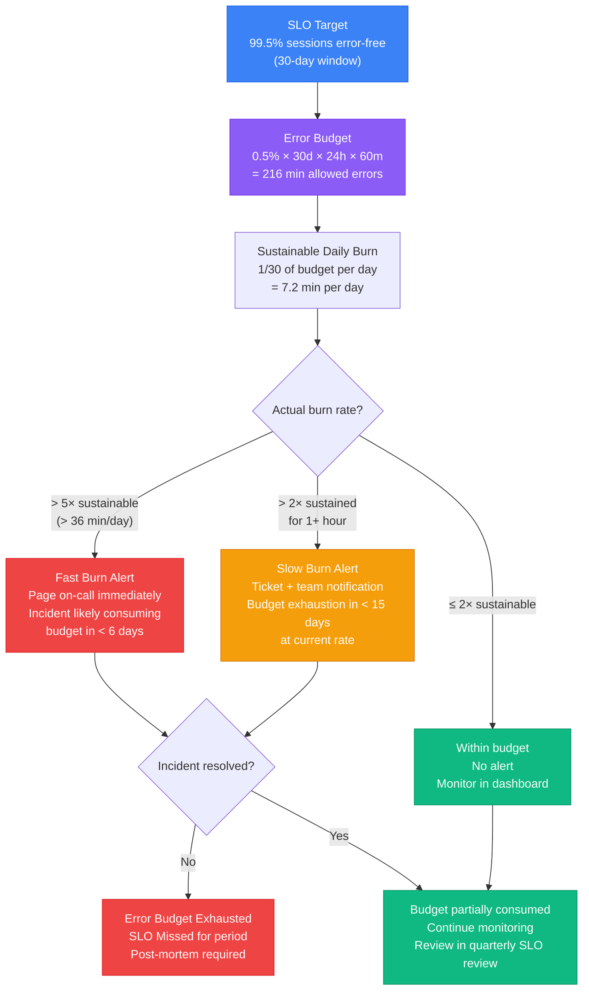

# Alerting, Dashboards & SLOs

## Context

An observability system that nobody acts on is a logging system with extra steps. Metrics flow in, dashboards accumulate panels, Sentry captures thousands of errors per day — and engineers stop looking because the volume is overwhelming or because every alert they respond to turns out to be noise. The highest-impact observability failure mode is not missing data; it is alert fatigue: the gradual erosion of trust in the alerting system until engineers learn to ignore it. The one alert that actually mattered gets ignored too.

Turning observability data into a system engineers trust and act on requires three interlocking pieces. First, **well-designed alerts** that fire on conditions that reliably indicate user harm, not on conditions that fluctuate naturally with traffic. Second, **SLOs (Service Level Objectives)** that frame the conversation around measurable user outcomes — error budgets and burn rates — rather than vague uptime targets. Third, **dashboards** designed around the question "what does the on-call engineer need to know right now?" rather than "what data do we have access to?"

The distinction between **error rate** and **raw error count** is foundational. An application that handles 10,000 requests per hour and produces 100 errors has a 1% error rate. The same application during a traffic spike handling 100,000 requests per hour and producing 1,000 errors has only a 1% error rate — the same. Alerting on raw count would fire on the second scenario even though the application is performing identically. Conversely, if traffic drops to 1,000 requests per hour and errors remain at 100, the error rate is 10% — a serious regression — but the raw count has not increased. Alerting on rate normalizes for traffic volume; alerting on count does not.

**SLOs for frontend** define the measurable quality bar for user experience in terms that engineers can operationalize. A typical frontend SLO set: 99.5% of page loads error-free (the error budget is 0.5% of sessions), p75 LCP under 2.5 seconds, p75 INP under 200 milliseconds. These targets are not aspirational — they map directly to what users experience as "the app is working." When SLOs are tracked with error budgets and burn rates, the alerting problem transforms: instead of asking "is this metric above threshold?", the question becomes "are we consuming our error budget faster than sustainable?"

**Error budget burn rate** is the rate at which the error budget is being consumed relative to the sustainable rate. Over 30 days, a 99.5% availability SLO allows 0.5% * 30 * 24 * 60 = 216 minutes of allowed downtime or error-level degradation. Burning the full 216 minutes in 6 days is a burn rate of 5x (the sustainable rate of 1/30 per day). A fast burn alert at >5x catches incidents that will exhaust the error budget imminently. A slow burn alert at >2x sustained catches chronic degradation that will exhaust the budget before the month ends without triggering a fast burn.

**Runbooks** close the loop between alerting and response. An alert that fires at 3am is only useful if the on-call engineer knows what to do. Without a runbook, the engineer reconstructs the response procedure from scratch under pressure every time. A runbook linked directly from the alert — as a URL in the alert annotation — specifies: what the alert means, what metrics to check first, what actions to take (rollback, scale, notify), and what escalation path to follow if the first actions do not resolve it.

## Design Thinking

### Why error rate beats raw error count for alerting

Consider two scenarios on the same application. On a typical Tuesday, the app serves 5,000 sessions per hour and produces 25 JavaScript errors — a 0.5% error rate. During a marketing campaign on Saturday, the app serves 50,000 sessions per hour and produces 250 JavaScript errors — still a 0.5% error rate. If alerting is configured on raw count with a threshold of 50 errors per hour, the Saturday campaign triggers a page to the on-call engineer at 2am. The engineer investigates, finds a 0.5% error rate identical to normal operation, and goes back to sleep. They also stop trusting the alert.

Now suppose on Wednesday morning a deployment introduces a bug. Sessions remain at 5,000 per hour but errors rise to 500 — a 10% error rate. The raw count alert at threshold 50 fires immediately. But so does every high-traffic event. The on-call engineer, conditioned by months of false positives, delays investigating. This is alert fatigue causing real harm.

With a rate-based alert at threshold 2% error rate, the Saturday campaign produces no alert (0.5% error rate, well under threshold). The Wednesday deployment triggers an alert immediately at 10% error rate. The correlation between "alert fired" and "something is actually wrong" is much higher. Engineers respond faster because they have learned the alert is trustworthy.

The practical implication: use PromQL ratios in Grafana, Sentry's "Error rate" alert type, or Datadog's error rate monitors. Never configure raw count thresholds as the primary alert condition for error events.

### Why SLOs are better than uptime targets

"Five nines" (99.999% uptime) is a popular target but a poor operational tool. It says nothing about user experience. An application with perfect uptime that renders a blank screen for 30% of users (due to a JavaScript error that does not trigger a health check failure) meets the uptime target while producing a terrible user experience.

SLOs are outcome-based. "99.5% of page loads complete without a JavaScript error" measures what users actually experience. "p75 LCP under 2.5s" measures whether the page feels fast for most users. "p75 INP under 200ms" measures whether interactions feel responsive. These targets are tied to the Core Web Vitals thresholds Google uses to define "Good" performance — they are calibrated to real user perception, not to server health.

Error budgets make SLOs operationally useful. A 99.5% error-free SLO over 30 days means 0.5% of sessions may have errors — that is 216 minutes of equivalent downtime allowed. With an error budget, teams can answer: "How much of our budget have we used this month? Are we burning it faster than sustainable? Can we ship this risky deployment, or have we burned enough budget already that we need to hold until next month?" These are decision-relevant questions. "Is our uptime above 99.999%?" is not.

### Why alert fatigue is the biggest observability failure mode

Alert fatigue follows a predictable trajectory. A team sets up observability for the first time and creates alerts on everything that seems important: error count > 100, p95 latency > 2s, CPU usage > 80%, memory > 70%, request rate spike > 2x, JavaScript error count > 50. For the first week, they respond to every alert. By the third week, most alerts are firing regularly for benign reasons (traffic spikes, scheduled jobs, routine variance). Engineers start snoozing alerts. By the second month, the on-call rotation has implicit knowledge of which alerts to ignore. Three months later, a real incident fires the same alerts that have been routinely ignored, and it takes two hours to notice.

The solution is not better tooling — it is ruthless pruning. Every alert should answer yes to both questions: (1) Does this condition reliably indicate user harm? (2) Does this condition require immediate action by a human? If the answer to either is "sometimes" or "it depends," the alert should be tuned or removed. A quarterly review process forces the question: "In the past 90 days, how many times did this alert fire, and how many times did it require action?" Alerts that fire frequently but require action rarely are false positives and should be deleted or converted to dashboard panels for reference monitoring.

### Why runbooks are essential

The value of a runbook is proportional to the time pressure under which it is used. An alert that fires during business hours, for a non-urgent condition, in a familiar system, is manageable without documentation — the engineer can investigate at their own pace. An alert that fires at 3am, for an unfamiliar component, by a new team member who joined two months ago, is a different situation entirely.

Without a runbook, the response is: open the dashboard, try to understand what the alert means, search Slack history for previous incidents, ping the person who wrote the system, wait for a response. With a runbook, the response is: click the runbook link in the alert, follow the diagnostic steps, take the documented action, confirm resolution.

Runbooks also encode institutional knowledge. The first time an incident is resolved, the resolution steps are in someone's head. A runbook captures those steps before the next incident. Teams that maintain runbooks find that incident resolution time decreases with each runbook iteration because each resolution adds to the documented procedure.

Every Grafana alert panel, every Sentry alert rule, every Datadog monitor should include a `runbook_url` annotation pointing to the runbook for that specific alert condition.

## Best Practices

**MUST alert on error rate (%) rather than raw error count.** A raw error count threshold fires on every traffic spike regardless of whether the application is actually broken; the same 0.5% error rate produces 25 errors at 5K sessions/hour and 250 errors at 50K sessions/hour. Teams MUST use PromQL ratios in Grafana, Sentry's error-rate alert type, or Datadog error rate monitors as the primary alert condition — never a raw event count threshold.

**MUST link every alert rule to a runbook URL in the alert annotation before enabling it in production.** An alert without a runbook delegates documentation to the on-call engineer at the worst possible moment — 3am, for an unfamiliar component. Teams MUST include a `runbook_url` annotation on every Grafana alert panel, every Sentry alert rule, and every Datadog monitor; a draft runbook with the three most likely causes is far better than none.

**SHOULD define frontend SLOs covering error rate, p75 LCP, and p75 INP, and track error budget burn rate rather than point-in-time threshold violations.** An SLO of 99.5% error-free sessions over 30 days yields an error budget of 216 minutes; burn-rate alerts on this budget (fast burn >5x, slow burn >2x sustained) catch both acute incidents and chronic degradation. Teams SHOULD express SLOs in terms of user outcomes — page loads completing without a JavaScript error, interactions feeling responsive — not server health metrics like uptime or CPU.

**SHOULD configure both fast-burn and slow-burn alert windows for every SLO error budget.** A single short-window burn rate alert (e.g., 1-hour rate > 5x) produces false positives during brief traffic spikes. Teams SHOULD require both the short and long windows to exceed the threshold simultaneously (e.g., 1-hour AND 5-minute rate > 5x for fast burn; 6-hour AND 30-minute rate > 2x for slow burn) to dramatically reduce false positive rates.

**SHOULD conduct a quarterly alert review and remove or tune any alert that fires more than once per week without requiring action.** Alert fatigue follows a predictable trajectory: teams create alerts for everything, start ignoring noisy ones, and eventually miss the alert that mattered. Teams SHOULD track fire frequency and action rate per alert over the previous 90 days and delete any alert with an action rate below 25%.

**SHOULD NOT create alerts for metrics that do not directly indicate user harm or require immediate human action.** CPU usage, memory percentage, and request rate spikes are context — not actionable signals for the frontend on-call rotation. Teams SHOULD convert non-actionable metrics to dashboard reference panels rather than paging alerts, and SHOULD design dashboards to answer "what does the on-call engineer need to know right now?" rather than "what data is available?"

## Visual

### SLO Error Budget Burn Rate Flow

The following diagram shows how an error budget flows from the monthly SLO target through daily burn rate monitoring to fast and slow burn alerts, and ultimately to SLO compliance or failure.



## Example

### 1. Sentry Alert Configuration (Error Rate)

In Sentry, create an alert rule that fires on error rate rather than raw error count. Navigate to Alerts > Create Alert Rule > Issues. Under "Alert Conditions," select "Error rate" as the metric type.

For a production environment with typical traffic, a practical starting configuration:

```
Alert Rule: Frontend Error Rate - Critical
Environment: production
Metric: Error rate
Threshold: Error rate > 2% over 10 minutes
Action: Notify #alerts-critical (Slack), Page on-call (PagerDuty)
Runbook URL: https://wiki.example.com/runbooks/frontend-error-rate-critical

Alert Rule: Frontend Error Rate - Warning
Environment: production
Metric: Error rate
Threshold: Error rate > 0.5% over 30 minutes
Action: Notify #alerts-warning (Slack)
Runbook URL: https://wiki.example.com/runbooks/frontend-error-rate-warning
```

For performance alerts in Sentry Performance monitoring, set thresholds on p75 LCP and p75 INP:

```
Alert Rule: LCP Regression - Warning
Metric: p75 LCP
Threshold: p75 LCP > 2500ms over 15 minutes
Filters: Transaction = page-load
Action: Notify #performance-alerts (Slack)
Runbook URL: https://wiki.example.com/runbooks/lcp-regression
```

### 2. Grafana Alert Rule (PromQL — Error Rate)

In Grafana, alert rules are defined with PromQL queries. The following rule fires when the 5-minute error rate for JavaScript errors exceeds 2%:

```yaml
# Simplified alert rule structure for illustration.
# Production Grafana Unified Alerting exports require datasourceUid,
# model wrapper objects, and $A/$B prefix in math expressions.
# Use Grafana UI to generate and export production-ready alert YAML.
# Grafana alert rule definition (YAML export format)
apiVersion: 1
groups:
  - orgId: 1
    name: Frontend SLO Alerts
    folder: Frontend
    interval: 1m
    rules:
      - uid: frontend-error-rate-critical
        title: Frontend JavaScript Error Rate Critical
        condition: C
        data:
          - refId: A
            # Error events per 5 minutes
            expr: sum(rate(frontend_js_errors_total[5m]))
          - refId: B
            # Total page loads per 5 minutes
            expr: sum(rate(frontend_page_loads_total[5m]))
          - refId: C
            # Error rate as percentage
            expr: (A / B) * 100
        noDataState: NoData
        execErrState: Error
        for: 10m
        annotations:
          summary: "Frontend error rate {{ $value | printf \"%.2f\" }}% exceeds 2% threshold"
          runbook_url: "https://wiki.example.com/runbooks/frontend-error-rate-critical"
          description: "Error rate has been above 2% for 10 minutes. Check Sentry for the leading error types."
        labels:
          severity: critical
          team: frontend
        isPaused: false
```

For an HTTP API error rate alert using standard Prometheus metrics:

```promql
# Error rate for API calls from the frontend (5xx responses)
rate(http_requests_total{status=~"5..", service="frontend-api"}[5m])
/
rate(http_requests_total{service="frontend-api"}[5m])
```

This ratio returns a value between 0 and 1. Multiply by 100 for percentage. Alert when this exceeds 0.02 (2%).

### 3. SLO Error Budget Tracking in Grafana

Define an SLO panel in a Grafana dashboard that shows error budget remaining for the current calendar month:

```promql
# Error budget remaining (%) for 99.5% session error-free SLO
# Assumes frontend_sessions_total and frontend_sessions_with_errors_total counters

# Current error rate for the month-to-date window
(
  increase(frontend_sessions_with_errors_total[30d])
  /
  increase(frontend_sessions_total[30d])
) * 100
```

Display this as a Stat panel with thresholds:
- Green: below 0.25% (more than half budget remaining)
- Yellow: 0.25% – 0.45% (budget being consumed, within normal range)
- Red: above 0.45% (budget nearly exhausted, approaching SLO breach)

For burn rate monitoring, a Grafana panel with the 1-hour burn rate relative to the sustainable daily rate:

```promql
# 1-hour burn rate as a multiple of the sustainable rate
# Sustainable rate = 0.5% / 30 days = 0.0167% per day = 0.000694% per hour
(
  increase(frontend_sessions_with_errors_total[1h])
  /
  increase(frontend_sessions_total[1h])
)
/
(0.005 / 30 / 24)
```

A value of 1.0 means burning at exactly the sustainable rate. Alert at >5 (fast burn) and >2 for sustained periods (slow burn).

### 4. Datadog SLO and Monitor Configuration

In Datadog, create an SLO from the SLOs page. Choose "Metric-based SLO":

```
SLO Name: Frontend Error-Free Sessions
SLO Type: Metric
Good events: frontend.sessions.total - frontend.sessions.with_errors
Total events: frontend.sessions.total
Target: 99.5%
Time window: Rolling 30 days
```

Create a burn rate alert for the SLO from the SLO detail page. Datadog supports multi-window burn rate alerts natively:

```
Alert: Fast Burn (~0.7% budget/hour → 5x burn rate → exhausts in ~6 days)
Long window: 1 hour burn rate > 5x
Short window: 5 minute burn rate > 5x
Severity: Critical
Notify: @pagerduty-frontend-oncall
Message: |
  Frontend error rate SLO is burning fast.
  Current burn rate: {{ value }}x sustainable rate.
  Runbook: https://wiki.example.com/runbooks/frontend-slo-fast-burn

Alert: Slow Burn (~0.3% budget/hour → 2x burn rate → exhausts in ~15 days)
Long window: 6 hour burn rate > 2x
Short window: 30 minute burn rate > 2x
Severity: Warning
Notify: #frontend-alerts (Slack)
Message: |
  Frontend error rate SLO is burning above sustainable rate.
  At current rate, budget will be exhausted in < 15 days.
  Runbook: https://wiki.example.com/runbooks/frontend-slo-slow-burn
```

### 5. PagerDuty and OpsGenie On-Call Routing

On-call routing ensures the right person receives critical alerts at any hour. Integrate Grafana, Sentry, and Datadog with PagerDuty or OpsGenie.

In PagerDuty, the integration pattern for frontend alerts:

```
Service: Frontend Production
Escalation Policy:
  Level 1 (0 min): On-call frontend engineer (rotates weekly)
  Level 2 (15 min): Frontend tech lead
  Level 3 (30 min): Engineering manager

Alert routing rules:
  severity=critical, team=frontend → Frontend Production service
  severity=warning, team=frontend → Frontend Warnings service (no page, email only)
  SLO fast burn → Frontend Production (page immediately)
  SLO slow burn → Frontend Warnings (notify, do not page)
```

For Grafana → PagerDuty integration, add a contact point in Grafana Alerting:

```yaml
# Grafana contact point (YAML)
apiVersion: 1
contactPoints:
  - orgId: 1
    name: PagerDuty Frontend Critical
    receivers:
      - uid: pagerduty-frontend
        type: pagerduty
        settings:
          integrationKey: "<pagerduty-integration-key>"
          severity: critical
          class: "frontend-slo"
          component: "frontend"
          group: "production"
          summary: "{{ .CommonAnnotations.summary }}"
          details:
            runbook_url: "{{ .CommonAnnotations.runbook_url }}"
```

### 6. Dashboard Design for Actionability

A frontend observability dashboard should answer the on-call engineer's questions in the first 30 seconds. Design principle: if a panel does not help the engineer decide whether to act, or what to do, remove it.

Recommended panel layout for a frontend on-call dashboard:

```
Row 1: SLO Status (the three numbers that matter right now)
├── Error Budget Remaining (Stat, current month)
├── Burn Rate (Gauge, current 1-hour rate vs. sustainable)
└── SLO Compliance (Stat, 30-day window — green/red)

Row 2: Error Signal (what is broken and how many users are affected)
├── Error Rate % (Time series, 24h, alert threshold marked)
├── Top 5 Errors by Count (Table, Sentry data, last 1 hour)
└── Users Affected by Errors (Stat, last 1 hour)

Row 3: Performance Signal (is the app fast?)
├── p75 LCP (Time series, 24h, 2500ms threshold marked)
├── p75 INP (Time series, 24h, 200ms threshold marked)
└── p75 TTFB (Time series, 24h)

Row 4: Traffic Context (normalization reference)
├── Page Loads per Minute (Time series)
└── API Error Rate by Endpoint (Bar chart, top endpoints)
```

Panels to deliberately exclude from an on-call dashboard: CPU usage (not actionable by the frontend team), memory graphs (context, not action), every metric for every page (top-level aggregates only — drill down from Sentry or APM for specific pages).

### 7. OpenSLO — SLO as Code

OpenSLO is a YAML-based, vendor-neutral specification for defining SLOs as code. It allows SLO definitions to be version-controlled alongside application code and applied across different backends (Nobl9, Datadog, Grafana).

```yaml
# slo/frontend-error-free-sessions.yaml
apiVersion: openslo/v1
kind: SLO
metadata:
  name: frontend-error-free-sessions
  displayName: Frontend Error-Free Sessions
spec:
  description: >
    99.5% of frontend page loads complete without a JavaScript error.
    Measured over a rolling 30-day window.
  service: frontend
  indicator:
    metadata:
      name: session-error-rate
    spec:
      ratioMetric:
        counter: true
        good:
          metricSource:
            type: Prometheus
            spec:
              query: increase(frontend_sessions_total[30d]) - increase(frontend_sessions_with_errors_total[30d])
        total:
          metricSource:
            type: Prometheus
            spec:
              query: increase(frontend_sessions_total[30d])
  timeWindow:
    - duration: 30d
      isRolling: true
  budgetingMethod: Occurrences
  objectives:
    - displayName: "99.5% error-free"
      target: 0.995
      op: gte
  alertPolicies:
    - fastBurnAlertPolicy
    - slowBurnAlertPolicy
```

### 8. Runbook Structure

A runbook linked from an alert should answer four questions within two pages:

```markdown
# Runbook: Frontend Error Rate Critical

## What this alert means
The JavaScript error rate for the production frontend has exceeded 2%
over the last 10 minutes. This means more than 1 in 50 user sessions
is encountering a JavaScript error. This typically indicates a broken
deployment, a third-party API failure, or a data format mismatch.

## First: check the impact
1. Open Sentry → Issues, sorted by "Users Affected," last 1 hour
2. Identify the top error: what is the message? Which component?
3. Check error count trend: is it rising or stable?
4. Check which browser/OS the error is concentrated on (Sentry → Tags)

## Actions to take

### If a deployment happened in the last 2 hours
1. Check the deployment in GitHub Actions or your CI/CD dashboard
2. If the error correlates with the deployment time: initiate rollback
3. Rollback command: `gh workflow run deploy.yml -f environment=production -f action=rollback`
4. Confirm error rate drops within 5 minutes of rollback

### If no deployment happened
1. Check if a third-party API is failing (Stripe status, Auth0 status, etc.)
2. Check network error rate in Sentry → Performance
3. If third-party: update status page and notify stakeholders, no code action needed
4. If unexplained: escalate to Level 2 (frontend tech lead)

## Escalation
If error rate remains above 2% after 20 minutes with no clear cause:
page the frontend tech lead via PagerDuty (Level 2 escalation is automatic at 15 min).

## Resolution confirmation
Alert auto-resolves when error rate drops below 2% for 10 consecutive minutes.
```

## Related FEEs

- [FEE-1400: Observability & Error Tracking Overview](./1400.md) — Category context; alerting and SLOs are the operationalization layer on top of the three observability pillars
- [FEE-1401: Error Tracking with Sentry](./1401.md) — Sentry is the primary alert source for JavaScript error rate alerts and users-affected notifications
- [FEE-1402: Core Web Vitals](./1402.md) — p75 LCP and p75 INP are the performance SLO targets; FEE-1402 covers how to measure them
- [FEE-1404: Performance Monitoring & Tracing](./1404.md) — Trace-derived metrics (p95 span latency, Long Task frequency) feed into Grafana alert rules defined here

## References

- [Google SRE Book — Alerting on SLOs](https://sre.google/workbook/alerting-on-slos/)
- [Google SRE Book — Error Budgets](https://sre.google/sre-book/embracing-risk/)
- [Grafana — Alert rules documentation](https://grafana.com/docs/grafana/latest/alerting/alerting-rules/)
- [Grafana — SLO plugin](https://grafana.com/docs/grafana-cloud/alerting-and-irm/slo/)
- [Sentry — Alert rules documentation](https://docs.sentry.io/product/alerts/)
- [Datadog — SLOs documentation](https://docs.datadoghq.com/service_management/service_level_objectives/)
- [Datadog — Burn rate alerts](https://docs.datadoghq.com/service_management/service_level_objectives/burn_rate/)
- [PagerDuty — Escalation policies](https://support.pagerduty.com/docs/escalation-policies)
- [OpsGenie — Alert routing](https://support.atlassian.com/opsgenie/docs/what-is-alert-routing/)
- [OpenSLO specification](https://openslo.com/)
- [Nobl9 — OpenSLO tooling](https://nobl9.com/openslo/)
- [The SLO Book — Alex Hidalgo](https://www.oreilly.com/library/view/implementing-service-level/9781492076803/)
- [Prometheus — Recording rules for SLO burn rate](https://prometheus.io/docs/practices/rules/)
- [Alertmanager — Routing configuration](https://prometheus.io/docs/alerting/latest/configuration/)
