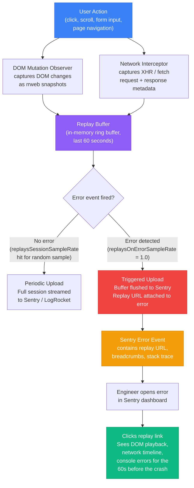

# [FEE-1407] Session Replay & Production Debugging

:::info
Session replay records DOM mutations, network activity, and console output as a timeline, so an engineer can watch a production bug happen instead of reconstructing it from a user's description. Correlated with error tracking, a replay turns a stack trace into the sequence of clicks and requests that produced it. The technique carries real privacy obligations: replay can capture PII in DOM text and form inputs, so masking and consent gating must be configured before recording begins. This article covers six session-replay tools, the GDPR consent and masking mechanics, correlation IDs for joining replay to backend logs, and the client-side cost of recording.
:::

## Context

A device-specific or timing-specific bug can take an engineer days to reproduce, or never reproduce at all, when it depends on a network condition, a sequence of UI interactions, or an account data shape the engineer cannot easily recreate. The traditional debugging toolkit (logs, screenshots, user-reported steps) is inadequate for these cases because it relies on the user accurately recalling and describing a sequence of events they did not know they were supposed to observe.

Session replay records the user's interaction as it happened: DOM mutations, scroll position, click coordinates, network requests and responses, console errors, and JavaScript exceptions, all captured in a timeline that an engineer can play back in a browser-like interface. Several replay tools, including Sentry and PostHog, build on rrweb, an open-source library that serializes DOM changes into a compact event stream and reconstructs them for playback. The engineer sees exactly what the user saw, in the order it happened, without needing to reproduce the bug first.

The tools differ in positioning, depth, and hosting model. **LogRocket** is a dedicated session replay product with high-fidelity DOM recording and deep network request inspection including request and response bodies. **Sentry Session Replay** integrates directly with error tracking through `replayIntegration()`, exported from `@sentry/browser` (and the framework SDKs built on it): when an error event is captured, Sentry attaches a link to the session replay covering the moments around the error. For teams already using Sentry, this puts the error and the replay one click apart. **Microsoft Clarity** is a free tool from Microsoft that offers session replay and heatmaps with no per-session cost, making it practical for high-traffic applications. **FullStory** is an enterprise-grade product emphasizing DX data capture and product analytics alongside replay. **OpenReplay** is an open-source, self-hostable replay tool; because the recordings stay on infrastructure the team controls, self-hosting removes the cross-border transfer question that cloud-hosted providers raise for EU teams. **PostHog** bundles session replay with its open-source product analytics platform; replay can run on a self-hosted (hobby) deployment with configured blob storage, but PostHog no longer officially supports production self-hosting and steers teams toward PostHog Cloud instead.

Privacy is the non-negotiable constraint. Session replay records what users type, where they click, and what they see. That can include form inputs, financial data, health information, and other personally identifiable information rendered in DOM content. Recording this data without masking it creates GDPR, CCPA, and HIPAA liability. Current SDKs address this by defaulting to masked: Sentry's `replayIntegration()`, for example, masks all text, all inputs, and blocks all media by default, so an engineer has to explicitly unmask specific non-sensitive content rather than discover after the fact that sensitive fields were recorded.

**GDPR and consent** add a legal layer. In jurisdictions covered by GDPR (and similar laws), session replay constitutes processing of personal data and typically requires explicit user consent before it begins. Session replay initialization must wait for a consent signal instead of running unconditionally at application bootstrap. Enabling replay for all users and later discovering that EU users were recorded without consent is a data protection incident.

**Correlation IDs** connect the frontend session to backend log traces. A session ID generated at the frontend and passed as an HTTP header (`X-Correlation-ID`) on every API request allows backend engineers to search their logs for all requests that touched a specific user's session. Combined with the session replay URL, this creates a complete picture: the replay shows what the user experienced; the correlation ID surfaces the backend state during those same moments.

## Visual

### Session Replay Flow

The following diagram shows how user actions are recorded, buffered, and uploaded when an error occurs, and how an engineer navigates from a Sentry error event back to the session replay. A DOM mutation observer, typically backed by rrweb, serializes changes into an in-memory ring buffer holding the last 60 seconds of activity. When an error fires, the buffer is flushed and uploaded, and the resulting replay URL is attached to the error event alongside its breadcrumbs (Sentry's term for the chronological trail of clicks, navigations, and console or network events leading up to the error) and its stack trace.



## Example

### 1. Sentry Session Replay Setup

Install and configure Sentry Session Replay. The `replayIntegration()` function ships in `@sentry/browser` (and the framework SDKs built on it, such as `@sentry/react` and `@sentry/nextjs`) starting with SDK v8; there is no separate `@sentry/replay` package to install.

```typescript
// src/instrument.ts (loaded before the app initializes)
import * as Sentry from '@sentry/browser';

Sentry.init({
  dsn: 'https://YOUR_DSN@sentry.io/YOUR_PROJECT',
  integrations: [
    Sentry.replayIntegration({
      // maskAllText, maskAllInputs, and blockAllMedia all default to true.
      // Leave them on. Opt specific non-sensitive elements out via unmask.
      unmask: ['.sentry-unmask'],
    }),
  ],
  // Sample 10% of all sessions for replay regardless of errors
  replaysSessionSampleRate: 0.1,
  // Capture replay for 100% of sessions that produce an error
  replaysOnErrorSampleRate: 1.0,
});
```

To allow a specific element to appear unmasked in replays (for non-sensitive UI content that is masked by the default `maskAllText`), add the `.sentry-unmask` CSS class and list that class in the integration's `unmask` array, as shown above. In SDK v8 and later, the class alone does nothing without the matching `unmask` entry:

```html
<!-- Masked by default -->
<p>User account: ****</p>

<!-- Explicitly unmasked, because .sentry-unmask is listed in unmask above -->
<p class="sentry-unmask">Page title: Dashboard</p>
```

To explicitly block an element from appearing in replays at all (even the masked placeholder), add the `.sentry-block` class:

```html
<!-- This element will not appear in replays even as a masked placeholder -->
<div class="sentry-block">
  <canvas id="signature-pad" />
</div>
```

### 2. GDPR-Gated Replay Initialization

For applications serving EU users, replay must be conditional on consent. Initialize Sentry with the replay integration present but both replay sample rates at 0, then call `Sentry.getReplay().startBuffering()` after the user grants consent. `startBuffering()` begins recording into the ring buffer immediately, independent of the sample-rate settings, and an error event still triggers the flush and upload.

```typescript
// src/instrument.ts
import * as Sentry from '@sentry/browser';

// Tracking errors is typically covered under legitimate interest;
// replay requires explicit consent, so its sample rates start at 0.
Sentry.init({
  dsn: 'https://YOUR_DSN@sentry.io/YOUR_PROJECT',
  integrations: [
    Sentry.replayIntegration({
      unmask: ['.sentry-unmask'],
    }),
  ],
  tracesSampleRate: 0.2,
  replaysSessionSampleRate: 0,
  replaysOnErrorSampleRate: 0,
});

// Call this function after the user grants consent in your cookie banner
export function enableSessionReplayAfterConsent(): void {
  const replay = Sentry.getReplay();
  if (!replay) return;

  // startBuffering() records into the ring buffer without uploading.
  // A subsequent error event still triggers the flush, so behavior
  // matches replaysOnErrorSampleRate: 1.0 once consent is granted.
  replay.startBuffering();

  Sentry.getCurrentScope().setExtra('replayConsent', true);
}
```

In your consent management platform handler:

```typescript
// src/consent.ts
import { enableSessionReplayAfterConsent } from './instrument';

cookieConsentPlatform.on('consent:granted', (categories) => {
  if (categories.includes('analytics')) {
    enableSessionReplayAfterConsent();
  }
});
```

### 3. LogRocket Setup and Error Correlation

```typescript
// src/instrument.ts
import LogRocket from 'logrocket';

LogRocket.init('your-app/your-project', {
  dom: {
    // Sanitize all input field values — they will appear as asterisks in replays
    inputSanitizer: true,
  },
  network: {
    // Remove sensitive headers from network request/response capture
    requestSanitizer: (request) => {
      if (request.headers['Authorization']) {
        request.headers['Authorization'] = '[REDACTED]';
      }
      return request;
    },
    responseSanitizer: (response) => {
      // Redact response bodies for sensitive endpoints
      if (response.url.includes('/api/payments')) {
        response.body = '[REDACTED]';
      }
      return response;
    },
  },
});

// Identify the user for the session (use an ID, not a name or email in production)
LogRocket.identify('user-internal-id-123', {
  // Only include non-sensitive identifiers
  plan: 'enterprise',
  role: 'admin',
});
```

Attach the LogRocket session URL to Sentry errors so both systems are linked:

```typescript
// src/instrument.ts (continued)
import * as Sentry from '@sentry/browser';

LogRocket.getSessionURL((sessionURL) => {
  Sentry.getCurrentScope().setExtra('logRocketSessionURL', sessionURL);
});
```

When a Sentry error is captured, it will include the `logRocketSessionURL` extra field, which is a direct link to the LogRocket replay for that session.

### 4. Microsoft Clarity (Free Tier)

Microsoft Clarity requires only a script tag or a one-line initialization. It is the simplest option for teams that want session replay without a paid plan.

```html
<!-- Add to <head> — replace PROJECT_ID with your Clarity project ID -->
<script type="text/javascript">
  (function(c,l,a,r,i,t,y){
    c[a]=c[a]||function(){(c[a].q=c[a].q||[]).push(arguments)};
    t=l.createElement(r);t.async=1;t.src="https://www.clarity.ms/tag/"+i;
    y=l.getElementsByTagName(r)[0];y.parentNode.insertBefore(t,y);
  })(window, document, "clarity", "script", "PROJECT_ID");
</script>
```

Or via the official npm package, `@microsoft/clarity` (the lower-level `clarity-js` core instrumentation package is not the recommended way to add Clarity to a site):

```typescript
import Clarity from '@microsoft/clarity';

Clarity.init('PROJECT_ID');

// Tag the session with a custom identifier for correlation
Clarity.setTag('userId', 'internal-user-id-123');
```

PII masking in Clarity is configured in the Clarity dashboard under Masking settings. You can set masking rules by CSS selector or element attribute without changing application code. For elements that need code-level masking:

```html
<!-- Add data-clarity-mask attribute to mask an element -->
<input type="text" name="ssn" data-clarity-mask="True" />
```

### 5. FullStory Setup

```typescript
import * as FullStory from '@fullstory/browser';

FullStory.init({
  orgId: 'YOUR_ORG_ID',
  // Disable capture in non-production environments
  devMode: process.env.NODE_ENV !== 'production',
});

// Identify the user (use internal IDs, not PII)
FullStory.identify('user-internal-id-123', {
  displayName: 'Masked User',
  // Do not include email or real name here
});
```

To mask or exclude a DOM element from FullStory capture, add the `fs-mask` or `fs-exclude` CSS class. `fs-mask` replaces text with wireframe-style placeholder content while preserving layout; `fs-exclude` removes the element and its subtree from capture entirely:

```html
<!-- FullStory replaces this text with placeholder content -->
<div class="fs-mask">
  <span>Credit card number: 4111 1111 1111 1111</span>
</div>
```

### 6. Correlation IDs for Backend Tracing

Generate a session-scoped correlation ID at application startup and attach it to every API request. This allows backend engineers to grep their logs for all requests from a specific frontend session.

```typescript
// src/correlation.ts
import { v4 as uuidv4 } from 'uuid';

// Generate once per page load (or per user session if persisted to sessionStorage)
export const correlationId = sessionStorage.getItem('correlationId')
  ?? (() => {
    const id = uuidv4();
    sessionStorage.setItem('correlationId', id);
    return id;
  })();

// Attach to Sentry scope so it appears on every error event
import * as Sentry from '@sentry/browser';
Sentry.getCurrentScope().setTag('correlationId', correlationId);
```

Add the correlation ID to every outgoing API request via a fetch wrapper or Axios interceptor:

```typescript
// src/api/client.ts
import { correlationId } from '../correlation';

// Fetch wrapper
export async function apiFetch(url: string, options: RequestInit = {}): Promise<Response> {
  const headers = new Headers(options.headers);
  headers.set('X-Correlation-ID', correlationId);

  return fetch(url, { ...options, headers });
}

// Axios interceptor alternative
import axios from 'axios';

axios.interceptors.request.use((config) => {
  config.headers['X-Correlation-ID'] = correlationId;
  return config;
});
```

On the backend, log the `X-Correlation-ID` header with every request log entry. A backend engineer can then run:

```bash
# Find all backend log entries for a specific frontend session
grep "X-Correlation-ID: abc-123-def" /var/log/app/access.log
```

Combined with the session replay URL (which contains the same session identifier in its metadata), this creates a complete audit trail from frontend user action through API request to backend log entry.

### 7. HAR Export for Network Debugging

When session replay is not available or a specific network-level issue needs deep inspection, Chrome DevTools HAR export provides the full network request and response archive.

To export a HAR file:
1. Open Chrome DevTools (F12 or Cmd+Opt+I)
2. Navigate to the Network tab
3. Reproduce the issue (or load the page where the issue occurs)
4. Right-click anywhere in the network request list
5. Select "Save all as HAR with content"

The exported `.har` file (JSON format) contains every request's URL, method, headers (request and response), status code, timing breakdown, and response body. Share the HAR file with the engineer investigating the issue.

For privacy before sharing, strip sensitive headers from the HAR:

```bash
# Remove Authorization headers from a HAR file before sharing
# (requires jq)
jq 'del(.log.entries[].request.headers[] | select(.name == "Authorization"))' \
  network-capture.har > network-capture-sanitized.har
```

### 8. Remote Debug Logging via Feature Flag

For issues that cannot be captured by session replay (timing-sensitive race conditions, low-level rendering bugs), enable verbose logging for specific users via a feature flag.

```typescript
// src/debug-logger.ts
import { featureFlags } from './feature-flags'; // FEE-1405 pattern

const isVerboseLogging = featureFlags.isEnabled('verbose-logging');

export function debugLog(message: string, context?: Record<string, unknown>): void {
  if (!isVerboseLogging) return;

  // Include correlation ID in every debug log so backend can join logs
  const entry = {
    timestamp: new Date().toISOString(),
    correlationId: sessionStorage.getItem('correlationId'),
    message,
    ...context,
  };

  // Send to your structured logging endpoint (FEE-1403 pattern)
  fetch('/api/debug-logs', {
    method: 'POST',
    headers: { 'Content-Type': 'application/json' },
    body: JSON.stringify(entry),
  }).catch(() => {
    // Logging must never throw — swallow errors silently
  });

  // Also log to console for local debugging
  console.debug('[debug]', message, context);
}
```

Enable verbose logging only for the specific user experiencing the issue by targeting the feature flag to their user ID in your flag management system (LaunchDarkly, Unleash, etc.).

## Best Practices

**MUST leave `maskAllInputs`, `maskAllText`, and `blockAllMedia` at their default of `true` for any application that could render PII in DOM text, inputs, or media.** These are the SDK defaults in current Sentry versions (v8 and later), not settings to turn on. If PII is captured before masking is configured correctly, the data is already recorded and subject to GDPR erasure obligations that may be operationally impossible to satisfy. Teams MUST treat masking as the default configuration: opt specific non-sensitive elements out of masking with the `.sentry-unmask` class and a matching `unmask` entry in the integration config, rather than opting individual fields into masking after the fact.

**MUST gate session replay initialization behind explicit user consent in GDPR-covered jurisdictions.** Session replay constitutes processing of personal data under GDPR and typically requires a lawful basis beyond legitimate interest. Teams MUST initialize the replay integration with `replaysSessionSampleRate` and `replaysOnErrorSampleRate` both at 0, then call `Sentry.getReplay().startBuffering()` (or `.start()`) only after the user grants analytics consent via a cookie consent platform. Enabling replay for all users and discovering later that EU users were recorded without consent is a data protection incident.

**MUST pass a stable correlation ID in every outbound API request header (`X-Correlation-ID`) and attach it to the Sentry scope.** Without a correlation ID, a backend engineer seeing a server error cannot find the frontend session replay that produced the request. Teams MUST generate the correlation ID once per session (persisted in `sessionStorage`), attach it to the Sentry scope as a tag, and include it as a request header in every `fetch` or Axios call via a shared interceptor.

**SHOULD set `replaysOnErrorSampleRate: 1.0` to capture the full replay buffer for every session that produces an error.** The replay buffer covering the 60 seconds before an error is what transforms the debugging workflow from reading a stack trace to watching the sequence that caused the crash. Teams SHOULD set `replaysSessionSampleRate` to a low value (0.05–0.1) for random session sampling, but SHOULD keep `replaysOnErrorSampleRate` at 1.0 so error-triggered replays are never missed.

**SHOULD correlate replay tools with error reporting so that error events link directly to the replay.** Running LogRocket and Sentry in parallel without linking them forces engineers to search both tools separately for the same user and time window. Teams SHOULD call `LogRocket.getSessionURL()` and attach the returned URL to the Sentry scope as an extra field, or use Sentry Session Replay natively to achieve the same link without an extra tool.

**SHOULD account for the client-side cost of recording and the content it cannot capture.** The DOM mutation observer that rrweb-based tools rely on adds bundle weight and ongoing CPU cost proportional to how often the page mutates; high-frequency canvas or WebGL rendering can generate a large volume of mutation events. Canvas and WebGL content, cross-origin iframes, and shadow DOM content typically need separate, tool-specific configuration to record at all, and some content is not recordable regardless of configuration. Teams SHOULD profile a representative page with replay enabled before rolling it out broadly, and document which UI surfaces the chosen tool cannot capture.

**SHOULD NOT store session replay data longer than required by your data retention policy.** Session replay data is personal data under GDPR and subject to data minimization requirements: it must not be retained beyond the period necessary for its stated purpose. Retention is typically set by the provider's plan tier or a policy you configure, not a single universal default, and it varies by provider. Teams SHOULD confirm the provider's configurable retention range, set it to the shortest period that still serves the debugging window the team needs, and align it explicitly with the organization's privacy policy.

**SHOULD NOT record session replays in staging or development environments.** Staging environments contain realistic-looking test data, developer workflows that mimic sensitive operations, and debugging states that MUST NOT be stored in a third-party replay provider. Teams SHOULD gate replay initialization with `process.env.NODE_ENV === 'production'` and set both sample rates to 0 in non-production environments.

## Design Thinking

### Why session replay changed production debugging

Before session replay, reproducing a production bug required one of three things: (1) a reliable set of steps that any engineer could follow in a test environment, (2) access to the user's specific device and account state, or (3) a stroke of luck. Bugs that depended on timing, network conditions, browser version, account data shape, or a specific sequence of UI interactions frequently went unresolved because none of these three conditions could be satisfied.

Session replay eliminates the reproduction step: the engineer does not need to reproduce the bug, they watch it happen. The replay shows the exact DOM state at the moment of failure, the network requests that preceded it, the console errors, and the user actions that triggered them. Bugs that were previously in the "cannot reproduce" backlog become solvable in a single session.

The second-order effect is organizational: customer support can link a user complaint to a replay, escalate it to engineering with a URL, and the engineer has the full context without ever speaking to the user. The information transfer from user to engineer that previously required a support ticket, back-and-forth clarification, and a best-guess reproduction attempt is replaced by a 90-second playback.

### Why privacy must be designed in from the start

Retroactive privacy protection is error-prone. If replay is deployed without masking and PII is captured, the data is already recorded. Deleting it from the replay provider's storage requires their deletion API or a manual request process. The GDPR erasure obligation applies to replay data as much as to any other personal data, and the replay provider's data retention schedule may not align with the erasure timeline you need.

Masking sensitive fields after the fact requires identifying every field that could contain PII, across every page, every component, and every third-party widget. This is the inverse of the secure design principle: you are trying to enumerate what needs protection, so the risk lies in what you miss. Designing from the other direction, everything masked by default and engineers explicitly unmasking content they need for debugging, puts the risk in what you unnecessarily expose instead, and that set is smaller and easier to audit.

The practical implication for Sentry: `maskAllInputs`, `maskAllText`, and `blockAllMedia` all default to `true` in current SDKs (v8 and later). There is no opt-in step for masking; the default is already conservative. The remaining work is the opposite of what earlier SDK versions required: identify the small set of non-sensitive elements that need to be visible in a replay, add the `.sentry-unmask` class to them, and list that class in the integration's `unmask` array (`replayIntegration({ unmask: ['.sentry-unmask'] })`). Without the `unmask` config entry, the class alone does nothing in SDK v8 and later.

### Data residency

**Data residency** is a separate concern from consent: it determines which geographic region your replay data is stored in. Under GDPR, transferring personal data outside the EU requires an adequacy decision or appropriate safeguards. Most replay providers offer EU-region deployments: Sentry has an EU-hosted option at `sentry.io/eu/`, and LogRocket offers EU data storage. Enterprise contracts may require data sovereignty guarantees. Verify your provider's data residency configuration before go-live; the default is often US-region storage even for EU-based teams.

Self-hosting sidesteps the transfer question rather than managing it. OpenReplay ships a self-hostable deployment, so a team can keep replay recordings inside its own infrastructure and jurisdiction instead of relying on a vendor's regional deployment options. PostHog bundles session replay with its analytics platform, and replay can run on a self-hosted deployment with configured blob storage. But PostHog no longer officially supports production self-hosting, so teams that need a residency guarantee should treat PostHog Cloud's regional options as the supported path rather than relying on self-hosting.

### Correlating replay with error events

A Sentry error event alone tells you what broke: the exception type, the stack trace, the browser version, the affected URL. What it does not tell you is what the user was doing in the 60 seconds before the error fired. With `replaysOnErrorSampleRate: 1.0`, Sentry buffers the replay for every session and, when an error occurs, flushes and uploads the buffer and attaches the replay URL to the error event in the Sentry UI.

The payoff is concrete: clicking an error in Sentry opens a replay showing the DOM state, network requests, and user actions that preceded the crash, so an engineer reconstructs the failing sequence by watching it instead of inferring it from a stack trace alone.

For teams not yet on Sentry, LogRocket provides the same correlation pattern from the other direction: `LogRocket.getSessionURL(sessionURL => ...)` returns a URL that can be attached to any error reporting call, creating the same two-way link between error event and replay.

### Why LogRocket vs Sentry Session Replay

LogRocket and Sentry Session Replay overlap significantly but differ in depth. LogRocket is a dedicated replay product with richer network inspection: it captures request and response bodies, not just headers and status codes. It also provides a product analytics layer (user journey funnels, click maps) that Sentry does not. For teams whose primary use case is debugging production issues and understanding user behavior in depth, LogRocket's additional instrumentation is valuable.

Sentry Session Replay is the better choice for teams already using Sentry who want one tool rather than two contracts. The error-replay correlation is native and requires no extra integration code. The error-budget perspective also favors Sentry: the same team managing error rates, SLOs, and alerting in Sentry gains replay context without switching tools or maintaining a second data pipeline.

The decision point is often organizational: if your team already pays for Sentry and the replay fidelity meets your debugging needs (which it does for the vast majority of bugs), adding LogRocket is a cost that needs to justify itself. If your team does not use Sentry, or if network-level request body inspection is critical for your debugging workflow, LogRocket is worth the additional investment.

## Tool Comparison

| Tool | Hosting | Error correlation | Masking configuration | Best fit |
|---|---|---|---|---|
| Sentry Session Replay | Cloud (US or EU region) | Native: `replaysOnErrorSampleRate` attaches the replay to the error event | `maskAllText`, `maskAllInputs`, `blockAllMedia` default to `true`; unmask specific elements via `.sentry-unmask` + `unmask` config | Teams already on Sentry for error tracking |
| LogRocket | Cloud (US or EU region) | Manual: attach `LogRocket.getSessionURL()` to the error report | `inputSanitizer` and request/response sanitizer functions | Deep network body inspection plus built-in product analytics |
| Microsoft Clarity | Cloud (Microsoft-hosted) | None built in; correlate manually with your error tool | Dashboard masking rules or `data-clarity-mask` attribute | High-traffic sites wanting replay and heatmaps at no per-session cost |
| FullStory | Cloud (US or EU region) | Manual: attach a FullStory session reference to your error tool | `fs-mask` / `fs-exclude` CSS classes or dashboard rules | Enterprise UX research alongside replay |
| OpenReplay | Self-hosted (open source) or managed cloud | Manual: attach the OpenReplay session URL to your error tool | Redaction rules configured per project | Teams with data-residency or self-hosting requirements |
| PostHog | Self-hostable (hobby) or Cloud; production self-hosting no longer officially supported | Native if using PostHog's own error tracking; manual otherwise | Property- and element-level masking settings | Teams already using PostHog for analytics, flags, and experiments |

## Related Topics

- [FEE-1400: Observability & Error Tracking Overview](./1400.md) — Category context; session replay is the user-facing layer of the three observability pillars
- [FEE-1401: Error Tracking with Sentry](./1401.md) — Sentry error events link to session replays; `replaysOnErrorSampleRate` is the configuration that connects them
- [FEE-1403: Structured Logging](./1403.md) — Correlation IDs in structured logs allow backend log traces to be joined to the frontend session captured in replay
- [FEE-1405: Feature Flags](./1405.md) — Feature flag state is visible in the replay context; remote debug logging (verbose mode for specific users) is gated by feature flags

## References

- [Sentry — Session Replay documentation](https://docs.sentry.io/platforms/javascript/session-replay/)
- [Sentry — Session Replay privacy and masking](https://docs.sentry.io/platforms/javascript/session-replay/privacy/)
- [Sentry — replayIntegration() API reference](https://docs.sentry.io/platforms/javascript/session-replay/configuration/)
- [Sentry — Understanding Sessions (manual start / startBuffering)](https://docs.sentry.io/platforms/javascript/session-replay/understanding-sessions/)
- [LogRocket — Getting started](https://docs.logrocket.com/docs/getting-started)
- [LogRocket — PII and data privacy](https://docs.logrocket.com/docs/privacy)
- [LogRocket — getSessionURL API](https://docs.logrocket.com/reference/getsessionurl)
- [Microsoft Clarity — documentation](https://learn.microsoft.com/en-us/clarity/)
- [Microsoft Clarity — masking settings](https://learn.microsoft.com/en-us/clarity/setup-and-installation/clarity-masking)
- [FullStory — getting started](https://developer.fullstory.com/browser/getting-started/)
- [FullStory — how to protect user privacy (fs-mask / fs-exclude)](https://help.fullstory.com/hc/en-us/articles/360020623574-How-do-I-protect-my-users-privacy-in-Fullstory)
- [OpenReplay — open-source, self-hostable session replay](https://github.com/openreplay/openreplay)
- [PostHog — session replay documentation](https://posthog.com/docs/session-replay)
- [rrweb — open source DOM recording library (underlying technology)](https://github.com/rrweb-io/rrweb)
- [W3C HAR specification](https://w3c.github.io/web-performance/specs/HAR/Overview.html)
- [GDPR — Article 6: Lawfulness of processing](https://gdpr-info.eu/art-6-gdpr/)
- [OWASP — Session management cheat sheet](https://cheatsheetseries.owasp.org/cheatsheets/Session_Management_Cheat_Sheet.html)
