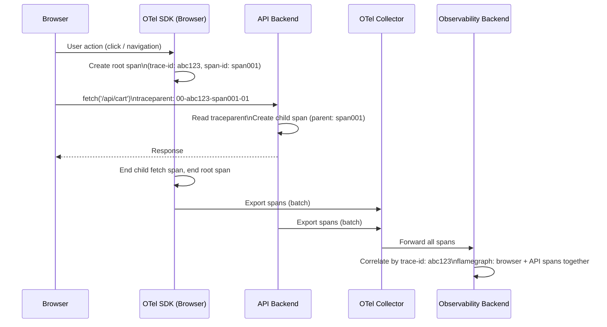

# OpenTelemetry Trace Correlation in the Browser

Distributed tracing follows a request as it moves through multiple services,
recording timing and context at each hop. For web applications, this chain
begins in the browser: the user's click, form submission, or background
data fetch initiates a request that passes through an API gateway, backend
services, and databases. Without a trace that starts in the browser, the
backend trace begins mid-chain. The root cause of a latency spike may be
a slow JavaScript interaction that occurred before the first network call,
invisible to any backend-only tracing system.

OpenTelemetry's browser SDK, `@opentelemetry/sdk-trace-web`, extends the
W3C Trace Context standard to the front end. A root span is created in
the browser and a `traceparent` header is injected into outgoing HTTP
requests. Backend services that are instrumented to read this header
continue the trace under the same trace ID, creating a single distributed
trace that spans the entire user interaction, from button click to
database query and back.

Trace correlation addresses a common observability gap: a backend alert
fires on 95th-percentile latency, but the backend trace shows no
anomalous service time. The actual delay is network round-trip time from
a mobile device on a congested connection, visible only if the trace
begins at the browser's `fetch()` call and records the full
time-to-first-byte from the client's perspective.

This article covers setting up the OpenTelemetry web SDK, creating spans
for user interactions and page navigations, propagating trace context
through HTTP headers, and correlating browser traces with backend service
traces in a shared observability backend.

## Design Thinking

### How the W3C Trace Context standard works

The W3C Trace Context specification defines the `traceparent` header as
a fixed-length string with four fields separated by hyphens:
`{version}-{trace-id}-{parent-id}-{flags}`. The `trace-id` is a 16-byte
hex value unique to the entire distributed trace. The `parent-id` is an
8-byte hex value identifying the specific span that initiated the request
(the "parent span" from the receiver's perspective). The `flags` byte
carries sampling state: `01` means sampled and should be recorded; `00`
means unsampled.

When the browser creates a root span and attaches a `traceparent` header
to a fetch request, the backend service reads this header, extracts the
trace ID and parent span ID, and creates a new child span with the
browser's span as its parent. The child span shares the same trace ID,
so all spans in the chain (browser, gateway, service, database) appear
as a connected tree in the observability backend under one trace ID.

The `tracestate` header accompanies `traceparent` as an opaque key-value
store for vendor-specific sampling or routing decisions. OpenTelemetry
populates `tracestate` with its own entries when vendor-specific exporters
are used. Most applications do not need to read or write `tracestate`
directly. The SDK manages it automatically.

### Setting up the browser SDK

The OpenTelemetry JavaScript SDK for browsers is split into focused
packages. `@opentelemetry/sdk-trace-web` provides the `WebTracerProvider`,
the core tracing engine. `@opentelemetry/context-zone` provides Zone.js
based context propagation, preserving the active span context across
asynchronous operations. `@opentelemetry/instrumentation-fetch`
automatically instruments `window.fetch()` calls, injecting the
`traceparent` header and creating child spans for every request.
`@opentelemetry/instrumentation-document-load` instruments the page
load lifecycle, creating spans for DNS resolution, TCP connection, TLS
handshake, server response, and DOM parse.

The provider requires an exporter to deliver span data to a backend. For
production deployments, an OTel Collector receives spans via
`@opentelemetry/exporter-trace-otlp-http` over OTLP/HTTP and forwards
them to the observability backend (Jaeger, Grafana Tempo, Datadog, or
similar). Sending spans directly from the browser to a SaaS backend is
possible but exposes API keys in client-side code. Routing through a
collector avoids this and centralizes export configuration.

`BatchSpanProcessor` is the correct processor for production. It buffers
spans in memory and exports them in batches on a configurable interval,
reducing the number of network requests from the browser. `SimpleSpanProcessor`
exports each span immediately and is only appropriate for debugging
during development.

A sampler is configured on the `WebTracerProvider` at initialization.
`ParentBasedSampler` with a `TraceIdRatioBased` root sampler is the
standard production configuration. `ParentBasedSampler` respects the
sampling decision from an incoming `traceparent` header: if the backend
marks a request as sampled, the browser continues that sampled trace.
`TraceIdRatioBased` makes the sampling decision for new root spans based
on a configurable probability, so setting the root sampler to 10%
means that 10% of browser-initiated traces are fully sampled end-to-end.

### Propagating trace context through fetch requests

The `FetchInstrumentation` plugin patches `window.fetch()` to inject
`traceparent` and `tracestate` headers before each request is sent. It
also wraps the fetch in a child span that records the request URL, HTTP
method, and response status code. No manual instrumentation is required
for standard fetch calls once the plugin is registered.

Propagation relies on the request URL matching the
`propagateTraceHeaderCorsUrls` configuration option, a list of URL
patterns (string or RegExp) specifying which origins the instrumentation
should inject headers into. Without this, the instrumentation only
propagates headers for same-origin requests. Cross-origin requests to
API backends require the backend to include `traceparent` and `tracestate`
in its `Access-Control-Allow-Headers` CORS preflight response. If these
headers are absent from the CORS configuration, the browser strips them
and trace continuity breaks silently: the backend trace appears as a
disconnected root span.

Requests made through `XMLHttpRequest` require the separate
`@opentelemetry/instrumentation-xml-http-request` plugin. Applications
using libraries that wrap XHR may require both plugins if the library's
abstraction is not transparent to the fetch instrumentation.

### Creating spans for user interactions

The `FetchInstrumentation` and `DocumentLoadInstrumentation` plugins cover
network activity and page load, but not the user-visible operations that
initiate them. A user clicking "Add to cart" triggers a sequence: the
click handler validates input, calls the inventory API, updates local
state, and re-renders the cart. Instrumenting only the fetch call captures
API latency but not the JavaScript time before and after the request.

Manual span creation wraps the full operation. The `tracer.startSpan()`
API creates a named span. `context.with(trace.setSpan(context.active(), span), fn)`
runs a function with the new span as the active context, ensuring that
any child spans or instrumented fetch calls created inside `fn` are
automatically linked as children of the operation span. The span is ended
in a `finally` block to guarantee completion even if the operation throws.

Span attributes provide queryable labels on spans. Setting `user.id`,
`cart.item_count`, or `route.name` as attributes enables filtering in the
observability backend, for example finding all traces where a specific
user experienced high API latency. Attributes are set before ending the
span. Sensitive user data (email addresses, payment information, or any
personally identifiable information) MUST NOT be set as span attributes,
because trace data is stored in the observability backend and may be
retained long-term with different access controls than application logs.

### Correlating browser and backend spans

Correlation depends on the backend reading the `traceparent` header and
propagating it through its own span creation. Node.js backends using the
OpenTelemetry Node.js SDK do this automatically when the HTTP
instrumentation plugin is registered. Java backends using the
OpenTelemetry Java agent behave the same way. If the backend is not
instrumented, the browser trace is an orphaned root trace: it exists
independently and cannot be correlated with backend service data.

Verifying correlation requires examining a trace in the observability
backend and confirming that browser spans and backend spans share the
same trace ID. In Jaeger, a trace detail view shows all spans under a
single trace ID in a flamegraph layout with service names as labels.
If the browser span appears as a separate trace, the backend is not
reading `traceparent`. The most common cause is a missing
`Access-Control-Allow-Headers` entry or a gap in backend instrumentation.

Session correlation connects trace data to session replay tools. If the
application uses a session replay tool (Datadog RUM, Sentry, FullStory),
the active trace ID can be injected into the session replay event stream
as a custom attribute. When a user reports an issue, the session replay
shows what the user did, and the linked trace ID leads directly to the
corresponding distributed trace in the observability backend.

## Best Practices

**MUST** configure `propagateTraceHeaderCorsUrls` to include all API
origin patterns the application calls. Without this, cross-origin fetch
instrumentation does not inject `traceparent` headers, breaking
distributed trace continuity silently.

**MUST** ensure all API backends include `traceparent` and `tracestate`
in their `Access-Control-Allow-Headers` CORS preflight responses. Omitting
these headers is the most common cause of silent trace correlation failure
in cross-origin architectures.

**MUST NOT** set sensitive user data (email, payment details, session
tokens, or any PII) as span attributes. Span data flows through the
observability backend and may be retained long-term or be visible to a
broader audience than application logs.

**SHOULD** use `BatchSpanProcessor` in production. `SimpleSpanProcessor`
triggers one network request per span, adding latency and cost in
proportion to interaction volume.

**SHOULD** configure `TraceIdRatioBased` sampling at 10% or lower for
production applications with significant user volume. 100% sampling is
appropriate only for low-traffic internal tools or development environments.

**SHOULD** limit manual span creation to semantically meaningful
operations: page navigation, data-loading user actions, and multi-step
form flows. Wrapping individual DOM events or every state mutation in
spans produces trace noise that makes flamegraphs unreadable.

**SHOULD** route span export through an OTel Collector rather than
exporting directly to a SaaS backend from the browser. Direct export
requires embedding API keys in the client-side bundle.

## Visual



## Example

```typescript
// src/telemetry/setup.ts
// Initialize OpenTelemetry browser tracing with automatic fetch
// instrumentation and OTLP export through a local collector.

import { WebTracerProvider } from '@opentelemetry/sdk-trace-web';
import { BatchSpanProcessor } from '@opentelemetry/sdk-trace-base';
import { OTLPTraceExporter } from '@opentelemetry/exporter-trace-otlp-http';
import {
  CompositePropagator,
  W3CTraceContextPropagator,
  W3CBaggagePropagator,
  ParentBasedSampler,
  TraceIdRatioBasedSampler,
} from '@opentelemetry/core';
import { FetchInstrumentation } from '@opentelemetry/instrumentation-fetch';
import { DocumentLoadInstrumentation } from '@opentelemetry/instrumentation-document-load';
import { registerInstrumentations } from '@opentelemetry/instrumentation';
import { Resource } from '@opentelemetry/resources';
import { SEMRESATTRS_SERVICE_NAME } from '@opentelemetry/semantic-conventions';

export function initTelemetry(): void {
  const exporter = new OTLPTraceExporter({
    // Proxy to local collector — avoids embedding SaaS API keys in bundle
    url: '/otel/v1/traces',
  });

  const provider = new WebTracerProvider({
    resource: new Resource({
      [SEMRESATTRS_SERVICE_NAME]: 'frontend',
    }),
    sampler: new ParentBasedSampler({
      // 10% of new root spans sampled; inherited from backend for child spans
      root: new TraceIdRatioBasedSampler(0.1),
    }),
  });

  provider.addSpanProcessor(new BatchSpanProcessor(exporter));

  provider.register({
    propagator: new CompositePropagator({
      propagators: [
        new W3CTraceContextPropagator(),
        new W3CBaggagePropagator(),
      ],
    }),
  });

  registerInstrumentations({
    instrumentations: [
      new FetchInstrumentation({
        // Required: inject traceparent into cross-origin API requests
        propagateTraceHeaderCorsUrls: [/https:\/\/api\.example\.com\/.*/],
        applyCustomAttributesOnSpan: (span) => {
          span.setAttribute('browser.user_agent', navigator.userAgent);
        },
      }),
      new DocumentLoadInstrumentation(),
    ],
  });
}

// Manual span for a user interaction — ensures the full operation
// (including pre-fetch JS time) is captured in the trace:
//
// import { trace, context } from '@opentelemetry/api';
// const tracer = trace.getTracer('frontend');
//
// async function handleAddToCart(productId: string): Promise<void> {
//   const span = tracer.startSpan('cart.add_item');
//   await context.with(trace.setSpan(context.active(), span), async () => {
//     try {
//       span.setAttribute('product.id', productId);
//       await addItemToCart(productId); // fetch is auto-instrumented
//     } catch (err) {
//       span.recordException(err as Error);
//       throw err;
//     } finally {
//       span.end();
//     }
//   });
// }
```

## Common Mistakes

- Omitting `propagateTraceHeaderCorsUrls`: cross-origin fetch calls send
  no `traceparent`, the backend trace appears as a disconnected root span,
  and the distributed trace is silently broken
- Forgetting `traceparent` and `tracestate` in the backend CORS
  `Access-Control-Allow-Headers`: the browser blocks header injection
  even when the SDK is configured correctly
- Using `SimpleSpanProcessor` in production: each span triggers a
  separate network request, adding latency and cost at scale
- Setting PII as span attributes: trace data has different access
  controls and retention policies than logs; PII in spans creates
  compliance and privacy exposure
- Creating spans for every DOM event or state mutation: span noise
  makes flamegraphs unreadable and increases ingestion cost without
  observability value
- Exporting spans directly from the browser to a SaaS backend, which embeds
  API keys in the client-side bundle where they are visible to anyone
  who inspects the network requests

## Related FEEs

- FEE-1400: Structured Logging Fundamentals
- FEE-1403: Error Tracking & Source Maps
- FEE-1407: Real User Monitoring (RUM) vs. Synthetic Monitoring

## References

- [OpenTelemetry JavaScript SDK Documentation](https://opentelemetry.io/docs/languages/js/)
- [W3C Trace Context Specification](https://www.w3.org/TR/trace-context/)
- [OpenTelemetry Collector Documentation](https://opentelemetry.io/docs/collector/)
- [opentelemetry-js-contrib: instrumentation-fetch](https://github.com/open-telemetry/opentelemetry-js-contrib/tree/main/plugins/node/opentelemetry-instrumentation-fetch)
- [Jaeger: Getting Started](https://www.jaegertracing.io/docs/latest/getting-started/)
- [Grafana Tempo Documentation](https://grafana.com/docs/tempo/latest/)
