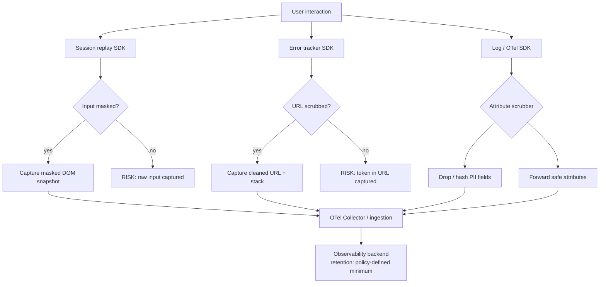

# [FEE-1409] Privacy-Respecting Observability

:::info
Observability tooling (error trackers, session replay tools, log pipelines, real user monitoring) ingests more of a web application's runtime behavior than almost any other layer, and a meaningful share of that data is personal. The leading session replay and error-tracking SDKs mask input and text by default today, which closes the most obvious leak. Gaps remain: network response bodies, canvas-rendered payment fields, non-input text nodes, and misconfigured allow-mode overrides still let personal data through. GDPR, the ePrivacy Directive, and CCPA each attach obligations to what these tools collect, whether or not a team set out to collect it. This article maps what each tool class ingests, how to mask and scrub at the collection point, and how to size retention against an actual diagnostic need.
:::

## Context

A session replay can capture every keystroke in an unmasked payment field. A structured log can ship a user's email address as a request parameter without anyone deciding it should happen. An error report can include a full stack trace with URL fragments containing OAuth tokens, because whatever lands in the URL lands in the report. Teams typically find gaps like these in a breach post-mortem or a compliance audit, not before.

Privacy-respecting observability means collecting deliberately: knowing what each tool ingests, masking and scrubbing before data leaves the browser, and matching retention to the diagnostic purpose it serves.

What the market-leading tools collect by default has shifted toward masking. Datadog Session Replay's `defaultPrivacyLevel` defaults to `mask`, which masks all HTML text, user input, images, and links and renders the page as a wireframe. Sentry's Session Replay masks all text (`maskAllText: true`) and blocks all media (`blockAllMedia: true`) by default. Sentry's error SDK defaults `sendDefaultPii` to `false`, so IP addresses and similar automatically-collectable fields are excluded unless a team opts in; the JavaScript SDK now exposes this as `dataCollection` going forward, since `sendDefaultPii` is deprecated and slated for removal, though it is still respected for backward compatibility and the default it controls (PII off) is unchanged. The real exposure now sits in what those defaults do not cover: network response bodies once response recording is enabled, canvas-rendered form fields (some payment providers render card inputs to canvas specifically to avoid direct DOM access), any tool switched from mask-by-default to an allow-mode override, and older or third-party tools that never adopted mask-first defaults. Section-by-section detail is in [Collection Surfaces and Mitigations](#collection-surfaces-and-mitigations) below.

Regulatory context shapes what "handled" means. GDPR requires a lawful basis for processing personal data and grants data subjects the right to erasure; its storage-limitation principle (Article 5(1)(e)) ties retention to necessity for a stated purpose and does not set a fixed number of days. In the EU, the instrument that requires consent before a script stores or reads information on a user's device (which is what activating a replay or analytics SDK does) is the ePrivacy Directive; GDPR governs the personal-data processing that follows once the script is running. CCPA requires disclosure when personal data is sold to third parties; an observability vendor bound by a compliant service-provider contract is typically not making a "sale" under CCPA, so the contract's terms determine the classification, not the vendor's SaaS delivery model. HIPAA applies if the application handles protected health information and the observability tool ingests it. None of these regulations prohibit observability. They require that the data collected can be justified, is protected appropriately, and can be deleted on request.

## Visual



## Example

```typescript
// src/telemetry/privacy-span-processor.ts
// Custom OTel SpanProcessor that scrubs PII from span attributes
// before export. Register this before BatchSpanProcessor.

import {
  SpanProcessor,
  ReadableSpan,
  Span,
} from '@opentelemetry/sdk-trace-base';
import { Context } from '@opentelemetry/api';

const SENSITIVE_ATTRIBUTE_KEYS = new Set([
  'http.request.header.authorization',
  'http.request.header.cookie',
  'user.email',
  'user.phone',
  'enduser.email',
]);

// Patterns that indicate a value should be redacted regardless of key
const SENSITIVE_VALUE_PATTERNS: RegExp[] = [
  /\b[A-Z0-9._%+-]+@[A-Z0-9.-]+\.[A-Z]{2,}\b/i, // email
  /access_token=[^&]+/i,
  /code=[a-z0-9_-]{20,}/i,
];

function scrubAttributes(
  attributes: Record<string, unknown>,
): Record<string, unknown> {
  const result: Record<string, unknown> = {};
  for (const [key, value] of Object.entries(attributes)) {
    if (SENSITIVE_ATTRIBUTE_KEYS.has(key)) {
      result[key] = '[REDACTED]';
      continue;
    }
    if (typeof value === 'string') {
      const isSensitive = SENSITIVE_VALUE_PATTERNS.some((p) => p.test(value));
      result[key] = isSensitive ? '[REDACTED]' : value;
    } else {
      result[key] = value;
    }
  }
  return result;
}

export class PrivacySpanProcessor implements SpanProcessor {
  onStart(_span: Span, _parentContext: Context): void {}

  onEnd(span: ReadableSpan): void {
    // Mutate attributes in place before the span reaches the exporter
    const attrs = span.attributes as Record<string, unknown>;
    const scrubbed = scrubAttributes(attrs);
    Object.assign(attrs, scrubbed);
  }

  shutdown(): Promise<void> {
    return Promise.resolve();
  }

  forceFlush(): Promise<void> {
    return Promise.resolve();
  }
}

// Registration in setup.ts:
// provider.addSpanProcessor(new PrivacySpanProcessor());
// provider.addSpanProcessor(new BatchSpanProcessor(exporter));
```

## Best Practices

**MUST** review the actual deployed configuration of each observability SDK before assuming it is privacy-safe. Vendor defaults have shifted toward masking text and input, but a configuration inherited from an older SDK version, a self-hosted deployment, or a smaller third-party tool can still be running in full-capture mode. Explicitly confirm input masking, network request filtering, and breadcrumb sanitization before the SDK goes live.

**MUST NOT** allow URL hash fragments or query parameters containing tokens, codes, or user identifiers to be transmitted to observability backends. Configure URL scrubbing to strip these segments before the URL is captured as a span attribute, log field, or session replay breadcrumb.

**SHOULD** confirm session replay masking is configured privacy-first: mask all inputs and text by default, and maintain an explicit allowlist of fields confirmed safe to record. Treat any tool or override running in allow-mode as requiring the same ongoing maintenance discipline as a manual blocklist.

**SHOULD** implement log and trace scrubbing at the collection point, in the browser SDK or the server-side logging call, rather than relying only on post-ingestion pipeline processing. Once data reaches the ingestion backend, even temporarily, removing it requires a deletion request rather than simply not sending it in the first place.

**MUST** set observability data retention to a period the team can justify against its diagnostic and legal needs, not to a vendor's default maximum. A longer retention window widens the exposure surface for any breach or subpoena, so retention beyond the diagnostic minimum should trace to a specific stated purpose, such as fraud investigation or a legal hold.

**SHOULD** use session-scoped correlation IDs rather than persistent user identifiers in logs and traces. Correlation IDs provide the same linkage capability with a shorter personal data lifecycle.

## Design Thinking

**Allowlist versus blocklist masking.** A mask-by-default allowlist (mask everything, unmask specific fields confirmed safe) costs ongoing maintenance: every new field that legitimately needs to be visible in a replay requires an explicit unmask entry. Forgetting one just means the field stays hidden, a debugging-value cost, not a leak. A blocklist (unmask everything, mask specific fields) trades that maintenance cost for a security cost: forgetting an entry exposes personal data instead of just hiding a field a debugger might have wanted. For any field whose sensitivity is unclear, the allowlist model's failure mode is the cheaper one to live with.

**SDK-side versus Collector-side scrubbing.** Scrubbing in the OTel Collector, via the `redaction` or `transform` processor, centralizes the rule set: one configuration change protects every service sending through that Collector, and the rules stay out of application code. But a browser-side span has already crossed the network by the time the Collector sees it, so any field a browser-side processor should have redacted before export has already touched an intermediate hop. SDK-side scrubbing, via a custom `SpanProcessor` (see Example) or a hook like Sentry's `beforeSend`, closes that gap at the cost of duplicating scrubbing logic across every SDK integration a team runs. Teams handling data sensitive enough that a single missed hop matters, health data or payment flows, should scrub at both points; teams optimizing for maintainability alone can lean on the Collector.

## Collection Surfaces and Mitigations

### What each tool class collects

**Session replay** is the highest-risk category by data volume: DOM content, form input, mouse movement, and click coordinates all get captured when replay is on. The market-leading tools mask text and input by default now (see Context), but older or third-party tools, and any tool switched to allow-mode, do not. Verify the deployed configuration rather than assuming it.

**Error trackers** commonly capture the full URL at the time of the error, including query parameters and hash fragments. OAuth redirect flows pass `access_token` or `code` parameters in the URL, so a single uncaught exception during a login redirect can submit an access token to the error tracker's backend. Error trackers also capture `navigator` properties and, when configured to include breadcrumb state, cookies and localStorage values.

**Structured logging** is less obviously risky but frequently surfaces personal data anyway. API client libraries that log request and response bodies will log user-submitted form data. ORM debug logging in server-side rendered applications will log query parameters that include user IDs, emails, or search terms. Log aggregators that accept full HTTP headers will receive `Authorization` headers containing bearer tokens.

**Real user monitoring** tools record timing data, page URLs, and user agent strings. Page URLs often contain user-specific identifiers: `/users/12345/settings` exposes a user ID directly in the path. User agent strings, combined with IP addresses that RUM tools often collect, can re-identify individuals through device fingerprinting.

**Distributed traces** carry span attributes. Attributes set on HTTP request spans often include full URL paths, query parameters, and response codes. If a request URL contains a user identifier or a search query the user entered, that attribute is personal data sitting in the trace backend.

### Masking personal data in session replay tools

Every major session replay tool exposes an input-masking configuration: `defaultPrivacyLevel` in Datadog, `maskAllInputs` and `maskAllText` in Sentry, `maskAllInputs` in PostHog. PostHog is a partial exception worth calling out: it masks input elements by default but not general text, so a value rendered as plain text next to a form rather than typed into an input (a credit card number echoed back in a confirmation panel, for example) can still be captured unless a team adds explicit text masking. Confirm the deployed configuration actually masks by default before relying on it; a team running an older SDK version, or one that copied a starter config predating a vendor's default change, can still be recording in unmask mode without realizing it.

CSS-class-based masking is the most portable pattern across tools. Designating a CSS class (conventionally `.pii` or `.sensitive`, or a tool-specific class such as `.rr-mask` for rrweb-based tools or `.sentry-mask` for Sentry) as the masking selector excludes any element carrying that class from the recording at the DOM level, before the tool transmits the snapshot. Developers adding new form fields need to know this convention exists, or the allowlist degrades silently.

Network request recording, if enabled, requires explicit allowlisting of response bodies safe to record. This is a separate configuration surface from DOM and input masking: masking a form field does not mask that same value if it also appears in a recorded API response body. Response body recording should stay disabled by default and be enabled only for endpoints a team has verified return no personal data.

Canvas and shadow DOM elements need separate masking configuration. Payment providers that render card inputs to canvas specifically to avoid direct DOM access sit outside DOM-level masking rules; check the tool's canvas-capture behavior for these forms specifically. Shadow DOM components used for sensitive inputs need the same verification.

### Scrubbing personal data from logs and traces

Log scrubbing operates at the transport layer: before a log event is transmitted, a scrubbing function inspects the payload and replaces or removes personal data. Common patterns are field-path exclusion (drop the `user.email` field from every log event), value pattern replacement (replace strings matching an email pattern with `[REDACTED]`), and hash replacement (replace a user identifier with a deterministic hash to preserve correlability without exposing the raw value).

Pattern-based scrubbing is error-prone on free-form fields. A log message containing "Request failed for john@example.com" is not caught by a field-path exclusion rule, and teams relying solely on pattern matching have to maintain regex patterns covering every personal-data format they might encounter, an inherently incomplete list. Structural controls are more reliable: logging frameworks that serialize structured data objects rather than formatting strings into messages make field-path exclusion both reliable and comprehensive.

For error trackers, the SDK-side hook is `beforeSend` (and `beforeSendTransaction` for performance data), which Sentry and comparable tools invoke immediately before an event is transmitted, giving the integration a last chance to delete or redact fields. This is also where `sendDefaultPii` matters: leaving it at its default of `false` keeps the SDK from automatically attaching IP addresses and similar fields that `beforeSend` would otherwise have to strip after the fact. The JavaScript SDK now surfaces this control as `dataCollection` going forward; `sendDefaultPii` is deprecated and scheduled for removal but still respected for backward compatibility, and the default behavior (PII excluded) is unchanged.

OpenTelemetry offers four purpose-built Collector processors for this. The `attributes` processor removes or modifies specific attributes. The `filter` processor drops entire spans, logs, or metrics matching a condition. The `redaction` processor deletes any attribute not on an explicit allowlist. The `transform` processor rewrites values with expressions, including regex-based redaction. The `redaction` processor is usually the right default for span and log attributes, because it works from an allowlist rather than a pattern list: a new attribute a service starts emitting is dropped by default instead of passed through until someone notices. Concrete minimization techniques that pair well with these processors include truncating IPv4 addresses to drop the last octet, stripping the local part of an email address while keeping the domain, and reducing a timestamp to year-month granularity when day-level precision has no diagnostic value. Centralizing this in the Collector keeps the rule set in one place rather than distributed across every SDK integration, reducing the risk of a missed rule in one service.

For browser-side spans and logs, scrubbing must also happen before the data leaves the browser (see the SDK-side versus Collector-side trade-off in Design Thinking). OTel SDK span processors can apply attribute filtering as a custom `SpanProcessor`, shown in the Example above: before each span is exported, the processor inspects span attributes and redacts values that match sensitive field names or patterns.

### Data minimization for structured logs

Data minimization (collecting only what is necessary) is more effective than scrubbing because it removes the need to identify and remove data after the fact. The question to ask before adding any field to a log event is: what diagnostic decision does this field enable that could not be made without it?

User identifiers in logs serve correlation: linking multiple log events to the same user session. A session-scoped correlation ID, a random UUID generated at session start and included in every log event, provides the same correlation capability without exposing a persistent user identifier. If regulatory requirements later mandate deletion of a user's data, the correlation ID can be deleted without affecting the user's account.

Request and response body logging should be off by default. When enabled for debugging, it should be restricted to non-authenticated endpoints or to endpoints where the team has verified that the response body contains no personal data. Staging and development environments may enable body logging more broadly, but this must not carry over to production through shared configuration.

### Consent and opt-out mechanics

In the EU, activating a replay or analytics SDK counts as storing or accessing information on the user's device, which the ePrivacy Directive gates on prior consent; the personal-data processing that follows is then GDPR's territory (see Context). Cookie consent frameworks often bundle this obligation together with analytics cookies and tracking scripts, but session replay and error tracking may need to be governed as separate consent categories if a team's consent management platform does not already cover them.

The practical implementation is deferred SDK initialization: the observability SDK script is loaded but not initialized until the user's consent state is confirmed. If the user has not consented to the relevant category, the SDK remains dormant. If consent is granted, the SDK is initialized with the appropriate masking configuration. If consent is revoked, the SDK is destroyed and future sessions do not collect data.

For applications that do not use consent-based activation, a site-wide opt-out mechanism satisfies GDPR's data subject rights in some interpretations: a user can request that their session data not be collected, and the opt-out is stored in a first-party cookie that the SDK checks at initialization. The legal basis and applicability of this approach must be confirmed with legal counsel.

### Retention and deletion

Observability data containing personal data is subject to data subject rights: access, rectification, and erasure. Most observability SaaS backends expose retention period configuration, and the right number is a policy decision, not a regulatory one. GDPR's storage-limitation principle requires that retention match a stated purpose, but it does not specify a duration. A team might, for example, cap session replays somewhere between one and three months and error events at a few months, set against its own incident-response needs, then document the reasoning so it can defend the number to an auditor. Whatever the number, a longer retention window is a wider exposure window for a breach or a subpoena, and any retention beyond the diagnostic minimum should trace to a specific stated purpose; fraud and chargeback investigation, or a legal hold, are common ones.

Deletion requests from users require a mechanism to identify and remove their data from the observability backend. If user identifiers are included in span attributes or log events, the observability tool must support deletion by user identifier. Tools that do not support this require an operational workaround: storing the mapping of user ID to session ID independently and submitting session-level deletion requests.

## Common Mistakes

- Assuming SDK defaults already protect personal data without checking the deployed configuration. The market leaders default to masking now, but a configuration inherited from an older SDK version, a self-hosted deployment, or a smaller third-party tool may still default to full capture.
- Using a blocklist for session replay input masking instead of an allowlist. Any newly added form field stays unmasked until someone notices, and it may already be sitting in a stored recording by then.
- Logging full request URLs including query parameters. Tokens and user identifiers show up in URLs during OAuth flows, search forms, and pagination.
- Assuming the OTel Collector handles all scrubbing. Browser-side spans reach the Collector already formed, so a field set incorrectly in the browser must be scrubbed at the browser SDK, not only at the Collector.
- Retaining session replay data on a vendor's default retention window without checking whether it matches an actual diagnostic or legal-hold need. A longer window widens the regulatory exposure without a documented reason behind it.
- Omitting observability tools from the data processing inventory. Regulators and auditors expect all personal data processors to be documented, including SaaS observability providers.

## Related Topics

- [FEE-1400: Observability & Error Tracking Overview](./1400.md). Category context for where privacy fits among the observability pillars.
- [FEE-1401: Error Tracking with Sentry](./1401.md). Its `beforeSend`, `beforeSendTransaction`, and `sendDefaultPii` (superseded by `dataCollection` in the JavaScript SDK, though the default it controls is unchanged) are the SDK-side scrubbing controls this article builds on.
- [FEE-1403: Logging & Structured Logging](./1403.md). Structured log fields are what make field-path exclusion scrubbing reliable.
- [FEE-1407: Session Replay & Production Debugging](./1407.md). Covers the tool-by-tool masking defaults referenced here in more depth.
- [FEE-1408: OpenTelemetry Trace Correlation in the Browser](./1408.md). The custom `SpanProcessor` in the Example section extends the trace pipeline covered there.

## References

- [GDPR Article 5: Principles relating to processing of personal data](https://gdpr-info.eu/art-5-gdpr/)
- [OWASP: Logging Cheat Sheet](https://cheatsheetseries.owasp.org/cheatsheets/Logging_Cheat_Sheet.html)
- [OpenTelemetry: Semantic Conventions](https://opentelemetry.io/docs/specs/semconv/)
- [OpenTelemetry: Handling Sensitive Data](https://opentelemetry.io/docs/security/handling-sensitive-data/)
- [PostHog: Session Replay Privacy Controls](https://posthog.com/docs/session-replay/privacy)
- [Datadog: Session Replay Privacy Options](https://docs.datadoghq.com/real_user_monitoring/session_replay/privacy_options/)
- [Sentry: Session Replay Privacy and Masking](https://docs.sentry.io/platforms/javascript/session-replay/privacy/)
- [Sentry: Scrubbing Sensitive Data](https://docs.sentry.io/platforms/javascript/data-management/sensitive-data/)
- [European Union: Directive 2002/58/EC (ePrivacy Directive)](https://eur-lex.europa.eu/eli/dir/2002/58/oj/eng)
- [W3C: Privacy Principles](https://www.w3.org/TR/privacy-principles/)
