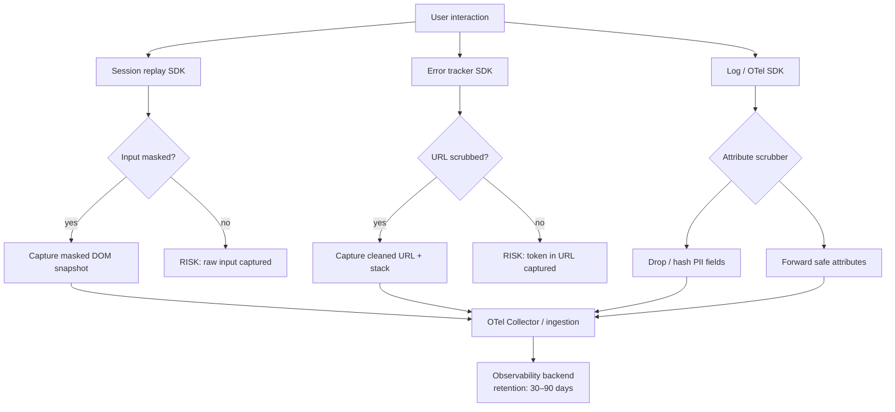

# Privacy-Respecting Observability

Observability tooling — error trackers, session replay tools, log pipelines,
real user monitoring — are among the most data-hungry systems a web
application operates. They are also among the most likely to ingest user
data by accident. A session replay captures every keystroke in a payment
form before a developer realizes the input is not masked. A structured log
ships the user's email address as a request parameter. An error report
includes a full stack trace with URL fragments containing OAuth tokens.
Each of these is a data collection decision that was never consciously made.

Privacy-respecting observability is not about collecting less. It is about
collecting deliberately: knowing what data each tool ingests, applying
masking and scrubbing before data leaves the browser, and matching data
retention to the minimum necessary for the diagnostic purpose. The default
configuration of most observability SDKs is designed for completeness, not
for privacy. Teams must override these defaults rather than accept them.

Regulatory context matters. GDPR requires a lawful basis for processing
personal data and grants data subjects the right to erasure. CCPA requires
disclosure of data sold to third parties, which observability SaaS platforms
may qualify as. HIPAA applies if the application handles protected health
information and the observability tool ingests PHI. These regulations do
not prohibit observability — they require that the data collected can be
justified, is protected appropriately, and can be deleted on request.

This article covers the categories of personal data that observability
tools commonly collect, techniques for masking and scrubbing at the SDK
level, data minimization patterns for structured logs and traces, and
organizational controls that make privacy compliance sustainable.

## Principle

Observability data collection MUST be reviewed against the categories of
personal data each tool may ingest before a tool is deployed to production.
Personal data in observability pipelines MUST be masked at the point of
collection — in the browser SDK or logging call — rather than relying on
post-ingestion data governance. Sensitive fields MUST NOT appear in logs,
traces, or session replays in any form that could identify or re-identify
an individual. Retention periods MUST be set to the shortest interval
that satisfies the diagnostic purpose of the data.

## Design Thinking

### What observability tools commonly collect

Session replay tools are the highest-risk category. By default, they
record all DOM content visible on screen, all text entered into form
fields, mouse movement paths, and click coordinates. A session replay
tool with default settings on a checkout page records credit card numbers,
billing addresses, and CVV fields as the user types. Even masked fields
visible in the DOM as bullet characters may be recorded in their actual
values if the tool intercepts the input event rather than the rendered DOM.

Error trackers commonly capture the full URL at the time of the error,
including query parameters and URL hash fragments. OAuth redirect flows
pass `access_token` or `code` parameters in the URL. A single uncaught
exception during a login redirect can submit an access token to the error
tracker's backend. Error trackers also capture `navigator` properties,
cookies in some configurations, and localStorage values when asked to
include breadcrumb state.

Structured logging is less obviously risky but frequently surfaces personal
data. API client libraries that log request and response bodies will log
user-submitted form data. ORM debug logging in server-side rendered
applications will log query parameters that include user IDs, emails,
or search terms. Log aggregators that accept full HTTP headers will
receive Authorization headers containing bearer tokens.

Real user monitoring tools record timing data, page URLs, and user agent
strings. Page URLs often contain user-specific identifiers — `/users/12345/settings`
exposes a user ID. User agent strings, combined with IP addresses (which
RUM tools often collect), can re-identify individuals through device
fingerprinting.

Distributed traces carry span attributes. Attributes set on HTTP request
spans often include full URL paths, query parameters, and response codes.
If a request URL contains a user identifier or a search query entered by
the user, the attribute is personal data stored in the trace backend.

### Masking personal data in session replay tools

Every major session replay tool provides input masking configuration.
The correct default is privacy-first: mask all inputs by default and
selectively unmask fields that contain no personal data. The reverse
approach — unmask all and selectively mask — requires ongoing maintenance
as new form fields are added, and any missed field becomes a data leak.

CSS-class-based masking is the most portable pattern. Designating a CSS
class — conventionally `.pii`, `.masked`, or `.rr-mask` — as the masking
selector means that any element with that class is excluded from the
session replay recording at the DOM level, before the tool transmits
the snapshot. Backend developers adding new form fields must be
instructed to apply the masking class to any field that accepts personal
data.

Network request recording, if enabled, requires explicit allowlisting of
response bodies that are safe to record. Recording all network responses
by default captures API responses that may contain user profile data,
payment information, or messages. Response body recording should be
disabled by default and enabled only for non-authenticated, non-personal
API endpoints where the diagnostic value is clear.

Canvas and shadow DOM elements require separate masking configurations.
Observability tools that capture canvas content may record custom-rendered
payment inputs (which some payment providers use to avoid direct DOM
access). Shadow DOM components used for sensitive forms should be
verified against the tool's shadow DOM capture behavior.

### Scrubbing personal data from logs and traces

Log scrubbing operates at the transport layer: before a log event is
transmitted, a scrubbing function inspects the event payload and replaces
or removes personal data. Common patterns are field-path exclusion (drop
the `user.email` field from every log event), value pattern replacement
(replace strings matching an email pattern with `[REDACTED]`), and
hash replacement (replace a user identifier with a deterministic hash to
preserve correlability without exposing the raw value).

Pattern-based scrubbing is error-prone when applied to free-form fields.
A log message that contains "Request failed for john@example.com" is not
identified by a field-path exclusion rule. Teams relying solely on
pattern matching must maintain regex patterns covering all personal data
formats — an inherently incomplete list. Structural controls are more
reliable: logging frameworks that serialize structured data objects rather
than formatting strings into messages make field-path exclusion reliable
and comprehensive.

OpenTelemetry's attribute scrubbing can be applied in the Collector
pipeline using the `transform` processor. The Collector can drop, hash,
or replace span attributes matching specified patterns before forwarding
to the observability backend. This centralizes scrubbing in the
infrastructure rather than distributing it across every SDK integration,
reducing the risk of a missed scrubbing rule in one service.

For browser-side logs and traces, scrubbing must happen before the data
leaves the browser. OTel SDK span processors can apply attribute filtering
as a custom `SpanProcessor` in the browser: before each span is exported,
the processor inspects span attributes and redacts values that match
sensitive field names or patterns.

### Data minimization for structured logs

Data minimization — collecting only what is necessary — is more effective
than scrubbing because it eliminates the need to identify and remove data
after collection. The question to ask before adding any field to a log
event is: what diagnostic decision does this field enable that could not
be made without it?

User identifiers in logs serve correlation: linking multiple log events
to the same user session. A session-scoped correlation ID — a random
UUID generated at session start and included in all log events — provides
the same correlation capability without exposing a persistent user
identifier. If regulatory requirements later mandate deletion of a user's
data, the correlation ID can be deleted without affecting the user's
account.

Request and response body logging should be off by default. When enabled
for debugging, it should be restricted to non-authenticated endpoints or
to endpoints where the team has verified that the response body contains
no personal data. Staging and development environments may enable body
logging more broadly, but this must not carry over to production through
shared configuration.

### Consent and opt-out mechanics

Some jurisdictions and application contexts require user consent before
observability tools are activated. Cookie consent frameworks often include
analytics cookies and tracking scripts in their scope, but session replay
and error tracking may be governed separately if they process personal data.

The practical implementation is deferred SDK initialization: the
observability SDK script is loaded but not initialized until the user's
consent state is confirmed. If the user has not consented to the relevant
category, the SDK remains dormant. If consent is granted, the SDK is
initialized with the appropriate masking configuration. If consent is
revoked, the SDK is destroyed and future sessions do not collect data.

For applications that do not use consent-based activation, a
site-wide opt-out mechanism satisfies GDPR's data subject rights in
some interpretations: a user can request that their session data not
be collected, and the opt-out is stored in a first-party cookie that
the SDK checks at initialization. The legal basis and applicability
of this approach must be confirmed with legal counsel.

### Retention and deletion

Observability data that contains personal data is subject to data subject
rights: the right to access, rectification, and erasure. Most observability
SaaS backends provide retention period configuration. Setting the retention
period to the minimum required for incident response — commonly 30 to 90
days for session replays and 90 to 180 days for error events — limits the
exposure window.

Deletion requests from users require a mechanism to identify and remove
their data from the observability backend. If user identifiers are included
in span attributes or log events, the observability tool must support
deletion by user identifier. Tools that do not support this require an
operational workaround: storing the mapping of user ID to session ID
independently and submitting session-level deletion requests.

## Best Practices

**MUST** review the default data collection behavior of each observability
SDK before deploying to production. Defaults are optimized for completeness,
not for privacy. Explicitly configure input masking, network request
filtering, and breadcrumb sanitization before the SDK goes live.

**MUST NOT** allow URL hash fragments or query parameters containing tokens,
codes, or user identifiers to be transmitted to observability backends.
Configure URL scrubbing to strip these segments before the URL is captured
as a span attribute, log field, or session replay breadcrumb.

**SHOULD** adopt a privacy-first masking default for session replay: mask
all inputs by default and maintain an explicit allowlist of fields that
are safe to record. Do not rely on developers to remember to add masking
annotations to new form fields.

**SHOULD** implement log and trace scrubbing at the collection point —
the browser SDK or server-side logging call — rather than relying on
post-ingestion pipeline processing. Data that reaches the ingestion
backend, even temporarily, is at risk.

**MUST** configure observability data retention to the minimum period
that satisfies the diagnostic purpose. Session replays retained for 12
months serve no incident response purpose and increase regulatory exposure.

**SHOULD** use session-scoped correlation IDs rather than persistent user
identifiers in logs and traces. Correlation IDs provide the same linkage
capability with a shorter personal data lifecycle.

## Visual



## Example

```typescript
// src/telemetry/privacy-span-processor.ts
// Custom OTel SpanProcessor that scrubs PII from span attributes
// before export. Register this before BatchSpanProcessor.

import {
  SpanProcessor,
  ReadableSpan,
  Span,
  SpanExporter,
  ExportResult,
} from '@opentelemetry/sdk-trace-base';
import { Context } from '@opentelemetry/api';

const SENSITIVE_ATTRIBUTE_KEYS = new Set([
  'http.request.header.authorization',
  'http.request.header.cookie',
  'user.email',
  'user.phone',
  'enduser.email',
]);

// Patterns that indicate a value should be redacted regardless of key
const SENSITIVE_VALUE_PATTERNS: RegExp[] = [
  /\b[A-Z0-9._%+-]+@[A-Z0-9.-]+\.[A-Z]{2,}\b/i, // email
  /access_token=[^&]+/i,
  /code=[a-z0-9_-]{20,}/i,
];

function scrubAttributes(
  attributes: Record<string, unknown>,
): Record<string, unknown> {
  const result: Record<string, unknown> = {};
  for (const [key, value] of Object.entries(attributes)) {
    if (SENSITIVE_ATTRIBUTE_KEYS.has(key)) {
      result[key] = '[REDACTED]';
      continue;
    }
    if (typeof value === 'string') {
      const isSensitive = SENSITIVE_VALUE_PATTERNS.some((p) => p.test(value));
      result[key] = isSensitive ? '[REDACTED]' : value;
    } else {
      result[key] = value;
    }
  }
  return result;
}

export class PrivacySpanProcessor implements SpanProcessor {
  onStart(_span: Span, _parentContext: Context): void {}

  onEnd(span: ReadableSpan): void {
    // Mutate attributes in place before the span reaches the exporter
    const attrs = span.attributes as Record<string, unknown>;
    const scrubbed = scrubAttributes(attrs);
    Object.assign(attrs, scrubbed);
  }

  shutdown(): Promise<void> {
    return Promise.resolve();
  }

  forceFlush(): Promise<void> {
    return Promise.resolve();
  }
}

// Registration in setup.ts:
// provider.addSpanProcessor(new PrivacySpanProcessor());
// provider.addSpanProcessor(new BatchSpanProcessor(exporter));
```

## Common Mistakes

- Accepting the default SDK configuration without reviewing what data it
  collects — most tools default to maximum capture for developer convenience
- Using a blocklist for session replay input masking instead of an
  allowlist — any newly added form field is unmasked until someone notices
- Logging full request URLs including query parameters — tokens and user
  identifiers appear in URLs in OAuth flows, search forms, and pagination
- Assuming the OTel Collector handles all scrubbing — browser-side spans
  reach the Collector already formed; fields set incorrectly in the browser
  must be scrubbed browser-side
- Retaining session replay data for months without a diagnostic justification
  — long retention periods increase the regulatory exposure window without
  adding incident response value
- Omitting observability tools from the data processing inventory —
  regulators and auditors expect all personal data processors to be
  documented, including SaaS observability providers

## Related FEEs

- FEE-1400: Structured Logging Fundamentals
- FEE-1403: Error Tracking & Source Maps
- FEE-1408: OpenTelemetry Trace Correlation in the Browser

## References

- [GDPR Article 5: Principles relating to processing of personal data](https://gdpr-info.eu/art-5-gdpr/)
- [OWASP: Logging Cheat Sheet](https://cheatsheetseries.owasp.org/cheatsheets/Logging_Cheat_Sheet.html)
- [OpenTelemetry: Attribute Naming Conventions](https://opentelemetry.io/docs/specs/semconv/)
- [PostHog: Session Replay Privacy Controls](https://posthog.com/docs/session-replay/privacy)
- [Datadog: Session Replay Privacy Options](https://docs.datadoghq.com/real_user_monitoring/session_replay/privacy_options/)
- [W3C: Privacy Principles](https://w3ctag.github.io/privacy-principles/)
