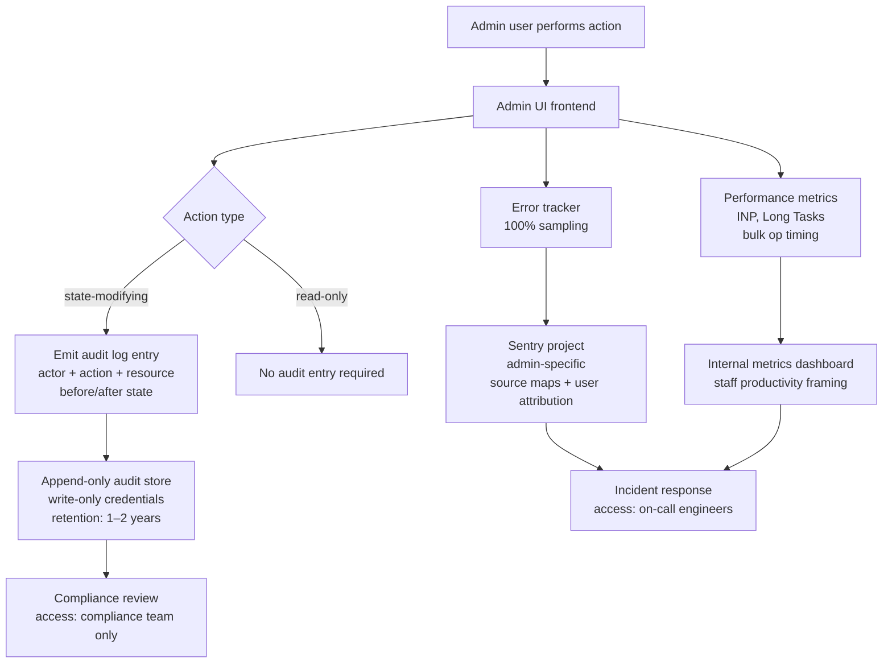

# Observability for Internal Tools & Admin UIs

Internal tools and admin panels occupy an unusual position in the
observability hierarchy: they affect the most sensitive operations in a
system — bulk data edits, permission changes, customer account management,
feature flag overrides — and yet are routinely the least instrumented part
of a frontend codebase. The reasoning is understandable: internal tools
have a small user base, development timelines are shorter, and the cost of
defects is assumed to be lower. In practice, the cost of defects in admin
tooling is often higher. A bug in a customer-facing UI affects one customer.
A bug in an admin action can affect thousands of records.

The observability requirements for internal tools differ from customer-facing
applications in ways that matter for implementation. The user population is
small and known — every user has a named account with organizational
attribution. Every action has intentionality: a staff member making a bulk
update is doing so deliberately, which means every action is attributable.
The relevant questions are not "how many users encountered this error" but
"who did what, in what order, at what time, and what was the outcome."

Audit logging is the primary observability artifact for internal tooling.
An audit log records who performed an action, what the action was, what
data was affected, and what the before-and-after state was. This is
distinct from structured application logging (which records system events)
and from error tracking (which records failures). An audit log is a
compliance and accountability record, not just a debugging aid.

This article covers the design of audit logging for admin actions, error
monitoring calibrated for small internal user bases, performance observability
suited to power users with high interaction rates, and the organizational
controls that make internal tool observability maintainable.

## Design Thinking

### Audit logging: scope, content, and storage

An audit log entry has four required dimensions: who, what, when, and which
resource. "Who" is the authenticated user making the request — their internal
user ID, display name, and organizational role at the time of the action.
"What" is the action classification: create, update, delete, export, approve,
revoke, or a domain-specific verb. "When" is an ISO 8601 timestamp with UTC
timezone and millisecond precision. "Which resource" is the type and
identifier of the affected entity — `user:12345`, `order:67890`, or
`feature_flag:payments-v2`.

Before-and-after state capture distinguishes a useful audit log from a
compliance checkbox. An entry that records "updated user permissions" is
less useful than one that records "permissions changed from `[viewer]` to
`[editor, billing_admin]`". Serializing the full before-and-after JSON
diff enables reconstruction of any state at any point in time. For large
entities, recording the diff — only changed fields — is preferable to
recording the full object twice.

Bulk operations require special handling. A bulk action that modifies 500
records generates 500 individual state changes but logically represents one
intentional operation by the administrator. The audit log should record the
bulk operation as a single top-level entry with the actor, the action, the
count of affected records, and the parameters of the operation — plus a
reference to a bulk detail log that contains each individual change. This
structure makes it possible to answer "what did this admin do?" at the
operation level without being overwhelmed by volume at the event level.

Audit logs must be write-once from the perspective of the system under audit.
The administrative interface should not be able to delete or modify its own
audit log entries. Architecturally, the audit log is typically stored in a
separate database or append-only log store with write-only credentials from
the application layer. Audit log deletion, if supported at all, requires
explicit out-of-band authorization.

The retention requirement for audit logs is typically longer than for
application logs. Many compliance frameworks specify a minimum retention
of one or two years for audit records. Unlike session replay data, audit
logs do not generally contain personal data beyond what was already in the
affected records — the data subject whose record was modified already has
rights over that data through the primary system.

### Error monitoring calibrated for internal tools

Customer-facing applications often use sampling for error tracking because
the user base is large and sampled errors provide statistically reliable
signal. Internal tools should use 100% error capture because the user base
is small — often fewer than 50 to 500 concurrent users — and each error
represents a concrete failure for a named person performing a real task.

Alert thresholds for internal tool error rates should be lower than for
customer-facing applications. An error rate of 1% in a tool with 50 active
users means one user in 50 is experiencing an error per session. This may
not trigger an alert configured for a threshold appropriate to a 10,000-user
application, yet it represents a completely broken workflow for a staff
member. Alert thresholds should be expressed in absolute error counts — "any
error affecting a named user triggers an alert" — rather than rates.

Error context for internal tools should include the full user attribution:
the authenticated user's identity, their role, and the operation they were
performing when the error occurred. In a customer-facing application, user
identity in error reports creates privacy concerns. In an admin tool where
every user is a named staff member and every action is intentional, user
identity is essential context — it tells the responding engineer exactly
who is affected and what operation is broken.

Stack traces from admin UIs should resolve correctly against source maps
deployed alongside the admin bundle. Admin tools are frequently served from
a separate deployment with a separate build artifact and asset path. A
shared Sentry project that does not have the correct source map artifact
for the admin build will produce unresolved stack traces that are useless
for debugging. Source map upload must be configured separately for every
distinct deployment.

### Performance observability for power users

Admin users have different interaction patterns than customers. A customer
might use an application for 5 to 15 minutes per session, navigate a linear
flow, and perform one or two data mutations. An admin user might work in the
tool for 4 to 8 hours continuously, perform hundreds of data mutations,
use keyboard shortcuts, and navigate between tables and detail views rapidly.

Performance instrumentation should reflect these patterns. Measuring First
Contentful Paint is less relevant for an admin tool that users have already
loaded in a persistent tab. Long Task duration and interaction-to-next-paint
(INP) are more relevant: they measure the responsiveness of the UI during
active, high-frequency use. Bulk operation progress — the time from initiating
a 500-record update to receiving the first result and then the final result —
is a workflow-level metric that has no equivalent in customer-facing tooling.

Data table performance is the most common performance bottleneck in admin
tools. Tables that render hundreds of rows without virtualization produce
long layout and paint tasks that freeze the UI under normal admin workloads.
Core Web Vitals tooling does not flag this because the initial page load is
fast — only continuous use reveals the problem. Custom metrics that measure
table render time, filter-apply latency, and row-selection latency under
large dataset sizes are more diagnostic than standard CWV metrics for
this class of UI.

Performance budgets for admin tools should be set relative to the impact on
staff productivity. A 200ms delay per action in a tool where a user performs
200 actions per day adds 40 seconds of cumulative wait time. A 500ms delay
in the same context adds over 100 seconds. Framing performance in terms of
staff time per day makes the budget concrete and connects it to cost.

### Access controls for internal tool observability data

Observability data from internal tools is itself sensitive. An audit log
that records every admin action is a complete record of organizational
operations. Error reports that include full user attribution and the
state of the data they were modifying are more sensitive than the application
logs of a customer-facing product. Access to internal tool observability
data should be restricted to personnel who need it for incident response,
compliance review, or engineering debugging.

In practice, this means configuring separate Sentry projects, separate log
indexes, and separate dashboard permissions for internal tooling, rather
than aggregating all observability data into shared projects where it is
accessible to all engineers. The principle is: access to observability
data about admin operations should require the same organizational approval
as access to the admin tool itself.

Audit log access in particular should follow the principle of least privilege.
Compliance officers may need read access to audit logs for specific time
ranges. Engineering may need access to diagnose a specific incident.
Neither should have unrestricted ongoing access. Query interfaces to audit
logs should themselves be logged — who queried the audit log, for what
time range, with what filters — to prevent the audit log from becoming a
surveillance tool turned back on the staff it monitors.

## Best Practices

**MUST** record a structured audit log entry for every state-modifying admin
action: create, update, delete, bulk modify, permission change, and data
export. Actions that do not appear in the audit log are invisible to
compliance review and incident investigation.

**MUST** include before-and-after state in audit log entries for update
and delete actions. An entry that records "updated" without recording what
changed is insufficient for reconstructing the state at a given point in time.

**MUST NOT** allow the admin UI application layer to delete or modify its own
audit log entries. Audit log integrity depends on the log being write-once
from the application's perspective. Do not grant the application's service
account deletion permissions on the audit log store.

**SHOULD** focus performance monitoring on high-interaction workflows — bulk operations, data table rendering and filtering, complex multi-step form flows — rather than on standard Core Web Vitals metrics calibrated for customer-facing pages. Admin users work in tools for hours at high interaction rates; First Contentful Paint is rarely the bottleneck. Long Task duration, INP, and workflow-level timing (time from initiating a 500-record bulk update to receiving the final result) are the metrics that reflect real staff productivity impact.

**SHOULD** use 100% error capture sampling for internal tools rather than the
percentage-based sampling appropriate for high-volume customer-facing
applications. Every error in an internal tool affects a named person
performing a real task.

**SHOULD** set error alerting on absolute counts rather than rates for
internal tools. A 1% error rate in a 50-user tool is one broken session —
a rate-based threshold tuned for large applications will miss it.

**SHOULD** configure source map upload separately for admin bundle deployments.
Admin tools served from a different deployment path require their own source
map artifact upload to resolve stack traces in error reports.

**SHOULD** store audit logs and internal tool error data in separate access-
controlled projects or indexes rather than aggregating them with customer-
facing observability data.

## Visual



## Example

```typescript
// src/admin/audit-logger.ts
// Structured audit log client for admin UI actions.
// Sends to a backend endpoint that writes to the append-only audit store.

export type AuditAction =
  | 'create'
  | 'update'
  | 'delete'
  | 'bulk_update'
  | 'export'
  | 'permission_change';

export interface AuditEntry<T = unknown> {
  actor: {
    userId: string;
    displayName: string;
    role: string;
  };
  action: AuditAction;
  resource: {
    type: string; // e.g., 'user', 'order', 'feature_flag'
    id: string;
  };
  timestamp: string; // ISO 8601 UTC
  before?: T;
  after?: T;
  metadata?: Record<string, string | number | boolean>;
}

async function logAuditEvent<T>(entry: AuditEntry<T>): Promise<void> {
  await fetch('/api/audit-log', {
    method: 'POST',
    headers: { 'Content-Type': 'application/json' },
    body: JSON.stringify(entry),
  });
}

// Usage: updating a user's role
// const before = { roles: ['viewer'] };
// const after = { roles: ['editor', 'billing_admin'] };
// await logAuditEvent({
//   actor: { userId: currentUser.id, displayName: currentUser.name, role: currentUser.role },
//   action: 'permission_change',
//   resource: { type: 'user', id: targetUserId },
//   timestamp: new Date().toISOString(),
//   before,
//   after,
// });

// Bulk operation example:
// await logAuditEvent({
//   actor: { userId: currentUser.id, displayName: currentUser.name, role: currentUser.role },
//   action: 'bulk_update',
//   resource: { type: 'order', id: 'bulk' },
//   timestamp: new Date().toISOString(),
//   metadata: {
//     count: selectedOrderIds.length,
//     field: 'status',
//     newValue: 'cancelled',
//     reason: cancellationReason,
//   },
// });
```

## Common Mistakes

- Treating internal tools as exempt from observability because the user base
  is small — small user bases and high-impact actions make each error more
  consequential, not less
- Using rate-based error alert thresholds from customer-facing applications
  without adjustment — thresholds calibrated for 10,000 users will never
  fire for errors affecting 50 staff members
- Recording "what" without recording before-and-after state in audit logs —
  an entry that says "updated permissions" without the change detail is
  insufficient for incident reconstruction
- Aggregating admin tool observability data into shared projects accessible
  to all engineers — audit logs of admin actions warrant stricter access
  control than general application logs
- Forgetting to upload source maps for admin bundle deployments separately —
  admin tools often have a separate deployment path; shared source map
  configurations for the customer-facing app will not resolve admin stack traces
- Applying percentage-based error sampling to internal tools — in a 50-user
  internal tool, 10% sampling means errors occurring fewer than 10 times
  are likely never reported

## Related FEEs

- FEE-1400: Structured Logging Fundamentals
- FEE-1403: Error Tracking & Source Maps
- FEE-1409: Privacy-Respecting Observability

## References

- [OWASP: Logging Cheat Sheet](https://cheatsheetseries.owasp.org/cheatsheets/Logging_Cheat_Sheet.html)
- [SOC 2: Audit Logging Requirements](https://www.aicpa.org/resources/landing/system-and-organization-controls-soc-suite-of-services)
- [Sentry: User Feedback and Attribution](https://docs.sentry.io/platforms/javascript/user-feedback/)
- [web.dev: Interaction to Next Paint (INP)](https://web.dev/inp/)
- [NIST SP 800-92: Guide to Computer Security Log Management](https://csrc.nist.gov/publications/detail/sp/800-92/final)
