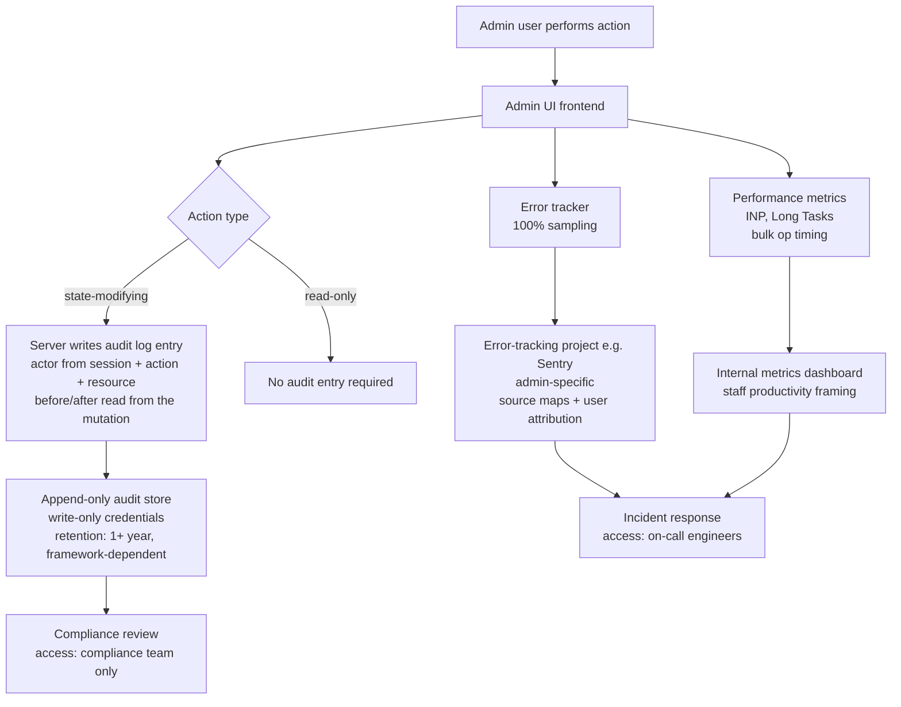

# [FEE-1410] Observability for Internal Tools & Admin UIs

:::info
Internal tools and admin panels run a system's most sensitive operations:
bulk data edits, permission changes, customer account management, feature
flag overrides. They are also the least instrumented part of most frontend
codebases, because teams assume a small user base means low risk. A bug in
a customer-facing UI affects one customer. A bug in an admin bulk-edit
action can affect thousands of records in a single click. Internal tools
need their own calibration for audit logging, error monitoring, and
performance observability, not a scaled-down copy of the consumer
playbook.
:::

## Context

Most observability guidance targets customer-facing products: sampled
error tracking, Core Web Vitals, and error context stripped of personal
data to limit privacy exposure. That guidance assumes a large, anonymous
population where a single user's session is statistically replaceable.
Internal tools invert those assumptions: every account belongs to a named
person with an organizational role, and every action is deliberate rather
than incidental. The relevant question shifts from how many users hit an
error to who did what, in what order, and what changed as a result. This
article covers audit logging for admin actions, error monitoring
calibrated for small known populations, performance observability for
power users, and the access controls that keep that data from becoming a
liability of its own.

## Visual



## Example

The audit record is only trustworthy if it is written by a party the
client cannot forge. The browser must never be the source of truth for
`actor` or for `before`/`after` state: a malicious or buggy client could
report a different user, a different role, or a diff that does not match
what actually happened. The authoritative audit entry has to be
constructed on the server, from the authenticated session and the
mutation the server actually performed, not from a payload the frontend
assembles and POSTs on its own.

The example below is a server-side route handler for updating a user's
role. It reads the actor from the authenticated session rather than the
request body, reads the "before" state from the database immediately
before the write, and reads the "after" state from the result of the
write itself.

```typescript
// src/api/routes/update-user-role.ts
// Server-side handler for a state-modifying admin action. The audit entry
// is built here, not on the client, because the server is the only party
// that can be trusted to report who the actor is and what changed.

import type { AuthenticatedRequest, Response } from '../types';
import { writeAuditEntry } from '../audit/audit-store';
import { db } from '../db';

export type AuditAction =
  | 'create'
  | 'update'
  | 'delete'
  | 'bulk_update'
  | 'export'
  | 'permission_change';

export interface AuditEntry<T = unknown> {
  actor: { userId: string; displayName: string; role: string };
  action: AuditAction;
  resource: { type: string; id: string };
  timestamp: string; // ISO 8601 UTC
  before?: T;
  after?: T;
  metadata?: Record<string, string | number | boolean>;
}

export async function updateUserRole(req: AuthenticatedRequest, res: Response) {
  // req.session.user comes from the server's own session store. A client
  // cannot set or forge this value by editing the request body.
  const actor = req.session.user;
  const { targetUserId, roles: requestedRoles } = req.body;

  const before = await db.user.findUnique({ where: { id: targetUserId } });
  const after = await db.user.update({
    where: { id: targetUserId },
    data: { roles: requestedRoles },
  });

  await writeAuditEntry<{ roles: string[] }>({
    actor: { userId: actor.id, displayName: actor.name, role: actor.role },
    action: 'permission_change',
    resource: { type: 'user', id: targetUserId },
    timestamp: new Date().toISOString(),
    before: { roles: before?.roles ?? [] },
    after: { roles: after.roles },
  });

  res.json(after);
}
```

The frontend's role is limited to calling the business endpoint
(`PATCH /api/admin/user-roles` here, with `{ targetUserId, roles }` in the
request body) with the requested change. The server builds the
`AuditEntry`, resolves the actor from its own session, and
computes the `before`/`after` diff. Bulk operations follow the
same pattern: the server writes one top-level audit entry per bulk
request plus a detail entry per affected record, using the actor from its
own session and the records it actually wrote, not a count or diff
supplied by the client.

## Best Practices

**MUST** record a structured audit log entry for every state-modifying admin
action: create, update, delete, bulk modify, permission change, and data
export. Actions that do not appear in the audit log are invisible to
compliance review and incident investigation.

**MUST** include before-and-after state in audit log entries for update
and delete actions. An entry that records "updated" without recording what
changed is insufficient for reconstructing the state at a given point in time.

**MUST NOT** allow the admin UI application layer to delete or modify its own
audit log entries. Audit log integrity depends on the log being write-once
from the application's perspective. Do not grant the application's service
account deletion permissions on the audit log store, and do not build an
editing interface for audit records anywhere in the application layer.

**SHOULD** focus performance monitoring on high-interaction workflows: bulk
operations, data table rendering and filtering, and complex multi-step form
flows, rather than on standard Core Web Vitals metrics calibrated for
customer-facing pages. Admin users work in tools for hours at high
interaction rates; First Contentful Paint is rarely the bottleneck. Long
Task duration, interaction-to-next-paint (INP), and workflow-level timing
(time from initiating a 500-record bulk update to receiving the final
result) are the metrics that reflect real staff productivity impact.

**SHOULD** use 100% error capture sampling for internal tools rather than the
percentage-based sampling appropriate for high-volume customer-facing
applications. Every error in an internal tool affects a named person
performing a real task.

**SHOULD** set error alerting on absolute counts rather than rates for
internal tools. A 1% error rate in a 50-user tool is one broken session;
a rate-based threshold tuned for large applications will miss it.

**SHOULD** configure source map upload separately for admin bundle deployments.
Admin tools served from a different deployment path require their own source
map artifact upload to resolve stack traces in error reports.

**SHOULD** store audit logs and internal tool error data in separate access-
controlled projects or indexes rather than aggregating them with customer-
facing observability data.

## Design Thinking

### Audit logging: scope, content, and storage

An audit log entry has four required dimensions: who, what, when, and which
resource. "Who" is the authenticated user making the request: their internal
user ID, display name, and organizational role at the time of the action.
"What" is the action classification: create, update, delete, export, approve,
revoke, or a domain-specific verb. "When" is an ISO 8601 timestamp with UTC
timezone and millisecond precision. "Which resource" is the type and
identifier of the affected entity: `user:12345`, `order:67890`, or
`feature_flag:payments-v2`.

An audit entry that records "updated user permissions" is far less useful
than one that records "permissions changed from `[viewer]` to
`[editor, billing_admin]`". Serializing the full before-and-after JSON
diff enables reconstruction of any state at any point in time. For large
entities, recording only the changed fields (the diff) is preferable to
storing the full object twice.

Bulk operations require special handling. A bulk action that modifies 500
records generates 500 individual state changes but logically represents one
intentional operation by the administrator. The audit log should record the
bulk operation as a single top-level entry with the actor, the action, the
count of affected records, and the parameters of the operation, plus a
reference to a bulk detail log that contains each individual change. This
structure makes it possible to answer "what did this admin do?" at the
operation level without being overwhelmed by volume at the event level.

Audit logs must be write-once from the perspective of the system under audit.
The administrative interface should not be able to delete or modify its own
audit log entries. Architecturally, the audit log is typically stored in a
separate database or append-only log store with write-only credentials from
the application layer. Audit log deletion, if supported at all, requires
explicit out-of-band authorization.

The retention requirement for audit logs is typically longer than for
application logs. PCI DSS Requirement 10 sets a concrete example: systems
handling cardholder data must retain audit log history for at least one
year, with the most recent three months immediately available for
analysis. SOC 2 does not mandate a fixed retention period, but the control
review period an auditor evaluates commonly spans six to twelve months, so
retaining audit logs at least that long is a practical minimum even
without a hard requirement. Unlike session replay data, audit logs do not
generally contain personal data beyond what was already in the affected
records. The data subject whose record was modified already has rights
over that data through the primary system.

### Error monitoring calibrated for internal tools

Customer-facing applications often use sampling for error tracking because
the user base is large and sampled errors provide statistically reliable
signal. Internal tools should use 100% error capture instead. The user base
is small and bounded, typically dozens to a few hundred named staff rather
than the anonymous public a consumer app serves, and each error represents
a concrete failure for a named person performing a real task.

Alert thresholds for internal tool error rates should be lower than for
customer-facing applications. Consider a tool with 50 active users: a 1%
error rate means one user in 50 is experiencing an error per session. A
threshold tuned for a 10,000-user application would not fire on that
number, yet it represents a completely broken workflow for a staff member.
Alert thresholds should be expressed in absolute error counts rather than
rates. Any error affecting a named user should trigger an alert.

Error context for internal tools should include the full user attribution:
the authenticated user's identity, their role, and the operation they were
performing when the error occurred. In a customer-facing application, user
identity in error reports creates privacy concerns. In an admin tool where
every user is a named staff member and every action is intentional, user
identity is essential context: it tells the responding engineer exactly
who is affected and what operation is broken.

Stack traces from admin UIs should resolve correctly against source maps
deployed alongside the admin bundle. Admin tools are frequently served from
a separate deployment with a separate build artifact and asset path. A
shared error-tracking project (in Sentry or a similar tool) that lacks the
correct source map artifact for the admin build will produce unresolved
stack traces that are useless for debugging. Source map upload must be
configured separately for every distinct deployment.

### Performance observability for power users

Admin users have different interaction patterns than customers. Consider
two contrasting sessions: a customer who opens the app briefly to complete
one task and leaves, versus an admin who keeps the tool open for most of
the working day, issuing a continuous stream of mutations, using keyboard
shortcuts, and moving between tables and detail views without a pause.

Performance instrumentation should reflect these patterns. Measuring First
Contentful Paint is less relevant for an admin tool that users have already
loaded in a persistent tab. Long Task duration and INP are more relevant:
they measure the responsiveness of the UI during active, high-frequency
use. Bulk operation progress (the time from
initiating a 500-record update to receiving the first result, then the
final result) is a workflow-level metric with no equivalent in
customer-facing tooling.

Data table performance is the most common performance bottleneck in admin
tools. Tables that render hundreds of rows without virtualization produce
long layout and paint tasks that freeze the UI under normal admin workloads.
Core Web Vitals tooling does not flag this: the initial page load is fast,
and only continuous use reveals the problem. Custom metrics that measure
table render time, filter-apply latency, and row-selection latency under
large dataset sizes are more diagnostic than standard CWV metrics for
this class of UI.

Performance budgets for admin tools should be set relative to the impact on
staff productivity. A 200ms delay per action in a tool where a user performs
200 actions per day adds 40 seconds of cumulative wait time; a 500ms delay
in the same context adds over 100 seconds. Customer-facing applications
frame performance against conversion and bounce rate, where a slower page
load has a directly measurable effect on completed purchases. Admin tools
have no equivalent conversion funnel, so staff time is the unit that makes
the budget concrete. Multiplied across a team, the effect compounds: a team
of 30 admins each losing 40 seconds a day to a 200ms delay loses 20 minutes
of collective working time daily, before accounting for the cost of
context-switching when a delayed response pulls someone's attention to
another task.

### Access controls for internal tool observability data

Observability data from internal tools is itself sensitive. An audit log
that records every admin action is a complete record of organizational
operations. Error reports that include full user attribution and the
state of the data they were modifying are more sensitive than the application
logs of a customer-facing product. Access to internal tool observability
data should be restricted to personnel who need it for incident response,
compliance review, or engineering debugging.

In practice, this means configuring a separate error-tracking project (for
example, a dedicated Sentry project), separate log indexes, and separate
dashboard permissions for internal tooling, rather than aggregating all
observability data into shared projects accessible to every engineer. The
principle is: access to observability data about admin operations should
require the same organizational approval as access to the admin tool itself.

Audit log access in particular should follow the principle of least privilege.
Compliance officers may need read access to audit logs for specific time
ranges. Engineering may need access to diagnose a specific incident.
Neither should have unrestricted ongoing access. Query interfaces to audit
logs should themselves be logged (who queried, for what time range, with
what filters) to prevent the audit log from becoming a surveillance tool
turned back on the staff it monitors.

## Common Mistakes

- Treating internal tools as exempt from observability because the user base
  is small. A small user base combined with high-impact actions makes each
  error more consequential, not less.
- Using rate-based error alert thresholds from customer-facing applications
  without adjustment. A threshold calibrated for 10,000 users will never
  fire for errors affecting 50 staff members.
- Recording "what" happened without recording the before-and-after state in
  audit logs. An entry that says "updated permissions" without the change
  detail is insufficient for incident reconstruction.
- Aggregating admin tool observability data into shared projects accessible
  to all engineers. Audit logs of admin actions warrant stricter access
  control than general application logs.
- Forgetting to upload source maps for admin bundle deployments separately.
  Admin tools often have a separate deployment path, and a shared source
  map configuration for the customer-facing app will not resolve admin
  stack traces.
- Applying percentage-based error sampling to internal tools. In a 50-user
  internal tool, 10% sampling means errors occurring fewer than 10 times
  are likely never reported.

## Related Topics

- [Observability & Error Tracking Overview](/en/Observability%20and%20Error%20Tracking/1400)
- [Logging & Structured Logging](/en/Observability%20and%20Error%20Tracking/1403)
- [Privacy-Respecting Observability](/en/Observability%20and%20Error%20Tracking/1409)

## References

- OWASP, "Logging Cheat Sheet," OWASP Cheat Sheet Series. https://cheatsheetseries.owasp.org/cheatsheets/Logging_Cheat_Sheet.html
- AICPA & CIMA, "2018 SOC 2 Description Criteria (With Revised Implementation Guidance - 2022)," AICPA & CIMA Resources. https://www.aicpa-cima.com/resources/download/get-description-criteria-for-your-organizations-soc-2-r-report
- PCI Security Standards Council, "PCI DSS v4.0 Requirement 10.5.1: Retain Audit Log History for at Least 12 Months," PCI Security Standards Council (2024). https://www.pcisecuritystandards.org/document_library/
- Sentry, "Identify Users," Sentry Documentation. https://docs.sentry.io/platforms/javascript/enriching-events/identify-user/
- Jeremy Wagner and Barry Pollard, "Interaction to Next Paint (INP)," web.dev (2022, updated 2025). https://web.dev/inp/
- NIST, "SP 800-92: Guide to Computer Security Log Management," National Institute of Standards and Technology (2006). https://csrc.nist.gov/publications/detail/sp/800-92/final
- OpenTelemetry, "Semantic Conventions," OpenTelemetry Specification. https://opentelemetry.io/docs/specs/semconv/
