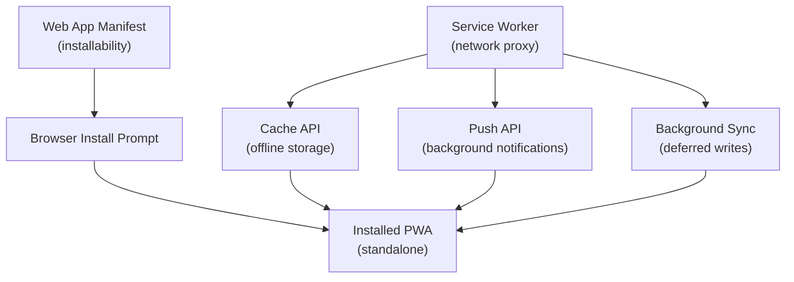

# [FEE-1300] Progressive Web Apps & Offline Overview

:::info
This category covers how web applications can match native app capabilities -- installability, offline access, background processing, and OS-level integration -- using open web standards. Topics span the Web App Manifest, service workers, caching strategies, push notifications, Background Sync, and production deployment patterns.
:::

## Introduction

Progressive Web Apps (PWAs) are web applications that use a layered set of modern browser APIs to deliver experiences that were previously only achievable with native mobile or desktop apps. The term "progressive" reflects the approach: a PWA is still a fully functional web page for browsers that do not support the advanced features, but it enhances incrementally as capabilities become available. Users on a supporting browser and operating system can install the app to their home screen, launch it without a URL bar, receive push notifications, and continue working when the network is unavailable -- all without visiting an app store.

The motivation for PWAs is rooted in the economics and friction of app distribution.
Native apps require separate codebases for iOS and Android, store submission reviews, mandatory update cycles, and an install step that causes significant drop-off.
Web apps eliminate these barriers, but they historically sacrificed discoverability, engagement mechanics (home screen presence, notifications), and offline reliability.
PWAs close that gap by bringing those engagement and reliability characteristics to the web, while retaining the web's distribution advantages: a URL, zero install friction, and a single codebase that works across platforms.

Browser and OS support for PWA APIs has matured significantly. Chromium-based browsers on Android, Windows, and ChromeOS offer full install, notification, and background capabilities.
Safari on iOS has expanded service worker support, added home screen installation (since iOS 16.4, including push notifications), and continues to close the gap with Chromium.
Desktop PWA support in Chrome and Edge means users on all major platforms can install web apps and interact with them through OS-level affordances like the taskbar, app shortcuts, and share targets.
Building with PWA techniques is no longer a niche decision -- it is a baseline consideration for any application that values engagement, reliability, and performance.

## Four Pillars of PWA

### Installability

Installability is the most visible PWA capability: the app appears on the user's home screen or taskbar and launches in its own window, without a browser URL bar, just like a native application. Two components make this possible.

The **Web App Manifest** (`manifest.json`) is a JSON file linked from the HTML document that declares the app's identity and launch behavior. It specifies the app's name, short name, icons (at multiple resolutions for different surfaces), a `start_url` that controls what page opens on launch, a `display` mode, and a `theme_color`. Browsers use this file to construct the install experience -- the icon on the home screen, the splash screen while the app loads, and the window chrome (or lack thereof) in standalone mode.

The **`beforeinstallprompt`** event fires in supporting browsers when the installability criteria are met: an HTTPS origin, a valid manifest with required fields, and a registered service worker. Application code can listen for this event, store the prompt reference, and defer showing the install UI until a contextually appropriate moment -- for example, after a user has completed a meaningful action rather than on their first page load. Applications that do not handle `beforeinstallprompt` receive the browser's default install UI, which appears in the address bar or an ambient badge.

Once installed, the app occupies a persistent position on the device and launches with the display mode declared in the manifest. In `standalone` mode, the browser chrome is hidden entirely. In `minimal-ui`, a small set of navigation controls is retained. The result, from the user's perspective, is indistinguishable from a native application during normal use.

### Offline Reliability

The service worker is a JavaScript file that the browser installs as a persistent background script, running in its own thread separate from the page. It acts as a **programmable network proxy**: every request made by the controlled page passes through the service worker's `fetch` event handler, where the application can decide whether to serve from cache, fetch from the network, or apply a strategy that combines both.

This architecture makes offline reliability possible. During the service worker's `install` event, the application can pre-cache critical assets -- the app shell HTML, CSS, and JavaScript -- so that on subsequent visits the browser has everything it needs to render the UI without touching the network. API responses can also be cached during normal network use, so the data displayed to the user remains accessible when the connection drops.

The key technical mechanism is the **Cache API**, a key-value store for `Request`/`Response` pairs that persists across page loads and browser sessions. Unlike `localStorage` or `sessionStorage`, the Cache API stores full HTTP responses, preserving headers and body. Service workers populate and query this store, enabling granular control over what is cached, for how long, and under what conditions it is considered stale.

### Background Capabilities

Service workers remain registered even when no page of the application is open, which enables two important background behaviors.

The **Push API** allows the server to send messages to the browser that wake the service worker and trigger a `push` event, even when the user has closed every tab of the application. The service worker handles this event and displays a notification using the Notifications API. The notification appears at the OS level, in the same notification tray as native app notifications. Tapping the notification can focus an open page or open a new one, passing data through the push payload to determine which view to navigate to. Push messaging requires the user's explicit permission (requested via `Notification.requestPermission()`) and a server-side integration with the Web Push Protocol.

**Background Sync** addresses a different problem: writes that fail because the user went offline before the request could complete. When a sync is registered, the service worker receives a `sync` event the next time the device has a stable connection -- even if the app is not open at that moment. This allows offline-first write patterns: the user taps "submit," the app stores the payload locally, registers a sync, and the service worker delivers it to the server when connectivity returns. Background Sync is complementary to optimistic UI updates, which show the user the expected result immediately while the actual request is deferred.

### Native-like UX

Beyond installability and offline reliability, PWAs can integrate with OS surfaces in ways that reduce the perceptual gap with native apps.

**Standalone display mode** removes all browser chrome when the app is launched from the home screen.
Combined with a `theme_color` in the manifest, the OS uses the app's brand color in the task switcher, status bar, and window title area, creating visual continuity with the rest of the device's UI.

**App shortcuts** allow the manifest to declare a list of actions accessible from the long-press (or right-click, on desktop) context menu for the app's icon.
A task management app might expose "New Task" and "Today's Tasks" as shortcuts, letting users jump directly to those views without navigating through the app.
Shortcuts are defined as a `shortcuts` array in the manifest and appear in the OS with their own name and icon.

**Themed splash screens** are generated automatically by the browser on install, using the app's name, background color, and icon from the manifest.
The splash screen covers the cold-start latency while the service worker initializes and the app shell loads from cache.

**Share target integration** allows an installed PWA to appear in the OS share sheet alongside native apps.
When the user shares a URL or file from another app, the PWA can be listed as a destination -- an affordance previously reserved for apps distributed through platform stores.
This is declared via the `share_target` field in the manifest, making the PWA a peer of native applications in the sharing workflow.

## Design Thinking

### Why a network proxy model

The decision to implement offline capability as a programmable network proxy -- rather than as an explicit offline mode the developer toggles -- has significant consequences for how PWA code is structured. A proxy intercepts transparently: the page code makes ordinary `fetch` calls, and the service worker decides how to fulfill them. This means offline support can be layered on top of existing fetch logic without rewriting network calls. The page does not need to know whether it is online or offline; the service worker answers every request according to the active caching strategy.

This architecture also means that cache management and network policy are co-located in the service worker rather than scattered across components, hooks, or API clients. A single service worker file can declare that all navigation requests are served from the app shell, image requests use cache-first with a 7-day maximum age, and API requests use network-first with a cached fallback. This centralization makes cache behavior auditable and testable independently of the application's rendering logic.

### Why installability requires explicit criteria

The browser's installability criteria -- HTTPS, a valid manifest, and a registered service worker -- are not arbitrary gatekeeping. Each criterion represents a minimum capability bar:

- **HTTPS** ensures that the service worker, which can intercept every request the app makes, cannot itself be compromised by a man-in-the-middle attack. A service worker on an HTTP origin could be replaced with malicious code that intercepts credentials.
- **A valid manifest** ensures the browser has enough information to represent the app as a first-class OS citizen: a name, icons at the right resolutions, and a defined entry point. Without these, the browser cannot construct a coherent install experience.
- **A registered service worker** ensures the installed app can function in some meaningful way when the network is unavailable. An app that fails to load when offline is a poor citizen of the home screen, where users expect it to at least show cached content.

These criteria explain why adding a manifest file alone is insufficient for installability, and why PWA features are naturally coupled: the manifest, service worker, and HTTPS form a system, not a menu of independent options.

## Boundary: How This Category Relates to Others

### vs. Build Tooling (800 series)

Build tools (Webpack, Vite, Rollup, esbuild) transform source code into optimized bundles: they tree-shake unused code, chunk modules for parallel loading, and emit content-hashed filenames for long-lived caching. Their responsibility ends at the edge of the build artifact.

PWA techniques operate entirely after the build: the service worker intercepts requests for those bundles once they are in the browser, manages how they are cached and refreshed, and decides what to serve when the network is unavailable. The two layers are complementary. Build tooling produces assets whose filenames change on every release; the service worker's cache update logic must handle that churn -- detecting new asset names, purging stale cache entries, and activating the new installation without breaking open tabs.

Workbox (covered in FEE-1304) bridges the gap by generating a service worker at build time that is aware of the build output's asset manifest, automating the precache update logic that would otherwise require manual coordination between the build and the service worker.

### vs. Rendering & Performance (700 series)

Server-Side Rendering and Static Site Generation (covered in the 700 series) produce HTML on the server or at build time, enabling fast first-paint and good Core Web Vitals scores by reducing client-side JavaScript execution.

Service workers extend that work into the offline and repeat-visit dimension. A statically generated site produces pre-rendered HTML files; a service worker can cache those files so that the user's second visit (and any visit while offline) loads the cached HTML instead of hitting the server. The initial HTML is fast because of SSG; the repeat visit is instant because of the service worker. Similarly, the service worker can serve a cached version of the app shell while a fresh version is fetched in the background (the stale-while-revalidate strategy), giving users immediate feedback while keeping content up to date.

## Visual

The manifest and the service worker are independent registrations, but they work together: the manifest defines what the installed app looks like, and the service worker defines how it behaves when the network is absent or the app is not in the foreground. The Cache API, Push API, and Background Sync are all capabilities surfaced through the service worker's event-driven lifecycle.

Notice that the four pillars described in this overview map directly to the diagram's nodes. Installability flows from manifest to install prompt to the installed PWA. Offline reliability flows from the service worker through the Cache API to the installed PWA. Background capabilities flow from the service worker through the Push API and Background Sync back to the same installed app context. The "Installed PWA (standalone)" node at the bottom is not merely a deployment target -- it is the surface through which all four pillars deliver their user-facing value. An app that implements all four pillars is one that users can rely on as fully as a native app, while remaining universally accessible through a URL.

## Category Roadmap

| FEE | Title | Focus |
|-----|-------|-------|
| [FEE-1301](./1301.md) | Web App Manifest & Installability | Manifest fields, icons, `display` modes, `beforeinstallprompt`, install UX patterns |
| [FEE-1302](./1302.md) | Service Workers | Lifecycle (install, activate, fetch), scope, update flow, debugging in DevTools |
| [FEE-1303](./1303.md) | Caching Strategies | Cache-first, network-first, stale-while-revalidate, cache-then-network, offline fallback |
| [FEE-1304](./1304.md) | Workbox & PWA Tooling | Workbox modules, precaching, runtime caching, build integration (Vite, Webpack) |
| [FEE-1305](./1305.md) | Offline UX Patterns | Offline detection, optimistic UI, conflict resolution, background data sync patterns |
| [FEE-1306](./1306.md) | Push Notifications & Background Sync | Web Push Protocol, VAPID, push payload handling, Background Sync API |
| [FEE-1307](./1307.md) | PWA in Production | Lighthouse PWA audits, update strategies, cross-browser compatibility, analytics for installed PWAs |

**Reading order:** Start with the manifest (1301) to understand installability, then the service worker lifecycle (1302) as the foundation for everything else. Caching strategies (1303) and Workbox (1304) cover how to cache assets reliably. Offline UX (1305) and push/sync (1306) address the user experience layer. PWA in Production (1307) covers the cross-browser, monitoring, and deployment concerns that arise when shipping to real users.

**Prerequisites:** This category assumes familiarity with the Fetch API and browser event handling (FEE-400 series), as well as a basic understanding of JavaScript module semantics. Service workers use ES module imports in modern environments, but the lifecycle events -- `install`, `activate`, `fetch`, `push`, `sync` -- are specific to the service worker context and are covered in detail starting in FEE-1302.

## Related FEEs

| FEE | Relationship |
|-----|-------------|
| [FEE-403: Fetch, Streams & Network APIs](../Browser%20APIs%20and%20Web%20Platform/403.md) | Service workers intercept `fetch` requests. Understanding the Fetch API -- `Request`, `Response`, `Headers`, streaming bodies -- is essential for writing `fetch` event handlers that correctly clone, cache, and forward requests. |
| [FEE-704: Core Web Vitals & Performance Metrics](../Rendering%20and%20Performance/704.md) | PWA caching strategies directly affect LCP, FID/INP, and CLS. Serving the app shell from cache eliminates server round-trip latency for repeat visits. Lighthouse's PWA audits overlap with its performance audits. |
| [FEE-404: Storage & State Persistence](../Browser%20APIs%20and%20Web%20Platform/404.md) | The Cache API is one of several browser storage mechanisms. IndexedDB is commonly used alongside service workers for structured offline data storage. Understanding the storage quota, eviction policies, and persistence behavior of each API informs caching strategy design. |

The relationship between these categories is directional: Browser APIs (400 series) provide the primitives (Fetch, Cache, IndexedDB) that PWA techniques build on. Rendering & Performance (700 series) determines how fast initial HTML arrives; service workers determine how fast it arrives on every visit after the first. Build Tooling (800 series) determines the shape of the assets that the service worker will manage. Understanding these dependencies makes it easier to debug PWA issues -- a failed precache is often a build manifest problem, while a failed update is often a service worker lifecycle problem, not a caching strategy problem.
