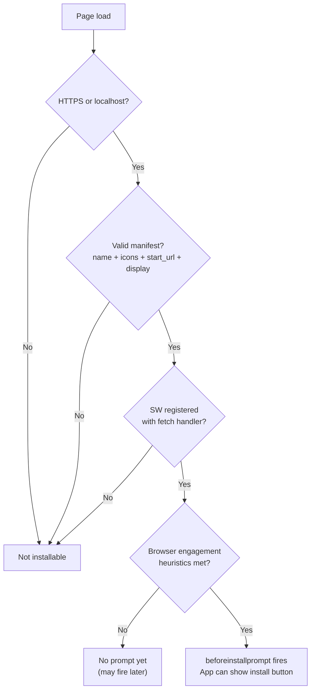

# [FEE-1301] Web App Manifest & Installability

## Introduction

The Web App Manifest is a JSON file that gives the browser everything it needs to treat a web application as a first-class citizen on the host operating system. It answers three questions: what is this app called, what does it look like, and how should it behave when launched. A `manifest.json` linked from the HTML document tells the browser the app's full name, its short name for constrained surfaces, the icons to use at different sizes, the URL to open on launch, and the window mode in which to display it. Without a manifest, the browser has no basis for constructing a coherent install experience -- no icon, no splash screen, no standalone window.

Installability is the result of the browser evaluating the manifest against a set of criteria it enforces on behalf of the user. The browser does not simply trust that a manifest is complete; it validates that the declared icon sizes are available, that the `start_url` resolves to the correct origin, and that a service worker with a `fetch` event handler is registered. When all criteria are satisfied and the browser judges that the user has sufficient engagement with the site, it fires the `beforeinstallprompt` event. This event is the signal that the app is eligible to be added to the home screen or taskbar. Application code can intercept this event, suppress the browser's default ambient install UI, and surface a custom install button at a moment that is contextually meaningful -- after the user has seen the app's value, not before.

The practical significance of this mechanism is that install intent is decoupled from install timing. The browser decides when the app is ready to be installed (based on manifest validity and service worker registration). The application developer decides when to ask the user (based on engagement, context, and product goals). This separation respects both the user's time and the browser's role as a quality gatekeeper. An app that gates core functionality on installation, or that shows an install prompt the moment a first-time visitor lands, misuses both.

## Design Thinking

### Manifest fields and their consequences

Every field in `manifest.json` has a concrete user-visible effect, and the consequences of getting them wrong are visible in the install experience rather than in a JavaScript error.

`name` is the full application name displayed in the OS install dialog, the app's entry in the task switcher, and the splash screen that appears while the app loads. `short_name` is displayed beneath the icon on the home screen, where space is constrained -- the practical limit is around 12 characters before the OS truncates it with an ellipsis. These two fields are not interchangeable; omitting `short_name` forces the browser to abbreviate `name` in its own way. Teams that have a brand name longer than 12 characters need a deliberate short-name strategy.

`start_url` controls what page opens when the user launches the app from the home screen. This is not necessarily the root of the site -- a team might set `"start_url": "/?source=pwa"` to distinguish installs from normal browser visits in analytics dashboards. The critical constraint is that whatever URL is declared as `start_url` must be in the service worker's precache. If the network is unavailable and the service worker has no cached response for `start_url`, the installed app shows an offline error page on launch, which is one of the most damaging experiences a PWA can produce.

`display` determines the window chrome. `standalone` removes the browser UI entirely, making the app visually equivalent to a native application during normal use. `minimal-ui` retains back and refresh buttons -- appropriate for apps where users might need to navigate back to a previous page without the app providing its own back control. `fullscreen` removes the OS status bar as well as browser chrome, typically used for games and immersive media. `browser` renders the app in a normal browser tab, defeating the purpose of installation.

`scope` limits which URLs the browser treats as "inside" the app. If the user navigates to a URL outside the scope, the browser opens it in a new browser tab rather than within the standalone window. This boundary is important for apps that embed third-party content -- a task manager that links out to an external documentation site should set a narrow scope so that the external link opens in the browser rather than pulling the user out of the app's standalone context. Teams MUST set `scope` to at least `"/"` (or a more specific path that covers all app routes); if `scope` is omitted or set too narrowly, navigations that fall outside it will break out of the standalone window and open in the system browser, which is disorienting and breaks the installed-app illusion.

### Icons and the maskable safe zone

Icon requirements are more complex than a single image at two sizes. Android and some desktop environments clip app icons into a circle or squircle (rounded square) shape. A standard icon not designed for this treatment will have its corners cropped, potentially cutting off logo marks or text placed near the edges. Maskable icons address this by requiring all meaningful content to stay within the inner 80% of the image -- the "safe zone" -- and allowing the outer 20% to be filled with background color that can be safely cropped. The icon entry in the manifest must include `"purpose": "maskable"` to signal this to the browser.

In practice, teams should provide at least four icon entries: a 192x192 and 512x512 standard icon (with `"purpose": "any"`) and a 192x192 and 512x512 maskable icon. The maskable variants can be tested at [maskable.app](https://maskable.app) before publishing. Combining both purposes into a single icon entry with `"purpose": "any maskable"` is technically valid but not recommended -- the browser may then use the maskable version on surfaces that do not clip icons, showing the extra padding as visible whitespace around the logo.

### The `beforeinstallprompt` pattern

The `beforeinstallprompt` event fires in Chromium-based browsers when all installability criteria are met and the browser's engagement heuristics are satisfied. As of Chrome 116, there is no minimum visit count requirement -- the browser requires only HTTPS, a valid manifest with `name`, `icons`, `start_url`, and a non-`browser` `display`, and a registered service worker with a `fetch` event handler. The event fires on the current page load if all criteria are already met.

The canonical pattern is: listen for the event, call `event.preventDefault()` immediately to suppress the browser's ambient install UI (the address bar chip or bottom sheet), store the event reference in component state, and render a custom install button only when the stored event is non-null. When the user clicks the button, call `savedEvent.prompt()` to trigger the browser's native install dialog, then await `savedEvent.userChoice` to learn whether the user accepted or dismissed it. If the user accepted, clear the stored event so the button disappears. If the user dismissed, the event reference can be kept and the button shown again later, or hidden for the remainder of the session.

This pattern puts the team in control of when the install ask appears. Best practice is to wait until the user has completed at least one meaningful action in the app -- created a task, saved a document, completed a workflow -- before surfacing the install button. A user who has seen value is significantly more likely to accept than a first-time visitor.

### Decision table -- should my app be installable?

Not every web property benefits from installation. The install prompt is itself a moment of friction, and surfacing it for an app the user will never return to serves no one.

| Scenario | Recommendation |
|----------|---------------|
| Task-focused app, users return regularly (email, notes, todo, project management) | Yes -- install adds real value; home screen shortcut and offline access improve daily use |
| Progressive content site (blog, documentation, news) | Optional -- add manifest for discoverability; skip custom install prompt |
| E-commerce checkout flow | No -- the URL bar is a trust signal; removing it in standalone mode increases cart abandonment |
| Internal enterprise tool accessed by known users | Yes -- installability simplifies distribution and creates native-feeling UX without an app store |
| Single-use utility (tax calculator, one-time form) | No -- users will not return; the install prompt creates friction for no benefit |

## Best Practices

**MUST link the manifest and theme-color from every HTML page.** Teams MUST include `<link rel="manifest" href="/manifest.json" />` and `<meta name="theme-color" content="#3b82f6" />` in the `<head>` of every page in the app, not only the root. Browsers evaluate installability criteria on each page load; a manifest that is missing from some pages causes inconsistent behavior for users who enter the app through a deep link.

**SHOULD use `/?source=pwa` in `start_url` for analytics attribution.** The query parameter is ignored by the app's routing logic but is captured by analytics as a distinct traffic source. Teams SHOULD use this pattern to measure how often installed users open the app from the home screen versus the browser, and whether installed users have different retention or conversion rates than browser users.

**MUST NOT show the install prompt on first page load.** Installability MUST NOT be used to gate core functionality; users who decline or whose browsers do not support installation MUST receive a fully functional web experience. Wait until the user has completed an action that signals intent — saved a document, added a task, logged in — before surfacing the install button.

**MUST provide separate maskable icon entries before shipping.** Teams MUST provide both `"purpose": "any"` and `"purpose": "maskable"` entries separately at 192×192 and 512×512 pixels. Verify that the maskable variant looks correct when clipped to a circle using maskable.app, and confirm that no meaningful content lands in the outer 20% of the icon.

**MUST validate the manifest with Lighthouse before launch.** Teams MUST run Lighthouse's PWA audit against a production build to check manifest completeness, icon availability, `start_url` reachability, and service worker registration. Running the audit in CI or in Chrome DevTools before shipping catches issues that would otherwise prevent `beforeinstallprompt` from firing. The `display` field MUST NOT be set to `"browser"` — doing so explicitly opts out of standalone mode and suppresses `beforeinstallprompt` in Chromium-based browsers.

**SHOULD handle the `appinstalled` event to update UI state.** After the user accepts the install prompt, the browser fires `appinstalled` on `window`. Teams SHOULD listen for this event to hide the install button and optionally show a confirmation message, so the button does not persist in the UI after the app is already on the home screen.

## Diagram

The following diagram shows the browser's installability check sequence. Each node represents a condition the browser evaluates; a single failing condition prevents `beforeinstallprompt` from firing on the current page load.



The engagement heuristics node reflects that even a fully valid manifest and registered service worker do not guarantee an immediate prompt. Chrome may delay the event if the user just navigated to the site for the first time. Once the event fires, the application controls when the native install dialog is actually shown. It is also worth noting that `beforeinstallprompt` does not automatically re-fire within the same page session: if the user dismisses the native install dialog without accepting, the event will not fire again on the current page. The application must wait until the next full page load -- a new navigation -- before the browser will consider firing it again.

## Example

The following example shows a complete `manifest.json`, the required HTML `<head>` tags, and a React component that implements the deferred `beforeinstallprompt` pattern.

### public/manifest.json

```json
{
  "name": "Acme Task Manager",
  "short_name": "Acme Tasks",
  "description": "Manage your tasks offline-first",
  "start_url": "/?source=pwa",
  "display": "standalone",
  "background_color": "#ffffff",
  "theme_color": "#3b82f6",
  "scope": "/",
  "icons": [
    {
      "src": "/icons/icon-192.png",
      "sizes": "192x192",
      "type": "image/png",
      "purpose": "any"
    },
    {
      "src": "/icons/icon-192-maskable.png",
      "sizes": "192x192",
      "type": "image/png",
      "purpose": "maskable"
    },
    {
      "src": "/icons/icon-512.png",
      "sizes": "512x512",
      "type": "image/png",
      "purpose": "any"
    },
    {
      "src": "/icons/icon-512-maskable.png",
      "sizes": "512x512",
      "type": "image/png",
      "purpose": "maskable"
    }
  ],
  "shortcuts": [
    {
      "name": "New Task",
      "url": "/tasks/new",
      "icons": [
        { "src": "/icons/shortcut-add.png", "sizes": "96x96" }
      ]
    }
  ]
}
```

### HTML head

```html
<head>
  <meta charset="UTF-8" />
  <meta name="viewport" content="width=device-width, initial-scale=1.0" />
  <title>Acme Task Manager</title>

  <!-- PWA manifest -->
  <link rel="manifest" href="/manifest.json" />

  <!-- Theme color for browser toolbar and Android status bar -->
  <meta name="theme-color" content="#3b82f6" />

  <!-- iOS fallback: Safari does not read theme_color from manifest -->
  <meta name="apple-mobile-web-app-capable" content="yes" />
  <meta name="apple-mobile-web-app-status-bar-style" content="default" />
  <meta name="apple-mobile-web-app-title" content="Acme Tasks" />
  <link rel="apple-touch-icon" href="/icons/icon-192.png" />
</head>
```

### src/components/InstallButton.tsx

```tsx
import { useEffect, useState } from 'react';

interface BeforeInstallPromptEvent extends Event {
  prompt(): Promise<void>;
  userChoice: Promise<{ outcome: 'accepted' | 'dismissed' }>;
}

export function InstallButton() {
  const [installEvent, setInstallEvent] =
    useState<BeforeInstallPromptEvent | null>(null);
  const [installed, setInstalled] = useState(false);

  useEffect(() => {
    const onBeforeInstall = (e: Event) => {
      // Prevent the browser's ambient install UI (address bar chip / bottom sheet)
      e.preventDefault();
      setInstallEvent(e as BeforeInstallPromptEvent);
    };

    const onInstalled = () => {
      setInstalled(true);
      setInstallEvent(null);
    };

    window.addEventListener('beforeinstallprompt', onBeforeInstall);
    window.addEventListener('appinstalled', onInstalled);

    return () => {
      window.removeEventListener('beforeinstallprompt', onBeforeInstall);
      window.removeEventListener('appinstalled', onInstalled);
    };
  }, []);

  // Hide if already installed or if the browser has not fired beforeinstallprompt
  if (installed || !installEvent) return null;

  async function handleInstall() {
    if (!installEvent) return;

    // Show the browser's native install dialog
    await installEvent.prompt();

    const { outcome } = await installEvent.userChoice;

    if (outcome === 'accepted') {
      // Clear the stored event so the button disappears
      setInstallEvent(null);
    }
    // If dismissed, keep installEvent so the button remains available
  }

  return (
    <button
      onClick={handleInstall}
      className="px-4 py-2 bg-blue-600 text-white rounded-md hover:bg-blue-700"
    >
      Install app
    </button>
  );
}
```

The component renders nothing until `beforeinstallprompt` fires, which means it is safe to include in the app shell without any loading state or conditional rendering at the call site. Placing this button in a persistent UI element -- a navigation bar, a settings page, or an onboarding flow -- allows it to appear at the right moment without any additional routing logic.

### Service worker precache requirement

For the install experience to work correctly offline, the service worker must cache the `start_url`. A minimal service worker that satisfies the installability criteria looks like this:

```js
// public/sw.js
const CACHE_NAME = 'acme-v1';
const PRECACHE_URLS = ['/', '/?source=pwa', '/index.html'];

self.addEventListener('install', (event) => {
  event.waitUntil(
    caches.open(CACHE_NAME).then((cache) => cache.addAll(PRECACHE_URLS))
  );
});

self.addEventListener('fetch', (event) => {
  event.respondWith(
    caches.match(event.request).then(
      (cached) => cached ?? fetch(event.request)
    )
  );
});
```

The `fetch` handler is required for installability criteria even if the caching logic is minimal. Without it, the browser will not fire `beforeinstallprompt` regardless of how complete the manifest is.

Production projects SHOULD use Workbox (covered in FEE-1304) rather than hand-writing this `fetch` handler. Workbox's `precacheAndRoute` handles cache versioning, stale-entry cleanup, and navigation fallback correctly -- edge cases that a minimal hand-written handler will miss. The example above is sufficient to satisfy installability criteria in development, but is not intended for production use. In particular, the minimal handler has no cache-busting logic: if assets change between deploys, the old versions remain cached indefinitely until the user clears site data. Workbox solves this with a revision-hash manifest generated at build time, making it the correct choice for any app that ships to real users.

## Common Mistakes

**`start_url` not cached by the service worker.** This is the most damaging configuration error. The app installs successfully, appears on the home screen, and then fails to load when the user opens it offline. The fix is to add `start_url` (and any query-string variants like `/?source=pwa`) to the service worker's precache list during the `install` event.

## Related FEEs

- [FEE-1300: Progressive Web Apps & Offline Overview](./1300.md) -- category overview covering how the manifest fits into the broader PWA architecture
- [FEE-1302: Service Workers](./1302.md) -- the service worker lifecycle and `fetch` handler required for installability criteria
- [FEE-1307: PWA in Production](./1307.md) -- Lighthouse audits that validate manifest completeness and icon correctness before and after deployment

## References

- [MDN: Web app manifests](https://developer.mozilla.org/en-US/docs/Web/Manifest)
- [Chrome Developers: Add a web app manifest](https://web.dev/articles/add-manifest)
- [Chrome Developers: How Chrome determines installability](https://web.dev/articles/install-criteria)
- [maskable.app](https://maskable.app) -- interactive tool for testing maskable icon safe zones
- [MDN: BeforeInstallPromptEvent](https://developer.mozilla.org/en-US/docs/Web/API/BeforeInstallPromptEvent)
- [web.dev: Patterns for promoting PWA installation](https://web.dev/articles/promote-install) -- UX guidance on when and how to surface the install prompt without disrupting user flow
- [W3C Web App Manifest specification](https://www.w3.org/TR/appmanifest/) -- authoritative reference for all manifest member definitions and processing rules
- [Chrome Developers: Define your app's scope](https://web.dev/articles/add-manifest#scope) -- explains the relationship between `scope`, `start_url`, and out-of-scope navigation behavior

