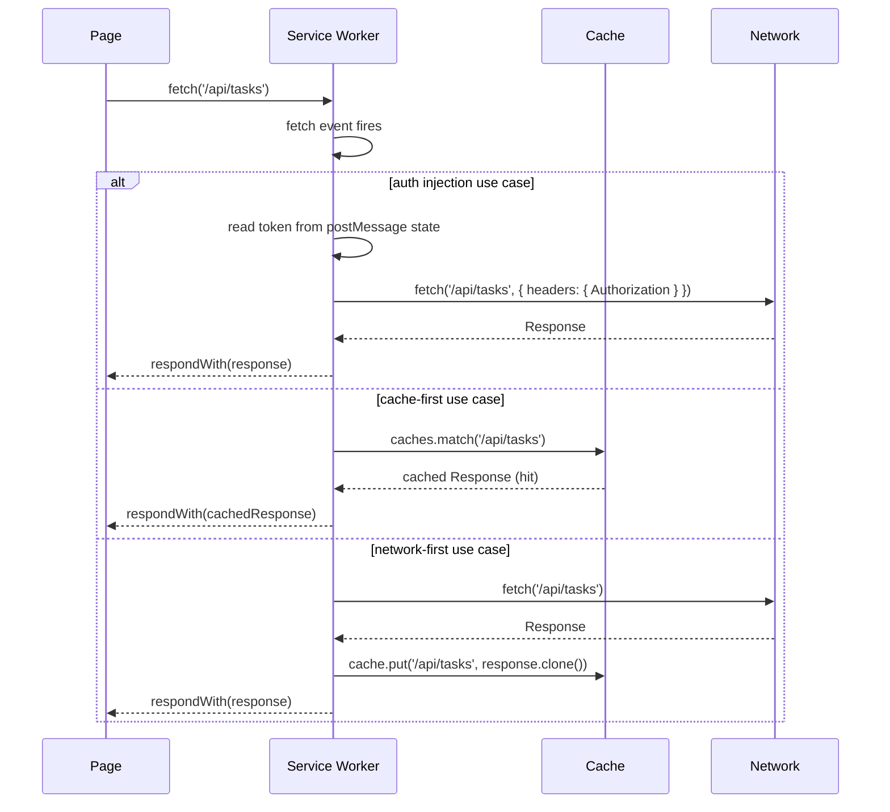

# [FEE-1302] Service Workers

## Introduction

A service worker is a JavaScript file the browser runs in a separate thread from the page, with no access to the DOM and no direct connection to any particular tab. It sits between the page and the network: every `fetch` request the page makes passes through the service worker's `fetch` event handler before it reaches the network, and the service worker decides what response to return. This architecture makes the service worker the most powerful extensibility point in the browser for anything that touches the network layer.

The common mental model -- that a service worker is a caching layer -- understates what the API can do. Caching is one valid strategy inside the `fetch` handler, but it is not the reason the service worker exists. A service worker is a general-purpose network proxy running inside the browser. It can inject headers into every outgoing request, deduplicate simultaneous calls to the same endpoint, intercept requests and return synthetic responses built from fixture data, batch telemetry events until a reliable send window opens, or route traffic to different backends based on feature flags. None of these require a PWA or an offline requirement -- they require only that a service worker be registered.

Understanding the service worker as middleware, not as a cache, changes how teams evaluate when to reach for it. The question is not "does this app need offline support?" but rather "is there network-level behaviour I need to apply to all requests from this origin, including requests made by code I do not control?" When the answer is yes, a service worker is frequently the right tool. This article covers the service worker lifecycle in depth, maps the non-PWA use cases with concrete implementation patterns, and compares the service worker to the alternatives teams commonly reach for instead.

Service workers require a secure context (HTTPS or localhost) and are scoped to an origin. They are not available inside iframes from a different origin, and they cannot intercept requests made to a different origin than the one they were registered on -- a service worker at `app.example.com` cannot intercept fetches going to `api.example.com`, though it can intercept fetches going to `app.example.com/api/` if those routes are proxied. This origin boundary is a security property, not a limitation that can be worked around with configuration.

Browser support for service workers is broad across modern environments. Chrome, Edge, Firefox, and Safari all implement the full lifecycle with `fetch` handler support. The main historical gap was Safari, which shipped full service worker support in version 15.4 (released March 2022). Teams targeting older Safari versions should check compatibility for specific APIs such as Background Sync and Push, which have a narrower support baseline than the core fetch interception capability.


## Design Thinking

### Why the fetch handler is the boundary that matters

The presence or absence of a fetch event handler is the single most significant architectural decision in a service worker file. Without it, the service worker is a background worker that can cache assets during install, but it cannot intercept any network traffic. The browser also uses the presence of a fetch handler as a signal when evaluating installability: a service worker that does not handle fetch events cannot fulfil the offline-capable requirement for Add to Home Screen prompts. Teams that register a service worker purely for push notification delivery without a fetch handler will find their app is not considered installable.

This also means the fetch handler acts as the boundary between the service worker layer and all network traffic the page generates. Every architectural decision about caching strategy, offline fallback, background sync, and request deduplication is implemented as logic inside the fetch handler.

### The service worker lifecycle

The service worker moves through four stages from first registration to full control over a page's network requests. Understanding each stage is necessary to write handlers that behave correctly on first install, across updates, and when multiple tabs are open.

**`register()`** is called from page JavaScript via `navigator.serviceWorker.register('/sw.js')`. The call is idempotent: if a service worker with the same scope and the same byte content is already registered and active, the browser does nothing. The method returns a `ServiceWorkerRegistration` promise that resolves once the browser has confirmed the file. The scope defaults to the directory containing `sw.js` -- a file at `/sw.js` covers the entire origin, while a file at `/app/sw.js` covers only paths under `/app/`. Placing the service worker file at the root is the most common and least surprising approach.

**`install` event** fires once per service worker version, the first time the browser encounters a new or changed `sw.js` file (compared byte-for-byte to the active version). This is the correct place to precache the application shell -- the set of assets the app needs to render on first load offline. The handler MUST call `event.waitUntil(promise)` with a promise that resolves when all async work is complete. If `waitUntil` is omitted, the browser may kill the service worker thread before `caches.addAll()` finishes writing, leaving the cache in a partial state.

**`activate` event** fires after the old service worker is deactivated and the new one is ready to take over. The gap between `install` completing and `activate` firing can be substantial: the new service worker sits in a "waiting" state until every tab that is using the old service worker is closed. This is the browser's mechanism for ensuring that a single page load is served entirely by one service worker version. The `activate` handler is the correct place to delete caches that belong to previous versions. Calling `self.skipWaiting()` inside the `install` handler bypasses the waiting period and causes the new service worker to activate immediately, which is useful during development but requires care in production because it means different pages in different tabs may briefly be controlled by different service worker versions.

**`fetch` event** fires for every network request the page makes -- `fetch()` calls, image loads, script loads, stylesheet loads, and navigation requests. The handler receives a `FetchEvent` whose `respondWith(responsePromise)` method allows the service worker to supply the response. If `respondWith` is not called, the request proceeds to the network exactly as it would without a service worker. The fetch handler is the middleware. Everything the service worker does in practice -- cache lookups, header injection, request deduplication, mock responses -- happens here.

### Update flow

When the browser detects that `sw.js` has changed (byte-for-byte comparison of the downloaded file against the installed version), it installs the new service worker alongside the old one. The new worker completes its `install` handler and then enters the waiting state. It will not activate -- and therefore will not intercept any fetch requests -- until every tab controlled by the old service worker is closed or navigates away. This is why a service worker update can appear to have no effect in a long-running session: the new code is installed but waiting.

Development teams frequently encounter this as a debugging puzzle: they update `sw.js`, reload the page, and observe that their changes have no effect because the previous service worker is still active in a background tab. The Chrome DevTools Application panel shows the waiting worker and provides a "skipWaiting" button for development use. In production, exposing a UI element that calls `registration.waiting.postMessage({ type: 'SKIP_WAITING' })` allows users to opt in to the update without requiring them to close all tabs.

### Service worker as general-purpose browser middleware

The five use cases below illustrate the range of problems the service worker solves outside of PWA caching. Each represents a situation where the interception happens at the network layer, not in application code, which is the distinction that makes a service worker the right tool.

| Use Case | Implementation | When to choose over alternatives |
|----------|---------------|----------------------------------|
| Auth token injection | Intercept all API `fetch` requests in the handler, read token from SW state (set via `postMessage`), add `Authorization: Bearer <token>` header | When the token must be applied to requests from third-party scripts, iframes, or workers that cannot be modified to use an axios interceptor |
| Request deduplication | Maintain a `Map<string, Promise<Response>>` of in-flight request URLs; return the existing promise if a duplicate URL arrives | High-traffic dashboards where 10+ components independently fetch the same `/api/user` endpoint on mount |
| Mock Service Worker (MSW) | SW intercepts requests and returns mock fixtures from a handler registry defined in test/dev code | Browser-based component tests and integration tests that need realistic API responses without a real server |
| Analytics batching | Queue telemetry events in the SW; flush the queue via `sync` event or `visibilitychange` | Reliable event delivery when users close the page mid-session before the analytics payload is sent |
| A/B test middleware | Read an experiment flag from SW state; route the fetch to a different backend URL based on the flag | Experimentation that applies to all requests from the origin, including third-party tag manager scripts |

The auth token injection case is worth examining in detail because it exposes why an application-layer solution falls short. An axios interceptor applies to all calls made through that axios instance, but it cannot intercept the fetch calls made by a third-party analytics SDK, a tag manager, an embedded iframe from a related subdomain, or a Web Worker that was not written to use the same axios instance. A service worker intercepts everything from the origin, regardless of what made the request.

MSW deserves particular attention because it is widely misunderstood as a tool that mocks at the module level (like Jest's `jest.mock()`). In browser mode, MSW registers a real service worker. The service worker intercepts real `fetch` requests and returns responses built from handler functions defined in the test or development setup. This means a browser-based test can exercise the actual HTTP client code, including retry logic, error handling, and request serialisation, without making real network calls. The MSW documentation confirms this: the browser integration is a genuine service worker, not a monkey-patch.

### Decision: service worker vs. HTTP interceptor vs. API proxy

Understanding when to reach for each tool prevents over-engineering and avoids the pain of changing architectural layers mid-project.

| Dimension | Service Worker | HTTP Interceptor | API Proxy |
|-----------|---------------|-----------------|-----------|
| Scope | All requests from the origin, including third-party scripts and iframes | Only requests made through the intercepted client | All requests from the server side |
| Persistence | Persists across page loads; no re-registration needed | Must be re-applied on every page load | Always running on the server |
| Third-party coverage | Yes — intercepts scripts from analytics, ads, and other domains | No — only covers the configured client | Not applicable (server-side) |
| Access to secrets | No — never put tokens or keys in SW; communicate via postMessage | Yes — client-side only, not truly secret | Yes — server environment variables |
| Requires HTTPS | Yes (except localhost) | No | No (but server must be secured) |
| Best for | Requests from code you don't control; behavior that must survive page reloads | Wrapping your own fetch/axios calls with headers or logging | Logic requiring server context (auth, DB access) |

The guiding rule: use a service worker when you need to intercept requests from code you do not control, or when the behaviour must survive page reloads without re-initialisation.

### Scope and registration path

The scope of a service worker is determined by the path of its script URL, not by any parameter. A service worker at `/sw.js` controls the entire origin. A service worker at `/app/sw.js` controls only URLs whose path begins with `/app/`. This matters when a single origin hosts multiple distinct applications -- for example, a public marketing site at `/` and an authenticated app at `/app/`. Registering a service worker at `/app/sw.js` means the marketing pages are never touched by the SW's fetch handler, which avoids the complexity of routing logic that distinguishes app requests from marketing page requests.

The path restriction also means that a service worker file cannot be served from a subdirectory below the scope it is meant to control. A file at `/assets/sw.js` cannot control `/` -- it can only control `/assets/`. Teams that build with bundlers and place all output in an `assets/` directory must either configure the build tool to emit `sw.js` at the root or explicitly set a broader scope using the `{ scope: '/' }` option in `register()`, which requires the server to send the `Service-Worker-Allowed: /` response header on the worker file.

### Communicating between page and service worker

The service worker thread has no shared memory with the page thread. All communication is asynchronous and message-based. The page sends messages to the active service worker using `navigator.serviceWorker.controller.postMessage(data)`. The service worker sends messages to controlled clients using `client.postMessage(data)`, where the client reference is obtained from `self.clients.get(clientId)` or `self.clients.matchAll()`.

A common pattern is a request-response channel built on top of `MessageChannel`. The page creates a `new MessageChannel()`, sends `port2` to the service worker inside the `postMessage` call, and listens on `port1` for the reply. The service worker receives `port2` from `event.ports[0]` and uses it to send the response back. This avoids the awkward global `message` event on `navigator.serviceWorker` that fires for all messages from all service workers. For most applications, however, one-way messages from the page to the SW (to set state like the auth token) and one-way broadcasts from the SW to all clients (to announce an update) cover the majority of real communication needs.

## Best Practices

**MUST register a `fetch` event handler on any service worker intended to support installability.** Chrome requires a `fetch` handler for the `beforeinstallprompt` event to fire; a service worker without a `fetch` handler satisfies neither the installability criterion nor any meaningful network-interception goal and SHOULD NOT be shipped to production.

**MUST check for service worker support before registering.** Teams MUST guard the registration call with `'serviceWorker' in navigator` to prevent runtime errors in environments where the API is not available, including some older browsers and non-secure contexts. Wrapping the registration in a `window.addEventListener('load', ...)` callback ensures the service worker registration network request does not compete with the page's critical resources during the initial load.

**SHOULD keep the service worker file small and import heavy logic separately.** The service worker file is parsed and evaluated each time the browser checks for updates, so a large file increases update-check overhead. Teams SHOULD move large handler registries, fixture data, or complex routing tables to separate modules imported via `importScripts()` or dynamic imports, keeping the main file a thin entry point whose byte-comparison check resolves quickly.

**MUST call `event.waitUntil()` with every async operation in `install` and `activate` handlers.** Without `waitUntil`, the browser may terminate the service worker thread before the async work completes. Teams MUST use `Promise.all()` to wrap multiple concurrent async operations into a single promise passed to `waitUntil`.

**MUST version cache names explicitly and delete old caches in the `activate` handler.** A service worker that never cleans up old caches will accumulate stale entries across deployments. Teams MUST define `const CACHE_NAME = 'app-v1'` at the top of the file and delete every cache whose key does not match `CACHE_NAME` in the `activate` handler, incrementing the version string when the precache asset list changes.

**SHOULD use `self.clients.claim()` in `activate` when immediate control is needed.** Without `clients.claim()`, a newly activated service worker only controls pages that navigate after activation. Teams SHOULD call `clients.claim()` when the new service worker MUST take control of all open tabs immediately rather than waiting for the next navigation.

**MUST send auth tokens via `postMessage`, not via the SW file itself.** The service worker file is not a secure storage location for secrets. Teams MUST send the token from the page to the service worker using `navigator.serviceWorker.controller.postMessage({ type: 'SET_AUTH_TOKEN', token })` and store it in a variable in the SW scope, resending it on each page load since the token is not persisted across SW restarts.

**MUST check request URL, method, and origin explicitly in the fetch handler before modifying requests.** A fetch handler that unconditionally intercepts all requests will catch navigation requests, cross-origin requests, and browser-internal requests. Teams MUST test `event.request.mode`, `event.request.method`, and `new URL(event.request.url).origin` before deciding whether to respond with a modified request. A safe pattern is to early-return for any request whose origin does not match `self.location.origin`.

**SHOULD test the service worker update flow deliberately, not just the happy path.** Most service worker bugs surface during the update cycle, not during initial installation. Teams SHOULD write an explicit test scenario where the app is open in one tab, a new service worker is deployed, a second tab is opened, and both tabs are verified to behave correctly. The Chrome DevTools Application panel's "waiting" indicator is the observable signal to check.

**SHOULD NOT call `skipWaiting()` in production without a user-initiated trigger.** Calling `skipWaiting()` unconditionally in the `install` handler causes the new service worker to activate while old service worker-controlled tabs are still open. Teams SHOULD prefer exposing a "reload to update" prompt driven by `registration.waiting` instead, since an incompatible new cache strategy can produce broken states mid-session if `skipWaiting()` fires without user awareness.

## Diagram

The following sequence diagram illustrates the fetch handler's decision logic for three representative use cases: auth injection, cache-first, and network-first. In each case, the page's `fetch()` call is the trigger and `respondWith()` is where the service worker commits its response. The diagram uses the same `/api/tasks` endpoint throughout to make the branching logic directly comparable across strategies. In a production fetch handler, the strategy selection is typically based on the request URL pattern or the request's `destination` property rather than a global `alt` branch.



The `alt` branches are mutually exclusive per request: the fetch handler evaluates conditions and calls `respondWith` once. The diagram omits the cache-miss path of the cache-first strategy for readability -- the full implementation in the example section below handles it correctly.

## Example

The following two service worker files are complete and independently deployable. The first implements the standard PWA cache-then-network pattern. The second implements auth token injection for a non-PWA context. Both are followed by the registration code that belongs in the page entry point.

### public/sw.js -- Example 1: cache-then-network (PWA pattern)

```js
// public/sw.js — Example 1: cache-then-network (standard PWA pattern)

const CACHE_NAME = 'app-v1';
const PRECACHE_URLS = ['/', '/offline.html', '/app.css'];

self.addEventListener('install', (event) => {
  event.waitUntil(
    caches.open(CACHE_NAME).then((cache) => cache.addAll(PRECACHE_URLS))
  );
});

self.addEventListener('activate', (event) => {
  event.waitUntil(
    caches.keys().then((keys) =>
      Promise.all(keys.filter((k) => k !== CACHE_NAME).map((k) => caches.delete(k)))
    )
  );
  self.clients.claim();
});

self.addEventListener('fetch', (event) => {
  if (event.request.method !== 'GET') return;
  event.respondWith(
    caches.match(event.request).then((cached) => {
      if (cached) return cached;
      return fetch(event.request).then((response) => {
        const clone = response.clone();
        caches.open(CACHE_NAME).then((cache) => cache.put(event.request, clone));
        return response;
      });
    })
  );
});
```

The `install` handler caches the app shell synchronously relative to the service worker's lifetime: `waitUntil` ensures the browser keeps the SW thread alive until all URLs are cached. The `activate` handler deletes every cache whose name is not `CACHE_NAME`, which removes entries written by all previous versions of this service worker. `self.clients.claim()` causes the freshly activated service worker to take control of any tabs that opened while the service worker was installing.

The `fetch` handler checks the cache first. On a hit it returns the cached response immediately, without touching the network. On a miss it fetches from the network, clones the response (a `Response` body can only be consumed once), caches the clone, and returns the original. The `method !== 'GET'` guard prevents the handler from trying to cache POST, PUT, or DELETE requests, which the Cache API does not support.

### public/sw-auth.js -- Example 2: auth token injection (non-PWA use case)

```js
// public/sw-auth.js — Example 2: auth token injection (non-PWA use case)

let authToken = null;

self.addEventListener('message', (event) => {
  if (event.data?.type === 'SET_AUTH_TOKEN') {
    authToken = event.data.token;
  }
});

self.addEventListener('fetch', (event) => {
  const url = new URL(event.request.url);
  if (url.origin !== 'https://api.acme.com') return;
  if (!authToken) return;

  const modifiedRequest = new Request(event.request, {
    headers: {
      ...Object.fromEntries(event.request.headers.entries()),
      Authorization: `Bearer ${authToken}`,
    },
  });
  event.respondWith(fetch(modifiedRequest));
});
```

This service worker has no `install` or `activate` handler because it does not maintain a cache. Its only job is to inject the `Authorization` header into every fetch request sent to `https://api.acme.com`, regardless of which script or worker on the origin made the request. The `origin` guard prevents the handler from touching requests to other domains such as CDN assets or analytics endpoints.

The `authToken` variable is in-memory state within the service worker thread. It is not persisted: if the browser terminates the service worker (which happens when the page is idle), the token is lost and must be resent. The page handles this by sending a fresh `SET_AUTH_TOKEN` message on every page load.

### src/main.ts -- Registration

```js
// src/main.ts
if ('serviceWorker' in navigator) {
  navigator.serviceWorker.register('/sw.js').then((registration) => {
    console.log('SW registered, scope:', registration.scope);
  });
}
```

For the auth injection service worker, add the token send after registration:

```js
// src/main.ts (auth SW variant)
if ('serviceWorker' in navigator) {
  navigator.serviceWorker.register('/sw-auth.js').then(() => {
    // Wait for the SW to be active before sending the token
    const sw = navigator.serviceWorker.controller;
    if (sw) {
      sw.postMessage({ type: 'SET_AUTH_TOKEN', token: getAuthToken() });
    }

    // Also handle the case where the SW becomes active after this code runs
    navigator.serviceWorker.addEventListener('controllerchange', () => {
      const newSw = navigator.serviceWorker.controller;
      if (newSw) {
        newSw.postMessage({ type: 'SET_AUTH_TOKEN', token: getAuthToken() });
      }
    });
  });
}
```

The `controllerchange` listener handles the race condition where the service worker activates after the page has already executed the registration callback. This can happen on first visit when the service worker needs to go through install and activate before it controls the page, and also when a waiting service worker calls `skipWaiting` and takes over mid-session.

### Inspecting service worker state in Chrome DevTools

Chrome DevTools provides a dedicated service worker panel under **Application > Service Workers**. The panel shows each registered worker's status (installing, waiting, activated), its script URL and scope, and controls to force update, skip waiting, and unregister. The **Bypass for network** checkbox instructs the browser to send all fetch requests directly to the network while DevTools is open, bypassing the service worker fetch handler entirely. This is the fastest way to isolate whether a bug is in the service worker or in application code.

The **Cache Storage** section under Application shows every cache created by `caches.open()`, with the ability to inspect cached entries and delete individual ones. When a precache operation fails silently due to a missing `waitUntil`, the Cache Storage panel will show either no cache or a partially populated one, making the bug immediately visible. The **Sources** panel allows setting breakpoints inside the service worker script, and the **Console** context switcher lets developers inspect `console.log` output originating from the service worker thread rather than the page thread.

During development it is often useful to check the **Update on reload** checkbox in the Application panel. This forces the browser to bypass the normal byte-comparison update check and always treat the current service worker file as new, activating it immediately on each page reload without requiring tab closure. This shortcut does not reflect production update behaviour and must not be relied on for testing the update flow itself.

## Common Mistakes

**SW update never activates because a background tab keeps the old SW alive.** The browser will not activate a new service worker while any tab is still controlled by the previous version. Users who leave the app open in a background tab overnight will not receive the update until they close that tab. Provide a "reload to update" prompt: listen for `registration.waiting` changes via `navigator.serviceWorker.addEventListener('controllerchange', ...)` and show a banner when `registration.waiting` is non-null.

**Multiple SW files registered on overlapping scopes causing unexpected fetch handler precedence.** If `sw-auth.js` covers `/` and `sw-analytics.js` also covers `/`, only one of them can be the active controller -- browsers do not stack service workers. Registering a second service worker for the same scope replaces the first one the next time the new file activates. Combine all service worker logic into a single file per origin, or use different scopes deliberately (e.g., `/app/` and `/api/`).

**Modifying the `Request` object directly instead of constructing a new `Request`.** The `Request` object passed to the fetch handler is immutable -- its headers cannot be modified in place. Attempting to do so either silently fails or throws depending on the browser. Always construct a `new Request(event.request, { headers: { ... } })` when you need to add or change headers.

**Returning a cloned response to the page and caching the original.** `Response.clone()` must be called before either body is consumed. If the fetch handler returns the response to the page first and then tries to clone it, the clone is empty because the body has already been read. Clone immediately after receiving the network response: `const clone = response.clone(); caches.open(...).then(c => c.put(url, clone)); return response;`.

**Serving `sw.js` with a long `Cache-Control` max-age.** The browser always re-fetches the service worker file on every page load to check for updates, but it respects HTTP caching headers when deciding whether to compare the new file against the installed version. A `Cache-Control: max-age=86400` on `sw.js` means the browser may serve a 24-hour-old cached copy without downloading a fresh one, delaying updates by up to a day. Set `Cache-Control: no-cache` on the service worker file so the browser always downloads it fresh and can detect changes immediately. The assets the service worker caches are a different matter -- those can and should have long cache lifetimes.

**Handle the `error` event on the registration promise.** `navigator.serviceWorker.register()` returns a promise that rejects if the service worker script fails to parse or throws a top-level error. An unhandled rejection in the registration call is silent in many environments. Attach a `.catch()` handler that logs the failure, so broken service worker deployments surface in error monitoring rather than silently degrading offline behaviour.

**Do not put secrets in the service worker scope or in cache storage.** Cache storage is accessible to any JavaScript running on the same origin via `caches.open()`. A secret stored in a cache entry (such as a private key or a refresh token) is readable by any other script on the origin, including injected third-party scripts. For auth tokens, use in-memory service worker variables fed via `postMessage`, and rely on `HttpOnly` cookies for session management when the server can be trusted to enforce it.

## Related FEEs

- [FEE-1303: Caching Strategies](./1303.md) -- what to do inside the fetch handler: cache-first, network-first, stale-while-revalidate, and cache-only strategies in detail
- [FEE-1304: Workbox & PWA Tooling](./1304.md) -- production abstraction over this raw API; Workbox handles cache versioning, stale entry cleanup, and navigation fallback correctly
- [FEE-1104: Mocking, Stubs & Test Doubles](../Testing%20Strategies/1104.md) -- MSW as a SW-based test double: how MSW uses a real service worker to intercept requests in browser-based tests
- [FEE-1206: HTTPS, Secure Headers & Cookie Attributes](../Security/1206.md) -- SW requires HTTPS except on localhost; understanding the secure context requirement

## References

- [MDN: Service Worker API](https://developer.mozilla.org/en-US/docs/Web/API/Service_Worker_API) -- authoritative reference for all service worker interfaces, events, and browser compatibility data
- [web.dev: The service worker lifecycle](https://web.dev/articles/service-worker-lifecycle) (Jake Archibald) -- the definitive explanation of install, waiting, activate, and the update flow with interactive diagrams
- [MSW documentation](https://mswjs.io/docs/) -- covers browser-mode setup, handler authoring, and how the service worker integration works under the hood
- [Chrome DevTools: Debug service workers](https://developer.chrome.com/docs/devtools/application/service-workers/) -- how to inspect registration state, force update, bypass for network, and trigger push/sync events from DevTools
- [MDN: Using Service Workers](https://developer.mozilla.org/en-US/docs/Web/API/Service_Worker_API/Using_Service_Workers) -- step-by-step walkthrough of registration, install, fetch, and update patterns
- [web.dev: Service worker caching and HTTP caching](https://web.dev/articles/service-worker-caching-and-http-caching) -- how the browser's HTTP cache interacts with the service worker cache, including the `Cache-Control: no-cache` requirement for `sw.js` itself
- [W3C Service Workers specification](https://www.w3.org/TR/service-workers/) -- normative reference for the full service worker API, event model, and lifetime semantics; useful for resolving ambiguities in browser behaviour
- [web.dev: Handling service worker updates](https://web.dev/articles/service-worker-update) -- covers the update lifecycle in detail including the waiting state, skipWaiting, and communicating updates to users without breaking open sessions
- [web.dev: Service workers and the Cache API](https://web.dev/articles/cache-api-quick-guide) -- focused guide to the Cache API used inside the install and fetch handlers: opening caches, matching requests, and managing cache size
