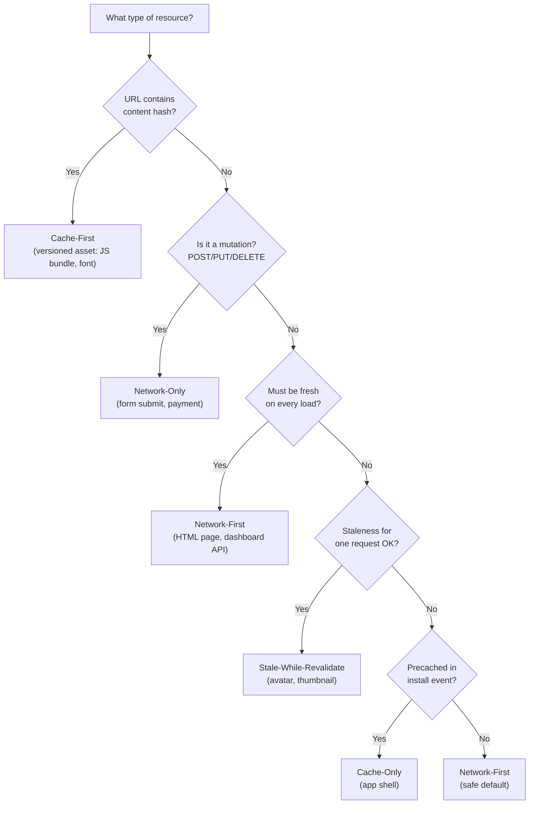

# [FEE-1303] Caching Strategies

## Introduction

A service worker's `fetch` event handler is a network proxy: it intercepts every request that leaves the page and decides what response to return. That decision is a caching strategy. A caching strategy is not a single algorithm the browser applies uniformly -- it is a deliberate choice the developer makes per resource type, encoding the answer to a specific question: given this resource, this frequency of change, and this tolerance for failure, what is the best possible response the service worker can give right now?

The browser's HTTP cache and the service worker Cache API address different problems. The HTTP cache reduces redundant network round-trips by storing responses keyed to their URL and revalidating them on a schedule controlled by `Cache-Control` headers. The service worker cache gives the developer full programmatic control: the strategy, the storage name, the eviction policy, and the fallback behaviour are all code. The two caches can coexist, and they frequently do in the same application, but the service worker layer is where the offline, performance, and staleness trade-offs are made explicitly rather than inferred from server headers.

There are five canonical caching strategies, each with a distinct fetch-handler flow: Cache-First, Network-First, Stale-While-Revalidate, Cache-Only, and Network-Only. No single strategy is correct for all resources. A well-structured service worker applies each strategy to the resource type it fits best, routing requests by URL pattern or request destination. Getting the routing wrong has concrete consequences: Cache-First on an HTML document means users never see content updates; Network-First on a large image means the user waits for a timeout before seeing anything offline; Network-Only on a GET request for a rarely-changing resource wastes the offline opportunity entirely. This article defines each strategy, describes the scenario it is designed for, explains when not to use it, and shows a complete multi-strategy fetch handler that puts all five together.

Five canonical strategies cover the meaningful decision space: Cache-First, Network-First, Stale-While-Revalidate, Cache-Only, and Network-Only. These names are consistent across the web.dev Offline Cookbook, the MDN Cache API documentation, and the Workbox library. Using the canonical names in code -- as function names, as code comments, or as Workbox strategy class references -- makes the fetch handler self-documenting and makes the routing decisions reviewable without running the code.

## Principle

There is no universally correct caching strategy. Teams MUST match the strategy to the resource type and the staleness tolerance of that resource. Three questions determine the correct choice: How often does this resource change? How bad is it to serve a stale version? How bad is a complete failure when the resource is unavailable offline?

Teams SHOULD default to Network-First for any resource that does not clearly belong to one of the other four categories. A Network-First strategy on a resource that could have been Cache-First is wasteful but never incorrect; a Cache-First strategy on a resource that should have been Network-First can cause users to see stale content indefinitely, which is a correctness failure. When in doubt, err toward freshness. Teams MUST NOT cache responses to non-idempotent requests (POST, PUT, DELETE, PATCH) under any strategy -- caching a mutation response and replaying it on subsequent requests produces undefined and potentially destructive behaviour.

## Design Thinking

### The five strategies

The five strategies cover the space of meaningful trade-offs between freshness, speed, and offline capability. Each is defined by its fetch-handler control flow, the scenario it fits best, and a concrete counterexample of when not to use it.

**Cache-First (cache falling back to network):** The handler checks the cache first. On a hit it returns the cached response immediately, without contacting the network. On a miss it fetches from the network, stores the response in the cache, and returns it. The cache is treated as authoritative. This is the highest-performance strategy: a cache hit costs no network round-trip and no latency. It is correct for versioned static assets where the URL itself encodes the content: a JavaScript bundle at `/assets/app.3f4d2a.js` or a web font at `/assets/inter.9b2c1d.woff2`. If the content changes, the build tool generates a new hash, which means a new URL, which means a cache miss, which means the updated asset is fetched. The URL changing when the content changes is the precondition that makes Cache-First safe. Do not use Cache-First for HTML pages, API responses, or any resource whose URL stays the same when the content changes. Users will never see updates until the cache entry is manually invalidated, which in practice means never.

**Network-First (network falling back to cache):** The handler attempts a network fetch. On success it stores the response in the cache and returns it. On a network error it falls back to the most recent cached response. This strategy prioritises freshness: online users always receive the latest content. It is the correct strategy for HTML navigation requests -- the document that bootstraps the application -- and for frequently-updated API responses such as a user's inbox, dashboard metrics, or notification feed. Online users see fresh content; offline users see the most recently cached version, which is a degraded but functional experience. Do not use Network-First for large binary assets such as images or video. A network fetch that times out after 30 seconds means the user waits 30 seconds before seeing the fallback. For large assets, Stale-While-Revalidate or Cache-First is more appropriate.

**Stale-While-Revalidate:** The handler returns the cached response immediately -- even if it is stale -- then launches a background fetch to update the cache for the next request. The user gets a fast response on every request. The cost is a one-request lag: a user may see content that was accurate as of the previous request, not the current one. This is the correct strategy for assets that change occasionally but where a single-request lag is acceptable: avatar images, product thumbnails, non-critical metadata, and secondary API responses that do not drive user decisions. The staleness window is bounded to at most one request, which is tolerable for content where displaying the previous value causes no business problem. Do not use Stale-While-Revalidate for pricing data, inventory counts, availability status, or any resource where displaying a stale value causes a business problem. A product shown as "in stock" when it is sold out, sourced from a one-request-stale cache, is a concrete example of the failure mode.

**Cache-Only:** The handler returns from the cache and never contacts the network. If the resource is not in the cache, the response is a fetch error. This strategy makes sense only for resources that were explicitly precached during the service worker's `install` event -- the application shell assets that the `install` handler guaranteed are in the cache before the service worker activates. These assets are stable by definition: the install would have failed if they could not be cached. Cache-Only applied to a precached shell is the fastest possible strategy with no network dependency at all. Do not use Cache-Only for any resource that was not explicitly precached. If the resource is absent from the cache, the user sees a network error where a working response was possible.

**Network-Only:** The handler fetches from the network and never touches the cache. This is the correct strategy for non-idempotent requests -- anything with a method other than GET -- and for idempotent requests where serving a cached response would be incorrect: payment confirmations, session termination, real-time analytics submissions. The service worker fetch handler fires for all requests, including POST, PUT, and DELETE. For non-GET requests, the correct behaviour in almost every case is to do nothing: return without calling `respondWith`, which lets the browser handle the request normally. Explicitly opting into Network-Only via an early return on `request.method !== 'GET'` is the idiomatic pattern. Do not use Network-Only for GET requests that are safe to cache -- it wastes the offline capability the service worker exists to provide.

### Choosing the right strategy

The decision is mechanical once the three questions are answered for each resource category. Start by asking whether the URL contains a content hash -- if yes, Cache-First is safe. Then ask whether the request is a mutation -- if yes, Network-Only or no interception. Then ask whether freshness is mandatory on every single load -- if yes, Network-First. Then ask whether a one-request lag is acceptable -- if yes, Stale-While-Revalidate. Finally, ask whether the resource was precached at install time -- if yes, Cache-Only. If none of these conditions apply, default to Network-First.

The routing in the fetch handler is where these decisions become code. A typical implementation routes on three properties: `request.method` (to catch mutations), `url.pathname` prefix (to identify versioned asset directories), and `request.destination` (to identify images and documents without enumerating every URL). The routing order matters: mutations must be caught before any caching logic runs, and the most specific patterns must precede the most general ones.

### Combining strategies: routing logic in the fetch handler

A production service worker will have multiple strategies active simultaneously, routed by request properties. The routing logic should be explicit and readable, not a long chain of nested conditionals. The recommended approach is a series of early-return guards, each handling a single resource category before falling through to the next. Process the most constrained categories first: mutations (non-GET) are always Network-Only and should be caught before any caching logic. Then handle the most specific URL patterns -- exact matches for precached shell resources, then directory prefixes for versioned assets. Handle destination-based routing next (images, fonts, documents). Finally, handle the general case with the safe default.

When two strategies might apply to the same resource category, the more conservative strategy wins. If a URL pattern ambiguously matches both the versioned assets directory and the generic API pattern, route it to Network-First rather than Cache-First: the worst outcome of Network-First on a versioned asset is a slightly slower response; the worst outcome of Cache-First on an API endpoint is stale data displayed as current. Build the routing logic so that no URL falls through to a strategy that is more aggressive than necessary for that resource's staleness tolerance.

The routing rules are a form of configuration, and they should be readable as such. A good heuristic: if reading the fetch handler top to bottom does not immediately reveal which strategy applies to `/index.html`, to `/assets/app.abc123.js`, and to `/api/user`, the routing structure needs refactoring. URL-pattern matching against `url.pathname` is usually sufficient; avoid matching against `request.url` (the full URL including origin and query string), which can produce surprising results for same-origin requests that include query parameters.

### Testing strategy coverage

Each strategy has at least three distinct code paths that must be tested: the happy path (cache hit for Cache-First, network success for Network-First), the fallback path (cache miss leading to network for Cache-First, network failure leading to cache for Network-First), and the degenerate case (both cache and network unavailable, precache entry missing for Cache-Only). Manual testing with Chrome DevTools is sufficient for verifying the happy path, but fallback paths require simulating network failure, and the degenerate case requires clearing both the cache and disabling the network.

Use the DevTools Application panel's Cache Storage section to inspect what each strategy is writing to each named cache. After a Cache-First miss and network fetch, the entry should appear in the static cache. After a Stale-While-Revalidate hit, the existing entry should be replaced within a few seconds as the background fetch completes. After a Network-First offline fallback, the cache entry should already be present from a prior online visit. Verifying these states directly in the Cache Storage panel catches implementation errors that are invisible from the network request log alone.

### Opaque responses and cross-origin resources

An opaque response is a response from a cross-origin fetch made in `no-cors` mode. The browser hides its status, headers, and body as a security measure. Opaque responses have `response.status === 0` even when the underlying server returned 200. Caching an opaque response is safe in some situations and catastrophic in others. If the cross-origin server returns an error (a 5xx or a redirect to a login page), the opaque response still has `status: 0` -- it is indistinguishable from a successful response. Storing that 0-status response in the cache and serving it to the user on the next request means serving an empty or error response silently, with no indication that anything went wrong.

The practical rule: do not cache opaque responses unless the resource is truly optional and a failed cache entry is acceptable. For cross-origin fonts from Google Fonts or CDN assets that have CORS headers enabled (`Access-Control-Allow-Origin: *`), use `fetch(request, { mode: 'cors' })` to get a non-opaque response that includes a real status code. For cross-origin resources that genuinely cannot return CORS headers, do not cache them through the service worker at all -- let the browser's HTTP cache handle them with their own `Cache-Control` headers.

### Strategy comparison table

The following table summarises the five strategies across the dimensions that matter most for the routing decision. Use it alongside the flowchart when auditing an existing service worker or designing a new one.

| Strategy | Returns from cache? | Fetches from network? | When network fails | Best resource type |
|---|---|---|---|---|
| Cache-First | Yes (first) | Only on cache miss | Serves cache hit; fails on miss | Versioned static assets (content-hashed URLs) |
| Network-First | Only on network failure | Yes (first) | Serves stale cache; falls back to offline page | HTML navigation, frequently-updated APIs |
| Stale-While-Revalidate | Yes (immediately) | Always, in background | Serves stale cache; no background update | Images, thumbnails, non-critical API data |
| Cache-Only | Yes (only source) | Never | Fetch error (no cache entry) | Precached app shell (guaranteed by install) |
| Network-Only | Never | Yes (only source) | Fetch error (no fallback) | Mutations (POST/PUT/DELETE), payments |

The table makes one relationship explicit that the strategy names alone do not: Stale-While-Revalidate always fetches from the network, even on a cache hit. This is the mechanism by which the cache stays up to date. Teams sometimes expect Stale-While-Revalidate to behave like Cache-First (skip the network on a hit) with a separate revalidation trigger. It does not: the background fetch fires on every request where a cache entry exists. This is correct and desirable behaviour -- the cache entry is always at most one request out of date -- but it means Stale-While-Revalidate contributes to network load even when the page appears to be using cached content.

### Cache size and eviction

The Cache API does not enforce a size limit per cache. It enforces a per-origin storage quota shared with IndexedDB and the Origin Private File System. Browsers begin evicting least-recently-used data when storage pressure grows, but the eviction is not granular enough to be relied upon as a cache management strategy. A service worker that caches every network response without a bounded eviction policy will grow the cache indefinitely. For dynamic caches -- caches populated by the fetch handler at runtime rather than by `addAll` at install time -- implement an explicit size limit: after each `cache.put()`, open the cache, retrieve all keys, and delete the oldest entries beyond the limit. For static caches populated at install time, the cache size is known at build time and does not grow at runtime.

## Best Practices

**MUST version static cache names and delete old caches on activate.** Teams MUST define `const STATIC_CACHE = 'static-v1'` and `const DYNAMIC_CACHE = 'dynamic-v1'` at the top of the service worker file and delete every cache whose name is not in the set of current cache names during the `activate` handler. Increment the version string whenever the precache asset list changes to ensure stale entries from previous versions are cleaned up immediately.

**MUST clone the response before putting it in the cache.** A `Response` object's body is a readable stream that can only be consumed once. Teams MUST call `const clone = response.clone()` immediately after receiving the network response; if `respondWith` consumes the body first, the clone is empty. The clone goes into the cache; the original goes to the page.

**MUST apply Cache-First only to resources with content-hashed URLs.** The content hash in the URL is the invariant that makes Cache-First safe; without it, Cache-First is a correctness hazard. Teams MUST verify that every `cacheFirst()` call site handles URLs that contain a hash segment before shipping.

**SHOULD use Network-First as the safe default for anything not explicitly classified.** Network-First is not as performant as Cache-First or Stale-While-Revalidate, but it is never incorrect. Teams SHOULD prioritise correctness first: a resource served with a stale cached response is a correctness failure; a resource served with an extra network round-trip is a performance concern.

**MUST NOT cache opaque responses from cross-origin no-cors requests.** Teams MUST check `response.type === 'opaque'` before calling `cache.put()` and skip the cache for opaque responses. If the cross-origin resource MUST be cached, request CORS headers from the server and fetch with `mode: 'cors'`.

**MUST implement a bounded eviction policy for dynamic caches.** For any cache populated at runtime, teams MUST define a maximum number of entries and enforce it after each `cache.put()` by retrieving all cache keys with `cache.keys()` and deleting entries beyond the limit. Without this, a high-traffic application will grow its dynamic cache without bound.

**SHOULD test offline behaviour explicitly, not just cache hit paths.** Teams SHOULD use Chrome DevTools Network panel's "Offline" mode to verify that each strategy behaves as specified when network requests fail — the Network-First cache fallback, the Cache-Only error on a missing precache entry, and the Stale-While-Revalidate background update all have paths that only execute when the network is unavailable.

**SHOULD scope each strategy function to a single named cache.** Teams SHOULD pass the cache name as a parameter to each strategy function (`cacheFirst(request, STATIC_CACHE)`) rather than hardcoding it inside the function body, making cache ownership visible at the call site and preventing accidental cross-cache pollution. This granularity ensures that bumping `STATIC_CACHE` to `static-v2` deletes only the correct stale cache without affecting the dynamic cache.

**MUST guard against caching error responses.** A `fetch()` that resolves can still return a 4xx or 5xx response. Teams MUST check `response.ok` before calling `cache.put()` and skip the cache if it is false; a cached 404 will be served on every subsequent request for that URL until the cache is cleared, making the resource appear permanently broken.

## Diagram

The following flowchart maps the three classification questions to the five strategies. Use it to determine the correct strategy for each resource category in an application before writing any routing code in the fetch handler.



## Example

The following service worker is a complete, deployable implementation of all five strategies with URL-pattern routing. The routing order is intentional: mutations are caught first (returning without intercepting), then the most specific URL patterns, then destination-based routing, then the general default. Comments in the code explain the rationale for each routing decision.

```js
// public/sw.js

const STATIC_CACHE = 'static-v1';
const DYNAMIC_CACHE = 'dynamic-v1';

// The app shell: resources that must be available offline at all times.
// These exact URLs are precached at install time and served via Cache-Only.
const APP_SHELL = ['/', '/offline.html', '/app.css'];

// ── Install: precache the app shell ──────────────────────────────────────────
self.addEventListener('install', (event) => {
  event.waitUntil(
    caches.open(STATIC_CACHE).then((cache) => cache.addAll(APP_SHELL))
  );
});

// ── Activate: delete caches that belong to previous SW versions ───────────────
self.addEventListener('activate', (event) => {
  const CURRENT_CACHES = [STATIC_CACHE, DYNAMIC_CACHE];
  event.waitUntil(
    caches.keys().then((keys) =>
      Promise.all(
        keys
          .filter((k) => !CURRENT_CACHES.includes(k))
          .map((k) => caches.delete(k))
      )
    )
  );
  // Take control of open tabs immediately rather than waiting for next navigation.
  self.clients.claim();
});

// ── Fetch: route each request to the appropriate strategy ─────────────────────
self.addEventListener('fetch', (event) => {
  const { request } = event;
  const url = new URL(request.url);

  // Network-Only (implicit): non-GET requests are never intercepted.
  // Returning without calling respondWith lets the browser handle them normally.
  if (request.method !== 'GET') return;

  // Cache-Only: app shell resources are guaranteed in STATIC_CACHE by install.
  // No network request is needed or desirable for these.
  if (APP_SHELL.includes(url.pathname)) {
    event.respondWith(caches.match(request));
    return;
  }

  // Cache-First: versioned assets in /assets/ have content-hashed URLs.
  // A URL change means a content change, so a cache hit is always correct.
  if (url.pathname.startsWith('/assets/')) {
    event.respondWith(cacheFirst(request, STATIC_CACHE));
    return;
  }

  // Stale-While-Revalidate: images change occasionally but a one-request
  // lag is acceptable. The user always gets a fast response.
  if (request.destination === 'image') {
    event.respondWith(staleWhileRevalidate(request, DYNAMIC_CACHE));
    return;
  }

  // Network-First (default): API responses and HTML navigation requests need
  // fresh content when online and a best-effort fallback when offline.
  event.respondWith(networkFirst(request, DYNAMIC_CACHE));
});

// ── Strategy implementations ──────────────────────────────────────────────────

async function cacheFirst(request, cacheName) {
  // Return the cached response immediately on a hit.
  const cached = await caches.match(request);
  if (cached) return cached;

  // On a miss, fetch from the network, cache the response, and return it.
  const response = await fetch(request);
  const cache = await caches.open(cacheName);
  // Clone before caching: a Response body can only be consumed once.
  cache.put(request, response.clone());
  return response;
}

async function networkFirst(request, cacheName) {
  try {
    // Attempt a network fetch. On success, cache and return the response.
    const response = await fetch(request);
    const cache = await caches.open(cacheName);
    cache.put(request, response.clone());
    return response;
  } catch {
    // On a network error, fall back to the cache.
    const cached = await caches.match(request);
    // If no cached version exists, return the offline fallback page.
    return cached ?? caches.match('/offline.html');
  }
}

async function staleWhileRevalidate(request, cacheName) {
  const cache = await caches.open(cacheName);
  const cached = await cache.match(request);

  // Launch a background fetch to update the cache for the next request.
  // Do not await: the update happens after the response is returned.
  const networkPromise = fetch(request).then((response) => {
    cache.put(request, response.clone());
    return response;
  });

  // Return the cached response immediately if available,
  // otherwise wait for the network (first visit with no cache entry).
  return cached ?? networkPromise;
}
```

The three strategy functions are separated from the routing logic for clarity and testability. Each function is a pure transformation from request to response with a predictable fallback. The `networkFirst` function falls back to `/offline.html` when neither the network nor the cache can provide a response -- this requires `/offline.html` to be in the app shell precache, which the `APP_SHELL` array and the `install` handler guarantee.

The `staleWhileRevalidate` function does not await the `networkPromise` before returning the cached response. The background fetch fires and updates the cache, but the calling `respondWith` has already committed. This is the intended behaviour: the cache is updated for the next request, not the current one. The `?? networkPromise` fallback handles the first-visit case where no cached entry exists yet, making the function behave like Network-First on the first request and Stale-While-Revalidate on every subsequent one.

Note that `cacheFirst` and `networkFirst` both use `response.clone()` before calling `cache.put()`. This is mandatory. The `Response` body is a one-time-readable stream. Passing the original to `cache.put()` and then returning it to `respondWith` would cause the page to receive an empty body. Clone first, then pass one copy to the cache and return the other to the page.

A notable omission in this example is a response status guard before each `cache.put()` call. A production implementation should check `response.ok` before storing the response -- caching a 404 or 503 means the error is served from cache on every subsequent request for that URL until the cache is cleared. The example above omits the guard for brevity; the production pattern is:

```js
if (response.ok) {
  cache.put(request, response.clone());
}
return response;
```

Apply this guard inside every strategy that writes to the cache: `cacheFirst` on network miss and `networkFirst` on network success. The `staleWhileRevalidate` function should apply the same guard inside the `.then()` callback on the `networkPromise`. For Cache-Only and the implicit Network-Only path (non-GET early return), no `cache.put()` occurs, so the guard is not needed.

A second omission is error logging. The `networkFirst` catch block returns a cached response silently. In a production service worker, log the error before falling back -- at minimum `console.error('[SW] networkFirst failed:', request.url, err)`. Service worker console output is visible in the DevTools Console when the context switcher is set to the service worker thread rather than the page thread. Logging failures here is the earliest signal that a class of network requests is systematically failing, which may indicate a deployment error, a backend outage, or a misconfigured routing rule rather than a transient connectivity issue.

## Common Mistakes

**Cache-First on HTML pages.** An HTML document served Cache-First will return the cached version on every load, forever. When a deployment changes the HTML, users with a cached copy will never receive the update until the cache entry is manually deleted or expires, which the Cache API does not enforce automatically. HTML documents MUST be served Network-First so that online users always receive the current version, and offline users receive the most recently cached one.

**Network-First on large images or video.** Network-First fetches from the network before consulting the cache. For a 5 MB image, a network timeout means the user waits the full timeout duration -- often 30 to 60 seconds -- before the fallback kicks in. Use Stale-While-Revalidate for images: the cached version is returned immediately, and the network update happens in the background. The one-request lag is invisible to the user; the timeout is not.

**Catching all fetch errors silently.** A `try/catch` around a network fetch that swallows errors and returns a cached response without logging hides network failures during development and production debugging. Log the error -- at minimum to the service worker's `console.error` -- before falling back, so that monitoring tools can surface patterns of network failure that would otherwise be invisible.

**Using Cache-Only for resources not in the precache.** Cache-Only is correct only for resources that the `install` handler has guaranteed are present in the cache. If a URL is added to the Cache-Only routing logic but not to `APP_SHELL`, the service worker returns a fetch error for that resource on every request. Verify that every URL matched by Cache-Only routing is also included in the `addAll()` call in the `install` handler.

**Failing to handle the offline page itself in Network-First.** The Network-First fallback returns `caches.match('/offline.html')` when neither the network nor the cache provides a response. If `/offline.html` was not added to the precache in the `install` handler, this fallback returns `undefined`, which `respondWith` will reject, leaving the user with a browser-level network error instead of a controlled offline page. Always include the offline fallback page in the `APP_SHELL` precache list.

**Applying the same strategy to all requests in a domain without inspecting the URL.** A simple service worker that routes everything through Network-First does not distinguish between navigation requests (HTML documents), API requests, and large binary downloads. While Network-First is safe as a default, it is not optimal for every resource. Teams that start with a single strategy for all resources frequently discover the performance problem with large binary assets before they rethink the routing. Define routing by resource category from the start, even if the initial implementation uses Network-First for every category -- it is much easier to change one category to Cache-First later when the URL structure is already part of the routing logic.

**Not accounting for the Cache API's request matching algorithm.** `caches.match(request)` matches on the full URL by default, including the query string. A request for `/api/data?page=1` and a request for `/api/data?page=2` produce different cache entries. This is the correct behaviour for paginated API responses, but it means a Network-First strategy that caches paginated responses will accumulate one entry per unique query string, which can be significant for APIs with many parameters. For resources where the query string should be ignored in cache matching, pass a `{ ignoreSearch: true }` option to `caches.match()`. Be careful: ignoring the query string is correct for some resources and a correctness failure for others. Document the decision explicitly in the routing code.

## Related FEEs

- [FEE-1302: Service Workers](./1302.md) -- the fetch handler where these strategies are implemented; covers the service worker lifecycle, registration, and the middleware model
- [FEE-1304: Workbox & PWA Tooling](./1304.md) -- these five strategies as named Workbox classes (`CacheFirst`, `NetworkFirst`, `StaleWhileRevalidate`, `CacheOnly`, `NetworkOnly`) with built-in expiration and broadcast update support
- [FEE-403: Fetch, Streams & Network APIs](../Browser%20APIs%20and%20Web%20Platform/403.md) -- the underlying network layer the service worker delegates to when it calls `fetch(request)` inside a strategy function

## References

- [web.dev: The Offline Cookbook](https://web.dev/articles/offline-cookbook) (Jake Archibald) -- the canonical reference for the five caching strategies; defines the strategy names used throughout this article and provides visual diagrams of each control flow
- [MDN: Cache API](https://developer.mozilla.org/en-US/docs/Web/API/Cache) -- authoritative reference for `caches.open()`, `cache.match()`, `cache.put()`, `cache.keys()`, and `cache.delete()`; covers the request matching algorithm and cache storage quotas
- [Workbox: Caching Strategies](https://developer.chrome.com/docs/workbox/caching-strategies-overview/) -- documents the five strategies as implemented in the Workbox library; useful for understanding the production-grade edge cases each strategy must handle
- [MDN: Response.clone()](https://developer.mozilla.org/en-US/docs/Web/API/Response/clone) -- explains why clone is necessary: a Response body can only be consumed once; describes the `TypeError` thrown when `clone()` is called after the body has already been read
- [web.dev: Storage for the web](https://web.dev/articles/storage-for-the-web) -- covers the per-origin storage quota shared by the Cache API and IndexedDB; explains browser eviction policies and how to query available quota with the Storage Manager API
- [web.dev: Handling Service Worker Updates](https://web.dev/articles/service-worker-update) -- relevant to caching strategies because cache version naming and cleanup in the `activate` handler is part of the strategy implementation, not separate from it
- [Chrome DevTools: Cache Storage inspection](https://developer.chrome.com/docs/devtools/application/cache-storage/) -- how to inspect named caches, view individual entries, and delete entries during development to verify that each strategy writes to and reads from the correct cache
- [W3C Service Workers specification: Cache matching](https://www.w3.org/TR/service-workers/#cache-match) -- normative definition of how `caches.match()` compares request URLs, including the `ignoreSearch`, `ignoreMethod`, and `ignoreVary` options that control query string and method matching behaviour
- [web.dev: Service worker caching and HTTP caching](https://web.dev/articles/service-worker-caching-and-http-caching) -- explains the interaction between service worker cache strategies and the browser's built-in HTTP cache, including how `Cache-Control` headers on network responses affect what gets stored when the service worker calls `cache.put()`
