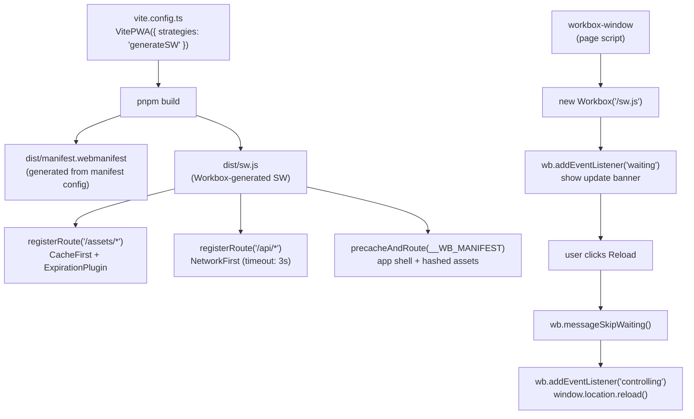

# [FEE-1304] Workbox & PWA Tooling

:::info
Workbox, maintained by the Chrome team and currently at version 7.4.x, packages the five caching strategies from FEE-1303 into named classes, adds expiration and update plugins, and generates a precache manifest automatically from the build output. `vite-plugin-pwa` generates the service worker and web app manifest from a single configuration object for Vite projects; for Next.js, Serwist (`@serwist/next`), which has succeeded `@ducanh2912/next-pwa` as the maintained option, builds the worker from a hand-written source file plus configuration. This article covers the Workbox strategy classes, the `generateSW`/`injectManifest` split, the `workbox-window` update-detection flow, and the current state of Next.js PWA tooling.
:::

## Context

Writing a production service worker by hand is possible, but it requires solving the same set of problems every time: managing cache names and versions, implementing strategy functions that correctly clone responses and guard against caching error status codes, bounding dynamic cache growth, wiring a precache manifest so that updated assets are fetched on deployment, and testing fallback paths that only execute under offline conditions. Each of these problems is small in isolation. Together they still push a hand-rolled service worker for a medium-complexity application to several hundred lines of defensive boilerplate before any application-specific routing logic appears. Workbox is the set of Chrome-team libraries that removes that accumulation.

Workbox is not a replacement for understanding the raw Cache API and service worker lifecycle. The concepts from FEE-1302 and FEE-1303 are all still present in Workbox: the install and activate lifecycle, the `fetch` event handler as a network proxy, the five caching strategies and their trade-offs, the response clone requirement, and the opaque response hazard. Workbox encapsulates these concepts; it does not hide them. When something goes wrong in a Workbox-powered service worker, diagnosing the failure requires reading a Workbox `runtimeCaching` configuration and mapping it back to the raw behaviour. Teams that skip FEE-1302 and FEE-1303 and go directly to Workbox will encounter mysterious bugs and have no framework for reasoning about them.

The Workbox ecosystem has two layers. The lower layer is the Workbox library itself: `workbox-strategies`, `workbox-routing`, `workbox-precaching`, `workbox-expiration`, and `workbox-window`. These can be imported directly from a custom service worker file written by the developer. The upper layer is the build-tool integrations: `vite-plugin-pwa` for Vite-based projects (React, Vue, Svelte, and others), and, for Next.js, Serwist (`@serwist/next`) or its predecessor `@ducanh2912/next-pwa`. `vite-plugin-pwa` and `@ducanh2912/next-pwa` read a configuration object and produce the service worker plus web app manifest as build output; Serwist instead builds the worker from a hand-written `app/sw.ts` source plus configuration. Most production teams operate at the upper layer, delegating the lower-layer decisions to configuration, and only drop down to direct Workbox imports when they need custom logic that the build-tool integration cannot express.

## Visual

The following diagram shows the `vite-plugin-pwa` build pipeline in `generateSW` mode and the `workbox-window` update detection flow at runtime.



## Example

The following example is a complete `vite-plugin-pwa` setup in `generateSW` mode with three runtime cache routes and a React update banner component that uses `workbox-window`, followed by the current and legacy Next.js configurations.

### `vite.config.ts`

```ts
// vite.config.ts
import { defineConfig } from 'vite';
import react from '@vitejs/plugin-react';
import { VitePWA } from 'vite-plugin-pwa';

export default defineConfig({
  plugins: [
    react(),
    VitePWA({
      // Do not auto-activate; let the UpdateBanner component control the timing.
      registerType: 'prompt',

      // generateSW: Workbox writes the entire service worker from this config.
      // Switch to 'injectManifest' if the SW needs custom request-mutation logic.
      strategies: 'generateSW',

      workbox: {
        // Assets in /assets/ have content-hashed URLs. Cache-First is safe because
        // a content change produces a new URL (hash changes), so a cache hit is
        // always correct. ExpirationPlugin prevents unbounded cache growth.
        runtimeCaching: [
          {
            urlPattern: /\/assets\/.*/i,
            handler: 'CacheFirst',
            options: {
              cacheName: 'assets-cache-v1',
              expiration: {
                maxEntries: 100,
                maxAgeSeconds: 365 * 24 * 60 * 60, // 1 year
              },
            },
          },
          // API responses need fresh data on every load when online.
          // networkTimeoutSeconds: 3 ensures degraded-network users see the
          // cached response quickly instead of waiting on the network indefinitely.
          {
            urlPattern: /\/api\/.*/i,
            handler: 'NetworkFirst',
            options: {
              cacheName: 'api-cache-v1',
              networkTimeoutSeconds: 3,
              expiration: {
                maxEntries: 50,
                maxAgeSeconds: 5 * 60, // 5 minutes
              },
            },
          },
          // Images: a one-request lag is acceptable. StaleWhileRevalidate returns
          // the cached image immediately and updates it in the background.
          {
            urlPattern: /\.(?:png|jpg|jpeg|svg|gif|webp)$/i,
            handler: 'StaleWhileRevalidate',
            options: {
              cacheName: 'image-cache-v1',
              expiration: {
                maxEntries: 60,
                maxAgeSeconds: 30 * 24 * 60 * 60, // 30 days
              },
            },
          },
        ],
      },

      manifest: {
        name: 'Acme Task Manager',
        short_name: 'Acme Tasks',
        start_url: '/?source=pwa',
        display: 'standalone',
        theme_color: '#3b82f6',
        background_color: '#ffffff',
        icons: [
          { src: '/icons/icon-192.png', sizes: '192x192', type: 'image/png' },
          { src: '/icons/icon-512.png', sizes: '512x512', type: 'image/png' },
          {
            src: '/icons/icon-512-maskable.png',
            sizes: '512x512',
            type: 'image/png',
            purpose: 'maskable',
          },
        ],
      },
    }),
  ],
});
```

### Update banner: `src/components/UpdateBanner.tsx`

```tsx
// src/components/UpdateBanner.tsx
import { useEffect, useState } from 'react';
import { Workbox } from 'workbox-window';

export function UpdateBanner() {
  const [showBanner, setShowBanner] = useState(false);
  const [wb, setWb] = useState<Workbox | null>(null);

  useEffect(() => {
    // Service workers are not available in development mode or in browsers
    // that do not support the API.
    if (!('serviceWorker' in navigator)) return;

    const workbox = new Workbox('/sw.js');

    // The 'waiting' event fires when a new service worker has installed but
    // is blocked from activating because this tab is still using the old one.
    // Show the banner so the user can choose when to apply the update.
    workbox.addEventListener('waiting', () => {
      setShowBanner(true);
    });

    workbox.register();
    setWb(workbox);
  }, []);

  function handleUpdate() {
    if (!wb) return;

    // When the new service worker activates and takes control, reload the page
    // so that all assets and in-memory state are consistent with the new version.
    wb.addEventListener('controlling', () => {
      window.location.reload();
    });

    // Send a message to the waiting service worker telling it to call
    // self.skipWaiting(). This triggers activation and then the 'controlling'
    // event above.
    wb.messageSkipWaiting();
  }

  if (!showBanner) return null;

  return (
    <div className="fixed bottom-4 left-4 right-4 bg-blue-600 text-white p-4 rounded-lg flex items-center justify-between shadow-lg">
      <span>A new version is available.</span>
      <button
        onClick={handleUpdate}
        className="px-3 py-1 bg-white text-blue-600 rounded font-medium hover:bg-blue-50 transition-colors"
      >
        Reload
      </button>
    </div>
  );
}
```

### Root registration: `src/main.tsx`

```tsx
// src/main.tsx
import React from 'react';
import ReactDOM from 'react-dom/client';
import App from './App';
import { UpdateBanner } from './components/UpdateBanner';

// vite-plugin-pwa generates a virtual module 'virtual:pwa-register/react'
// that provides a React hook for service worker registration. Alternatively,
// instantiate workbox-window directly in UpdateBanner as shown above and
// omit this import. Both approaches are valid; the direct workbox-window
// approach is shown in UpdateBanner above.

ReactDOM.createRoot(document.getElementById('root')!).render(
  <React.StrictMode>
    <App />
    <UpdateBanner />
  </React.StrictMode>
);
```

### `injectManifest` mode: `src/sw.ts`

The following shows the structure of a service worker written for `injectManifest` mode. This is only needed when the service worker requires custom logic beyond caching routes.

```ts
// src/sw.ts  (only used in injectManifest mode)
import { precacheAndRoute, cleanupOutdatedCaches } from 'workbox-precaching';
import { registerRoute } from 'workbox-routing';
import { CacheFirst, NetworkFirst, StaleWhileRevalidate } from 'workbox-strategies';
import { ExpirationPlugin } from 'workbox-expiration';

declare const self: ServiceWorkerGlobalScope;

// __WB_MANIFEST is replaced at build time with the array of precache entries
// generated from the dist/ output. Without this call, the app shell is not
// precached and offline support for the HTML entry point does not work.
precacheAndRoute(self.__WB_MANIFEST);

// Clean up caches created by previous versions of the service worker.
cleanupOutdatedCaches();

// Custom logic: inject an Authorization header into all API requests.
// This is the use case that requires injectManifest — it cannot be expressed
// in the generateSW runtimeCaching config, which does not support request mutation.
self.addEventListener('fetch', (event) => {
  const url = new URL(event.request.url);
  if (url.pathname.startsWith('/api/')) {
    const token = /* retrieve token from IndexedDB or a global */ '';
    if (token) {
      const modifiedRequest = new Request(event.request, {
        headers: new Headers({
          ...Object.fromEntries(event.request.headers.entries()),
          Authorization: `Bearer ${token}`,
        }),
      });
      // Hand off to Workbox's NetworkFirst handler after mutating the request.
      event.respondWith(
        new NetworkFirst({
          cacheName: 'api-cache-v1',
          networkTimeoutSeconds: 3,
          plugins: [new ExpirationPlugin({ maxEntries: 50, maxAgeSeconds: 5 * 60 })],
        }).handle({ event, request: modifiedRequest })
      );
      return;
    }
  }
});

// Standard runtime cache routes for non-API resources.
registerRoute(
  ({ url }) => url.pathname.startsWith('/assets/'),
  new CacheFirst({
    cacheName: 'assets-cache-v1',
    plugins: [new ExpirationPlugin({ maxEntries: 100, maxAgeSeconds: 365 * 24 * 60 * 60 })],
  })
);

registerRoute(
  ({ request }) => request.destination === 'image',
  new StaleWhileRevalidate({
    cacheName: 'image-cache-v1',
    plugins: [new ExpirationPlugin({ maxEntries: 60, maxAgeSeconds: 30 * 24 * 60 * 60 })],
  })
);
```

### Next.js: Serwist configuration (current recommendation)

Serwist requires a hand-written service worker, closer to `injectManifest` mode than to `vite-plugin-pwa`'s `generateSW`. `defaultCache`, exported from `@serwist/next/worker`, ships the same runtime-caching route set as `@ducanh2912/next-pwa`'s built-in default `runtimeCaching`; the `@ducanh2912/next-pwa` example below is a trimmed, custom configuration, not that default route set.

```ts
// next.config.mjs
import withSerwistInit from '@serwist/next';

const withSerwist = withSerwistInit({
  swSrc: 'app/sw.ts',
  swDest: 'public/sw.js',
});

export default withSerwist({
  // your Next.js config here
});
```

```ts
// app/sw.ts
import { defaultCache } from '@serwist/next/worker';
import type { PrecacheEntry, SerwistGlobalConfig } from 'serwist';
import { Serwist } from 'serwist';

declare global {
  interface WorkerGlobalScope extends SerwistGlobalConfig {
    __SW_MANIFEST: (PrecacheEntry | string)[] | undefined;
  }
}
declare const self: ServiceWorkerGlobalScope;

// defaultCache ships the same runtime-cache route set as
// @ducanh2912/next-pwa's built-in default runtimeCaching (the example below
// is a trimmed, custom config, not that default set).
// Extend the array with project-specific routes as needed.
const serwist = new Serwist({
  precacheEntries: self.__SW_MANIFEST,
  skipWaiting: true,
  clientsClaim: true,
  runtimeCaching: defaultCache,
});

serwist.addEventListeners();
```

Serwist ships `@serwist/window` as its `workbox-window` counterpart, for building an update-prompt banner against. Check its current API against the Serwist docs before wiring it into the prompt pattern shown for `vite-plugin-pwa` above; the two libraries are separate packages, not drop-in replacements for each other.

### `@ducanh2912/next-pwa` configuration (legacy path)

`@ducanh2912/next-pwa` still works and remains close in shape to `vite-plugin-pwa`'s `generateSW` mode. It is shown here as the path for a project already built on it, not as the recommended starting point for a new one.

```ts
// next.config.ts
import withPWA from '@ducanh2912/next-pwa';

const nextConfig = withPWA({
  // A service worker's maximum scope is the directory path it is served
  // from, so it must be served at /sw.js (root) to control every route.
  // 'public' is already the default for dest; setting it here just makes
  // that choice visible in config.
  dest: 'public',

  // Never run the caching service worker in development. HMR requires
  // uncached network responses; a caching SW breaks hot module replacement.
  disable: process.env.NODE_ENV === 'development',

  // Use 'prompt' to match the UpdateBanner pattern above.
  // 'autoUpdate' is appropriate only for applications where mid-session
  // activation cannot break in-flight requests.
  register: false, // register manually via workbox-window in UpdateBanner
  skipWaiting: false, // do not auto-activate; let workbox-window control it

  workboxOptions: {
    runtimeCaching: [
      {
        urlPattern: /\/api\/.*/i,
        handler: 'NetworkFirst',
        options: {
          cacheName: 'api-cache-v1',
          networkTimeoutSeconds: 3,
          expiration: { maxEntries: 50, maxAgeSeconds: 5 * 60 },
        },
      },
      {
        urlPattern: /\.(?:png|jpg|jpeg|svg|gif|webp)$/i,
        handler: 'StaleWhileRevalidate',
        options: {
          cacheName: 'image-cache-v1',
          expiration: { maxEntries: 60, maxAgeSeconds: 30 * 24 * 60 * 60 },
        },
      },
    ],
  },
})({
  // your Next.js config here
});

export default nextConfig;
```

## Best Practices

**MUST pair every `CacheFirst` route with `ExpirationPlugin`.** A `CacheFirst` route without expiration is a cache leak: every unique URL matched by the route adds a permanent entry to the named cache. Teams MUST set `maxEntries` to a reasonable upper bound for each cache (100 for JS/CSS assets; 60 for images) and `maxAgeSeconds` to the longest staleness window acceptable, since the browser's quota-based eviction cannot be relied upon as a management strategy.

**SHOULD use `registerType: 'prompt'` with an explicit update banner.** Auto-updating a service worker mid-session can break the page if in-flight requests assume the old API contract or if the new version changes the cache structure. Teams SHOULD use `'prompt'` mode so the application controls when the new service worker activates, showing a dismissible banner when the `waiting` event fires and calling `wb.messageSkipWaiting()` when the user confirms.

**MUST NOT use `generateSW` when the service worker needs custom request-mutation logic.** Auth-token injection cannot be expressed in the declarative `generateSW` config. Teams MUST use `injectManifest` mode for those cases; `generateSW` is appropriate when all caching behaviour can be expressed as data in `vite.config.ts`.

**MUST set `networkTimeoutSeconds` on all `NetworkFirst` routes.** Without a timeout, a `NetworkFirst` route on a slow connection waits for the browser's own network-level timeout, which the fetch spec does not fix at any particular duration and which can run long. Teams MUST set `networkTimeoutSeconds: 3` for navigation and API routes so that degraded-network users see the cached response quickly rather than waiting on the network indefinitely.

**SHOULD configure `globPatterns` to match your actual build output.** Assets not matched by `globPatterns` are not included in the precache manifest and will be unavailable offline unless a runtime cache route covers them. Teams SHOULD audit the `dist/` directory after a build and confirm that every file the application needs for offline function is either in the precache manifest or covered by a runtime cache route.

**MUST serve the service worker from the root path, and disable it in development.** A service worker's maximum scope is the directory path it is served from, so the file must be reachable at `/sw.js` to control every route in the application. In `@ducanh2912/next-pwa`, `dest` already defaults to `'public'`, which places the generated worker at `public/sw.js`; setting `dest: 'public'` explicitly is belt-and-suspenders, not a fix for an App-Router-specific scoping bug. Serwist's `withSerwist` config sets the equivalent `swDest: 'public/sw.js'` explicitly. Teams MUST also set `disable: process.env.NODE_ENV === 'development'` (`@ducanh2912/next-pwa`) to prevent the caching service worker from intercepting development-mode requests and breaking hot module replacement. Forgetting either setting produces subtle bugs that are difficult to diagnose.

**MUST NOT register the same URL pattern in both the precache and a runtime cache.** `precacheAndRoute` registers Cache-Only routes for every precached URL before any `runtimeCaching` routes are registered, and Workbox's router matches routes in first-registered-wins order. A `runtimeCaching` entry that also matches a precached URL is therefore dead code: the precache route always matches first, and the runtime route never runs. Teams MUST keep precached URLs and runtime cache patterns mutually exclusive so that no route is silently unreachable. See Posnick, "Precaching vs. runtime caching" (References), for the canonical explanation of this ordering.

**SHOULD use `workbox-window` for update detection, not raw `navigator.serviceWorker` events.** The raw `navigator.serviceWorker` API requires careful tracking of which worker is `installing`, `waiting`, and `active`, and the same-version reload and first-install cases produce events that are easy to confuse. Teams SHOULD use `workbox-window`, which normalises these edge cases and provides the `waiting` event only when an update is genuinely available and pending.

**SHOULD verify update flows in staging before deploying.** Teams SHOULD build the production bundle twice and diff the generated service worker file to confirm that the precache manifest hash values are stable, since non-deterministic builds produce service workers that appear to update on every deployment or fail to update even when the application has changed.

## Design Thinking

### The `vite-plugin-pwa` integration: `generateSW` vs. `injectManifest`

`vite-plugin-pwa` is the Vite-ecosystem wrapper around Workbox. It is installed as a Vite plugin and configured in `vite.config.ts`. A single configuration object produces two build outputs: a `manifest.webmanifest` file (the web app manifest that makes the application installable) and a service worker file that includes Workbox routing, strategy configuration, and the precache manifest for all build output assets.

The plugin operates in two distinct modes, selected by the `strategies` option:

| Mode | What Workbox does | Your SW file | When to use |
|------|-------------------|-------------|-------------|
| `generateSW` | Workbox writes the entire SW file from config | None — fully generated | Standard caching only; no custom fetch logic needed |
| `injectManifest` | You write `src/sw.ts`; Workbox injects the precache manifest as `self.__WB_MANIFEST` | Required — you write it | Need auth token injection, custom analytics, A/B routing, or other logic alongside caching |

In `generateSW` mode, the service worker is entirely derived from the `workbox` configuration object in `vite.config.ts`. The developer never writes a `.js` or `.ts` service worker file. The plugin maps the `runtimeCaching` array entries to `registerRoute` calls and the `manifest` object to the generated `.webmanifest` file. This mode is appropriate for the majority of production applications where caching is the only service worker concern.

In `injectManifest` mode, the developer creates a service worker source file (conventionally `src/sw.ts`) and imports from `workbox-routing`, `workbox-strategies`, and `workbox-precaching` directly. The build step replaces the `self.__WB_MANIFEST` placeholder in the source file with the actual precache manifest: an array of `{ url, revision }` objects generated from the build output. This mode is necessary when the service worker must do something beyond routing and caching, such as injecting an Authorization header into API requests before they leave the client. The custom logic and the Workbox caching routes coexist in the same file because the developer writes the entire file.

The `registerType` option controls how the application handles service worker updates. `'autoUpdate'` activates the new service worker immediately: it calls `skipWaiting` and `clientsClaim` automatically. `'prompt'` does not activate automatically. It fires a `waiting` event through `workbox-window` instead, letting the application decide when to apply the update. Most user-facing production applications should use `'prompt'` and show an update banner. Silently reloading mid-session is disorienting, and an update that changes the API contract while the application is open can produce runtime errors if the page's in-flight requests assume the old API version. `'autoUpdate'` is a reasonable choice only when the update content is purely additive and no in-flight state would be disrupted by a mid-session activation.

### Next.js: Serwist vs. `@ducanh2912/next-pwa`

Next.js has two Workbox-based integrations. Serwist (`@serwist/next`) is the actively maintained option: it is built by the same maintainer as `@ducanh2912/next-pwa`, as a fork of Workbox. `@ducanh2912/next-pwa`'s own README now tells new projects: "If there's no specific reason to continue using `@ducanh2912/next-pwa`, consider migrating to `@serwist/next`." `@ducanh2912/next-pwa` still functions and remains reasonable for a project already built on it, but it is not the package to start a new Next.js PWA with.

The two integrations use different configuration shapes. `@ducanh2912/next-pwa` mirrors `vite-plugin-pwa`'s `generateSW` mode: a declarative `workboxOptions.runtimeCaching` array in `next.config.js`. Serwist mirrors `injectManifest` mode: the developer writes `app/sw.ts` directly, importing a pre-built `defaultCache` route set from `@serwist/next/worker` and combining it with any custom logic. The Example section above shows both.

### Decision table: raw SW vs. `generateSW` vs. `injectManifest`

| Need | Tool |
|------|------|
| Learning, debugging, understanding what Workbox abstracts | Raw SW (FEE-1302/1303) |
| Standard caching only — assets, API, navigation | `vite-plugin-pwa` with `generateSW` |
| Custom logic (auth, analytics, A/B) alongside caching | `vite-plugin-pwa` with `injectManifest` |
| Next.js project | Serwist (`@serwist/next`); `@ducanh2912/next-pwa` for an existing project already on it |

This table covers the common cases. Real projects have constraints that push them toward the edges: a Next.js project on Serwist already writes `app/sw.ts` by hand, so the `generateSW`/`injectManifest` split above does not apply to it the way it applies to `vite-plugin-pwa`. A Vite project with zero caching requirements might skip `vite-plugin-pwa` entirely and register a tiny hand-written service worker only for the web app manifest and push notifications.

## Deep Dive

### Workbox strategies as code-level parallels to FEE-1303

The five strategies from FEE-1303 map directly to five Workbox classes in the `workbox-strategies` package. The classes implement the same control flows described in FEE-1303, with additional features layered on top: plugin hooks for expiration, broadcast updates, and background sync; configurable network timeouts for `NetworkFirst`; named caches per strategy instance; and request matching that understands both URL patterns and request destination types.

`new CacheFirst({ cacheName: 'assets', plugins: [new ExpirationPlugin({ maxEntries: 100, maxAgeSeconds: 30 * 24 * 60 * 60 })] })` is the production form of the raw `cacheFirst()` function from FEE-1303. The strategy class handles the response clone and the `response.ok` guard before `cache.put()`. `ExpirationPlugin` adds the bounded eviction policy that the raw implementation requires developers to write themselves. The `maxAgeSeconds` value of `30 * 24 * 60 * 60` is 30 days in seconds; `maxEntries: 100` caps the cache at 100 entries, deleting the least-recently-used entry when the limit is exceeded.

`new NetworkFirst({ networkTimeoutSeconds: 3 })` adds a configurable timeout to the network-first control flow. In the raw implementation, the strategy waits for the network indefinitely before falling back to the cache. In Workbox, `networkTimeoutSeconds: 3` means the strategy abandons the network request after three seconds and immediately returns the cached response, if one exists. This bounds the wait on the user's side: without a timeout, a degraded network might take many seconds to respond, and the user waits that entire time before the offline fallback appears.

`new StaleWhileRevalidate({ cacheName: 'images' })` wraps the stale-while-revalidate pattern with the same plugin system. Pairing it with `ExpirationPlugin` caps the image cache: `new StaleWhileRevalidate({ cacheName: 'images', plugins: [new ExpirationPlugin({ maxEntries: 60, maxAgeSeconds: 30 * 24 * 60 * 60 })] })`. Without the plugin, the image cache grows with every unique image URL the application loads, which on a content-heavy application can exhaust the origin's storage quota.

`new CacheOnly()` and `new NetworkOnly()` complete the five-strategy set. `CacheOnly` is used for precached app shell resources that are guaranteed to be in the cache by the `install` handler. `NetworkOnly` is the explicit form of the "do not intercept" behaviour for mutations and real-time requests. In Workbox routing, an unmatched request falls through to the browser's native fetch behaviour, which is equivalent to Network-Only. The explicit `NetworkOnly` strategy is useful when a Workbox route must match a URL pattern for another reason, such as logging, but must not cache the response.

`registerRoute(matcher, strategy)` is the Workbox equivalent of the routing logic in the raw fetch handler. The matcher can be a `RegExp`, a string, a `Request.destination` value, or a custom function that receives `({ url, request, event })` and returns a boolean. When the service worker receives a fetch event, Workbox evaluates each registered route's matcher in registration order and applies the first matching strategy. This is the same evaluation order as the early-return guards in the raw fetch handler from FEE-1303, so the same rule applies: register more specific matchers before less specific ones.

### `workbox-window` update detection lifecycle

`workbox-window` is the companion library that runs in the page, where it can drive UI, while the service worker itself runs separately in a worker thread. It provides a `Workbox` class that manages service worker registration and wraps the raw service worker lifecycle events (`installing`, `installed`, `waiting`, `activating`, `activated`, `controlling`) in a higher-level event system that is easier to reason about from application code.

The most important event for production PWAs is `waiting`. The `waiting` event fires when a new service worker has been installed but is blocked from activating because there are still open tabs controlled by the old service worker. This is the standard service worker update mechanism: the browser will not activate the new worker while any client (tab) is still using the old one. The `waiting` state can persist indefinitely if the user never closes the tab. An application that does not surface this state to the user will appear to be on the old version forever to users who never close their tabs.

The `controlling` event fires when the new service worker takes control of the page. This happens after `skipWaiting` is called and the new worker becomes the active controller. At this point the page's fetch handler is the new service worker's handler, and the page should reload to ensure that all in-memory state and network requests are consistent with the new version. Calling `window.location.reload()` inside the `controlling` event handler is the standard pattern for ensuring a clean transition.

The flow from update detection to user reload is:

1. The new service worker is installed by the browser (background; the user sees nothing).
2. The new service worker enters the `waiting` state because the old service worker is still controlling the page.
3. `workbox-window` fires the `waiting` event on the `Workbox` instance in the page.
4. The application shows an update banner to the user.
5. The user clicks "Reload".
6. The application calls `wb.messageSkipWaiting()`, which sends a message to the waiting service worker instructing it to call `self.skipWaiting()`.
7. The new service worker activates and takes control.
8. `workbox-window` fires the `controlling` event.
9. The application calls `window.location.reload()`.
10. The page reloads under the new service worker.

### Precache manifests and asset versioning

One of the most important functions of the Workbox build-tool integrations is generating the precache manifest automatically. When `vite-plugin-pwa` runs in `generateSW` mode, it scans the build output (`dist/`) and produces an array of `{ url, revision }` objects for every file that should be precached: the HTML entry point, the hashed JS and CSS bundles, fonts, and any other static assets listed in the `globPatterns` option. The `revision` field is a hash of the file's content.

When the service worker installs, `precacheAndRoute(self.__WB_MANIFEST)` adds all manifest entries to the precache. On subsequent deployments, Workbox compares the new manifest against the cached manifest. Files whose `revision` hash has changed are fetched and updated. Files whose `revision` has not changed are left alone. Files that have been removed from the manifest are deleted from the cache. This incremental update mechanism means a deployment only fetches the assets that actually changed, not the entire application shell, which reduces update bandwidth significantly for large applications.

The `precacheAndRoute` call also registers Cache-Only routes for every precached URL, and it registers them before any `runtimeCaching` routes. Workbox's router matches routes in first-registered-wins order, so navigation requests to `/`, CSS requests for the hashed bundle, and all other precached resources are served from this Cache-Only route without consulting the network or any later-registered runtime route. This is the mechanism by which a Workbox-generated service worker provides instant loading for return visits and full offline capability for the app shell: the precached resources are available locally the moment the install handler completes. It also explains why a `runtimeCaching` entry that matches an already-precached URL never fires (see Best Practices).

### Cache naming conventions and cache inspection

Workbox uses named caches for all storage. By default, cache names follow the pattern `workbox-precache-v2-<origin>` for the precache and the `cacheName` option value for runtime caches. Use descriptive, versioned names for runtime caches: `assets-cache-v1`, `api-cache-v1`, `image-cache-v1`. When a deployment requires a different caching policy for a resource category, for example changing image expiration from 30 days to 7 days, increment the cache version suffix. Old cache entries are automatically cleaned up by Workbox's cache cleanup mechanism on the next service worker activation.

In Chrome DevTools, the Application panel's Cache Storage section lists all named caches and their entries. This is the primary tool for verifying that Workbox is writing to the correct caches and that the `ExpirationPlugin` is enforcing the configured limits. After loading several images, open the `image-cache-v1` cache and confirm that the entry count does not exceed `maxEntries`. After a deployment, reload the page, check the `workbox-precache-v2` cache, and confirm that the updated assets are present and the removed assets are gone.

## Common Mistakes

**Setting `registerType: 'autoUpdate'` without understanding its implications.** `'autoUpdate'` makes `vite-plugin-pwa` call `skipWaiting` automatically when a new service worker installs, activating the new service worker mid-session while the user may have an open form with unsaved input. For applications where the service worker version must match the API version, or where the new version changes the cache schema, auto-update can cause silent data corruption or runtime errors. Use `'prompt'` and an explicit update banner unless the application is genuinely update-safe mid-session.

**Not listening for the `controlling` event before reloading.** In the update banner pattern, calling `wb.messageSkipWaiting()` sends a message to the waiting service worker, but the new service worker does not take control of the page instantaneously. If the application calls `window.location.reload()` immediately after `messageSkipWaiting()` without waiting for the `controlling` event, the reload may happen before the new service worker is active, and the reloaded page continues to be controlled by the old service worker. Always reload inside the `controlling` event handler: `wb.addEventListener('controlling', () => window.location.reload())`.

## Related Topics

- [Service Workers](/en/Progressive%20Web%20Apps%20and%20Offline/1302): the raw API Workbox abstracts; understanding the install, activate, and fetch lifecycle is prerequisite to diagnosing Workbox configuration bugs.
- [Caching Strategies](/en/Progressive%20Web%20Apps%20and%20Offline/1303): the five strategies Workbox implements as named classes.
- [PWA in Production](/en/Progressive%20Web%20Apps%20and%20Offline/1307): update strategies, `skipWaiting`, `clientsClaim`, and the broader production deployment considerations that Workbox tooling supports.

## References

- Chrome for Developers, "Workbox," Chrome for Developers (2026). https://developer.chrome.com/docs/workbox
- Chrome for Developers, "workbox-window," Chrome for Developers (2026). https://developer.chrome.com/docs/workbox/reference/workbox-window/
- Chrome for Developers, "Service Workers panel," Chrome DevTools documentation (2026). https://developer.chrome.com/docs/devtools/progressive-web-apps/
- web.dev, "Workbox," web.dev (2025). https://web.dev/articles/workbox
- web.dev, "The service worker lifecycle," web.dev (2025). https://web.dev/articles/service-worker-lifecycle
- vite-plugin-pwa, "vite-plugin-pwa documentation," vite-plugin-pwa (2026). https://vite-pwa-org.netlify.app/
- Jeff Posnick, "Precaching vs. runtime caching," jeffy.info (2021). https://jeffy.info/2021/07/26/precaching-vs-runtime-caching.html
- Serwist, "Getting started: @serwist/next," Serwist documentation (2026). https://serwist.pages.dev/docs/next/getting-started
- DuCanhGH, "next-pwa," GitHub README (2026). https://github.com/DuCanhGH/next-pwa
- DuCanhGH, "next-pwa documentation," ducanh-next-pwa.vercel.app (2026). https://ducanh-next-pwa.vercel.app/docs/next-pwa
