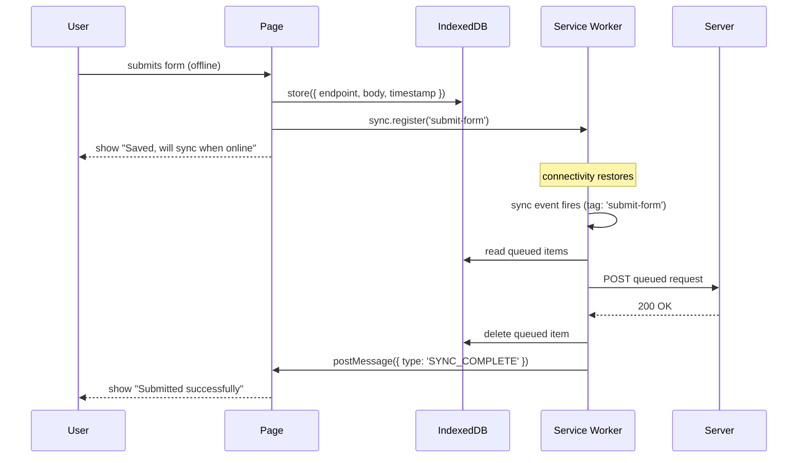

# [FEE-1305] Offline UX Patterns

## Introduction

The offline condition is not exceptional. Mobile networks drop in tunnels, elevators, and rural areas. Wi-Fi associates with a router but that router has no upstream internet — a condition known as "lie-fi." Corporate proxies return errors for certain external hosts. Corporate VPNs disconnect mid-session. Battery-saver mode on Android can throttle or disable radios entirely. Every application that reaches real users in real environments will serve users who are, at any given moment, offline or on a degraded network. The question is not whether your application will encounter this condition, but what it does when it does.

The browser's default answer to an offline navigation request is a dinosaur game (Chrome) or an error page (Firefox/Safari). These default error pages are appropriate for pages that have made no effort to handle offline — they communicate clearly that the network is unavailable. But for a web application that has installed a service worker, registered caching strategies, and declared itself as a PWA, showing the browser's default offline page is a failure of the application's own contract with the user. It signals: this application does not care about your offline experience. Users notice.

Good offline UX does not require full offline capability. Most applications do not need to function entirely without a network — that is a high-complexity goal that requires conflict resolution strategies and is out of scope for most teams. What every PWA does need is: a clear signal to the user when the network is unavailable, a graceful fallback instead of a blank screen, and — for write-heavy applications — a mechanism to accept user input offline and synchronize it when the connection restores. These three capabilities are achievable with a relatively small surface of APIs: the `online`/`offline` window events, a precached fallback page served by the service worker, optimistic local state management, and the Background Sync API. This article covers each in turn.

## Design Thinking

### Detecting network state

The browser exposes three mechanisms for detecting offline conditions, each with different cost and reliability characteristics.

`navigator.onLine` is a boolean property that the browser sets to `false` when it is definitively offline — no physical network interface at all. The problem is what it returns when the user is connected to a router but that router has no internet path: `true`. This is lie-fi, and it is extremely common on mobile. A user in a café whose ISP has an outage, or a user on a train whose LTE signal has no upstream route, will have `navigator.onLine === true` even though every network request they make will time out or fail. Using `navigator.onLine` as the sole signal before a critical write operation — a payment, a form submission, a message send — will silently allow the operation to proceed, fail at the network level, and leave the user in an ambiguous state.

The `online` and `offline` window events fire when the browser detects a transition between connected and disconnected states. They have the same lie-fi limitation as `navigator.onLine` — they reflect the browser's view of the network interface, not the reachability of any particular server. Their advantage is cost: listening to these events and showing or hiding a UI indicator adds approximately ten lines of JavaScript and no network round trips. For low-stakes UI — a banner that says "You appear to be offline" — this level of signal is appropriate and good enough. It will miss lie-fi, but it will catch the clear offline case and update the UI immediately when connectivity restores.

A probe request sends a `HEAD` request to a known reliable endpoint with a short timeout. If the request fails or times out, the user is effectively offline. Good probe targets are small resources on infrastructure you control: `/healthz` (a health check endpoint that returns `200 OK` with an empty body), a 1×1 pixel PNG served from your CDN, or a specific well-known URL. The probe adds 200–500ms of latency in the normal case — the time required to send a `HEAD` request and receive the headers — but it is the only mechanism that distinguishes lie-fi from genuine connectivity. Probing should be used immediately before critical write operations that cannot be retried transparently: payment form submission, sending a message, posting content that will be permanently attributed to the user.

The decision rule for which mechanism to use follows from the stakes of the operation:

| Signal | Reliability | Latency cost | When to use |
|--------|-------------|--------------|-------------|
| `online`/`offline` events | Low — misses lie-fi | None | Showing a "you appear to be offline" UI indicator |
| `navigator.onLine` check | Low — same limitation | None | Quick guard before low-stakes reads; never for writes |
| Probe request (`HEAD` + timeout) | High | 200–500ms | Before payment, message send, any irreversible write |

### The offline fallback page

The offline fallback page is a precached HTML document that the service worker serves in place of any navigation request that fails — network error with no cache hit. It is not stale content from a previous visit; it is a purpose-designed page that explains the offline condition and tells the user what they can do. A minimal offline fallback page should include: a clear message that the network is unavailable, a list of features that remain available offline (if any), and a retry button that attempts to reload the failed navigation.

The critical constraint is that the offline fallback must be precached during the service worker's `install` event. The install event is the one point in the service worker lifecycle where the browser guarantees that the service worker has network access (or can complete from the install cache). If `/offline.html` is only cached at runtime — when a user first visits the page — then a user who installs the PWA and immediately goes offline before visiting will have no fallback available. Precaching in `install` guarantees that the fallback exists from the moment the service worker activates.

In the fetch handler, the offline fallback applies only to navigation requests — requests where `event.request.mode === 'navigate'`. Subresource requests (scripts, stylesheets, images) that fail offline should be handled by their own caching strategies. Returning the offline HTML for a failed image request would break page rendering in unexpected ways. The navigation-only guard is a single `if` statement in the fetch handler.

### Optimistic UI

Optimistic UI is the pattern of updating the local application state immediately when the user takes an action, without waiting for the server to confirm the write. The user sees the success state — the like count incremented, the message appearing in the thread, the draft saved — before the network round trip completes. The write to the server is issued in the background. If it succeeds, nothing changes (the user already sees success). If it fails transiently, the application retries. If it fails permanently, the application rolls back the local state and shows an error.

The three-step pattern is: (1) update local state immediately and render the success state; (2) issue the write to the server asynchronously; (3) on permanent failure, roll back local state and notify the user. Step 3 is the most commonly skipped step, and skipping it causes silent data loss. If the user clicks "like" on a post, the count increments, and the network write is silently discarded because the user went offline before it completed, the user believes the action succeeded. They leave the page. The like never reaches the server. This is a worse outcome than an error message.

The appropriate scope of optimistic UI is append-only or idempotent operations where the risk of permanent failure is low and the consequence of rollback is non-catastrophic: social reactions, message sends in a chat interface, draft autosave, item addition to a list. For destructive operations — deletes, transfers, purchases — optimistic UI should be approached with caution. The cost of a false-positive success state on a payment is much higher than the benefit of not showing a loading spinner.

### Background Sync API

The Background Sync API allows a web application to register a sync task with the service worker and have the browser execute that task when connectivity restores — even if the page that registered the task has since been closed. This is qualitatively different from retrying a `fetch` call in the page context: a page-based retry stops when the user navigates away. A Background Sync registration persists in the browser until the sync handler runs successfully.

The registration flow has two parts. The page side stores the pending write in IndexedDB — a persistent, quota-managed storage that survives page reloads and service worker restarts — and then registers a sync tag: `navigator.serviceWorker.ready.then(reg => reg.sync.register('submit-form'))`. The order matters: the IndexedDB write must complete before the sync tag is registered. The sync event may fire very quickly after registration (if connectivity is already available), and if the queue is empty when the sync handler runs, the registration will appear to have succeeded while no data was actually sent.

The service worker side listens for the `sync` event: `self.addEventListener('sync', event => { if (event.tag === 'submit-form') event.waitUntil(replayQueue()) })`. The `event.waitUntil()` call takes a Promise. If the Promise resolves, the browser considers the sync complete and removes the registration. If the Promise rejects, the browser will retry with exponential backoff — the exact backoff schedule is browser-controlled — up to a maximum number of retries. After the maximum retries are exhausted, the sync registration is discarded. The sync handler MUST read from the IndexedDB queue, attempt the network write, and delete the queue entry only after a confirmed successful response. Deleting before confirmation means the write is lost if the request fails after deletion.

Browser support for Background Sync is uneven and the gap matters in practice. Chrome and Edge support the API fully. Firefox support is limited. iOS Safari does not support it. Applications that target a user base that includes iOS Safari users — which is most consumer-facing web applications — cannot rely on Background Sync as the only retry mechanism. The fallback pattern is a manual retry button on the UI that the user can tap when they know they are back online. The presence of a retry button makes the application correct for all browsers; Background Sync is an enhancement that makes the experience seamless for browsers that support it.

### Read-only vs. write-capable offline — decision table

| Approach | Complexity | When to use |
|----------|-----------|-------------|
| Read-only: serve stale cached content | Low — implement Network-First or Stale-While-Revalidate caching (see FEE-1303) | News sites, documentation, dashboards — users can read cached content but cannot submit |
| Optimistic UI with client-side queue | Medium — manage local state, issue background writes, handle rollback | Apps with simple writes: likes, reactions, draft autosave, append-only messages |
| Background Sync + IndexedDB queue | Medium-high — requires SW sync event handler, persistent IndexedDB queue, and manual retry fallback | Writes that must succeed eventually, even if the page closes before connectivity restores |
| Full offline-first with conflict resolution | High — requires CRDTs or server-side merge logic, out of scope | Collaborative editing at the Google Docs level — not covered in this article |

## Best Practices

**MUST precache the offline fallback page unconditionally.** Add `/offline.html` to the service worker's `install` event cache open call. You MUST NOT rely on a runtime cache entry for the fallback. The fallback must be available before any user visit occurs.

**SHOULD test the offline fallback in DevTools before shipping.** Open DevTools, go to Application > Service Workers, check "Offline," navigate to a route that is not cached. The offline page MUST appear. If the browser's default error page appears, the fallback is not working.

**MUST NOT conflate the offline indicator with the offline fallback.** The online/offline event listener drives a UI indicator (a banner, a status chip) that tells the user their current network state on the current page. The offline fallback is a full-page replacement for a navigation request that fails. These are two different mechanisms serving two different purposes; implementing one does not implement the other.

**MUST keep the sync queue in IndexedDB, not sessionStorage or memory.** A queue stored in memory is lost on page refresh. A queue stored in sessionStorage is lost when the browser tab closes. Only IndexedDB persists across both page reloads and service worker restarts. The `idb` library (Jake Archibald) provides a clean Promise-based wrapper around the raw IndexedDB API and reduces the boilerplate significantly.

**MUST register the sync tag after the IndexedDB write, not before.** The sync event can fire almost immediately after registration if the network is available. If the tag is registered before the data is in IndexedDB, the handler will run with an empty queue and return a resolved Promise, which the browser interprets as success. The queued data is then orphaned — it sits in IndexedDB with no registered sync tag to process it.

**SHOULD notify the user of queue status on both ends.** When a write is queued offline, show a message: "Saved locally. Will submit when you're back online." When the sync completes (the service worker posts a `postMessage` to the page), the UI MUST update: "Submitted successfully." The full round-trip feedback loop prevents duplicates and builds trust.

**MUST provide a manual retry button for all browsers.** Background Sync is a progressive enhancement, not a baseline. You MUST wrap sync registration in a feature detection check against `ServiceWorkerRegistration.prototype` and always render a "Retry" button in the UI for users on unsupported browsers. The retry button reads the IndexedDB queue and replays it directly from the page when clicked.

**MUST roll back optimistic state on permanent failure.** Define what "permanent failure" means for each operation: typically, a non-retriable HTTP status code (400, 401, 403, 404, 409, 422) or exhaustion of a retry budget. When permanent failure is detected, you MUST revert the local state change and show the user a clear error message with the option to try again.

## Diagram



## Example

The following example is split across two files: `public/sw.js` contains the service worker additions for offline fallback and Background Sync, and `src/hooks/useContactForm.ts` contains the page-side logic for detecting offline state, writing to IndexedDB, and registering the sync tag.

### Service worker: offline fallback and Background Sync handler

```js
// public/sw.js (relevant additions)

const OFFLINE_PAGE = '/offline.html';

// Precache the offline fallback during install so it is guaranteed
// to be available before any user navigation occurs.
self.addEventListener('install', (event) => {
  event.waitUntil(
    caches.open('app-v1').then((cache) => cache.add(OFFLINE_PAGE))
  );
});

// Offline fallback: any navigation request that fails (network error
// with no cache hit) is answered with the precached offline page.
// The guard `event.request.mode === 'navigate'` ensures we only
// apply the fallback to full-page navigations, not subresource requests.
self.addEventListener('fetch', (event) => {
  if (event.request.mode === 'navigate') {
    event.respondWith(
      fetch(event.request).catch(() => caches.match(OFFLINE_PAGE))
    );
    return;
  }
  // Other fetch handling (caching strategies for assets, API requests, etc.)
  // would be registered here.
});

// Background Sync handler: fires when connectivity restores.
// event.waitUntil() receives a Promise; if it rejects, the browser
// retries with exponential backoff. If it resolves, the registration
// is removed.
self.addEventListener('sync', (event) => {
  if (event.tag === 'submit-contact-form') {
    event.waitUntil(replayContactFormQueue());
  }
});

async function replayContactFormQueue() {
  const db = await openDB('offline-queue', 1);
  const items = await db.getAll('contact-form');

  await Promise.all(
    items.map(async (item) => {
      const response = await fetch('/api/contact', {
        method: 'POST',
        headers: { 'Content-Type': 'application/json' },
        body: JSON.stringify(item.body),
      });

      // Only delete the queue entry after a confirmed successful response.
      // Deleting before confirmation means the item is lost if the write
      // fails after the delete — a subtle but critical ordering constraint.
      if (response.ok) {
        await db.delete('contact-form', item.id);

        // Notify the page so it can update the UI from "queued" to "submitted".
        const clients = await self.clients.matchAll({ type: 'window' });
        clients.forEach((client) =>
          client.postMessage({ type: 'SYNC_COMPLETE', itemId: item.id })
        );
      }
    })
  );
}
```

### Page side: queue registration and network detection

```ts
// src/hooks/useContactForm.ts
import { openDB } from 'idb';

export interface ContactFormData {
  name: string;
  email: string;
  message: string;
}

// Feature detection for Background Sync API.
// Background Sync is supported in Chrome and Edge. Firefox support is
// limited. iOS Safari does not support it. Always provide a manual
// retry path for unsupported environments.
const backgroundSyncSupported =
  'serviceWorker' in navigator &&
  'SyncManager' in (window.ServiceWorkerRegistration?.prototype ?? {});

async function getQueueDB() {
  return openDB('offline-queue', 1, {
    upgrade(db) {
      if (!db.objectStoreNames.contains('contact-form')) {
        db.createObjectStore('contact-form', {
          autoIncrement: true,
          keyPath: 'id',
        });
      }
    },
  });
}

export async function submitContactForm(
  data: ContactFormData
): Promise<{ queued: boolean; id?: number }> {
  // Use a probe request rather than navigator.onLine to detect lie-fi.
  // navigator.onLine returns true even when the user is connected to a
  // router with no upstream internet path.
  const online = await probeConnectivity();

  if (!online) {
    // Write to IndexedDB BEFORE registering the sync tag.
    // The sync event may fire immediately after registration if
    // connectivity is available; registering before the write means
    // the handler runs against an empty queue.
    const db = await getQueueDB();
    const id = await db.add('contact-form', {
      body: data,
      timestamp: Date.now(),
    });

    if (backgroundSyncSupported) {
      const reg = await navigator.serviceWorker.ready;
      await reg.sync.register('submit-contact-form');
    }
    // If Background Sync is not supported, the item sits in IndexedDB
    // until the user manually triggers a retry from the UI.

    return { queued: true, id: id as number };
  }

  // Online path: submit directly.
  const response = await fetch('/api/contact', {
    method: 'POST',
    headers: { 'Content-Type': 'application/json' },
    body: JSON.stringify(data),
  });

  if (!response.ok) {
    throw new Error(`Submit failed: ${response.status}`);
  }
  return response.json();
}

// Probe connectivity by sending a HEAD request to a known reliable endpoint.
// Falls back to navigator.onLine if the probe itself errors unexpectedly.
async function probeConnectivity(timeoutMs = 4000): Promise<boolean> {
  try {
    const controller = new AbortController();
    const timer = setTimeout(() => controller.abort(), timeoutMs);
    const response = await fetch('/healthz', {
      method: 'HEAD',
      cache: 'no-store',
      signal: controller.signal,
    });
    clearTimeout(timer);
    return response.ok;
  } catch {
    return false;
  }
}

// Manual retry: reads the IndexedDB queue and replays it directly.
// Call this from a "Retry" button in the UI, for browsers without Background Sync.
export async function replayQueueManually(): Promise<void> {
  const db = await getQueueDB();
  const items = await db.getAll('contact-form');

  for (const item of items) {
    const response = await fetch('/api/contact', {
      method: 'POST',
      headers: { 'Content-Type': 'application/json' },
      body: JSON.stringify(item.body),
    });
    if (response.ok) {
      await db.delete('contact-form', item.id);
    }
  }
}
```

### Listening for sync completion in the component

```ts
// src/components/ContactForm.vue (script setup — excerpt)
import { onMounted, onUnmounted } from 'vue';

function handleServiceWorkerMessage(event: MessageEvent) {
  if (event.data?.type === 'SYNC_COMPLETE') {
    // Update the UI: "Your message was submitted successfully."
    // This fires when the service worker successfully replays the queued
    // item and deletes it from IndexedDB.
    syncStatus.value = 'submitted';
  }
}

onMounted(() => {
  navigator.serviceWorker?.addEventListener('message', handleServiceWorkerMessage);
});

onUnmounted(() => {
  navigator.serviceWorker?.removeEventListener('message', handleServiceWorkerMessage);
});
```

### The offline indicator (online/offline events)

```ts
// src/composables/useNetworkStatus.ts
import { ref, onMounted, onUnmounted } from 'vue';

export function useNetworkStatus() {
  const isOnline = ref(navigator.onLine);

  function handleOnline() { isOnline.value = true; }
  function handleOffline() { isOnline.value = false; }

  onMounted(() => {
    window.addEventListener('online', handleOnline);
    window.addEventListener('offline', handleOffline);
  });

  onUnmounted(() => {
    window.removeEventListener('online', handleOnline);
    window.removeEventListener('offline', handleOffline);
  });

  return { isOnline };
}
```

The `isOnline` ref drives a banner in the application shell. Note that this composable uses the `online`/`offline` events — appropriate for a low-stakes UI indicator — while `submitContactForm` uses a probe request for the higher-stakes decision of whether to queue or submit directly. Both mechanisms coexist in the same application with different jobs.

## Common Mistakes

**Using `navigator.onLine` as the sole offline check before a critical write.** `navigator.onLine` returns `true` on lie-fi: the user is associated with a Wi-Fi access point that has no upstream internet connection. A payment form submission that passes the `navigator.onLine` check and then fails with a network timeout has given the user a false sense of security. Use a probe request before any irreversible write.

**Deleting the IndexedDB queue entry before confirming the network write succeeded.** The safe order is: send the request, receive a `response.ok` confirmation, then delete the queue entry. If the order is reversed — delete first, then send — a network failure after the delete leaves the queue empty and the write lost with no way to replay it.

## Related FEEs

- [FEE-1302: Service Workers](./1302.md) — the SW fetch handler that serves the offline fallback and receives the sync event
- [FEE-1303: Caching Strategies](./1303.md) — Network-First and Stale-While-Revalidate for serving cached content while offline
- [FEE-404: Storage & State Persistence](../Browser%20APIs%20and%20Web%20Platform/404.md) — IndexedDB as the persistent store for the offline write queue

## References

- MDN Web Docs — [Background Synchronization API](https://developer.mozilla.org/en-US/docs/Web/API/Background_Synchronization_API)
- MDN Web Docs — [navigator.onLine](https://developer.mozilla.org/en-US/docs/Web/API/Navigator/onLine)
- web.dev — [Offline UX design guide](https://web.dev/articles/offline-ux-design-guidelines)
- web.dev — [Handling optional payment information with a service worker](https://web.dev/articles/offline-fallback-page)
- Jake Archibald — [idb library](https://github.com/jakearchibald/idb) — Promise-based IndexedDB wrapper
- Can I Use — [Background Sync API browser support](https://caniuse.com/background-sync)
