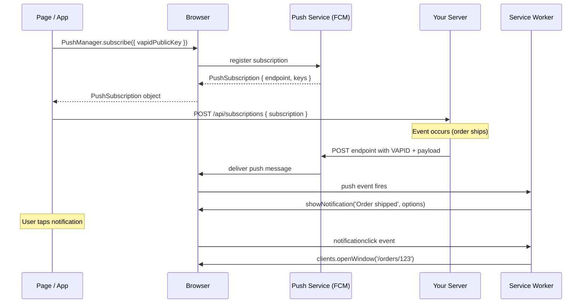

# [FEE-1306] Push Notifications & Background Sync

## Introduction

A push notification is a message delivered to a user's device by the browser, initiated by a server, even when the web application is not open in any browser tab. This capability closes one of the last major gaps between web applications and native apps: native apps have been able to push timely, relevant messages to users for over a decade, while the web historically could only surface information when the user actively visited a page. The Web Push API and its companion Push API, standardized through the Internet Engineering Task Force, bring this re-engagement surface to the browser platform in a way that is interoperable across Chrome, Firefox, and Safari (16.4+), without requiring users to install a native app.

The architectural insight behind Web Push is that the browser never receives messages directly from your server. Instead, your server sends messages through an intermediary service — the push service — which is operated by the browser vendor. For Chrome users, this is Firebase Cloud Messaging (FCM). For Firefox users, it is Mozilla's push service. For Safari users on iOS and macOS 13+, it is Apple's APNs-backed service. Your server communicates with these intermediary services using a standardized protocol — RFC 8030, the "Generic Event Delivery Using HTTP Push" specification — authenticated by VAPID (Voluntary Application Server Identification, RFC 8292). The push service then delivers the message to the browser, which wakes the service worker if necessary, and the service worker displays the notification. Your server never holds open a connection to the user's browser; the push service absorbs that complexity.

This architecture has important practical implications. Because the push service operates as an intermediary, your server does not need to track user socket connections, manage long-lived connections, or scale a WebSocket tier to send push notifications. The trade-off is latency: a push notification is not a real-time synchronous channel. There is no guaranteed delivery time — the push service may batch or delay delivery on low-power devices, and if the subscription endpoint becomes invalid (the user cleared browser data, or revoked permission), the delivery silently fails. Push notifications are a re-engagement tool, not a real-time data channel. Treating them as the former and choosing the correct alternative for the latter (Server-Sent Events or WebSocket — covered in FEE-403) is one of the key design decisions this article covers.

## Design Thinking

### The end-to-end push flow

The Web Push protocol involves six distinct steps, each owned by a different actor. Understanding which actor owns which step is essential for debugging and for correctly partitioning responsibilities between client code, service worker code, and server code.

**Step 1 — Subscribe.** The page calls `reg.pushManager.subscribe({ userVisibleOnly: true, applicationServerKey: vapidPublicKey })`. The `userVisibleOnly: true` flag is not optional in browsers that enforce it (Chrome requires it, Firefox relaxes it in some contexts, but omitting it is not safe practice). The `applicationServerKey` is the VAPID public key converted from a URL-safe Base64 string into a `Uint8Array`. When `subscribe()` is called, the browser contacts the push service (FCM, Mozilla's service, or Apple's service, depending on the browser), registers the subscription, and returns a `PushSubscription` object. This object has two key properties: `endpoint` (a unique URL at the push service that your server will POST to when sending a notification) and `keys` (containing `p256dh` and `auth`, the encryption keys used to encrypt the notification payload so only the browser can decrypt it).

**Step 2 — Store.** The page sends the `PushSubscription` object to your server via an authenticated POST request. The server stores the subscription in a database, associated with the user's account. The subscription must be stored as-is — your server will need the `endpoint`, `p256dh`, and `auth` values when sending notifications. A subscription may expire or be invalidated (for example, if the user clears browser data), and your server SHOULD handle HTTP 404 and HTTP 410 responses from the push service by deleting the corresponding stored subscription rather than retrying against a dead endpoint.

**Step 3 — Send.** When an event occurs that warrants notifying the user — an order ships, a message arrives, an appointment is approaching — your server retrieves the user's stored subscription from the database and calls the push service's endpoint with the VAPID-signed notification payload. The `web-push` npm package (or equivalent libraries in other languages) handles the VAPID signing, the payload encryption using the user's `p256dh` and `auth` keys, and the HTTP request to the push service endpoint. Your server does not send the notification directly to the user's browser.

**Step 4 — Deliver.** The push service receives the request from your server, validates the VAPID signature, and delivers the message to the browser. The browser may need to wake the service worker to handle the message. On mobile devices, this may involve waking the device from sleep; the push service coordinates with the operating system's wake mechanism (Android's FCM system, iOS's APNs). There is no guaranteed delivery time; the push service may apply delays based on device battery state, network conditions, or vendor policies.

**Step 5 — Show.** The service worker receives the `push` event. The handler reads the payload with `event.data.json()` (or `.text()` if the payload is not JSON), extracts the notification title, body, icon, tag, and other options, and calls `self.registration.showNotification(title, options)`. This call is wrapped in `event.waitUntil()` so the browser keeps the service worker alive until the notification is displayed.

**Step 6 — Handle click.** When the user taps or clicks the notification, the browser fires the `notificationclick` event in the service worker. The handler closes the notification with `event.notification.close()`, reads the target URL from `event.notification.data.url`, and either focuses an existing browser window/tab at that URL or opens a new one. All async work is wrapped in `event.waitUntil()`.

### VAPID: what it is and why it is not optional

VAPID (Voluntary Application Server Identification) is a public/private key pair that allows the push service to verify the identity of the server sending notifications. When your server sends a push message, it includes a signed JSON Web Token (JWT) in the `Authorization` header. The JWT is signed with the VAPID private key and carries the server's contact email and a short expiry. The push service validates the signature against the VAPID public key — the same key the browser submitted when creating the subscription. If the signature is invalid or the VAPID credentials are missing, the push service rejects the request.

VAPID is required by Chrome's FCM, Firefox's push service, and Safari's APNs-backed service (since Safari 16.4). There is no browser-supported path to sending push notifications without VAPID in 2024. Generate the key pair once with `npx web-push generate-vapid-keys`. Store the private key as an environment variable on your server; never expose it to client-side code. Pass the public key to your frontend, typically via an environment variable (`VITE_VAPID_PUBLIC_KEY`), so the browser can use it in `PushManager.subscribe()`.

### Permission timing: the "notify me" pattern

The permission dialog is a one-way door. A denial is permanent from the application's perspective and can only be reversed by the user through browser settings. Because of this asymmetry, the correct strategy is to invest in context before ever calling `Notification.requestPermission()`.

The wrong pattern: calling `Notification.requestPermission()` on page load, in a `useEffect` on mount, or from any code path that executes without a user action. This is the single most common push notification mistake. The user has no idea what the site is or what it would notify them about. The rejection rate for unsolicited permission requests is extremely high.

The right pattern: show a soft in-app prompt first. This is an HTML element — a banner, a card, a drawer — that you control completely. It says something like "Stay updated on your order — tap 'Enable Notifications' to get instant order status updates." When the user taps "Enable Notifications" in your UI, your code calls `Notification.requestPermission()`. The browser dialog appears at a moment when the user has opted into it, in a context that explains why they would want it.

A common variation that should be avoided: showing a custom dialog that asks "Would you like to receive notifications?" with Yes/No buttons, and then calling `requestPermission()` when the user clicks Yes. This creates a confusing double-prompt: the user says yes to your dialog, and then the browser immediately asks the same question again. Use the in-app banner to describe the value proposition, and wire the button directly to `requestPermission()` — not to another confirmation dialog.

### Decision: push vs. alternatives

Not every re-engagement or update scenario calls for push notifications. The following table maps common scenarios to the appropriate tool.

| Scenario | Recommended tool |
|----------|-----------------|
| App is closed; user needs to know about an important event (order shipped, message received) | Push notification |
| App is open; show real-time updates to active users | Server-Sent Events or WebSocket (FEE-403) |
| Resource changes slowly (less than once per minute); app is open | `setInterval` polling |
| Write must succeed eventually even if the page closes | Background Sync (FEE-1305) |
| iOS before 16.4 (Safari does not support Web Push) | Fall back to in-app notification on next visit |

The most important distinction is between "app is closed" and "app is open." Push notifications are designed for the closed-app case — they can reach users who are not currently using your application. For users who have the application open and are actively using it, push is the wrong tool: it would create a redundant notification alongside the in-app update. Use Server-Sent Events (for server-initiated one-way streams) or WebSocket (for bidirectional communication) to update the UI in real time when the app is open.

### Notification options in depth

The `options` object passed to `showNotification()` has a number of fields that materially affect user experience:

- `icon`: The URL of a square image (typically 192×192px) displayed alongside the notification. Use your app icon.
- `badge`: A small monochrome image (typically 72×72px) displayed in the Android status bar. This is the icon the user sees without unlocking the screen.
- `body`: The notification body text. Keep it to one or two sentences; notifications that are too long are truncated by the OS.
- `tag`: A string that deduplicates notifications. If a new notification arrives with the same `tag` as an existing notification, the existing notification is replaced rather than a second notification being added. Always set `tag` for notifications that represent an ongoing state (a chat conversation, an order, a download) — without it, rapid pushes create a stack of separate notifications, which users experience as spam.
- `renotify`: A boolean (default `false`). When `true`, replacing a tagged notification plays the sound and vibration as if it were a new notification. Set this to `true` when the replacement represents genuinely new content the user should be alerted to, even if it replaces a prior notification about the same topic.
- `actions`: An array of up to two action objects, each with an `action` string identifier and a `title` string. These render as buttons inside the notification on Android and some desktop browsers. The selected action is available in `notificationclick` via `event.action`.
- `data`: An arbitrary serializable object stored with the notification. Use this to pass the URL the notification should open, the ID of the relevant entity, or any other information the `notificationclick` handler will need. Avoid putting anything large here; the payload is stored by the browser until the notification is dismissed.

### iOS Safari constraints

Safari added Web Push support in version 16.4 (released March 2023), but with meaningful restrictions that differ from Chrome and Firefox. On iOS, push notifications from the web require the user to add the site to their Home Screen first (as a Progressive Web App). A web page opened in Safari's browser tab cannot request push permission on iOS — the call to `Notification.requestPermission()` will be ignored. The user must first tap the Share button and select "Add to Home Screen," and then open the resulting Home Screen icon. Only then can the installed PWA request push permission and subscribe.

This constraint has a direct impact on how you design the subscription flow for iOS users. `navigator.standalone` (a non-standard but widely supported property) returns `true` when the page is running as an installed Home Screen app. Use this as a gate: if `navigator.standalone !== true` on iOS, show an informational prompt explaining that the user must add the app to their Home Screen before enabling notifications, rather than calling `requestPermission()` which will silently fail.

Additionally, iOS Safari's push notifications have some option restrictions: `actions` are not supported (notification action buttons do not appear), `badge` is not supported, and the `icon` must be pre-declared in the Web App Manifest rather than being settable at notification time via `showNotification()`.

## Best Practices

**MUST NOT call `Notification.requestPermission()` except from a user-initiated action after positive engagement.** Place an "Enable notifications" button in a contextually relevant location — the order confirmation page, the chat interface, the settings page — rather than on an entry screen. Explain clearly what the user will be notified about before they tap the button. You MUST call `Notification.requestPermission()` only from the click handler of that button, never on mount or scroll.

**MUST convert the VAPID public key before passing it to `subscribe()`.** The `applicationServerKey` parameter requires a `Uint8Array`, but the VAPID public key generated by `web-push generate-vapid-keys` is a URL-safe Base64 string. The conversion involves stripping URL-safe characters, adding padding, running `atob()`, and mapping character codes to bytes. This conversion is a standard utility that every push implementation needs; the example section below provides the canonical implementation.

**MUST set the `tag` field on notifications.** Without `tag`, every push notification creates a new entry in the notification drawer, even if they all relate to the same entity (the same chat conversation, the same order). A user who receives ten order status updates sees ten separate notifications. Set `tag` to a string that uniquely identifies the entity the notification is about (for example, `order-${orderId}` or `chat-${conversationId}`). The most recent notification for that tag replaces all previous ones.

**MUST handle expired and invalid subscriptions on the server.** When the push service returns HTTP 404 (subscription not found) or HTTP 410 (subscription has expired and should not be retried), your server MUST delete the corresponding subscription from its database. Continuing to send to a dead endpoint wastes server resources and may result in the push service rate-limiting your application. The `web-push` library's `sendNotification()` rejects with a `WebPushError` whose `statusCode` property can be inspected for this purpose.

**MUST implement `notificationclick`.** A push notification that the user taps and nothing happens is a significantly worse experience than not receiving the notification at all. The user has interrupted what they were doing to tap the notification; if the result is silence, their trust in your application's notifications decreases immediately. The `notificationclick` handler MUST close the notification and navigate the user to the relevant page, either by focusing an existing window at that URL or by opening a new one.

**MUST** call `event.waitUntil()` in the service worker's `push` event handler, wrapping a Promise that resolves after `self.registration.showNotification()` completes. The browser is permitted to terminate the service worker as soon as the `push` event handler returns synchronously. If `showNotification()` is called outside of `event.waitUntil()`, the browser may kill the worker before the asynchronous display operation finishes and the notification will silently never appear.

**MUST** call `event.waitUntil()` in the `notificationclick` handler, wrapping any asynchronous work such as `clients.matchAll()` or `clients.openWindow()`. Without `event.waitUntil()`, the browser terminates the service worker before the async chain completes and the intended window never opens or focuses — leaving the user who tapped the notification with no visible response.

**SHOULD send the minimal payload needed.** The Web Push payload is encrypted and has a size limit of 4096 bytes after encryption overhead. Treat the push payload as a pointer to a resource, not the resource itself. Send the notification title, body, URL, and tag — not the full entity data. The client retrieves fresh data from the server when it opens. This pattern also avoids stale data: a notification payload is generated at send time, but the user may open the notification minutes or hours later.

**SHOULD provide a subscription management UI.** Users who enabled push notifications SHOULD be able to disable them from within your application without needing to find browser settings. Implement an unsubscribe flow: call `subscription.unsubscribe()` on the client, and send a DELETE request to your server to remove the stored subscription. Without this, users who want to stop notifications are left with no obvious recourse except revoking permission in browser settings — a hostile experience that may lead to permanent blocks.

**SHOULD test push and notification click handlers with browser DevTools before wiring up the server.** Chrome DevTools Application panel has a Push panel under Service Workers that allows sending a test push message. Always test the `notificationclick` handler by clicking the notification in the OS notification center, not just by triggering the event from DevTools.

## Diagram



## Example

The following example is split across three files: a TypeScript hook for the browser-side subscription flow, a Node.js/Express route for the server-side send logic, and a service worker for the `push` and `notificationclick` handlers.

### Step 0: Generate VAPID keys

Run this once. Store the private key in your server environment. Set the public key as a frontend environment variable.

```bash
npx web-push generate-vapid-keys
```

The output looks like:

```
Public Key:
BEl62iUYgUivxIkv69yViEuiBIa40HuFXqZ...

Private Key:
yfWVHRlz5rOXOsJI...
```

Set `VAPID_PUBLIC_KEY` and `VAPID_PRIVATE_KEY` in your server environment. Set `VITE_VAPID_PUBLIC_KEY` to the public key value in your frontend build environment.

### Browser side: subscribing to push

```ts
// src/hooks/usePushNotifications.ts

const VAPID_PUBLIC_KEY = import.meta.env.VITE_VAPID_PUBLIC_KEY;

/**
 * Convert a URL-safe Base64 VAPID public key string into a Uint8Array
 * suitable for the PushManager.subscribe() applicationServerKey parameter.
 *
 * This conversion is required because the VAPID key is distributed as a
 * Base64 string, but the browser API requires a typed array. The URL-safe
 * Base64 alphabet uses '-' and '_' instead of '+' and '/'; atob() requires
 * the standard alphabet, so the substitution must happen before decoding.
 */
function urlBase64ToUint8Array(base64String: string): Uint8Array {
  const padding = '='.repeat((4 - (base64String.length % 4)) % 4);
  const base64 = (base64String + padding).replace(/-/g, '+').replace(/_/g, '/');
  const rawData = atob(base64);
  return new Uint8Array([...rawData].map((char) => char.charCodeAt(0)));
}

/**
 * Check whether push notifications are supported and whether the user
 * has already granted, denied, or not yet responded to the permission prompt.
 *
 * Call this on mount to determine which UI to show. Do not call
 * Notification.requestPermission() here — only read the current state.
 */
export function getPushPermissionState(): NotificationPermission | 'unsupported' {
  if (!('Notification' in window) || !('serviceWorker' in navigator) || !('PushManager' in window)) {
    return 'unsupported';
  }
  return Notification.permission;
}

/**
 * Subscribe the current user to push notifications.
 *
 * Call this ONLY from a user-initiated action (a button click handler).
 * Never call on page load or component mount.
 *
 * The function:
 *   1. Requests browser notification permission (shows the browser dialog).
 *   2. Retrieves the active service worker registration.
 *   3. Creates a push subscription via PushManager.subscribe().
 *   4. POSTs the subscription to your server for storage.
 *
 * Returns 'granted' if the full flow succeeded, 'denied' if the user
 * declined the permission dialog, or 'unsupported' if the browser
 * does not support Web Push.
 */
export async function subscribeToPush(): Promise<'granted' | 'denied' | 'unsupported'> {
  if (getPushPermissionState() === 'unsupported') return 'unsupported';

  // Request permission. This shows the browser dialog. Only call from
  // a user-initiated event handler.
  const permission = await Notification.requestPermission();
  if (permission !== 'granted') return 'denied';

  // Wait for the active service worker. If no SW is registered, this
  // promise will never resolve — ensure a SW is registered before
  // calling this function.
  const reg = await navigator.serviceWorker.ready;

  // Subscribe to push. The browser contacts the push service (FCM, Mozilla,
  // or Apple depending on the browser) and returns a PushSubscription object.
  const subscription = await reg.pushManager.subscribe({
    userVisibleOnly: true,
    applicationServerKey: urlBase64ToUint8Array(VAPID_PUBLIC_KEY),
  });

  // Send the subscription to your server. Include authentication headers
  // if your API requires them.
  const response = await fetch('/api/subscriptions', {
    method: 'POST',
    headers: { 'Content-Type': 'application/json' },
    body: JSON.stringify(subscription),
  });

  if (!response.ok) {
    // The subscription was created in the browser but could not be stored
    // on the server. Consider calling subscription.unsubscribe() here to
    // keep the browser and server state consistent.
    throw new Error(`Failed to store subscription: ${response.status}`);
  }

  return 'granted';
}

/**
 * Unsubscribe the current user from push notifications.
 *
 * Calls subscription.unsubscribe() to revoke the browser-side subscription,
 * then sends a DELETE request to the server to remove the stored subscription.
 */
export async function unsubscribeFromPush(): Promise<void> {
  const reg = await navigator.serviceWorker.ready;
  const subscription = await reg.pushManager.getSubscription();
  if (!subscription) return;

  await subscription.unsubscribe();

  await fetch('/api/subscriptions', {
    method: 'DELETE',
    headers: { 'Content-Type': 'application/json' },
    body: JSON.stringify({ endpoint: subscription.endpoint }),
  });
}
```

### Server side: sending push notifications

```js
// server/push.js (Node.js — works with Express, Fastify, or any HTTP framework)
import webPush from 'web-push';

// Configure VAPID credentials once at server startup.
// The contact email is sent to the push service so they can contact you
// if your server is misbehaving. It does not need to be a public address.
webPush.setVapidDetails(
  'mailto:admin@acme.com',
  process.env.VAPID_PUBLIC_KEY,
  process.env.VAPID_PRIVATE_KEY
);

/**
 * Send a push notification to a single subscription.
 *
 * @param {object} subscription - The PushSubscription object stored in the DB.
 *   Must have endpoint, keys.p256dh, and keys.auth.
 * @param {object} payload - The notification data. Will be JSON-encoded.
 *   Recommended shape: { title, body, icon, badge, tag, url, actions }
 *
 * @throws {WebPushError} with statusCode 404 or 410 if the subscription
 *   has expired or the user has revoked permission. Callers should catch
 *   these errors and delete the subscription from the database.
 */
export async function sendPushNotification(subscription, payload) {
  try {
    await webPush.sendNotification(subscription, JSON.stringify(payload));
  } catch (error) {
    if (error.statusCode === 404 || error.statusCode === 410) {
      // The subscription is no longer valid. Remove it from the database
      // to avoid sending to a dead endpoint in the future.
      await deleteSubscription(subscription.endpoint);
    } else {
      // Re-throw unexpected errors (network failures, VAPID misconfiguration, etc.)
      throw error;
    }
  }
}

/**
 * Example Express route: send a push to all subscribers for a given user.
 * Called by your business logic when an event occurs (e.g., order shipped).
 */
export async function notifyUser(userId, notification) {
  const subscriptions = await getSubscriptionsForUser(userId);

  await Promise.allSettled(
    subscriptions.map((sub) => sendPushNotification(sub, notification))
  );
}
```

### Express routes for subscription management

```js
// server/routes/subscriptions.js
import { Router } from 'express';
import { saveSubscription, deleteSubscriptionByEndpoint } from '../db/subscriptions.js';

const router = Router();

// Store a new push subscription, associated with the authenticated user.
router.post('/api/subscriptions', async (req, res) => {
  const subscription = req.body;
  const userId = req.user.id; // Assumes auth middleware has set req.user

  // Validate that the subscription has the required fields.
  if (!subscription?.endpoint || !subscription?.keys?.p256dh || !subscription?.keys?.auth) {
    return res.status(400).json({ error: 'Invalid subscription object' });
  }

  await saveSubscription(userId, subscription);
  res.status(201).json({ ok: true });
});

// Remove a push subscription when the user unsubscribes.
router.delete('/api/subscriptions', async (req, res) => {
  const { endpoint } = req.body;
  await deleteSubscriptionByEndpoint(endpoint);
  res.status(204).end();
});

export default router;
```

### Service worker: push and notificationclick handlers

```js
// public/sw.js — push and notificationclick handlers
// These handlers should be added to the same service worker file that
// handles caching (registered via Workbox or manually).

self.addEventListener('push', (event) => {
  // Parse the push payload. If the push was sent without a payload
  // (a "tickle" push that just wakes the SW), use defaults.
  const data = event.data?.json() ?? {};

  const title = data.title ?? 'Acme App';
  const options = {
    body: data.body ?? '',
    icon: data.icon ?? '/icons/icon-192.png',
    badge: data.badge ?? '/icons/badge-72.png',
    // tag deduplicates: a new notification with the same tag replaces
    // the previous one instead of adding a second notification drawer entry.
    tag: data.tag ?? 'default',
    // renotify: true plays sound/vibration even when replacing a tagged
    // notification — use when the replacement represents new content.
    renotify: data.renotify ?? false,
    // data is passed through to the notificationclick handler.
    // Always encode the URL here so the click handler knows where to navigate.
    data: {
      url: data.url ?? '/',
      ...data.data,
    },
    // actions render as buttons inside the notification on Android.
    // Maximum 2 actions. Not supported on iOS Safari.
    actions: data.actions ?? [],
  };

  // event.waitUntil() is required. Without it, the browser may terminate
  // the service worker before showNotification() has completed, and the
  // notification will never appear.
  event.waitUntil(
    self.registration.showNotification(title, options)
  );
});

self.addEventListener('notificationclick', (event) => {
  // Close the notification immediately. This removes it from the notification
  // drawer as soon as the user interacts with it.
  event.notification.close();

  const targetUrl = event.notification.data?.url ?? '/';

  // event.action contains the action identifier if the user clicked an action
  // button. An empty string means the user clicked the notification body itself.
  if (event.action === 'dismiss') {
    // The user clicked a "Dismiss" action button — do not navigate.
    return;
  }

  // event.waitUntil() is required here too. clients.matchAll() and
  // clients.openWindow() are async. Without waitUntil(), the browser
  // terminates the service worker before the async work completes,
  // and the window never opens or focuses.
  event.waitUntil(
    clients
      .matchAll({ type: 'window', includeUncontrolled: true })
      .then((clientList) => {
        // If a window is already open at the target URL, focus it.
        // This avoids opening a duplicate tab.
        const existing = clientList.find(
          (c) => c.url === targetUrl && 'focus' in c
        );
        if (existing) {
          return existing.focus();
        }

        // No existing window at the target URL — open a new one.
        return clients.openWindow(targetUrl);
      })
  );
});
```

### Wiring the subscription UI in a Vue component

```ts
// src/components/PushNotificationToggle.vue (script setup)
import { ref, onMounted } from 'vue';
import {
  getPushPermissionState,
  subscribeToPush,
  unsubscribeFromPush,
} from '../hooks/usePushNotifications';

const permissionState = ref<NotificationPermission | 'unsupported'>('default');
const isSubscribed = ref(false);
const isLoading = ref(false);
const error = ref<string | null>(null);

onMounted(async () => {
  permissionState.value = getPushPermissionState();
  if (permissionState.value === 'granted') {
    const reg = await navigator.serviceWorker.ready;
    const sub = await reg.pushManager.getSubscription();
    isSubscribed.value = sub !== null;
  }
});

async function handleSubscribe() {
  isLoading.value = true;
  error.value = null;
  try {
    const result = await subscribeToPush();
    if (result === 'granted') {
      isSubscribed.value = true;
      permissionState.value = 'granted';
    } else if (result === 'denied') {
      permissionState.value = 'denied';
    }
  } catch (err) {
    error.value = 'Failed to enable notifications. Please try again.';
  } finally {
    isLoading.value = false;
  }
}

async function handleUnsubscribe() {
  isLoading.value = true;
  try {
    await unsubscribeFromPush();
    isSubscribed.value = false;
  } finally {
    isLoading.value = false;
  }
}
```

## Common Mistakes

**Using push for real-time updates when the app is open.** Push notifications are for reaching users when the app is closed. If the user has the application open, delivering a push notification creates a redundant pop-up alongside whatever in-app update mechanism is already running. Use Server-Sent Events or WebSocket (FEE-403) for real-time updates to active users. Teams commonly reach for push because it is already implemented, but the correct tool for in-app updates is a persistent connection, not a re-engagement notification.

**Storing the VAPID private key in client-side code.** The private key signs push requests on the server. If it is exposed to the client — embedded in a Vite env var that gets bundled into the frontend — anyone can read it from the browser and send unauthorized push notifications to all of your subscribers. The private key must only ever exist on the server, loaded from a server-side environment variable.

## Related FEEs

- [FEE-1305: Offline UX Patterns](./1305.md) — Background Sync for reliable write delivery without push
- [FEE-1302: Service Workers](./1302.md) — push and notificationclick handlers run in the SW context
- [FEE-403: Fetch, Streams & Network APIs](../Browser%20APIs%20and%20Web%20Platform/403.md) — SSE and WebSocket as alternatives for real-time in-app updates

## References

- MDN Web Docs — [Push API](https://developer.mozilla.org/en-US/docs/Web/API/Push_API)
- MDN Web Docs — [Notifications API](https://developer.mozilla.org/en-US/docs/Web/API/Notifications_API)
- MDN Web Docs — [Notification.requestPermission()](https://developer.mozilla.org/en-US/docs/Web/API/Notification/requestPermission_static)
- MDN Web Docs — [PushManager.subscribe()](https://developer.mozilla.org/en-US/docs/Web/API/PushManager/subscribe)
- MDN Web Docs — [ServiceWorkerGlobalScope: push event](https://developer.mozilla.org/en-US/docs/Web/API/ServiceWorkerGlobalScope/push_event)
- MDN Web Docs — [ServiceWorkerGlobalScope: notificationclick event](https://developer.mozilla.org/en-US/docs/Web/API/ServiceWorkerGlobalScope/notificationclick_event)
- web.dev — [Adding Push Notifications to a Web App](https://web.dev/articles/push-notifications-overview)
- web.dev — [Web Push Notifications: Timely, Relevant, and Precise](https://web.dev/articles/push-notifications-how-push-works)
- npm — [web-push package documentation](https://www.npmjs.com/package/web-push)
- RFC 8030 — [Generic Event Delivery Using HTTP Push](https://www.rfc-editor.org/rfc/rfc8030)
- RFC 8292 — [Voluntary Application Server Identification (VAPID) for Web Push](https://www.rfc-editor.org/rfc/rfc8292)
- Can I Use — [Web Push API browser support](https://caniuse.com/push-api)
- Apple Developer — [Meet Web Push for Safari](https://developer.apple.com/news/releases/web-push-2022/)
