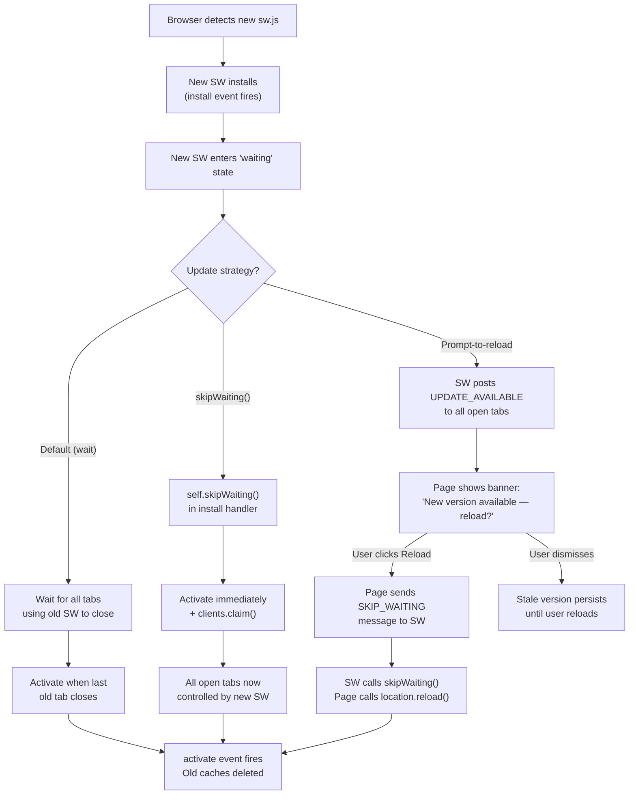

# [FEE-1307] PWA in Production

## Introduction

Building a Progressive Web App that works in a local development environment is a fundamentally different problem from operating one reliably in production. In development, the service worker is often disabled or replaced with a no-op stub — Vite's dev server does not register a real service worker by default, and Create React App's `react-scripts start` uses a stub that skips all caching logic. This means that a team can build, test, and ship a PWA without ever observing how its service worker actually behaves in a browser under production conditions. The result is a category of production failures that never surface during development: updates that users never receive, offline fallbacks that return blank pages, and cache storage that grows without bound until the browser begins evicting entries.

The Lighthouse PWA audit is the industry-standard tool for evaluating whether a PWA meets a baseline set of criteria before shipping. It checks a meaningful list of requirements — HTTPS, a registered service worker, a valid Web App Manifest, offline capability at the start URL — but it does not check the correctness of caching logic, the usability of the offline fallback, the quality of the update strategy, or whether the prompt-to-install flow is well-timed. A perfect Lighthouse PWA score is compatible with an update strategy that leaves users on stale content indefinitely. Teams frequently mistake the audit for a quality certification when it is, more precisely, a deployment checklist: a set of minimum requirements that a PWA must satisfy to be recognized as installable. The audit tells you whether the PWA is installable; it does not tell you whether it is good.

Operating a PWA in production requires answering three questions that the Lighthouse audit does not answer. First, how will users receive updates when a new version of the application is deployed? The browser's default service worker update behavior — the new SW waits in a "waiting" state until every tab using the old SW is closed — is not a strategy; it is an assumption that tabs are closed frequently, which is false for most applications. Second, how will old caches be identified and deleted when a new version is deployed, so that users are not served assets from a cache built against a different code version? Third, for teams who need to distribute the PWA through platform app stores, what is the correct path to Android and Windows distribution, and what are the realistic limitations on iOS?

## Design Thinking

### What Lighthouse checks — and what it does not

The Lighthouse PWA audit runs a fixed checklist of requirements against a production build of the application. Understanding the boundary between what the audit covers and what it does not cover is essential for correctly interpreting the score and knowing what additional work is required before a PWA is ready for production.

**What Lighthouse checks:**
- HTTPS (or localhost). The application must be served over a secure origin. Service workers and the Web App Manifest are unavailable on non-secure origins except `localhost`.
- A registered service worker. Lighthouse checks that a service worker is registered, not that it implements any particular caching strategy. A service worker that does nothing but register successfully passes this check.
- A valid `manifest.json`. The manifest must include a `name` or `short_name`, at least one icon with a `src`, `sizes`, and `type`, a `start_url`, and a `display` mode of `standalone`, `fullscreen`, or `minimal-ui`. Icons must include a maskable icon at 192×192px or larger.
- An offline response for the `start_url`. Lighthouse puts the browser offline and navigates to `start_url`. If the service worker returns any response — a cached page, a custom offline fallback — the check passes. If it returns a browser error page, the check fails. An empty `<html>` document passes; a meaningful offline page is not required by the audit.
- A `<meta name="viewport">` tag. Required for responsive display.
- A themed browser toolbar. The manifest's `theme_color` must match the `<meta name="theme-color">` tag value in the HTML.

**What Lighthouse does not check:**
- Whether the caching strategy is correct. A service worker that caches every request forever, including API responses that should never be cached, passes the audit.
- Whether the offline fallback is usable. A blank white page with an HTTP 200 response passes. A broken offline page that shows a stack trace passes. Lighthouse measures whether there is an offline response, not whether it is meaningful to a user.
- Whether the update strategy works. A service worker that never delivers updates to existing users passes the Lighthouse PWA audit with a perfect score.
- Whether push notification timing is appropriate (covered in FEE-1306).
- Whether Background Sync works correctly (covered in FEE-1305).

Use the Lighthouse PWA audit as a deployment checklist — a gate that must be passed before shipping — not as a measure of the PWA's production quality. A perfect score is a starting point, not a destination.

### Service worker update strategies

The service worker lifecycle creates a gap between when a new version is deployed and when existing users receive it. When the browser detects a new `sw.js` file, it downloads and installs the new service worker, but holds it in a "waiting" state. The new SW can only activate — and begin serving responses from its new caches — when all browser tabs using the old service worker are closed. In practice, long-lived applications may not satisfy this condition for days.

The following table describes the four main strategies teams use to manage this gap.

| Strategy | How it works | Risk | Best for |
|----------|-------------|------|----------|
| Default (wait for tabs to close) | New SW installs and enters "waiting" state. Activates when all tabs using the old SW are closed. | Long-lived apps where users keep tabs open for hours or days — updates may never arrive during a user's working session. | Short-session apps (checkout flows, booking forms) where users naturally close tabs after completing their task. |
| `skipWaiting()` | New SW calls `self.skipWaiting()` in the `install` handler to activate immediately, then calls `clients.claim()` to take control of all open tabs. | In-flight `fetch` requests may fail or return unexpected responses if the new SW's cache strategy changes while requests are mid-flight. | Static-asset-heavy apps with no long-running requests, and only when cache version bumps are backward-compatible. |
| Prompt-to-reload | When the new SW installs, it posts an `UPDATE_AVAILABLE` message to all open tabs. The page shows a "New version available — reload?" banner. When the user clicks Reload, the page sends a `SKIP_WAITING` message to the SW, which calls `skipWaiting()`, and the page reloads. | User may ignore or dismiss the prompt; the stale version persists until the user reloads. | Most apps — gives the user visibility and control without interrupting their current task. |
| Periodic Background Sync / version polling | The SW periodically fetches a small version manifest file. When the version changes, it posts `UPDATE_AVAILABLE` and the page shows the banner. | More complex to implement; `periodicSync` has limited browser support (Chrome/Edge on Android only). | Apps where users leave tabs open for hours and need updates delivered without user action. |

The prompt-to-reload strategy is the right default for most production PWAs. It gives users clear feedback that a new version exists, preserves their current task state (they choose when to reload), and avoids the mid-request disruption risk of `skipWaiting()`. The main failure mode — the user dismissing or ignoring the banner — is much less harmful than the alternatives: the user is actively running the application and can reload when they finish their current task. If analytics show that users habitually ignore the banner, consider adding a version staleness check on navigation events (comparing a version from the server response against the running version) and showing a more prominent warning after a configurable number of navigations on a stale version.

### Versioned cache busting

Cache version management is the mechanism that prevents a newly activated service worker from serving assets built against the previous version of the application. Without versioned cache names, the `activate` handler cannot reliably identify which caches are stale, because all caches share the same name across versions.

The correct pattern is to include a version constant in every cache name and to delete all caches whose names match the cache's namespace prefix but do not match the current version during `activate`:

```js
const CACHE_VERSION = 'v3';
const STATIC_CACHE = `static-${CACHE_VERSION}`;
const RUNTIME_CACHE = `runtime-${CACHE_VERSION}`;

self.addEventListener('activate', (event) => {
  event.waitUntil(
    caches.keys().then((keys) =>
      Promise.all(
        keys
          .filter(
            (k) =>
              (k.startsWith('static-') && k !== STATIC_CACHE) ||
              (k.startsWith('runtime-') && k !== RUNTIME_CACHE)
          )
          .map((k) => caches.delete(k))
      )
    )
  );
});
```

Increment `CACHE_VERSION` whenever the caching strategy changes in a way that requires a clean slate: when precached asset paths change, when cache TTLs change, or when the set of routes handled by the runtime cache changes significantly. Do not increment the version for every deployment — only when a stale cache from the previous version would cause user-visible breakage. If in doubt, increment it; the cost of an unnecessary cache invalidation is a slightly slower first load for returning users, which is far preferable to serving assets from a mismatched cache.

### App store distribution

Distributing a PWA through platform app stores extends its reach to users who discover apps through the Google Play Store, Microsoft Store, or Apple App Store. The technical mechanisms and requirements differ significantly across platforms.

**Trusted Web Activity (TWA) — Android Play Store.** A TWA is an Android APK that uses Chrome's rendering engine to display a PWA. Unlike a WebView-based hybrid app, a TWA provides a full Chrome browsing context, including service worker support, Web Push, and Bluetooth APIs. The URL bar is hidden when the PWA passes a Digital Asset Links verification — a `.well-known/assetlinks.json` file hosted at the domain that associates the domain with the APK's SHA-256 certificate fingerprint. If the Digital Asset Links verification fails, Chrome displays the URL bar inside the installed APK, which is a visible sign to users that something is wrong with the packaging. The `bubblewrap` CLI (maintained by the Chrome team, available on npm as `@bubblewrap/cli`) generates the APK from the Web App Manifest. PWABuilder (Microsoft) provides a graphical interface over the same process. Distribution through the Play Store requires a Google Play Console account, which costs a one-time $25 registration fee.

**PWABuilder — Windows Store and multi-platform.** Microsoft's PWABuilder tool accepts a PWA URL, analyzes the manifest, and generates distributable packages for multiple platforms: a TWA APK for Android, an MSIX package for the Microsoft Store, and guidance for iOS. For teams that want the broadest app store presence with the least platform-specific engineering work, PWABuilder is the lowest-friction path. The generated packages are not deeply customized, but they are functional and store-ready.

**iOS and Apple App Store limitations.** iOS does not support TWAs or a comparable mechanism. The only way to distribute a web-based app through the Apple App Store is a WebKit WebView wrapped in a native Swift/Objective-C shell — a hybrid app, not a PWA. The key iOS web limitations that affect PWA production deployments are:
- Web Push notifications require home screen install (iOS 16.4+). A web page running in Safari's browser tab cannot request push permission. The user must first add the site to their Home Screen via the Share menu, and then open the resulting icon. Only from the installed home screen context can the PWA call `Notification.requestPermission()`.
- Background Sync is not supported on iOS Safari. Deferred write operations that rely on Background Sync (FEE-1305) will not work on iOS.
- Periodic Background Sync is not supported on iOS Safari.
- `navigator.standalone` returns `true` when the PWA is running from the home screen. Use this property to gate the push subscription flow on iOS.
- Testing on a physical iOS device is required. macOS Safari does not replicate iOS push permission restrictions. The iOS Simulator does not replicate service worker behavior accurately for push.

## Best Practices

**MUST run Lighthouse against a production build, not the dev server.** Vite's dev server does not register a service worker. `next dev` stubs or disables SW behavior. Running Lighthouse against a dev server will produce misleading results — it may report a passing PWA score against an application that has no real service worker, or fail checks that would pass in production. You MUST always run the audit against `pnpm build && pnpm preview` or the equivalent production build command, and use Chrome's incognito mode to avoid cached state from previous test runs.

**SHOULD use the prompt-to-reload pattern as the default update strategy.** `skipWaiting()` without a user prompt is safe only when the new SW's cache strategy is backward-compatible with in-flight requests and the asset set has not changed in a way that would break an active session. For most applications, the safer default is to post `UPDATE_AVAILABLE` from the service worker's `install` event and show a non-intrusive banner that gives users control over when to reload.

**MUST increment cache version strings whenever the caching strategy changes.** You MUST NOT use cache names without a version suffix. A cache named `static` cannot be distinguished from a stale cache named `static` by the `activate` handler. Use `static-v1`, `static-v2`, and so on, and delete all caches matching the namespace prefix except the current version during `activate`.

**MUST precache the `start_url` explicitly.** The Lighthouse offline check navigates to `start_url` with the network disabled. If `start_url` is not in the precache, this check fails. More importantly, users who install the PWA to their home screen and then launch it while offline MUST be served a cached response, not a browser error page. This is the single most common cause of a broken home screen install experience.

**MUST verify Digital Asset Links before submitting to the Play Store.** If the `.well-known/assetlinks.json` file is missing, malformed, or returns the wrong certificate fingerprint, Chrome will display the URL bar inside the installed TWA. Users who see the URL bar inside a Play Store-installed "app" will conclude that the app is broken. Verify the file using the Digital Asset Links API before submitting the APK.

**MUST test on a physical iOS device.** macOS Safari and the iOS Simulator do not accurately replicate the home-screen installation requirement for push notifications, the absence of Background Sync, or the behavior of the Web App Manifest in installed PWA context. You MUST keep at least one physical iPhone in the testing rotation for any PWA that targets iOS users.

**SHOULD NOT cache opaque responses without size limits.** An opaque response (a cross-origin response fetched without CORS) reports a size of 0 bytes to the Cache Storage API but occupies real storage. Browsers may pad the actual storage usage of opaque responses. Caching many opaque responses without a size or count limit can exhaust the browser's cache storage quota. If cross-origin assets must be cached, you MUST configure a maximum number of entries or a maximum age using Workbox's `ExpirationPlugin`.

**SHOULD provide a meaningful offline fallback page.** The Lighthouse audit accepts a blank page as an offline response, but users deserve better. Create a dedicated `/offline.html` page that is precached during the SW install phase, explains that the user is offline, and offers navigation to cached content if available. When the SW cannot fulfill a navigation request from the network and has no cached version, it MUST fall back to this page rather than returning a generic browser error.

## Diagram



## Example

The following example implements the prompt-to-reload update pattern in full. It is split across three files: the service worker (`public/sw.js`), a React update banner component (`src/components/UpdateBanner.tsx`), and a service worker registration module (`src/registerSW.ts`) that wires the two together.

### Service worker: install, activate, and update messaging

```js
// public/sw.js

const CACHE_VERSION = 'v1';
const STATIC_CACHE = `static-${CACHE_VERSION}`;
const RUNTIME_CACHE = `runtime-${CACHE_VERSION}`;

// Assets to precache during install. These are served from the cache
// on every request, including when the user is offline.
const PRECACHE_ASSETS = [
  '/',
  '/offline.html',
  '/icons/icon-192.png',
  '/icons/icon-512.png',
];

// --- Install ---
// Precache static assets. Do NOT call skipWaiting() here — we prompt
// the user before activating, so they can choose when to reload.
self.addEventListener('install', (event) => {
  event.waitUntil(
    caches
      .open(STATIC_CACHE)
      .then((cache) => cache.addAll(PRECACHE_ASSETS))
      .then(() => {
        // Notify all open tabs that a new version is ready and waiting.
        // This fires before the SW activates, so existing tabs are still
        // running the old SW and can show the update banner.
        return self.clients.matchAll({ includeUncontrolled: true });
      })
      .then((clients) => {
        clients.forEach((client) =>
          client.postMessage({ type: 'UPDATE_AVAILABLE' })
        );
      })
  );
});

// --- Activate ---
// Delete caches from previous versions. After this completes, all
// requests will be served from the new caches.
self.addEventListener('activate', (event) => {
  event.waitUntil(
    caches
      .keys()
      .then((keys) =>
        Promise.all(
          keys
            .filter(
              (k) =>
                (k.startsWith('static-') && k !== STATIC_CACHE) ||
                (k.startsWith('runtime-') && k !== RUNTIME_CACHE)
            )
            .map((k) => caches.delete(k))
        )
      )
      .then(() => self.clients.claim())
  );
});

// --- Fetch: cache-first for precached assets, network-first for others ---
self.addEventListener('fetch', (event) => {
  const { request } = event;

  // Only handle GET requests. Never intercept POST, PUT, DELETE, etc.
  if (request.method !== 'GET') return;

  // Navigation requests: network first, fall back to offline page.
  if (request.mode === 'navigate') {
    event.respondWith(
      fetch(request).catch(() => caches.match('/offline.html'))
    );
    return;
  }

  // Static assets: cache first.
  event.respondWith(
    caches.match(request).then((cached) => {
      if (cached) return cached;

      return fetch(request)
        .then((response) => {
          // Only cache successful, non-opaque responses.
          if (
            !response ||
            response.status !== 200 ||
            response.type === 'opaque'
          ) {
            return response;
          }
          const responseToCache = response.clone();
          caches
            .open(RUNTIME_CACHE)
            .then((cache) => cache.put(request, responseToCache));
          return response;
        })
        .catch(() => {
          // No network and no cache entry — return nothing useful.
          // The browser will show whatever the cached page has available.
        });
    })
  );
});

// --- Message handler: receive SKIP_WAITING from the page ---
// When the user clicks "Reload" in the update banner, the page sends
// this message. We call skipWaiting() to activate the waiting SW.
self.addEventListener('message', (event) => {
  if (event.data?.type === 'SKIP_WAITING') {
    self.skipWaiting();
  }
});
```

### Service worker registration module

```ts
// src/registerSW.ts
// Register the service worker and expose callbacks for update events.
// Import and call registerSW() once, at application startup.

export interface SWRegistrationOptions {
  /** Called when a new SW is installed and waiting. Show the update banner. */
  onUpdateAvailable?: () => void;
}

export async function registerSW(options: SWRegistrationOptions = {}): Promise<void> {
  if (!('serviceWorker' in navigator)) return;

  // Use the 'load' event to defer registration until after the page has
  // finished its initial render. This avoids SW install competing with
  // page resource loading on the first visit.
  window.addEventListener('load', async () => {
    try {
      const registration = await navigator.serviceWorker.register('/sw.js', {
        // Scope defaults to the directory containing sw.js. Explicit here
        // for clarity — '/' means the SW controls the entire origin.
        scope: '/',
      });

      // Listen for messages from the SW (e.g., UPDATE_AVAILABLE).
      navigator.serviceWorker.addEventListener('message', (event) => {
        if (event.data?.type === 'UPDATE_AVAILABLE') {
          options.onUpdateAvailable?.();
        }
      });

      // Handle the case where the page is loaded while a SW is already
      // waiting (e.g., the user opened the app after a new SW installed
      // in a previous session but was never activated).
      if (registration.waiting) {
        options.onUpdateAvailable?.();
      }

      // Handle the case where a new SW starts waiting after registration.
      registration.addEventListener('updatefound', () => {
        const newWorker = registration.installing;
        if (!newWorker) return;

        newWorker.addEventListener('statechange', () => {
          if (
            newWorker.state === 'installed' &&
            navigator.serviceWorker.controller
          ) {
            // A new SW is now installed and waiting. The controller check
            // ensures this is an update (not the first install — on first
            // install, there is no controller yet).
            options.onUpdateAvailable?.();
          }
        });
      });
    } catch (error) {
      console.error('Service worker registration failed:', error);
    }
  });
}
```

### Update banner component (React)

```tsx
// src/components/UpdateBanner.tsx
// Shows a non-intrusive banner when a new version of the app is available.
// The user can dismiss it or click "Reload" to apply the update.
//
// Usage: render <UpdateBanner /> near the root of the app.
// Wire it to the registerSW onUpdateAvailable callback.

import { useEffect, useState } from 'react';

export function UpdateBanner() {
  const [show, setShow] = useState(false);

  useEffect(() => {
    // Listen for UPDATE_AVAILABLE messages from the service worker.
    // The registerSW module also calls onUpdateAvailable, which can
    // set show to true from outside — but listening here directly
    // handles the case where the SW posts the message to an already-
    // rendered component.
    const handler = (event: MessageEvent) => {
      if (event.data?.type === 'UPDATE_AVAILABLE') {
        setShow(true);
      }
    };

    navigator.serviceWorker?.addEventListener('message', handler);
    return () => navigator.serviceWorker?.removeEventListener('message', handler);
  }, []);

  function handleReload() {
    // Tell the waiting SW to skip the waiting phase and activate.
    navigator.serviceWorker.controller?.postMessage({ type: 'SKIP_WAITING' });
    // Wait for the controller to change (the new SW takes over) before
    // reloading, to avoid reloading before the SW is ready.
    navigator.serviceWorker.addEventListener('controllerchange', () => {
      window.location.reload();
    });
  }

  function handleDismiss() {
    setShow(false);
  }

  if (!show) return null;

  return (
    <div
      role="alert"
      aria-live="polite"
      className="fixed bottom-4 inset-x-4 z-50 bg-blue-600 text-white px-4 py-3 rounded-lg shadow-lg flex items-center justify-between gap-4"
    >
      <span className="text-sm font-medium">
        A new version of this app is available.
      </span>
      <div className="flex items-center gap-2 shrink-0">
        <button
          onClick={handleReload}
          className="px-3 py-1.5 bg-white text-blue-600 rounded text-sm font-semibold hover:bg-blue-50 transition-colors"
        >
          Reload
        </button>
        <button
          onClick={handleDismiss}
          aria-label="Dismiss update notification"
          className="p-1.5 text-blue-200 hover:text-white transition-colors"
        >
          &times;
        </button>
      </div>
    </div>
  );
}
```

### Wiring registration at app startup

```tsx
// src/main.tsx (or src/index.tsx)
import { StrictMode } from 'react';
import { createRoot } from 'react-dom/client';
import App from './App';
import { registerSW } from './registerSW';

// updateAvailableSignal is a lightweight observable to bridge the SW
// callback into the React component tree. Replace with your preferred
// state management approach (Zustand, Jotai, React context, etc.).
let onUpdateCallbacks: Array<() => void> = [];

export function subscribeToUpdateAvailable(cb: () => void) {
  onUpdateCallbacks.push(cb);
  return () => { onUpdateCallbacks = onUpdateCallbacks.filter((fn) => fn !== cb); };
}

registerSW({
  onUpdateAvailable: () => {
    onUpdateCallbacks.forEach((cb) => cb());
  },
});

createRoot(document.getElementById('root')!).render(
  <StrictMode>
    <App />
  </StrictMode>
);
```

### TWA setup with bubblewrap

```bash
# Install bubblewrap CLI globally
npm install -g @bubblewrap/cli

# Initialize a new TWA project from your Web App Manifest
# Replace the URL with your production domain
bubblewrap init --manifest https://yourdomain.com/manifest.json

# Build the APK
bubblewrap build

# The output is app-release-signed.apk (if you configured signing)
# or app-release-unsigned.apk (if not).
# Upload to the Google Play Console as an internal test track first.
```

The `bubblewrap init` command prompts for the following values:

- **Application ID**: A reverse-domain identifier, for example `com.acme.myapp`. This must match the identifier you register in the Play Console.
- **Signing key**: An existing `.keystore` file and its alias, or bubblewrap will generate one. Store the keystore file and its password securely — you cannot change the signing key after publishing.
- **SHA-256 fingerprint**: Bubblewrap computes this from the signing key and uses it when generating the `assetlinks.json` file. After building, host this file at `https://yourdomain.com/.well-known/assetlinks.json`.

```json
// .well-known/assetlinks.json
[
  {
    "relation": ["delegate_permission/common.handle_all_urls"],
    "target": {
      "namespace": "android_app",
      "package_name": "com.acme.myapp",
      "sha256_cert_fingerprints": [
        "AB:CD:EF:01:23:45:67:89:AB:CD:EF:01:23:45:67:89:AB:CD:EF:01:23:45:67:89:AB:CD:EF:01:23:45:67"
      ]
    }
  }
]
```

Verify the file is reachable and valid before submitting to the Play Store. Use the Google Digital Asset Links verification endpoint to confirm:

```bash
curl "https://digitalassetlinks.googleapis.com/v1/statements:list\
?source.web.site=https://yourdomain.com\
&relation=delegate_permission/common.handle_all_urls"
```

A successful response includes `"matched": true`. If `matched` is `false` or the endpoint returns an error, the URL bar will appear inside the installed TWA.

## Common Mistakes

**`skipWaiting()` without `clients.claim()`.** Calling `skipWaiting()` in the `install` handler causes the new SW to activate immediately, but does not automatically transfer control of already-open tabs to the new SW. Existing tabs continue to be served by the old SW until they are reloaded. The new SW controls only tabs opened after activation. Adding `self.clients.claim()` in the `activate` handler transfers control of all open tabs to the new SW immediately. Both calls are needed when the goal is to update all open tabs.

**`skipWaiting()` with `clients.claim()` but without a cache version bump.** When the new SW activates and claims all open tabs, it begins serving requests — but if the cache names have not changed, it will serve assets from the same cache as the old SW. If the old cache contains stale assets that are incompatible with the new application code, the user will see a broken application. Always pair a `skipWaiting()` strategy with a cache version increment. This combination causes production breakage that is difficult to reproduce locally because the local dev server does not run a real service worker.

**Assuming the `install` event fires for returning users.** The `install` event fires only when a new SW version is detected. If no new `sw.js` is available, returning users who already have the SW installed will not see a fresh `install` event. The `UPDATE_AVAILABLE` message in the example above is posted from the `install` event — which means it only fires when an update is actually available. Do not conflate the first install with subsequent updates; both cases must be handled, but they fire different events.

## Related FEEs

- [FEE-1302: Service Workers](./1302.md) — lifecycle, `skipWaiting`, `activate`, `clients.claim`, the SW update algorithm
- [FEE-1304: Workbox & PWA Tooling](./1304.md) — `workbox-window` update detection, `messageSkipWaiting`, `ExpirationPlugin`
- [FEE-704: Core Web Vitals & Performance Metrics](../Rendering%20and%20Performance/704.md) — Lighthouse audits performance alongside the PWA checklist; understand the full audit scope

## References

- Google Chrome Developers — [Lighthouse PWA audit documentation](https://developer.chrome.com/docs/lighthouse/pwa/)
- web.dev — [Service Worker Lifecycle](https://web.dev/articles/service-worker-lifecycle)
- web.dev — [Handling service worker updates](https://web.dev/articles/service-worker-lifecycle#handling_service_worker_updates)
- MDN Web Docs — [ServiceWorkerGlobalScope: skipWaiting()](https://developer.mozilla.org/en-US/docs/Web/API/ServiceWorkerGlobalScope/skipWaiting)
- MDN Web Docs — [Clients.claim()](https://developer.mozilla.org/en-US/docs/Web/API/Clients/claim)
- MDN Web Docs — [Cache Storage API](https://developer.mozilla.org/en-US/docs/Web/API/CacheStorage)
- Google Digital Asset Links — [Statement List API](https://developers.google.com/digital-asset-links/reference/rest/v1/statements/list)
- bubblewrap CLI — [GitHub repository and documentation](https://github.com/GoogleChromeLabs/bubblewrap)
- PWABuilder — [Microsoft PWA packaging tool](https://www.pwabuilder.com/)
- Apple Developer — [Enabling the Web Push API on Apple platforms](https://developer.apple.com/documentation/usernotifications/sending_web_push_notifications_in_web_apps_safari_and_other_browsers)
- Can I Use — [Service Workers browser support](https://caniuse.com/serviceworkers)
- Can I Use — [Periodic Background Sync](https://caniuse.com/periodic-background-sync)
