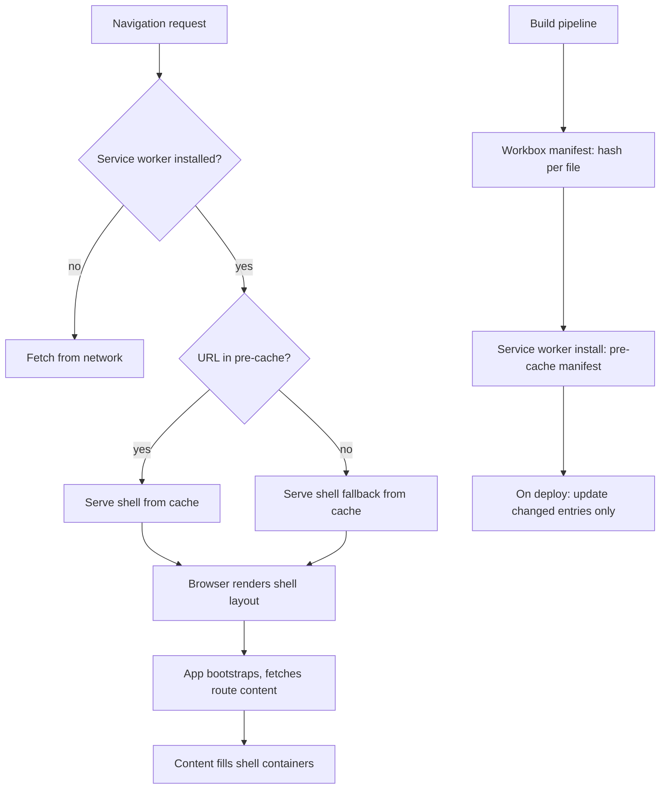

# App Shell Architecture

The app shell model separates the structural chrome of an application — the
navigation sidebar, header bar, loading skeleton, and layout containers that
are always present — from the dynamic content that fills those containers.
The shell is the application's "frame": the HTML, CSS, and JavaScript needed
to render an interactive layout before any content has loaded. Content is the
"picture" that appears inside the frame: route-specific data fetched over the
network after the shell is displayed.

This separation matters because the shell can be pre-cached by a service
worker during installation. On subsequent visits, the service worker intercepts
the document navigation request and responds with the cached shell
immediately — no network round-trip required. The browser renders the shell's
layout within milliseconds of navigation, and the application begins loading
dynamic content into the now-visible frame. The user perceives fast loading
because interactive structure appears before the first byte of content arrives
from the server.

The app shell approach predates service workers — early single-page
applications used local storage and client-side routing to approximate the
same behavior. Service workers make the pattern reliable: the shell response
is always available regardless of network conditions, the cache is explicit and
controlled, and the pre-cached shell survives browser restarts. The result is
a browsing experience on repeat visits that feels native — instant structure,
content that fills in as it arrives.

This article covers the design of the shell boundary, pre-caching strategies
with Workbox, how route-level streaming with shells composes with server-side
rendering, and common pitfalls when the shell-content boundary is drawn
incorrectly.

## Design Thinking

### Why the shell-content separation is an architectural concern

The app shell model is frequently introduced as a performance technique, but its
deeper value is architectural. Separating the structural frame of the application
from its dynamic content creates a clear contract between the service worker and
the rest of the system: the service worker guarantees instant availability of
the frame; the content layer is responsible for its own freshness. This
separation of concerns allows the offline strategy to be reasoned about at the
resource level rather than at the page level. Different parts of the same URL's
response can be managed with different cache semantics — the shell with a
cache-first strategy, the content with network-first — because they have
different update frequencies and different consequences when stale. Conflating
them into a single cache policy forces a false choice between performance and
freshness that does not exist when the boundary is drawn correctly.

### Designing the shell boundary

The shell boundary is an architectural decision with performance and UX
consequences. Too narrow a shell — only the outermost `<div id="app">` —
means the shell adds almost no perceived speed benefit because the blank frame
provides no meaningful structure. Too broad a shell — including route-specific
layout or data-dependent components — means the shell is larger, takes longer
to pre-cache, and must be updated every time any included component changes.

The practical boundary for most applications falls at: persistent navigation
(sidebar, header, breadcrumb trail), global UI chrome (notification toasts,
modals that appear globally, theme providers), application loading skeletons
(placeholder shapes that match the expected content layout), and route outlet
containers (the empty `<main>` or `<div>` where route content will mount).
Route-specific components, data-fetching components, and anything that shows
user-specific content belong outside the shell.

A useful test: can the shell render correctly with an empty content outlet and
no network access? If the answer is yes, the boundary is appropriate. If
rendering the shell requires a network request or user data, the boundary
is drawn too broadly.

Another framing: the shell is what the application shows while it is loading
its first route. If you have a skeleton loading state that appears between
navigation events in your SPA, that skeleton is effectively the app shell.
Formalizing it as the pre-cached shell means it appears instantly from cache
rather than after the JavaScript bundle evaluates. The design of the shell
loading state is therefore not just a UX concern — it directly determines what
the service worker pre-caches and how large the pre-cache payload grows.

The shell's HTML is typically a single static document — `index.html` for a
client-side application, or a layout template for a framework-based application.
All shell resources (the HTML file, the main CSS bundle, the application
bootstrap JavaScript) are listed in the service worker's pre-cache manifest.
The service worker is installed and the manifest resources are cached before
the service worker activates, ensuring the complete shell is available for
the next navigation before the service worker begins intercepting requests.

One nuance: the pre-cache manifest must include the shell document under a
cache key that matches the navigation URL. When the user navigates to
`https://app.example.com/settings`, the service worker intercepts a navigation
request for that URL. If `/settings` is not in the pre-cache, the service
worker falls back to the pre-cached `index.html` via the `navigateFallback`
option. This fallback behavior means only one HTML document needs to be
pre-cached for all client-side routes — the navigation fallback covers all
paths the router handles.

### Pre-caching the shell with Workbox

Workbox is the standard library for service worker construction in production
PWA applications. Its `precacheAndRoute()` function accepts a manifest array —
typically injected at build time by `workbox-webpack-plugin` or
`vite-plugin-pwa` — and installs the listed resources into the service worker's
pre-cache store during the install event. Routes matching pre-cached URLs are
intercepted and served from cache with a cache-first strategy.

The pre-cache manifest entry for each resource includes a revision hash
computed over the file's content. When the file changes, the hash changes,
and Workbox's precache controller detects the change during the next service
worker activation. It fetches the updated resource, stores it in the pre-cache,
and removes the stale entry. This incremental update mechanism ensures the
pre-cache never serves a stale version of the shell after a deployment — only
changed files are re-fetched, not the entire manifest.

The build tool integration is the critical piece. Manually maintaining a
pre-cache manifest is error-prone and does not scale with frequent deployments.
`workbox-webpack-plugin` (GenerateSW mode) scans Webpack's output, generates
the manifest automatically, and injects it into the service worker file. The
equivalent for Vite is `vite-plugin-pwa`, which generates both the manifest
and the service worker file in a single configuration object. Neither approach
requires the developer to list files manually: the build tool knows which files
were emitted, their sizes, and their content hashes.

InjectManifest mode is an alternative to GenerateSW for teams that need custom
service worker logic beyond what GenerateSW's configuration surface supports.
In InjectManifest mode, the developer writes a service worker source file and
uses a special `self.__WB_MANIFEST` placeholder where the pre-cache manifest
should be injected. The build tool replaces the placeholder with the generated
manifest at build time. This mode allows full control over the service worker's
fetch, sync, and push event handlers while still automating the manifest
generation that is the most error-prone part of service worker maintenance.

The shell document itself — typically `index.html` — requires special handling.
Because the shell document is served for every navigation URL via the service
worker's fallback route (the `navigationFallback` option in Workbox), it must
be pre-cached. Workbox handles this correctly when the HTML file is included in
the manifest. The service worker's `navigate` handler detects navigation
requests (requests with `mode: 'navigate'`), checks whether the URL has a
pre-cached handler, and falls back to the pre-cached shell document for any
URL that does not have an explicit cache entry.

### Route-level streaming with app shells in SSR

Pure client-side app shell architecture is straightforward but has a first-load
cost: the browser must download and parse the JavaScript bundle before any
content is visible. Server-side rendering addresses first-load performance
by rendering route content as HTML on the server and streaming it to the
browser alongside the shell structure.

React 18's streaming SSR with `renderToPipeableStream` or `renderToReadableStream`
allows the server to flush the shell HTML immediately and stream content
chunks as Suspense boundaries resolve. The shell HTML — document head, layout
chrome, loading fallbacks — is flushed first, allowing the browser to begin
rendering visible structure and parsing the critical CSS. Content for
suspended components streams in as the server resolves their data, progressively
filling the layout without a client-side data fetch round-trip.

The service worker's interaction with SSR streaming requires care. A streaming
response cannot be cached by `Cache-Storage` as a single entry while it is still
streaming — the cache entry only exists after the stream is complete. For SSR
applications, the service worker's role shifts from caching full HTML responses
to caching the static assets referenced by those responses. The service worker
handles JavaScript, CSS, fonts, and images with efficient cache strategies;
the HTML document is fetched from the network (or served from cache after the
first load completes) rather than from the pre-cached shell document.

### Content strategies outside the shell

Content that changes frequently needs a cache strategy that reflects its
volatility. Workbox provides several strategies as named handlers: NetworkFirst
fetches from the network and falls back to cache on failure; StaleWhileRevalidate
returns a cached response immediately while fetching an updated version in the
background; CacheFirst always returns the cached response and revalidates in the
background with a TTL.

For application data (API responses), NetworkFirst with a short timeout prevents
stale data from being shown when the network is fast, while ensuring offline
access to previously seen data. For user-generated content like images
uploaded to a storage service, CacheFirst with a TTL and a maximum cache size
(managed by Workbox's `ExpirationPlugin`) prevents unbounded cache growth.

Choosing among these strategies requires understanding the update frequency
and staleness tolerance of the data. Navigation links in a sidebar change
infrequently and can tolerate StaleWhileRevalidate — the user sees last-known
navigation instantly, and the service worker updates it in the background for
the next visit. Search results and personalized feeds should never be served
stale — NetworkFirst with offline fallback is correct. Avatars and thumbnails
change rarely — CacheFirst with a TTL of a week prevents repeated round-trips
while guaranteeing eventual freshness. Mapping content and category structure
to the right strategy is a deliberate architectural decision, not a default
choice left to the service worker template.

## Best Practices

**MUST** pre-cache all resources the shell requires to render: the HTML document,
the critical CSS bundle, the application bootstrap JavaScript, and any fonts
referenced in the shell's CSS. A missing resource breaks the offline-first
experience.

**MUST** integrate pre-cache manifest generation into the build pipeline using
`workbox-webpack-plugin` or `vite-plugin-pwa`. Manually maintained manifests
become stale after deployments and serve outdated shell resources.

**SHOULD** keep the shell boundary as narrow as possible — navigation chrome
and empty content containers, not route-specific components. A smaller shell
pre-caches faster and updates more reliably.

**SHOULD** test the shell experience by simulating offline conditions in
DevTools and verifying that the shell renders correctly with no network access
before any content loads.

**SHOULD** apply network-first or stale-while-revalidate cache strategies to route-level content fetched outside the shell boundary. Content that changes frequently — API responses, user feeds, search results — must reflect current data; serving it from a cache-first strategy risks presenting stale information. NetworkFirst ensures freshness when the network is available and falls back to cache only when the user is offline; StaleWhileRevalidate serves the last-known response immediately while refreshing in the background, which is appropriate for data that tolerates one-visit staleness.

**MUST NOT** include dynamic or user-specific content in the pre-cached shell.
A shell that includes user data breaks for different users who share the same
service worker installation, and invalidates the pre-cache on every user
data change. User-specific content belongs in the content layer, fetched after
the shell mounts and the user session is established.

## Visual



## Example

```typescript
// vite.config.ts — vite-plugin-pwa configuration for app shell
import { defineConfig } from 'vite'
import { VitePWA } from 'vite-plugin-pwa'

export default defineConfig({
  plugins: [
    VitePWA({
      strategies: 'generateSW',
      registerType: 'prompt', // see FEE-1309 for update prompt strategy
      workbox: {
        // Pre-cache the shell: index.html + all build output assets
        globPatterns: ['**/*.{js,css,html,ico,png,svg,woff2}'],

        // For any navigation URL not explicitly cached, serve the shell
        navigateFallback: '/index.html',

        // Never use the shell fallback for API routes (SSR or proxy)
        navigateFallbackDenylist: [/^\/api\//],

        // Content strategy: API responses with network-first + 5s timeout
        runtimeCaching: [
          {
            urlPattern: /^https:\/\/api\.example\.com\//,
            handler: 'NetworkFirst',
            options: {
              cacheName: 'api-cache',
              networkTimeoutSeconds: 5,
              expiration: { maxEntries: 50, maxAgeSeconds: 60 * 60 * 24 },
            },
          },
        ],
      },
    }),
  ],
})
```

## Common Mistakes

- Including API responses or user-specific data in the shell's pre-cache —
  the pre-cache is shared across users and sessions, so personal data leaks
  between users or becomes stale immediately
- Not setting `navigateFallbackDenylist` for API routes — the service worker
  serves the shell HTML for API fetch requests, breaking any server-side
  request that expects JSON
- Forgetting to include fonts and icons in the shell pre-cache — the shell
  renders with system fonts and broken icons in offline mode
- Using `registerType: 'autoUpdate'` without reading FEE-1309 — silent auto-
  updates activate new service workers immediately and may break in-flight
  requests or cause the application to display a mix of old and new assets
  until the next full page reload

## Related FEEs

- FEE-1300: Service Worker Lifecycle & Registration
- FEE-1302: Offline-First Data Strategies
- FEE-1309: Update Detection & Refresh Prompts

## References

- [Google: The App Shell Model](https://developers.google.com/web/fundamentals/architecture/app-shell)
- [Workbox Documentation](https://developer.chrome.com/docs/workbox/)
- [vite-plugin-pwa Documentation](https://vite-pwa-org.netlify.app/)
- [web.dev: Streams — The definitive guide](https://web.dev/streams/)
- [React 18: Server Rendering with Streaming](https://react.dev/blog/2021/12/17/react-conf-2021-recap#react-18-and-concurrent-features)
