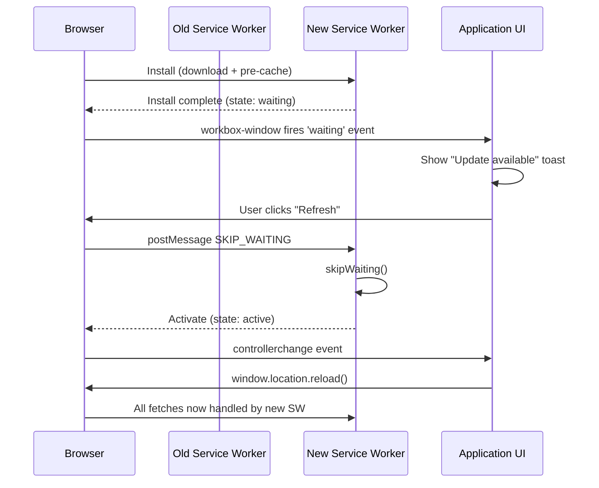

# Update Detection & Refresh Prompts

A service worker, once installed, continues to control all pages in its scope
until it is replaced by a newer version. The update cycle is not automatic.
When a user navigates to a PWA, the browser checks for an updated service
worker in the background. If one is found, it downloads and installs the new
version alongside the old. The new service worker enters a waiting state: it
is installed but not activated, because the old service worker still controls
all open pages. Only when all pages in the scope are closed and a new page
is opened does the new service worker activate and take control.

This default lifecycle produces a behavior pattern that surprises teams new
to PWA development: a user can have a deployed update sitting in the waiting
state for hours or days while they keep a tab open. The old service worker
continues to serve the pre-cached shell from before the update, the new
service worker waits, and the user sees an outdated version of the application.

Resolving this tension requires a deliberate choice between two approaches:
prompt the user to reload (cooperative update) or force the new service worker
to activate immediately (`skipWaiting`). Each has significant trade-offs.
Getting this decision right is one of the more consequential PWA architecture
decisions a team makes.

## Principle

Teams MUST choose an explicit update strategy rather than relying on the
browser's default passive behavior, which can leave users on stale versions
indefinitely. The cooperative approach — detecting when a new service worker
is waiting and displaying a user-visible reload prompt — SHOULD be the
default choice. `skipWaiting` MUST NOT be called without understanding its
implications for in-flight requests and for mixed-version states where some
resources are served from the new cache and some from the old.

## Design Thinking

### How service worker update detection works

The browser's update detection mechanism runs as part of the navigation
lifecycle. When a user navigates to a page controlled by a service worker,
the browser fetches the registered service worker script from the network
(bypassing the HTTP cache for service worker scripts). If the fetched script
differs by even a single byte from the installed version, the browser considers
it an update and begins the installation process for the new script.

The new script runs in parallel with the old one. It receives an `install`
event and performs its own pre-cache installation. When the `install` event
completes successfully, the new service worker enters the waiting state: its
internal state is `waiting`. The old service worker remains in the `active`
state and continues to handle all fetch, sync, and push events for the
currently open pages. The new version cannot activate until the old version
is fully released — which only happens when all pages it controls are closed.

Workbox's `workbox-window` package provides the `Workbox` class, which wraps
the browser's `ServiceWorkerRegistration` API and emits higher-level events.
The `waiting` event fires when Workbox detects that a new service worker has
entered the waiting state. This event is the signal that triggers an update
notification in the application's UI. The event object includes a `wasWaitingBeforeRegister`
property: when `true`, it means a service worker was already in the waiting
state when the `Workbox` class was instantiated, indicating a previous update
that the user has not yet reloaded for. This case — an update waiting before
the page even loaded — requires the same user-facing prompt.

### The cooperative update approach

The cooperative approach is the pattern recommended for most production
applications. When the `waiting` event fires, the application displays a
non-blocking notification — a toast, a banner, or a persistent footer bar —
informing the user that an update is available. The notification includes a
"Refresh" or "Update" button. When the user clicks it, the application
sends a message to the waiting service worker instructing it to skip waiting.
After the waiting service worker calls `skipWaiting()`, it activates and
takes control of all pages. The application then reloads to load resources
from the new service worker's pre-cache.

The Workbox communication pattern for this is: the page calls
`workbox.messageSkipWaiting()` (which posts a `SKIP_WAITING` message to the
waiting service worker), and the service worker's install handler calls
`self.skipWaiting()` in response to that message. Alternatively, using
Workbox's `GenerateSW` with `skipWaiting: false` (the default) and manually
triggering the skip is equivalent.

The cooperative approach preserves the user's autonomy and prevents abrupt
mid-session page reloads. It also prevents the mixed-version state problem:
because the reload is explicitly triggered, the user gets a clean transition
from the old version to the new version rather than a state where some assets
come from the new cache and some from the old.

The main drawback is that some users — especially users who keep browser tabs
open for long periods — may ignore the notification and continue using the
stale version for an extended time. For security fixes or critical bug patches,
this user choice creates a window during which the vulnerable version remains
in use. Applications with strict update requirements may implement a timeout:
if a service worker has been waiting for more than N hours, the application
reloads automatically on the next navigation.

The notification UX matters for adoption. A toast that appears in the corner
and auto-dismisses after five seconds is easy to miss and encourages dismissal.
A persistent banner at the top of the page that remains visible until the user
acts — update or dismiss — is more disruptive but more effective. For enterprise
dashboards where stale data is a compliance concern, a full-screen blocking
modal is defensible. The UX choice reflects the stakes of running on a stale
version: choose proportionally intrusive notifications for proportionally
consequential updates.

### The skipWaiting approach: risks and when it is acceptable

`skipWaiting` makes the new service worker activate immediately, without waiting
for existing pages to close. In Workbox, setting `skipWaiting: true` in the
`GenerateSW` configuration causes the generated service worker to call
`self.skipWaiting()` during the install event, before the new version has
even finished installing.

The risk is a mixed-version state. When a service worker activates via
`skipWaiting`, it begins controlling all open pages immediately. Those pages
were loaded with the old version's HTML, JavaScript, and CSS. If the page's
JavaScript makes a request for a resource that the new service worker has
cached under a different hash — which is common after a deployment because
file content hashes change — the new service worker will not have the old
version's resource in its pre-cache. The resource fetch will fail or fall back
to the network, causing errors in the currently running page.

The combined pattern of `skipWaiting: true` with `clients.claim()` in the
`activate` handler is particularly dangerous. `clients.claim()` makes the new
service worker take control of all pages in its scope that were opened before
it became active — including pages that were not loaded through the service
worker at all. A page loaded with the old JavaScript bundle is now being served
assets by the new service worker. If the new service worker's resource inventory
does not match what the old JavaScript expects, the page breaks.

`skipWaiting` without `clients.claim()` is safer: the new service worker
activates but only controls pages opened after activation. Existing pages
continue to be served by the (now inactive) old service worker until they are
closed. This narrows the mixed-version window to newly opened pages.

`skipWaiting` is acceptable in specific cases: when the application is a
dashboard or tool reloaded on every session start, when the deployment has
no breaking changes to the pre-cached resource inventory, or when the team
has validated that `skipWaiting` does not cause runtime errors in the specific
application's asset structure.

### Preventing stuck caches

A related failure mode is a stuck cache: the service worker's pre-cache
contains resources from a previous version, the new version's assets have
different hashes, and the new service worker's `install` event fails to fetch
a new resource (network error, CDN outage, or a resource that was accidentally
omitted from the pre-cache manifest). The new service worker installation
fails, the old service worker remains active, and the user continues to see
the previous version.

Workbox prevents installation failure from leaving a partial cache by treating
the `install` event atomically: if any resource fetch fails, the entire
installation fails and the partial cache is rolled back. This prevents the
service worker from activating with an incomplete resource set.

HTTP cache control headers for the service worker script itself require explicit
attention. The browser's update detection checks whether the service worker
script's bytes have changed, but if the script is cached by an HTTP cache with
a long `max-age`, the browser may not see the updated script for hours. The
service worker script URL MUST be served with `Cache-Control: no-cache` or
a very short TTL to ensure the browser always checks for updates.

The service worker script cache behavior is separate from the assets the
service worker pre-caches. Assets in the pre-cache use Workbox's revisioned
manifest entries — immutable URLs with content hashes — and are correctly
cached with long TTLs. The service worker script itself (`/sw.js`) must
bypass HTTP caching so the browser can detect byte-level changes. Most CDN
configurations require an explicit rule to exclude the service worker script
URL from the CDN's caching behavior.

Verifying that update detection works as expected requires testing in a browser
with HTTP caching enabled (not DevTools with "Disable cache" checked) and a
deployed environment rather than localhost. The DevTools Application panel shows
the service worker registration state, including whether a new version is
waiting, which version each page is controlled by, and when the last update
check occurred.

## Best Practices

**MUST** choose an explicit update strategy (cooperative prompt or `skipWaiting`)
rather than relying on the default passive behavior. The default behavior leaves
users on stale versions indefinitely for the lifetime of any open tab.

**SHOULD** use the cooperative prompt approach as the default: detect the
`waiting` event via `workbox-window` and display a non-blocking UI prompt
that lets the user decide when to reload.

**SHOULD** serve the service worker script URL (`/sw.js` or equivalent) with
`Cache-Control: no-cache` so the browser's update detection sees the latest
script on every navigation, not a version cached by an intermediate CDN or
the browser's HTTP cache from a previous visit.

**MUST NOT** combine `skipWaiting: true` with `clients.claim()` without
validating that the application's asset structure survives a mid-session
service worker swap. The combined pattern is the most common cause of
post-deployment breakage in PWA applications.

**SHOULD** implement a maximum wait timeout for cooperative updates in
applications with strict version consistency requirements. If a service worker
has been waiting for more than a configured time, reload on the next navigation
without waiting for user action.

## Visual



## Example

```typescript
// src/service-worker-registration.ts
// Registers the service worker and wires up the cooperative update prompt.

import { Workbox } from 'workbox-window';

export function registerServiceWorker(
  onUpdateAvailable: (acceptUpdate: () => void) => void,
): void {
  if (!('serviceWorker' in navigator)) return;

  const wb = new Workbox('/sw.js');

  wb.addEventListener('waiting', () => {
    // A new service worker is waiting. Offer the user a chance to update.
    onUpdateAvailable(() => {
      // When the user accepts, tell the waiting SW to activate.
      wb.messageSkipWaiting();
    });
  });

  // After skipWaiting activates the new SW, the controller changes.
  // Reload so the page uses the new pre-cached resources.
  wb.addEventListener('controlling', () => {
    window.location.reload();
  });

  wb.register();
}

// Usage in the app root:
// registerServiceWorker((acceptUpdate) => {
//   showUpdateToast({ onAccept: acceptUpdate });
// });
```

## Common Mistakes

- Relying on the default lifecycle without any explicit update handling —
  users keep stale versions for the lifetime of their open tab, potentially
  days or weeks
- Using `skipWaiting: true` without testing post-deployment behavior — the
  mixed-version state causes asset mismatches that are difficult to reproduce
  in development environments
- Serving the service worker script with a long `Cache-Control` TTL — update
  detection is delayed by the HTTP cache duration, making deployments appear
  inactive
- Not reloading after `controllerchange` fires — the page has a new service
  worker but continues to use the old JavaScript bundle in memory, creating
  the same mixed-version state that `skipWaiting` was supposed to fix
- Displaying the update notification before the new service worker's installation
  completes — showing the prompt while the `install` event is still running
  can cause the user to trigger a reload before the new pre-cache is ready

## Related FEEs

- FEE-1300: Service Worker Lifecycle & Registration
- FEE-1308: App Shell Architecture
- FEE-1302: Offline-First Data Strategies

## References

- [MDN: Service Worker API — updatefound](https://developer.mozilla.org/en-US/docs/Web/API/ServiceWorkerRegistration/updatefound_event)
- [Workbox Window Documentation](https://developer.chrome.com/docs/workbox/modules/workbox-window/)
- [web.dev: Service worker lifecycle](https://web.dev/service-worker-lifecycle/)
- [MDN: ServiceWorkerRegistration.update()](https://developer.mozilla.org/en-US/docs/Web/API/ServiceWorkerRegistration/update)
- [web.dev: Handling service worker updates](https://web.dev/handling-service-worker-updates/)
- [Workbox: GenerateSW Configuration](https://developer.chrome.com/docs/workbox/modules/workbox-build/)
