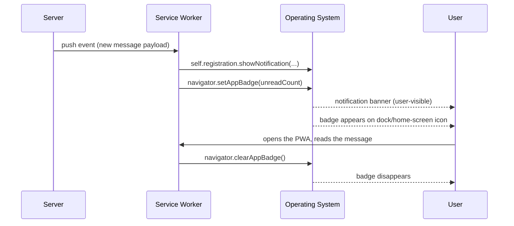

# [FEE-1317] Badging API and Re-Engagement Surfaces for Installed PWAs

:::info
The Badging API exposes two methods on `Navigator` and `WorkerNavigator`, `setAppBadge()` and `clearAppBadge()`, that render a count or generic indicator alongside an installed PWA's OS icon in the dock, shelf, or home screen. The API is intended for installed web applications, returns promises that resolve with `undefined`, and is callable from a service worker `push` handler so the badge can update as a quiet companion to a user-visible notification. Browser support spans Chrome and Edge 81+, Safari macOS 17+, and iOS Safari 16.4+ for home-screen web apps; Firefox does not support it. The badge is a silent count rendered on the OS icon for an installed app, distinct from notifications and updateable at higher frequency without interruption.
:::

## Context

Web developers have historically used favicon mutation and `document.title` rewriting to surface unread counts inside the browser tab chrome (MDN). The Badging API graduates that pattern into the operating system surface: per the W3C Working Draft, the spec defines a way to "display the application's badge alongside the primary iconic representation of the application in the user's operating system" (W3C). MDN frames the API as setting "App badges, which are associated with the icon of an installed web app" and notes those badges "may display on the app icon in the dock, shelf, or home screen depending on the device in use." The W3C draft scopes the feature to installed apps: "A badge is intended as a mechanism for installed web applications." Chrome's capabilities documentation reinforces the install gate: "your web app needs to meet Chrome's installability criteria, and users must add it to their home screens." On Apple platforms, the WebKit blog post by Marcos Cáceres and Brady Eidson restricts iOS/iPadOS 16.4 exposure to "web apps the user has added to their home screen" and excludes Safari proper and WKWebView.

## Visual



## Example

A messaging PWA increments the badge from a foreground page after fetching new messages, updates the badge from a service worker `push` handler alongside a user-visible notification, and clears the badge once the user reads the inbox.

```js
// Foreground page: after a fetch returns the unread count.
async function refreshBadge(unread) {
  if (!('setAppBadge' in navigator)) return;
  if (unread > 0) {
    await navigator.setAppBadge(unread);
  } else {
    await navigator.clearAppBadge();
  }
}
```

```js
// service-worker.js — push handler updates the badge AND shows a notification.
self.addEventListener('push', (event) => {
  const data = event.data?.json() ?? { count: 1, title: 'New message' };
  event.waitUntil((async () => {
    await self.registration.showNotification(data.title, {
      body: data.body ?? 'You have a new message',
    });
    if ('setAppBadge' in self.navigator) {
      await self.navigator.setAppBadge(data.count);
    }
  })());
});
```

```js
// Read-receipt path: clear the badge once the inbox is opened.
async function onInboxOpened() {
  if ('clearAppBadge' in navigator) {
    await navigator.clearAppBadge();
  }
}
```

The W3C signature is `Promise<undefined> setAppBadge(optional [EnforceRange] unsigned long long contents);` (W3C). Per MDN, "If `contents` is `0` then the badge will be set to `nothing`, indicating a cleared badge." The WebKit blog confirms the equivalence: "calling `navigator.setAppBadge(0)` is equivalent to calling `navigator.clearAppBadge()`." Calling `navigator.setAppBadge()` with no argument shows "a dot, or other indicator as defined by the platform" (MDN).

## Best Practices

- **MUST** feature-detect with `'setAppBadge' in navigator` before calling, because the API is intended for installed applications and is absent in unsupported browsers (W3C: "A badge is intended as a mechanism for installed web applications"; caniuse: "Firefox: Not supported").
- **MUST** also call `self.registration.showNotification(...)` when updating the badge from a `push` event under WebKit, because "a badge update by itself does not fulfill the 'user visible' requirement" (WebKit blog).
- **MUST** keep the badge synchronized with server-truth state by setting on receive and clearing on read, mirroring the canonical "messaging feature displaying a badge on the app icon to show that new messages have arrived" use case (MDN).
- **SHOULD** call `clearAppBadge()` rather than relying on `setAppBadge(0)` when the intent is to clear, because both are defined to set the badge to `nothing` (W3C, MDN) and `clearAppBadge()` reads as the explicit clear path.
- **SHOULD** prefer the badge over a notification for high-frequency state updates, because "Badges tend to be more user-friendly than notifications, and can be updated with much higher frequency, since they don't interrupt the user" (Chrome capabilities).
- **MAY** call `setAppBadge()` with no argument when an exact count is unavailable, in which case the platform "will display as a dot, or other indicator" (MDN).
- **MAY** call the API from a `WorkerNavigator` inside a service worker, because the W3C spec includes `NavigatorBadge` on both `Navigator` and `WorkerNavigator` and MDN states "This feature is available in Web Workers."

## Design Thinking

The badge sits on an ambient channel; the notification sits on an interruptive channel. Chrome's capabilities article frames the trade: badges "don't interrupt the user" and so "can be updated with much higher frequency." A messaging app that increments a notification on every inbound message would degrade quickly into noise; the same app updating only the badge keeps the surface live without spending the user's attention budget. The cost of choosing the badge channel is that the user has to look at the icon to see the state, which is acceptable for non-urgent counts and unacceptable for time-critical alerts. WebKit's constraint that a `push`-driven badge update accompany a `showNotification` call reflects the same axis from the platform side: pushes consume a wake-up budget that the platform refuses to grant for silent updates alone.

## Deep Dive

The W3C IDL `Promise<undefined> setAppBadge(optional [EnforceRange] unsigned long long contents)` constrains the contents argument to a 64-bit unsigned integer; `EnforceRange` causes out-of-range values to throw rather than truncate (W3C). Both `setAppBadge` and `clearAppBadge` return promises that resolve with `undefined` (MDN). The mixin `NavigatorBadge` is included on both `Navigator` and `WorkerNavigator` (W3C), which is what enables the service-worker `push`-handler pattern: the WebKit blog explicitly states "it is trivial to update your application badge while your Service Worker handles a `push` event," and the Chrome capabilities documentation confirms that "a server push could update the badge by calling `navigator.setAppBadge()`." On iOS and iPadOS 16.4 the API is bound to the home-screen install context: per WebKit, "You won't find the API exposed to websites in Safari or other browsers, or in any app that uses WKWebView." Browser support per caniuse and Chrome capabilities: Chrome 81+ and Edge 81+ on desktop, Safari macOS 17.0+, Safari iOS 16.4+ for home-screen web apps; Firefox is not supported.

## Badge UX Patterns

The findings doc catalogs six concrete patterns. Each maps a re-engagement intent onto a specific API call sequence.

| # | Pattern | Trigger | Action | Source claim |
|---|---------|---------|--------|--------------|
| 1 | Unread inbox | New message received | `setAppBadge(unread)` on receive; `clearAppBadge()` on read | MDN: messaging-feature use case |
| 2 | Pending review queue | Queue length changes | `setAppBadge(queueLength)` on every settle event; debounce updates to avoid taskbar thrash | Chrome capabilities: badges "can be updated with much higher frequency" |
| 3 | Generic activity dot | Count is unknown | `setAppBadge()` with no argument | MDN: "the badge will display as a dot, or other indicator as defined by the platform" |
| 4 | Push-driven badge | Service worker `push` event | `showNotification(...)` then `setAppBadge(count)` | WebKit: "badge update by itself does not fulfill the 'user visible' requirement" |
| 5 | Cross-device sync | App focus / `visibilitychange` | Re-fetch server-side unread count, then `setAppBadge(count)` | MDN, Chrome capabilities: badge surfaces server-truth state |
| 6 | Zero-out on focus | User opens the app | `clearAppBadge()` on first focus event | Mirrors the canonical messaging use case (MDN) |

Patterns 4 and 5 anchor the cross-platform constraint: WebKit demands the user-visible notification companion, and reconciling against server-truth on focus protects against drift between the badge and the inbox state. Pattern 3 is the "flag" mode for cases where the app knows something changed but cannot quickly compute a count.

## Related Topics

- [Web App Manifest](/en/Progressive%20Web%20Apps%20and%20Offline/1301)
- [Push Notifications and Background Sync](/en/Progressive%20Web%20Apps%20and%20Offline/1306)
- [Service Workers](/en/Progressive%20Web%20Apps%20and%20Offline/1302)

## References

- W3C, "Badging API," W3C Working Draft (n.d.). https://www.w3.org/TR/badging/
- MDN contributors, "Badging API," MDN Web Docs (n.d.). https://developer.mozilla.org/en-US/docs/Web/API/Badging_API
- MDN contributors, "Navigator: setAppBadge() method," MDN Web Docs (n.d.). https://developer.mozilla.org/en-US/docs/Web/API/Navigator/setAppBadge
- MDN contributors, "Navigator: clearAppBadge() method," MDN Web Docs (n.d.). https://developer.mozilla.org/en-US/docs/Web/API/Navigator/clearAppBadge
- Chrome capabilities team, "Badging API," Chrome for Developers (n.d.). https://developer.chrome.com/docs/capabilities/web-apis/badging-api
- web.dev, "Badges," web.dev patterns (n.d.). https://web.dev/patterns/web-apps/badges
- Marcos Cáceres and Brady Eidson, "Badging for Home Screen Web Apps," WebKit blog (2023). https://webkit.org/blog/14112/badging-for-home-screen-web-apps/
