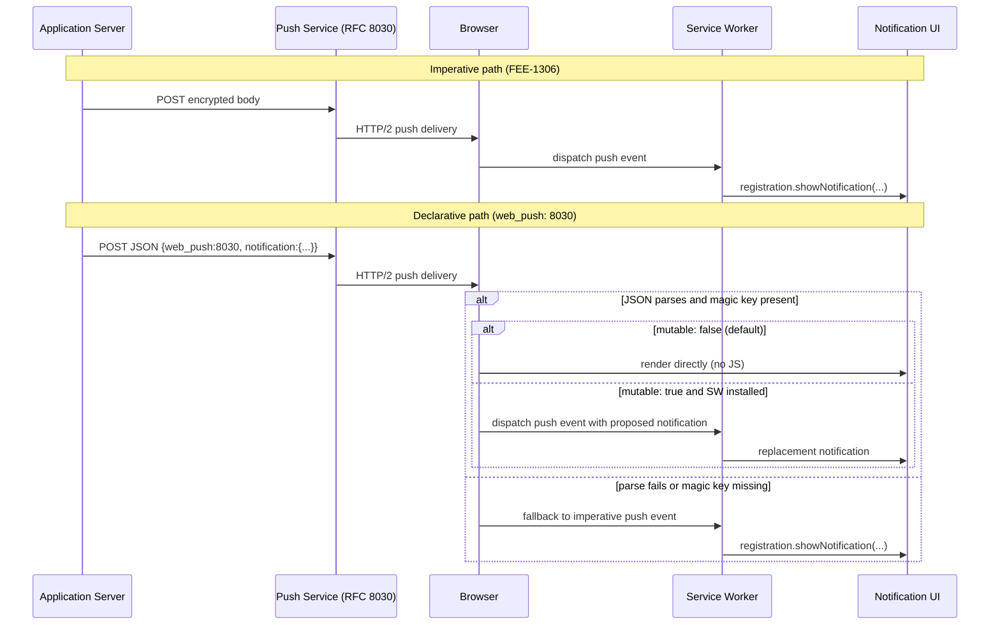

# [FEE-1316] Declarative Web Push (Safari 18.4/18.5) and Cross-Browser Push Convergence

:::info
Declarative Web Push is a WebKit-led variant of the Web Push protocol in which the application server emits a structured JSON payload containing the `web_push: 8030` magic key, and the browser displays the resulting notification directly without booting a service worker. WebKit shipped it in Safari 18.4 for iOS/iPadOS Home Screen web apps and in Safari 18.5 for macOS. The same RFC 8030 transport and `applicationServerKey` subscription model used by imperative Web Push still applies, so a single push sent today can render declaratively on Safari and fall back to the imperative `push` event on browsers without an implementation.
:::

## Context

Imperative Web Push, the model documented by MDN, requires that "the service worker will be started as necessary to handle incoming push messages, which are delivered to the `onpush` event handler." The service worker decides whether to call `showNotification`, what title and body to render, and whether to update the badge. The transport itself is RFC 8030 (Generic Event Delivery Using HTTP Push), whose body is application-defined and opaque to the push service.

Brady Eidson's WebKit blog post "Meet Declarative Web Push" (2025-03-27) introduces a parallel format on top of the same RFC 8030 transport. The post states that Declarative Web Push "allows web developers to request a Web Push subscription and display user visible notifications without requiring an installed service worker," and that the JSON schema "guarantees that the browser has enough information to display a user-visible notification without any JavaScript." WebKit's Safari 18.5 release notes frame the motivation as developer ergonomics and energy: "This new approach to push notifications on the web doesn't require Service Workers — which makes it far easier for you as a developer to implement. And saves battery life for your users." Standardization is tracked on W3C Push API issue #360.

## Visual



## Example

Server payload, taken verbatim from "Meet Declarative Web Push":

```json
{
    "web_push": 8030,
    "notification": {
        "title": "Webkit.org — Meet Declarative Web Push",
        "lang": "en-US",
        "dir": "ltr",
        "body": "Send push notifications without JavaScript or service worker!",
        "navigate": "https://webkit.org/blog/16535/meet-declarative-web-push/",
        "silent": false,
        "app_badge": "1"
    }
}
```

When this payload reaches a browser that implements Declarative Web Push, the JSON parses, the top-level `web_push: 8030` key opts the message into declarative parsing, and the browser renders a notification with the given title, body, language, direction, and silent flag, navigates to the `navigate` URL on activation, and updates the application badge to `1` for Home Screen web apps on iOS. No JavaScript runs.

Subscription on the client side does not require a service worker either. The WebKit blog shows the new entry point on `window`:

```js
const subscription = await window.pushManager.subscribe({
    userVisibleOnly: true,
    applicationServerKey: arrayForPublicKey
});
```

The same `applicationServerKey` subscription model as imperative push is reused, so a back end already issuing imperative push messages can begin emitting declarative JSON for the same subscription endpoint.

## Best Practices

- **MUST** include the top-level `web_push: 8030` magic key in every declarative payload. The WebKit blog calls this "the magic value that opts the rest of your push message into declarative parsing"; the WWDC25 session restates the requirement as "you must always have a web_push key with the value 8-0-3-0."
- **MUST** provide a non-empty `notification.title` and a `notification.navigate` URL. WWDC25 Session 235 names these as "the minimum requirements for a valid notification," and the WebKit blog states that a non-empty `title` value is required and that `navigate` "describes a URL that will be navigated to by the browser upon activation."
- **MUST** keep emitting an imperative payload alongside the declarative one during the rollout window. WWDC25 confirms that if the browser fails to parse the JSON or finds no magic key, "it falls back to original Web Push, using a Service Worker to handle the message," and the WebKit Safari 18.4 / 18.5 release notes scope the implementation to Safari only.
- **SHOULD** prefer the declarative path when the notification content is fully known on the server. The WebKit Safari 18.5 release notes credit the SW-less model with making implementation easier and saving battery, and the WebKit blog states "there is no penalty for service workers failing to display a notification" under declarative delivery.
- **SHOULD** set `mutable: true` only when the service worker genuinely needs to rewrite the proposed notification before display. The WebKit explainer states "notification payloads are immutable by default (false)," and WWDC25 describes `mutable` as the explicit signal that "this notification needs to be processed by the service worker."
- **MAY** use the `app_badge` field to update the application badge inline. The WebKit blog notes that "the declarative message can include an updated application badge" via `app_badge` for Home Screen web apps on iOS, and WWDC25 frames this as "built-in updating of the app badge."

## Design Thinking

The trade is between a declared schema and arbitrary code. Imperative Web Push lets the service worker run any logic at notification time: IndexedDB lookups, dynamic body composition, end-to-end-encrypted body decryption. Declarative Web Push fixes the displayable surface to the W3C `NotificationOptions` dictionary (per WWDC25, "anything supported by the W3C standard NotificationOptions dictionary is respected here") and gives up that flexibility in return for the browser displaying the notification without booting a service worker.

WebKit's stated reason for the trade is privacy and energy: "Allowing websites to remotely wake up a device for silent background work is a privacy violation and expends energy." The escape hatch is `mutable: true` — when the proposed notification cannot be displayed as-is (for example, when the body has to be decrypted client-side), the service worker is dispatched with the proposed notification context on the `PushEvent` and shows a replacement. If the server author does not need that escape hatch, the default `mutable: false` keeps the service worker out of the path entirely.

## Deep Dive

Three behaviours:

1. **Parse-path fallback.** Per WWDC25, "what happens if the browser attempts to parse JSON from the push message and fails? In that case it falls back to original Web Push, using a Service Worker to handle the message. It also falls back to original Web Push if the JSON doesn't have the magic key." This is what makes a single payload safe to emit cross-browser: a Chrome or Firefox build with no declarative implementation treats the JSON body as opaque RFC 8030 bytes and dispatches a `push` event to the service worker, which can call `showNotification` itself.

2. **`PushEvent` carries the proposed notification.** The WebKit blog states that "when a Declarative Web Push message arrives and a service worker is installed, a push event is dispatched to it like before. `PushEvent` now has the context of the 'proposed notification' from the Declarative Web Push message." The same post adds "there is no penalty for service workers failing to display a notification" — the browser will render the proposed notification anyway when `mutable` is false or absent.

3. **`window.pushManager` divergence.** Imperative Web Push exposes only `ServiceWorkerRegistration.pushManager`. The WebKit blog states that Declarative Web Push "also exposes `window.pushManager` to support subscription management without requiring a service worker." The rest of the subscription contract (`userVisibleOnly`, `applicationServerKey`) is unchanged.

## Imperative vs Declarative Decision Matrix

| Dimension | Imperative Web Push (RFC 8030 + SW) | Declarative Web Push |
|---|---|---|
| Service Worker dispatch path | `push` event fires on the SW; SW calls `registration.showNotification` | Browser renders directly when `mutable` is false or absent; SW receives `push` with proposed-notification context only when `mutable: true` |
| JSON shape | Application-defined; opaque to the push service per RFC 8030 | Top-level `web_push: 8030` magic key plus a `notification` object whose fields mirror W3C `NotificationOptions` (`title`, `lang`, `dir`, `body`, `navigate`, `silent`, `app_badge`, `mutable`) |
| IETF webpush draft alignment | RFC 8030 transport, application-defined body | Same RFC 8030 transport; declarative format is a WebKit-proposed schema layered on top, tracked at W3C Push API issue #360 |
| Cross-browser fallback | n/a; this is the baseline | If JSON parse fails or the magic key is missing, the browser falls back to the imperative `push` event; payload can therefore double-serve Safari 18.4+/18.5+ and Chrome/Firefox |
| Dev/test ergonomics | Requires a registered, installed Service Worker; notification fails to appear if the SW is unregistered or `showNotification` fails | No SW required for display; subscription via `window.pushManager`; per the Safari 18.5 release notes the SW-less path is "far easier for you as a developer to implement" |

## Related Topics

- [Push Notifications and Background Sync](/en/Progressive%20Web%20Apps%20and%20Offline/1306) — the imperative service-worker path that Declarative Web Push falls back to.

## References

- Brady Eidson, "Meet Declarative Web Push," WebKit blog (2025). https://webkit.org/blog/16535/meet-declarative-web-push/
- WebKit team, "WebKit Features in Safari 18.4," WebKit blog (2025). https://webkit.org/blog/16574/webkit-features-in-safari-18-4/
- WebKit team, "WebKit Features in Safari 18.5," WebKit blog (2025). https://webkit.org/blog/16923/webkit-features-in-safari-18-5/
- Brady Eidson, "Learn more about Declarative Web Push," Apple WWDC25 Session 235 (2025). https://developer.apple.com/videos/play/wwdc2025/235/
- WebKit, "Declarative Web Push," explainer README, GitHub (2025). https://github.com/WebKit/explainers/blob/main/DeclarativeWebPush/README.md
- M. Thomson, E. Damaggio, B. Raymor, "RFC 8030: Generic Event Delivery Using HTTP Push," IETF (2016). https://datatracker.ietf.org/doc/html/rfc8030
- MDN Web Docs contributors, "Push API," MDN (2025). https://developer.mozilla.org/en-US/docs/Web/API/Push_API
- W3C Push Working Group, "Declarative Web Push (issue #360)," W3C Push API repository. https://github.com/w3c/push-api/issues/360
