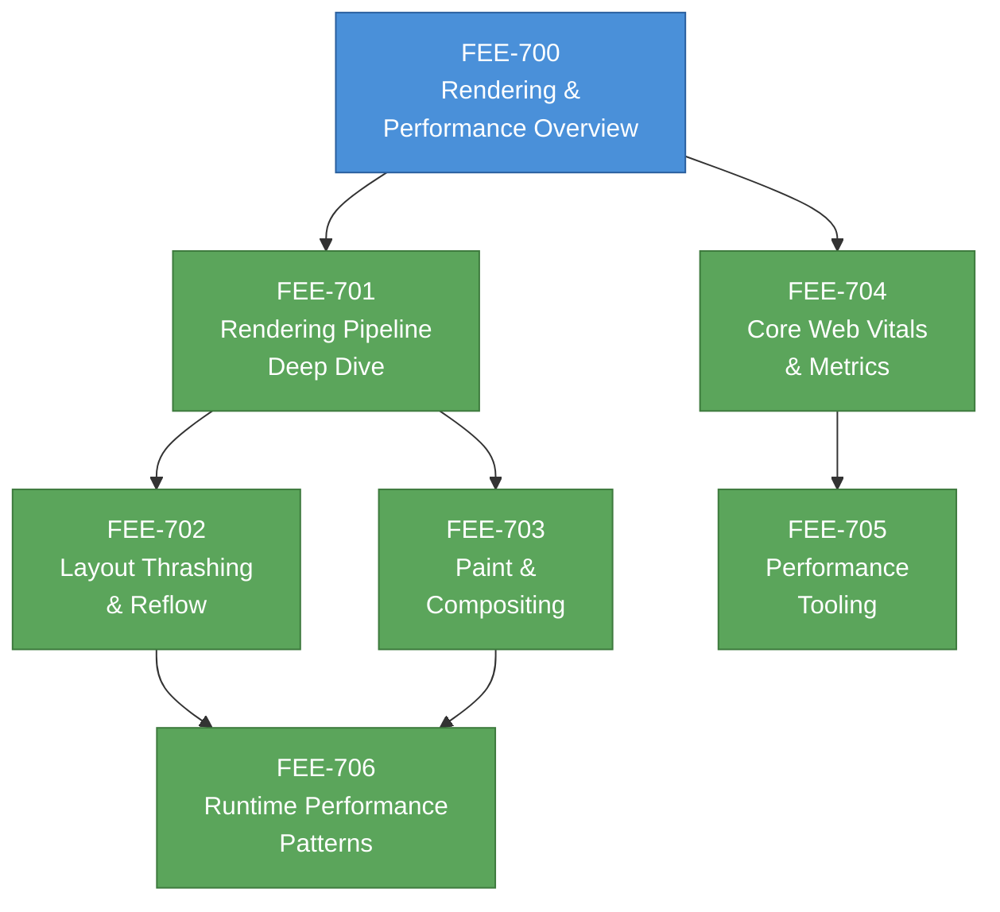

# [FEE-700] Rendering & Performance Overview

:::info
This category covers how browsers turn HTML, CSS, and JavaScript into pixels on screen -- and what frontend engineers can do to keep that process fast. Topics span the rendering pipeline, frame budgets, layout thrashing, paint optimization, compositing, Core Web Vitals, and performance tooling.
:::

## Context

Every interaction a user has with a web page -- scrolling, clicking, typing, watching an animation -- depends on the browser completing a sequence of work within strict time constraints. That sequence is the **rendering pipeline**, and understanding it is what separates engineers who build fast interfaces from engineers who guess at performance fixes.

The rendering pipeline describes the stages the browser executes to convert changes (a DOM mutation, a CSS transition, a scroll event) into updated pixels:

1. **JavaScript** -- Code runs that triggers a visual change: a DOM mutation, a class toggle, a `requestAnimationFrame` callback.
2. **Style** -- The browser recalculates which CSS rules apply to which elements (selector matching) and computes final property values.
3. **Layout** -- The browser calculates the geometry -- position and size -- of every affected element in the render tree. The first pass is called layout; subsequent recalculations are called **reflows**.
4. **Paint** -- The browser fills in pixels: text, colors, images, borders, shadows. Modern browsers paint into multiple **layers** rather than a single surface.
5. **Composite** -- The compositor thread takes the painted layers, applies transforms and opacity, and assembles the final image. This step can run on the GPU, off the main thread.

Not every change triggers every stage. This is the key insight for performance work:

- **Layout property changes** (e.g., `width`, `height`, `margin`, `top`) trigger the full pipeline: Style, Layout, Paint, Composite.
- **Paint-only property changes** (e.g., `background-color`, `box-shadow`, `color`) skip Layout: Style, Paint, Composite.
- **Compositor-only property changes** (e.g., `transform`, `opacity`) skip both Layout and Paint: Style, Composite. This is the cheapest path and the one to target for animations and scroll effects.

### The frame budget

At a 60 Hz refresh rate, the browser must produce a new frame every **16.66 milliseconds**. After accounting for the browser's own overhead (scheduling, garbage collection, compositor bookkeeping), developers have roughly **10 milliseconds** of main-thread time per frame to complete JavaScript, style, layout, and paint work.

Missing the deadline produces **jank** -- visible stuttering or dropped frames that users perceive immediately. The threshold is not theoretical; human perception research consistently shows:

| Threshold | User perception |
|-----------|----------------|
| 0-16 ms | Smooth motion. Users perceive continuous animation. |
| 16-100 ms | Acceptable for discrete responses (button feedback, menu open). |
| 100-300 ms | Perceptible delay. The interface feels sluggish but still connected to the action. |
| 300-1000 ms | Noticeable lag. Users lose the sense of direct manipulation. |
| > 1000 ms | Broken. Users assume the page is frozen or the action failed. |

For animations and scrolling, the 16.66 ms budget is non-negotiable. For discrete interactions (tap to open a modal, submit a form), the Interaction to Next Paint (INP) metric uses 200 ms as the "good" threshold.

### Why performance differs from correctness

A feature can be functionally correct -- it renders the right output given the right inputs -- and still be a poor user experience. Performance is a perceptual quality, not a boolean. Two implementations that produce identical visual output can feel completely different if one delivers frames in 8 ms and the other in 80 ms.

This is why performance cannot be bolted on after development. Layout choices (which CSS properties you animate), architecture choices (how you batch DOM reads and writes), and API choices (whether you use `IntersectionObserver` or a scroll event listener with `getBoundingClientRect`) all determine whether the rendering pipeline completes within budget.

## Design Thinking

### Why a pipeline (not a single pass)

The rendering pipeline is staged for the same reason that compilers have separate lexing, parsing, and code-generation phases: **separation of concerns enables targeted optimization**.

If style, layout, and painting were a single monolithic operation, any change -- even toggling `opacity` from 1 to 0.5 -- would require recalculating geometry and repainting every pixel. The pipeline's staged design means the browser can **skip irrelevant stages**:

- Compositor-only properties (`transform`, `opacity`) bypass both layout and paint entirely. The compositor thread handles these on the GPU without touching the main thread. This is why CSS `transform: translateX(100px)` performs fundamentally differently from `left: 100px` -- even though both move an element visually.

- Paint-only properties (`background-color`, `color`) bypass layout. The browser knows that changing a color cannot affect geometry, so it skips the expensive layout step.

This architecture is also why **layers** exist. The browser promotes certain elements (those with `will-change`, `transform`, `opacity`, `<video>`, `<canvas>`) to their own compositing layers. Each layer can be painted independently and composited on the GPU. When only one layer changes, the browser repaints just that layer and recomposites -- avoiding a full-page repaint.

### Why performance feels different from correctness

Correctness is binary: a button either submits the form or it does not. Performance is a spectrum tied to human perception, and the thresholds are rooted in psychophysics:

- **100 ms** is the limit for users to feel that a system is reacting instantaneously. Below this threshold, cause and effect feel directly connected.
- **300 ms** is where interactions start feeling sluggish. Users begin to notice they are waiting.
- **1000 ms** is the limit for maintaining flow of thought. Beyond this, users mentally disengage from the task.

These thresholds explain why the frame budget exists (16.66 ms for 60 fps animation), why INP targets 200 ms, and why Largest Contentful Paint targets 2.5 seconds. Each metric maps to a perceptual boundary.

The practical consequence: performance work requires **measurement**, not intuition. Engineers routinely guess wrong about where time is spent. The Performance panel in Chrome DevTools, Lighthouse, and the `PerformanceObserver` API exist precisely because the rendering pipeline's behavior is not obvious from reading source code alone.

## Visual

### The Rendering Pipeline

### Category Roadmap

**Reading order:** Start with the pipeline deep dive (701) to build a mental model of how the browser renders. Layout thrashing (702) and paint/compositing (703) go deeper into specific pipeline stages. Core Web Vitals (704) and tooling (705) cover measurement. Runtime patterns (706) synthesizes everything into practical optimization techniques.

## Related FEEs

| FEE | Relationship |
|-----|-------------|
| [FEE-300 JavaScript Core & Runtime](../JavaScript%20Core%20and%20Runtime/300.md) | JavaScript execution is the first stage of the rendering pipeline. Understanding the event loop, microtasks, and `requestAnimationFrame` timing is essential for avoiding jank. |
| [FEE-200 CSS & Layout Systems](../CSS%20and%20Layout%20Systems/200.md) | CSS properties determine which pipeline stages are triggered. Layout modes (Flexbox, Grid) affect reflow cost. Animations using `transform` vs `left` have fundamentally different performance profiles. |
| [FEE-400 Browser APIs & Web Platform](../Browser%20APIs%20and%20Web%20Platform/400.md) | APIs like `IntersectionObserver`, `requestIdleCallback`, `PerformanceObserver`, and the Web Animations API are the browser's native performance primitives. |

## References

- [Rendering Performance -- web.dev](https://web.dev/articles/rendering-performance) -- Google's authoritative guide to the pixel pipeline, frame budgets, and the three pipeline paths
- [Populating the Page: How Browsers Work -- MDN](https://developer.mozilla.org/en-US/docs/Web/Performance/Guides/How_browsers_work) -- Comprehensive walkthrough of the critical rendering path from DNS lookup to compositing
- [Inside Look at Modern Web Browser (Part 3) -- Chrome for Developers](https://developer.chrome.com/blog/inside-browser-part3) -- Detailed explanation of the renderer process, compositor thread, and layer tree
- [RenderingNG Architecture -- Chrome for Developers](https://developer.chrome.com/docs/chromium/renderingng-architecture) -- Chromium's modern rendering architecture with threading model and pipeline stages
- [Critical Rendering Path -- MDN](https://developer.mozilla.org/en-US/docs/Web/Performance/Guides/Critical_rendering_path) -- MDN's guide to the sequence of steps browsers use to convert HTML, CSS, and JS into pixels
