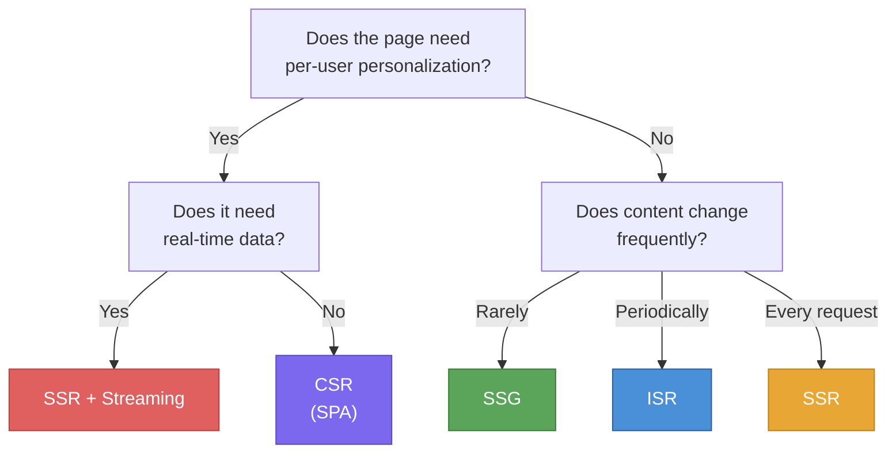

# [FEE-701] Rendering Strategies: CSR, SSR, SSG & Streaming

:::info
This article covers the major rendering strategies available to frontend engineers: Client-Side Rendering (CSR), Server-Side Rendering (SSR), Static Site Generation (SSG), Incremental Static Regeneration (ISR), and Streaming SSR, along with their performance tradeoffs and the decision frameworks for choosing among them.
:::

## Context

A modern web application is no longer limited to a single rendering strategy. The question "where and when does HTML get produced?" has become a per-route, sometimes per-component decision. Understanding the spectrum from fully static to fully dynamic rendering is essential for making informed architecture choices that directly affect Time to First Byte (TTFB), First Contentful Paint (FCP), Time to Interactive (TTI), SEO, and infrastructure cost.

### Client-Side Rendering (CSR)

In CSR, the server sends a minimal HTML shell (often just a `<div id="app"></div>`) and a JavaScript bundle. The browser downloads, parses, and executes the JavaScript, which then fetches data and renders the UI entirely on the client.

**Characteristics:**

- **TTFB:** Fast. The server sends a small, static HTML file.
- **FCP:** Slow. The browser must download and execute the JS bundle before any meaningful content appears.
- **TTI:** Slow. The page is not interactive until the full bundle loads and hydration (if any) completes.
- **SEO:** Poor by default. Search engine crawlers see an empty shell unless they execute JavaScript. While Googlebot does execute JS, other crawlers may not, and there is a delay before indexed content appears.
- **Infra cost:** Low. The server is a simple static file server or CDN.

CSR is the default model for single-page applications (SPAs) built with React (Create React App), Vue CLI, and Angular CLI without SSR configured. It works well for authenticated dashboards, internal tools, and applications where SEO is irrelevant and the user is willing to wait for an initial load in exchange for smooth subsequent navigation.

### Server-Side Rendering (SSR)

In SSR, the server generates the full HTML for each request. The browser receives complete markup, paints it immediately, then downloads JavaScript to "hydrate" the page, attaching event listeners and making it interactive.

**Characteristics:**

- **TTFB:** Slower. The server must fetch data and render HTML before responding. TTFB depends on server performance, database latency, and the complexity of the page.
- **FCP:** Fast. The browser receives complete HTML and can paint it before JS loads.
- **TTI:** Moderate. There is a gap between when the page appears (FCP) and when it becomes interactive (hydration complete). This gap is the "uncanny valley" of SSR.
- **SEO:** Excellent. Crawlers receive fully rendered HTML.
- **Infra cost:** Higher. Every request requires server compute. The server must be available and fast.

SSR is the right choice when the page content is personalized per user, changes on every request, or depends on real-time data. Social media feeds, e-commerce product pages with dynamic pricing, and search results pages are classic SSR use cases.

### Static Site Generation (SSG)

In SSG, pages are rendered to HTML at build time. The output is a set of static HTML files that can be served directly from a CDN with no server compute at request time.

**Characteristics:**

- **TTFB:** Fastest. The response is a pre-built file served from the edge.
- **FCP:** Fastest. Complete HTML is immediately available.
- **TTI:** Fast. Minimal or no hydration needed for purely static content.
- **SEO:** Excellent. Crawlers receive fully rendered HTML.
- **Infra cost:** Lowest. Static files on a CDN. No origin server needed for rendering.

SSG is ideal for content that does not change between deployments: documentation sites, blogs, marketing pages, and landing pages. The tradeoff is that any content update requires a rebuild and redeploy.

### Incremental Static Regeneration (ISR)

ISR, popularized by Next.js, combines the performance of SSG with the ability to update content without a full rebuild. Pages are statically generated at build time, but can be revalidated in the background after a configurable time interval or on demand.

**Characteristics:**

- **TTFB:** Fast. Serves the cached static page. A stale page triggers background regeneration.
- **FCP:** Fast. Same as SSG for cached pages.
- **TTI:** Fast. Same as SSG.
- **SEO:** Excellent. Crawlers always receive rendered HTML.
- **Infra cost:** Low to moderate. Most requests hit the cache; regeneration happens only when stale.

ISR is well-suited for large content sites (e-commerce catalogs with thousands of product pages, news sites) where a full rebuild is impractical and content can tolerate being stale for seconds or minutes.

### Streaming SSR

Streaming SSR sends HTML to the browser in chunks as the server generates it, rather than waiting for the entire page to be complete before sending any bytes. The browser can begin parsing and painting as soon as the first chunk arrives.

**Characteristics:**

- **TTFB:** Improved over traditional SSR. The first byte arrives as soon as the shell is ready, even if slower data sources have not yet resolved.
- **FCP:** Faster. The browser renders the shell and above-the-fold content while below-the-fold sections stream in.
- **TTI:** Can be faster. JavaScript for early sections can begin hydrating while later sections are still streaming.
- **SEO:** Excellent. The final HTML is complete and fully rendered.
- **Infra cost:** Similar to SSR, but reduces perceived latency without additional compute.

Streaming is particularly valuable when a page has multiple independent data sources with varying latencies. Instead of blocking the entire response on the slowest query, the server streams ready sections immediately and fills in the rest as data arrives.

## Design Thinking

### Why so many rendering modes?

The proliferation of rendering strategies is not accidental complexity. It reflects the fundamental tension between three concerns that pull in different directions:

1. **Content freshness**: How current must the data be? A blog post from last week is fine served from a static cache. A stock price must be current to the second.
2. **Performance**: Users expect sub-second page loads. Static files from a CDN are the fastest possible delivery mechanism. Server rendering adds latency but enables dynamic content.
3. **Infrastructure cost**: Every SSR request consumes CPU cycles. Static files are essentially free to serve. The more dynamic your rendering, the more servers you need.

No single strategy optimally satisfies all three. This is why modern frameworks expose a spectrum of options and encourage mixing strategies within a single application:

| Scenario | Best strategy | Why |
|----------|--------------|-----|
| Blog / docs | SSG | Content changes rarely; maximize speed and minimize cost |
| E-commerce catalog | SSG + ISR | Thousands of pages, updated periodically; full rebuild impractical |
| Personalized dashboard | SSR or CSR | Content differs per user; cannot be pre-rendered |
| E-commerce checkout | SSR + Streaming | Personalized, real-time pricing; streaming avoids blocking on slow APIs |
| Internal admin tool | CSR | No SEO needed; users accept initial load for rich interactivity |
| Marketing landing page | SSG | Maximum performance for conversion; content controlled by the team |

### Framework defaults and the spectrum

Each major framework has chosen a default position on the static-to-dynamic spectrum, reflecting its primary audience and philosophy:

- **Next.js (App Router):** Defaults to React Server Components (RSC) with static rendering. Pages are statically rendered unless they use dynamic functions (`cookies()`, `headers()`, `searchParams`). Streaming is built in via `loading.js` and `<Suspense>`. ISR is supported via `revalidate`. This positions Next.js as "static by default, dynamic when needed."

- **Nuxt 3:** Defaults to universal rendering: SSR on the first request, then client-side navigation for subsequent pages. Supports hybrid rendering where individual routes can be configured as SSR, SSG, ISR, or CSR. The `routeRules` API allows per-route configuration without code changes.

- **Astro:** Defaults to static output with zero client-side JavaScript. Interactive components ("islands") opt in to hydration via `client:*` directives. This Islands Architecture sends the absolute minimum JavaScript, making Astro the fastest option for content-heavy sites. On-demand (server) rendering is available per-route when needed.

- **SvelteKit:** Defaults to universal rendering (SSR + client-side hydration). Pages can opt into prerendering (SSG) via `export const prerender = true`. SvelteKit's compiler produces minimal runtime code, resulting in smaller bundles than virtual-DOM frameworks.

- **Remix / React Router v7:** Defaults to SSR with nested route loaders. Streaming is first-class via `defer()` and `<Await>`. Remix's philosophy is "use the platform": leverage HTTP caching, progressive enhancement, and streaming rather than static generation. No built-in SSG or ISR; caching is handled at the HTTP layer.

### The spectrum from static to dynamic

```
Fully Static                                              Fully Dynamic
|-------|-----------|-----------|------------|------------|
SSG     SSG+ISR     Streaming   SSR          CSR
                    SSR
        
Build-time          Request-time             Client-time
rendering           rendering                rendering
```

The key insight is that these strategies form a toolbox rather than a ranking. A well-architected application often uses multiple strategies simultaneously. A Next.js e-commerce site might use SSG for the homepage, ISR for product pages, SSR with streaming for search results, and CSR for the shopping cart, all within the same codebase.

## Best Practices

**Choose rendering strategy based on content dynamism and SEO requirements.** MUST NOT default every route to SSR or CSR without deliberate analysis. Static content that rarely changes SHOULD use SSG to maximize delivery speed and minimize infrastructure cost. Routes with per-user personalization or real-time data MUST use SSR or CSR, because pre-rendering cannot produce correct output for anonymous visitors and authenticated users simultaneously.

**Use streaming SSR to improve TTFB for data-dependent pages.** When a page has multiple independent data sources with varying latencies, traditional SSR blocks the entire response on the slowest query. SHOULD wrap slow data-fetching components in `<Suspense>` boundaries so the server can flush the page shell and above-the-fold content immediately, streaming slower sections as they resolve. This reduces perceived load time without additional infrastructure cost.

**Avoid full-page SSR for authenticated or personalized content without a caching strategy.** Rendering personalized HTML on every request without caching scales poorly and adds TTFB latency proportional to data-fetch time. SHOULD evaluate edge caching with cache-key variation (per user tier, locale, or segment) before building fully dynamic SSR. For content that is personalized but not real-time, SSR with a short-lived cache or stale-while-revalidate pattern is preferable to uncached per-request rendering.

## Visual

### Rendering Timeline: TTFB, FCP, TTI Comparison

```mermaid
gantt
    title Rendering Strategy Timeline Comparison
    dateFormat X
    axisFormat %s

    section CSR
    TTFB (HTML shell)        :done, csr_ttfb, 0, 1
    Download JS bundle       :active, csr_js, 1, 4
    Execute JS + Fetch data  :csr_exec, 4, 7
    FCP (content appears)    :milestone, csr_fcp, 7, 7
    TTI (interactive)        :milestone, csr_tti, 7, 7

    section SSR
    Server render            :done, ssr_render, 0, 3
    TTFB (full HTML)         :milestone, ssr_ttfb, 3, 3
    FCP (content appears)    :milestone, ssr_fcp, 3, 3
    Download + Hydrate JS    :active, ssr_hydrate, 3, 6
    TTI (interactive)        :milestone, ssr_tti, 6, 6

    section SSG
    TTFB (cached HTML)       :done, ssg_ttfb, 0, 1
    FCP (content appears)    :milestone, ssg_fcp, 1, 1
    Download + Hydrate JS    :active, ssg_hydrate, 1, 3
    TTI (interactive)        :milestone, ssg_tti, 3, 3

    section Streaming SSR
    Server starts streaming  :done, str_start, 0, 1
    TTFB (first chunk)       :milestone, str_ttfb, 1, 1
    FCP (shell + above fold) :milestone, str_fcp, 1, 1
    Stream remaining chunks  :active, str_stream, 1, 4
    Progressive hydration    :str_hydrate, 2, 5
    TTI (interactive)        :milestone, str_tti, 5, 5
```



### Decision Flowchart



## Example

### 1. CSR: SPA Fetch Pattern

A typical CSR application fetches data after the component mounts. The page is blank until JavaScript executes and the API responds.

```jsx
// React CSR -- data fetching happens entirely on the client
import { useState, useEffect } from 'react';

function ProductList() {
  const [products, setProducts] = useState([]);
  const [loading, setLoading] = useState(true);

  useEffect(() => {
    // This fetch only runs in the browser after JS loads
    fetch('/api/products')
      .then(res => res.json())
      .then(data => {
        setProducts(data);
        setLoading(false);
      });
  }, []);

  if (loading) return <div>Loading...</div>;

  return (
    <ul>
      {products.map(p => (
        <li key={p.id}>{p.name} -- ${p.price}</li>
      ))}
    </ul>
  );
}
```

**Tradeoff:** The user sees "Loading..." until the API responds. Search engines may not index the product list. This pattern is acceptable for authenticated dashboards but problematic for public-facing content.

### 2. SSR with Streaming (Next.js App Router)

Streaming SSR sends the page shell immediately and fills in data-dependent sections as they resolve. The `<Suspense>` boundary defines where streaming fallbacks appear.

```tsx
// app/products/page.tsx -- Next.js App Router with streaming
import { Suspense } from 'react';

// This component fetches data on the server
async function ProductList() {
  // Slow API call -- but it does NOT block the entire page
  const res = await fetch('https://api.example.com/products', {
    next: { revalidate: 60 }, // ISR: revalidate every 60 seconds
  });
  const products = await res.json();

  return (
    <ul>
      {products.map((p: Product) => (
        <li key={p.id}>{p.name} -- ${p.price}</li>
      ))}
    </ul>
  );
}

// The page shell streams immediately; ProductList streams in when ready
export default function ProductsPage() {
  return (
    <main>
      <h1>Our Products</h1>
      <Suspense fallback={<p>Loading products...</p>}>
        <ProductList />
      </Suspense>
    </main>
  );
}
```

**Tradeoff:** The user sees the page heading and loading placeholder immediately (fast FCP). The product list appears as soon as the API responds. No client-side fetch waterfall. The final HTML is complete for SEO.

### 3. SSG with ISR (Next.js Pages Router)

ISR generates pages at build time and regenerates them in the background when they become stale.

```tsx
// pages/products/[id].tsx -- Next.js Pages Router with ISR
import type { GetStaticProps, GetStaticPaths } from 'next';

export const getStaticPaths: GetStaticPaths = async () => {
  // Pre-render the top 100 products at build time
  const res = await fetch('https://api.example.com/products?top=100');
  const products = await res.json();

  return {
    paths: products.map((p: Product) => ({ params: { id: String(p.id) } })),
    fallback: 'blocking', // SSR on first request for non-pre-rendered pages
  };
};

export const getStaticProps: GetStaticProps = async ({ params }) => {
  const res = await fetch(`https://api.example.com/products/${params!.id}`);
  const product = await res.json();

  return {
    props: { product },
    revalidate: 3600, // Regenerate at most once per hour
  };
};

export default function ProductPage({ product }: { product: Product }) {
  return (
    <main>
      <h1>{product.name}</h1>
      <p>{product.description}</p>
      <p>Price: ${product.price}</p>
    </main>
  );
}
```

**Tradeoff:** The first visitor after the revalidation window triggers a background regeneration but still receives the stale cached page (stale-while-revalidate pattern). This means content can be up to `revalidate` seconds old, which is acceptable for product catalogs but not for real-time pricing.

## Common Mistakes

### 1. ISR without a revalidation strategy

Setting `revalidate: 3600` and forgetting about it means users might see content up to an hour old. For time-sensitive content (event pages, flash sales), this can be damaging. The fix: use on-demand revalidation (webhook-triggered) for critical content, and time-based revalidation only for content where staleness is acceptable.

### 2. Hydration mismatch from server/client divergence

When the server-rendered HTML does not match what the client-side JavaScript expects to render, React throws hydration mismatch errors, and the user may see a flash of incorrect content. Common causes:
- Using `Date.now()` or `Math.random()` during render (different values on server vs client).
- Checking `window` or `localStorage` during SSR (these do not exist on the server).
- Conditional rendering based on browser-only APIs.

The fix: isolate browser-only logic in `useEffect` or behind `typeof window !== 'undefined'` checks, and ensure that the initial render produces identical output on both server and client.

## Related FEEs

| FEE | Relationship |
|-----|-------------|
| [FEE-700 Rendering & Performance Overview](./700.md) | Parent overview covering the browser rendering pipeline that executes after HTML arrives -- regardless of how that HTML was produced. |
| [FEE-703 Paint & Compositing](./703.md) | Hydration, a critical step in SSR and streaming, triggers paint and compositing. Understanding these pipeline stages helps diagnose hydration performance issues. |
| [FEE-106 Progressive Enhancement](../HTML%20and%20Semantic%20Markup/106.md) | Progressive enhancement ensures that server-rendered content is functional before client-side JavaScript loads -- a principle that directly supports SSR and streaming strategies. |

## References

- [Rendering on the Web -- web.dev](https://web.dev/articles/rendering-on-the-web) -- Google's comprehensive comparison of CSR, SSR, SSG, streaming, and rehydration patterns with performance analysis
- [How to Choose the Best Rendering Strategy -- Vercel](https://vercel.com/blog/how-to-choose-the-best-rendering-strategy-for-your-app) -- Decision framework for choosing among SSG, ISR, SSR, and CSR with real-world application patterns
- [Rendering: Server Components -- Next.js Docs](https://nextjs.org/docs/app/getting-started/server-and-client-components) -- Next.js documentation on React Server Components, streaming, and the App Router rendering model
- [Hybrid Rendering -- Nuxt Docs](https://nuxt.com/docs/guide/concepts/rendering#hybrid-rendering) -- Nuxt 3's approach to mixing SSR, SSG, ISR, and CSR on a per-route basis
- [On-demand Rendering -- Astro Docs](https://docs.astro.build/en/guides/on-demand-rendering/) -- Astro's model for opting individual routes into server rendering while keeping the rest static
- [Islands Architecture -- Astro Docs](https://docs.astro.build/en/concepts/islands/) -- Astro's Islands Architecture for selective hydration of interactive components within a static page
- [SvelteKit Routing: Page Options -- SvelteKit Docs](https://svelte.dev/docs/kit/page-options) -- SvelteKit's per-route configuration for prerendering, SSR, and CSR
- [Rendering Strategies -- patterns.dev](https://www.patterns.dev/react/rendering-patterns) -- Visual guide to rendering patterns including streaming SSR and progressive hydration
