# [FEE-702] Virtual DOM, Reconciliation & Diffing

:::info
This article explains what the Virtual DOM is, how frameworks like React use reconciliation and diffing to minimize real DOM operations, and why some frameworks (Svelte, Solid) have rejected the Virtual DOM entirely in favor of compiler-based or signal-based approaches.
:::

## Context

Manipulating the real DOM is expensive. Every `document.createElement`, every `element.setAttribute`, every `parentNode.appendChild` triggers internal browser bookkeeping -- style recalculation, layout, paint, compositing. When a single user interaction changes dozens of elements, naive imperative code that touches the DOM once per change produces far more work than necessary.

The **Virtual DOM (VDOM)** is an abstraction that solves this problem by interposing a lightweight in-memory representation of the UI between application code and the real DOM. Instead of mutating the DOM directly, the application describes the desired UI state as a tree of plain JavaScript objects. The framework then compares the new tree to the previous one (a process called **diffing**), computes the minimal set of real DOM operations needed, and applies them in a batch (a process called **reconciliation**).

### How the Virtual DOM works

1. **Render**: The application produces a new VDOM tree -- a tree of lightweight objects describing element types, props, and children.
2. **Diff**: The framework compares the new tree against the previous tree node by node.
3. **Patch**: Only the differences are applied to the real DOM -- an attribute change here, a node insertion there, a removal elsewhere.

This pattern decouples the "what should the UI look like" question (declarative) from the "how do I get the DOM from state A to state B" question (imperative). The framework handles the imperative part, freeing developers to think declaratively.

### React: Fiber and heuristic diffing

React pioneered the Virtual DOM approach in 2013. Its current reconciliation engine, **React Fiber** (introduced in React 16), replaced the original synchronous, recursive tree-walk with an incremental, interruptible architecture.

**The two heuristics.** A generic tree diff algorithm runs in O(n^3) time -- impractical for UI trees with hundreds or thousands of nodes. React reduces this to O(n) by making two assumptions:

1. **Different element types produce different trees.** If a `<div>` becomes a `<span>`, React tears down the entire old subtree and builds a new one instead of trying to morph it.
2. **Keys identify stable children across renders.** When rendering a list, the `key` prop tells React which children are the same across renders, enabling it to reorder, insert, or remove efficiently.

**Fiber's incremental model.** Before Fiber, reconciliation was synchronous: once React started diffing, it could not pause until the entire tree was processed. Deep trees caused frame drops. Fiber breaks reconciliation into units of work (fiber nodes), each representing a single element. The reconciler can:

- **Pause** work to yield to the browser (keeping animations smooth).
- **Prioritize** urgent updates (user input) over less urgent ones (data fetching results).
- **Abort** outdated work if new state arrives before the previous reconciliation completes.

**Double buffering.** React maintains two fiber trees: the `current` tree (what is on screen) and the `workInProgress` tree (the next version being built). When reconciliation finishes, React swaps the pointers -- the `workInProgress` becomes `current`. This avoids partial UI states.

### Vue: compiler-informed Virtual DOM

Vue also uses a Virtual DOM, but its template compiler performs optimizations at build time that dramatically reduce the runtime diffing workload.

**Static hoisting.** The compiler detects nodes that are entirely static (no dynamic bindings) and hoists their VDOM creation out of the render function. These nodes are created once and reused across every re-render. The renderer skips diffing them entirely when it detects the old and new vnodes are the same reference.

**Static node condensation.** When multiple consecutive static elements appear, the compiler condenses them into a single "static vnode" containing a plain HTML string, which is set via `innerHTML` in one operation.

**Patch flags.** For nodes with dynamic bindings, the compiler attaches numeric patch flags that describe exactly what can change -- class, style, text, props. At runtime, the patching algorithm inspects the flag and jumps directly to the relevant comparison, skipping all attributes that cannot have changed.

**Tree flattening.** The compiler extracts dynamic nodes into a flat array (block tree), so the runtime only iterates over nodes that actually need diffing, regardless of how deep they sit in the template.

**Vue Vapor Mode.** Vue's upcoming Vapor Mode goes further: it compiles templates into direct DOM operations with no VDOM at all -- similar to Svelte's approach -- for components that opt in.

### Svelte: no Virtual DOM

Rich Harris, Svelte's creator, argued in 2018 that the Virtual DOM is "pure overhead." His thesis: the VDOM is a means to an end (declarative UI), not the only means. If a compiler can analyze component code at build time and generate precise, minimal DOM update instructions, the runtime diffing step is unnecessary.

Svelte is a **compiler**. It analyzes your component's reactive dependencies at build time and generates imperative JavaScript that directly updates the specific DOM nodes that depend on each piece of state. When `count` changes, Svelte does not re-render the component or diff a tree; it executes a generated statement like `set_data(t, count)` that updates a single text node.

**Tradeoffs:**

- Smaller runtime (no VDOM engine shipped to the browser).
- Updates are O(1) per reactive binding, not O(n) per component tree.
- Less flexibility for highly dynamic UIs where the compiler cannot predict the shape of the output.
- No cross-platform rendering (the compiler targets the DOM specifically).

### Solid: signals and direct DOM

Solid.js takes a different path to the same destination. Like React, it uses JSX. Unlike React, it does **not** use a Virtual DOM. Instead, Solid compiles JSX into real DOM creation code that runs **once** per component. Reactivity is handled through **signals** -- observable primitives that track their subscribers at a granular level.

When a signal's value changes, only the specific DOM expressions that read that signal re-execute. The component function itself never re-runs. This is **fine-grained reactivity**: the reactive graph connects signals directly to DOM update functions, with no intermediate tree representation.

**How it differs from React:**

- React re-renders components (re-executes the component function) and diffs the resulting trees. Solid runs the component function once and updates only the reactive expressions.
- React's granularity is the component. Solid's granularity is the individual DOM expression.
- React needs `React.memo`, `useMemo`, and `useCallback` to prevent unnecessary work. Solid's reactive system avoids unnecessary work by design.

## Design Thinking

### Why React invented the Virtual DOM

Before React, building interactive UIs meant writing imperative DOM manipulation: `document.getElementById('list').appendChild(newItem)`. This approach has two fundamental problems:

1. **It does not scale with complexity.** As the number of possible states grows, the number of imperative transitions between states grows combinatorially. A declarative model -- "here is what the UI should look like given this state" -- eliminates transition logic entirely.
2. **It couples rendering to the DOM.** Imperative code targets `document` and `element` APIs directly, making it impossible to render to other targets (server HTML strings, native mobile views, test harnesses).

The VDOM solved both problems. It provided a **declarative programming model** (describe the UI as a function of state) and a **platform-agnostic rendering target** (the VDOM is just objects; any renderer can consume them). React Native, React PDF, React Three Fiber, and server-side rendering all exist because the VDOM abstraction separates "what to render" from "where to render it."

### Why Svelte and Solid rejected the Virtual DOM

The VDOM introduces overhead: creating a new tree of objects, walking both trees to find differences, and then applying patches. For many applications, this overhead is small and the developer experience benefit is worth it. But it is **not zero**, and it is proportional to the size of the component tree, not the size of the actual change.

Svelte's insight: if the framework is a compiler rather than a runtime library, it can analyze the code ahead of time and generate update functions that target only the DOM nodes that could possibly change. No tree creation, no diffing, no patching -- just direct assignments.

Solid's insight: if reactivity is built into the primitive layer (signals, effects, memos), the reactive graph itself tracks which DOM nodes depend on which state. When state changes, the graph tells the runtime exactly what to update. No component re-execution, no tree diffing.

### The compiler vs. runtime tradeoff

| | Runtime VDOM (React) | Compiler-informed VDOM (Vue) | No VDOM -- compiler (Svelte) | No VDOM -- signals (Solid) |
|---|---|---|---|---|
| Update granularity | Component | Component (with flag shortcuts) | Per binding | Per signal subscriber |
| Bundle includes | VDOM runtime + reconciler | VDOM runtime (smaller) + compiler output | Minimal runtime + generated code | Small runtime + compiled JSX |
| Cross-platform | Yes (React Native, etc.) | Limited (Vapor targets DOM only) | No (DOM only) | Limited |
| Dynamic UI flexibility | High | High | Moderate | High |
| Optimization burden on developer | High (`memo`, `useMemo`, `useCallback`) | Low (compiler handles most) | Very low | Very low |

There is no universally "best" approach. React's VDOM enables an ecosystem of renderers and a mental model that scales to massive teams. Vue's compiler-informed VDOM gets most of the runtime benefit with less developer effort. Svelte and Solid achieve the highest raw update performance by eliminating the VDOM layer entirely, at the cost of cross-platform flexibility.

## Visual

### Reconciliation: Old Tree to DOM Patches

```mermaid
flowchart LR
    subgraph Before["Previous VDOM Tree"]
        A1["div"]
        A2["h1: 'Hello'"]
        A3["ul"]
        A4["li key=1: 'Apple'"]
        A5["li key=2: 'Banana'"]
        A1 --> A2
        A1 --> A3
        A3 --> A4
        A3 --> A5
    end

    subgraph After["New VDOM Tree"]
        B1["div"]
        B2["h1: 'Hello'"]
        B3["ul"]
        B4["li key=2: 'Banana'"]
        B5["li key=3: 'Cherry'"]
        B1 --> B2
        B1 --> B3
        B3 --> B4
        B3 --> B5
    end

    subgraph Diff["Diff Result"]
        D1["REMOVE li key=1"]
        D2["INSERT li key=3"]
        D3["REORDER li key=2"]
    end

    subgraph Patch["DOM Patches"]
        P1["removeChild&#40;apple&#41;"]
        P2["appendChild&#40;cherry&#41;"]
        P3["Move banana to index 0"]
    end

    Before --> Diff
    After --> Diff
    Diff --> Patch

    style Before fill:#4A90D9,color:#fff,stroke:#2A5F9E
    style After fill:#5BA55B,color:#fff,stroke:#3D7A3D
    style Diff fill:#E8A735,color:#fff,stroke:#B8841A
    style Patch fill:#E06060,color:#fff,stroke:#B84040
```



### Framework Approaches Compared

```mermaid
flowchart TD
    STATE["State Change"]

    STATE --> REACT["React: Re-render component<br/>Build new VDOM tree<br/>Diff old vs new<br/>Patch real DOM"]
    STATE --> VUE["Vue: Re-render component<br/>Build new VDOM tree<br/>Skip static nodes &#40;patch flags&#41;<br/>Patch only flagged nodes"]
    STATE --> SVELTE["Svelte: Run compiled<br/>update function<br/>Directly mutate<br/>affected DOM nodes"]
    STATE --> SOLID["Solid: Signal notifies<br/>subscribers<br/>Each subscriber updates<br/>its DOM node"]

    REACT --> DOM1["Real DOM"]
    VUE --> DOM2["Real DOM"]
    SVELTE --> DOM3["Real DOM"]
    SOLID --> DOM4["Real DOM"]

    style STATE fill:#7B68EE,color:#fff,stroke:#5A4BC7
    style REACT fill:#4A90D9,color:#fff,stroke:#2A5F9E
    style VUE fill:#5BA55B,color:#fff,stroke:#3D7A3D
    style SVELTE fill:#E8A735,color:#fff,stroke:#B8841A
    style SOLID fill:#E06060,color:#fff,stroke:#B84040
```



## Example

### 1. React: Key Usage in Lists

Keys are how React identifies which items in a list have changed, been added, or been removed. Without stable keys, React falls back to index-based comparison and may produce incorrect results when items are reordered.

```jsx
// WRONG: Using array index as key for a reorderable list
function TodoList({ todos, onRemove }) {
  return (
    <ul>
      {todos.map((todo, index) => (
        // If items are reordered or removed, index shifts and
        // React reuses DOM nodes incorrectly -- input state bleeds
        // between items, animations break, performance degrades.
        <li key={index}>
          <input type="checkbox" />
          <span>{todo.text}</span>
          <button onClick={() => onRemove(todo.id)}>Remove</button>
        </li>
      ))}
    </ul>
  );
}

// CORRECT: Using stable, unique ID as key
function TodoList({ todos, onRemove }) {
  return (
    <ul>
      {todos.map((todo) => (
        // Stable key lets React track each item across renders.
        // Reordering moves DOM nodes instead of recreating them.
        <li key={todo.id}>
          <input type="checkbox" />
          <span>{todo.text}</span>
          <button onClick={() => onRemove(todo.id)}>Remove</button>
        </li>
      ))}
    </ul>
  );
}
```

### 2. Vue: Static Hoisting and Patch Flags

Vue's template compiler detects static content at build time and generates optimized render code. The developer writes normal templates; the compiler does the optimization work.

```html
<template>
  <!-- Static content: hoisted out of the render function, created once -->
  <header>
    <h1>My Application</h1>
    <p>Welcome to the dashboard</p>
  </header>

  <!-- Dynamic content: only the text binding is diffed -->
  <div>
    <span>Count: {{ count }}</span>       <!-- patch flag: TEXT -->
    <button :class="btnClass">Click</button> <!-- patch flag: CLASS -->
  </div>
</template>
```

The compiler output conceptually looks like:

```js
// Static nodes are hoisted -- created once, never diffed
const _hoisted_1 = /*#__PURE__*/ createStaticVNode(
  '<header><h1>My Application</h1><p>Welcome to the dashboard</p></header>'
);

function render(_ctx) {
  return (
    openBlock(),
    createElementBlock(Fragment, null, [
      _hoisted_1, // reused by reference -- diff skipped entirely
      createElementVNode("div", null, [
        createElementVNode(
          "span",
          null,
          "Count: " + toDisplayString(_ctx.count),
          1 /* TEXT -- only text content is diffed */
        ),
        createElementVNode(
          "button",
          { class: normalizeClass(_ctx.btnClass) },
          "Click",
          2 /* CLASS -- only class attribute is diffed */
        ),
      ]),
    ])
  );
}
```

### 3. Solid: Fine-Grained Signal Updates

In Solid, the component function runs once. Signals create reactive subscriptions that update the DOM directly -- no re-render, no diff.

```jsx
import { createSignal } from "solid-js";

function Counter() {
  const [count, setCount] = createSignal(0);

  // This console.log runs ONCE when the component mounts.
  // In React, it would run on every re-render.
  console.log("Counter component function executed");

  return (
    <div>
      {/* Only this text node updates when count changes.
          The div, button, and other nodes are never touched. */}
      <p>Count: {count()}</p>
      <button onClick={() => setCount(count() + 1)}>
        Increment
      </button>
    </div>
  );
}
```

When `setCount` is called, Solid does not re-run the `Counter` function. It updates only the text node inside the `<p>` element -- the specific DOM node that subscribed to the `count` signal. The `<div>`, the `<button>`, and every other node remain untouched.

## Common Mistakes

### 1. Missing or wrong keys in lists

When rendering lists without keys, React and Vue fall back to an index-based heuristic that assumes items are in the same order. Inserting an item at the beginning causes every element after it to be "updated" (its props change because the index shifted), resulting in unnecessary DOM mutations and broken component state.

**Fix:** Always provide a stable, unique `key` derived from the data (a database ID, a UUID, a slug) -- never from the array index when the list can be reordered, filtered, or have items inserted/removed.

### 2. Using array index as key for reorderable lists

Index-based keys are not inherently wrong for static, append-only lists. They become dangerous when items can be reordered, inserted in the middle, or removed. The reconciler maps index 0 to the first DOM node regardless of which data item it represents, causing state (input values, focus, animations) to stick to the wrong element.

**Fix:** Use the item's own identity as the key. If the data has no natural ID, generate one when the item is created (not during render).

### 3. Assuming the Virtual DOM is "fast"

The VDOM is not a performance optimization -- it is a **programming model** optimization. It exists so developers can write declarative UI code without manually tracking DOM mutations. The VDOM adds overhead (tree creation, diffing, patching) compared to perfectly targeted imperative code. It is faster than naive "blow away and rebuild the entire DOM" approaches, but slower than surgically precise manual updates.

**Fix:** Understand the VDOM as a tradeoff: developer experience and correctness in exchange for some runtime cost. When that cost matters, use framework-specific tools to reduce it (`React.memo`, Vue patch flags, etc.) or consider frameworks that skip the VDOM entirely.

### 4. Unnecessary re-renders from unstable references

In React, creating new objects, arrays, or functions inside a render function produces new references every render. Because React's diffing compares props by reference, child components re-render even when the values have not logically changed.

```jsx
// Every render creates a new style object and a new handler function.
// Child components receiving these as props will always re-render.
function Parent() {
  const [count, setCount] = useState(0);
  return (
    <Child
      style={{ color: "red" }}
      onClick={() => setCount((c) => c + 1)}
    />
  );
}
```

**Fix:** Stabilize references with `useMemo` for objects/arrays and `useCallback` for functions. In React 19+, the React Compiler can handle this automatically for many cases.

### 5. Not using framework-specific optimizations

Each framework provides tools to short-circuit unnecessary work, but developers often ignore them:

- **React:** `React.memo` to skip re-rendering when props have not changed. `useMemo` and `useCallback` to stabilize references. React Compiler (React 19+) automates these.
- **Vue:** `v-once` to render a subtree only once and never update it. `v-memo` to memoize parts of a template based on dependency values. `shallowRef` and `shallowReactive` to opt out of deep reactivity.
- **Svelte:** `{#key}` blocks to force re-creation when a value changes. Immutable data patterns to help the compiler optimize.

**Fix:** Learn and apply the performance primitives of your chosen framework. Profile first, optimize second.

## Related FEEs

| FEE | Relationship |
|-----|-------------|
| [FEE-700 Rendering & Performance Overview](./700.md) | Parent overview covering the browser rendering pipeline. The VDOM reconciliation process produces DOM mutations that then flow through the browser's style, layout, paint, and composite stages. |
| [FEE-401 DOM APIs & Traversal](../Browser%20APIs%20and%20Web%20Platform/401.md) | The real DOM APIs that VDOM frameworks abstract over. Understanding the cost of `createElement`, `setAttribute`, and `appendChild` explains why batching via a VDOM (or compiler/signals) matters. |
| [FEE-502 Reactive State Primitives](../State%20Management/502.md) | Signals, observables, and reactive primitives are the foundation of Solid's and Vue's fine-grained reactivity -- the mechanism that makes VDOM-less updates possible. |
| [FEE-601 Local Component State](../State%20Management/601.md) | Component state triggers re-renders in VDOM frameworks. Understanding how `useState`, `ref`, and `$state` work is essential for understanding when reconciliation runs. |

## References

- [Reconciliation -- React (Legacy Docs)](https://legacy.reactjs.org/docs/reconciliation.html) -- React's official explanation of the diffing algorithm, the two heuristics (element type and keys), and why O(n) is achievable
- [React Fiber Architecture -- Andrew Clark](https://github.com/acdlite/react-fiber-architecture) -- The original design document for React Fiber, explaining incremental rendering, prioritization, and the fiber data structure
- [Rendering Mechanism -- Vue.js](https://vuejs.org/guide/extras/rendering-mechanism) -- Vue's official documentation on its compiler-informed VDOM, static hoisting, patch flags, and tree flattening
- [Virtual DOM is Pure Overhead -- Rich Harris (Svelte Blog)](https://svelte.dev/blog/virtual-dom-is-pure-overhead) -- The influential 2018 essay arguing that the VDOM is a means to declarative UI, not the only means, and that compilers can do better
- [Fine-Grained Reactivity -- Solid Docs](https://docs.solidjs.com/advanced-concepts/fine-grained-reactivity) -- Solid's documentation on how signals, effects, and memos create a reactive graph that updates the DOM without a VDOM
- [Thinking Granular: How is SolidJS so Performant? -- Ryan Carniato](https://dev.to/ryansolid/thinking-granular-how-is-solidjs-so-performant-4g37) -- Deep dive into Solid's compilation model and why fine-grained reactivity outperforms VDOM diffing for most update patterns
