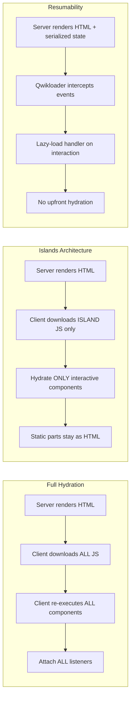

# [FEE-703] Hydration & Partial Hydration

:::info
This article covers hydration -- the process that makes server-rendered HTML interactive -- and the spectrum of strategies for reducing its cost: progressive hydration (the staged pattern, buildable in any framework), selective hydration (React's Suspense-driven form of it), Islands Architecture (Astro), and resumability (Qwik). Understanding these patterns is essential for closing the gap between First Contentful Paint and the moment the page actually responds to input.
:::

## Context

Server-Side Rendering (SSR) produces fully rendered HTML that the browser can paint immediately, delivering fast FCP and strong SEO. But that HTML is inert: a server-rendered button does nothing until JavaScript attaches its click handler. The process of attaching event listeners and restoring application state to server-rendered markup is called **hydration**. Google's rendering guide reserves the related term *rehydration* for hydration that also keeps updating the DOM with later state changes; much of the ecosystem uses the two words loosely as synonyms.

Hydration is the bridge between "looks interactive" and "is interactive." During hydration, the framework must:

1. **Download** the JavaScript bundle containing component logic.
2. **Execute** component code to rebuild the virtual DOM or component tree.
3. **Attach** event listeners to existing DOM nodes.
4. **Restore** application state so the client-side representation matches the server output.

Until hydration completes, the page is in an **uncanny valley** -- it appears ready but does not respond to user input. This gap between FCP (content visible) and TTI (content interactive) is the **hydration gap**, and it grows linearly with page complexity and JavaScript bundle size.

### The cost of full hydration

In traditional full hydration (the default in React, Vue, and Angular SSR), the framework re-executes every component on the client, even components that are entirely static and will never change. For a page with a static header, footer, sidebar, and a single interactive widget, full hydration downloads and executes JavaScript for all of them -- paying a tax proportional to the entire page, not just the interactive parts.

This cost manifests in several ways:

- **Bundle size:** All component code must be downloaded, even for static content.
- **CPU time:** The framework walks the entire component tree, diffing the virtual DOM against the server-rendered HTML.
- **TTI delay:** The page cannot respond to interactions until hydration finishes. On mobile devices with slower CPUs, this delay can be several seconds.
- **Main thread blocking:** Hydration is traditionally synchronous, blocking the main thread and preventing the browser from responding to user input.

### The spectrum of solutions

The industry has developed four main approaches to reducing hydration cost, each making a different tradeoff:

| Strategy | Approach | JS shipped | Hydration work |
|----------|----------|-----------|----------------|
| Full hydration | Hydrate everything | All components | Entire page |
| Progressive hydration | Hydrate in stages | All components (deferred) | Entire page, chunked |
| Partial hydration (Islands) | Hydrate only interactive parts | Only island components | Only islands |
| Resumability | Skip hydration entirely | Only on interaction | None upfront |

Only resumability is tied to a specific framework -- it needs one built from the ground up to serialize listeners and state into HTML, which is Qwik's whole design. The hydration strategies are portable. This article uses React for the streaming example because its Suspense-driven **selective hydration** is the most thoroughly documented implementation -- the framework-managed form of progressive hydration, where `<Suspense>` boundaries define the stages and user input reorders them on the fly. Vue 3.5+ ships the same capability as lazy hydration strategies (`hydrateOnVisible()`, `hydrateOnIdle()`), Astro islands host components from any framework, and the staged pattern can be hand-built in vanilla JavaScript with `IntersectionObserver` plus a dynamic `import()`.

## Design Thinking

### Why hydration exists: the SSR-to-interactive gap

The web platform delivers HTML as a document, not as an application. When a server sends HTML, the browser can render it immediately -- but that rendering is passive. Interactive behavior requires JavaScript. SSR gives users fast visual feedback (FCP), but the application is not truly ready until JavaScript has loaded and connected to the DOM. Hydration is the mechanism that bridges this fundamental gap between document rendering and application behavior.

The alternative -- waiting for JavaScript to render everything on the client (CSR) -- means the user sees nothing until the entire bundle loads and executes. SSR with hydration is a pragmatic compromise: show content early, add interactivity later. Every SSR application therefore has to decide how much to hydrate, and when.

### The hydration gap: TTI minus FCP

The hydration gap (TTI - FCP) is the window during which users can see content but cannot interact with it. During this window:

- Clicks on buttons are lost or queued.
- Form submissions do nothing.
- Scroll-triggered animations do not fire.

Users perceive this as a broken page. The longer the gap, the worse the user experience. For content-heavy pages with minimal interactivity, the gap is pure waste -- the framework is hydrating components that will never receive user interaction.

### Islands as a paradigm shift: static by default, hydrate only what is interactive

Islands Architecture -- popularized by Astro, a content-focused web framework that renders pages to plain HTML by default -- inverts the default assumption. Instead of "hydrate everything, opt out of what you don't need," it starts from "hydrate nothing, opt in to what you do need." Every component is static by default. Only components explicitly marked with a hydration directive (like `client:load` or `client:visible`) receive JavaScript.

This is a paradigm shift because it changes the scaling behavior of JavaScript cost. In full hydration, JS cost scales with total page size. In Islands, JS cost scales with interactive surface area. A documentation page with one search box and one theme toggle ships JavaScript only for those two components, regardless of how many paragraphs, code blocks, and navigation links surround them.

Each island is independent -- it hydrates in isolation, has its own framework instance, and does not share state with other islands through the framework. This isolation enables islands to use different frameworks on the same page and to hydrate on different schedules (on load, on idle, on visible, on media query match).

### Resumability: no hydration at all -- serialize state and handlers in HTML

Qwik takes the most radical approach: eliminate hydration entirely. Instead of re-executing components on the client to discover event listeners and rebuild state, Qwik serializes all three pieces of information (listeners, component tree, application state) directly into the HTML during server rendering.

When the page loads in the browser, a tiny global event listener (the Qwikloader, under 1 KB) intercepts user interactions and lazy-loads only the specific handler code needed for that interaction. No component code runs until the user actually interacts. The application "resumes" from where the server left off, rather than "replaying" from scratch.

This means:

- **Zero JavaScript executes on page load** (aside from the Qwikloader).
- **TTI equals FCP** -- the page is interactive the instant it is visible.
- **JavaScript cost scales with user interaction**, not page complexity.

The tradeoff is a larger HTML payload (serialized state adds bytes) and a small latency on the very first interaction (the handler must be fetched and executed). For most applications, this latency is imperceptible because the handler chunk is small and can be prefetched.

## Best Practices

**Avoid hydration mismatches -- server and client must render identical output.** MUST ensure the initial render produces the same HTML on both server and client. Any non-deterministic value used during render -- `Date.now()`, `Math.random()`, locale-dependent formatting, or browser-only APIs like `window` and `localStorage` -- will differ between server and client. A text or structure mismatch makes React discard the server-rendered DOM up to the nearest `<Suspense>` boundary and re-render that portion on the client (the entire root, if no boundary exists); attribute-only mismatches are warned about in development and left unpatched. SHOULD isolate browser-only logic inside `useEffect` (React) or `onMounted` (Vue) so it runs only after hydration completes.

**Let independent sections hydrate independently.** SHOULD wrap independent page sections in `<Suspense>` boundaries (React 18+, where this is called selective hydration) so each section hydrates as a separate unit. A single root without Suspense boundaries forces the entire page to hydrate as a monolith, blocking the main thread until all components have processed. Prioritize hydration for components that the user is most likely to interact with first; defer less critical sections to background hydration passes.

**Defer hydration for below-the-fold content.** SHOULD NOT pay the JavaScript download and execution cost for components that are not visible on initial load. Use `client:visible` (Astro), `React.lazy` combined with Intersection Observer, or `defineAsyncComponent` with the `hydrateOnVisible()` strategy (Vue 3.5+) to defer the work until the component approaches the viewport. This narrows the hydration gap (TTI minus FCP) and reduces the main-thread blocking that causes poor INP scores on content-heavy pages.

## Visual

### Hydration Timeline: Full vs Selective vs Islands vs Resumable

```mermaid
gantt
    title Hydration Strategy Timeline Comparison
    dateFormat X
    axisFormat %s

    section Full Hydration
    TTFB + FCP (HTML painted)  :done, fh_fcp, 0, 2
    Download all JS            :active, fh_dl, 2, 5
    Hydrate entire page        :crit, fh_hyd, 5, 8
    TTI (interactive)          :milestone, fh_tti, 8, 8

    section Selective (React Suspense)
    TTFB + FCP (HTML painted)  :done, ph_fcp, 0, 2
    Download JS chunks         :active, ph_dl, 2, 4
    Hydrate critical section   :crit, ph_hyd1, 4, 5
    Hydrate remaining sections :ph_hyd2, 5, 7
    TTI (critical interactive) :milestone, ph_tti, 5, 5

    section Islands (Astro)
    TTFB + FCP (HTML painted)  :done, is_fcp, 0, 2
    Download island JS only    :active, is_dl, 2, 3
    Hydrate islands            :crit, is_hyd, 3, 4
    TTI (islands interactive)  :milestone, is_tti, 4, 4

    section Resumable (Qwik)
    TTFB + FCP (HTML painted)  :done, re_fcp, 0, 2
    TTI (instant, no hydration):milestone, re_tti, 2, 2
    JS loads on interaction    :active, re_int, 4, 5
```



### Architecture Comparison



## Example

### 1. React 18 Selective Hydration with Suspense

React 18 uses `<Suspense>` boundaries to break the page into independently hydrating chunks. The framework streams HTML for each boundary and hydrates them separately. If the user clicks a component that has not yet hydrated, React prioritizes hydrating that boundary first.

```tsx
// src/ProductPage.tsx -- selective hydration via Suspense boundaries
// (plain React 18 streaming SSR; meta-framework routers add their own layers)
import { Suspense, lazy } from 'react';

// Heavy components are code-split and hydrate independently
const ProductReviews = lazy(() => import('./ProductReviews'));
const RecommendationEngine = lazy(() => import('./RecommendationEngine'));

// Static content -- hydrates as part of the main chunk
function ProductDetails({ product }: { product: Product }) {
  return (
    <section>
      <h1>{product.name}</h1>
      <p>{product.description}</p>
      <p>Price: ${product.price}</p>
    </section>
  );
}

export default function ProductPage({ product }: { product: Product }) {
  return (
    <main>
      {/* This section hydrates first -- critical for interaction */}
      <ProductDetails product={product} />

      {/* This section hydrates independently -- not blocking above */}
      <Suspense fallback={<p>Loading reviews...</p>}>
        <ProductReviews productId={product.id} />
      </Suspense>

      {/* This section hydrates last -- lowest priority */}
      <Suspense fallback={<p>Loading recommendations...</p>}>
        <RecommendationEngine userId={product.userId} />
      </Suspense>
    </main>
  );
}
```

**How it works:**

- The server streams HTML for each `<Suspense>` boundary as its data resolves.
- The client hydrates each boundary independently as its JavaScript chunk arrives.
- If the user clicks on a `ProductReviews` button before it has hydrated -- and its JavaScript chunk has already arrived -- React synchronously hydrates that boundary during the capture phase of the click, so the same click lands on the freshly attached listener. If the chunk has not arrived, the click is dropped: React 18 does not queue and replay discrete events like clicks (it only rebroadcasts continuous events such as `mouseover` after hydration). The remaining boundaries continue hydrating in the background.
- The critical `ProductDetails` section is interactive first; lower-priority sections hydrate progressively.

### 2. Astro Islands with `client:*` Directives

Astro renders every component to static HTML by default. Only components with a `client:*` directive receive JavaScript and become interactive.

```astro
---
// src/pages/index.astro
// These components can be from ANY framework: React, Vue, Svelte, etc.
import Header from '../components/Header.astro';       // Static -- no JS
import HeroSection from '../components/Hero.astro';     // Static -- no JS
import SearchBar from '../components/SearchBar.tsx';     // Interactive island
import Newsletter from '../components/Newsletter.vue';  // Interactive island
import Footer from '../components/Footer.astro';        // Static -- no JS
---

<html>
  <body>
    <!-- Static: rendered to HTML, zero JavaScript -->
    <Header />
    <HeroSection />

    <!-- Island: hydrates immediately on page load -->
    <SearchBar client:load />

    <!-- Main content: static HTML, no hydration needed -->
    <article>
      <h2>Welcome to our site</h2>
      <p>This is static content. No JavaScript needed.</p>
      <!-- Hundreds of lines of static content... -->
    </article>

    <!-- Island: hydrates when scrolled into viewport -->
    <Newsletter client:visible />

    <!-- Static: rendered to HTML, zero JavaScript -->
    <Footer />
  </body>
</html>
```

**Astro client directives reference:**

| Directive | When it hydrates | Use case |
|-----------|-----------------|----------|
| `client:load` | Immediately on page load | Critical interactive components (search, nav) |
| `client:idle` | When browser becomes idle | Non-critical but soon-needed (analytics, chat widget) |
| `client:visible` | When component enters viewport | Below-the-fold content (newsletter, comments) |
| `client:media` | When CSS media query matches | Mobile-only or desktop-only components |
| `client:only="react"` | Client-side only, no SSR (the framework value is required) | Components that cannot run on the server |

**Result:** A page with 50 components but only 2 islands ships JavaScript for 2 components. The other 48 are pure HTML with zero runtime cost.

### 3. Qwik Resumability

Qwik serializes event listeners, component boundaries, and application state directly into the HTML. No hydration step runs on the client.

```tsx
// Qwik component -- event handler is serialized, not downloaded upfront
import { component$, useSignal } from '@builder.io/qwik';

export const Counter = component$(() => {
  const count = useSignal(0);

  return (
    <div>
      <p>Count: {count.value}</p>
      {/* The onClick$ handler is NOT in the initial JS bundle.
          It is serialized as a reference in the HTML.
          The actual handler code loads only when the user clicks. */}
      <button onClick$={() => count.value++}>
        Increment
      </button>
    </div>
  );
});
```

**What the server-rendered HTML looks like (simplified):**

```html
<div>
  <p>Count: 0</p>
  <!-- Event listener serialized as an attribute -->
  <button on:click="chunk-abc.js#Counter_onClick">
    Increment
  </button>
</div>
<!-- Serialized state embedded in the page -->
<script type="qwik/json">
  {"ctx": {"#1": {"count": 0}}}
</script>
<!-- Qwikloader: ~1KB global event listener -->
<script>/* Qwikloader */</script>
```

**How it works:**

1. The server renders HTML and serializes component state, event handler references, and the component tree as HTML attributes and inline JSON.
2. The Qwikloader (under 1 KB) registers a global event listener on the document.
3. When the user clicks the button, the Qwikloader reads the `on:click` attribute, fetches `chunk-abc.js`, executes the handler, and updates the DOM.
4. No JavaScript runs until the user interacts. TTI equals FCP.

## Deep Dive

### What streaming looks like on the wire

The streaming that selective hydration depends on is ordinary HTTP, not a framework-private channel. The server responds with `Transfer-Encoding: chunked` (HTTP/1.1) or the equivalent framing in HTTP/2+, and flushes the shell -- everything outside `<Suspense>` boundaries, plus each boundary's fallback -- as soon as it is ready. When a boundary's data resolves, the server flushes another chunk: the boundary's real HTML inside a hidden container, followed by a small inline `<script>` that swaps it into the fallback's position.

In React the server API is `renderToPipeableStream` (Node streams) or `renderToReadableStream` (Web Streams). The browser side needs no special API, because browsers have always parsed and painted HTML as it arrives. Hydration order is then a client-side decision: each boundary hydrates when its JavaScript chunk arrives, and a user interaction promotes the touched boundary to the front of the queue.

### Hydration mismatch detection and the re-render penalty

When React hydrates a server-rendered page, it walks the existing DOM tree and the component tree in parallel, attaching event listeners and reconciling state. If it encounters a node where the server-rendered HTML does not match what the component would produce on the client, it registers a hydration mismatch. What happens next has changed materially across React versions.

**React 17 and earlier: silent patch-up.** React attempted to repair individual mismatched nodes in place -- in production, differing text content was silently patched to the client value, with no error. This kept the server HTML mostly intact, but it could leave subtle inconsistencies (a stale attribute surviving next to patched text) and gave production users no signal that anything was wrong.

**React 18: discard and client-render.** React 18 stopped patching. A text or structure mismatch is treated as a recoverable error: React throws away the server-rendered HTML up to the nearest `<Suspense>` boundary and re-renders that portion from scratch on the client -- the entire root, if no boundary exists. A Suspense boundary therefore also limits how much a mismatch can destroy. Attribute-only differences are the exception: React warns about them in development and leaves them unpatched rather than discarding anything.

**React 19: one error, with a diff.** React 19 consolidated the per-node warnings into a single error that prints a diff of the server and client output, so the offending value is visible directly instead of requiring manual bisection.

**Why this matters for performance.** A mismatch in a component outside any Suspense boundary (for example, a layout that reads `localStorage` during render) throws away the entire page's server HTML, and the browser must paint from client-rendered output instead. This turns SSR into CSR at runtime for that page: the TTFB and FCP benefit of server rendering is lost, and the user may see a flash or a content shift as the client output replaces the server output.

**The `suppressHydrationWarning` escape hatch.** React provides `suppressHydrationWarning={true}` on an element to silence the warning and skip reconciliation for that element's text content. This is intended only for values that are intentionally different (such as a server timestamp), not as a general way to silence mismatch errors. It only applies one level deep and does not extend to child elements.

**Practical detection strategy.** In development, React 19's diff error shows exactly which value differed. Ensure every value used during the initial render reaches server and client identically -- inject configuration through serialized props or a data script rather than reading environment state ad hoc on each side. For values that must differ (client-generated IDs, browser-detected features), use the two-pass pattern: render a stable placeholder on the first pass, then update with the client-specific value inside `useEffect` after hydration completes.

## Common Mistakes

### 1. Hydration mismatch: server and client HTML differs

When the server-rendered HTML does not match what the client-side JavaScript produces during hydration, the framework throws hydration mismatch errors. In React 18+, a text or structure mismatch discards the server-rendered DOM up to the nearest `<Suspense>` boundary and re-renders that portion on the client, forfeiting SSR's benefit for that part of the page. Common causes:

- Using `Date.now()`, `Math.random()`, or locale-dependent formatting during render.
- Accessing browser-only APIs (`window`, `localStorage`, `navigator`) during the initial render.
- Conditional rendering based on authentication state that differs between server and client.

**Fix:** Isolate browser-only logic in `useEffect` (React) or `onMounted` (Vue). Ensure the initial render produces identical output on both server and client.

### 2. Hydrating everything when Islands would suffice

Many pages are predominantly static content with a few interactive widgets. Wrapping the entire page in a full-hydration framework forces the browser to download and execute JavaScript for content that will never change. If your page is 90% static and 10% interactive, consider Astro Islands or a similar partial hydration approach that ships JavaScript only for the interactive components.

**Symptom:** Large JS bundles on content-heavy pages, high TTI despite fast FCP, poor Lighthouse scores on pages that "look simple."

### 3. Not using Suspense boundaries for selective hydration

In React 18+, wrapping the entire application in a single root without Suspense boundaries means the entire page hydrates as a monolith -- none of the sections are interactive until the slowest chunk finishes hydrating. Adding `<Suspense>` boundaries around independent sections allows React to hydrate each in its own pass, yielding to the browser for input between passes.

**Fix:** Identify independent page sections (comments, recommendations, sidebars) and wrap each in a `<Suspense>` boundary. Pair with `lazy()` for code-splitting so each section's JavaScript chunk loads independently.

### 4. Third-party scripts blocking hydration

Third-party scripts (analytics, ads, chat widgets) that load synchronously compete with framework hydration for main thread time. A synchronous analytics script can delay hydration by hundreds of milliseconds, extending the hydration gap.

**Fix:** Load third-party scripts with `async` or `defer`. Use `requestIdleCallback` or the `client:idle` directive (in Astro) for non-critical scripts. Consider moving heavy third-party integrations into Web Workers.

### 5. Assuming SSR alone solves TTI

SSR improves FCP and SEO, but it does not improve TTI by itself. In fact, SSR can make TTI worse than CSR if the hydration cost is high -- the user sees content sooner but waits longer for interactivity -- a frozen page. SSR is only half the solution; the hydration strategy determines whether that fast FCP translates into a page that responds when touched.

**Key insight:** TTI was deprecated and removed from Lighthouse in version 10 (2023), so the hydration gap survives as a reasoning tool rather than a dashboard number. Measure its symptoms: Total Blocking Time in the lab, Interaction to Next Paint in the field. If input during page load routinely waits on the main thread, the hydration strategy needs work.

## Related FEEs

| FEE | Relationship |
|-----|-------------|
| [FEE-700 Rendering & Performance Overview](./700.md) | Parent overview covering the browser rendering pipeline that processes hydrated content. |
| [FEE-701 Rendering Strategies: CSR, SSR, SSG & Streaming](./701.md) | Covers the rendering strategies that produce HTML for hydration. Streaming SSR (FEE-701) and progressive hydration (this article) are complementary -- streaming delivers HTML in chunks, progressive hydration activates those chunks incrementally. |
| [FEE-704 Core Web Vitals](./704.md) | The hydration gap directly impacts TTI and Interaction to Next Paint (INP). Islands and resumability are strategies for improving these Core Web Vitals metrics. |

## References

- [New Suspense SSR Architecture in React 18 -- React Working Group](https://github.com/reactwg/react-18/discussions/37) -- Dan Abramov's detailed explanation of streaming SSR, selective hydration, and Suspense integration in React 18
- [Selective Hydration -- patterns.dev](https://www.patterns.dev/react/react-selective-hydration/) -- Visual guide to React selective hydration with Suspense boundaries and event prioritization
- [Progressive Hydration -- patterns.dev](https://www.patterns.dev/react/progressive-hydration/) -- Explanation of progressive hydration patterns and implementation strategies
- [Islands Architecture -- Astro Docs](https://docs.astro.build/en/concepts/islands/) -- Official Astro documentation on Islands Architecture, client directives, and partial hydration
- [Islands Architecture -- patterns.dev](https://www.patterns.dev/vanilla/islands-architecture/) -- Framework-agnostic explanation of the Islands pattern with implementation considerations
- [Resumable -- Qwik Docs](https://qwik.dev/docs/concepts/resumable/) -- Official Qwik documentation on resumability, serialization format, and the Qwikloader
- [Resumability vs Hydration -- Builder.io](https://www.builder.io/blog/resumability-vs-hydration) -- Misko Hevery's comparison of the hydration and resumability models with performance analysis
- [Rendering on the Web -- web.dev](https://web.dev/articles/rendering-on-the-web) -- Google's comprehensive guide to rendering patterns including hydration and rehydration strategies
