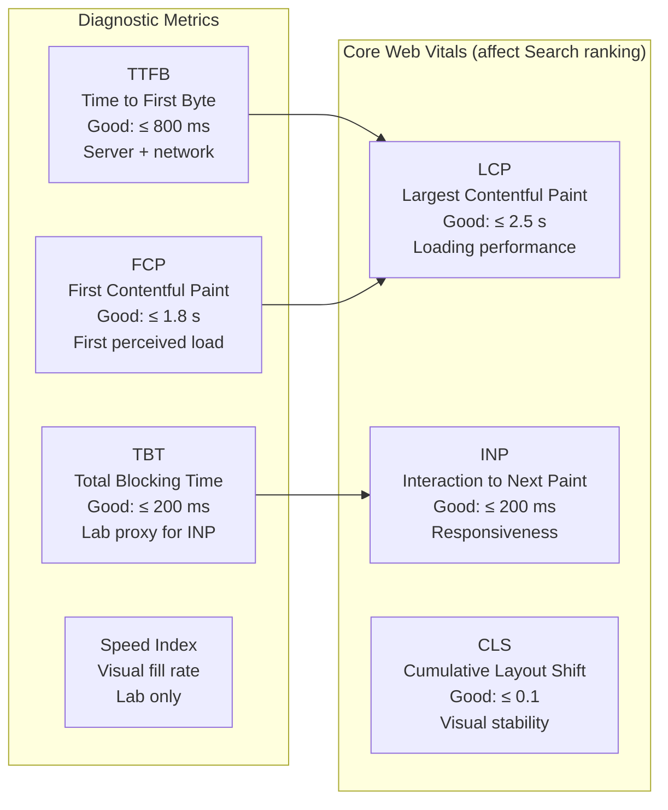

# [FEE-704] Core Web Vitals & Performance Metrics

:::info
This article covers the Core Web Vitals program: what LCP, INP, and CLS measure, why Google introduced them, and how to capture field data with CrUX and the web-vitals library. It also surveys the supporting metrics (TTFB, FCP, TBT, Speed Index) and explains how frameworks like Next.js optimize for each vital.
:::

## Context

For most of the web's history, performance was measured by technical milestones: DNS resolution time, TCP handshake duration, DOMContentLoaded, load event. These numbers are real, but they correlate poorly with what users actually feel. A page can fire its load event in under a second while still feeling slow because the largest image appeared late, the layout shifted while the user was reading, or a button click took 800 ms to respond.

Google introduced the **Web Vitals** program in 2020 to close this gap. Web Vitals are user-centric metrics designed to quantify three dimensions of experience that matter most: how fast content loads (LCP), how quickly the page responds to input (INP), and how stable the layout is (CLS). These three are the **Core Web Vitals** -- the subset Google considers universally important for all pages and that it uses as a signal in Search ranking.

The program also introduced a discipline around measurement: Core Web Vitals should be evaluated at the **75th percentile** of real-user sessions on a given origin. This means a site passes only if 75% of visitors experience a "good" score, not just the median or the average. It also makes a firm distinction between **lab data** (synthetic measurements from tools like Lighthouse running on controlled hardware) and **field data** (real user measurements collected from actual Chrome browsers via the Chrome User Experience Report, or CrUX). Lab data is useful for debugging; field data is the authoritative record of what users actually experience.

In March 2024, **Interaction to Next Paint (INP)** officially replaced **First Input Delay (FID)** as the responsiveness Core Web Vital. FID only captured the delay before the browser started handling the very first interaction on a page. INP captures the worst interaction latency observed throughout the entire session -- a far more complete picture of how a page behaves under real usage.

## Principle

- SHOULD measure Core Web Vitals using field data (CrUX or the web-vitals library) in production, not only in Lighthouse lab runs.
- SHOULD optimize the LCP image with `fetchpriority="high"` and, in Next.js, with the `priority` prop on `<Image>`.
- SHOULD set explicit `width` and `height` on all images and reserve space for dynamic content to prevent layout shift (CLS).
- SHOULD keep total blocking time (TBT) low by splitting long tasks and deferring non-critical JavaScript, which directly reduces INP.
- SHOULD use TTFB as the leading indicator for server and CDN performance; LCP cannot be good if TTFB is poor.
- SHOULD distinguish lab data (Lighthouse, DevTools) from field data (CrUX, web-vitals library) and treat them as complementary, not interchangeable.

## Design Thinking

### Why user-centric metrics instead of technical milestones

Traditional metrics like DOMContentLoaded or the `load` event fire at a specific moment in the browser's document lifecycle, not in response to what the user perceives. A page can satisfy DOMContentLoaded quickly while the viewport remains blank because the critical hero image is still loading. Conversely, a page can have a slow `load` event because it fetches data lazily after paint, while the user has already seen and interacted with the main content.

User-centric metrics ask a different question: "What did the user experience, and when?" LCP answers "when did the main content appear?" INP answers "how long did it take to respond to my interactions?" CLS answers "did anything jump around while I was looking at it?" Each maps to a concrete user frustration: waiting for content, feeling unresponsive, losing their place.

### The three Core Web Vitals

**Largest Contentful Paint (LCP)** measures how long it takes for the largest image, text block, or video in the initial viewport to become visible. Thresholds: good ≤ 2.5 s, needs improvement 2.5--4.0 s, poor > 4.0 s. The "largest" element is determined by rendered size in the viewport, not the size of the file. Common candidates are hero images, above-the-fold `<h1>` headings, and background images with `url()`.

LCP is dominated by four factors: server response time (TTFB), render-blocking resources (CSS and synchronous scripts), resource load time (image download), and client-side rendering overhead. The most impactful single optimization is to ensure the LCP image is discovered early in the HTML (not injected by JavaScript) and fetched with the highest browser priority using `fetchpriority="high"`.

**Interaction to Next Paint (INP)** measures page responsiveness across the full session. It observes every click, tap, and keypress from page load to unload, records the time from input start to the next frame paint, and reports the worst (or near-worst) value. Thresholds: good ≤ 200 ms, needs improvement 201--500 ms, poor > 500 ms. Unlike FID, which only measured the delay before the first event handler ran, INP measures the complete interaction duration including event handler execution time and the rendering work before the next frame. This makes it sensitive to expensive JavaScript on the main thread -- long tasks, large re-renders, and synchronous layout/style recalculations.

**Cumulative Layout Shift (CLS)** measures visual stability. A layout shift occurs whenever a visible element moves unexpectedly between frames. CLS is the sum of all layout shift scores throughout the page's lifespan, where each shift score is the product of the impact fraction (how much of the viewport moved) and the distance fraction (how far elements moved). Thresholds: good ≤ 0.1, needs improvement 0.1--0.25, poor > 0.25. The most common cause is images and iframes without explicit dimensions, fonts that swap to a different size, and dynamically injected banners or ads.

### Supporting metrics: the full picture

Beyond the three Core Web Vitals, several additional metrics give more granular diagnostic information:

- **Time to First Byte (TTFB)**: The time from the navigation request to the first byte of the HTML response. TTFB captures server processing time, CDN routing, and network round-trip. It is not a Core Web Vital, but it is a ceiling: if TTFB is 1.5 s, LCP cannot be below 1.5 s no matter how fast the client renders.
- **First Contentful Paint (FCP)**: The time at which the first pixel of content (text, image, SVG) is painted. FCP shows users that something is happening; it is a good proxy for perceived loading start. Thresholds: good ≤ 1.8 s, poor > 3.0 s.
- **Total Blocking Time (TBT)**: The sum of the "blocking portions" of all long tasks (tasks over 50 ms) between FCP and TTI. TBT is a lab-only metric and is strongly correlated with INP -- reducing TBT is the primary lever for improving INP in lab conditions.
- **Speed Index**: A lab metric (Lighthouse only) that measures how quickly content is visually populated during load, expressed in milliseconds. It captures the progression of visible completeness rather than a single milestone. Useful for comparing render strategies holistically.

### Lab data vs. field data: the critical distinction

Lab data comes from synthetic testing environments -- Lighthouse, WebPageTest, Chrome DevTools Performance panel -- running controlled test scenarios on fixed hardware and network conditions. Lab data is deterministic and reproducible, making it ideal for debugging and regression testing during development.

Field data comes from real users running Chrome on their own devices and network connections. It is collected by the browser and aggregated in CrUX. Field data captures the full diversity of user conditions: slow Android phones, congested mobile networks, users with many browser extensions, pages with large third-party scripts. Field data is the ground truth for Google Search ranking and for understanding what your actual users experience.

The two types of data are complementary. A developer might use Lighthouse to identify which resources are blocking LCP, then check CrUX to see if the fix actually improved field LCP scores for real users. The common mistake is to optimize Lighthouse scores (lab) and assume field data improved, or to see poor CrUX data and only look for fixes in lab tooling without understanding why real conditions differ.

### How frameworks optimize Core Web Vitals

**Next.js Image component (LCP + CLS):** The `<Image>` component from `next/image` automatically sets `width` and `height` attributes (preventing CLS), generates responsive `srcset` values, and lazy-loads images below the fold. For the LCP image, the `priority` prop disables lazy loading and injects a `<link rel="preload">` tag in the document head, ensuring the browser discovers and fetches the image before it encounters the `` tag during HTML parsing. This is equivalent to manually adding `fetchpriority="high"` and `<link rel="preload">` but is automated and less error-prone.

**Next.js font optimization (CLS):** The `next/font` package downloads and self-hosts Google Fonts at build time, inlines font-face declarations in the document head, and generates an optimized CSS `font-display` value that uses a size-adjusted fallback font. The size-adjusted fallback has metrics tuned to match the web font's line heights and character widths, minimizing the layout shift that occurs when the web font swaps in.

**React concurrent features (INP):** React 18's concurrent rendering allows the framework to interrupt and pause rendering work in response to user input. `startTransition` marks a state update as non-urgent, allowing React to yield the main thread to handle an interaction before completing the transition. `useDeferredValue` similarly defers expensive re-renders. These APIs prevent large re-renders (triggered by filters, search inputs, or navigation) from blocking the event loop and causing high INP scores.

**Preact Signals (INP):** In Preact, Signals bypass virtual DOM diffing for updates to signal values, writing directly to DOM nodes. This eliminates re-rendering of ancestor components and dramatically reduces the main thread work per interaction.

### The 75th percentile rule

Assessing CWV at the 75th percentile rather than the median is a deliberate design choice. The median represents the experience of the 50th percentile user -- average conditions. The 75th percentile captures users who are experiencing worse-than-average conditions: slower devices, congested networks, larger browser caches. By optimizing for the 75th percentile, the program pushes sites to handle the realistic diversity of their audience rather than optimizing for ideal conditions.

This also explains why Lighthouse scores alone are insufficient: Lighthouse simulates a single device and network condition. A site might score 95 in Lighthouse while 30% of real users on low-end Android phones experience poor LCP because the lab conditions do not represent their hardware.

## Visual

### Core Web Vitals in the Page Load Timeline

```mermaid
gantt
    title Page Load Timeline: Where Each Metric Is Captured
    dateFormat x
    axisFormat %Lms

    section Network & Server
    Navigation request sent       :done, nav, 0, 50
    TTFB (first byte received)    :milestone, ttfb, 400, 400
    HTML parsed                   :done, html, 400, 600

    section First Paint
    FCP (first content painted)   :milestone, fcp, 900, 900

    section Largest Content
    LCP image fetched             :active, lcpfetch, 600, 1800
    LCP (largest element painted) :milestone, lcp, 1800, 1800

    section Interactivity
    Long task (blocks input)      :crit, lt1, 1000, 1200
    User interaction #1           :active, int1, 1400, 1600
    INP candidate recorded        :milestone, inp1, 1600, 1600
    Long task (blocks input)      :crit, lt2, 2000, 2300
    User interaction #2           :active, int2, 2400, 2700
    INP candidate recorded        :milestone, inp2, 2700, 2700

    section Visual Stability
    Layout shift (image loads)    :crit, cls1, 800, 820
    Layout shift (font swap)      :crit, cls2, 1100, 1120
    CLS accumulates continuously  :active, cls, 800, 3000
```



### Metric Summary Table



## Example

### 1. Measuring Core Web Vitals in the field with the web-vitals library

The web-vitals library (~2 KB brotli) measures LCP, INP, CLS, FCP, and TTFB from real users using the same APIs Chrome uses to report to Google. Each callback fires when the metric value is finalized (or, for INP and CLS, when the page is hidden).

```javascript
// vitals.js -- instrument field measurement, send to your analytics endpoint
import { onCLS, onINP, onLCP, onFCP, onTTFB } from 'web-vitals';

function sendToAnalytics(metric) {
  // navigator.sendBeacon is reliable during page unload; fetch is not.
  const body = JSON.stringify({
    name: metric.name,      // 'LCP', 'INP', 'CLS', 'FCP', 'TTFB'
    value: metric.value,    // raw value in ms (or unitless for CLS)
    id: metric.id,          // unique ID for deduplication in analytics
    rating: metric.rating,  // 'good', 'needs-improvement', or 'poor'
    navigationType: metric.navigationType, // 'navigate', 'reload', 'back-forward'
  });
  navigator.sendBeacon('/api/analytics/vitals', body);
}

// Register all five metrics.
// Callbacks fire once the metric value is ready.
onLCP(sendToAnalytics);
onINP(sendToAnalytics);
onCLS(sendToAnalytics);
onFCP(sendToAnalytics);
onTTFB(sendToAnalytics);
```

**Important:** INP and CLS callbacks fire when the page is hidden (tab switch, navigate away), not during the session. The value at that point represents the worst-case interaction or total layout shift for the entire session.

### 2. Optimizing the LCP image

The LCP image is the single most impactful optimization target. The browser must discover the image URL early and fetch it with high priority.

```html
<!-- Plain HTML: preload + fetchpriority for the LCP image -->
<head>
  <!-- Preload tells the browser to start fetching before it parses the  tag -->
  <link
    rel="preload"
    as="image"
    href="/images/hero.webp"
    imagesrcset="/images/hero-400.webp 400w, /images/hero-800.webp 800w, /images/hero.webp 1200w"
    imagesizes="100vw"
  />
</head>
<body>
  <!-- fetchpriority="high" elevates this resource above other images -->
  <!-- Explicit width/height prevents CLS while the image loads -->
  
  <!-- All other images: lazy-load by default -->
  
</body>
```

```tsx
// Next.js: <Image priority> handles preload + fetchpriority automatically
import Image from 'next/image';

export default function Hero() {
  return (
    // priority prop:
    // - disables lazy loading
    // - injects <link rel="preload"> in <head>
    // - sets fetchpriority="high" on the 
    // width/height: required, prevents CLS
    <Image
      src="/images/hero.webp"
      width={1200}
      height={600}
      priority
      alt="Product hero shot"
    />
  );
}
```

### 3. Preventing CLS: images, fonts, and dynamic content

```html
<!-- Always set width + height. The browser uses aspect-ratio to reserve space. -->


<!-- Iframes: same rule -->
<iframe src="https://example.com/widget" width="560" height="315" title="Widget"></iframe>
```

```css
/* Reserve space for a dynamically injected banner (e.g. cookie consent) */
.banner-placeholder {
  /* Give the element a fixed min-height before content loads */
  min-height: 60px;
  /* Using CSS containment prevents layout recalculations from propagating */
  contain: layout;
}

/* Use CSS transform for animations -- does NOT trigger layout shift */
.slide-in {
  transform: translateY(-100%);
  transition: transform 300ms ease;
}
.slide-in.visible {
  transform: translateY(0);
}
/* Avoid animating top, left, height, width -- these DO trigger layout shift */
```

```javascript
// Next.js font optimization: self-hosted, size-adjusted fallback, no CLS
// app/layout.tsx
import { Inter } from 'next/font/google';

// next/font downloads Inter at build time, generates size-adjusted fallback,
// inlines font-face in the document head, and sets font-display: swap
// with fallback metrics tuned to minimize CLS on font swap.
const inter = Inter({
  subsets: ['latin'],
  display: 'swap',
});

export default function RootLayout({ children }) {
  return (
    <html lang="en" className={inter.className}>
      <body>{children}</body>
    </html>
  );
}
```

### 4. Improving INP with React startTransition

```tsx
// SearchPage.tsx -- prevent expensive filtering from blocking user input
import { useState, startTransition, useDeferredValue } from 'react';

function SearchPage({ items }: { items: Item[] }) {
  const [query, setQuery] = useState('');
  // useDeferredValue defers re-rendering the filtered list while the user types.
  // The input itself updates immediately (low-latency feedback);
  // the list re-renders in a deferred, interruptible pass.
  const deferredQuery = useDeferredValue(query);

  const handleChange = (e: React.ChangeEvent<HTMLInputElement>) => {
    // Direct state update: urgent, runs synchronously
    setQuery(e.target.value);

    // If you had a separate expensive state update, mark it as a transition:
    // startTransition(() => setFilteredResults(compute(e.target.value)));
  };

  // Expensive filter: runs on deferredQuery, not query
  // This means typing does not block the main thread waiting for this to finish.
  const filtered = items.filter(item =>
    item.name.toLowerCase().includes(deferredQuery.toLowerCase())
  );

  return (
    <div>
      <input value={query} onChange={handleChange} placeholder="Search..." />
      <ResultList items={filtered} />
    </div>
  );
}
```

### 5. Querying field data with CrUX API

CrUX provides real-user data aggregated from Chrome browsers. The CrUX API gives programmatic access to origin-level and URL-level field data without needing a Google Search Console account.

```javascript
// Fetch CrUX data for an origin (no API key required for public origins)
async function getCruxData(origin) {
  const response = await fetch(
    'https://chromeuxreport.googleapis.com/v1/records:queryRecord' +
    '?key=YOUR_API_KEY',
    {
      method: 'POST',
      headers: { 'Content-Type': 'application/json' },
      body: JSON.stringify({
        origin,
        metrics: ['largest_contentful_paint', 'interaction_to_next_paint', 'cumulative_layout_shift'],
      }),
    }
  );
  const data = await response.json();
  const metrics = data.record.metrics;

  // p75 values are what Google uses for Search ranking assessment
  console.log('LCP p75:', metrics.largest_contentful_paint.percentiles.p75, 'ms');
  console.log('INP p75:', metrics.interaction_to_next_paint.percentiles.p75, 'ms');
  console.log('CLS p75:', metrics.cumulative_layout_shift.percentiles.p75);
}

getCruxData('https://example.com');
```

## Common Mistakes

- **Optimizing only for Lighthouse, ignoring CrUX.** Lighthouse runs on a simulated mid-tier device and throttled network. A site can score 95 in Lighthouse while real users on low-end Android phones experience poor LCP. Always verify improvements in CrUX field data after deploying fixes.

- **Not marking the LCP image as high priority.** If the LCP candidate is an `` without `fetchpriority="high"`, or is injected by JavaScript rather than present in the HTML, the browser will discover and fetch it late -- after scripts, stylesheets, and other images already in the queue. This is the single most common LCP regression.

- **Images and iframes without explicit dimensions.** When the browser does not know the dimensions of an image before it loads, it allocates no space. When the image loads and the browser lays it out, all surrounding content shifts down. Setting `width` and `height` (or `aspect-ratio` in CSS) lets the browser reserve space and eliminates the shift.

- **Injecting banner or ad content into the DOM after initial render.** Banners, cookie consent dialogs, and ad slots inserted after paint push existing content down, generating large CLS scores. Reserve space with a `min-height` placeholder before the content loads, or use CSS `position: fixed` for overlays that do not shift the document flow.

- **Treating INP as a "first interaction" metric (confusing it with FID).** FID measured the input delay of the first interaction only. INP observes every interaction and reports the worst-case value. A page that responds well to the first click but has a slow interaction triggered by a complex dropdown or real-time filter will have poor INP even if FID was good.

- **Long tasks on the main thread.** Any JavaScript that runs for more than 50 ms without yielding blocks input handling and raises TBT and INP. Use `scheduler.yield()`, `setTimeout(..., 0)`, or `requestIdleCallback` to break long tasks into chunks that give the browser opportunities to process pending interactions.

- **Confusing Speed Index with a Core Web Vital.** Speed Index is a Lighthouse-only lab metric. It does not appear in CrUX, is not used by Google Search ranking, and cannot be measured from real users. It is a useful diagnostic tool but should not be the primary optimization target.

- **Ignoring TTFB.** LCP cannot be fast if TTFB is slow. Sites with TTFB above 600 ms should investigate server-side caching, CDN edge caching, and database query performance before optimizing client-side rendering.

## Related FEEs

| FEE | Relationship |
|-----|-------------|
| [FEE-700 Rendering & Performance Overview](./700.md) | Parent overview covering the browser rendering pipeline. Core Web Vitals are the measurement layer on top of that pipeline. |
| [FEE-706 Image Optimization](./706.md) | Deep dive on image formats, responsive images, and `fetchpriority`. LCP is almost always an image optimization problem. |
| [FEE-705 Code Splitting & Lazy Loading](./705.md) | Code splitting reduces TBT and improves INP by keeping main-thread long tasks shorter. Lazy loading below-the-fold resources removes competition for bandwidth with the LCP image. |

## References

- [Web Vitals -- web.dev](https://web.dev/articles/vitals) -- Google's authoritative overview of the Web Vitals program, CWV thresholds, and 75th percentile assessment methodology
- [Interaction to Next Paint (INP) -- web.dev](https://web.dev/articles/inp) -- Official INP documentation covering measurement methodology, thresholds, and the transition from FID (March 2024)
- [Largest Contentful Paint (LCP) -- web.dev](https://web.dev/articles/lcp) -- Official LCP documentation covering eligible elements, bottleneck categories, and measurement APIs
- [Cumulative Layout Shift (CLS) -- web.dev](https://web.dev/articles/cls) -- Official CLS documentation covering layout shift score calculation, common causes, and prevention techniques
- [Chrome User Experience Report (CrUX) -- Chrome for Developers](https://developer.chrome.com/docs/crux) -- CrUX documentation covering field data collection, access methods (BigQuery, PageSpeed Insights, CrUX API, CrUX History API)
- [web-vitals JavaScript library -- GitHub](https://github.com/GoogleChrome/web-vitals) -- Source and API documentation for the web-vitals npm package (onLCP, onINP, onCLS, onFCP, onTTFB)
- [Optimize LCP -- web.dev](https://web.dev/articles/optimize-lcp) -- Comprehensive LCP optimization guide covering TTFB, render-blocking resources, resource load time, and fetchpriority
