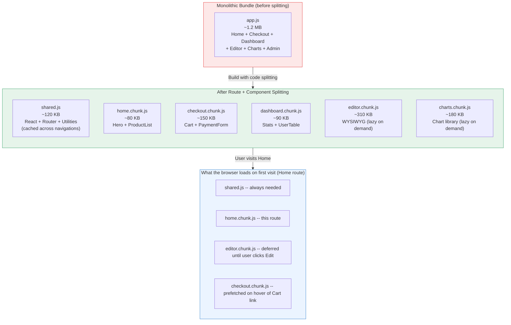
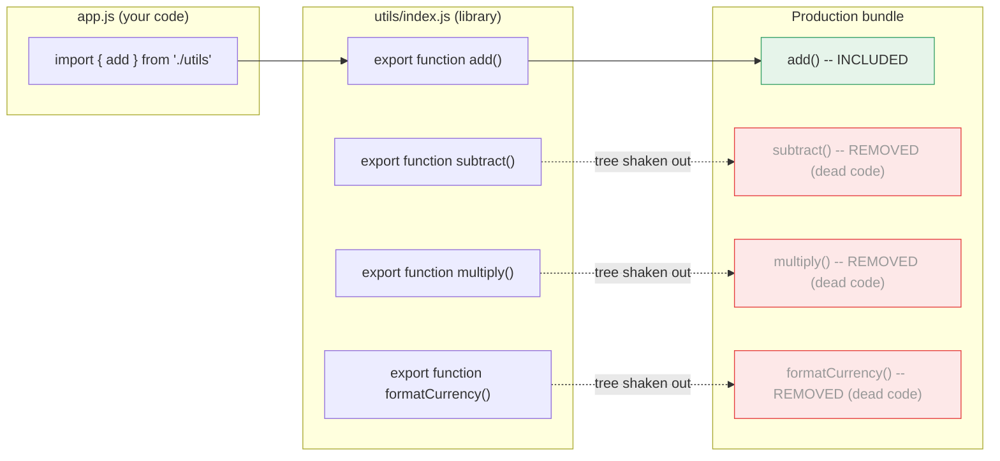

# [FEE-705] Code Splitting, Lazy Loading & Tree Shaking

:::info
This article covers three complementary techniques for reducing the JavaScript cost of a web application: code splitting (delivering only the code a route or component needs), lazy loading (deferring off-screen resources until they are needed), and tree shaking (eliminating dead code at build time). Together they target three phases that block interactivity before a user can do anything: download time, parse time, and execution time.
:::

## Context

Every byte of JavaScript a browser downloads must be parsed and compiled before it can execute. A 500 KB monolithic bundle costs more than download time. It also occupies the browser's main thread during parse and execution, which directly delays Time to Interactive (TTI) and raises Total Blocking Time (TBT). That cost is not evenly distributed across devices: V8's analysis found Reddit's JavaScript taking 3-4x longer to execute on a median phone (Moto G4) than on a high-end device (Pixel 3), and over 6x longer on a low-end device, the sub-$100 Alcatel 1X (V8, "The Cost of JavaScript in 2019").

Before module bundlers, each script was a separate HTTP request, which added its own overhead: a TCP connection, HTTP headers, and head-of-line blocking. Bundlers solved this by concatenating every module into one file, a reasonable trade-off when applications were small. As SPAs grew to include routing, internationalization, rich components, and third-party integrations, the monolithic bundle became the liability: every visitor downloads code for every route on every visit, including routes they never open. The fix is to split the bundle into pieces and load each piece only when it is actually needed.

Code splitting, lazy loading, and tree shaking address this from three angles. Code splitting divides the application into chunks aligned with routes or components, so the initial load delivers only the code for the first screen. Lazy loading defers resources such as images, components, and routes until they enter the viewport or are requested by navigation. Tree shaking removes unreachable code at build time, so libraries contribute only the functions that are actually imported. Applied together on a large application, they typically remove the largest share of unnecessary JavaScript from the initial load, without changing any observable behavior.

The underlying primitive that made all three techniques mainstream is the ES Module system (ESM). Unlike CommonJS `require()`, ES `import` statements are static: the bundler knows at build time exactly what each module imports and exports. This static structure gives bundlers what they need to split code at module boundaries and to trace which exports are used, the prerequisite for both code splitting and tree shaking.

## Visual

### Monolithic Bundle vs. Split + Shared Chunks



### How Tree Shaking Works



## Example

### 1. Route-based splitting in Next.js App Router (automatic)

Next.js splits at the route segment level with no configuration required. Each file in `app/` is its own chunk.

```tsx
// app/page.tsx -- Home route chunk (loads immediately)
export default function HomePage() {
  return <main>Welcome</main>;
}

// app/dashboard/page.tsx -- Dashboard route chunk (loads only when user navigates here)
export default function DashboardPage() {
  return <main>Dashboard</main>;
}

// app/dashboard/layout.tsx -- Dashboard layout, included in the dashboard chunk
// Shared code (React itself, utilities used by both pages) goes into the shared chunk automatically.
export default function DashboardLayout({ children }: { children: React.ReactNode }) {
  return <section>{children}</section>;
}
```

Next.js `<Link>` prefetches the linked route's chunk when the link enters the viewport:

```tsx
import Link from 'next/link';

// When this Link scrolls into view, Next.js quietly fetches dashboard.chunk.js
// so the navigation feels instant when the user clicks.
export default function Nav() {
  return <Link href="/dashboard">Dashboard</Link>;
}
```

### 2. Route-level lazy loading in Angular (loadComponent)

Angular does not split by file-based routing convention the way Next.js or Nuxt do. Instead, the developer marks the split point directly in the router configuration:

```typescript
// app.routes.ts
import { Routes } from '@angular/router';
import { HomeComponent } from './home/home.component';

export const routes: Routes = [
  { path: '', component: HomeComponent }, // eager: always in the initial bundle
  {
    path: 'dashboard',
    loadComponent: () =>
      import('./dashboard/dashboard.component').then((m) => m.DashboardComponent),
  },
];
```

`loadChildren` applies the same pattern to an entire feature's route tree, for splitting at a coarser grain than a single component.

### 3. Component-level splitting with React.lazy + Suspense

Use this pattern for large components that are not visible on initial render: modals, rich editors, heavy data tables, chart panels.

```tsx
import { lazy, Suspense } from 'react';

// The import() call is the split point.
// Bundlers (webpack, Vite/Rollup) emit RichEditor as its own chunk.
// The chunk is only fetched the first time <RichEditor> is rendered.
const RichEditor = lazy(() => import('./RichEditor'));
const DataTable  = lazy(() => import('./DataTable'));

function ArticlePage() {
  return (
    <article>
      <h1>Edit Article</h1>

      {/* Suspense shows the fallback until all lazy children in this boundary resolve. */}
      {/* Wrap tightly -- a Suspense boundary that wraps the whole page delays everything. */}
      <Suspense fallback={<div className="skeleton" aria-busy="true">Loading editor...</div>}>
        <RichEditor />
      </Suspense>

      <Suspense fallback={<div className="skeleton" aria-busy="true">Loading table...</div>}>
        <DataTable />
      </Suspense>
    </article>
  );
}
```

### 4. Component-level splitting with Vue defineAsyncComponent

```vue
<script setup>
import { defineAsyncComponent } from 'vue'

// Basic: load the chunk when the component first renders
const RichEditor = defineAsyncComponent(() => import('./RichEditor.vue'))

// Advanced: with loading/error states and delay
const DataTable = defineAsyncComponent({
  loader: () => import('./DataTable.vue'),
  loadingComponent: LoadingSpinner,   // shown while the chunk fetches
  errorComponent: ErrorMessage,       // shown if the import rejects
  delay: 200,                         // wait 200ms before showing loadingComponent
  timeout: 10000,                     // reject if chunk takes more than 10s
})
</script>

<template>
  <!-- Vue Suspense works like React's: shows fallback until async deps resolve -->
  <Suspense>
    <template #default>
      <RichEditor />
    </template>
    <template #fallback>
      <div class="skeleton">Loading editor...</div>
    </template>
  </Suspense>
</template>
```

Vue's `<Suspense>`, used in the template above, is still an officially experimental feature. The Vue documentation states it is "not guaranteed to reach stable status" and that its API may change before it does (Vue.js documentation). Confirm the current status in the Suspense docs before relying on it in production.

### 5. Library-based splitting with dynamic import

```typescript
// Heavy dependency loaded only when the user triggers the action.
// The PDF library (~800 KB) is never part of the initial bundle.

async function handleExportPDF() {
  // The bundler sees this import() and emits pdfLib as a separate chunk.
  // The string must be a literal (not a variable) for the bundler to analyze it.
  const { jsPDF } = await import('jspdf');

  const doc = new jsPDF();
  doc.text('Hello world', 10, 10);
  doc.save('export.pdf');
}

// Wire to a button; the chunk is only fetched on first click
document.getElementById('export-btn')?.addEventListener('click', handleExportPDF);
```

Prefetch the chunk during idle time so the first click feels instant:

```typescript
// After the main content is interactive, speculatively fetch the PDF chunk
// so it is in the browser cache when the user clicks Export.
if ('requestIdleCallback' in window) {
  requestIdleCallback(() => {
    import('jspdf'); // bundler emits the chunk; browser caches it
  });
}
```

### 6. Tree shaking: sideEffects in package.json

For a utility library where all exports are pure functions:

```json
// package.json of your shared utilities package
{
  "name": "@company/utils",
  "version": "1.0.0",
  "main": "dist/index.cjs",
  "module": "dist/index.esm.js",
  "sideEffects": false
}
```

With `"sideEffects": false`, if a consumer imports only `add`:

```typescript
import { add } from '@company/utils';
```

The bundler will include only the `add` function and its dependencies. Every other export is eliminated. Without `"sideEffects": false`, the bundler must include the entire module to be safe.

For packages that have some files with side effects (e.g., a CSS import or a polyfill):

```json
{
  "sideEffects": ["./src/polyfills.js", "*.css"]
}
```

### 7. Intersection Observer-based lazy loading for below-fold components

When a component is reliably below the fold and does not need to be in the DOM until it is visible, combine `defineAsyncComponent` (Vue) or `React.lazy` with an Intersection Observer to defer even the chunk request until the user scrolls near it.

```typescript
// useIntersection.ts -- reusable hook
import { ref, onMounted, onUnmounted } from 'vue';

export function useIntersection(rootMargin = '200px') {
  const target = ref<HTMLElement | null>(null);
  const isVisible = ref(false);

  onMounted(() => {
    if (!target.value) return;
    const observer = new IntersectionObserver(
      ([entry]) => {
        if (entry.isIntersecting) {
          isVisible.value = true;
          observer.disconnect(); // load once, stop observing
        }
      },
      { rootMargin } // start loading 200px before the element enters the viewport
    );
    observer.observe(target.value);
  });

  onUnmounted(() => {
    // observer already disconnected after first intersection, but guard anyway
  });

  return { target, isVisible };
}
```

```vue
<!-- LandingPage.vue -->
<script setup>
import { defineAsyncComponent } from 'vue'
import { useIntersection } from './useIntersection'

const TestimonialsSection = defineAsyncComponent(() => import('./TestimonialsSection.vue'))
const { target, isVisible } = useIntersection('300px')
</script>

<template>
  <HeroSection />
  <FeaturesSection />

  <!-- Testimonials are far below the fold; defer chunk fetch until user scrolls near -->
  <div ref="target">
    <TestimonialsSection v-if="isVisible" />
    <div v-else class="placeholder" style="min-height: 400px" />
  </div>
</template>
```

## Best Practices

**Split at route boundaries first, then feature boundaries.** SHOULD apply route-based splitting before considering component-level splitting. Modern meta-frameworks (Next.js, Nuxt, SvelteKit, Angular) perform route splitting automatically or with a few lines of router configuration; this alone eliminates most unnecessary initial bundle weight on typical SPAs, since visitors stop downloading routes they never open. SHOULD apply component-level splitting only to demonstrably large components: verify the component's bundle contribution with a bundle analyzer before adding a split point. Each extra chunk adds a network round-trip, so do not split components under 20-30 KB.

**Use `React.lazy` + `Suspense` for component-level splitting.** MUST wrap lazy-loaded components in `<Suspense>` with a meaningful fallback (skeleton, spinner) so the UI degrades gracefully while the chunk fetches. SHOULD scope Suspense boundaries tightly around the lazy component rather than wrapping entire pages, so that each section can render independently as its chunk arrives. MUST NOT lazy-load components that are immediately visible on initial load: hero sections, primary navigation, and above-fold content SHOULD always be in the initial bundle. Vue's `defineAsyncComponent` plus `<Suspense>` provides the same capability, but Vue's `<Suspense>` remains an officially experimental feature whose API may change before it reaches stable status (Vue.js documentation); teams shipping it should watch the changelog across upgrades.

**Ensure tree shaking works with named exports and no side-effectful barrel files.** MUST use ES module `import`/`export` syntax throughout; CommonJS `require()` disables tree shaking at the module boundary. SHOULD set `"sideEffects": false` in `package.json` for any utility package where all exports are pure functions with no global side effects. AVOID barrel files (`index.js` that re-exports everything from a directory) in large libraries unless every re-exported module is genuinely side-effect free: barrel imports prevent the bundler from eliminating unused exports.

**Verify with bundle analyzer before and after optimization.** SHOULD run a bundle analyzer (`rollup-plugin-visualizer` for Vite, `webpack-bundle-analyzer` for webpack) on every optimization change to confirm that unused exports are eliminated and that no unintended code has been included. Tree shaking failure is silent: the bundle compiles successfully but ships more code than expected. MUST treat the analyzer output as the source of truth, not the import statements in source code.

## Design Thinking

### Why parse and compile time deserves less weight than it once did

As the Context section notes, JavaScript execution time varies sharply by device, and older performance guidance often treated parse and compile time as the primary cost to fight. V8's 2019 analysis of streaming compilation and bytecode caching found that download and CPU execution time, not parsing, are now the dominant costs on modern engines; parsing is "no longer as slow as we once thought" (V8, "The Cost of JavaScript in 2019"). Parse and compile time still scales with bytes shipped, though the device gap is smaller than execution's: web.dev found a 2-5x difference in parse/compile time between the fastest and average phones, and measured CNN's roughly 1 MB script taking about 4 seconds to parse and compile on an iPhone 8 versus about 13 seconds on a Moto G4 (web.dev, "JavaScript Start-up Optimization"). All three phases scale with the number of bytes shipped, so shipping fewer bytes lowers startup cost on any device.

### How frameworks automate route splitting

Modern meta-frameworks treat route splitting as a default, not an opt-in optimization.

**Next.js** (App Router) automatically creates a separate bundle for each file in the `app/` directory. Server Components are never sent to the client at all. Client Components are split per route segment. Shared code (utilities used by multiple routes) is extracted into a shared chunk by webpack's `SplitChunksPlugin`, which the developer never has to configure manually.

**Nuxt 3** auto-splits pages in the `pages/` directory and auto-imports components from `components/`. If a component is used in more than one page, Nuxt extracts it into a shared chunk automatically. The developer writes no bundler configuration.

**SvelteKit** uses Vite under the hood and splits at the route segment level. Each `+page.svelte` and its associated `+layout.svelte` become their own chunk. Code in `$lib` used by multiple routes is deduplicated into a shared chunk.

**Angular** takes an explicit rather than file-based approach: the developer marks each route's split point directly in the router configuration, via `loadComponent` or `loadChildren` (see the Angular example above). Nothing splits automatically from folder structure the way it does in the other three frameworks.

The practical effect is that application developers working in file-based-routing frameworks get route-level splitting for free, and Angular developers get it with one line of router configuration per route. The remaining opportunity, and risk, lies in component-level splitting.

### Tree shaking: dead code elimination via ESM

Tree shaking is the bundler's ability to remove exports that are never imported anywhere in the dependency graph. It is called tree shaking because the bundler conceptually "shakes" the module dependency tree and drops leaves (exports) that nothing is holding on to.

Tree shaking requires ESM for one fundamental reason: CommonJS `require()` is dynamic. A module can call `require(someVariable)` or conditionally require different modules at runtime, so the bundler cannot know at build time which exports will be used. ES `import` statements are static: they appear at the top level, the module specifier must be a string literal, and the imported names are fixed. This gives the bundler complete information to determine which exports are live and which are dead.

The `sideEffects` field in `package.json` is a critical signal. By default, bundlers assume that importing a module might run code with side effects, such as modifying globals or patching prototypes. If a module has side effects, the bundler cannot safely eliminate it even if none of its exports are used. Setting `"sideEffects": false` tells the bundler that all files in the package are pure: importing them does nothing except expose their exports. This unlocks aggressive elimination: if you import only `clamp` from a utility library, the bundler can drop the rest of the library's code entirely.

### The tension: too many splits create waterfall requests

Code splitting is not free. Each additional chunk requires the browser to make an additional network request. A chain of lazy chunks creates a waterfall: loading chunk A reveals a dependency on chunk B, which in turn depends on chunk C, producing three sequential round-trips before the user sees any content. This is especially painful on high-latency connections.

The mitigation is prefetching: fetching a chunk before the user explicitly requests it, using idle network time. The Example section above already shows both patterns in practice: a route prefetched on hover via `<Link>`, and a dynamically imported library prefetched via `requestIdleCallback`.

The heuristic is: use route splitting aggressively since it is almost always a win, use component splitting only for components a bundle analyzer confirms are large, and use prefetching to remove the perceived latency each split adds.

## Common Mistakes

- **Splitting too aggressively without prefetching.** Every additional chunk is a network round-trip. Splitting a 10 KB component into its own chunk without prefetching it produces a visible loading spinner for something that would have been imperceptible if left in the main bundle. Audit bundle sizes before splitting: a component under 20-30 KB rarely justifies its own chunk.

- **Using dynamic import with a variable path.** `import(path)` where `path` is a runtime variable cannot be analyzed statically. The bundler cannot know which file to put in which chunk; it may emit a huge catch-all chunk or fail to split at all. The module path inside `import()` must be a string literal.

- **Ignoring chunk waterfall dependencies.** If lazy chunk A imports lazy chunk B, loading A triggers a sequential fetch for B. Use bundle analysis to identify chains and either colocate the code or prefetch B when A starts loading.

## Related Topics

- [Rendering & Performance Overview](/en/Rendering and Performance/700)
- [ES Modules & Module Systems](/en/JavaScript Core and Runtime/307)
- [Core Web Vitals & Performance Metrics](/en/Rendering and Performance/704)
- [Build Tooling & Module Systems Overview](/en/Build Tooling and Module Systems/800)

## References

- V8 team (Addy Osmani), "The Cost of JavaScript in 2019," V8 Blog (2019). https://v8.dev/blog/cost-of-javascript-2019
- Addy Osmani, "JavaScript Start-up Optimization," web.dev (2017). https://web.dev/articles/optimizing-content-efficiency-javascript-startup-optimization
- webpack contributors, "Code Splitting," webpack documentation. https://webpack.js.org/guides/code-splitting/
- webpack contributors, "Tree Shaking," webpack documentation. https://webpack.js.org/guides/tree-shaking/
- Vercel, "Lazy Loading," Next.js documentation. https://nextjs.org/docs/app/guides/lazy-loading
- Angular team, "Route-level code-splitting," Angular documentation. https://angular.dev/guide/routing/loading-strategies
- Vue.js team, "Async Components," Vue.js documentation. https://vuejs.org/guide/components/async
- Vue.js team, "Suspense," Vue.js documentation. https://vuejs.org/guide/built-ins/suspense.html
- React team, "lazy," React documentation. https://react.dev/reference/react/lazy
- Átila Fassina, "Tree-Shaking: A Reference Guide," Smashing Magazine (2021). https://www.smashingmagazine.com/2021/05/tree-shaking-reference-guide/
