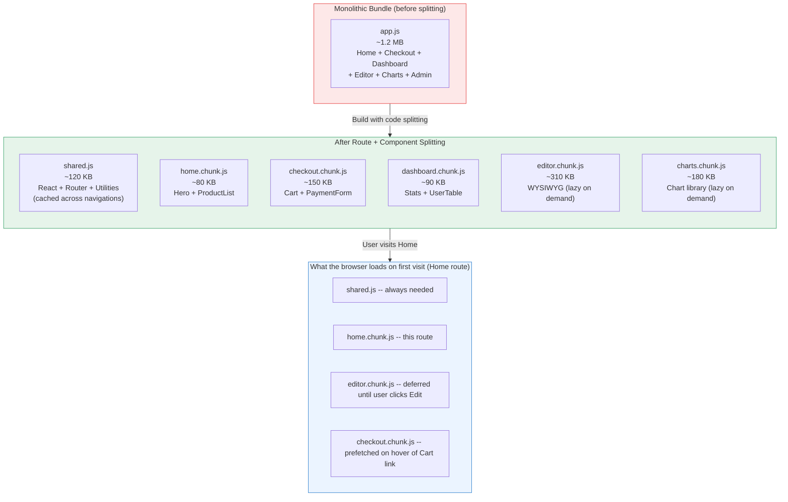
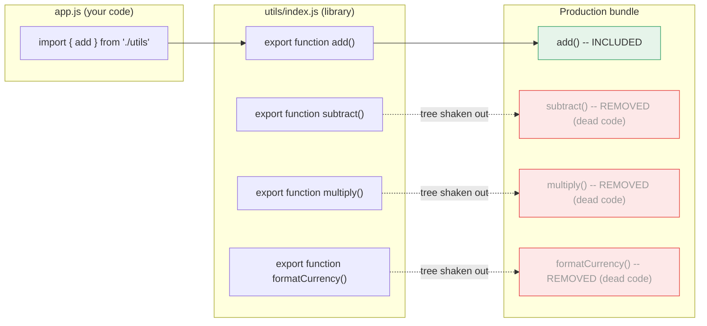

# [FEE-705] Code Splitting, Lazy Loading & Tree Shaking

:::info
This article covers three complementary techniques for reducing the JavaScript cost of a web application: code splitting (delivering only the code a route or component needs), lazy loading (deferring off-screen resources until they are needed), and tree shaking (eliminating dead code at build time). Together they target download time, parse time, and execution time -- the three phases that block interactivity before a user can do anything.
:::

## Context

Every byte of JavaScript a browser downloads must be parsed and compiled before it can execute. A 500 KB monolithic bundle does not just take time to download -- it also occupies the browser's main thread during parse and execution, directly delaying Time to Interactive (TTI) and raising Total Blocking Time (TBT). On a mid-tier Android device on a 4G connection, 1 MB of JavaScript can cost more than a second of blocking time even after the download completes.

The naive approach -- bundle everything into one file -- was reasonable when applications were small. As SPAs grew to include routing, internationalization, rich components, and third-party integrations, monolithic bundles became a primary performance liability. The solution is to split the bundle into pieces and load each piece only when it is actually needed.

Code splitting, lazy loading, and tree shaking address this from three angles. Code splitting divides the application into chunks aligned with routes or components, so the initial load delivers only the code for the first screen. Lazy loading defers resources -- images, components, routes -- until they enter the viewport or are requested by navigation. Tree shaking removes unreachable code at build time, so libraries contribute only the functions that are actually imported. Used together, they can reduce an initial bundle by 50--80% on large applications without changing any observable behavior.

The underlying primitive that made all three techniques mainstream is the ES Module system (ESM). Unlike CommonJS `require()`, ES `import` statements are static: the bundler knows at build time exactly what each module imports and exports. This static structure is what allows bundlers to split code at module boundaries and to trace which exports are used -- the prerequisite for both code splitting and tree shaking.

## Design Thinking

### Why bundle size matters beyond download time

The performance cost of JavaScript is three-fold and sequential: the browser must first download the bytes (network time), then parse and compile the source into bytecode (parse time), and finally execute that bytecode (execution time). All three phases happen before the first user interaction is possible.

Parse and compile time are often underestimated. A JavaScript engine processes roughly 1 MB/s of JavaScript on a high-end desktop, but on a low-end Android device this drops to 100--200 KB/s. A 1 MB bundle that downloads in 1 second may take an additional 3--5 seconds to parse on that device. This is why lighthouse's "Avoid enormous network payloads" and "Reduce JavaScript execution time" warnings flag bundle size even when network speed is not the bottleneck.

### Why bundlers split code: the monolithic problem

Before module bundlers, each script was a separate HTTP request, which introduced its own overhead (TCP connection, HTTP headers, head-of-line blocking). Bundlers solved this by concatenating all modules into one file. This was an improvement for small apps but created a new problem as apps grew: every user downloads code for every route on every visit, even routes they never navigate to.

A typical e-commerce SPA might include code for the product listing page, the checkout flow, the account dashboard, and the admin panel -- all downloaded by anonymous visitors who only ever see the product listing. Route-based code splitting fixes this by creating one chunk per route (or route group) and loading each chunk only when the user navigates to that route.

### How frameworks automate route splitting

Modern meta-frameworks treat route splitting as a default, not an opt-in optimization:

**Next.js** (App Router) automatically creates a separate bundle for each file in the `app/` directory. Server Components are never sent to the client at all. Client Components are split per route segment. Shared code (utilities used by multiple routes) is extracted into a shared chunk by webpack's `SplitChunksPlugin`, which the user never has to configure manually.

**Nuxt 3** auto-splits pages in the `pages/` directory and auto-imports components from `components/`. If a component is used in more than one page, Nuxt extracts it into a shared chunk automatically. The developer writes no bundler configuration.

**SvelteKit** uses Vite under the hood and splits at the route segment level. Each `+page.svelte` and its associated `+layout.svelte` become their own chunk. Code in `$lib` used by multiple routes is deduplicated into a shared chunk.

The practical effect is that application developers working in these frameworks get route-level splitting for free. The remaining opportunity -- and risk -- lies in component-level splitting.

### Component-based splitting: React.lazy and Vue defineAsyncComponent

Route splitting handles the coarsest level of granularity. Within a single route, there may be components that are expensive to render and are not immediately visible: a rich text editor, a data table, a chart library, a modal that only appears after a user action. These are candidates for component-level splitting.

In React, `React.lazy()` takes a function that returns a dynamic `import()` and produces a component that loads its chunk the first time it renders. `<Suspense>` wraps one or more lazy components and shows a fallback UI (spinner, skeleton) until all of them resolve.

In Vue 3, `defineAsyncComponent()` serves the same role. It accepts a loader function (a dynamic import) and optionally a loading component, error component, delay before showing the loading state, and timeout. Vue's `<Suspense>` can wrap async components in the same way as React's.

### Library-based splitting with dynamic import

Even without a framework, any dynamic `import()` call creates a split point. A charting library loaded only when the user opens a "Reports" tab, a PDF renderer loaded only on a print action, a WYSIWYG editor loaded only when an edit mode is entered -- these are all cases where `import()` defers a large dependency until it is actually needed.

The browser executes the dynamic import asynchronously: it returns a Promise that resolves to the module's exports. Bundlers analyze `import()` calls statically (the string inside must be a literal, not a variable, for the bundler to know the chunk boundary at build time) and emit a separate chunk for the target module and its dependencies.

### Tree shaking: dead code elimination via ESM

Tree shaking is the bundler's ability to remove exports that are never imported anywhere in the dependency graph. It is called tree shaking because the bundler conceptually "shakes" the module dependency tree and drops leaves (exports) that nothing is holding on to.

Tree shaking requires ESM for one fundamental reason: CommonJS `require()` is dynamic. A module can call `require(someVariable)` or conditionally require different modules at runtime. The bundler cannot know at build time which exports will be used. ES `import` statements are static: they appear at the top level, the module specifier must be a string literal, and the imported names are fixed. This gives the bundler complete information to determine which exports are live and which are dead.

The `sideEffects` field in `package.json` is a critical signal. By default, bundlers assume that importing a module might have side effects (modifying globals, registering polyfills, patching prototypes). If a module has side effects, the bundler cannot safely eliminate it even if none of its exports are used. Setting `"sideEffects": false` tells the bundler that all files in the package are pure -- importing them does nothing except expose their exports. This unlocks aggressive elimination: if you import only `clamp` from a utility library, the bundler can drop the rest of the library's code entirely.

### The tension: too many splits create waterfall requests

Code splitting is not free. Each additional chunk requires the browser to make an additional network request. A chain of lazy chunks -- where loading chunk A reveals a dependency on chunk B, which in turn depends on chunk C -- creates a waterfall: three sequential round-trips before the user sees the content. This is especially painful on high-latency connections.

The mitigation is prefetching: loading a chunk before the user explicitly requests it, using idle network time. Route prefetching on hover or on viewport entry (for links visible in the current scroll position) is built into Next.js (via `<Link prefetch>`), Nuxt (via `<NuxtLink>`), and can be achieved manually with `<link rel="prefetch">` or `import()` calls triggered by `requestIdleCallback`. The goal is for the chunk to be in the browser cache by the time the user navigates, making the experience feel instant.

The heuristic is: use route splitting aggressively (it is almost always a win), use component splitting for demonstrably large components (check the bundle analyzer), and use prefetching to eliminate the perceived latency of splits.

## Best Practices

**Split at route boundaries first, then feature boundaries.** SHOULD apply route-based splitting before considering component-level splitting. Modern meta-frameworks (Next.js, Nuxt, SvelteKit) perform route splitting automatically with no configuration; this alone eliminates 50-80% of unnecessary initial bundle weight on most SPAs. SHOULD apply component-level splitting only to demonstrably large components -- verify the component's bundle contribution with a bundle analyzer before adding a split point. Each extra chunk adds a network round-trip; do not split components under 20-30 KB.

**Use `React.lazy` + `Suspense` for component-level splitting.** MUST wrap lazy-loaded components in `<Suspense>` with a meaningful fallback (skeleton, spinner) so the UI degrades gracefully while the chunk fetches. SHOULD scope Suspense boundaries tightly around the lazy component rather than wrapping entire pages, so that each section can render independently as its chunk arrives. MUST NOT lazy-load components that are immediately visible on initial load -- hero sections, primary navigation, and above-fold content SHOULD always be in the initial bundle.

**Ensure tree shaking works with named exports and no side-effectful barrel files.** MUST use ES module `import`/`export` syntax throughout; CommonJS `require()` disables tree shaking at the module boundary. SHOULD set `"sideEffects": false` in `package.json` for any utility package where all exports are pure functions with no global side effects. AVOID barrel files (`index.js` that re-exports everything from a directory) in large libraries unless every re-exported module is genuinely side-effect free -- barrel imports prevent the bundler from eliminating unused exports.

**Verify with bundle analyzer before and after optimization.** SHOULD run a bundle analyzer (`rollup-plugin-visualizer` for Vite, `webpack-bundle-analyzer` for webpack) on every optimization change to confirm that unused exports are eliminated and that no unintended code has been included. Tree shaking failure is silent -- the bundle compiles successfully but ships more code than expected. MUST treat the analyzer output as the source of truth, not the import statements in source code.

## Visual

### Monolithic Bundle vs. Split + Shared Chunks



### How Tree Shaking Works



## Example

### 1. Route-based splitting in Next.js App Router (automatic)

Next.js splits at the route segment level with no configuration required. Each file in `app/` is its own chunk.

```tsx
// app/page.tsx -- Home route chunk (loads immediately)
export default function HomePage() {
  return <main>Welcome</main>;
}

// app/dashboard/page.tsx -- Dashboard route chunk (loads only when user navigates here)
export default function DashboardPage() {
  return <main>Dashboard</main>;
}

// app/dashboard/layout.tsx -- Dashboard layout, included in the dashboard chunk
// Shared code (React itself, utilities used by both pages) goes into the shared chunk automatically.
export default function DashboardLayout({ children }: { children: React.ReactNode }) {
  return <section>{children}</section>;
}
```

Next.js `<Link>` prefetches the linked route's chunk when the link enters the viewport:

```tsx
import Link from 'next/link';

// When this Link scrolls into view, Next.js quietly fetches dashboard.chunk.js
// so the navigation feels instant when the user clicks.
export default function Nav() {
  return <Link href="/dashboard">Dashboard</Link>;
}
```

### 2. Component-level splitting with React.lazy + Suspense

Use this pattern for large components that are not visible on initial render: modals, rich editors, heavy data tables, chart panels.

```tsx
import { lazy, Suspense } from 'react';

// The import() call is the split point.
// Bundlers (webpack, Vite/Rollup) emit RichEditor as its own chunk.
// The chunk is only fetched the first time <RichEditor> is rendered.
const RichEditor = lazy(() => import('./RichEditor'));
const DataTable  = lazy(() => import('./DataTable'));

function ArticlePage() {
  return (
    <article>
      <h1>Edit Article</h1>

      {/* Suspense shows the fallback until all lazy children in this boundary resolve. */}
      {/* Wrap tightly -- a Suspense boundary that wraps the whole page delays everything. */}
      <Suspense fallback={<div className="skeleton" aria-busy="true">Loading editor...</div>}>
        <RichEditor />
      </Suspense>

      <Suspense fallback={<div className="skeleton" aria-busy="true">Loading table...</div>}>
        <DataTable />
      </Suspense>
    </article>
  );
}
```

### 3. Component-level splitting with Vue defineAsyncComponent

```vue
<script setup>
import { defineAsyncComponent } from 'vue'

// Basic: load the chunk when the component first renders
const RichEditor = defineAsyncComponent(() => import('./RichEditor.vue'))

// Advanced: with loading/error states and delay
const DataTable = defineAsyncComponent({
  loader: () => import('./DataTable.vue'),
  loadingComponent: LoadingSpinner,   // shown while the chunk fetches
  errorComponent: ErrorMessage,       // shown if the import rejects
  delay: 200,                         // wait 200ms before showing loadingComponent
  timeout: 10000,                     // reject if chunk takes more than 10s
})
</script>

<template>
  <!-- Vue Suspense works like React's: shows fallback until async deps resolve -->
  <Suspense>
    <template #default>
      <RichEditor />
    </template>
    <template #fallback>
      <div class="skeleton">Loading editor...</div>
    </template>
  </Suspense>
</template>
```

### 4. Library-based splitting with dynamic import

```typescript
// Heavy dependency loaded only when the user triggers the action.
// The PDF library (~800 KB) is never part of the initial bundle.

async function handleExportPDF() {
  // The bundler sees this import() and emits pdfLib as a separate chunk.
  // The string must be a literal (not a variable) for the bundler to analyze it.
  const { default: jsPDF } = await import('jspdf');

  const doc = new jsPDF();
  doc.text('Hello world', 10, 10);
  doc.save('export.pdf');
}

// Wire to a button; the chunk is only fetched on first click
document.getElementById('export-btn')?.addEventListener('click', handleExportPDF);
```

Prefetch the chunk during idle time so the first click feels instant:

```typescript
// After the main content is interactive, speculatively fetch the PDF chunk
// so it is in the browser cache when the user clicks Export.
if ('requestIdleCallback' in window) {
  requestIdleCallback(() => {
    import('jspdf'); // bundler emits the chunk; browser caches it
  });
}
```

### 5. Tree shaking: sideEffects in package.json

For a utility library where all exports are pure functions:

```json
// package.json of your shared utilities package
{
  "name": "@company/utils",
  "version": "1.0.0",
  "main": "dist/index.cjs",
  "module": "dist/index.esm.js",
  "sideEffects": false
}
```

With `"sideEffects": false`, if a consumer imports only `add`:

```typescript
import { add } from '@company/utils';
```

The bundler will include only the `add` function and its dependencies. Every other export is eliminated. Without `"sideEffects": false`, the bundler must include the entire module to be safe.

For packages that have some files with side effects (e.g., a CSS import or a polyfill):

```json
{
  "sideEffects": ["./src/polyfills.js", "*.css"]
}
```

### 6. Intersection Observer-based lazy loading for below-fold components

When a component is reliably below the fold and does not need to be in the DOM until it is visible, combine `defineAsyncComponent` (Vue) or `React.lazy` with an Intersection Observer to defer even the chunk request until the user scrolls near it.

```typescript
// useIntersection.ts -- reusable hook
import { ref, onMounted, onUnmounted } from 'vue';

export function useIntersection(rootMargin = '200px') {
  const target = ref<HTMLElement | null>(null);
  const isVisible = ref(false);

  onMounted(() => {
    if (!target.value) return;
    const observer = new IntersectionObserver(
      ([entry]) => {
        if (entry.isIntersecting) {
          isVisible.value = true;
          observer.disconnect(); // load once, stop observing
        }
      },
      { rootMargin } // start loading 200px before the element enters the viewport
    );
    observer.observe(target.value);
  });

  onUnmounted(() => {
    // observer already disconnected after first intersection, but guard anyway
  });

  return { target, isVisible };
}
```

```vue
<!-- LandingPage.vue -->
<script setup>
import { defineAsyncComponent } from 'vue'
import { useIntersection } from './useIntersection'

const TestimonialsSection = defineAsyncComponent(() => import('./TestimonialsSection.vue'))
const { target, isVisible } = useIntersection('300px')
</script>

<template>
  <HeroSection />
  <FeaturesSection />

  <!-- Testimonials are far below the fold; defer chunk fetch until user scrolls near -->
  <div ref="target">
    <TestimonialsSection v-if="isVisible" />
    <div v-else class="placeholder" style="min-height: 400px" />
  </div>
</template>
```

## Common Mistakes

- **Splitting too aggressively without prefetching.** Every additional chunk is a network round-trip. Splitting a 10 KB component into its own chunk and not prefetching it produces a visible loading spinner for something that would have been imperceptible if left in the main bundle. Audit bundle sizes before splitting -- a component under 20--30 KB rarely justifies its own chunk.

- **Using dynamic import with a variable path.** `import(path)` where `path` is a runtime variable cannot be analyzed statically. The bundler cannot know which file to put in which chunk; it may emit a huge catch-all chunk or fail to split at all. The module path inside `import()` must be a string literal.

- **Ignoring chunk waterfall dependencies.** If lazy chunk A imports lazy chunk B, loading A triggers a sequential fetch for B. Use bundle analysis to identify chains and either colocate the code or prefetch B when A starts loading.

## Related FEEs

| FEE | Relationship |
|-----|-------------|
| [FEE-700 Rendering & Performance Overview](./700.md) | Parent overview of the browser rendering pipeline; code splitting and tree shaking reduce the JavaScript cost that pipeline must pay. |
| [FEE-307 ES Modules](../JavaScript%20Fundamentals/307.md) | Static ESM imports are the prerequisite for both code splitting at module boundaries and tree shaking. CommonJS breaks both. |
| [FEE-704 Core Web Vitals & TTI](./704.md) | Code splitting directly reduces TBT and improves TTI; smaller initial bundles mean less main-thread blocking before interactivity. |
| [FEE-800 Build Tooling](../Build%20and%20Tooling/800.md) | Webpack SplitChunksPlugin, Vite/Rollup chunk strategy, and bundle analyzers are the build-tool mechanisms that implement splitting and tree shaking. |

## References

- [Code Splitting -- webpack documentation](https://webpack.js.org/guides/code-splitting/) -- Authoritative guide to webpack's three code splitting methods: entry points, SplitChunksPlugin, and dynamic imports
- [Tree Shaking -- webpack documentation](https://webpack.js.org/guides/tree-shaking/) -- Covers the `sideEffects` package.json field, production mode requirements, and how webpack marks dead code for elimination
- [Code splitting with dynamic imports in Next.js -- web.dev](https://web.dev/articles/code-splitting-with-dynamic-imports-in-nextjs) -- Google's guide to Next.js dynamic imports, route splitting behavior, and the interaction between Next.js and webpack
- [Async Components -- Vue.js documentation](https://vuejs.org/guide/components/async) -- Official Vue 3 docs for `defineAsyncComponent`, loading/error states, and Suspense integration
- [React.lazy and Suspense -- React documentation](https://react.dev/reference/react/lazy) -- Official React docs covering the lazy/Suspense pattern, limitations (server rendering), and error boundaries
- [Tree-Shaking: A Reference Guide -- Smashing Magazine](https://www.smashingmagazine.com/2021/05/tree-shaking-reference-guide/) -- Comprehensive reference covering ESM vs CommonJS, sideEffects, Rollup vs webpack, and common tree shaking failures
