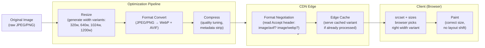

# [FEE-706] Image & Asset Optimization

:::info
This article covers why images dominate page weight, modern formats (WebP, AVIF), responsive images with srcset/sizes and image-set(), lazy loading and fetchpriority, framework image components (Next.js, Nuxt, Astro), build-time optimization tools (sharp, imagemin), and CDN-time transformation services (Cloudinary, imgix, Vercel Image Optimization).
:::

## Context

Images are the single largest contributor to page weight on the average web page. HTTP Archive data consistently shows images accounting for roughly 50% of total bytes transferred -- more than scripts, stylesheets, fonts, and HTML combined. Unlike JavaScript weight (which also causes parse and execution overhead), image weight is "pure" transfer cost: the browser downloads the bytes, decodes them, and paints them. Every unnecessary kilobyte is real latency on real users' connections.

The irony is that image optimization has one of the highest effort-to-impact ratios of any performance technique. Switching a 1 MB JPEG to a well-encoded WebP of the same visual quality routinely cuts file size by 25--40%. Adding srcset so a 320 px wide mobile screen does not download a 1200 px wide image can cut 70--80% of bytes. And yet developers consistently ship unoptimized images -- not because they do not know better, but because the tooling historically required deliberate effort that was easy to skip. Framework image components exist to change the default: when you reach for `<Image>` in Next.js or Nuxt instead of a bare ``, the right behavior -- lazy loading, responsive srcset, modern format, correct dimensions -- happens automatically.

Optimization has historically happened at two moments: build time and request time. Build-time tools like sharp and imagemin convert and compress images when the site is built, producing a fixed set of optimized files. CDN-time transformation -- offered by Cloudinary, imgix, and Vercel Image Optimization -- converts, resizes, and re-encodes images on the fly at the CDN edge, adapting to each request's Accept header (to pick the format the browser supports) and the URL parameters that encode the desired width. CDN-time optimization is strictly more capable: it can serve AVIF to a Chrome user and WebP to a Safari user from the same source file, without any build step, adapting to device capabilities that did not exist when the site was last deployed.

## Design Thinking

### Why images dominate and why developers keep shipping unoptimized ones

The browser's rendering pipeline treats images as passive content: it downloads them, decodes them, and paints them. It has no concept of whether a 1 MB JPEG was the right choice or whether a 200 KB WebP would have looked identical. There is no console warning for an oversized image the way there is for a missing `alt` attribute. The browser is silent, the site looks the same in development (where images load instantly from disk), and the problem only surfaces as latency on slow connections -- which the developer is rarely testing.

This is why framework image components represent a structural improvement rather than just a convenience. The `` element is an "open pit" -- it accepts any file, any size, with no lazy loading by default. Framework image components are a "pit of success": they make the wrong thing inconvenient (serving an unoptimized format, skipping lazy loading, omitting dimensions) and the right thing automatic. The performance gain comes not from any single clever optimization, but from making every image go through the optimization pipeline by default.

### WebP vs. AVIF: compatibility vs. compression

Both WebP and AVIF are modern image formats that use more sophisticated compression than JPEG or PNG. The practical difference is timing and support:

**WebP** (developed by Google, released 2010) has near-universal browser support -- all major browsers since roughly 2020. Its compression typically produces files 25--35% smaller than equivalent JPEG at the same perceptual quality. It also supports lossless compression (replacing PNG) and transparency (alpha channel), making it a viable replacement for both JPEG and PNG in most cases.

**AVIF** (based on the AV1 video codec, standardized 2019) achieves significantly better compression than WebP -- typically 30--50% smaller than equivalent JPEG -- because it uses a more modern compression algorithm. It handles fine textures and gradients particularly well. However, AVIF encoding is computationally expensive (slow at build time) and browser support, while broad in evergreen browsers, is not yet as universal as WebP. Safari added AVIF support in version 16.4 (March 2023); older devices running iOS 15 do not support it.

The practical recommendation: use WebP as the safe default and AVIF as the progressive enhancement. The `<picture>` element and CDN format negotiation handle this gracefully -- offer AVIF first, and browsers that cannot handle it fall back to WebP or JPEG.

### Responsive images: matching the image to the display context

A 1200 px wide image served to a 360 px wide mobile phone viewport downloads roughly 11x more pixels than necessary (1200 vs. 360 px, ignoring device pixel ratio). With a 2x device pixel ratio, the optimal image is 720 px wide -- still far smaller than 1200 px. The `srcset` and `sizes` attributes give the browser the information it needs to pick the right candidate:

- `srcset` lists the available image files with their intrinsic widths (width descriptors like `400w`) or pixel density ratios (`2x`).
- `sizes` tells the browser how wide the image will be rendered at various viewport widths, using media conditions. This is layout information -- it cannot be inferred from the image or the CSS alone.

The browser uses both attributes together: it reads `sizes` to determine the rendered width at the current viewport, then selects from `srcset` the image whose width most closely matches that rendered width multiplied by the device pixel ratio.

The CSS equivalent for background images is `image-set()`, which accepts multiple image candidates with resolution descriptors, giving the browser the same choice mechanism for non-`` images.

### Lazy loading and fetchpriority: the two ends of the priority spectrum

`loading="lazy"` tells the browser to defer loading an image until it enters (or approaches) the viewport. For below-the-fold images -- which represent the majority of images on a typical page -- this eliminates bandwidth competition with the LCP image and other above-the-fold resources during the critical early load window. The cost is negligible for users who scroll (the image loads before they reach it, thanks to the browser's lookahead distance), and the benefit for users who do not scroll is that they never download images they never see.

`fetchpriority="high"` is the opposite: it tells the browser to treat this image as critical and push it to the top of the fetch queue. This is essential for the LCP image. The browser's default priority for images is low-to-medium; without an explicit boost, the LCP image competes with scripts, stylesheets, and other images. Combined with a `<link rel="preload">` in the document head, `fetchpriority="high"` ensures the LCP image is discovered as early as possible and fetched before anything else.

These two attributes should never both appear on the same image: the LCP image gets `fetchpriority="high"` (and no `loading="lazy"`); all other images get `loading="lazy"` (and no `fetchpriority`).

### Build-time vs. CDN-time optimization: the shift in responsibility

Build-time optimization (sharp, imagemin, squoosh) processes images when the site is deployed. The developer specifies which sizes and formats to generate, the build tool outputs them, and the HTML references them statically. This approach is reliable and requires no external service, but it is static: the output is fixed at build time. If a new format (AVIF) gains broad support, you need to regenerate the images and redeploy. If you missed generating a particular width breakpoint, users at that viewport get the next-closest size, which may be significantly larger.

CDN-time optimization processes images on-demand at the edge. Cloudinary, imgix, and Vercel Image Optimization accept a source image URL and parameters (width, format, quality) in the request URL, perform the transformation at the CDN edge, and return the result -- which is then cached for subsequent requests. The CDN can inspect the `Accept` header to determine which formats the browser supports and serve AVIF to Chrome, WebP to older Safari, and JPEG to legacy browsers from a single source image. This dynamic adaptation is impossible with build-time tools.

The tradeoff is operational: CDN transformation requires network connectivity to the CDN service (a dependency), has per-transformation costs at high scale, and adds latency on cache-miss requests (the first request for a new size/format combination). For most production applications, the flexibility and developer ergonomics of CDN-time optimization outweigh these costs. Build-time tools remain valuable for projects with strict self-hosting requirements or offline-capable PWAs.

### Framework image components as a "pit of success"

The best image optimization is the one that happens without the developer thinking about it. This is the design goal of framework image components:

**Next.js `<Image>`** (from `next/image`) automatically generates responsive `srcset` values at configurable breakpoints, negotiates format (serving WebP or AVIF based on browser support), sets `width` and `height` to prevent CLS, lazy-loads by default, and optionally provides a blur placeholder while the image loads. Adding `priority` disables lazy loading and injects `<link rel="preload">` for the LCP image. Image transformation is handled by the Next.js Image Optimization API (built-in or delegated to a CDN provider via `loader` configuration).

**Nuxt `<NuxtImg>`** (from `@nuxt/image`) provides similar capabilities through a provider system -- you configure which CDN backend (Cloudinary, imgix, IPX built-in, and others) handles transformations. Modifiers (width, height, format, fit) are passed as props. `<NuxtPicture>` additionally generates `<picture>` markup with multiple source types.

**Astro `<Image>`** and `<Picture>`** (from `astro:assets`) perform build-time optimization by default, generating optimized formats and sizes from local images. For remote images, they integrate with image service providers. The Astro approach is particularly well-suited to content-heavy static sites where all images are known at build time.

## Best Practices

**Always set explicit `width` and `height` on images to prevent CLS.** MUST add `width` and `height` attributes to every `` and `<iframe>` matching the element's displayed aspect ratio. Without these attributes the browser allocates no space during layout; when the image loads, surrounding content shifts, generating Cumulative Layout Shift. Setting the attributes lets the browser compute and reserve the correct space immediately using the intrinsic aspect ratio, even before the image bytes arrive.

**Use AVIF/WebP with PNG/JPEG fallback via `<picture>`.** SHOULD serve AVIF as the primary source and WebP as the secondary source inside a `<picture>` element, with a JPEG or PNG `` fallback. The browser evaluates `<source>` elements in document order and picks the first type it supports, so AVIF (30-50% smaller than JPEG) reaches modern browsers while older browsers transparently fall back. MUST NOT ship only JPEG or PNG in 2024 and beyond when WebP has universal browser support and AVIF covers all evergreen browsers.

**Lazy-load below-the-fold images.** SHOULD add `loading="lazy"` to every `` that is not immediately visible in the initial viewport. Lazy loading defers the network request until the browser determines the image is approaching the viewport, eliminating bandwidth competition with the LCP image and other critical resources during the early load window. MUST NOT add `loading="lazy"` to the LCP image or any above-the-fold image -- lazy loading those elements delays their fetch and directly increases LCP.

**Preload the LCP image with `<link rel="preload" as="image">`.** MUST add a `<link rel="preload" as="image">` in the document `<head>` for the LCP image, combined with `fetchpriority="high"` on the `` element itself. Preloading ensures the browser discovers the LCP image at HTML parse time rather than after CSS and scripts have loaded; `fetchpriority="high"` elevates it above other images already in the fetch queue. In Next.js, the `priority` prop on `<Image>` applies both automatically.

**Use a CDN with automatic format negotiation.** SHOULD route image delivery through a CDN image service (Cloudinary, imgix, Vercel Image Optimization) that reads the `Accept` request header and serves AVIF to browsers that support it, WebP to those that do not, and JPEG as a universal fallback -- all from a single source file. CDN-time format negotiation eliminates the need to manually generate and maintain multiple format variants at build time, and ensures that newly supported formats reach users without a redeployment.

## Visual

### Image Optimization Pipeline



## Example

### 1. Responsive images with srcset and sizes

The `srcset` attribute lists available image candidates with their intrinsic pixel widths. The `sizes` attribute describes the rendered width at different viewport breakpoints. The browser multiplies the rendered width by the device pixel ratio to select the optimal candidate.

```html

```

The browser on a 360 px wide mobile screen at 2x DPR reads `sizes` as 100vw = 360 px, multiplies by DPR to get 720 px effective pixels, and picks `/images/hero-640.webp` (640w) or `/images/hero-1024.webp` depending on which is closest without going under.

### 2. AVIF with WebP fallback using the picture element

The `<picture>` element allows specifying multiple sources. The browser picks the first source whose type it supports, falling back to the `` element's `src` as the last resort.

```html
<picture>
  <!-- AVIF: best compression, requires modern browser (Chrome 85+, Safari 16.4+) -->
  <source
    type="image/avif"
    srcset="
      /images/hero-640.avif   640w,
      /images/hero-1200.avif 1200w
    "
    sizes="(max-width: 640px) 100vw, 1200px"
  />
  <!-- WebP: broad support (all major browsers since 2020) -->
  <source
    type="image/webp"
    srcset="
      /images/hero-640.webp   640w,
      /images/hero-1200.webp 1200w
    "
    sizes="(max-width: 640px) 100vw, 1200px"
  />
  <!-- JPEG fallback: universal support -->
  
</picture>
```

### 3. CSS image-set() for background images

`image-set()` provides the same multi-format, multi-resolution selection for CSS background images. The browser picks the first format type it supports and the most appropriate resolution.

```css
.hero {
  background-image: image-set(
    url("/images/hero.avif") type("image/avif"),
    url("/images/hero.webp") type("image/webp"),
    url("/images/hero.jpg")  type("image/jpeg")
  );
  background-size: cover;
  background-position: center;
}

/* Resolution-aware variant for high-DPR screens */
.logo {
  background-image: image-set(
    url("/images/logo.webp") 1x,
    url("/images/logo-2x.webp") 2x
  );
}
```

Note: `image-set()` is supported in all modern browsers (Chrome 113+, Firefox 89+, Safari 14+). Use the vendor-prefixed `-webkit-image-set()` alongside for older Safari versions if needed.

### 4. LCP image with fetchpriority and preload

The LCP image needs two things: early discovery (via `<link rel="preload">`) and high fetch priority. Both together minimize the gap between navigation start and LCP paint.

```html
<head>
  <!-- Preload: tells the browser to start fetching before it sees the  tag -->
  <link
    rel="preload"
    as="image"
    href="/images/hero-1200.webp"
    imagesrcset="/images/hero-640.webp 640w, /images/hero-1200.webp 1200w"
    imagesizes="(max-width: 640px) 100vw, 1200px"
  />
</head>
<body>
  <!-- fetchpriority="high": elevates this above other network requests -->
  <!-- No loading="lazy" on the LCP image -->
  
</body>
```

### 5. Next.js Image component

The Next.js `<Image>` component handles srcset generation, format negotiation, lazy loading, and CLS prevention automatically. The `priority` prop is the only thing you need to configure for the LCP image.

```tsx
import Image from 'next/image';

// LCP image: priority disables lazy loading, injects preload, sets fetchpriority="high"
export function HeroImage() {
  return (
    <Image
      src="/images/hero.jpg"
      width={1200}
      height={600}
      priority
      alt="Product hero image"
      // Next.js automatically generates WebP and AVIF variants via its image API.
      // It also generates srcset values at configured device sizes and image sizes.
      // Blur placeholder can be enabled with: placeholder="blur" blurDataURL="..."
    />
  );
}

// Below-the-fold image: lazy loading is the default, no configuration needed
export function ProductCard({ src, alt }: { src: string; alt: string }) {
  return (
    <Image
      src={src}
      width={400}
      height={300}
      alt={alt}
      // loading="lazy" is set automatically (no "priority" prop)
    />
  );
}
```

To configure external image domains and CDN loaders in `next.config.js`:

```javascript
// next.config.js
/** @type {import('next').NextConfig} */
const nextConfig = {
  images: {
    // Domains allowed for remote images
    remotePatterns: [
      {
        protocol: 'https',
        hostname: 'cdn.example.com',
        pathname: '/images/**',
      },
    ],
    // Format order: Next.js will prefer AVIF, then WebP, then the original format
    formats: ['image/avif', 'image/webp'],
    // Custom device widths for srcset generation
    deviceSizes: [640, 750, 828, 1080, 1200, 1920],
    imageSizes: [16, 32, 48, 64, 96, 128, 256, 384],
  },
};

module.exports = nextConfig;
```

### 6. Nuxt Image with provider configuration

```vue
<!-- pages/index.vue -->
<template>
  <!-- NuxtImg generates srcset, lazy-loads, and delegates to the configured provider -->
  <NuxtImg
    src="/images/hero.jpg"
    width="1200"
    height="600"
    format="webp"
    loading="eager"
    fetchpriority="high"
    alt="Product hero image"
  />

  <!-- NuxtPicture generates <picture> with multiple <source> types -->
  <NuxtPicture
    src="/images/product.jpg"
    width="400"
    height="300"
    :imgAttrs="{ alt: 'Product photo', loading: 'lazy' }"
  />
</template>
```

```typescript
// nuxt.config.ts
export default defineNuxtConfig({
  image: {
    // Use Cloudinary as the image provider
    cloudinary: {
      baseURL: 'https://res.cloudinary.com/your-cloud/image/upload/',
    },
    // Or use the built-in IPX provider (self-hosted, no external dependency)
    provider: 'ipx',
  },
});
```

### 7. Build-time optimization with sharp

Sharp is a high-performance Node.js image processing library built on libvips. It is commonly used in build scripts, CI pipelines, and custom Vite/webpack plugins to generate optimized image variants.

```javascript
// scripts/optimize-images.mjs
import sharp from 'sharp';
import { glob } from 'glob';
import { mkdir } from 'fs/promises';
import path from 'path';

const INPUT_DIR = 'src/assets/images';
const OUTPUT_DIR = 'public/images';

// Width variants to generate for responsive srcset
const WIDTHS = [320, 640, 1024, 1200];

async function optimizeImages() {
  const files = await glob(`${INPUT_DIR}/**/*.{jpg,jpeg,png}`);

  for (const file of files) {
    const name = path.basename(file, path.extname(file));
    const outDir = path.join(OUTPUT_DIR, path.dirname(file).replace(INPUT_DIR, ''));
    await mkdir(outDir, { recursive: true });

    for (const width of WIDTHS) {
      // WebP variant
      await sharp(file)
        .resize(width)
        .webp({ quality: 80 })
        .toFile(path.join(outDir, `${name}-${width}.webp`));

      // AVIF variant (slower to encode, better compression)
      await sharp(file)
        .resize(width)
        .avif({ quality: 60 }) // AVIF quality scale is different from JPEG/WebP
        .toFile(path.join(outDir, `${name}-${width}.avif`));
    }

    console.log(`Optimized: ${file}`);
  }
}

optimizeImages().catch(console.error);
```

### 8. CDN image transformation (Cloudinary and imgix)

CDN image transformation services accept a source image URL, apply transformation parameters encoded in the URL or query string, and return the optimized result -- cached at the edge for subsequent requests.

```html
<!-- Cloudinary: transformation parameters are path segments -->
<!-- f_auto: format negotiation (AVIF, WebP, or JPEG based on Accept header) -->
<!-- q_auto: automatic quality selection -->
<!-- w_640: resize to 640px width -->

```

```javascript
// imgix: transformation parameters as query string
const imgixBase = 'https://example.imgix.net';

function imgixUrl(path, params) {
  const url = new URL(path, imgixBase);
  // auto=format: serve AVIF/WebP based on browser support
  // auto=compress: apply automatic compression
  url.searchParams.set('auto', 'format,compress');
  for (const [key, value] of Object.entries(params)) {
    url.searchParams.set(key, value);
  }
  return url.toString();
}

// Generate srcset string for an image
function buildSrcSet(path, widths) {
  return widths
    .map(w => `${imgixUrl(path, { w })} ${w}w`)
    .join(', ');
}

// Usage in JSX
const src = imgixUrl('/hero.jpg', { w: 1200 });
const srcSet = buildSrcSet('/hero.jpg', [320, 640, 1024, 1200]);
```

## Common Mistakes

- **Serving the original high-resolution image to all devices.** A 4K product image served to a 360 px mobile screen wastes 10-30x the necessary bytes. Always generate and serve width-appropriate variants using srcset and sizes.

- **Omitting alt text.** Every `` must have an `alt` attribute. An empty `alt=""` is appropriate for purely decorative images (the screen reader skips it). A missing `alt` attribute is an accessibility failure and an HTML validation error.

- **Using srcset without sizes.** Without a `sizes` attribute, the browser assumes the image is 100vw wide. A sidebar image that is actually 300 px wide will cause the browser to download unnecessarily large candidates. Always pair srcset with sizes.

- **Applying the same quality setting to AVIF and WebP/JPEG.** AVIF's quality scale is non-linear and not comparable to JPEG's. A quality of 60 in AVIF often produces better visual results than quality 80 in WebP. Always calibrate quality settings per format using visual comparison, not numeric equivalence.

- **Forgetting to configure remote image domains in Next.js.** The Next.js Image component blocks optimization of images from domains not listed in `next.config.js`'s `images.remotePatterns`. This is a security measure, but omitting a domain causes a runtime error that is easy to miss until production.

## Related FEEs

| FEE | Relationship |
|-----|-------------|
| [FEE-700 Rendering & Performance Overview](./700.md) | Parent overview of the browser rendering pipeline. Images are the largest single contributor to the payload that pipeline must handle. |
| [FEE-704 Core Web Vitals & Performance Metrics](./704.md) | LCP is almost always an image optimization problem. fetchpriority="high" on the LCP image is covered there; the format and size optimization of that image is covered here. |
| [FEE-705 Code Splitting & Lazy Loading](./705.md) | Image lazy loading (loading="lazy") is the image analog of JavaScript lazy loading (dynamic import). Both reduce the work the browser does before the user needs the content. |
| [FEE-104 HTML Media Elements](../HTML%20Fundamentals/104.md) | The img, picture, source, and srcset/sizes attributes are the HTML primitives this article builds on. |
| [FEE-204 Responsive CSS](../CSS%20Fundamentals/204.md) | image-set() in CSS parallels srcset in HTML. CSS containment and aspect-ratio are used to prevent CLS from image loading. |

## References

- [Responsive images -- MDN](https://developer.mozilla.org/en-US/docs/Learn/HTML/Multimedia_and_embedding/Responsive_images) -- MDN guide to srcset, sizes, and the picture element with worked examples of width descriptors and pixel density descriptors
- [Use modern image formats -- web.dev](https://web.dev/articles/uses-webp-images) -- Google's case for WebP and AVIF, including browser support tables and compression comparisons
- [AVIF has landed -- Jake Archibald / web.dev](https://web.dev/articles/avif) -- Deep dive into AVIF's compression advantages, quality comparisons against JPEG and WebP, and encoding tradeoffs
- [Optimizing images -- Next.js docs](https://nextjs.org/docs/app/building-your-application/optimizing/images) -- Official Next.js Image component documentation covering priority, placeholder, loader, and configuration
- [The loading attribute -- MDN](https://developer.mozilla.org/en-US/docs/Web/HTML/Element/img#loading) -- Browser behavior for loading="lazy", threshold distances, and interaction with fetchpriority
- [fetchpriority -- web.dev](https://web.dev/articles/fetch-priority) -- How the Fetch Priority API (fetchpriority attribute) works, priority hints for images, and LCP impact measurements
- [Nuxt Image -- Nuxt docs](https://image.nuxt.com/) -- Official Nuxt Image documentation covering NuxtImg, NuxtPicture, providers, and modifier syntax
