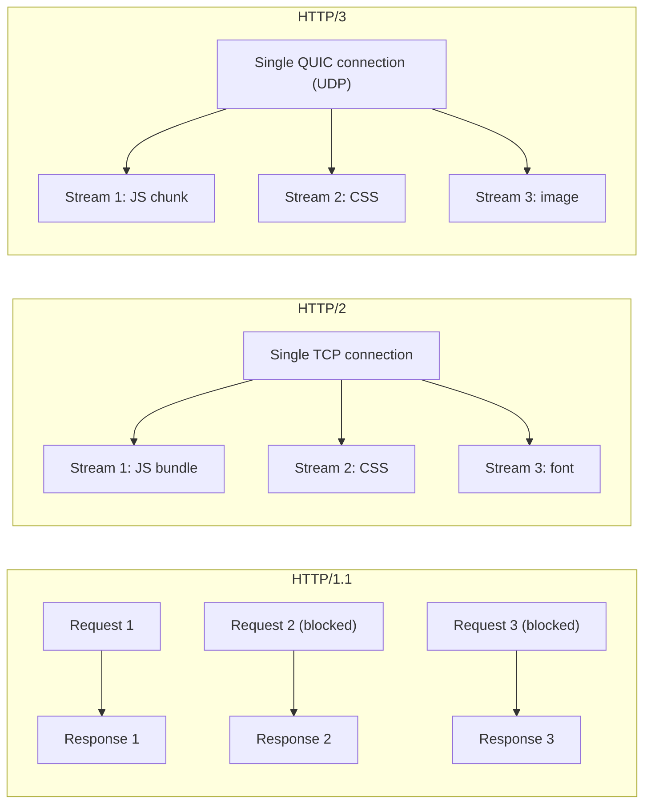

# [FEE-708] HTTP/1.1, HTTP/2 & HTTP/3: Protocol Evolution

:::info
The HTTP version running between the browser and server determines how resources load in parallel, how packet loss affects all in-flight requests, and whether fine-grained code splitting is a performance win or a regression. Understanding the differences between HTTP/1.1, HTTP/2, and HTTP/3 is essential for making correct bundling, preloading, and CDN configuration decisions.
:::

## Introduction

HTTP/1.1 was standardized in 1997 and dominated the web for nearly two decades. It established the request-response model that the browser still uses today, but it carried a fundamental constraint: a single TCP connection could handle only one request at a time. Browsers worked around this by opening up to six parallel TCP connections per origin, but six is a small number for a modern page that may reference dozens of JavaScript chunks, CSS files, fonts, and images. When all six connections are occupied, every additional request queues behind them, blocking the critical rendering path.

HTTP/2 arrived in 2015 (RFC 7540) and addressed this by introducing multiplexing — the ability to interleave many request-response pairs on a single TCP connection using a binary framing layer. A browser no longer needs to open multiple connections; it opens one, and all resources flow through independent streams inside it. This eliminated the HTTP-level head-of-line blocking of HTTP/1.1. It also introduced HPACK header compression, which removes the overhead of sending identical headers (cookies, `User-Agent`, `Accept-Encoding`) on every request. The practical effect was that fine-grained code splitting — shipping many small JavaScript modules — became viable for the first time.

HTTP/3 (RFC 9114, 2022) takes a more radical step: it replaces TCP entirely with QUIC (RFC 9000), a transport protocol built on UDP. QUIC retains the multiplexing model of HTTP/2 but eliminates the one remaining source of head-of-line blocking: TCP itself. When a single packet is lost on an HTTP/2 connection, the OS-level TCP stack holds all streams frozen while it retransmits that one packet. QUIC tracks lost packets per stream, so only the stream that owned the lost packet stalls — the others continue delivering data. This matters most on mobile networks and lossy WiFi, where packet loss rates of 1–2% are common. QUIC also integrates TLS 1.3 into the handshake, reducing connection establishment from two round trips (TCP + TLS) to one (or zero with 0-RTT resumption), and its connection ID mechanism lets a connection survive a network change (4G to WiFi) without a full reconnect.

Header compression is another area where the newer protocols show measurable gains. HTTP/1.1 sends the full set of request headers on every request — cookies, `User-Agent`, `Accept`, `Accept-Encoding`, `Referer`. On a page that loads 50 resources from the same origin, these headers are sent 50 times. For a site with a 2 KB cookie string, that is 100 KB of header overhead that delivers zero content. HPACK (HTTP/2) and QPACK (HTTP/3) eliminate this by maintaining a shared compression table between client and server. After the first request, subsequent requests that share the same header values transmit only a compact index reference rather than the full string.

The adoption trajectory of each version matters for decision-making. As of 2026, HTTP/2 is supported by virtually all CDNs and origin servers and accounts for over 60% of web traffic by request count. HTTP/3 is supported by Chrome, Edge, and Firefox; Safari support is partial, gated behind experimental flags in some versions. Both newer versions require TLS — no browser implements cleartext HTTP/2 (h2c) or HTTP/3. The implication for frontend teams is that TLS is not optional: any origin still served over HTTP must be migrated before it can benefit from multiplexing. The good news is that modern certificate providers (Let's Encrypt, Cloudflare) have made free, auto-renewing TLS certificates routine, removing the cost barrier that kept many origins on HTTP/1.1 through the 2010s.

## Principle

The HTTP version running between the browser and server determines how resources are fetched in parallel, how head-of-line blocking affects loading, and whether the "bundle everything" strategy is optimal or counterproductive. Teams MUST NOT assume HTTP/2 or HTTP/3 is active end-to-end — verify with server configuration, CDN settings, and browser DevTools Network panel (Protocol column). Teams SHOULD prefer fine-grained module splitting only when HTTP/2+ is confirmed end-to-end; teams SHOULD continue bundling aggressively when HTTP/1.1 is still in play at any hop. Teams SHOULD use `Link: rel=preload` response headers or `<link rel="preload">` for critical resources regardless of HTTP version. Teams SHOULD prefer `103 Early Hints` over HTTP/2 server push — server push is deprecated in Chrome 106+ and removed from HTTP/3.

## Design Thinking

### Why the transport layer shapes frontend architecture

Frontend engineers routinely make decisions — how many chunks to produce, whether to inline critical CSS, which fonts to preload — without knowing what HTTP version will deliver those resources to the user. This is a category error. The optimal strategy for HTTP/1.1 (few large files, aggressive inlining) is nearly the opposite of the optimal strategy for HTTP/2 (many small cacheable files, minimal inlining). Building a production system without verifying the protocol version at every hop — origin, CDN edge, load balancer — guarantees that some of those decisions will be wrong.

The reason HTTP/1.1 demands large bundles is the six-connection limit. If a page requests 30 JavaScript chunks and only six connections are available, the browser must queue 24 of them. TCP connection setup (SYN/SYN-ACK/ACK) costs at least one round trip each, and TLS adds another. On a 100 ms RTT link, establishing a new connection takes 200–300 ms before the first byte of data arrives. Multiplying that by 24 queued requests produces a multi-second waterfall even on a fast network. Large bundles reduce the request count and avoid this overhead.

### How multiplexing changes the calculus

HTTP/2 multiplexing eliminates the connection-count constraint by flowing all requests through one TCP connection as independent streams. Each stream has its own header block and flow-control window. The server can interleave frames from different streams at a granularity of 16 KB, so a slow-arriving large chunk does not block a fast-arriving small one at the HTTP layer. This is why fine-grained module splitting — one chunk per route, per component, or per vendor library — becomes viable. Each chunk loads in parallel on the same connection, shares the same header-compression table, and can be cached independently. When a user revisits the page and only one module has changed, only that module's chunk is fetched; the rest are served from cache.

HTTP/3's per-stream loss recovery takes this further. On HTTP/2 over TCP, a single lost packet freezes all streams because the TCP stack requires in-order delivery. A 1% packet loss rate on a connection carrying 10 streams means a stream-blocking retransmit event occurs roughly every 10 packets — measurably degrading performance on mobile. HTTP/3/QUIC tracks sequence numbers per stream and only stalls the stream that owns the lost packet. In practice, this translates to more consistent load times under degraded network conditions, which is where real users often operate.

### How HTTP version affects the browser's resource prioritization

HTTP/2 and HTTP/3 give browsers more levers to express resource priority. Both versions support a priority field on each stream that signals to the server which responses should be sent first when bandwidth is constrained. Browsers use this to ensure that render-blocking CSS arrives before non-critical images. Under HTTP/1.1, the browser could influence priority only indirectly by controlling which TCP connections it opened first — a blunt instrument that depended on connection timing rather than explicit signaling.

The practical implication is that HTTP/2 server implementations that do not honor stream priorities can still degrade performance even when multiplexing is active. An origin server that sends all streams at equal priority may interleave frames from a low-priority image chunk with frames from a render-blocking CSS file, delaying paint. Nginx honors HTTP/2 stream priorities by default. Verify that any custom server middleware or reverse proxy in the request path does not strip or ignore the PRIORITY frame. In HTTP/3, QUIC's stream scheduling uses a similar priority mechanism defined in RFC 9218 (Extensible Prioritization Scheme for HTTP).

### The CDN layer and protocol negotiation

A common misconception is that the HTTP version experienced by the browser reflects the full connection chain. In practice, CDNs terminate the browser connection at the edge and establish a separate connection to the origin. A browser may negotiate HTTP/3 with a Cloudflare edge node while that edge node fetches uncached content from the origin over HTTP/1.1. The result is that the browser's fast multiplexed connection is only as good as the CDN cache hit rate for fine-grained chunk requests. On a deploy event that invalidates many chunks simultaneously, the CDN must fill its cache via origin fetches. If those origin fetches are over HTTP/1.1, they serialize through the same six-connection bottleneck that plagues browsers directly. Teams that adopt fine-grained splitting without ensuring CDN-to-origin HTTP/2 can observe slower deployment propagation than with a monolithic bundle.

This matters for preloading strategy too. The 103 Early Hints response is generated at the CDN edge when possible (Cloudflare and Fastly both support edge-generated Early Hints based on rules), so the browser starts fetching hinted resources while the origin is still processing the request. When the origin generates the 103, the browser gains the same benefit but only when the CDN passes the 103 through to the client — not all CDN configurations do this. Verify Early Hints behavior end-to-end with the browser DevTools Timing tab and the `early-hints-time` field in the Navigation Timing API.

### Decision table: choosing a strategy by HTTP version

| Scenario | HTTP/1.1 | HTTP/2 | HTTP/3 (QUIC) |
|---|---|---|---|
| Parallel resource requests | 6 connections per origin | Multiplexed on 1 TCP connection | Multiplexed on 1 UDP connection |
| Head-of-line blocking | Per connection (TCP + HTTP) | HTTP-level resolved; TCP-level remains | Eliminated (QUIC per-stream) |
| Bundle granularity preference | Few large bundles | Many small modules viable | Many small modules viable |
| Connection on packet loss | Stalls entire TCP connection | Stalls entire TCP connection | Only affected stream stalls |
| Connection migration (mobile) | New TCP handshake required | New TCP handshake required | QUIC connection ID survives network change |
| Server push / Early Hints | Not supported | Server Push (deprecated) | 103 Early Hints (recommended) |
| TLS | Optional | Required in practice | Integrated (QUIC-TLS) |
| Adoption (2026) | Legacy; CDNs still serve it | Universal | Chrome/Edge/Firefox; Safari partial |

## Best Practices

**Verify the protocol at every hop before changing bundle strategy.** The CDN edge may speak HTTP/2 to the browser but HTTP/1.1 to the origin. Both hops matter: origin-to-CDN traffic is the bottleneck for cache misses. Check CDN documentation and use the DevTools Network panel Protocol column (or `PerformanceResourceTiming.nextHopProtocol`) to confirm the actual protocol in use.

**Split bundles granularly only when HTTP/2+ is confirmed end-to-end.** Under HTTP/2, splitting vendor libraries into separate cacheable chunks is almost always a win: a `vendor-react` chunk cached for 30 days does not re-download when only application code changes. Under HTTP/1.1, the same split creates 24 extra requests that exhaust the six-connection pool. The correct default for greenfield projects is to assume HTTP/2 on modern CDNs but to keep an explicit fallback build configuration for HTTP/1.1 legacy segments.

**Use `Link: rel=preload` headers for critical resources on all HTTP versions.** Preload tells the browser to fetch a resource at high priority before the HTML parser discovers it. A critical CSS file discovered three redirects deep in a stylesheet chain costs multiple round trips before it starts downloading. A `Link: </styles/main.css>; rel=preload; as=style` response header from the server eliminates that chain for free, regardless of HTTP version.

**Prefer `103 Early Hints` over HTTP/2 server push for server-initiated resource delivery.** Server push was deprecated in Chrome 106 (2022) and is absent from HTTP/3. The browser has no mechanism to reject a pushed resource it already has cached, leading to wasted bandwidth. `103 Early Hints` (RFC 8297) avoids this: it sends a 103 response immediately with `Link` headers, the browser fetches the hinted resources from its own cache or the network as it sees fit, and the 200 response follows after server-side processing. Browser support: Chrome 103+, Firefox 102+, Safari 17+.

**Enable the `Alt-Svc` header to advertise HTTP/3 support.** A browser's first connection to a server is always HTTP/1.1 or HTTP/2 (TCP-based). The `Alt-Svc: h3=":443"; ma=86400` header tells the browser that HTTP/3 is available on port 443 and instructs it to upgrade on subsequent connections. Without this header, browsers never attempt QUIC. Nginx (with QUIC support), Caddy, and Cloudflare all support this header out of the box.

**Audit HPACK / QPACK compression benefit when working with many small requests.** HTTP/2 HPACK and HTTP/3 QPACK compress request headers across streams on the same connection. When all 30 module chunks share the same origin, `Host`, `Accept-Encoding`, and cookie headers are sent once and delta-compressed for subsequent requests. This reduces header overhead by 80–90% compared to HTTP/1.1, which resends full headers on each of its six connections.

**Understand the QUIC 0-RTT tradeoff before enabling it.** QUIC 0-RTT resumption allows a returning client to send application data with the first packet, eliminating the connection establishment round trip. This is a measurable win on repeat visits. However, 0-RTT data is vulnerable to replay attacks — an attacker who captures 0-RTT packets can replay them to trigger the same request a second time. Limit 0-RTT to idempotent GET requests (page loads, static assets) and never enable it for state-mutating endpoints such as form submissions or payment flows.

**Measure perceived performance, not just protocol version.** HTTP/3 adoption does not automatically improve all metrics. On a low-latency, reliable desktop connection, HTTP/2 and HTTP/3 perform nearly identically because TCP packet loss is rare. HTTP/3's advantage concentrates on high-latency or lossy connections — mobile networks, intercontinental CDN paths, and congested WiFi. Use Real User Monitoring (RUM) data segmented by network type and geography to identify where an HTTP/3 rollout will deliver measurable improvement. Key metrics to track are Largest Contentful Paint (LCP) and Time to First Byte (TTFB), segmented by `effectiveType` from the Network Information API (`'slow-2g'`, `'2g'`, `'3g'`, `'4g'`) to isolate the mobile-network cohort where HTTP/3's QUIC transport delivers the most benefit.

**Set correct cache headers to maximize the benefit of per-chunk caching.** The long-lived cache benefit of splitting vendor chunks into separate files only materializes if those chunks have stable content hashes and long `Cache-Control: max-age` values. A `vendor-react` chunk that expires in 60 seconds provides no caching advantage. Use content-addressed filenames (Vite and Webpack both do this by default) and set `Cache-Control: public, max-age=31536000, immutable` on all hashed static assets.

## Mermaid Diagram



## Example

### Detecting the active HTTP version at runtime

```ts
// check-protocol.ts — detect HTTP version via PerformanceResourceTiming
// Check the main document
const [nav] = performance.getEntriesByType('navigation') as PerformanceNavigationTiming[];
console.log('Page protocol:', nav.nextHopProtocol);
// 'h2' = HTTP/2 | 'h3' = HTTP/3 | 'http/1.1' = HTTP/1.1

// Check every resource on the page
performance.getEntriesByType('resource').forEach((entry) => {
  const r = entry as PerformanceResourceTiming;
  if (r.nextHopProtocol) {
    console.log(`${r.name.split('/').pop()}: ${r.nextHopProtocol}`);
  }
});
```

Note: `nextHopProtocol` reflects only the browser-to-CDN hop — for end-to-end protocol auditing, check CDN admin dashboards directly.

### Enabling HTTP/2 and HTTP/3 in Nginx

```nginx
# nginx.conf — enable HTTP/2 and HTTP/3
server {
  listen 443 ssl;
  http2 on;                          # HTTP/2 (Nginx 1.25.1+)

  # HTTP/3 (QUIC) — requires Nginx built with QUIC support
  listen 443 quic reuseport;         # add 'ssl' here if your build requires it
  add_header Alt-Svc 'h3=":443"; ma=86400';  # advertise HTTP/3

  ssl_certificate     /etc/ssl/cert.pem;
  ssl_certificate_key /etc/ssl/key.pem;
}
```

The `http2 on` directive uses the modern Nginx 1.25.1+ syntax. Older Nginx versions used `listen 443 ssl http2;`. The `quic reuseport` directive enables UDP multiplexing across worker processes, which is required for QUIC to perform well under load. The `Alt-Svc` header tells Chrome and Firefox to upgrade to HTTP/3 on the next connection.

For teams using Caddy, the configuration is simpler: Caddy enables HTTP/2 by default for all HTTPS listeners and enables HTTP/3 when the `servers { protocols h3 }` global option is set. Caddy also automatically generates and renews TLS certificates via Let's Encrypt or ZeroSSL, removing the certificate management burden entirely. The `Alt-Svc` header for HTTP/3 advertisement must still be added explicitly as a response header directive.

### Configuring Vite for HTTP/2-aware chunk splitting

```ts
// vite.config.ts — HTTP/2-aware chunk splitting
// Under HTTP/2: many small chunks are fine; each loads in parallel on one connection.
// Under HTTP/1.1: too many chunks = 6-connection bottleneck; keep chunks fewer and larger.
import { defineConfig } from 'vite';

export default defineConfig({
  build: {
    rollupOptions: {
      output: {
        // Split vendor libraries into separate cacheable chunks (HTTP/2 assumed)
        manualChunks: {
          'vendor-react':  ['react', 'react-dom'],
          'vendor-router': ['react-router-dom'],
          'vendor-query':  ['@tanstack/react-query'],
        },
      },
    },
    // Raise the chunk size warning threshold — too-aggressive splitting harms HTTP/1.1
    chunkSizeWarningLimit: 500, // kb
  },
});
```

Each `manualChunks` entry produces a separate file with its own content hash. Because vendor dependencies change infrequently, these chunks are cached by the browser for the full cache lifetime. When application code changes on a deploy, only the application chunks are re-fetched; the three vendor chunks remain cached. Under HTTP/2, all four files load in parallel on the same connection with no additional handshake cost.

### Sending preload headers from an Express server

```ts
// preload-hints.ts — Link: rel=preload header (Node.js/Express)
import express from 'express';
const app = express();

app.get('/', (_req, res) => {
  // Link header is equivalent to <link rel="preload"> in HTML
  // Browser fetches these resources before parsing the full HTML response
  res.setHeader('Link', [
    '</styles/main.css>; rel=preload; as=style',
    '</fonts/inter.woff2>; rel=preload; as=font; crossorigin',
    '</scripts/app.js>; rel=preload; as=script',
  ].join(', '));

  res.send(/* html */ `
    <!DOCTYPE html>
    <html>
      <head>
        <link rel="preload" href="/styles/main.css" as="style">
        <link rel="stylesheet" href="/styles/main.css">
      </head>
      <body><div id="root"></div></body>
    </html>
  `);
});

app.listen(3000, () => console.log('Server listening on http://localhost:3000'));
```

The `Link` response header reaches the browser before HTML parsing begins. On a fast server, the preloaded resources start downloading before the parser encounters the `<link>` tags in the `<head>`. The `as` attribute is required: it tells the browser the resource type so it can assign the correct fetch priority and use the correct credentials mode. Omitting `as` causes the browser to fetch the resource twice — once for the preload and once when the tag is parsed.

### Sending 103 Early Hints from a Node.js HTTP/2 server

```ts
// early-hints.ts — 103 Early Hints (Node.js HTTP/2 server)
// 103 is sent immediately; the 200 follows after server processing.
// The browser starts fetching hinted resources before the 200 arrives.
import http2 from 'node:http2';
import fs from 'node:fs';

const server = http2.createSecureServer({
  key:  fs.readFileSync('key.pem'),
  cert: fs.readFileSync('cert.pem'),
});

server.on('stream', (stream, headers) => {
  if (headers[':path'] === '/') {
    // Send 103 Early Hints immediately
    stream.additionalHeaders({
      ':status': 103,
      link: [
        '</styles/main.css>; rel=preload; as=style',
        '</scripts/app.js>; rel=preload; as=script',
      ].join(', '),
    });

    // ... perform server-side work (DB queries, templating) ...

    // Send the actual 200 response
    stream.respond({ ':status': 200, 'content-type': 'text/html' });
    stream.end('<html>...</html>');
  }
});
```

The 103 status is informational — the browser does not wait for it and does not render it. It immediately begins fetching the hinted resources while the server executes its database queries or template rendering. On a page with 200 ms of server processing time and 50 ms RTT, Early Hints can recover most of that 200 ms by overlapping the network fetch of CSS and JS with the server's work. This is the main advantage over traditional preload headers, which arrive with the 200 response after server processing has already completed.

Note that `stream.additionalHeaders` is specific to Node.js's `http2` module. In Express.js or Fastify running over HTTP/2, use the framework's dedicated Early Hints API or write middleware that sets the `:status: 103` informational response before the main handler executes. CDN-generated Early Hints (available in Cloudflare Workers and Fastly Compute) eliminate the need for origin-level implementation when the hint list is static and known at deploy time.

A practical heuristic for choosing between preload and Early Hints: if server processing time is under 50 ms (for example, static file serving), preload headers are sufficient; if the server must execute database queries or complex template rendering, Early Hints hide that latency more effectively. On mobile, with 100 ms of server processing time and 80 ms RTT, Early Hints can improve First Contentful Paint (FCP) by 15–25% — an optimization worth testing in production.

## Common Mistakes

**Splitting bundles into many small files without confirming HTTP/2 is active end-to-end.** A Vite config that produces 40 route chunks is optimal under HTTP/2 but creates a 40-request waterfall constrained to 6 connections under HTTP/1.1. The CDN edge may speak HTTP/2 to the browser while using HTTP/1.1 to fetch chunks from the origin. In that case, a cache miss causes the CDN to serialize 40 origin fetches through 6 connections before serving the browser. Always confirm the protocol at both the browser-to-CDN and CDN-to-origin hops.

**Using HTTP/2 server push in new projects.** Server push was deprecated in Chrome 106 (September 2022) and has never been part of HTTP/3. The fundamental problem is that the server cannot know what the browser already has cached; pushed resources that are already in the browser cache waste bandwidth and can evict other cached items. The replacement is `103 Early Hints`, which lets the browser decide what to fetch based on its own cache.

**Assuming the CDN edge speaks HTTP/2 to the origin.** Many CDN providers terminate HTTP/2 at the edge and connect to the origin over HTTP/1.1 for compatibility. This means origin responses are subject to HTTP/1.1 connection limits even if browsers experience HTTP/2. Check CDN documentation explicitly — Cloudflare, for example, supports HTTP/2 to the origin only when the origin has a valid SSL certificate and the "HTTP/2 to Origin" setting is enabled.

**Conflating HTTP version with TLS.** HTTP/2 technically allows cleartext operation (h2c), but no browser implements h2c. In practice, HTTP/2 requires TLS. HTTP/3/QUIC integrates TLS 1.3 as a mandatory component — there is no cleartext HTTP/3. Teams that deploy HTTP/2 behind a cleartext load balancer (expecting h2c) will find that browsers negotiate HTTP/1.1 instead.

**Using `nextHopProtocol` to audit the full connection path.** `nextHopProtocol` reports the protocol used for the browser's own fetch — the browser-to-CDN hop. It does not reflect what the CDN uses to reach the origin. Teams that rely on `nextHopProtocol === 'h2'` to confirm their HTTP/2 setup may miss the case where the CDN-to-origin leg is still HTTP/1.1.

**Ignoring the impact of third-party scripts on protocol negotiation.** Third-party scripts (analytics, A/B testing, chat widgets) are loaded from separate origins. Each separate origin establishes its own connection — its own protocol negotiation, its own TLS handshake, its own queue of up to six HTTP/1.1 connections if that third party's CDN is on HTTP/1.1. A page that loads its own resources over HTTP/3 but pulls in ten third-party scripts from origins that still use HTTP/1.1 is subject to HTTP/1.1 constraints for those scripts. Use `nextHopProtocol` on third-party resource entries to audit whether critical third-party scripts are being served over an efficient protocol.

**Setting `chunkSizeWarningLimit` too high and masking legitimate bundle size problems.** Raising the Vite chunk size warning threshold is appropriate when fine-grained splitting is intentional and HTTP/2 is confirmed. It becomes harmful when used to suppress warnings about genuinely oversized bundles that should be split or tree-shaken. Use the threshold as documentation of intent (this is a known, acceptable size) rather than as a way to avoid investigating warnings. Bundle analysis with `rollup-plugin-visualizer` or `vite-bundle-analyzer` should be a regular practice, not something triggered only by complaints.

## Summary

| Consideration | HTTP/1.1 | HTTP/2 | HTTP/3 |
|---|---|---|---|
| Verify before splitting | N/A | Required | Required |
| Fine-grained chunks | Harmful | Beneficial | Beneficial |
| Server push | N/A | Deprecated | Removed |
| Early Hints | Not supported | Supported | Supported |
| QUIC per-stream recovery | No | No | Yes |
| TLS requirement | Optional | Mandatory (browsers) | Integrated |

Regardless of HTTP version, the workflow is the same: measure the protocol actually in use with `nextHopProtocol`, design the bundle strategy to match, use `Link: rel=preload` for critical resources, and prefer `103 Early Hints` for server-side resource hints. The exact protocol version is an input to those decisions, not a goal in itself.

## Related FEEs

- [FEE-705: Code Splitting, Lazy Loading & Tree Shaking](./705.md) — HTTP version determines optimal chunk granularity
- [FEE-801: Bundlers: Webpack, Vite, Rollup & esbuild](../Build%20Tooling%20and%20Module%20Systems/801.md) — bundler configuration for HTTP/2-aware splitting
- [FEE-700: Rendering & Performance Overview](./700.md) — where HTTP fits in the overall performance picture
- [FEE-411: WebTransport](../Browser%20APIs%20and%20Web%20Platform/411.md) — the browser API built on HTTP/3/QUIC

## References

- MDN HTTP overview: https://developer.mozilla.org/en-US/docs/Web/HTTP
- MDN HTTP/2: https://developer.mozilla.org/en-US/docs/Glossary/HTTP_2
- web.dev "HTTP/2": https://web.dev/articles/performance-http2
- web.dev "103 Early Hints": https://developer.chrome.com/docs/web-platform/early-hints
- RFC 9114 (HTTP/3): https://datatracker.ietf.org/doc/html/rfc9114
- RFC 9000 (QUIC): https://datatracker.ietf.org/doc/html/rfc9000
- Chrome deprecation of server push: https://developer.chrome.com/blog/removing-push
- MDN PerformanceResourceTiming.nextHopProtocol: https://developer.mozilla.org/en-US/docs/Web/API/PerformanceResourceTiming/nextHopProtocol
