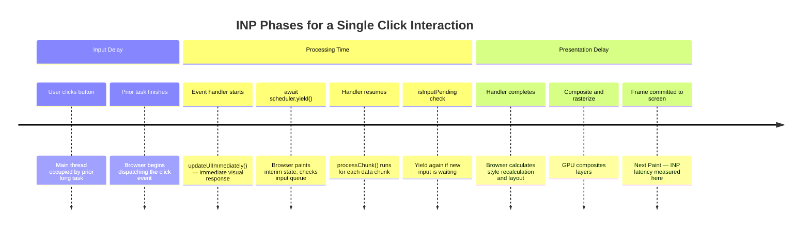

# INP Deep Dive: Interaction to Next Paint

Interaction to Next Paint (INP) became a Core Web Vital in March 2024, replacing First Input Delay (FID). INP measures the latency of all interactions on a page during the user's visit — clicks, taps, and key presses — and reports the worst-case interaction latency (with some outlier trimming for pages with many interactions). FID only measured the first interaction; INP measures all of them, making it a far more comprehensive indicator of how responsive a page is throughout the entire user session, not just at the moment the page first becomes interactive. This change reflects Google's recognition that users form impressions of page speed based on ongoing responsiveness, not first impressions alone.

An interaction's latency is divided into three phases: input delay (the time between the user's action and when the browser starts running event handlers), processing time (the time event handlers take to run), and presentation delay (the time for the browser to render and paint the updated frame after handlers complete). INP is the sum of these three phases for the worst interaction observed during the session. Each phase is a distinct optimization target with different root causes and different remedies. Teams that conflate them tend to address only processing time while leaving input delay and presentation delay unexamined, which produces partial improvements that may not move the field metric.

Google's INP thresholds are: good is under 200ms, needs improvement is 200–500ms, and poor is over 500ms. An INP of 300ms means the user had at least one interaction during their session that took 300ms from their action to the next painted frame. For most applications, the largest contributor is processing time — long event handlers, synchronous rendering updates, or layout thrash triggered by handler code. However, on pages that load significant JavaScript over time, input delay can grow substantially as the main thread becomes occupied with deferred script evaluation, hydration work, and accumulated timer callbacks that fire at the precise moment the user interacts. Understanding each phase and measuring it independently is the foundation of effective INP optimization.

## Principle

Engineers MUST measure INP in the field using real user monitoring (RUM) rather than relying solely on lab measurements. INP is a statistical metric that reflects the worst interaction over a full session; lab tests that exercise a single interaction do not capture the performance degradation that occurs mid-session after JavaScript has been running for minutes and the main thread has accumulated microtask queues, cached state, and deferred work. The Chrome User Experience Report (CrUX) and RUM tools such as the `web-vitals` library are the authoritative sources for field INP data, and they MUST be consulted before concluding that a page's interaction responsiveness is acceptable. A Lighthouse score does not substitute for field data.

Engineers SHOULD break up long tasks that block the main thread during interaction event handlers using `scheduler.yield()` (or `setTimeout(0)` as a fallback) to yield control to the browser between processing chunks. A single event handler that runs synchronously for 400ms produces an INP of at least 400ms for every user who triggers that interaction. Yielding between processing units allows the browser to process other events, update the UI, and respond to higher-priority user input between chunks, which reduces the worst-case interaction latency even when the total amount of work remains unchanged. Engineers SHOULD also profile all three INP phases independently rather than assuming processing time alone is the bottleneck.

## Design Thinking

### The three INP phases and their root causes

Understanding which of the three phases dominates an interaction's latency is the prerequisite for choosing the correct optimization. Input delay is the gap between when the user acts and when the browser begins running event handlers. It is caused by a long task already running on the main thread at the moment of the interaction — script evaluation, a large `setTimeout` callback, or a previous handler that has not yet finished. Reducing input delay means reducing main-thread occupancy at interaction time: break up long initialization tasks, avoid heavy script evaluation during periods when users are likely to interact, defer non-urgent background work, and avoid scheduling CPU-intensive work in `requestAnimationFrame` callbacks that will run at exactly the wrong moment.

Processing time is the duration of the event handlers themselves. This is the phase most visible to developers because it appears as a JavaScript call stack in the DevTools Performance panel. Long processing time is caused by handlers that iterate large collections, run synchronous DOM queries, trigger forced style recalculation and layout (layout thrash), or orchestrate complex state updates across many components. The remedy is to identify the expensive work, split it into smaller chunks separated by `await scheduler.yield()` calls, keep each chunk under 50ms, and defer truly non-critical work — analytics logging, state persistence, background synchronization — until after the visual update is committed to the browser.

Presentation delay is the time from when the last event handler completes to when the browser has painted the updated frame on screen. This phase grows when handlers make many small DOM mutations that force multiple style recalculation and layout passes, when large CSS animations or transitions are triggered in response to the interaction, or when compositing is required for newly visible elements that lack their own compositing layer. Reducing presentation delay means batching DOM reads and writes so the browser computes layout once per frame, avoiding the interleaving of layout-triggering reads (such as `offsetHeight`, `getBoundingClientRect`, or `scrollTop`) with DOM writes, and keeping paint areas small by using CSS properties that promote elements to their own compositor layers (`will-change`, `transform`, `opacity`) for animations that are known to be expensive.

### scheduler.yield() and the Scheduler API

`await scheduler.yield()` is the primary tool for breaking up long event handlers without abandoning the handler's execution context or losing user-activation state. When the browser executes `await scheduler.yield()`, it suspends the handler, places it back in the task queue at a high priority, and allows any pending rendering work, input events, or higher-priority tasks to run before resuming the handler. This is superior to `setTimeout(0)` in several respects: `scheduler.yield()` preserves the user-activation state required for certain browser APIs such as `window.open` and `navigator.clipboard.write`, it is scheduled at a higher priority than `setTimeout` callbacks so the handler resumes faster, and it integrates with the browser's built-in task scheduling model rather than bypassing it with a coarse timer.

The Scheduler API (`scheduler.postTask`) extends this by allowing work to be posted with an explicit priority: `'user-blocking'` for work that should run before any other task, `'user-visible'` (the default) for work that should run in the next frame, and `'background'` for work that should only run when the main thread is idle. Teams can use `scheduler.postTask('background', callback)` as a higher-fidelity alternative to `requestIdleCallback` for deferring analytics and logging to idle time, with the added benefit of task cancellation via an `AbortSignal`. The API is available in Chrome 94+ and has limited support in other browsers; use a capability check and a `setTimeout` fallback when targeting broader audiences.

### isInputPending

`navigator.scheduling.isInputPending()` provides a way for a long processing loop to check whether new user input has arrived before deciding whether to yield. If `isInputPending()` returns `true`, the loop should immediately yield via `scheduler.yield()` so the browser can process the pending input event without waiting for the current chunk to complete. If it returns `false`, the loop may continue processing the current chunk without yielding, which avoids the scheduling overhead of unnecessary yields when no input is waiting. This conditional yield pattern is most useful in tight processing loops where yielding on every iteration would be too frequent and the total work per iteration is modest but cumulative.

The API has limited cross-browser support as of 2026 and must always be guarded by a capability check: `navigator.scheduling?.isInputPending()`. Calling it without a guard throws a TypeError in browsers that do not implement it. In environments where the API is unavailable, the safest fallback is to yield unconditionally after each chunk using `await scheduler.yield()` or a `setTimeout(0)` promise. The overhead of extra yields is almost always preferable to the cost of failing to yield and delivering a poor INP score to users.

### Profiling INP in Chrome DevTools

The Chrome DevTools Performance panel is the primary tool for diagnosing slow interactions. Recording a performance profile while performing the target interaction captures the full timeline of activity. The Interactions track at the top of the timeline shows each recorded interaction with its total duration, color-coded by severity; clicking an interaction highlights the corresponding activity on the Main thread track. Long Tasks are highlighted with a red triangle in the corner of the Main thread track. Reading the call stack under a Long Task reveals which function is responsible for the delay and how long each function takes.

The Long Animation Frames (LoAF) API, accessible via `PerformanceLongAnimationFrameObserver` (Chrome 123+), records any frame that takes longer than 50ms to render and includes a detailed breakdown of the scripts that contributed to it — function name, source URL, and duration. This makes it easier to identify the specific handler or callback that caused the delay without needing to manually search the performance profile. The observer can be set up in production via a RUM collection script to capture LoAF data from real user sessions, not just from developer profiling sessions.

The `web-vitals` library's `onINP` callback provides field-collected attribution data that is invaluable for production diagnosis. It reports the interaction's target element selector, event type, and the breakdown of input delay, processing time, and presentation delay for the worst interaction in the session. This attribution tells developers which element the user clicked (or tapped or typed in), what kind of event it was, and which phase of the interaction was slowest — all without requiring the developer to reproduce the exact interaction in a profiling session. Pairing `onINP` attribution data from field RUM with targeted lab profiling in DevTools using that specific interaction gives the most efficient path to a fix.

### INP vs. TBT (Total Blocking Time)

Total Blocking Time (TBT) is a Lighthouse lab metric that measures the total time the main thread was blocked by tasks longer than 50ms during the load phase — specifically from First Contentful Paint to Time to Interactive. TBT is a useful proxy for INP in lab environments because both metrics are sensitive to long main-thread tasks: reducing long tasks during the load phase tends to reduce both TBT and INP. This correlation is why Lighthouse scores sometimes correlate with field INP improvements, and why teams working on Lighthouse scores often see real-world INP improvements as a side effect.

However, TBT and INP are not the same measurement, and a good TBT score does not guarantee a good INP. TBT can be excellent while INP is poor when expensive interactions occur well after the initial load window that TBT measures. A page that finishes loading quickly and scores well in Lighthouse can still have poor INP if user interactions trigger long event handlers, if client-side routing causes heavy script evaluation when the user navigates to a new route, if a virtual list or data grid processes large data sets when the user filters or sorts, or if background timers accumulate main-thread work after the load phase. The measurement window of TBT (load phase only) excludes this entire category of interaction-time performance problems. Field INP from CrUX or RUM is the only metric that captures these post-load interaction costs.

### INP attribution and field debugging workflow

The most efficient workflow for fixing poor field INP is: collect attribution data in RUM, identify the most impactful interaction by element and event type, reproduce that interaction in a DevTools profiling session, identify the dominant INP phase, and apply the appropriate optimization. Without attribution data, developers tend to guess which interaction is slow and optimize the wrong one. The `web-vitals` library's `onINP` with the `reportAllChanges: true` option reports each new worst interaction as the session progresses, which helps identify not just the final worst interaction but also which interactions tend to cluster near the INP threshold. Sending this data to an analytics endpoint allows teams to build dashboards that show INP distribution by page, by element, by event type, and by device class — the foundation of systematic INP improvement at scale.

## Best Practices

**MUST measure INP using real user monitoring, not only lab tools.** Lighthouse and PageSpeed Insights measure simulated, single-interaction performance within the load window. Field INP from CrUX or the `web-vitals` library reflects actual user sessions across all interactions, all devices, and all network conditions encountered during a real visit. A page that scores well in Lighthouse may have poor field INP if its most frequently triggered interactions — form submissions, filter controls, navigation menus, data table interactions — involve slow event handlers that lab tests never exercise. Collecting attribution data alongside the INP value is essential for identifying which interaction and which phase to optimize first.

**SHOULD use `await scheduler.yield()` to break up event handlers that perform more than approximately 50ms of synchronous work.** The 50ms threshold comes from the Long Task definition: any main-thread task longer than 50ms blocks the browser from responding to input for a perceptible duration. Handlers that iterate large data sets, compute complex derived state, run multiple synchronous DOM updates, or orchestrate cross-component state changes should yield between logical processing units to keep each chunk under 50ms. Where `scheduler.yield()` is unavailable, a `Promise`-wrapped `setTimeout(0)` provides a cross-browser fallback. The handler pattern is: perform the immediate visual response, yield, process data in chunks with conditional yields when `isInputPending()` is true, then finalize the update.

**SHOULD defer non-critical work triggered by user interactions to `requestIdleCallback` or a `setTimeout(0)` after the visual update is committed.** Analytics logging, state persistence to `localStorage`, cache invalidation, and background synchronization do not need to block the frame that immediately follows the user's action. Scheduling them after the frame update eliminates their contribution to processing time and presentation delay, which reduces INP without changing the outcome of the interaction from the user's perspective. Use `scheduler.postTask('background', fn)` where available for more precise priority control and cancellability over `requestIdleCallback`.

## Visual



## Example

```js
// Break a long click handler with scheduler.yield() to keep INP under 200ms.
// Pattern: visual response first → yield → chunked processing with conditional yields.
// Requires Chrome 115+ for scheduler.yield(); falls back to setTimeout(0) elsewhere.

const yieldToMain = () =>
  typeof scheduler !== 'undefined' && scheduler.yield
    ? scheduler.yield()
    : new Promise((resolve) => setTimeout(resolve, 0));

button.addEventListener('click', async () => {
  // 1. Perform the immediate visual response BEFORE any heavy work so
  //    the user sees feedback as fast as possible.
  updateUIImmediately();

  // 2. Yield to let the browser paint the interim visual state and
  //    process any queued rendering work before we start heavy processing.
  await yieldToMain();

  // 3. Process data in chunks. Check for pending input between each chunk
  //    to avoid delaying a new interaction while we are still working.
  for (const chunk of largeDataChunks) {
    processChunk(chunk);

    if (navigator.scheduling?.isInputPending()) {
      // New input arrived — yield immediately so the browser handles it
      // before we continue with the next chunk.
      await yieldToMain();
    }
  }

  // 4. Finalize the update after all chunks are processed.
  finalizeUpdate();

  // 5. Defer non-critical follow-up work until the browser is idle so it
  //    does not contribute to this interaction's presentation delay.
  requestIdleCallback(() => logAnalyticsEvent('button_clicked'), { timeout: 2000 });
});
```

## Common Mistakes

- **Measuring INP only in Lighthouse or PageSpeed Insights.** Lab tools simulate a single interaction at load time and cannot capture slow handlers that only occur mid-session, after client-side hydration completes, or during route transitions. Field data from CrUX or `web-vitals` is required.
- **Treating TBT as equivalent to INP.** A good TBT score means the load phase had few long tasks; it says nothing about the performance of interactions that happen after the load phase. INP and TBT can diverge significantly on SPAs with heavy route-level code execution.
- **Yielding at the top of the handler before the visual response.** Yielding should happen after the immediate visual update (`updateUIImmediately()`) so the user sees feedback as quickly as possible. Yielding first delays the visible response without reducing the amount of subsequent work.
- **Omitting the `navigator.scheduling` capability check before calling `isInputPending()`.** The API is not universally supported; calling it without an optional chaining guard throws a TypeError in unsupported browsers.
- **Deferring all follow-up work with `requestIdleCallback` without a `timeout` option.** `requestIdleCallback` without a timeout may not fire for several seconds on a busy page. Pass `{ timeout: 1000 }` or `{ timeout: 2000 }` for work that must run reasonably soon, or use `setTimeout(0)` for work that should run after the current frame.
- **Ignoring presentation delay as an optimization target.** Teams that optimize event handler duration but leave layout-thrashing DOM mutation patterns in place — interleaving `getBoundingClientRect` reads with style writes in a loop — will see only partial INP improvement, because presentation delay can exceed processing time on complex, deeply nested component trees.
- **Not collecting INP attribution data in production.** Without knowing which element, event type, and INP phase is responsible for the worst interaction, optimization efforts are guided by guesswork. The `onINP` callback in `web-vitals` provides this data with minimal overhead and should be part of every production RUM setup.

## Related FEEs

- [FEE-700 — Rendering & Performance Overview](./700.md)
- [FEE-704 — Core Web Vitals & Performance Metrics](./704.md)
- [FEE-712 — Critical Rendering Path & Paint Timing](./712.md)
- [FEE-301 — Event Loop & Async Model](../JavaScript%20Language%20and%20Runtime/301.md)

## References

- web.dev INP — https://web.dev/articles/inp
- web.dev Optimize INP — https://web.dev/articles/optimize-inp
- Chrome Developers: scheduler.yield() — https://developer.chrome.com/blog/scheduler-yield-origin-trial
- MDN PerformanceLongAnimationFrameObserver — https://developer.mozilla.org/en-US/docs/Web/API/PerformanceLongAnimationFrameObserver
